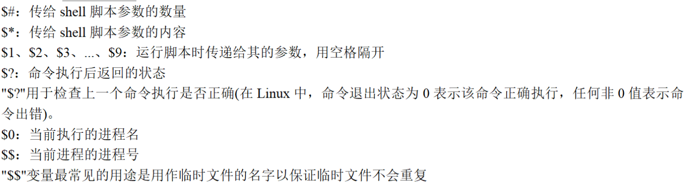

# Shell脚本语言

脚本：本质上是一个文件。

文件里面存放的是 **特定格式的指令**，系统可以使用脚本解析器 翻译或解析 指令 并执行（它不需要编译）

shell 既是<font color='red'>应用程序 </font>又是一种<font color='red'>脚本语言</font>（应用程序 解析 脚本语言）

> shell 接收来自用户的命令，与内核进行沟通


## 1. Shell命令解释器

- sh
- bash
- ash

> 查询ubuntu中的shell命令解释器


## 2. 脚本的调用形式

​		一打开终端，自动调用： `/etc/profile`或`~/.bashrc`

### 2.1 /etc/profile

​		此文件**为系统的每个用户设置环境信息**。当用户第一次登录时,该文件被执行。

- 设置系统的公共环境变量
- 设置开机自启动的程序

### 2.2 ~/.bashrc

​		用户home目录中的.bashrc。登录时会自动调用，打开任意终端时也会自动调用。

- 这个文件一般设置**与个人用户有关的环境变量**，如交叉编译器的路径等等


## 3. Shell语法

1. shell文件中，首先声明脚本由哪个命令解释器解释执行，否则使用默认shell
2. 注释，使用"#"符号

```shell
#!/bin/bash
echo "Hello world!"

# wq保存退出后
# 给文件修改权限   
# chmod +x hello.sh
# 执行 ./hello.sh
```

### 3.1 变量

> 注意事项：
>
> 1. <font color='red'>**变量名只能包含英文字母、下划线，不能以数字开头**</font>
> 2. 等号两边不能直接接空格符，若变量中本身就包含了空格，则整个字符串都要用双引号、或单引号括起来
> 3. 双引号 单引号的区别：
>    - 双引号：可以解析变量的值     echo ”num=$num"
>    - 单引号：不能解析变量的值，当成字符串处理     echo 'num=$num'   

- 定义变量：变量名=变量值             
  - 只读变量：readonly name val
- 引用变量：$变量名
- 清除变量值：unset 变量名

```sh
#!/bin/bash
num=100
echo $num  # 输出100
unset num
echo $num  # 值为空

# 从键盘读取
echo "请输入num："
read num   
echo $num

# 在一行上显示和添加提示 需要加上 -p
read -p num2
echo $num2

# 读取多个值
read val1 val2 val3
echo "val1=$val1"
echo "val2=$val2"
echo "val3=$val3"

```


#### 预设变量

shell直接提供无需定义的变量




https://blog.csdn.net/weixin_43288201/article/details/105643692


https://github.com/auspbro/ebook-c/blob/master/C%20%E5%AD%A6%E4%B9%A0%E7%AC%94%E8%AE%B0.pdf


- 查看系统环境变量


### 3.2 export 环境变量

> 由于进程间不共享变量，export 变量将其变为全局，共享使用。

让其他shell脚本识别该变量，设为全局变量

比如，如果想在PATH变量中 追加一个路径写法如下

```
export PATH=$PATH:/需要添加的路径
```

- **source file.sh**

作用: 在当前bash环境下读取并执行file.sh中的命令。 <font color='red'>如:source .bash_rc 与 . .bash_rc 是等效的。</font>

> source在当前bash环境（打开终端启动的bash）下执行命令，而脚本是启动一个子shell来执行命令。
>
> 这样如果把设置环境变量(或alias等等)的命令写进脚本中，就只会影响子shell，无法改变当前的BASH，所以**<font color='red'>通过文件(命令列)设置环境变量时，要用source 命令。</font>**

```sh
#!/bin/bash
expor DATA=250
```

- source `hello.sh`启动的进程信息

  ```cmd
  ps -elf
  ```


- `./hello.sh`启动的进程信息


**source 是用于使文件中设置的export 环境变量生效**


## 4. 执行方式

### 4.1 ./xxx.sh

​		先按sh文件中`#!`指定的命令解析器解析。若不存在，则使用系统默认的解析器。

### 4.2 bash xxx.sh

​		指定先用`bash`解析器执行，若bash不存在，则使用系统默认的解析器。

### 4.3 . xxx.sh or source ./xxx.sh

​		两者等价。直接使用默认解析器解析（不会执行第一行的#！指定的解析器）但是第一行还是要写的


三种执行情况：

​		打开终端就会有以后个解释器，我们称为当前解释器

​		我们指定解析器的时候（使用 ./xxx.sh 或 bash xxx.sh）时会创建一个子shell解析脚本

