# Shell脚本语言

脚本：本质上是一个文件。

文件里面存放的是 **特定格式的指令**，系统可以使用脚本解析器 翻译或解析 指令 并执行（它不需要编译）

shell 既是<font color='red'>应用程序 </font>又是一种<font color='red'>脚本语言</font>（应用程序 解析 脚本语言）

> shell 接收来自用户的命令，与内核进行沟通


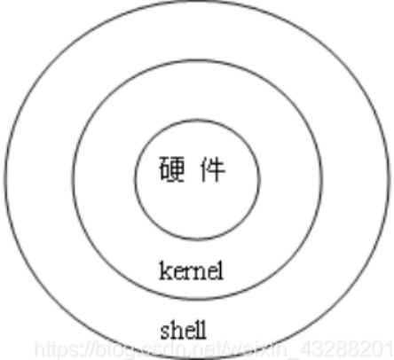

## 1. Shell命令解释器

- sh
- bash
- ash

> 查询ubuntu中的shell命令解释器

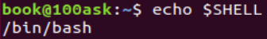


## 2. 脚本的调用形式

​		一打开终端，自动调用： `/etc/profile`或`~/.bashrc`

### 2.1 /etc/profile

​		此文件**为系统的每个用户设置环境信息**。当用户第一次登录时,该文件被执行。

- 设置系统的公共环境变量
- 设置开机自启动的程序

### 2.2 ~/.bashrc

​		用户home目录中的.bashrc。登录时会自动调用，打开任意终端时也会自动调用。

- 这个文件一般设置**与个人用户有关的环境变量**，如交叉编译器的路径等等


## 3. Shell语法

1. shell文件中，首先声明脚本由哪个命令解释器解释执行，否则使用默认shell
2. 注释，使用"#"符号

```shell
#!/bin/bash
echo "Hello world!"

# wq保存退出后
# 给文件修改权限   
# chmod +x hello.sh
# 执行 ./hello.sh
```

### 3.1 变量

#### 3.1.1 声明变量

> 注意事项：
>
> 1. <font color='red'>**变量名只能包含英文字母、下划线，不能以数字开头**</font>
> 2. 等号两边不能直接接空格符，若变量中本身就包含了空格，则整个字符串都要用双引号、或单引号括起来
> 3. 双引号 单引号的区别：
>    - 双引号：可以解析变量的值     echo ”num=$num"
>    - 单引号：不能解析变量的值，当成字符串处理     echo 'num=$num'   

- 定义变量：变量名=变量值             
  - 只读变量：readonly name val
- 引用变量：$变量名
- 清除变量值：unset 变量名

```sh
#!/bin/bash
num=100
echo $num  # 输出100
unset num
echo $num  # 值为空
```


##### 3.1.1.1 从终端读取赋值

```sh
# 从键盘读取
echo "请输入num："
read num   
echo $num

# 在一行上显示和添加提示 需要加上 -p
read -p num2
echo $num2

# 读取多个值
read val1 val2 val3
echo "val1=$val1"
echo "val2=$val2"
echo "val3=$val3"
```


#### 3.1.2 预设变量

shell直接提供无需定义的变量

```shell
#!/bin/bash
echo "参数个数=$#"
echo "参数内容=$*"
echo "第一个参数：$1"
echo "第二个参数：$2"
echo "第三个参数：$3"

readonly data=10
data=250
echo "data=250的结果：$?"
echo “进程名:$0 进程号：$$”
```

```cmd
 hello world heihei

# 输出
参数个数=3
参数内容=hello world heihei
第一个参数：hello
第二个参数：world
第三个参数：heihei
data=250的结果：1
进程名:./test.sh 进程号：10491
```

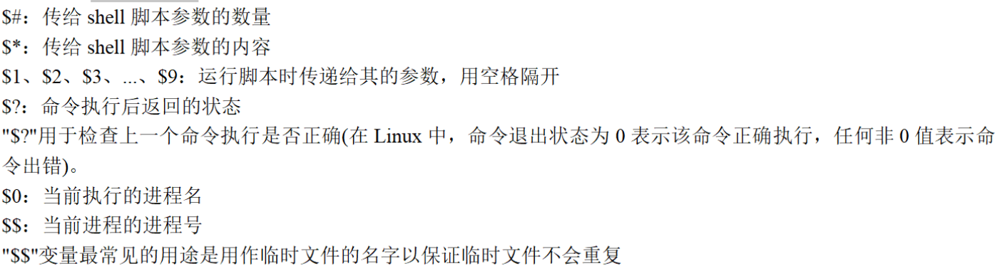


#### 3.1.3 变量的扩展

##### 3.1.3.1 判断变量是否存在

${num:-val}：若变量num不存在，则输出自定义val值；否则，输出num变量的值

```shell
#!/bin/bash
echo ${num:-100} # 100 由于变量num未声明，输出自定义值
num=200
echo ${num:-100} # 200 此时，变量num声明并初始化了，输出其值
```


##### 3.1.3.2 字符串的操作

```shell
#!/bin/bash
str="hehe:haha:xixi:enen"

# 1.获取字符串长度
echo "获取字符串str的长度：${#str}"                             #输出：19

# 2.字符串截取
echo "从字符串str下标为3的位置 ，获取子串：${str:3}"              #输出：e:haha:xixi:enen
echo "从字符串str下标为3的位置 ，获取长度为6的子串：${str:3：6}"    #输出：e:haha

# 3.字符串替换
# ${str/old/new}: 用new子串替换str中第一个出现的old子串
echo ${str/:/#} #                                            #输出：hehe#haha:xixi:enen
# ${str//old/new}: 用new子串替换str中所有的old子串
echo ${str//:/#} #                                           #输出：hehe#haha#xixi#enen
```


### 3.2 特殊字符

Bash 只有一种数据类型，即字符串。用户输入的数据，Bash 都视为字符串。

#### 3.2.1 单引号（'）

' '（单引号）：用于保留字符的字面含义，特殊字符在单引号里面，都会变为普通字符，例如 `*`、`$`、反斜杠 (`\`) 等。

> 单引号中的内容，只当作字符串处理。

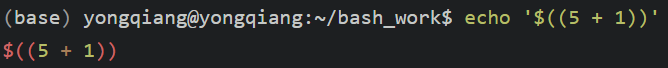

#### 3.2.2 双引号（"）

“ ”（双引号）：反引号` (')、$、反斜杠 (/) `三个特殊字符会被 Bash 自动扩展。`$` 符号用于引用变量，反引号用于执行子命令。反斜杠在双引号之中用来转义。

> 双引号中，包含的变量会被解释。

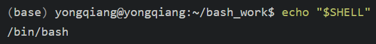

#### 3.2.3 反引号（`）

``(反引号)：调用命令或者将命令的输出赋予变量，则必须使用反引号包含命令，这样命令才会执行。**反引号的作用和 $(命令) 是一样的，反引号容易和单引号混淆，推荐使用 $(命令) 的方式调用命令。**

> 反引号内容，作为系统命令，并执行其内容


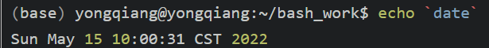

#### 3.2.4 转义字符（\）

`\n、\t、\r、\a`等echo命令，需要加`-e`来转义。


#### 3.2.5 （）和{}中的命令序列

- （命令序列）

  <font color='red'>由子shell来完成</font>，不会影响当前shell中的变量。

  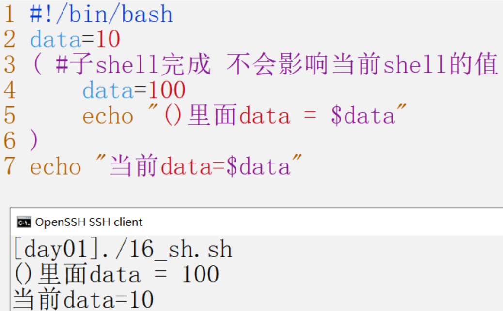

- {命令序列}
  <font color='red'>在当前shell中执行</font>，<font color='red'>会影响</font>当前变量。

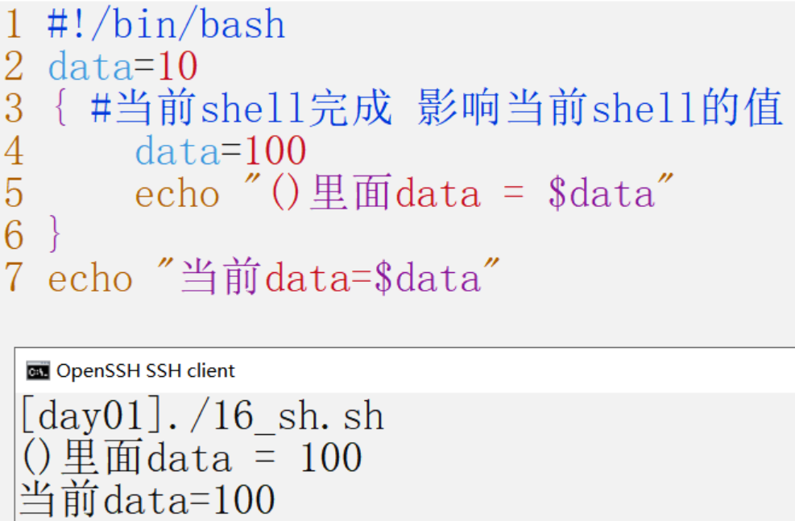


https://github.com/auspbro/ebook-c/blob/master/C%20%E5%AD%A6%E4%B9%A0%E7%AC%94%E8%AE%B0.pdf


- 查看系统环境变量

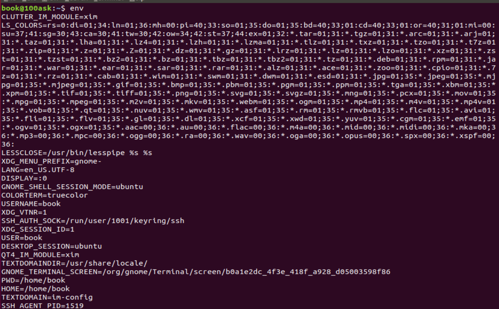

### 3.3 export 环境变量

> 由于进程间不共享变量，export 变量将其变为全局，共享使用。

让其他shell脚本识别该变量，设为全局变量

比如，如果想在PATH变量中 追加一个路径写法如下

```
export PATH=$PATH:/需要添加的路径
```

- **source file.sh**

作用: 在当前bash环境下读取并执行file.sh中的命令。 <font color='red'>如:source .bash_rc 与 . .bash_rc 是等效的。</font>

> source在当前bash环境（打开终端启动的bash）下执行命令，而脚本是启动一个子shell来执行命令。
>
> 这样如果把设置环境变量(或alias等等)的命令写进脚本中，就只会影响子shell，无法改变当前的BASH，所以**<font color='red'>通过文件(命令列)设置环境变量时，要用source 命令。</font>**

```sh
#!/bin/bash
expor DATA=250
```

- source `hello.sh`启动的进程信息

  ```cmd
  ps -elf
  ```


- `./hello.sh`启动的进程信息


**source 是用于使文件中设置的export 环境变量生效**

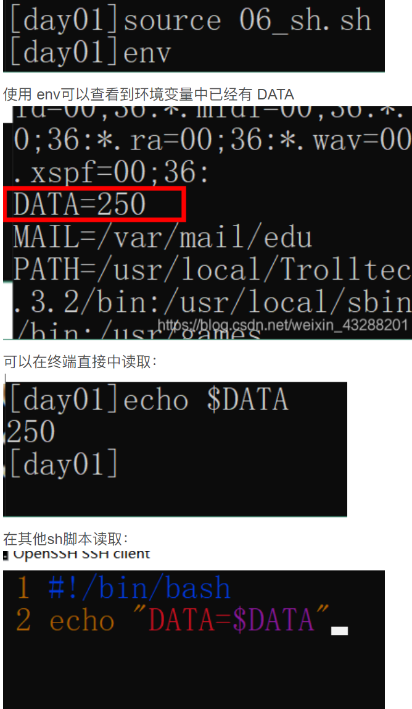


### 3.4 控制语句

#### 3.4.1 if

```shell
格式一：
if [条件1]; then
    执行第一段程序
else
    执行第二段程序
fi

格式二：
if [条件1]; then
    执行第一段程序
elif [条件2]；then
执行第二段程序
else
    执行第三段程序
fi
```

【示例】：判断当前路径下有没有文件夹 有就进入创建文件 没有 就创建文件夹 再进入创建文件

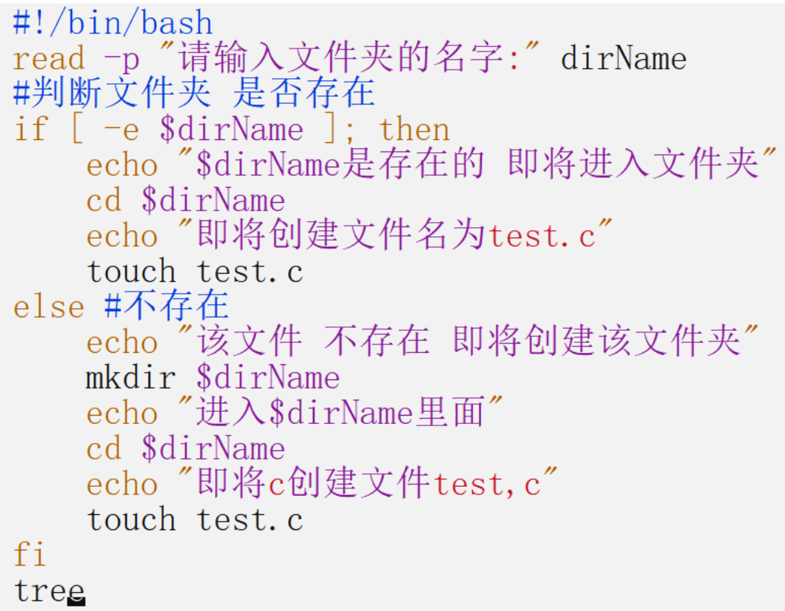


#### 3.4.2 case

```sh
case $变量名 in
	"第一个变量内容")
		程序段一
		;;
	"第二个变量内容")
		程序段二
		;;
	*)
		其他程序段
		exit 1
esac
```

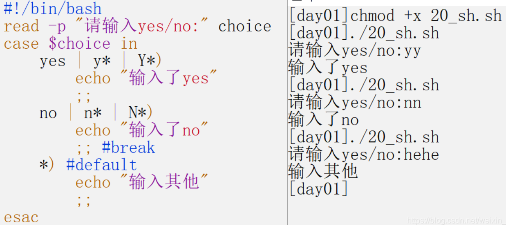

#### 3.4.3 for

```sh
# 第一种
for ((初始值; 限制值; 执行步阶))
	do
		程序段
	done
	

# 第二种 第一次Svar值为con1、第二次值为con2
for var in con1 con2 con3 ...
	do
		程序段
	done
```

> <font color='red'>declare 是bash的一个内建命令，可用来声明shell变量、设置变量的属性</font>。也可写作typeset。
>
> ​		如：declare -i s：强制把变量s当作int类型参数

**【第一种形式】**

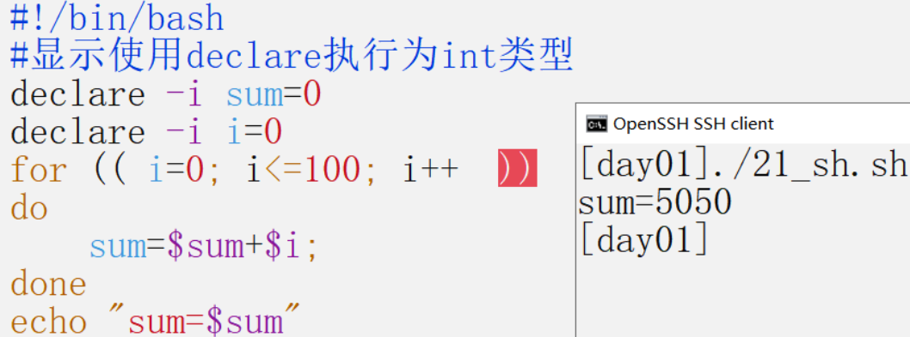

**【第二种形式】**

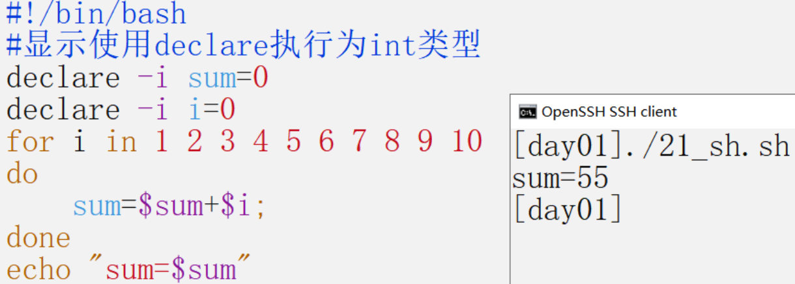


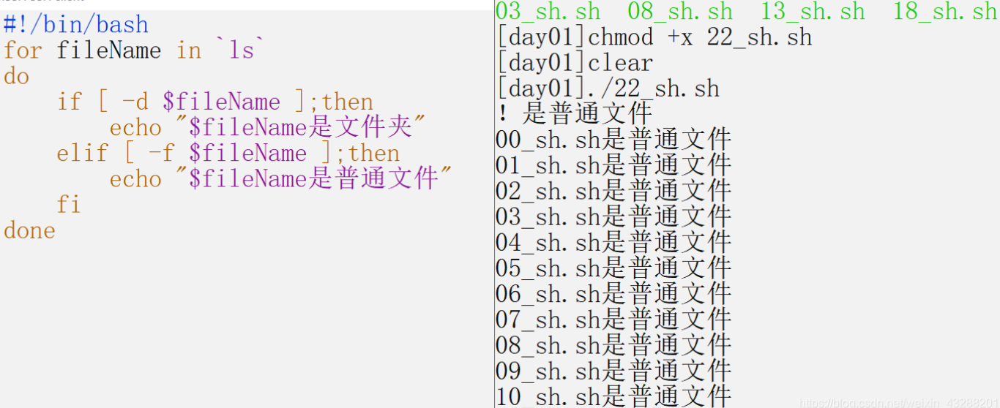

#### 3.4.4 while

```sh
while [condition]
	do
		程序段
	done
```

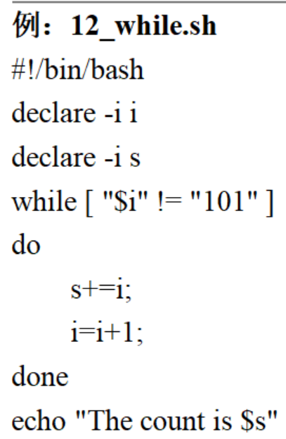

#### 3.4.5 until

当condition条件成立时，退出循环。不成立，则一直循环。与while相反

```sh
until [condition]
	do
		程序段
	done
```

#### 3.4.6 break continue


### 3.5 函数

所有函数在使用前必须定义，必须将函数放在脚本开始部分，直至shell解释器首次发现它时，才可以使用

- 函数定义

```sh
# 格式一
函数名(){
	命令 ...
}

# 格式二
function 函数名(){
	命令 ...
}
```

- 函数调用格式

```
函数名 param1 param2 ...
```

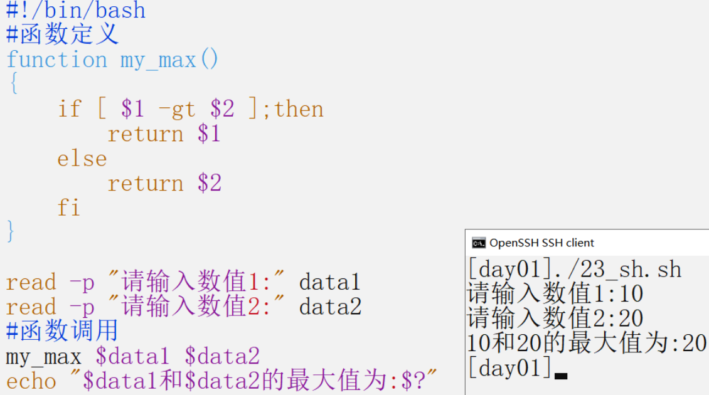

分文件形式：比如，函数定义放fun.sh，函数调用放24_sh.sh

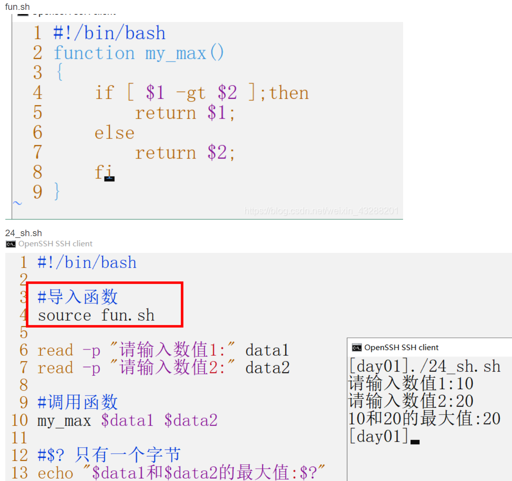


## 4. 条件测试

test命令：用于测试字符串、文件状态和数字

test命令有两种格式:

- test condition 
- [ condition ]    `使用方括号时，要注意在condition两边加上空格。`


### 4.1 文件测试

测试文件状态的条件表达式：

> -e:  是否存在   -s：文件非空
>
> -d：是目录      -f：是文件
>
> -r：可读          -w：可写         -x：可执行
>
> -L：符号链接  -c：是否字符设备  -b：是否块设备

【示例】

```sh
#!/bin/bash
read -p "请输入一个文件名" filename
#test -e $filename
[-e $filename]
echo $?
```

### 4.2 字符串测试

> str_operator： = （比较是否相等）  != (不相等)   -z（空串）   -n（非空串）

```sh
test str_operator "str"
test "str1" str_operator "str2"
[ str_operator "str"]
["str1" str_operator "str2"]
```

【示例】

```sh
#!/bin/bash
A="$1"
B="$2"

#判断字符串是否相等
if [ "$A" = "$B" ];then
echo "[ = ]"
fi

#判断字符串是否相等，与上面的=等价
if [ "$A" == "$B" ];then
echo "[ == ]"
fi

#字符串为空.就是长度为0.
if [ -z "$A" ];then
echo "[ -z ]"
fi
```


### 4.3 数值测试

> num_operator：-eq      -ne       -gt       -ge       -le       -lt

```
test num1 num_operator num2
[num1 num_operator num2]
```

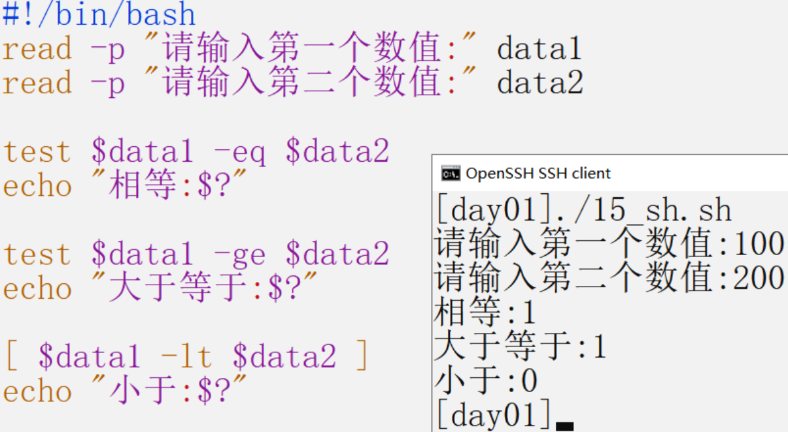

### 4.4 符合语句测试

命令控制：

- &&

```
command1 && command2
```

- ||

```
command1 || command2
```

- 多重条件判断

```sh
-a：相当于and  test -r file -a -x file
-o: 相当于or   test -r file -o -x file
!:  相当于非   test ! -x file
```


## 5. 执行方式

### 5.1 ./xxx.sh

 		先按sh文件中`#!`指定的命令解析器解析。若不存在，则使用系统默认的解析器。

### 5.2 bash xxx.sh

​		指定先用`bash`解析器执行，若bash不存在，则使用系统默认的解析器。

### 5.3 . xxx.sh 或 source ./xxx.sh

​		两者等价。直接使用默认解析器解析（不会执行第一行的#！指定的解析器）但是第一行还是要写的


三种执行情况：

​		打开终端就会有以后个解释器，我们称为当前解释器

​		我们指定解析器的时候（使用 ./xxx.sh 或 bash xxx.sh）时会创建一个子shell解析脚本

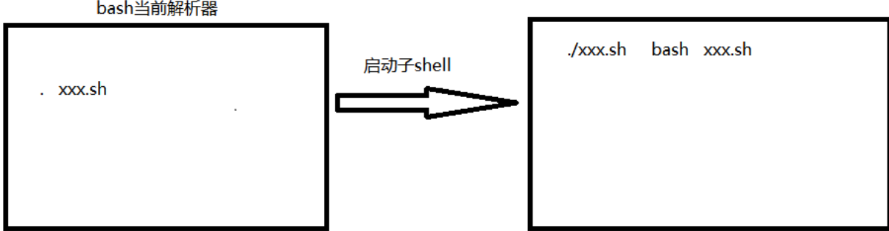

