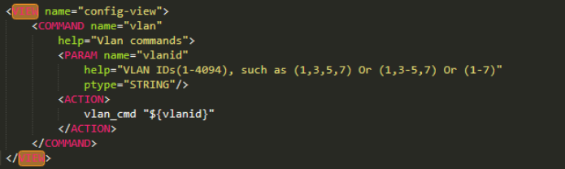
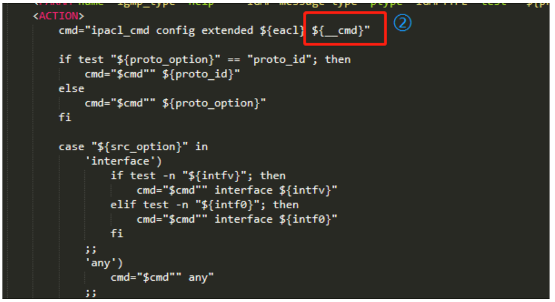

# **Klish命令使用说明**

# 1. 概述

## 1.1 模块概述

​		根据《klish新增需求设计说明》中，命令行使用的需求和说明文档规范，整理klish命令行的使用方法，合入《简单xml命令实现说明》的一些用法说明，全面的描述命令行使用时的注意事项和书写规范。

## 1.2 文档描述

针对目前使用的主要cmd命令，提供了案例和使用方法，书写cmd命令时可以作为参考，文章主要是第三章的说明。

第三章描述klish的功能使用方法；

## 1.3 术语说明

Klish: Kommand Line Interface Shell，是一个在 Unix 系统上实现了 Cisco 方式的命令行接口的框架，可通过XML进行配置，是 clish 的衍生版本。

- 标签：本文的标签，是指被‘< >’和‘< />’符号包括在内的部分，在html和xml使用中，有时也被称作元素，本文统一称为标签；例如<PARAM name="control_select" help="" ptype="SUBCOMMAND" mode="switch"/>，称为PARAM标签。


- 字段：也称为属性，指标签的‘< >’括号内定义的不同属性字段，例如<PARAM name="control_select" help="" ptype="SUBCOMMAND" mode="switch">中，我们称name为PARAM标签的一个属性字段，同理help、ptype、mode等都是PARAM标签的属性字段。


# 2. 参考文献

1. 王仁雷,改进klish实现等价命令行(2021).
2. 肖庆峰,请教一下linux路由器的klish自动登出机制，以及web和mib方案哪位同事清楚?(邮件)(2021.02.26).
3. klish.md,https://github.com/promovicz/klish/tree/promovicz/2.2/doc/klish.md.
4. 上海博达数据通信有限公司,简单xml命令实现说明(2021).
5. 类延增,klish新增需求设计说明(2021).
6. 类延增,klish功能说明表格(2022).

# 3. 命令行使用说明

## 3.1 准备工作

Klish命令行实现需要两个文件：用来实现klish命令行输入的**<font color='red'>xml文件</font>**、用来解析klish命令的命令行**<font color='red'>解析进程文件</font>**。


### 3.1.1 Xml文件说明

#### 3.1.1.1 功能描述

Xml文件用来定义命令行格式，添加新的命令，定义视图格式等。

#### 3.1.1.2 存放路径

xml文件放在`各自模块文件夹`，需要在cmake文件中指明安装路径，例如`hal.xml/hal_mac.xml/hal_qos.xml`等命令行实现文件，放到`${SWITCH_BASE}/user/local/hal文件夹`下，可以另建一个子文件夹，也可以共用根目录。 

对于xml文件，需要安装到系统的<font color='red'>**固定路径/usr/share/klish/文件夹**</font>下，书写时，可以使用全局环境宏变量‘KLISHXML’，例如：install(FILES device-config-olt.xml DESTINATION $ENV{KLISHXML})。

### 3.1.2 C文件说明

#### 3.1.2.1 功能描述

<font color='wildstrawberry'>c文件生成的appname</font>，作为<font color='wildstrawberry'>xml中的命令行的ACTION标签的脚本部分</font>，需要**保证名字一致**，而<font color='wildstrawberry'>c文件生成的可执行文件</font>正好是<font color='wildstrawberry'>shell需要启动并解析命令的进程</font>，文件由各个模块自己管理。

## 3.2 xml格式



以创建vlan为例简单介绍xml命令的各个常用标签。

### 3.2.1 VIEW标签

#### 3.2.1.1 功能描述

该标签决定当前命令是在什么模式下显示和使用。

- "enable-view"：enable模式。 `show命令、debug命令`
- "config-view"：config模式。  `全局配置命令`
- "config-if-view"：端口模式。` 端口配置命令`

#### 3.2.1.2 子标签

VIEW标签下可以包含的子标签有：

- NAMESPACE（多次）。
- **COMMAND（多次）。**
- HOTKEY（多次）。

#### 3.2.1.3 属性字段说明


在定义时，可以指定如下几个字段参数：

- **name:** 全局标识名称，在其他模块命令书写xml时，可以引用本名称，<font color='wildstrawberry'>例如示例中的config-view即为引用；</font>`包含字母、数字、连字符和下划线。但不能以下划线开头。`

- **prompt：**定义当前视图前缀提示符，当处于本view时（config-view），命令行输出的提示。例如config模式下，会显示switch(config)#等，可以在view定义中指定字符串格式；

  `prompt="${SYSTEM_NAME}(config)#"`     `SYSTEM_NAME 代表hostname`

- **depth：**嵌套视图深度，默认为0；它与[CONFIG]标签一起使用。 如果必须将命令写入配置，则视图的深度将在指定命令缩进，当前VIEW中的所有命令具有相同的深度，默认为0，目前不使用；

- **restore：**执行该视图命令恢复该视图方式，默认为none，值还有view、depth；

- access：该字段控制VIEW的访问权限。 如果访问被拒绝，则用户无法使用此VIEW中的[COMMAND]，目前该字段没有使用。

- syncpro：本view使用用的同步接口信息，必须为动态库接口，如果不设置，有同步需求时，使用全局的同步接口（STARTUP标签中设置）。

```xml
#（1）enable配置态
<VIEW name="enable-view" prompt="${SYSTEM_NAME}#">
</VIEW>

#（2）Config配置态
<VIEW name="config-view" prompt="${SYSTEM_NAME}(config)#"
	restore="depth"
	depth="1"> # 视图深度，默认为0，深度按照视图嵌套层数递增定义
	
	# 视图命令继承设置
	<NAMESPACE ref="enable-view" 
		help="true"
		completion="true"/>
</VIEW>
```


### 3.2.2 COMMAND命令行

#### 3.2.2.1 功能描述

COMMAND标签主要用来**定义命令**，如果定义的命令需要使用命令级别和用户权限功能，相关模块需要把命令加入到privilege.xml的可配置权限参数中。


1. 简单命令头定义

该命令只起命令提示作用，本身没有action动作

```xml
<COMMAND name="show" help="Show running system information"/>
```


2. 不带参数命令定义

```xml
<COMMAND name="write"
	help="Save current configuration">
	<ACTION>klish-dumpconfig -w /etc/sysconfig/startup-config</ACTION>
</COMMAND>
```


3. 带参数命令定义

```xml
<COMMAND name="ip route" help="Static route">
	<PARAM name="ip" help="Destination prefix" ptype="IP_ADDR"/>
	<PARAM name="mask" help="Destination mask" ptype="IP_ADDR"/>
	<PARAM name="route_target" help="Route target" ptype="STRING" mode="switch">
		<PARAM name="nhip" help="Gateway IP address" ptype="IP_ADDR"/>
		<PARAM name="nhif" help="Gateway interface" ptype="IFACE_ALL"/>
    </PARAM>
	<PARAM name="distance" help="Distance metric for this route" ptype="UINT_RT_DISTANCE" optional="true"/>
	<PARAM name="tag" help="Tag for this route" ptype="SUBCOMMAND" mode="subcommand" optional="true">
		<PARAM name="tagval" help="Tag value" ptype="UINT_NOZERO"/>
	</PARAM>
	<ACTION>
		vtysh -d "staticd" -c "configure terminal" -c "${__line}"
	</ACTION>
</COMMAND>
```

4. 不传递参数进入视图类命令定义

```xml
<COMMAND name="config"
	help="Enter configuration mode"
	inherit="false"
	view="config-view">
</COMMAND>
```


5. 传递参数进入视图类命令定义

```xml
<COMMAND name="interface"
    help="Select an interface to configure"
    view="config-if-view"
    viewid="iface=${iface_name}">
    <PARAM name="iface_name"
        help="Interface name"
        ptype="IFACE_ALL"/>
    <ACTION>
        创建端口
    </ACTION>
</COMMAND>
```


#### 3.2.2.2 子标签

可以包含的子标签有：

- DETAIL（一次）；
- **PARAM（多次）；**
- CONFIG（一次）；
- **ACTION（一次）；**
- HELP（一次）；
- MASK（一次）；
- CMDCAP（一次）；

#### 3.2.2.3 属性字段说明

可以设置的字段及作用如下：

- **name：命令名称**，例如示例中的vlan，这里需要注意，如果之后需要规定命令级别和用户权限，需要把相应的名称加入到privileg的命令列表里；

- **help：帮助信息**，可以为空；

- **ref：**用于定义命令的别名。如果在COMMAND定义中使用了“ref”字段，则该命令不是独立的，而是别名；“ ref”设置的是原始目标命令的名称。 如果目标命令属于另一个视图而不是别名所属的视图（不在同一个视图），则必须在目标命令名称之后指定目标命令的视图。 即`ref=命令名称@视图名称`；

  

- **view：**输入命令正确后，切换到的目标view名称，例如输入interface g0/0/1后，会跳转到config-if-view视图；

  

- **viewid：**进入新视图传递的参数（可传多个），例如`config模式`跳转`端口视图`后，会**把端口号赋值记录**，**<font color='red'>iface=${iface_name}</font>**；

  ```cmd
  config#interface g0/0/1   # iface_name:g0/0/1
  ```

  

- **access：**命令执行权限。 如果访问被拒绝，则用户将无法使用命令；`目前本字段没有被使用，都是使用另一套命令级别和用户权限实现的；`

- **args：**命令后跟自定义的参数的名字，参数可以任意长度和格式，可以有空格；

- **args_help：**自定义参数的帮助信息；

- **args_hide：**自定义参数是否隐藏，隐藏后无帮助信息，默认不隐藏；

- **escape_chars：**自定义特殊转义字符，需要解析和替换的字符，一般用默认；

- **hide：**当前命令是否隐藏，默认”不隐藏“，设置为“true”时该命令隐藏。

- **ifneed：**端口命令可配关联端口设置，目前版本可选IF_NULL、IF_LOOPBACK、IF_TUNNEL、IF_VACCESS、IF_MULTILINK、IF_VLAN、IF_SSL、IF_PPPOE、IF_L2TPC、IF_FE、IF_GE、IF_TG、IF_SERIAL、IF_GRE、IF_VT、IF_SUBIF

- **inherit：**当前命令是否继承至更高级配置视图，默认继承interrupt：当前命令对应action执行是否需要获取信号，默认屏蔽信号

- **stdin：****是否需要获取前台终端输入信息**，默认为false

- lock：可以对当前命令行启用（true）或禁用（false）锁定机制；默认为false，即使用本命令时是不锁定的，可以同步执行其他命令；

- interrupt：“中断”字段指定[ACTION]脚本是用户可中断的还是不可中断的。 如果interrupt =“ true”，则脚本是可中断的，否则脚本是不可中断的。 对于不可中断的脚本，SIGINT和SIGQUIT被暂时阻止（从klish-1.4.0开始支持本功能）；

- dhelp：是否使用动态帮助信息，配置为true时，需要添加HELP子标签指明动态获取帮助信息的shell，默认为false；

- dmask：是否动态获取动态掩码，配置为true时，需要添加MASK子标签指明动态获取掩码信息的shell，默认为false；

- dymask：动态掩码信息，可以在写xml文件的时候指明，当没有配置动态获取的shell时，使用xml中配置的掩码。

- redn：是否对命令进行主备同步，默认为“false”，不主备同步，如果需要主备同步，需要主动设置为“true”，区分大小写。

- dcmdcap：是否支持动态验证命令是否支持，默认false，命令都是默认支持的，如果设置为true时，需要配置CMDCAP子标签，填写验证脚本。

- range_parse：进入view是range时，填写range分析接口，例如进入端口模式的range分析接口，解析接口会把range解析成一系列单个view端口的字符串供使用；

- rpcsync：是否进行rpc同步(成员同步)，默认为false，true时代表本命令需要进行rpc同步，同步的槽位等信息需要应用自己执行的时候填入u中，不填默认不同步；

- chelp：中文帮助信息。

  

### 3.2.3 PARAM

#### 3.2.3.1 功能描述

命令参数，用来定义命令参数。

#### 3.2.3.2 子标签

PARAM可以包含的子标签有：

- PARAM（多个）。
- HELP（一个）。
- MASK（多个）。

#### 3.2.3.3 属性字段说明


PARAM可以配置的字段和作用如下：

- **name：参数名称；**

- **help：帮助信息；**

- **ptype：数据类型，需要<font color='red'>引用已经定义好的ptype</font>**（注：如果ptype设置的为自定义数字类型如VLAN_ID/UINT等，注意mode不要设置为subcommand类型，不设置或者设置为command类型即可，否则会报错）；

  

  

- **mode：参数模式。**

  - common：普通参数的标准模式   默认为`common`
  - subcommand：该子命令通过其“name”（若有指定，也可为“value”字段）来识别，可用作可选标志或用于switch分支。若子命令被使用，那么该参数的值就是其名称（若有指定“值”字段，则为该字段的值）。若参数是可选的且未被使用，那么该参数的值未定义。
  - **switch：在多个子参数中选择一个**

- prefix：前缀；

- **optional：**参数是否可选，默认false；如果多个可选参数并列，可以乱序选择，没有选择到的还会再次显示，可以再选；

- **order：**和optional一起使用，如果设置为true，则<font color='red'>本参数被选择使用后，本参数之前的optional参数则无法再次选择和显示</font>，默认为false；

- **default：**默认缺省值；

- **value：**subcommand特殊字段；此字段用于分隔内部变量的名称和可显示的名称（用户输入的名称）。 “name”字段是内部变量的名称，“value”是可显示的子命令名称，它允许复用可显示的子命令名称，如果配置了value字段，则参数自动变成subcommand类型；<font color='red'>**用于参数提示相同名称的时候使用**</font>

- **hide：**控制参数是否隐藏，默认为否，需要隐藏时设置成“true”；

- **hidden：**控制参数是否隐藏，默认为否，需要隐藏时设置成“true”（注：说明文档中给出的为“hidden”，实际使用时hidden关键字没有效果，请使用“hide=‘true’”进行隐藏操作）；`对于${__line}、${__params}是否不可见`

- **test：**用来根据条件动态启用或禁用本参数，与标准的/bin/test用法相同；

- **ifneed：**端口命令参数可配关联端口设置，和COMMAND对应的Ifneed含义类似

- **access：**命令参数可配置权限，和系统用户权限挂钩

- dhelp：是否使用动态帮助信息，配置为true时，需要添加HELP子标签指明动态获取帮助信息的shell，默认为false；
- dmask：是否动态获取动态掩码，配置为true时，需要添加MASK子标签指明动态获取掩码信息的shell，默认为false；
- dymask：动态掩码信息，可以在写xml文件的时候指明，当没有配置动态获取的shell时，使用xml中配置的掩码；
- stmask：本参数本身的静态掩码，用来跟父参数的动态掩码匹配，如果匹配成功，则支持本参数的帮助信息显示和执行。
- chelp：中文帮助信息。

### 3.2.4 PTYPE

#### 3.2.4.1 功能描述


PARAM中ptype引用的PTYPE类型，ptype可自定义，比如<font color='wildstrawberry'>STORM_RATE_PPS_TH</font>就是自定义数据类型。


#### 3.2.4.2 子标签

PTYPE的子标签有

- HELP（一次）。
- PATTERN（一次）。

#### 3.2.4.3 属性字段说明

PTYPE可以设置的字段及意义如下：

- **name：类型名称**，在PARAM的ptype中引用；
- **help：命令提示信息**，一般ptype定义了help信息后，**不再显示PARAM中的name/value信息**；
- **method：**方法类型
  - regexp（默认选项，正则匹配）
  - integer（有符号整数，一般定义为“min..max”）
  - unsignedInteger（无符号整数）
  - select（可选固定字符串，字符串的语法格式为：“ valueOne（ONE）valueTwo（TWO）valueThree（THREE）”，其中<font color='orange'>括号前的文本定义了用户必须使用的语法，并且括号内的值被扩展为参数值</font>。 括号可以省略。 然后，语法和值具有相同的作用）；
  - code（自定义，由action进行参数判断）
  - extern（目前定义端口使用）
- **pattern：**通常是正则表达式，用于定义类型的语法，和method配合使用；<font color='red'>**本字段必须配置**</font>；
- preprocess：预处理操作，可选指令，用于**在验证输入的值之前对其进行处理**，这可以大大简化匹配不区分大小写的值所需的正则表达式，none（无操作，默认）、toupper（验证前转换为大写）、tolower（验证前转换为小写）；
- dhelp：是否动态获取帮助信息，此帮助信息的**优先级大于help的优先级**，**小于PARAM的动态帮助的优先级**，配置为true时，需要添加HELP子标签指明动态获取帮助信息的shell，默认为false；
- dpattern：是否动验证参数有效性，配置为true时，需要添加PATTERN子标签指明动态验证参数合法性的shell，默认为false；
- completion：补全列举，以空格分开，如果某个类型的string是有规律或者有限的，可以通过设置本参数，来实现部分或者全部补全功能；
- ptype定义一般存**<font color='red'>放在types.xml文件</font>**中，如果只有自己文件中使用，也可以存放在各自的xml文件中。


### 3.2.5 ACTION


#### 3.2.5.1 功能描述

ACTION为`COMMAND`标签的`子标签`，ACTION内容是<font color='red'>终端敲下该命令后，klish需要执行的shell命令或者动态库接口</font>，shell一般为启动cmd相关的进程并传入参数，也可以执行linux自带的其他shell。

ACTION 标签定义了用于命令的要执行的脚本。该标签的文本内容将被扩展（环境变量、Klish 的 [VAR]、参数），并且所得到的文本由客户端的脚本解释器进行解释。此外，可选的“builtin”属性可以指定将被调用的内部命令的名称，以替代客户端的脚本处理程序。

#### 3.2.5.2 子标签

ACTION没有子标签。

#### 3.2.5.3 属性字段说明

有如下字段属性：

- **builtin：内置函数指定**，如果本字段设置了函数，则ACTION标签的内容（此时，作为参数）不会作为脚本执行，将作为该内置函数的参数传递，例如exit就是设置了clish_nested_up的内置函数；

  - clish_close：关闭clish；
  - clish_script：默认，运行脚本；
  - clish_param_set：设置klish某些内部参数，一般给特殊命令使用；
  - <font color='red'>clish_dynamic_lib：</font><font color='red'>运行动态库</font>，跟clish_script类似，**<font color='red'>内容只能是一行</font>**（非一行会合并成一行），<font color='wildstrawberry'>第一个词可以用fun@lib的格式</font>，表示**lib库文件**里的<font color='wildstrawberry'>func函数接口</font>，之后的都为参数，也可以使用fun的格式，不过这种情况，需要lib库与fun是同名的，例如hostname，表示libhostname.so库中的hostname接口；
  - clish_param_get：获取klish某些内部参数，一般给特殊命令使用；
  - clish_file_pwd：设置当前文件路径；

- **shebang：**定义用于执行ACTION脚本的脚本语言，默认为使用[default_shebang]字段在[STARTUP]标记中定义的shebang，如果未定义“default_sheband”，则使用“/bin/sh”。`默认为bash`

- **interrupt：**是否支持中断，在命令运行过程中，未完成前，可以自由使用中断的热键，例如ctrl+c等热键中断命令的执行（目前使用ebus的进程，执行到ebus通信过程中，ebus会屏蔽信号，导致热键信号失效），目前默认是false，可以手动设置为true；

  <font color='red'>**意义同COMMAND interrupt字段（二选一定义）**</font>

- **stdin：**是否读取标准输入，允许进行交互，允许交换时，命令可以中途输出提示信息等，也可以给命令提供中途的输入信息，默认为false；

  **<font color='red'>意义同COMMAND stdin字段（二选一定义）</font>**

- lock：锁，是否执行时加锁，不允许其他带锁的命令执行，默认为false；’


#### 3.2.5.4 常用的klish变量说明

<font color='red'>ACTION脚本</font>中，可以使用一些klish已经定义过的变量，具体用法意义如下：

- **${__cmd}**：目前命令的名称，也就是COMMAND定义的name字段值
- ${\__orig_cmd}：目前输入命令的本来命令，如果输入的是别名，则直接显示源命令的字符串，如果不是别名，则与${__cmd}值一致；
- ${\__full_cmd}：当命令比较简单时，与${__cmd}是相同的，当命令是从别的VIEW引入且带有前缀时，本变量可以把前缀和命令同时显示出来，格式为"<prefix> <command>"；
- **${__params}：**包含用户输入的所有的命令参数，即整个命令行去掉COMMAND之外的输入；
- **${\__line}**：等同于"${\__cmd} ${__params}"；
- ${\__full_line}：等同于"${\_\_full_cmd} ${__params}"；
- ${__prefix}：如果本命令是通过NAMESPACE引用自别的VIEW，如果引用时，使用了前缀，则本字符串显示这个前缀；
- ${\__prefix}：如果存在多重引用，则可以给num赋值显示对应的前缀，其中${\__prefix0}等同于${\__prefix}；
- ${__cur_depth}：当前VIEW的深度，需要注意的是表示当前激活VIEW的深度，而不是当前命令所实现的VIEW深度，如果一个命令是从别的VIEW通过NAMESPACE引用过来的，那在NAMESPACE时使用和在本来VIEW使用取得的值不一定是相同的；
- ${__cur_pwd}：到当前激活VIEW的路径，应该是到当前VIEW的命令字符串，可以嵌套，以空格进行分隔，一般在和kconfd进行交互时使用（收集配置的进程，我们暂时没有使用）；
- ${__interactive}：用来反馈当clish session是否为交互式的，1表示可以交互，0表示非交互状态，目前我们klish默认都是可交互的，但如果clish被执行时，使用了--background选项，则session变为非交互式的；
- ${__isatty}：标识命令是手动输入还是来自文件或者管道，如果是手动输入则值为1，如果来自文件或者管道，值为0；
- ${__width}：当前终端的显示宽度；
- ${__height}：当前终端的显示高度；
- ${__watchdog_timeout}：当前的超时时间，当watchdog未激活时为0；
- ${__cur_viewid}：当前view的id信息；
- ${__cur_view}：当前view的名称；
- ${__file_pwd}：当前文件路径。

​	以上为常用标签及其字段参数的说明，其他一些标签如STARTUP、CONFIG、VAR、DETAIL、NAMESPACE等，如果需要使用，请自行查阅klish说明文档。


## 3.3 命令解析函数执行

Xml ACTION标签中的脚本（动态库接口）内容，是用来启动临时命令解析的（**动态库是用来调用库接口的**）。

这里对动态库的使用做一个单独说明，其他标签如HELP、PATTERN、CMDCAP、MASK等使用动态库，基本类似。

- 设置ACTION的builtin=“clish_dynamic_lib”表示本ACTION为动态库接口调用；像HELP、PATTERN等这些标签，设置isdl=“true”，代表使用动态库接口调用；
- 设置标签的内容：
  - 一种是**<font color='wildstrawberry'>fun arg1 arg2 ...</font>**格式，其中<font color='red'>fun代表动态库接口</font>，需注意，这种情况下，<font color='red'>动态库名字必须为libfun.so</font>，<font color='red'>动态库文件可以放在/usr/lib下</font>，或者是指定默认的动态库文件夹下，默认为/usr/share/klish_dl；
  - 一种是**<font color='wildstrawberry'>fun@name arg1 arg2 ...</font>**，其中<font color='red'>fun代表动态库接口名称</font>，<font color='red'>name代表动态库名称</font>，动态库的完整名称是libname.so，其他的为参数名称；
- **<font color='red'>动态库模式，</font>**最好是一行，多行的情况也只会分析成一行，**<font color='red'>即只能有一个动态库接口</font>；**
- 动态库调用的时候，入参基本上跟脚本一样，fun(int argc, char** argv, char** out)，其中argc代表入参个数，根据标签内容的字符串个数来定，argv是参数的数组，第一个是入口函数名这第一个字段；


**<font color='red'>命令解析作为一个独立的进程</font>**被klish启动，启动后对传入参数进行解析，例如风暴控制配置模式为kbps或者pps例子：

- ①使用了switch选择类型的参数，帮助④判断是哪种命令分支。
- ②定义了mode名称的参数，如果判断用户输入的control_select实际类型为mode，则⑤执行shell时，走的是mode分支。
- ③处类似①，使用了switch类型的参数，可以让用户在kbps/pps类型中选择一个参数。
- ⑥指明了<font color='red'>**启动解析进程的名称为hal_cmd**</font>，也就是<font color='red'>模块的appname</font>。
- ⑦填写了执行hal_cmd时使用的参数，其中**${}符号包含**的是**引用的变量名称**，**${iface}是端口VIEW带的端口名称**，**${mode_select}是用户实际选择输入的风暴控制类型**，实际执行时会根据用户的实际输入替换为kbps或者pps。


ACTION shell中索引为0的首个字符串为解析进程名称，之后的都为参数，参数索引从1开始（如果ACTION配置了builtin属性，则ACTION的内容都被作为参数解析，这是一种特殊的使用场景）。

> 在风暴控制类型示例中：
>
> - ①对比参数0是否为本解析<font color='red'>进程的进程名称</font>；
> - ②对比是不是hal_cmd进程的风暴控制分支，本参数字符串跟xml文件中的ACTION表述要一致；
> - ③如果不是show命令，就会走到子解析函数中，本例中还需要把剩余参数传递给子解析函数继续进行详细的解析，对比mode和mode类型等；

最终，**<font color='red'>hal_cmd进程</font>**把各种参数，封包为ubus相关数据类型，通过ubus机制<font color='red'>**传递给hal后台进程**</font>进行设置和操作。


## 3.4 实现挂接多个子命令

![img](data:image/png;base64,iVBORw0KGgoAAAANSUhEUgAAAecAAABnCAIAAAC1qB1vAAAAA3NCSVQICAjb4U/gAAAACXBIWXMAAA7EAAAOxAGVKw4bAAAP/klEQVR4nO2dL3fkNhfGn/TtlyifWZBTUDz9BNklRaFhs6coIcsKy0pm4Aa1tCjknf0ECSrcs2AnZPtF/AId6ZUtXVmyZVvyPL8TkCga6Vq6vpb155n/fPv27aeffvrhhx/++ecfEEIIKZvvljaAEEJIAozahBBSE4zahBBSE1mj9gFogN3Qj++ABtjH1dKbbbAB5qdT4+DrGs8p8XrD+fdAAxzGGtXPPP5ApmZx/ydtahtrn4F74Ap4nKDwZ+AIXOmfeTjph8RJyLADttb1JuU/WA8hk/8RuALeAWehhDOwA/ZyFYSQ5ZCjdtP+iXnSPgBXwIuVssv6lFZBZKJ4qoz82/cv97pycQC2+iGxFca/vwF/DM3/RWf+Gbhp598CEOLyBngBroGvQ67p/0ztD+NZyp7S2iFM+f14YQhR+9wedc428AywA26Au6XNyMu9FWH/AO6dDJ2Bdmp+88sL8Aq8aWe+A26ce28PvAIA3gFfEi6FEDIPQtTeOHfsC3B2Jhl3+i3bOx3cAM8AgGf9L3usd5DH8medaFd3C7z6BrxSOWfHJDNP2il/5zP1JF9Xp/zIWT83v/rIZ53hszbG5hb4r2V/Un6XzthZhfJbK6UBPgIboAE2wEd94XtfIy/lD24/ejO7/X5qlxO2x2WpeiG0v9tuENKNv9n31Ek7uWQnEvvx7Ly6HeRZODKGb9++/fnnn7/++msr9exzppNOOenO2Lfz7B3Xkd6kvJFu13aaQ7u0k+91XoqYZ8tdjLXh8gMvfe51nazyzxFR25t/3/6gd/HNrjc1f/gSjGGdVlWxeN++39yKsJw/mPRdu3bE9bu9VJv0pr9UvRDaH20ftu0JtKcUtb12KiL70c0mmU3GIYy1t8ARuLdGnQC+6lfsrU65HvoSfQ8chZnio36v75S89eT1l7MDNtZcyu/AxvIeqfwkbtozFYbOAOfQlz/MATimWCXl3wEfgZ+FT3UadgM8AtftMfsr8MH54LL+8F7nfwI2eiwZ0+9vxy1lT1qv5D/e9oduN1j22OlJKzHj2+cReLVsPgCv0+wauHjk1cgHPaN9ox+hX4CtfgtWI7I31gt7PDtdmhcp3X3Vksr5sf1nx3fHz9V2ZipsHtqLAQ/B/N4S7MR7XcKw/MbaZ+Bn+R7uDNAANMC9fmarm3AL3OlQYp7iy/qDy9T9PkO9Xv+B0P6q3e51+kedGG5PiSztY6+1vEsZoJAUInb+qTHaDvgMbIBb4Al4Aq6B7aCdFeoj14mf+uqMCqVyOoFjopXuH/uz9OR/aaf/aCXCN3BOza/4yxoeumytye4H4Ah80ovPncDx4uxFWdYfDNe6kHn6fal63fZX7dbZNfAS3Z7el9eRmOH2Xv9JpsA/r23PddpzZ2ZdYteey1N4J0+9c1vekzKdebdOad6pNOnETWCeMal86brshRd3gchFyn9oz40e2h/xzv8Ozu/iXrKa09y1P7Vv53FXqzCvP+zaQ85z+/fefo+xx8tS9Qba/yQsV0j3RWMtRTTtee3eY1luUd6PqMzuSjXJiD9qN+0fQ2cFprOQ5e1d70EPOFN4+76o2qk9UI4xr2N/xqi9a9corQHG5PeemtnLJ1yS8p/bjeMuPHZSVAscnMK9k61YyB9M9Gx0gJAuGVZ+KYhI9rgsVW+g/eG0205I37cT9749JGED4u13G4fkxR+1i+UcESJnJiZqp+b3Dpwz5kfNt1ZvlFlZvdXBVpqY2k60q80ti7uFHSI/AJ+y5le77uIniAfkb4DjNDOb5MLh1pHpqS1qQ6+zL+sWt+3X4bdZ8z9GFDgy/5VvtwkhY1BzR/ccDUzP8jMkqTMMJBVqttmU42+79tSzgf1FglQ41iZkHSyiMUnqh1H7Aihfs600e2ZAXezMGpNkFTBqE0JITeSI2ge9V7fRpy3scZO7j7WTfu2U5s1fNZ0tt/agsl7NNlPvzBp4y/pbLRqTZMVkWI00B7FOeuPw2QoE7pkxOKczmnZRbp7akbYqVq3ZtpQG3oL+VovGJFk3eaK2cikTR9Rd1PFLO+jY4cD2UXucVcJav6TBJqVLuKe9FdL1essMR+2ADZFRG+1T8r3iyN6zizu53wN2pkbtpfwt0C+91zvmLK63ncmlMuW8tqSFJmngSRpmCyJpsEnpEhel2Vaa9l4uf5P6ZUGNSXKRTBm1w1pokgaeq2G2Dlav2baU9p5han+T+qVMjUmyXqaM2i/AK/CX/vM3fdRVpf8CANjpMY7ik++7EGvH1mxTd74Zf0nXq76SojOnbEeNkyWBPwBVlDcQqOH2h+iB9i/6l3f6pL7U78PsiWcGf5P6JfV6k7DtR9t+cpFMvPNPjQfVG+iNNTy801+2oNSfDW+1zIi7Rl81z9YVHa1bWrpeJXX90UpXkcJ8wdBThPhJGLt8e+vIo/NLL2bPgzlYL/X7AHuSmNrfpH4ZcL1JGPsbbf9q3kHJAJY/0U5KI7x1xEANvEUoYZWeLApP2ZA21GwrkFSNSbJqGLWJhpptxZKqMUlWTVVRm6fChhHZbm8TZYxeCpDMnZRy/O1Bb0ACsLHCt6IcO8ksVBW1CblkqBFIFNOuRqZquV2g9tsilNbOuexZsb9VZCqZGI61CSGkKvKMtb2ado3zI+l4oC+/mxlCUWUORkrT/PO284Kaf1K/S1Tkb7k0Ajs/1Ai8ZPJE7UbYtyu91tmZ7bsl/Bro7lStxSOl9qHmX8CeALX4GzUCyQRkmiF5BT6k5Lc3HrwCb4bWew8cpzwnlkvzT2ofZb/iyTqkPuC6zJHLt0P3dRgREkXkxu332k5lv3on2AB3OsPvwMaKm+PtRD3+5s0f2T5jZKduLEGCYRJgpGAyRW2vpl0YE/IG62kM08ZLgpp/A5hB868Kf6NGIJmGfKuRrqZdgMbaw/Q6okZEaOMVAjX/8lK+v1EjkExDjqgd0LQLaLmZPPbYJ1X7zavBVhrU/Mur+VeRv1EjkExBhtXIfXCS154CPvkS1cfPwfx2RR06U8wFRvD49rFXjbzXdbD+dPeQhA3oEGjnJuK7uEy9ZkNI5yOBPRJeAvZ4L6cWf5Py97bPmO++2TnXS9YENf9Il8iHHzX/qoBRe3XwlA1pQ82/FUCNwFXDqE001PxbDdQIXDUTRO3538hqOWuzFOvW/KO/dQ5PQu9MVUcB7kIfJTXCsTYhlUMtwAtjFVH7YV3f5p4dt31KE5ArzZ4wRfmbarS/ff8qyk6Sj1VEbUIIuRjyRW2z//TaSvFqyEnaZhC02Q66KDUcs9Vw3MwQilp2HFea5t8zAOub4xfX/PPaE6Z2f8ulBdhpOmoBXgJ59mu7GmOQNeQC2mZebbaDdbef9Y1k39jlawFK+5qp+RewJ0Dt/kYtQDKG/Eqttq/Y7n5oe+HBl9/GDJ3MB02c6r2LIsdrveTS/LPvRslO+yq8ZYajdsCGyKgNob8kvGf5dk7hJlvAzjFKrTX6W6B/e9ttzJlJb3+R2sgxQxLQGAtoyEnaZiYUlqAFSM2/ASyoaVeFv1ELkIwj37y2V4InVUOuWa8WIDX/8lKvv1ELkIwjR9S2NcZ2jsZYqoacV5stlaK0AKn5l1fzbwX+Ri1AMoJMY+074AZogL+A9+1/PTq/BDgCH/Ub63vgJk58zuWhXVR4VW0Gni1LjlZTvAWOvr0Ekv1HPaPyNFpcwi7f3nqR1F8Ks1fBnJzeWuk3ca8Fkj1eavc3Kf+AdkvCtFuj2427uWtkDs2/xYMmSSKyv4rV/CvTqtKgFmC1TH/KhhpydVF7f9Vu/6RQC3AVfD9h2SfgBgC1ESqh9v6q3f4ZuNWncgC8UguwVjLt/PO+kxoNuWFnXvgGJ+FqvClGni1K7a+JNP8G93uqZuFIJDtL9lt7xyr1eKuFOiQVQo03Qi6YWaI2tccyMoPGG/uLlMlS2pCFaVJyrE0IITWRNWq72m/e6deABptdSGmHG0dShcZbZH+lCtqFr6tjZ2+/BzT5vPV6TQpfQqAcyU43PaDF2KnCIGlDBjQjJeL9Ksx47cnUdpDsdJ0/rP2yrCblpGTYrx3QflN49W5Mo0i6d+f2p6qmLo03qb+k/vWWYDBenqvfA5p83nqRvk4rlSPZ6U0PaBxK1y5F0sgIaxjgV16yaE+mtkPAzqSZigU1Kafm33//zRO1A1pi3iggad15tdyWIpfmnzdPsRpv3hoHa8Wd23f1+H7v1eTr1Itx46NOOV47vekBjUOpHSRtSCndyzC/8hLwWylqS/nj2yFg54Co7fptZPu4RRUTtZeb13Y1zArUJMui+XeZGm/mkdbR95i63916UzX5wuW4dobtl67X1XqEoA0ZSPeSy6+GtZuUP6kdBtQbz9T33fRMELWN9tsw1qdJtjKNt5j+bdK19LLY6a13gAZkwH7Jznj7Ja1H89+ONmQ43SWXX02tPRluh+zMrEk5Jfmitqv9lkpYy61qVqDxltq/8Vp6efvdW+8ADUi3HMnOAfZ7tR73gjaklC6R0a+m1p6UNC8lVNVJD/j5NSmnJ1/U/qrfdDDipOydrOVWNevQeIvv31QtvVz9LtWbqsknlSPZmWq/pPUoaUNK6RK5/Gpq7UmpHQIkaUMqXL+dWpNyajKsRpIqGLy6W6y2HyEB1uu3PGWzaqjxRsjqYNReNbfWuyeo8UbIGphS8w+JM1YDyq+CBdsnrPE2tbZfZPmV9m+Nmn8XxWC/LZ6Jx9pXersS8cL2IYQkwhmSC2ZqbT+3/MLOmJHKWMp/CvNbRm1CCKmJiTX/YjJ3JgF7tdlOZT33EiinfRpf4WGNNK+Fncnond7X7C2/6dNOi9Sio+bfMP+RtPTCUPMvtd4ZyKYeZRrF1YRz3y+8mluI0Bg7FdBkqRTbPiO1/UxdJue+Xbu7Lud90+xorfVq0VHzrxdq/iHoz9T869eE84psuZpbEJ5j9jNz5p0GWTT/im2fkdp+B0ty76xTbAOSona8Fh01/8JI/pPazujzNwU1/2ZniXltSXNLNYqksaDkHWbex5NF8y+VWtrnC7DVQ131wHgzQrovl9aaeZRS809Bzb8O1Pzz0KsJJ2luhTXG3ieOOIqllvaJsXMD3AJPwBNwDWyX/rbJhpp/1PwToOafh3hNuIDmVlibTR3tqzRw19I+SXYCuAcegc/Au4jCZ9BOo+YfNf9sqPkX4qu1INt7clrS3OrVZtsCm7LmmGKpqH3i7fykh6LKrWMeGJNqp1HzT0HNPxvXn6n5R1ZCZ/WGkKpZrz/zlA0hhNQEozYhhNTE90sbQIpB7VIgZB2s15851iaEkJpg1CaEkJpg1CaEkJpg1CaEkJpg1CaEkJpg1CaEkJpg1CaEkJpg1CaEkJpg1CaEkJpg1CaEkJr47upqpac+CSFkjXCsTQghNcGoTQghNZE1ah/GfYtKpIr5YTKx8137azU6NS747TmnxOsN59+P+87yeObxBzI1E/l/I/yQPv4HhmlXDOxhJf4AAAAASUVORK5CYII=)

> 如上图所示，port-security命令下有`mode、static、dynamic、bind、block`等多个不同的子命令分支时，xml如何实现？

Xml实现主要依赖PARAM和ACTION这两个标签。

PARAM标签实现，如下图所示：


- ①处switchport port-security这条command为主命令，
- ②处添加一条PARAM，设置mode=switch，switch用双引号和单引号都可以，表示本PARAM包含的一级子标签可以多选一;
- 类似③处Mode、bind、block等子参数标签中，配置mode=subcommand；
- 用mode=switch包裹子命令的PARAM，结束</PARAM>要在所有可选参数的PARAM都写完之后；

ACTION标签实现，如下所示：

![img](data:image/png;base64,iVBORw0KGgoAAAANSUhEUgAAAn4AAAEVCAIAAADxaX8zAAAAA3NCSVQICAjb4U/gAAAACXBIWXMAAA7EAAAOxAGVKw4bAAAgAElEQVR4nO3dfXAb550n+F+DAF9N2U5kRDS2jo5ly1JlhngRx3umYhG0LUqE98axpKnz3WyG5Nyo+TLZHYTaOjugK5lsmW35bszC3Hj4AmaPhFNXZddKcjx1BgXIDkElZu4cCi+czdqibVm8LZiatvJiyaJEEkTfH90AGq8EKLwQ5PdTroRqNBpPP93oB8/rj9m7bzcBAABAoSiKnQAAAIDtBUUvAABAQaHoBQAAKCgUvQAAAAWFohcAAKCglJns1LX6TC8tvaN818II0iZGza089rT0j6V3lO+6Qk/9faha/i5e8atDSpLtJu1pYQRiHrKvfEsnbfyNVvVJeMvC35T73YJAawf8oZvS3wAAAFtIsqKX6bJ7jgbMRyzTAhER81ATLQwp7jseuo/KeHGLfeVbOrHIjCg7ry0TX/pmIFJIC2RRvW1h1NzKYxrFP7WXiQdUcyvful/xK20ZLxbh59euH1IS0RJP9Z1Bv7ssdWIAAABKXEKDczPn8nTTsKyoC37jfsXno4ovKHS/kWHELTpa+JvyTzf4mcGHn6aFAeUXREQCb1FcU4fuNxIR0a8VC/eHYucZC6Pt5ouNVo+dZTb4cQAAAJtJbNHL2n3W/bNmQ7stWsXsClX/WvEFKT7/Nd3XGiIiMlI10VcbbgqOf7viJk81j0h/f/5r+iYnxJay05ZWwwj1eFwDLRv7RAAAgM0jWvSyE15fDw0ZYpt2Bd1xWlpQEAm8S0F/ErqPiB6J7dPNqS8siqWngwkLbAmj7Ya+2cZBn5OTat4AAAClKdrXa+vQ21i7z3PuAVnHqjF0n5qqe1f+tFfa636j8otLiiUK3WVkmI1VfN20RCR7e6hGTTcvETVJKfr4nZWHu+Lew3TZPd11jj5d/5R88xPB1VMrN2pJIIEhQmcw5A5DS8SMqqptqspiJwUAtprYYVa2dt0lzmX12IcN7TaBGHVrqNoXMzxK2xoii/Iz38q3+oOfu8VRV1l/5r/4Vr4lDadiHrKHdvoUM27a3Sm+KvAuhbY/REQ3pf2bOZe1bXHY0GqLKVyfCK6+tnw9XAVGuQs5JVA1Cd9fWaql0Kuq/DXzEBEFn/lkKW6Ew6fP3/32mbx+KAAUUcII52lLq2HB7jnHXTpicd//J3TttDJcrgn8AlX3BndbVJ+0l5N95TF/SHxP7LwjOfkcpNCf+kNL7yjftdAn7cq7zgf/VHw7r/jVobKY97qVn3WufEstHaHLbt0/azYkjnD+u5UbaHqGPBP+cuV2/opesdAVPn3+7sEzcduv972CAhhgq2JKN3LRhzd/K/4xpqp6XVV1DX3AkDuPhlbtt66Lf++r+XruP0A4duvkKytpC9fgM5/c3P3zmle7lEl/1wJAySrl1azCRe0Yyl3ItQ8UqvAdlodbSzh26+Qrax88m75Sq3z7odoPvnnz5GhQwO0NsKWUctEbrgncQLkLeSHI/jeXgt95ZeXT5+/65T/HbL3vha/6PvnymWPybYpfHqr59Imb3zma8zQAQBFltJAkAOTMPtvN3T+vefVspDqdOMxKTvmz58tPvnJr39mqD9HsDLBFlHKtF6AEBfc8QZ865d23yrcf2jH40I5Xn1clfQNzRvUprexBxRdg60DRC1BAwrHV3VQ+fzarNynnf067D6PHF2DLiBa99fX1RUwHwLagfniNPlNcy/Jd1y6X0TfX1HlJEQAUXrToXVhYKGI6coa1+7xOrjmhfsDafRPxa2QRa/d5vdticUrW7vN6t1oICqbL7vUmuawZvbeFc3qT50mqWyhnCfgs66Vo+I/L1t8JAErGlqv1XgrEP9bE8rWngbTdMaUs02Xv2eUwG3SHLTmLCtzMubx2tiQKcqbLnmEBU3RMC+fM9e8GYcpyWK8zT9b1TMRfr8RbKMeyr7+qH17LS0oAoDiiI5y3SK03TjPn6tnlMBuudHoOzMREZCIioqtXLhQnXYVma9fZip2GnBNG2/Wjd3SECwuLpCloAviPy+ivQjuJvsjmXTsfXKPPKvm8zDEGgMIrRK3XOOD0eb0+rzfajifWRMX/Iu114TZAn9frk9UdZW/PoEI5bWnVH05cdZKID1xa563shNfOdtkTPoudSEhVM+dycmw4Ya6BFinx1jY1NfR6POu3YzdzrvQ5IG/GlGWXWPkzDjgjO0T/ZrrsXjsb2VnaGDlmtI7LTnh9nm4tqU1WT+S8jAPOaJqZFs7pTRelUZ7U8LuMA07XQFfix8nSH97ItHBOJ8eGM0F2hMiZip9uHHD6PIMmNWl7PPIjGOWZv36quMTLmlLKWyhG0gSwE177QPxJxebbRoYrJw6KBoCSlve+XuOA02q6OmQw6PR6XeSJZmvX6fU6vV5n6HPUHZUexyc6TIsj0nZ9u01sBGbtVs1ZaeMw9Y6z2X38tIVzkMnq6dUmVHAP1tfxgfnYbdqeowGzQafXD/kbjr9kJCJ2wttLUqrMjl295wak56m67Tid0un1OvMkmTpYcosNmDzNSSebth2b7WxbHDZI59Uh1ZzY8UHNGWnjEHVLTays3Sc2jOv1Or0+oeIep6G3aUan1+sMI37tUa6ZkVpWDSN+2U62DnELHz5su00Q3C+e9av3tx4UM+dQo3ru9Ivu5B/CtHDnBhtn+6SkLrZZw9dFbeoWT8HsIFMnS0TUzLmOBcxinpgvNlrCGUhq0zHiDAadoc9BbZ0niIjc/YfDN8bIoqmDZRh3/2Gdoc/Bk3845hYS9xzyZ5iqNhqOuaxh8wF+1wMH0+ZoCkkSQEREWtP+WXPMScXJerjyhgZFA8BmludaL9PS2qj2D3fY4gqhSJ3PM2hSqzWPEBHRpQCv7Y6rl7BNDaTtluoxPQ1UV5/tkCh3/2GdYcQvVkbFiohYN7IQd6Q/rnTkHafEJ7ttZk6t2UNMywN1vGNcaqt1uy7yas0ead9wyTRtaY38UMjYfIDX9nhiqrZM1wFtpG7n7dVSXb1RzIFIqjIQTq0w2p5B1S2GMDruoMZWIxEZW/eTYyL1Se3RyApm28xc9Lr4R8QfB27XRb6u3sgwxtb9anWbVWwJsLapoxlI/jP9bkEQfxxIPyki9WNPt5ayLRTXT9V8QHYBiUiYshw5RRZPDofaSRdLmLqyKF3BeB+ycQtUhb59/nrfJ9dPvrJKxOx+5XrfJ9f7Prm1T0qPuPQV1tMA2EqK0dfLtHCWNhKD7zIt3LlBqbdt2tKqtxDTZfd4eol3hMMG+4cT+2izdLC+jp80Hznfem6w80S/2zZlOay3NHOucwOUUPoWhrv/sK5fLGm6iZ80H+l3ExHNDRkSfqYUMlWuixZrB/siPdBIs5w7V4flHX2tsYGWk/dZMl32ngbpcjNddk/+F5FgWrhzLxBn0GX1G+WOiQtUffXteXEtScUvD+34ZfI9Q98+H7f0FQBsAXmu9QpTrllee2wgtkqxR6OmxQU3EdGJDlPcaE9htF2vH/JLVeH5AK9NHIOarUc06sUFN+3RyD/rwsJiTA1IhmnhjjX4Z2wkTF1ZVEsNp0RsZ5vaP5OuaLywsJhVXc3WrjOM+KVkzAf4hsQWddvMnNrUkSQHxCpdM2eJz8EMzQf4cHtDxLTltL/hwHiHafFs2hrzfIAPt9wyLdyxBn72fNwvGLazjWbPuwXBvXBVbXoho6HUB+vrwl3yxpeOaiPb09Qgs0xVgj0adTGG2jFnql59vuzRt+JWbI4TfOaTG49+hshFAFtP3mu97v7DQxNeq6eNiEiqy46OO45aezy+HiJ+0uFvEGu9xgGnNVKK+Ed0NqlLb0jj7fV4eqX3J9Sf0mPtvp4GIiJq8HnWr0CrTYM+U/iDbAIR2Tr7Hjg36PN2ExHxk+YjaQcKC6PjjqNWq8ck7ZyiSs20cOcGo+c6bLAJAtGU5ciIxtMtfVak3m9rN9c7reEcEE/B/eJZv6fb6mkjmhsanuttSp0kpsvu6RaLMa3VY4ocVpiynJnziVdBVtu2zcz19jT4hzvSnuaU5ciI3SPlFflHdJGLog2nP7JRTL+YJ+L2jhSjgqctp/3eXnFP/6SD3x95xTY+edwqfpyUfnbC2yud1aDPJN0YKVOVB0kTkMX7mTNVg2dUKeLyxsTxRX0XYMuJxuutr68vrflFkXi964ZTNQ44OxeOxBe6TJfd0/S+rIGXnfAeD2T5AN16WLuvhzbW7m0ccFo1Z1OWrJtQwj0gl/kNdocSwyckFsYAsJXkt9b7RHD11MqNWhJIYPIRfE0UeUSmZG4kog/lWxhaor/77ej3D5wg29ab8LphYjuto6+I/c0FdbC+Lv0Oebxto5RvP7Qj7x8CAJtItOjNea33ieDqa8vXw61lm+xRLlA1rVS/+r/dz/b4nNqULcN3qJlzWdsSemKLPJYqFakFVd5OG9swHpGDgW9FFz61cGt/vArx/0r8LAFgc4o2OOecZ+l3VZuvgElQkHoNlJ7ojZHvBmcA2G7yWOuNlLtjqqrXVVXXcr2y8X9cuflnq7fv+DAodyEp6caYLUseRRcAYMPyuZpVuKgdy0O5S0Q/LK95R1kZ/2FZYDb6RtgmGG+Z8ruV6IcFgBzL4wjngg0Q3ZhNnjwAANiqChKvl+mye9OuxZ8ZecyAlBKDrTZzru0QkRcAAEpEYeL1zuc7AmpUYrDVaQs3u9+abdwFAACA/ChIrbfY3C+ectR15zjWOgAAwIYUo6+XtfuaAo66NpN6bmiYensapMUF5bNIZaswxi8wKS6WFF0hMhpoIR3W7jsWkM/fRV8vAAAURZFqvdo2zZk+B9/QeyxgHhaDuyUPtmoccFobL4rRXs2OcFtyyhCwqY3NRIPRAgAAFE9h+noT8JPjY0RixFZpU9Jgqy2tjWopqqtMmhCwqRWwvxkAACC1YsTrzYWsA8UAAABsDkWq9SaRNNjq1JVF0jaxRESsPdLjm0UI2KgiRWYFAACItXlqve6kwVZtnSMHxBC2/KR5mKxiYNrMQ8BGnGjS8oHx/CWfiIj2hoI7SPiQUd7ANGIAAEhhe6xmxbRw5wY1Z2Li7Ww4eWL5qgmFNKG1WhL2htaI6NG1VSJaJuZUec0bqorcJR0AALaazVPrzSPjSy+YFkd02ce52xsKPhVciStfU7nMlJ2svOsjhTLNPgAAAHmMXES0OSLyNXOWxovmI7YkL62XvI8Uyh+EltKXuKLLTNlzVXejnRkAANaVx3i9kRbdp6rvDTCK9DsXWAWRL7MG552C8MatP2iE0LrHvMyUnSqv+YUSMeYAACCdPPb1/ubmb8Pl7Wao/MbJIhC6NhS037pekdkp/EJZfqq85vIm+6kBAACbR9nO+74m/vXll1/m9tC7SPhWKJjbY+bcbJnqLeU6o6L+hVH8gVEY11YyOWB9aO3PV2/vIMGvUK2g/RkAABJEi976+vrclr5TZeV/VFX1wPItItqUEekZb5ny31bencmu/6VMqRFC+0JrGR5aGwo+F7y9TIy/DKOuAAAgRh77ereYCiL7reva0PpDruQCjOLl8pr3lOV5ShUAAJSc/K5mVewVsnJpmehk5V3ZjmHWCKHXlm/Yb1/fu+nb3gEAoDDy2Nebp2MW0Q2G8Zcpnw0uZ/tGjRB6Lri8k4TfKFRL6AAGANje8tjXm6djFleAKVthFI+trRLRNUaxxDDVGQ/e/qNQ8M+Ct4mY35QpM+00BgCALQe13qx5ypT7hLUHQ2sXlaqjVXe/pyy/wSjuFYR71ymDGSKqIHpsbfV/CC5fY8o+VpQVJsEAALCp5HFeb56OuRnUCsIbt768j0KPVn8tslEjhB4Prj4RWnk8mGoaUsz8Zr9C9XJFtR8LTwIAbDMY4bxBDwqhs0t/eLr6nsSFumoF4fG11W+vrTy1tlIrJFaFxb5eabtDWfFyec01dAADAGwbJdjXy7Rwzree3zf/354c/dmrh0K2b/x770+eFWzqf+f9T9+hEfW/9/2k57/7KPCk7a3n983/9OdXcvzpYb9nmI8VZTuF0GcJ7cYrDPOxouw9ZfmYqurXStUNhqlNbI4OF7UPh9b+fPW2kgR/mQodwAAA20G0xpaPluG8tzbzgfkkW69euZDfjxW9pyz/aL0VMz5QqF4ur3m6+p6nq+99ubzGrwiv8CwriCtI+OvVW+8u/X4DY6cBAKDkoK+30GoF4am1lW+vrT4ZXIldF5ohEj5SKF+uqP5AgRgMAABbFvp6iykyLCscGUkah/Wesvzl8prNFu4JAAByArXeTWFvKPj4WtAUXN4bCor9wKtEE6rKMVUVYgADlJDgM58sxVZnhE+fv/vtM0VKDmxSqPVuLjsF4angyjPB5QZhVSHQV8T8VdUOTEAC2PzEQjexoE21Hbaz/NZ6YcMqiJ5bvW1aW75NTHvljmInBwBSE47dOvnKStrCNfjMJzd3/7zm1S4ls9mCl0MRoNYLAHAHhGO3Tr6y9sGzd/3yn9PvGPr2+RuPfobSFwi1XgCAOxF85pObJKvvCn+83PnWcniZO9Xkw1UfCil3hu0KtV4AgI3aZ/uyjeQV2dC3bauXuiq+ECjcyxtT+grHbp18hWLLY9iG8huvFwBgCwvueYI+dcobkBW/ZMVyl4iUMz9REK3sORp9A3NG9WnsFtiW8ruaFQDAliUcW91N5fNns3qTcv7ntPtwUMCkwW2tILXeZs7l9boGWtbfCABQKtQPr9FnimspXhX+ePnpv1qjzypnYsvma5fL6Jtr6vwnDzax6IRR1HoBALL0WRkfjYZCFDPMSqBks4n4j8voyUImETYhjHAGANiQ+1746rtPqn7aGuncjRP69vmvHv1m/GIa670LtgP09QIAbAj/cRl9M7Qz5euKXx6q/pRod/fyfbJ68c4H18S6MmxjBenrZbrsXq9vomv9jQAApSLT4coxBW3ioGjYhgpT650P8ETaJjYmEkDSjQAAJSN+uLJw7FbHC6HIP/fZlnZTTEG7oUHRsPVEh1nlsa9XmLqySLQ4YxOEdTYCAJSQD9maPZ/c/M5RqTeXOVP1/9qun/w48roidoHJ4HdeWfn0+buxnsa2l9/VrJ4Irp5aW61du0WCFIl2S2FoiZhRVbVNVVnspMRA2DKAwsEazpC9PI5wfiK4+try9W3Qmsz8pLzyVVV1sZNBhLBlAEWByEWQpTzWej1Lv6vaHo3JIWK+VfO19ffLK3z5AYoKP3whc3ms9X5487fiH2OqqtdVVde23HCqR0Or9lvXxb/31Xy9mElBkxfA5oDuHshEHmu9Hy79VuzefbT6aze2XLkr+vDm74gEImZf6lrvTkHI98+O9GHL4r75CFsGAFBc+ZzXG65WbdVyl4jCJ5m8BvmgELLfvv6gEMxvEvbZbu7+ec3PwtMVhD9e7hykdx7eMfjQjsGHdvz0J2W7X/nymWOR3ZU/e7589yu39m3hiwIAsKkVZF4v02UvWKQE1u7zeu1sBuVKYqqYFs7p5JpzUCbVCkLfytI7S79/MLT2gUJ15wdMI36GPvPPFROHomvUfXGqMm49HYQtAwAoqsLE650PZLZqmnHAmen6Vs2cy2u/s+U4ElIlTFm4i43WiTtc5cMUXHHc+sOJ1VtE9GGZ8tHQ6s78DTdD2DIAgFKz5SIX2dp1tjt4+7SFczit46ytY3QD735QCP1o+atH11YjWx4PrjweXBH//kihvM4wfoVyhegDpWqZGL9CmeJIGVM/vEafqVKFLSOi+164vZvod++p5PFVrl0uoyfX1KT84k4/HwAAslWIEc5JRv8yXXZPt1b8m580H+l3HxxwWdvkISx5R19r/1TMnjQ3ZOiwkZE7N2iK2XXSfKTfHd3OO8xHLNPRiiY74e3Vyo6Qvg7KdNk9RwOxR1j3HB+t/tqJ1VtiTTcrNxjmQ4XyGqP4jFF8oFRl3Tp93wtffffBylQjlu974avv/lWISDX5cJV8AR3h2K2T3QrETgEAKIZ8jnBOXfQaB5wWOtXaP5W43ao5q0tR44x5VzPnsmpOJ5ajCQUnO+HtrZs0H+l3Z9zqy054jwf6EpOXKHKO1xjFTiGUbtcMlvO6rCh7uuqeDBMpSROATDh26+QrqwlL2a3zLgAAyLOCrOGcwL1w1doz6GvMoERkWmLquP49ROuXiLK3dx3Q8g5zFuUuZd41LfO9ytofLC9pQ6sp90j4/I8Uyg8VZR8plB+VlW18KBb/cRn9VWgnUVzTcbjcja/vinY+uEafVcaF+AYAgIIoUrxeW7tOr9dxZPF4fGlHSxlfesFEk2aDQafXmx2bN8SlX6F8rmrHj8vvSjOT6iOF8i1lxcvlNe1VO/bVfP3ZqrstFXe9rqq8oyHQSYcrpy93EbYMAKCoCjPCOYVpS6uhz8HveuCgtMG9cJXq6o2y0muPRk2LC25BIKarU97Be2FhkaJvTEkYfd+vNnWyWaVrj0a9uODO6i2iN1QVT1bd+4YsmoJfocpxWZsgIWzZHy93pit3EbYMAKC4itPXKxv3FB5OJSUn2rwsbW/mwsOveIfjqkkzE+kJNg44rdKu4jArVjYgi6KDrWKarPM1zCruHLWhoNj+fJkpe7o6y+7b7MUsULXPdr3tibgdBIou3YzVrAAAiqtII5w3sfRDveKkP8fnVpf7Vm8+V3XPZUaR+GouYQ1nAIDSUaS+3k2rmbOYrg513snU4Cix/bk8/cjnnGDOVL36fNmjb8kXjEwUfOYTlLsAAEWX51ovQyTkptb7RHD11MqNWhJIyGCaDgAAQLEwtETMqKraJhv6I5fnWq9ARKS542rfE8HV15av1woCCYRyFwAANjWBqgXh+ytLJ1eXkr6ex1rvb27+Nlywo54KAADbToiYbyULKZvHNZzPqCr/bPU2EeW03N2Mpfhsmeq7lTuKnQoAANgUHg2t2m9dJyJFigIrj/N6f1he494RKe3vbNmk6Ls3W7nLeMuUKHcBACDiA4UqXG4lL/vyG7moZ42hXIyxip/Dw9p9xwIZLsscmUPsHza023JfchsHnL6MJyOtTwwX4R/ZyAGzyZY8Ylq4cy8QFzsxOjy7OuYqsHZfT0PidYlO+95YPsSnR4zAER9UY3sR85+yW8y8WNgJb682gyn4m0fSr16qdeZLF9Nl9zS9H3dGm+P7lXTh/axmim7oU+2+ngZpYYkkV1mQ/W+8/K5mVYQVshLYOvQ6Q98mXoNyfVmEMc4PdsLrGmhZfz+mhXN6fZ5Bk1ptsnrsbPTnnvGlF0yLIzq9fv1fP6y9t05aOjQ33xlhtF2v1w1fNVkGjHcWiTkTRb9YWWDtPieX4zxhWjinV37p0yilvNrmmC671+vzdGupoddzjmuOXl92vLvO0afTH5bWL3J6I9eUnfDK1wlmJ7w+r1P+Xml/r/hf7Eslwdau0+uHFtssLxmzfWt+a72YK5w1YbRdn7ffaHnGjg+aFkd0XL3LQlzCz0A+MB//hmTBlY31u2hxJvc1s0vZx8TYSoQpy2G9pdipyJCtQ5+bmfWQE0wLd667ztGnW+jwNc0k/iCOXXZ3zk9NLGOzEXuA5vzRg3QdqJsccuw/3mqk6Slxi9TCd7hUn3iiDYTboXxHLsprNKTWcY9VS/LovPL1KTfYvCw2IESOMMbaPU0Bxy6TSe0fHqGebm14KcroMpZE5E95vLhjiqtjshPeAzOy5DVzYllFL52zSgGH+2SxEcV1NLv9//e/ETT/KtlLMYtxxmdLM+ey0OnZ/b1xR447U5uUgQdmxNMkadHNExPSbtpBnynjjBWX3U4jurpn9PLJsrTb5+2OvCTPavmZyrYnuwdStgKlliqvkmW1ccBpobOzjd3Rs6BIzGkx/bGLpCaQ3a6yxrrodZFtlC+GGl02NbzcqWzp0ySpmhaix4w04EfDYDdYPW3SS53z3LnBxln5We+fTdOKmHBjR69Ij8fXkywBkTTIbuyYvIpsj7t88rjdqbsh2AnvgcBknalN7R8Zou5erXS7ZnULJZEYNVyIu1hEfED6Q3a3EM1FExb3zRJi17hNcmlkmZDharhiX8/sVZOpgXeMzDZ2m9TSeaV6NmYXyzzpD+gYezRqev8MHThBNmqimRnSNkmvnGiqm52wuei45ZCRcbsFgU40aflJc4brFyXeQvHpj16BJA9nsal8mHrjvghJv24JNzZR7GXNRUdYfuf15rHWq25rDPTp9HqzgyLREWwdep1er9PrdebJumPZty6ydl/PLofZIB4kfHc2mDRnzQ5e23M0YB7x064HDpJxwGltvJhRPCWmhTsWPaZ4FecDfF29kZguu9ga84hGvbjgFgR3/2GdXj8kL8inLa16vdnBl3F/Wd7S9P/se0h+HywOxxw2VbaQuq1Xc1bMFjJ1sAxDrN3XQ0Nio655sq4n2oKk7Wl632DQ6fVD/objLxmlFhU/8Y6+2GxJwtY54td2+6xtlPD9jI9IIUxZDut1hhH5uYqnb3bw5B/R6fVSE1Z4u06v1xlGFsX0S9+uq9IphPc0DjiPB6R0mmf3x7QCXVhYVGv2pLtUKfJKKoEM4QQMRlpT1aajxBmiuR2+WOH069OFfG7mjkfa1cPpp2bOdSwgbTRfbBRbyMXH7qJ0TN1hS/rfE/GpIqlZLOZGlRrh54iXte0LU5Yzc+rGQ+IXx9i6X+0/m7o0SnJju/sPi507/uHY8xIjlen1OkOfo+4o18ykzKtpS6uYsJjP6rJ7xFZN/brdEFqT5rR5ktd2Hw/0Dfmprt5I2dxCyYnZJd5Xjl3HxftK/iWKJFh+t5gn5Y+G+G8WETs+qDkjZeAQdYv3lfGlo9EzjVzrEx3RG0DfnraAVJsaA+bhObWpW3Omz8GrNY8QpXg2SrHMpRxotwmC1LAs+8810ELClIWbJNOgr6chPq4M0/JAHR+4FJuEsRlqYtkmen9sPhCOjsM27Zp1uenC+Vna33qQSGrfWu83ekTiLSSmn6RsiTw2Uz+cG3qbZsR7wK89yjUzKTqVOn0AACAASURBVL9uCTc2EbGd0edt3B3oXriayaMlTsn29fKT3Ituig12ZBxwSneMtU2dfWawTQ2841TCN5B3jNuIiPxnLRfELcbWRrX/TGY1KmHqyqLaZPXI+0qlS3WwPuCnAyfIWL8r/W/J/+k/n1JOvLvCMGeVFeEU7Ff7R5KUgsmyhWhOWhrzwvlZftcDB8lYv4t3TEhf4AvnZ8PfTyKKbLd1pC05kp/saLteb3bwatOgzxvu8GPtPm9sLT9brF26rJ5urRiuimlpbVT7h+OGe7S0NqrFj/Z5vVZT7C0gjLYbZg54POt1LsbnFT2iiZZAwuj74ac5EVF4u7v/cLryQP44i/StXlhYVLdZY7vNjK371eo2q8cTcw8fPNSonsticdMMU5XU2IRDfDIyLa2NJN35SSW7sVNq5lzSFRw0qaM3W6ZONGnDN/a6eMeEjYho7rR8/wxvIUpxsWRdkpH7im1qiH6JwtL8Xon/ZjFdB7Sk7fGIh+3Vhn8lLFxVmwbj++AvBXhtd/r4qhH+M/1uIuInx8dkCUt8NoqxzLnY55jsR0biT6Ihv5hgqVPWOOD0eRIGVBIR2cYDR48HJqJ3TzN3XHv1ygUiYco1S42tRhIryJlLvIXE9MfdouJlTf5wDu8sjLbrD1umheRftxQ39nyA1/akeHrY2nUzTdEnXmZKttabqJmzmMiR7PdmcYm/Nzl6wecND0C4FOCJjK0aGp+hJjZNjMIKoteWbxx8/zQR83+oql3K8kKmfGP2aNT+YYNueE4r/ri2tev0+vebPFndl1FMl72nQapFxdaSk+EjP1fjf5xKgzMNeRzumIr8cRapx4gbDafI4pF/aSOtCxnUb/KR1CnXLJk6WTp4qJEuui6k2zfJjZ0U08JZ2kg8r6IMeMzqFkp2sfIWNXwuXOeWFXJJY5mLjQHib8cNDEfK/NmYtNYrvdTyQB3vMBsirSnu/sM6wymyyH4+Hqyv4wPzRO7+w/If7sbW/Wpq6PV4pN8ujYeMDDMf4ONCxKZOVb5uoaRft6Q3ttRwMtMU85tMxNp9TTMZjSGVKdlab6JHNGq6euUCERHb2ZbNDyqJbWZOHW6MSst9ZZG0TSwREWu3mjL6KHf/YZ15khdvtQsLi3VNnZqA68J8oK7pACW02BARUa0gvHHryyeDK0QU+pN9n5ZXRY/mushrj2b9DTzRYaKLrgviL+vwmZ7oMKnn3h9L9775AJ9pI0K4AcpYvyvuCNHKYlYO1teF88f40lGpW0eYcs3y2rg+BfHnaqphzOGHQqbCeUWXAtGsbuaOa/lZlzvN+xJjTqcjTFkO680OXlbjeSH+sl44P8tLTZSxpOojOy6PlZmNS0muq/vFs35tk72zbTGzdp2YG5vEq0Cx11oKuk0k3myy92aYV2MzfnVb54kMziipzG+hFJJGDZ8P8FLjfDPnCncNuheukraJZRhiuuzW9E+h+QDf0DueIpR4QixzIulnwZA/+2aDpM/GpLHMU9V6iYj2aNRXr1yIra0KU1cW102PsbVR7Y+01hr6xJYV94tn/eoMxwYnvYXmA7xarEAbB5xSj68wlfnDOfnXLfJq3I0tsrXrDCP+2G/Nus2WSW2hEc5jE45jg70eTy8R75j0azVEseNTejy+nrSjhGzt5nqn1ePpJSJpmFWKHTtHDni6fd5u4ifNw2RtSr4bUdwADd5hPuIWBGKI1A3axRm3MEWzL1hNV98XvxWRIQPaQf/eTxX/879RLgWJmGtM5cwrb1v/VQVFuv2nLa3Ddp/VY5KOm244D1FDr3RSc0OGfrcgxJ4p7zAfSV+7cr941u+RhsOkzEB5Vls9pvSjnGTZorV6TGkGuUxbTvu9veKZ+icd/H4pSf2Hhya80hCh8NttnX0PnBsMb9zYULuEvIrNav+wYZ3Ji2MTjmNSGtJdl5gROpPmI26i8B0Y/ixpNIcwZTkyYvdIw9zCQ29Gxx1HrT0eXw/xjhFH3dE0KYofvxYZJCLmrXi+kY3C6Pv+7l7t3FBn2nxKemMTEZFtfPK4VUyteF2iSSV+0uFv0KTJq2i2NFg9bZGTbTfXu6zi0K3sB7lkcwslPYBtfPK4NTz0zzEnPlrcL55ySDfb3JB58rg4fNzWPtQkZinvMI+kezQIU5YjI5rw1yqSgPhY5vEjEIn8I7ps7+qkz0Yi8fsSTkCa0Vuyb6vHk2X+qzXNh+rUc6cjz1Jh6sriYG8na5kebTdQ9MZOcwmEZLeQMGXhJl3ineYfMTuOSlcg84dz0q9b8ie2fJgb+YcNd94clcc1nHN4zBIN/bth2lBw7Pb1WkEgojWiP6+6269Qrvuu5Ao8r5/psp+rH08odI0DTgudyrrzOIfCw8jT1eS23hoIGyKNXil8yzxsZs2cq3OhNeGuiJ+vsf2kerilL7a2UF/vVmEKrthvSeUuETOiqtp4uVt4B+vrUrwSGTpbHI9kNahjG2vmjieOXgFI/Q2SGni3q+zGi4WVzrzeXMVNiG06iMjTMpPZ+ovV2z9YuRn5p1+hfK28uojpydq0pXU6yeZI61wR8jm60F3H5l9DsZjCTW3rN6rDNpRsARyKNvAe3Y4LtUYWkux0J98hdbEVbXDezCI196eq7w0wivQ7l64frdx8Tor1RETMMtHR6nsub93zBQDYkiqIfGkbnPNb682VULhl/N2lP2y+4EV5IlQQvbP0+2InAwAAsrVO51p++3pz5YyqMvznNil3AQCgdElF1WyZKunL+Z3Xmys/LK95RxkpfUstugUAAGw76aK5l0Zf71Yln0RERJFO+ZMVtY5SWLgKAAA2oDRqvVtS7CQisTIvENFbygqUuwAAWxhqvcURN4koUt+9xihMVffcKOL8VwAAyLOC1HqbOZd8Ge40G7ecimQbf7RyM6bcDdd3iehk5V0odwEAtrbSGOFcusTgBxFiJCLZ5F0iio7afl1V+YEi+XA4AADYMvK7hjO8devLZ6vuFv+uFYTXb1/fGwom3fMyU3a0+p7lAqYNAACKArXePKoVhL2hoEYIEdGDQuitW39IVe4uE2OpvAvlLgDAdpDH1ayeCK6eWrlRSwIJuVp/eVNiaImYUVW1Lbruh+TRtVUi2rsW3KlQxE4iivcTVWUpxUgAAIA7ULbzvq+Jf3355Zc5PO4TwdXXlq8nHWS09aiIHlsLVjLCr2IXLnk2uLw/FNQIwonVW9Wpf3z4Far/tfKu/CcTAAA2hXyNcP67lRvbbJyu8Jcrt+M2aUNBItKGVitSl7tiU3N+kwYAAJtJtJEzt63NVeHG1bHdbU//9KWvh2bN8ijlzZzL2qbmJ83pQ5eXgkdDq/Zb14lIkVC+ateS9+zKnSqvQWwiAIBtJV8jnD9c+q1YEj1a/bUtP1H1w5u/IxKImH01X4ts3BsKvnVrnTb8XyjL2YraPKcOAAA2l7yNcA7XALd8uUtE4bONqfU+ul6V9wbDWMrR1AwAsO1gDed8STWPKOJvy++6dse/S3aWeHM9AMA2hHm9+SLOLErFr1BdVtxpF28F0T/d+sPY7Rt3eBwAACikPM7r3c5qBUFcSSMVbWhV7An+oEzlVyjfVFUGsh9sder2V/cKoT3rVa8BAGBTKUitl+myp4qUwLRwTq+dzXN/cOahGpgWzun1TXTJt7ETWacwfZU34j1l+ZvKyn8sr95Audu8tnpkbYWI/k9VVbbvBQCAIipMX+98gM/bsXNLmLqyGL/N1jlCPee45ixKX23amugHZaofl9/1aPXXvldR61CWb2D9yL2h4GvL14mEz5kye8IqWgAAsJnla17v5jJtadVbNv52YbR9uMlnGXBdyHQWctKi9zJT9qaq8j1l+QbquHIaIfR/3b6uFEgg5jvh2AwAAFAq8jav9+ZvxT/21Xw92ce2cOcGTWrpX/5hQ/ulAZd1/6z5iGVaICLjgNPaeNF8pJ9eOmehi4umNi0R0dyQocMmCLFv5x3mI5ZpgZ3wHghM1pna1P6RIeru1ZJ/2NBuE9gJb682/Cm2aMFpHHBapUNIR0h3PkwLd25QcybmCGlO1nfzd5EVrAKMwqGs+JmqMidLZ2iEkP3Wl2JH8s+UFT+owPQkAIASU4wRzkwLd26wcbZPp9frDH0OsS162nLar25sNYo7tDaq/WekKqba1EbDBp1eP+RvOP6SkYhImLIc1uv0ep1erxu+aupkxQNrTZrT5kle23080Dfkp7p6IxHZOmSfEmYccFpNV4cMBp1er9MfXqfcJSJhyjXLa5vYTM5vbyhYQcI1RvGGqvK5qrufqr53sLw6J+VurSDYbl0Xy901or9FuQsAUIKKMa/34KFG9dzpF91xm23jk9R4yMgwdPBQI02Oj4Vf8I+Idc35AK/W7BG3sRNen9fr83p9PQ1UV29kGCLiHRM2IqIkB48hFu3DHbZsJsW6F65mvvP3Kmofr773x+U1OYxHJIb7fVBYI2KIaKpsI53EAABQdJtpXu+F87PU1nmCjK37afZ8ul5V1t6rnZPqrMNzBUxiRj5SKN9Tluf2mBVEry3f2BsKEjFEQpDoP1RiBUoAgJJUjFrvhYVFajhwgoiIHY/2+JIwZTkzp22a6DRdTV9tNdbvIj4wT0RMC3esIesEiK3HxwaM2SwmZazfJX5m4VUQ/cPyDfmEJVR5AQBKVzFqvcJo+/Cctsfj83rFTtmosRm/tkHrn0nfFOx+8axf3Wb1eHyeQc3sZLqJS+I8Xc+gSU3iJ4ozdN39h4cW26wej8/r9Xmd608cYlpaG9WLC+5MzzGnfrT81ePBFZIWiRYEov+IXl4AgJJVpBHOKZPTZfd003DygcTFxNp9xwKpQhxu8GQzwy1/9WxQrOIyYnyk98pU30NrMwBAydpc83qNLx3V8pPmsfX3LCimy96zy2HuKHxo4e+tLIXLXbpFVEVEJAxW1BQ4GQAAkEP5XMOZoYTg8amxdl9PA9HckCHTZSsKhh3vpmHDehN/sznZzJxYvf3Xq7fEo98iqiKBiD5QqnIyTwkAAIol2uCcW5E22Keq773DxZs2uQoiXx4anJ8NLnPLXxGRWKpfJ8UOChHRs1V3f5S7CUsAAFB4+ar1hsIjuN5d+kPu64ObS+5jP5iCK+Fyl4iE/6JQ/lEoSESXFUqUuwAApS5fI5zPRNf039rlLkVOcLZMlZPDPR5cjZa7DC0wZQ+H1sR/DSJIEQBA6cvXvN4flte8o4yUvnmOCVh8jLdM+d3KHXd+IG0o+A/LNyLrPy8LzOdlCvGfn+RhpQ4AACi8fPX15lfaqT7x+6YIn5ArxgGnVXNW1zF654faGwq+fnu5VrhNRGIX739SVf8vq0viqy+X17yePj5gNtmSR0wLd+4F4mIjUoQjXsRcBdbu62lIvC6RS0b+kRxkLNNl93RrMwmSsYWJ+U+Tebk9mjmXVXPakN3KrNkyDjitJiriRWQnvL3acASXza2geZX8+56HL514zJw8E3IkEoOHd/S19k9JW5s5l7VNTevcKvldzapwK2SlljR8wiakEUKv374uL3ffU5YfWFsR/yncXfNm8eLyshNe10DL+vtFFzBRm6wecfUSkfGlF0yLIzq9fv1fP6y9t27SLK4SmpPvmDDaLobZsGS3ftnGGAecvomufH9KbrB2n5MrQJ7A1pT6+86Od9c5+jKKTFPK3P2HdXp9zKpQJMao1Zsdu3rH04Xbye+83s0wV7gkiKEAa6M/kYRrjOJ9heqHwZviP9eefWz5P3uLlr7MsOODpsURHVfvshCXULtKsgynrV1ni99mrN9FizO5r5ldCmz6X1/5JExZDt9JzOric/cf1vUXMwG2Dn3C3bpJFSav0n/fc7/2nzDart8s9d11uReukibdDiVc620dj18GMhrOKLxgZNZYe8wRmC67184NOH1er53tsnu9Pq+dZRgSKzder8/rtUYXoV7/mGLdkZ2ISV5t04uTOyvFUIBEJHaNv1B5V680qZeoojLEviI/AhFRM+eKPWzybGnmXE6ODac2umfcmYYzMHya4TNl7T6vt1dLatNgFhm7uLBO2Sn+Xo69fGKWWk1q0nbLX4pkddyZyrYnuwc2UJ9LlVfJsto44HQNdMWcRTPnikn/Ok0FsttVtpRp9LrINkazK3xeTJc9soPs7ySpkh8zUh1nuuxi1C91eDnViS7xU2LPOu0aq5Fssbapw3kSzfbI0ZgWzunkBhLSIMtV2Ukl+7oxsfdkRGK2JGMccLoGOLvX6wtfXOkcZV8BKVXiB4VTyE6EDxtJaszZSScVzvDIPRBOZPjvlAlIck/YfRMc5/T6vHZWTJ6YmCR51cI5o+kxDjjT5BU74bUPcC6v1zfRJd514Ydbwi2UKgHppf++p8qrpE9s1h79m+myh/PKmPRb6eS4Ca/P6+RYzhXOGXmzk/R36gQkuQIT8q9JC+eUEpPqKbRh+V3DOY+1XnVbY6BPp9ebHRSJ12vrCAfxNU/WZRkdgUjsetzlMItBfCNNow0mzVmzg9f2HA2YR/y064GDZBxwWhsvio2i5vRt2UwLdyx6TLE/YD7A19UbxQfNvyN63fcPqv9vMfIGIuH6U3v/dXB1Z7gw/vl/f1QInJEfQexOWByOOWyqbCF1W6/mrJgtZOqQCtQekkI/mSfres5FbkRtT9P7Bll0ZFu72KLCO/pisyUJW+eIX9vts7ZRQgV3jyZ2BWwx4rJhRN5UI7bemB08+UfkcZTF7Tq9XmcYWRTTnyLisnHAeTwgpdM8u98iRncWXVhYjIScTCMxr5o5l3X/rHgFDSOLpsHIjw+16ShxhmhuSw1NkfTLrkuiZu54pF090i7XzLmOBaSN5ouNYgu52E27KB1Td9iS/mdNfKqIxIsYc6NKjfBzxMva9oUpy5k5tRi4k8jYul/tP5uywVCeLWZpHXX3i2f96v2tB4koLjao2mSiIYNBZxjxa49KN9u0pVUvfWGHFts6T4jHTfJ1k1Jrjl2tPZtsUZv2B8wjfnVbr+as2RGOPWprD99XfY66o1wzQ8Jou2HEr+22s4zU8SFW5sSkxgdJU5saA+bhObWpW3Omz8GrNY+kuSjJEpCUtk1zps/BN/QeC5iH56SIqIl5JUxZjvQ5qM3ykpGaOYvpqtSzmDSvUsQyzzgBsp84sl8qKb/vTMsDdXzg0vp5leSJbWvXDc9peyZYhhFbrcUvUfKmXXVbY6BvyK829WhOmyfTZmumF8s2Pslrm6RfLQcPNarn3h8jSvEUSudSgA9Hs02qZGu9/CT3opvEen34DKM/TKxt6kyes7HYpgbecSrhWcM7xm1ERP6zlgviFmNro9p/JrPhKsLUlUW1yeqR/1ByL1xVa/bQwfqrs6v/9mvX935xWf6GxYcNNw/s/ovV25FNzqfa445qbN2vDocxjk1skmwhmhvqtBERXTg/y+964CAZ63fxjglpCMCF87OyGzGy3daRtuRIfrKj7Xq92cGLVWT5z9gDM3cwxi1SO/F0a8VncdKIy0xLa6M6Uju3mmJvAWG03TBzwONZ71d8fF7RI5poCSSMvi9/bIW3u/sPp+uWjlZEZNWmCwuL6jar55z817exdb86Ug2N3MMHDzWqw6nKRIapSmpswkH7W6UcJunOTyZ5wSyMjjuosdUo7kCRe4wofLHmA5GbTZYtvdpIriZ+3VLIKluko/ExZxSpSnoGTepwqoTRdvNkXY/H10ND6w1J85/pdxMRLwsunlUCkgofTTq4KGleCVOWIyOLpkGfdf+seZ3BX5nGMk+eALflcLiMFP8T76tk33fjgNPnSRh1lSKvkj+xbe1mx65ej6eXRtZ7BEmnEz67dDK9WNOW034psF7MPZz4FEpv2tLKkcXjSVVFLtlab6JmzmIiR+zP8M1A/GXH0QvR1ptLAZ7o0BPqf/03/2HHf4uEAmSIaJkYx/dfu+ctb2R+0XvK8uu1uY/KkD97NGr/sEE3PKeN/IzV699v8mywC4Dpsvc0+IelSqd/nb35SAND/CgtpsvuaXrfYCjC8EixIhJXORM3Gk6RJRpQiyjauqDT63X69kIPphWmXLNk6mTp4KFGuuhKX/gl43ZdJFMHy7S0NtKsy51mT3a8WxtuHoivzRQA08JZ2kjM7cRhmDzPZ/J4LZS0ecXzaSvcuWBMWusVxX3f3f2HdYZTZDm3fji4tE9snucpba0xf2wzc9omluT3cHZPISIiauZcFuIMhlS/Hkq21pvoEY2arl65QETEdrat1wGbhG1mTp1JSwK5ryyStoklImLt6/f1iu/pP6wzT0pNEBcWFuuafvjO//6NLz6V7SIQ0Y8ramr+8EXV3OeRra+pqmKrsEREbtdFPtJwl7kTHSa66LpA7oWr0TM90WEKN6qkMh9I25YjF25rMtbvijtCujauNA7W15HUeGV86ag45yh5xGWxgSHVMOaD9XVZxVsO5xVdCkSzupk7ruXTlyiJFysdYcpyWG92SJnjXriqNr0Qf1kvnJ/lG47LG88l0gOXHe/WZvRhCS4lua7uF8/6tU32zrbFtO067oWrJLbLMV12q+zrJlYaxjtMi6kbq0m8T8Ij75q54xs4gZTZkqE9GnV4KNCJjuiXmOmyW/fPckdaNz4kXmqY4SwbeQolY0yeV0wLd66bho+0cpN1PRMZPLgSZXgLpaj1UorvuzB1ZTGDXwOpntis3dp4kTtyZGixzbKx6yt+AZs5S2YP53hjE466JvbgocbIPZz0KZTeIxp12i7wLVTrHZtw8A29HjEM8KT0wyRFvN7kwg0d644nkjo5vF6f2B2Shryx0bp/lpMeZw8O2ndOzUR2Ev/vNy1/9qN//q//408tkY2/UJZ/pFDS2ISDpHZIqfli2tI6fNVk9WTW7S9lS7QNTX6mPbsc67VWuV886w8PHUqZLbEzDayNF9NNIRWzxdOtJbXJ6kkXMnnactov7uO1ai5GaidJIy7bOvsiGZXpiLB4CXklz2pr2+LwevMUEy9WUrIxPtbGi2I3AdnazQ6KXFapbhFpV5Q3WQuj4w4+HPR6JP14g/jxa5Eqy7TltD98vpGNwuj7/gatdp1fY2RrHxLf6xE7ZWWvzMxptQ3+mbRNgGK/snhSVs1s+hMQW4atbWrp6thZhkmeLZmTZaDvWMAhngDTZfd014m9Trb2ocU2q2ciMtgwOirNyRlTHTZyu3oGNWcyqx6tz50kr8Jd3e02gaYtnGNXr9h5kTSv1suBdW+hJLL6vieV9IktDrjh+t2CYOscWTQNinemOCArMt4zzTcrGs3dqjmd/uGcijDlmt3Va90/G+kdSPEUyjxVifIVrzd/x9wCvrey9NeR0ctE4tCqAKN4tuqep9bkqzfT9ypq73QFq4IsdxDFdNnP1Y8nfAmNA04Lncq68ziHxPaf9E+HAufVZsVOeHvpDhYukAbxbfds3BZSfN/ZiTsb3rEFsHZf00yaL9EWqvWWCFkoQCISK7cCEZ2srF1hmL6VpcgrH5XiypEH6+tSvBIZOlscj2hy1Pq31TVzx7UZjAZKhWnhjjXwsgFWsJWl/r5LXXLbVVyPW6J8xuvdnLXe8IqGcfK0zGScZ4PLfSs35akhQSCif1RV+RXKvpWlndHZvbTOspGb07SldTrJZveLpxznBq2etsLkc4zomnYdmy0U9OYiZRT5141OnYK0Aqh/RFfE5g0opBTfd1vnyAFPt897dPOu3ipFiI/F52Kl1ehCkul+v5bmGs6lyRRceXX5RuL2D8pU7ZU7dgrCu0u/jwxsvsYonqq+d7mwKQQAgALI7whniIgJBShzg2EsFXcR0d+ufFUhC7A4pqpCuQsAsCXlt68XRHGhAOV+UH5XgFFoQ8EngyuRjcvEFDFYAgAA5BVqvXm3NxQcu309abn7lrJCHEj1t8vyDmB6U1WBKi8AwFaFWm9+hUMBJil3LzNlP664i4ieDS7vDQWJKLKg1ZiquqCpBACAAkKtN48SQgFGLRNjqbxrmaiCSDahSCCi95Tl1xBCFQBg60KtN19qBcF267osFGCMwfJqv0JJRH8dO6GIiMbQywsAsKUVpNbbzLkSF9lKunGrqBWE129ff1BYS/rqB2Uqcc7uTkGQRygiovfElSMBAGDrQq039yqIXlu+Ee6+jXeNUZysqBX/jptQRERvlqHKCwCwxeV3DedtqILoH5ZvPC6bKRSHrdjxC6WKiLSh4Bu3vpS/9JFC+WzV3XlPIgAAFBVqvRtXkWzjj5a/SlPuvq6qFMtdSphQRESvqapyljgAANisCtLXK0aIk0VXTrmxpMR10xIRt/zVs8GUM3IvM2WD5TXi33ETiojoGqMovWAJAACQvRyv4fxEcPXUyo1aEkhgKNkiEpsOQ0vEjKqqbdmPK7Yt33izrCJSXiaEAoyxTMzR6nsuMwoiqiB6d+n3cQObXy6vKcl4CQAAkKVc1nqfCK6+tny9VhBIoNIod4lIoGpB+P7K0snVpfV3jrVvLfjsmlTHjQ8FmOBUeY1Y7lKyCUXXGAVWjgQA2CZy2df7dys3SnYlCOEvV+Jbj9OrFYSdQujJ4MpOQUgIBRjvPWX5GyqpazhxQhEROZTlWDkSAGCbyGW83qrwsk1jqqrXVVUlsSTTo6FV+63rRKTIspoembP72u0b2tBqmj2vMYoflN8V+adsQpHUJo+VIwEAtpVo0ZuDEc7h7t0xVdWNUih3iegDhSqc7uwSrAlJLcbpy10iOll5VyQ3YiMUSYX9m6qKkviZAgAAOZHTEc7hemOplLthgux/M5VqxYw4Y6qqDxSqyD8TJxQR0VvKpNOUAABga8K83g1KtUiknF+h+sfyaEuybEJRFFaOBADYbhC5aIO+ubZO0btMzMnKuyKDp2IjFEWNYRkNAIBtpiC1XqbLLo+UwLRwTq+dTdYozbRwTq/PyRkzb7Jm7TH7s3af18k1y97ezLmyOmBm1q31/riiJsBEszdxQhERaiywgQAADghJREFUfaRQ+lHlBQDYZgpT650P8Hk7dpxLCR81beFm91vH2Rx+yIMpQgFG+BWqDxVlkX8mnVBEWDkSAGBbyukI5zsnTFkO6y25Pqr7xVOOc4N21tZuy81CH99cW2eMlTa0+tatL4nogzLVR4qy3cJaRcIwrstMGVaOBADYhnI5rzclYcpyWB+7iQ/QgMvbpiYiftJ8pN8tCMTafT0NRET+EV3HqLifccBpoYuLpjYtEdHckKHDJs4ejuwsHixi2tIa91FiAs7M+Y4NGMf63UIOSt91a72iAKP4ZVn5vEL5F7e/THwVy1cBAGxPxRrhrDb1aE4bDDpDn4PaOk8QEZGtXafXmx3xDcZqUxsNG3R6/ZC/4fhLRiKx3KUhg0Gn1+uG5zL6wLEZv3p/68HcpH7dmUW/UJazFTueqr53TFVpTrbQFVaOBADYtoo2wtk/3GETBBKmXLN8Xb0x7a4jYkPxfIBXa/YQEdvUwDsmbNnVX3PZ3xxZTyPONUYxpqp6qvpetqJWDA6YdEIREb2prMDKkQAA29Mm6+stEQ8K8aWpX6F6U1URtzhGqglFy8S8gQFWAADbVbHn9TJdnSaadbmzetN8gFc3HjIyDDVzrkiP7zr2aNRXr1zIPoUJdgpCbbjCfYNh3lBVPl1973NVOxIXpUo6oYiwciQAwPZWtFqvtsfj6yEi8g8bLNMCERkHnFaTmoiIun3ebvlgqzjiiGWrp41obsg8eTyTIdEnmrR8YDwXKd+3FiSiy0zZT1VV7yjLU62amWpCERG9jiovAMA2xuzdt1v8685HOH9487fiH/tqvn6n6cotpoU7N6g5Y0g6uSjbZO8NBSuI1l0K47XlG7JICVHvKcu/V1GbyQcBAMCWtC36eo0vvWBaHNHlaFJvJksux0YoioFlNAAAtrlc9/Vuwh7MZs7SeNHcaUu3T66TnTRCEUkrbGDlSACAbS3XtV6BiEgjhOTLFxfZtKV1OuWL0sio3NSHJakmFBHR60rM5QUA2O5yuZpVKFyJfnfpDzkuzfIoxxXeVBOKiOgjhRIrRwIAQC5XszoTXZ6pVMpdiiR1tkyVfr8MpZpQRERvosoLAAC57ev9YXnNO9HSZRP2+qbCeMuU363ccecHSjOh6BqjeEsVP/EXAAC2oejkIrhzqSYUEdHL5TWvY9FmAADI92pWxVkhq0jSTChaJiZxrSsAANie8hu5aAvPFU6UakIREb2pqki16BUAAGw3qPXmRpoJRcvEjKmqC5weAADYtFDrzYE0E4qI6JdKFYIlAABABGq9OZBmQhFh5UgAAIiFWm/W4oZLpZlQRETvKcuxciQAAMiVYK2XaeGcXtdAi3HA6fPaWabL7vXaWYad8Pomuoi1+7xOrlnaJ/efTvRkcEUr69b925WvKlIvIfJWGQY2AwBAjBKv9fKB+SRbr165kMfPrCDh1ds3agWB0k4oIqwcCQAAyeQyXm+ifByz6B4NrdpvXRfD7r5168tUA5uJ6GRFrQNFLwAAxMpvvN6tV+5GPBlcsdGNNOXuNUaBKi8AACQqwb7eYrseXp768dRNzUQ0pqpaLkh6AACgtOS41vtEcPXUyo1aEkhgiAT6r7+982MWCENLxIyqqm3rrbR8I4NQxDcY5k2s2AwAAMnkstb7RHD1teXrtYJAApVU3EAiIhKoWhC+v7J0cjXl4hii5QyCMr2lrECVFwAAksrlCOe/W7lR+os2CX+5knKSrmjdpankK0fuDQXFsdAAAACiaIPznY9GrgqXMWOqqtdVVaW1eqI4bpmIFHdcXw8wihOrS3tDa9q14Knymo9UWFIDAACicjqvN1zUjsWVu0yX3Stb4IJp4ZxeO5tQMLN2n9fr83p9E10b+vQuu9fJNScr75s5lzf2E5kuu9fOyhL5gUIVPoH1fzFcS9vd+6Cw9hert3eGQker73lDhSU1AAAgRk5HOIeriwkB8uYDfAZvt7Xr9HqzI5Nds3RhYTFuizDaPky95waMMUkVZP+bzrr9uG+oKo9W33M5gwFZAACw3eR3NatNzdY+tNhmecm4gbemGeR8g2FOVtT+uLwGw6wAACCp/M7rlQhTlsP61v4p2SY+QAMusXnZyRnT9gqzE16pIVreRMx02b3eVA3U4luiLczCaLte326Lr87axifJ1MFm3yd9PcVb/ArVs1X3YAUrAABIo1i1XrWpR3PaYNAZ+hzU1nki5X7shLeXRnR6vU6vNzt2SU3ETJfd013n6BO36zpGk74lsayNd+H8LN9wIPWnZ2VMVfVc1Y4AGpkBACCtgtR6k/EPd9gEgYQp1yxfV29MvhPT8kAd7xi3if9yuy7yas0eIjrRpOUnuRfdCW9Qm6ye44G+uMI4JWHqSnwncEbiytdrjIKt2DFYXr2RYwEAwDazxfp6eYd5ZNE0mGT4dN78Qln+bNU9v1CqCvaJAABQ0opW65UwXZ0mmnW5k78qTF1ZVJs6WfFfbGeb2j9jEwQam/GrUzVT29rNk3U955LPMor/9JYH6vjApaxTHZlcNFhew1bUltYMZgAAKK78Ri5KQ9vj8fUQEfmHDZZpgYiMA06rSU1ERN0+bzf5R3Qdo7bOvgfODfq83URE/KT5iI2ISBhtN9e7rNIRxD2jh562tA7bfVZPo6MvdmxXgoOHGtVXT2cf3HeFKMAoTlbW+hVYLgMAALKTy3i9H96UgiXsq/n6naarINgJ7/FAtHjOPP3aUPAyU5YwfRkAAGB9Rav1Fh9r762bNHe6N/BWVHYBAGDDit3XWyxMl72Hho70uxHbAAAACiva4HznSq7BOU6ppx8AAEpCrmu9m6n38xcXprN+z2ZKPwAAbEm5ntcrEBFphFAODlVYUoAhND8DAECe5TJebyhckr+79IdNUYjt/6MPs9gbFV4AACiEXNZ6z6gqw39ugnI3a1KaZ8uwLhUAAORRLvt6f1he844yUvqWYiWS8ZYpv1u5o9jJAACArSyXI5w3m19cmH78YHOxUwEAABAjv/N6t9dcYQAAgAzkN3LRtlshCwAAYD2o9QIAABQUar0AAAAFVYK1XqaFc3pdAy3GAafPa2eZLrvXa2cZdsLrm+gi1u7zOrnmFs7pralEkAMAANh0SrzWywfmk2y9eiX7ELwAAACFkct4vYnycczMYXIRAABsQiVe6wUAACg1JdjXCwAAUMpQ6wUAACio/NZ6iwsdvQAAsAnlt9YLAAAAcbZyrRcAAGATQq0XAACgoFDrBQAAKCjUegEAAAoq/7VepoVzen1er8/r9U10hTd22b3hjU7OyDBERM2cK3Fj7HbXQEteEgkAAFAo0YUk84Sd8B6YMbTbBPnfxgGnhU619k+t/65mzmVtWxyWjgAAAFDqorF98rLeMtN1QEtarcfXI23gA0aiKffCVWvPoK9x0nyk3y0IkZ3tnm4txexpbN2v9o+0otwFAICtIlr05q2vd27I0GETYstOW7vORtTMuTwea3gHdrxb6x/RdYwSETvhPZ6f1AAAABRXvvt65wN8Q+84m/zFaUuroc/B73rgIBHT8kBdOAZgM3c8XPl1uy7y2qNcM5P8CAAAAKUm7329sc3IvMN8xDItsBPe3uimPqnTl7X7ehqIiGjO4djVGOkMjm6X7QwAAFCa8huvFwAAAOJgXi8AAEBBYTUrAACAgkKtFwAAoKAU6+8CAAAAuYOiFwAAoKBQ9AIAABRUFkWvccAZjX8AAAAAG6JcfxcR09LaSA7OFtlgXDv096Fqn+Kf2suii0R2rT7TG/7bp/indmryh3bGHug32vLr3MpjT0e3LL2jfNfCCMSoZdsX/qbc76b7uJXHnqZrQ+Uzo4JAgu58sOa0+DcAAEBpSlbrZbrsXmf82o0nOkx00XUhso+6NbQ0pLimC+2ObOFWn+mlhb8p/yet6m2t6u32MoHK3teq3taW/+odIp9C3P4JCbwlZuN5CyMQUdfKY0/Tb8T3DlH9369IR+ap+njwvtgUtnBOr53F6pIAAFB6EoreZs7l6abhI5bpmJol29TgPyOLMhS6/0/oX0aV/+Kjb3SJgXVD9/8JXRsq97s3ViUVdMfp2lD5p+K/RpULPH1DbN3+XPHZ56H7o+F7iUiYshwZoR4PwvcCAEDJiS16WbvPun/WnBAct5k7Xjc5PhbdYAzd97niUxI+maGdTUEiIgrVqOnmpQ0nJO7tiq8+p+r6kPiPT2eovjMYu78w2m7om20cRPczAACUlmjRy054fT00ZIiv7xIR29lGs+dlgXUf6gxRQEFENBpuczZSdf5SOapcuD+kNcZtFaYsh/VD1O3z2lkGjc8AAFAaokWvrUOvG6Zez7n4Xl6m64B27vSL7uiW4Dd0VP108E/9q8/4QzuJvtHFMG5aIqp5ZOMJucnL3x66635aWoikjvGdpvtaQ7FvYVo4p7eXRnT69vh4wAAAAJtVbIOzrV1nvtho9chHMBlfOlrnmJCXbV2hnbziV+J4KK3q7SGxzVn58Tu0s3dloyEIFZ//mnZKw6kYNResJ8XHo7LXRxVLT4dkg62YLrtnsHG2T9cxSgAAAKUjYXLRtKXVsGD3nOMuHbFMC8R0dZpo1uyO7sA81ERLv1Z8EdlwSbHUG9IayW8p/xWtPOZf/Za4PW7ekewIsklEoT/1h5beUb5rId5S/hv7ymN+qWr7G20ZT6SWpfTjd1Yee5qWiIiYFu5cNw0bWm2o7AIAQImJxutNyjjgtGrOomYJAACQK+sUvQAAAJBbWMMZAACgoFD0AgAAFBSKXgAAgIJC0QsAAFBQKHoBAAAK6v8H7+5+mLNBqAEAAAAASUVORK5CYII=)

- ①处对switch的参数引用，做case判读；多子命令的选择使用case in来实现，终端敲击不同命令时ACTION会把引用的变量赋值为用户输入的参数，从而通过执行不同的case分支，并下发不同的命令并由c码解析执行。
- ②处为对case的多种可能分支进行判断处理；
- 类似③处，为每个分支的处理shell语句，语句中可以引用**其父参数命令的变量**和**其分支的子参数变量**。


- **<font color='red'>使用case in需要注意点：</font>**

  - <font color='red'>'${port_security_operation}'的引号不能少；</font>
  - <font color='red'>每条case匹配项结束后 ;; 不能少；</font>
  - <font color='red'>每条case匹配，需要‘)’;</font>
  - <font color='red'>Case in最终需要以**esac标识**整个语句的结束，不可少。</font>

  

## 3.5 实现可选参数命令


​		如上图所示端口下配置一条绑定条目时，若已经绑定ip地址，可直接返回表明该条目<font color='wildstrawberry'>**①只绑定ip地址**</font>，也可以继续配置，**<font color='wildstrawberry'>②实现ip+vlan+mac的绑定条目</font>**。mac和vlan就变成了可选参数，可以配置也可以不配置。


PARAM标签实现，如下图所示：

仅需要将该子命令optional属性置为true即可。


需要注意的是，如果**<font color='red'>多条并列的参数</font>**，如果<font color='red'>没有设置order为true</font><font color='red'>，选择其中一条后，其他的仍然还可以选择</font>。如果需要把某个参数之前的屏蔽掉，则需要设置order为true，或者需要多选一时，可以结合switch类型来使用；本例中如果用户先输入了vlan，仍然可以配置mac命令参数。

ACTION标签实现，如下图所示：**<font color='red'>可用 test -n来判断</font>**该条命令是否包含mac、vlan，根据结果执行不同的命令shell。


结合switch和optional可以实现多选一或不选择的效果，如下命令：

mac、ip、arp、both-arp-ip都为可选子命令，但是ip、arp、both-arp-ip只能三选一。


PARAM标签设置如下图所示：

ip、arp、both-arp-ip三条子命令都包裹在mode=switch optional=true的name=bind_vlan_selection的子标签下，该bind_vlan_selection子命令与mac的子命令才是并列存在关系。


ACTION标签实现，如下所示：


## 3.6 命令屏蔽与掩码

> **命令屏蔽** 是指根据特定条件在 CLI 中动态地启用或禁用某些命令。通过命令屏蔽，可以控制用户在不同的上下文或状态下看到或能够执行哪些命令。
>
> ​		主要用途：
>
> - **根据设备状态**：在设备的不同状态下（如配置模式、运行模式等），某些命令可能不可用。命令屏蔽可以确保只有在适当的状态下才显示或启用相关命令。
> - **简化用户界面**：屏蔽那些不适用或与当前配置不相关的命令，使得命令行界面更加清晰。
> - **提高安全性**：防止用户执行不合适或危险的命令。例如，在没有进行某种预配置之前，相关的高级配置命令可能会被屏蔽。


> **掩码** 在 Klish 中是指根据上下文条件动态调整命令的可用性或显示。它通常用于根据某些条件（如之前的命令输入、设备状态等）动态改变命令的显示方式。
>
> ​		掩码主要用途：
>
> - **根据用户输入调整显示**：在用户输入特定命令时，根据先前的输入动态调整显示的命令或参数选项。
>
> - **响应设备状态**：根据设备的实时状态调整可用命令。例如，如果设备的某个特性被启用或禁用，相应的配置命令会动态调整。


​	需要使用**动态屏蔽命令**功能时，分别需要配置：

- 父PARAM/COMMAND标签的dmask属性为true，默认为false；
- 父PARAM/COMMAND标签下需要配置MASK标签的动态获取shell；
- 子PARAM标签的stmask静态掩码属性字段，不配置默认设置为0xFFFFFFFF，需要使用十六进制进行表示，可以省略0x字符，不区分大小写。

​		

当获取到的父PARAM动态掩码与子PARAM静态掩码属性**相与**

- 不为0时，则子PARAM为合法的，可以显示帮助信息也可以执行

- 不匹配时，无法显示帮助信息，执行时也会报错，这里的父标签也可以是命令字符串上的上一级，不建议这么使用。


​		如果一个参数需要动态进行命令掩码匹配，只需要找其父标签，设置动态获取掩码的相关属性等即可；同时还兼容老的动态掩码使用方法，不过<font color='red'>优先级都是**直接父标签**的最高</font>，其次是<font color='red'>命令行显示的父标签</font>**次之**，以下面的风暴控制的命令为例：

- 如果name=“mode”、name=“broadcast”、name=“multicast”等的标签参数需要使用动态掩码来屏蔽和匹配，只需要在name=“control_select”的PARAM标签上设置dmask=“true”、并在**本PARAM标签下添加MASK标签填写脚本即可**；
- 同时支持以前的用法以保证写好的命令不受影响，即在命令行显示的父标签上获取动态压掩码（以storm-control broadcast threshold为例，broadcast的命令行显示父标签为strom-control，即其前一个显示命令参数是“storm-control”），在name=“storm-control”的标签上使用dmask=“true”，也可以实现动态掩码和静态掩码的匹配；
- 在control_select上动态掩码的优先级高于storm-control的动态掩码优先级，两个同时配置了dmask为true时，对于broadcast、multicast等参数，优先与control_select标签的动态掩码匹配，不再匹配storm-control的动态掩码；
- storm-control的动态掩码可以匹配control_select的静态掩码，控制其是否使用；
  - 如果control_select没有配置dmask为trunk，则broadcast、multicast、unicast等参数的静态掩码还会与storm-control的进行匹配，如果不希望这一匹配，可以不设置这些参数的stmask，或者control_select主动设置dmask为true并配置MASK标签；

- 如果不希望发生混乱，建议使用xml文件中直接父标签的方法，更直观和方便。

​		其中MASK标签用法与ACTION标签基本类似，不支持其他的built-in一类的字段，只支持设置shell。


​		例如风暴控制命令需要根据**能力集**来确定是否支持广播、组播、未知单播的风暴控制。

​		Xml文件书写方式如下，其中由于broadcast参数没有设置stmask字段属性，则如果动态掩码不为0时，广播风暴控制命令都是支持的：


- ①处设置需要使用动态掩码的COMAND/PARAM标签的dmask标志；
- ②、③出设置需要动态显示的子参数PARAM的stmask属性，最为自身的静态掩码；
- ④处设置动态获取父COMMAND/PARAM动态掩码的shell；
- ⑤因为不需要做动态掩码匹配显示，所以可以不设置本身静态掩码，只要获取时不返回0x00，这两个参数都会显示；

MASK标签中，如果需要，也可以引用父PARAM/COMMAND中的变量，但是不能引用PARAM/COMMAND的子参数的变量，例如本例中，可以使用端口号来判断本端口类型所能支持的风暴控制命令。

C解析进程的代码书写类似与其他shell的方法，但是需要注意的是，返回值一定要在klish直接启动的命令解析进程中通过固定格式的标准输出给出，例如风暴控制的返回值需要在hal_cmd进程中输出，不能在本模块的后台进程(风波控制示例中的hal进程)中给出，需要在后台本模块进程交互的，需要使用ubus将交互结果返回给cmd解析进程进行标准输出。

标准输出格式统一为”mask:0xXXXX;\n”,其中表示十六进制的0x可以省略，掩码可以不区分大小写（最后的分号和‘\n’也可以省略不写，建议书写完整，防止其他无关打印影响输出结果，为防止歧义），mask关键字必须固定，不可以在其前后加空格等无关字符。

在调用获取动态掩码的过程中，cmd解析进程（示例为hal_cmd进程）中加入的标准输出打印都无法输出到终端给用户。

风暴控制的C解析代码样例如下，用户可以根据交互返回结果等自行判断输出掩码信息：


## 3.7 COMMAND命令动态支持

有些命令COMMAND需要动态验证能力集（是否有能力支持），或者需要根据软件运行的条件和配置情况，确认是否要支持，klish为了满足本需求，增加了COMMAND命令的动态支持，使用dcmdcap标识本命令需要进行动态验证是否支持：

- COMMAND标签的dcmdcap属性设置为true，默认为false；
- COMMAND标签下需要配置CMDCAP标签的动态获取处理脚本或者动态库接口；
- 脚本解析运行后，打印返回格式为“result:FALSE;\n”字符串结果，表示命令验证不支持，返回其他结果或者不返回，表示命令验证结果为支持，建议明确返回支持的格式为“result:TRUE;\n”；

其中，CMDCAP标签中的获取命令支持能力的脚本（或动态库接口），与ACTION、MASK等标签的脚本使用方法类似。

以下以HAL模块的vlan shared-learning命令为例：


- ①处设置COMMAND标签的dcmpcap属性为true，表示本命令需要动态验证是否支持；
- ②处给出了验证命令支持能力的脚本，验证就是通过这个脚本触发的；
- ③处应用程序解析脚本后，通过hal后台守护进程得到命令支持能力，并通过标准输出返回验证能力结果；
- ④处即为具体的打印格式；


## 3.8 动态命令参数帮助

需要使用动态屏蔽命令功能时，需要配置：

- PARAM/COMMAND标签的dhelp标志字段为true，来说明帮助信息是需要动态获取的，不配置时默认为false；
- 在其HELP子标签中，给出动态获取帮助信息的shell脚本（或动态库接口），用法同MASK标签；

另外，PTYPE标签中也可以设置动态帮助信息，用法基本一致，优先级目前是PARAM的动态帮助信息>ptype的动态帮助信息>部分ptype类型的静态帮助信息>PARAM的静态帮助信息。

其中HELP标签用法与ACTION标签基本类似。

目前isdl字段可以配置为true表示动态库模式，默认为false，表示脚本模式，动态库填写方式与脚本类似，一种为“fun arg1 arg2 ...”格式，其中fun为动态库接口，需要动态库名称严格为libfun.so，另一种方式为“fun@lib arg1 arg2 ....”，其中fun为库中的接口名称，lib为库名称，动态库的全称应为liblib.so，库接口的传参与脚本模式类似，fun(int argc, char* argv[], char** out)。

其他类似CMDCAP、PATTERN、MASK等标签类似，不再赘述。

仍然以风暴控制为例，比如我们需要根据实际端口类型来确认广播风暴控制的范围和提示，从而为不同的端口提供不同的帮助信息：


- ①设置了“name=“value””的PARAM标签需要动态获取帮助信息；
- ②的HELP标签为PARAM的子标签，设置了获取动态帮助信息的shell，需要hal_cmd进程解析并给出返回值；

帮助信息返回值，需要在klish启动的命令解析进程函数中通过标准输出的形式给出，格式统一为“name:xxxx;help:-- xxxxxx;\n”，其中“name:”后对应的是参数的“name”属性信息，“help:”后对应的是参数的帮助信息（--符号可以省略，klish当前会统一处理，最后的‘;’和‘\n’可以省略，建议按标准书写，为防止歧义），“name:”和“help:”关键字必须保持一致，不可以在前后加空格等无关字符，冒号需要使用标准的英文字符。

目前动态英文帮助信息，也可以通过int user_cmd_english_help_set(c_user *u, char* helpstr)接口，设置在u的结构记录中，int user_cmd_chinese_help_set(c_user *u, char* helpstr)通过本接口可以设置动态中文帮助信息，返回信息的格式同上不变，对于其他PTYPE的动态帮助，也类似，以下不再赘述。

C解析代码书写如下：


- ①判断参数是否是广播风暴控制的动态获取帮助shell；
- ②、③给出了不同端口的动态帮助信息标准输出返回信息；

另外，如果需要对某一类参数都使用动态帮助信息，可以不使用和设置参数的dhelp字段，而在ptype中自定义动态帮助信息，ptype中也可以引用本命令及上级命令的参数，但是无法引用下级命令的参数，同时，PTYPE可以引用一个特殊参数${SELF}代表用户当前输入的参数信息（目前区分大小写，只能识别大写），PARAM等都不能引用，例如用户输入端口时只输入了一部分字符串g0/，应用可以根据目前的输入分段输出帮助信息，g0/时获取帮助时，可以输出槽位号提示和槽位范围等。

标准输出的帮助信息格式和注意事项同PARAM/COMMAND动态帮助一致。

- 设置PTYPE的dhelp字段为true，默认为false；
- 配置PTYPE的HELP子标签，设置动态获取帮助信息的shell（或动态库接口）；
- 应用PARAM/COMMAND时，配置ptype为刚定义的类型；

以风暴控制为例：

Xml定义PTYPE的动态帮助信息，同时使用了端口名称字符串，用来判断端口类型。


- ①设置了名称为STORM_RATE_PPS_TH的PTYPE需要动态获取帮助信息；
- ②定义了该PTYPE类型的参数获取动态帮助信息是的shell；
- ③、④、⑤处的参数，设置ptype类型为自定义的STORM_RATE_PPS_TH类型；

其中，每次输入本类型的参数，需要帮助信息时，如果PARAM没有设置动态帮助信息，则会运行本shell，同时把${iface}和${SELF}两个参数放在对应的位置传给应用(hal_cmd进程)，应用会根据端口和当前输入，输出对应的提示信息。

C解析进程的实现：


- ①判断是否为获取PTYPE类型动态帮助信息的shell；
- ②、③根据不同的端口类型，给出不同的帮助信息，本案例中暂时没有在动态帮助中使用参数本身信息；

## 3.9 动态命令参数匹配验证


目前动态匹配验证，实现的功能就是在正则表达式和补全检测完成后，进一步检查参数的合法性，如果出现参数不合法的情况，在运行命令或帮助时会提示参数错误，目前只支持在PTYPE标签中设置本功能，无法在PARAM/COMMAND中进行设置。

需要使用动态验证功能时，需要配置：

- PTYPE标签的dpattern字段属性设置为true，默认为false；
- 在PTYPE的PATTERN子标签中，给出动态获取验证参数合法性的shell脚本，用法同MASK等标签；
- 在需要使用该自定义PTYPE类型参数的PARAM标签中，设置ptype属性为自定义的PTYPE类型；
- 注意一点，使用dpattern时，pattern属性字段也必须要配置，如果没有特殊要求，可以配置成“.*”，后期考虑pattern仍然有效，做一个初步参数格式规范；

一般验证参数合法性时，需要把当前输入参数传给应用，所以本shell也支持引用${SELF}，代表当前用户输入参数；动态验证合法性功能一般与PTYPE的动态命令提示联合使用。

仍然以风暴控制为例，我们验证一个输入风暴控制参数是否合法：


- ①设置了名称为STORM_RATE_PPS_TH的PTYPE类型需要动态验证合法性，不设置默认为false；
- ②PATTERN标签为PTYPE标签的子标签，设置动态验证该类型输入参数合法性的脚本；
- 在需要的PARAM中设置ptype属性字段为自定义的STORM_RATE_PPS_TH类型，可以参考PTYPE动态帮助信息的示例；

应用程序对用户输入进行判断后，需要在klish启动的命令解析进程函数中通过标准输出的形式给出验证结果，格式统一为“result:xxxx;\n”，其中result后对应的是验证信息，可以设置TRUE或FALSE，区分大小写，目前FALSE代表验证结果不合法，不返回FALSE代表结果合法（之后有需求可以调整默认处理），最后的;和‘\n’可以省略，建议按标准书写，为防止歧义，‘result:’关键字必须保持一致，不可以在前后加空格等无关字符，冒号需要使用标准的英文字符。

C解析代码书写如下：


- ①判断参数是否为动态验证合法性的脚本；
- ②、③根据不同端口类型，判断输入参数是否在合理范围内，如果范围不合理，返回错误标准输出结果；

## 3.10 interface range

Range端口下的配置通过klish统一分发，同普通端口一样，如果设置为类似例子中的ptype，都支持动态提示和分阶段提示功能。

通过修改interface range的ptype可以增加或减少支持的range端口种类和提示信息等。

其他用法、配置在操作上与普通端口一致，普通模块不需要关心，在动态帮助和验证接口提供后，只需要把输入端口的参数的ptype字段属性设置为IFACE_CHECK这种自动的类型即可。


Interface类接口，可以使用类似例子中的PTYPE，或者为之前的PTYPE设置动态帮助信息shell，从而可以根据输入端口种类动态提示槽位、芯片、端口范围等。

## 3.11 显示结果分页、重定向和过滤

普通模块不需要关心本过程，用户使用时，直接按照linux的使用习惯使用即可，需要配合新的输出打印接口使用。

目前只要**不是需要实时交互的**，**没有配置stdin=“true”的命令**

- 统一由klish处理，默认more分页，对于show命令及其子命令来说，用户可以选择自己的处理方式，可以**<font color='red'>使用“|”之后加more或者grep等关键字</font>**进行**<font color='red'>过滤或者统计</font>**，也<font color='red'>可以使用“>”或者“>>”进行**重定向**操作</font>，编辑show相关命令时，不需要考虑相关选项，由klish统一处理添加，只对show开头的命令有效，编辑书写命令时，不需要考虑相关功能的处理，由klish统一来处理添加相关功能，只对show开头的命令有效。

​		如果需要**配置默认more功能的行数和列数**，可以**使用screen width/length/auto等命令**进行调节，本命令**只对当前终端有效**，不会影响其他终端，**console终端，设置一次后一直生效**，telnet或者ssh等终端，设置一次，如果手动拖动窗口大小后，会变成跟拖动后的窗口大小一致，需要重新设置。

如果需要**配置去掉more功能的等待功能**，则**使用no screen-paging命令进行开关**，本开关全局有效，一个终端设置后会对其他终端都有影响。

## 3.12 hostname

​		用户未进行主动配置时，默认显示hostname为Switch，用户可以通过“hostname xxx”命令进行个性化配置，通过“no hostname”命令设置为默认的Switch。


## 3.13 配置收集保存

配置收集和加载功能，已经脱离klish单独进行实现，具体请参考《全局配置管理概要设计》文档。

## 3.14 用户权限和命令级别

​		采用路由部门的方案，对COMMAND进行命令界别设置；

- 用户在创建的时候有`每个用户的权限级别`，在设备系统运行过程中，用户可以通过**“privilege view_x xxx yyy”**的命令**配置每个命令的权限**，不配置**默认为最大权限**。

> 用户执行命令时会对比<font color='red'>命令的级别和该用户的权限</font>，如果用户权限高于命令的界别，则可以执行相关命令，否则，该用户无法使用该命令。

​		由于每个模块的命令多样，需要之后提交相关功能后，需要配置命令级别的研发人员，自己在<font color='cornflowerblue'>**${SWITCH_BASE}/usr/local/pam_cfg/src/privilege/privilege.xml文件**</font>中，添加自己相关命令的参数。

用法和格式参考如下文件：


目前本功能已经合入正式版本中，klish在STARTUP标签中，提供了两个属性字段:

- cprivpro：用来验证klish命令COMMAND首字符的权限的动态库接口，具体使用方法参考其他动态库接口使用方法；
- lprivpro：用来验证整条命令行line的动态库接口，使用方法同上。

目前用户权限和级别使用步骤如下：

- 1. 设置动态命令权限校验的动态库接口，即STARTUP标签中的cprivpro（主命令权限）和lprivpro（整体命令行）属性字段；（本步骤由权限验证模块做，用户不用关心）
- 2. 用户登录时或enable时，设置klish的登录用户权限（目前这一操作由特定模块和命令负责，其他模块不需要关心，正常登录即可）；
- 3. 在privilege.xml或者其他自定义的文件中，设置动态命令的权限，不设置默认有一个权限（目前默认为最大，即只有最大权限的用户可以执行，需要的模块需要协调添加相关命令）；
- 4. 书写动态库校验代码，并生成动态库（本步骤由权限验证模块做，用户不用关心）；
- 5. 运行相关命令时，klish调用动态库接口校验，校验打印1，则认为当前用户无对应命令或命令行权限，打印返回为0（或其他值），则当前用户有该命令或命令行权限（本步骤由klish完成，其他模块不用关心）。

其他具体使用方法，可以参考wangshiyao王工的相关文档进行确认。

## 3.15 XML文件预编译

有些模块需要使用宏对命令进行裁剪，由于klish加载时无法识别相关宏，就需要用到xml文件预编译功能，预编译处理环境中的命令裁剪后，生成系统中真正使用的xml文件并拷贝到安装路径中。

Xml的预编译(以gcc预编译为例)主要有以下几个步骤：

- 需要预编译的xml文件拷贝到模块文件加下，根据与王工讨论，可以统一称为xxx.xml.in文件，例如dot1x.xml的命令，放在dot1x模块文件夹中，改名为dot1x.xml.in;
- 检查文件中，是否有“”引号中间直接换行的情况，如果有，需要使用“\”换行符号进行标识，防止预编译器无法识别语法；
- 在packages的模块编译文件build中，定义实际处理预编译操作，这里可以根据每个模块的不同需求，使用gcc/config/cmake等编译器编译；如果不需要预编译，也可以直接安装到安装目录，具体试个人需求书写。

以dot1x模块的xml文件，使用gcc预处理方案为例：


1.首先，将dot1x.xml拷贝到dot1x的根目录下，命名为dot1x.xml.in（本命名规则是跟王工讨论后的结果，具体有更好的方案可以讨论）。


2.修改dot1x.xml.in文件，根据实际使用的编译工具，确认一些不符合语法的句子，就行初步修改，例如gcc对这个直接回车报错，使用换行符号进行处理，每个模块可以根据自己的使用情况分情况处理。

## 3.16 相同VIEW不同端口的命令区分

当前不同端口是否支持命令，统一使用cmdcap或者mask功能，ifneed字段已经不再使用，以下案例不再参考，如果是针对端口类型来判断命令或者参数是否支持，可以使用interface_main库提供的接口，接口的使用方法，可以参考type.xml中的端口写法或者jiaochenggang焦工的设计文档。

目前klish提供了对于相同的“config-if-view”，可以根据实际“viewid”对应的端口不同，设置命令、参数是否支持，换言之，可以对不同的端口，配置不同的命令，完全由“COMMAND”/“PARAM”/“PTYPE”命令或参数自行决定其支持的端口类型，结合CMDCAP、动态命令验证、动态掩码、test等功能使用。


## 3.17 VIEW的使用说明

像policy-map、GPON profile相关应用命令，需要创建一个自定义的view，并在view下进行相关操作，大部分时候需要记录进入view的信息以及在退出本view时执行某些操作，根据这些需求，这里整理下相关使用案例，方便后期使用时作为参考。

- 在需要切换VIEW的VIEW中设置切换命令，例如在config-view中，需要使用interface命令切换到config-if-view；
- 在切换命令中，如果每个view有不同的索引，可以将索引通过viewid属性字段进行记录，记录是可以**自行定义自己的id名称**的，也**可以记录多个变量信息**，用“;”分号分隔；
- 如果在进入view时需要执行操作，可以在切换命令的ACTION中像普通命令一样设置要执行的shell；
- 另外，需要用户定义好自己的VIEW，并指明其自定义VIEW的前缀显示信息，也可以自己指明VIEW的深度等等；
- 如果用户自定义VIEW在退出的时候，需要某些特殊操作，可以不使用全局的“exit”命令，可以自定义一个本VIEW的“exit”命令，并指明退出时，需要退出切换到的目标VIEW，设置退出时执行的shell操作等；
- 如果用户需要对"ctrl+z"特殊处理，需要自行对本VIEW下"^Z"命令重新定义，否则，使用全局处理方法，退出到enable模式视图下。


上面两个例子中：

- 两处①都是在需要进行切换的VIEW中添加切换命令，如在config-view中，使用“interface”命令切换到“config-if-view”的VIEW；
- 两处②表示使用命令后，要跳转的目标VIEW；
- 两处③表示记录的viewid信息，可以自定义为“iface”或“qosname”等，需要在之后的命令中使用时保持一致；
- ④表示进入使用进入VIEW的命令时需要执行的脚本，例如policy-map可能需要判断policy-map是否存在，是否要创建等；
- ⑤表示某个VIEW的前缀格式，其中“${SYSTEM_NAME}”表示hostname信息，“${qosname}”表示我们刚记录的qos表名称（测试，可以理解为policy-map的名称）；
- ⑥表示在“config-qos-view”下，注册了一个“exit”退出命令，其中view字段仍然表示目标VIEW的名称，当然，如果没有特殊需求，“exit”可以不注册，因为有全局处理的“exit”命令可以使用，自定义了“exit”命令后，全局的就不再生效；
- ⑦表示执行“exit”退出命令时，需要执行的shell脚本。

## 3.18 命令同步

​		如果命令需要同步到备控，需要设置COMMAND标签的“redn=”true””属性字段，目前仅支持设置COMMAND的标签设置主备同步，默认为false，即不设置redn属性字段时，本条命令不会进行主备同步操作，另外一个命令同步的条件是，需要本条命令执行返回正确，即klish直接调用的分析进程返回了0，才能触发主备同步操作，否则，不进行命令的主备同步；利用这个规则，每个模块也可以在命令行无法正常运行时，让命令分析进程返回错误，从而，不进行主备同步，更精确的保持主备的一致性。

- 在需要主备同步的COMMAND标签中，设置“redn”属性为“true”，开启命令的主备同步功能；
- 确保命令解析进程，在命令运行正确的情况下，返回的是0；
- 另外，某个view可以通过设置自己命令view的syncpro来调用自己的同步库接口，如果某个view没有单独设置这一属性，则使用全局的syncpro（STARTUP标签中）设置接口进行同步。

以下为一个简单使用redn功能的例子：


成员命令同步，与主备命令同步，使用相同的接口，不过使用的开关字段和其他设置略有差别：

- 设置COMMAND标签中，rpcsync属性为“true”；
- 在命令执行过程中，通过user_get_u(handler)接口，获取当前终端的u指针，并设置rpc_map，rpc_map代表需要同步到slotid槽位号，rpc_map由多个32位整数组成，每一位代表一个slotid，当对应slotid需要同步时，设置成1即可，例如0x10，代表需要向slotid为5的槽位同步命令，设置完成后需要使用void user_destory_u(c_user *u, int is_clear)接口，删除引用信息；
- 如果命令没有使用c实现，而是直接调用第三方脚本，可以使用userctrl set/get/--help等方法进行u的信息获取和设置；
- 另外，某个view可以单独设置自己的syncpro同步库接口，没有单独设置的，则使用全局公共的接口；如果成员同步，没有设置slot，则不进行同步；
- 同步的前提条件是，命令执行返回了成功，如果不成功，也不发起同步；
- 对于已经设置了同步的命令，在命令执行时，可以使用CMD_REDN_FORBID_SET强制禁止同步；
- 对于未设置同步的命令，可以在命令执行时，设置CMD_SYNC_FORCE_S_SYNC到sync_flag，强制同步；（这里概念跟Vxworks不同，VxWorks代表配置态下强制同步）。

## 3.19 User的使用方法

最新版本，klish提供了类似VxWorks里user的功能，用来记录对应终端的若干信息，只要是本终端klish的直接或者间接子进程，都可以直接使用，如果是没有联系的进程，可以通过传递子进程或者klish的pid来使用，另外，user架构是基于共享内存实现的，不支持跨卡跨设备使用，需要跨卡的，请模块自己把数据拿出来单独传递或者设置。

1. C代码调用：

- 使用c_user* user_get_u(int handler)接口，获取user的指针，其中handler为klish的pid或者klish子进程、间接子进程的pid；
- 调用user相关接口，或者直接从u的结构体获取、设置信息；
- 使用完成后，调用void user_destory_u(c_user *u, int is_clear)接口，删除共享内存引用，其中u为步骤1获取的指针，is_clear代表需要清空临时数据，一般可以选择不清空，即填0；

1. 脚本调用：

- 脚本只能在klish的直接或者间接子进程中调用，不能通过传递pid的方式调用（虽然可以支持，目前暂无需求，之后有需求再考虑）；
- 使用userctrl --help可以查看帮助信息和使用方法；
- 根据帮助信息，可以通过userctrl set/get xxx等方式获取或者设置数据，尤其是在ACTION标签里，可以直接用较为方便；
- 目前提供了一些默认的参数方法，如果需要可以继续增加。

## 3.20 复杂命令行解决方案示例

### 3.20.1 根据前部输入确定后部参数是否使用

如果需要根据之前的命令输入或者参数的选择，确定之后的参数是否显示或者选择显示分支，这种其实不需要根据系统状态和机型等进行判断，可以直接通过test属性参数来实现，而不一定必须使用动态掩码功能。


- 本例中，使用test属性参数，判断operation输入的是不是login，只有当输入为login时，才显示passwdmodule包含的命令；
- 判断语句遵从linux shell的基本语法；

### 3.20.2 PARAM多个分支有共同格式命令

这个可能大部分人都知道用法了，一般书写命令PARAM时，可以使严格嵌套的方式，这样层次比较清晰；也可以使用前一个PARAM参数结束后，并列下一个PARAM参数，这样也是可以的，虽然这样写层次不是很易读，但也能满足命令行需求，利用这一个特点，可以把具有相同命令格式的部分，拿出来跟分支之前并列书写，可以简化书写代码量。

以命令“dmask p1p1/p1p2 p2 p3p1/p3p2”为例：


- 如果严格按照命令行的输入格式嵌套书写，p2和p3的PARAM要分别在p1p1和p1p2的PARAM内嵌套书写一次；
- 我们可以把p2及以下的PARAM单独拿出来，跟p1作为并列的PARAM书写，也能达到同样的命令行效果，可以节省一次书写；
- 另外，如果p3包含的PAMAM分支，需要根据p1是选了p1p1还是p1p2进行区分显示，可以结合上一节中的test属性灵活使用，效果更佳；

### 3.20.3 多个命令除COMMAND外其他参数处理基本一致

本问题有两种命令场景：

- 本体命令和no等前缀命令基本一致时（不一致太多时也可以使用，只是需要多次使用test属性判断，并不能减少工作量，且xml书写逻辑也过于复杂）；
- 类似与permit和deny一类，参数基本一致的命令；

虽然看上去跟上一问题类似，其实差别很大，PARAM可以用mode=“true”实现几个并列多选一的参数，但是COMMAND一次只可以写一个，且不能重复。

对于COMMAND的以上两个使用场景，可以通过别名的方式实现：

- 完成一个基本的命令xml书写，例如permit，我们可以暂时称为本体命令；
- 定义一个新的COMMAND命令，在本标签上，增加一个别名属性，ref字段，指向本体命令；
- 在本体命令ACTION脚本中，可以使用${__cmd}等klish支持的变量作为区分本体命令和衍生命令（别名命令），klish定义的变量使用方法和意义，参考ACTION 3.2.5.4章节常用的klish变量说明；
- 这里需要考虑一个问题，之后如果支持动态配置别名时，${__cmd}有可能是动态配置的别名，不是我们预想的，需要按${__orig_cmd}来处理，而不是直接忽略丢弃；

以ipacl中的permit和deny命令为例：





- ①处实现了permit命令的完整格式；
- ②处在permit的ACTION脚本里，把${__cmd}作为传参的一部分使用，方便解析命令时，确认具体使用的是什么命令，由于这个模块的命令，permit、deny、no deny格式一致，不需要在参数上使用test属性，如果有PARAM格式不一致时，可以使用test属性判断是否显示等；
- ③处通过别名的方式，完成了no permit/deny/no deny几个命令，节省了大量工作；