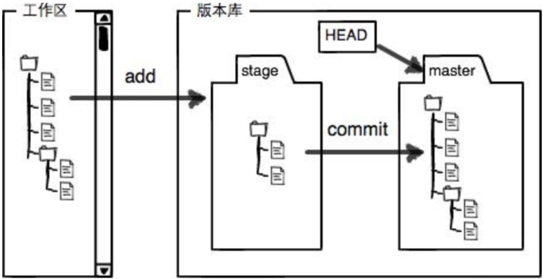

# git常用命令

## 1. 创建仓库

| 命令      | 说明                                        |
| --------- | ------------------------------------------- |
| git init  | 初始化仓库，在当前目录下新建一个git代码库。 |
| git clone | 拷贝一份远程仓库到本地。                    |


## 2. 仓库配置

| 命令                                           | 说明                     |
| ---------------------------------------------- | ------------------------ |
| git config --list                              | 查看当前的Git配置        |
| git config -e [--global]                       | 编辑git配置文件          |
| git config [--global] user.name "git用户名"    | 设置提交代码时的用户名   |
| git config [--global] user.email "git用户邮箱" | 设置提交代码时的用户邮箱 |


## 3.  增加/删除文件

| 命令                                   | 说明                                                 |
| -------------------------------------- | ---------------------------------------------------- |
| git add \[file1] [file2]..             | 添加工作区文件到暂存区                               |
| git add [dir]                          | 添加工作区指定目录的所有文件到暂存区，包括子目录     |
| git add .                              | 添加工作区中当前目录的所有文件到暂存区               |
| git add -p                             | 可确保只提交用户想要提交的更改，而不是整个文件的更改 |
| git rm \[file1] [file2]                | 删除**工作区**的文件，并将其**放入暂存区**           |
| git rm --cached [file]                 | 停止追踪指定文件，但该文件会**保留在工作区**         |
| git mv \[file-original] [file-renamed] | 改名文件，并将改名后的文件放入暂存区                 |




## 4. 提交代码

| 命令                                            | 说明                                                         |
| ----------------------------------------------- | ------------------------------------------------------------ |
| git commit -m ”提交信息注释“                    | 提交暂存区文件到本地仓库                                     |
| git commit \[file1][file2]... -m ”提交信息注释“ | 提交暂存区的指定文件到本地仓库                               |
| git commit -a                                   | 提交工作区**自上次commit之后**变化的文件，直接到本地仓库     |
| git commit -v                                   | 提交时显示**所有diff信息**                                   |
| git commit --amend -m "提交信息注释"            | 使用一次新的commit。替代上一次提交。如果代码没有变化，则修改为当前的提交注释 |
| git commit --amend \[file1][file2]...           | **重做上一次commit**，并包括指定文件的新变化                 |

> 若使用了VPN，需要执行 git remote set-url origin ”仓库名“

## 5. 操作分支

### 5.1 查看分支

| 命令            | 说明                                 |
| --------------- | ------------------------------------ |
| git branch [-r] | 列出所有(本地/[远程])分支            |
| git branch -a   | 列出所有本地和远程分支               |
| git show-branch | 以更详细方式列出所有分支和它们的提交 |

### 5.2 创建分支

| 命令                       | 说明                                      |
| -------------------------- | ----------------------------------------- |
| git branch "新分支名"      | 新建一个分支，但仍停留在当前分支          |
| git checkout -b "新分支名" | 新建一个分支，并切换到该分支              |
| git switch -c "新分支名"   | 新建一个分支，并切换到该分支（Git 2.23+） |

### 5.3 切换分支

| 命令                  | 说明                         |
| --------------------- | ---------------------------- |
| git checkout "分支名" | 切换到指定分支，并更新工作区 |
| git switch "分支名"   | 切换到指定分支（Git 2.23+）  |
| git checkout -        | 切换到上一个分支             |

### 5.4 删除分支

| 命令                                  | 说明                                                         |
| ------------------------------------- | ------------------------------------------------------------ |
| git branch -d "待删除的分支名"        | 删除一个本地分支。（若该分支包含未合并的提交，该命令会失败）强制删除（-D / --force） |
| git push origin --delete "远程分支名" | 删除远程分支                                                 |

### 5.5 合并分支

| 命令                 | 说明                                                         |
| -------------------- | ------------------------------------------------------------ |
| git merge "指定分支" | 将指定分支合并到当前分支                                     |
| git rebase "分支名"  | 将当前分支的更改应用到指定分支的顶部，并重新应用这些更改。（用于保持一个线性的提交历史） |

### 5.5 推送和拉取分支

| 命令                     | 说明                                   |
| ------------------------ | -------------------------------------- |
| git push origin "分支名" | 将本地分支推送到远程仓库               |
| git pull origin "分支名" | 从远程仓库拉取指定分支的更改到本地分支 |

### 5.6 跟踪远程分支

| 命令                                               | 说明                                                         |
| -------------------------------------------------- | ------------------------------------------------------------ |
| git branch --set-upstream-to=origin/\<branch-name> | 设置本地分支以跟踪远程分支（这样就不必在推送或拉取时指定远程分支名） |
| git branch -u origin/\<branch-name>                | 等价上面                                                     |


## 踩坑

### 1.执行git pull origin main报错

```txt
error: Your local changes to the following files would be overwritten by merge:
  59学习网_TCP_IP路由技术(卷二)(第二版).pdf 路由协议.assets/image-20240729145945021.png 路由协议.assets/image-20240729154138487.png 路由协议.assets/image-20240729154625481.png 路由协议.assets/image-20240729161946294.png 路由协议.assets/image-20240729171512117.png 路由协议.assets/image-20240729174433608.png 路由协议.assets/image-20240729174515720.png 路由协议.assets/image-20240729174551463.png 路由协议.md
```

[分析]：这个错误信息表明，你尝试合并（merge）或拉取（pull）远程仓库的更改时，本地仓库中存在一些未提交的更改，这些更改与远程仓库中即将合并的更改冲突。特别是，你本地的`59学习网_TCP_IP路由技术(卷二)(第二版).pdf` 文件和 `路由协议.md` 文件以及多个图片文件有未提交的更改，这些文件在远程仓库中也可能有更新。

【解决】:

1. **提交你的本地更改**：如果你确定你的本地更改是需要的，并且它们不会与远程仓库中的更改冲突（或者你愿意覆盖远程仓库中的更改），你可以先将你的更改提交到本地仓库，然后尝试再次合并或拉取。

   ```cmd
   git add .  
   git commit -m "描述你的更改"  
   git pull  # 或者 git merge <分支名> 如果你正在合并特定的分支
   ```

   注意：如果你和团队成员共享这个仓库，最好在提交之前与他们沟通，以确保更改不会相互冲突。

2. **暂存（Stash）你的更改**：如果你不确定是否要保留这些更改，或者你想要先查看远程仓库的更改，你可以使用`git stash`命令将你的更改暂存起来，然后拉取或合并远程仓库的更改。之后，你可以使用`git stash pop`来恢复你的更改。

   ```
   git stash  
   git pull  # 或者 git merge <分支名>  
   git stash pop
   ```

   如果拉取或合并后的更改与你的暂存更改冲突，你可能需要手动解决这些冲突。

3. **放弃你的本地更改**：如果你决定放弃这些本地更改，并接受远程仓库的更改，你可以使用`git checkout -- <文件>`命令来撤销单个文件的更改，或者使用`git reset --hard`（但请谨慎使用，因为这会丢弃所有未提交的更改）来撤销所有更改。

   ```cmd
   git checkout -- 路由协议.md  
   git checkout -- 路由协议.assets/image-20240729*.png  
   git pull  # 或者 git merge <分支名>
   
   # 或者，如果你确定要丢弃所有更改：
   git reset --hard  
   git pull  # 或者 git merge <分支名>
   ```

   

