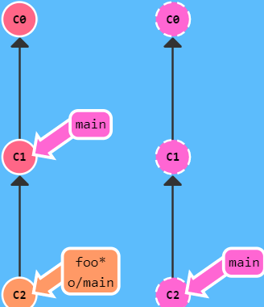

# git常用命令

## 1. 创建仓库

| 命令                    | 说明                                        |
| ----------------------- | ------------------------------------------- |
| git init                | 初始化仓库，在当前目录下新建一个git代码库。 |
| git init [project-name] | 新建一个目录，将其初始化为Git代码库         |
| git clone               | 拷贝一份远程仓库到本地。                    |


## 2. 仓库配置

| 命令                                           | 说明                     |
| ---------------------------------------------- | ------------------------ |
| git config --list                              | 查看当前的Git配置        |
| git config -e [--global]                       | 编辑git配置文件          |
| git config [--global] user.name "git用户名"    | 设置提交代码时的用户名   |
| git config [--global] user.email "git用户邮箱" | 设置提交代码时的用户邮箱 |
| git remote -v                                  | 查看远程仓库             |
| git remote add [name] [url]                    | 添加远程仓库             |
| git remote rm [name]                           | 删除远程仓库             |
| git remote set-url --push [name] [newUrl]      | 修改远程仓库             |
| git pull [remoteName] [localBranchName]        | 拉取远程仓库             |
| git push [remoteName] [localBranchName]        | 推送远程仓库             |

**【实例】：**

如果想把本地的某个分支test提交到远程仓库，并作为远程仓库的master分支，或者作为另外一个名叫test的分支，如下：

```
# 提交本地test分支作为远程的master分支
git push origin test:master 

# 提交本地test分支作为远程的test分支
git push origin test:test              
```


## 3.  增加/删除文件


| 命令                                   | 说明                                                 |
| -------------------------------------- | ---------------------------------------------------- |
| git add \[file1] [file2]..             | 添加工作区文件到暂存区                               |
| git add [dir]                          | 添加工作区指定目录的所有文件到暂存区，包括子目录     |
| git add .                              | 添加工作区中当前目录的所有文件到暂存区               |
| git add -p                             | 可确保只提交用户想要提交的更改，而不是整个文件的更改 |
| git checkout [file]                    | 将暂存区的文件撤回工作区                             |
| git rm \[file1] [file2]                | 删除**工作区**的文件，并将其**放入暂存区**           |
| git rm --cached [file]                 | 停止追踪指定文件，但该文件会**保留在工作区**         |
| git mv \[file-original] [file-renamed] | 改名文件，并将改名后的文件放入暂存区                 |


- **git fetch命令**

  > 将<font color='red'>本地仓库中的远程分支</font>更新成了<font color='red'>远程仓库相应分支</font>最新的状态。

  - 从远程仓库下载本地仓库中缺失的提交记录

  - 更新远程分支指针(如 `origin/main`)
  - **<font color='red'>不会改变本地仓库的状态，不会更新本地的main分支，也不会修改你磁盘上的文件。</font>（即本地仓库与远程仓库未同步）**


- **git fetch + git merge**  等价与   **git pull**


 


> 解决：使你的工作基于最新的远程分支  **<font color='red'>本地仓库的o/main 对于远程仓库的 main</font>**


`git pull` 就是 fetch 和 merge 的简写

`git pull --rebase` 就是 fetch 和 rebase


## 4. 提交代码

| 命令                                            | 说明                                                         |
| ----------------------------------------------- | ------------------------------------------------------------ |
| git commit -m ”提交信息注释“                    | 提交暂存区文件到本地仓库                                     |
| git commit \[file1][file2]... -m ”提交信息注释“ | 提交暂存区的指定文件到本地仓库                               |
| git commit -a                                   | 提交工作区**自上次commit之后**变化的文件，直接到本地仓库     |
| git commit -v                                   | 提交时显示**所有diff信息**                                   |
| git commit --amend -m "提交信息注释"            | 使用一次新的commit。替代上一次提交。如果代码没有变化，则修改为当前的提交注释 |
| git commit --amend \[file1][file2]...           | **重做上一次commit**，并包括指定文件的新变化                 |

> 若使用了VPN，需要执行 git remote set-url origin ”仓库名“

## 5. 操作分支

### 5.1 查看分支

| 命令                | 说明                                 |
| ------------------- | ------------------------------------ |
| **git branch** [-r] | 列出所有(本地/[远程])分支            |
| git branch -a       | 列出所有本地和远程分支               |
| git show-branch     | 以更详细方式列出所有分支和它们的提交 |

### 5.2 创建分支

| 命令                                   | 说明                                          |
| -------------------------------------- | --------------------------------------------- |
| **git branch "新分支名"**              | 新建一个分支，但仍停留在当前分支              |
| **git checkout -b "新分支名"**         | 创建分支，并切换到该分支                      |
| git switch -c "新分支名"               | 新建一个分支，并切换到该分支（Git 2.23+）     |
| git checkout -b “分支名” commit_id     | 用某个commit新建分支                          |
| git fetch origin 远程分支名:本地分支名 | 用远程分支新建分支（git checkout 本地分支名） |

```cmd
git checkout -b “本地分支” origin/远程分支名   # 拉取远程分支去创建本地分支
```


### 5.3 切换分支

| 命令                      | 说明                         |
| ------------------------- | ---------------------------- |
| **git checkout "分支名"** | 切换到指定分支，并更新工作区 |
| git switch "分支名"       | 切换到指定分支（Git 2.23+）  |
| git checkout -            | 切换到上一个分支             |

### 5.4 删除分支

| 命令                                  | 说明                                                         |
| ------------------------------------- | ------------------------------------------------------------ |
| git branch -d "待删除的分支名"        | 删除一个本地分支。（若该分支包含未合并的提交，该命令会失败）强制删除（-D / --force） |
| git push origin --delete "远程分支名" | 删除远程分支                                                 |

### 5.5 合并分支

#### merge

#### rebase

| 命令                    | 说明                                                         |
| ----------------------- | ------------------------------------------------------------ |
| git merge "指定分支"    | 将指定分支合并到当前分支                                     |
| git rebase "指定分支名" | 将当前分支的更改应用到指定分支的顶部，并重新应用这些更改。（用于保持一个线性的提交历史） |

- git merge：Git 中合并两个分支时会产生一个特殊的提交记录，它有两个 parent 节点

  ```cmd
  # 在main分支下将bugFix合并
  git merge bugFix
  ```

  


- git rebase 实际上就是取出一系列的提交记录，“复制”它们，然后在另外一个地方逐个的放下去。

  优点：Rebase 使你的提交树变得很干净, 所有的提交都在一条线上

  缺点：**Rebase 修改了提交树的历史**

  ```cmd
  # 在bugFix分支合并到main主分支下
  git rebase main
  ```


### 5.5 推送和拉取分支

| 命令                     | 说明                                   |
| ------------------------ | -------------------------------------- |
| git push origin "分支名" | 将本地分支推送到远程仓库               |
| git pull origin "分支名" | 从远程仓库拉取指定分支的更改到本地分支 |


### 5.6 跟踪远程分支

| 命令                                               | 说明                                                         |
| -------------------------------------------------- | ------------------------------------------------------------ |
| git branch --set-upstream-to=origin/\<branch-name> | 设置本地分支以跟踪远程分支（这样就不必在推送或拉取时指定远程分支名） |
| git branch -u origin/\<branch-name>                | 等价上面                                                     |


**【分支操作实例1】：**

现有分支dev,新建一个分支xf，xf的原始内容和dev一样，尽情玩xf

```cmd
# 创建分支xf,并切换到xf分支
git checkout -b xf
# 在xf分支，将分支dev内容合并到当前分支
git merge dev
```

第二种：git checkout -b xf origin/dev

⚠️危险操作，将本地xf分支和线上dev分支关联起来。**一般而言，本地分支和线上分支名字保持一致。**


**【分支操作实例2】：**

在dev分支下开发，突然接到任务：去master下修复一个代号=102的bug，但此时dev上add了但未commit,咋办?

[步骤]：

1. 将当前dev分支的工作现场存储起来：

   ```
   git stash
   ```

2. 切换到master分支，从master分支创建临时分支`issue-101`，修复bug

   ```cmd
   # 1. 切换到master分支，创建新分支issue-101，并切换到issue-101分支进行bug修改
   git checkout master
   git checkout -b issue-101
   # 对readme.txt文件进行修改后提交到本地仓库
   vim readme.txt
   git add readme.txt
   git commit -m "fix bug 101"
   
   # 2. 修复成功后，切换到master分支
   git checkout master
   # 将issue-101分支合并到当前master分支，并删除issue-101分支
   git merge --no-ff -m "merged bug fix 101" issue-101
   git branch -d issue-101
   
   # 3. 切回dev工作分支，恢复工作区，继续开发
   git checkout dev
   # 查看到目前工作区是干净的，因为存在stash中，git stash list可查看储藏列表
   git status
   # 恢复工作区的同时，再将储藏区的内容删掉。  
   git stash pop # 该命令等价于git stash apply(恢复)+git stash drop(删除)
   ```

   


## 6. 查看信息

在每次进行提交时，它并不会盲目地复制整个目录。

它会将当前版本与仓库中的上一个版本进行对比，并把所有的差异打包到一起作为一个提交记录。

| 命令               | 说明                                 |
| ------------------ | ------------------------------------ |
| git status         | 查看有哪些文件被修改了               |
| git diff           | 工作区和暂存区的比较，查看修改的内容 |
| git diff --cache   | 暂存区与分支的比较                   |
| git show commit_id | 查看某次的更改                       |
| git log            | 查看历史提交版本，看要回退到哪个版本 |
| git reflow         | 查看历史命令，看要回退到哪个版本     |
| git help           | 查看所有git命令的手册                |
| git remote         | 查看远程库的信息。默认为origin       |
| git remote -v      | 显示更详细的信息                     |


## 7. 多人协作

1. 从本地推送分支，使用git push origin branch-name

   - 如果推送失败，先用git pull抓取远程的新提交；

2. 在本地创建和远程分支对应的分支：

   - 使用git checkout -b branch-name origin/branch-name，本地和远程分支的名称最好一致；

3. 建立本地分支和远程分支的关联:

   ```
   git branch --set-upstream branch-name origin/branch-name
   ```

4. 从远程抓取分支，使用git pull，如果有冲突，要先处理冲突。


## 8. 忽略上传

git忽略对已入库文件的修改

1、忽略上传
`.gitignore `或者`excludes `<font color='red'>只针对尚未提交到配置库的文件才起作用</font>。而对于已经提交的文件是不起作用的。
由此可见，这两个文件的初衷是用于排除不希望上传入库的文件。像编译产生的临时文件等。

2、忽略更新上传
有个文件，我们必须入库，大家一起共享，但是每个人本地的配置又是因自己本地的环境而异。想后续不再更新给文件的修改，使用下面的命令：

```cmd
git update-index --assume-unchanged FILENAME
```

这样，每个人从库上取代码后，在自己本地都要执行一下上面的这个命令。这样，以后你对这个文件的修改，git 都会帮你忽略掉。
当然，哪一天，你希望你的修改要提交入库，那你也必须手动修改一下 这个文件的标志位：

```cmd
git update-index --no-assume-unchanged FILENAME
```


## 9. 文件对比

### 9.1 对比2个版本某个文件的差异

| 命令                            | 说明                                                      |
| ------------------------------- | --------------------------------------------------------- |
| git diff  [filename]            | 查看尚未暂存的【哪个】文件更新了哪些部分                  |
| git diff –cached [filename]     | 查看已经暂存起来的【哪个】文件和上次提交的版本之间的差异  |
| git diff commit_id1 commit_id2  | 查看某两个版本之间的差异（红色commit_id1,绿色commit_id2） |
| git diff branch1 branch2 --stat | 显示出所有有差异的文件列表                                |

### 9.2 对比2个分支某个文件的差异　　　

| 命令                            | 说明                                                         |
| ------------------------------- | ------------------------------------------------------------ |
| git diff branch1 branch2 --stat | 显示出所有有差异的文件列表                                   |
| git diff branch1 branch2        | 显示出所有有差异的文件的详细差异（红色commit_id1,绿色commit_id2） |


## 10. 高频操作

### 10.1 分支操作

（1）查看所有本地分支：**git branch**
         查看所有远程分支：**git branch -r**
         查看所有本地和远程分支：**git branch -a**
（2）用某个commit新建分支：**git checkout -b 分支名 某次commit_id**
（3）用远程分支新建分支：**git fetch origin 远程分支名:本地分支名**，然后，**git checkout 本地分支名**

### 10.2 更改commit的备注 

> 分两种情况：（两种修改差不多，只是最后一种情况在最后会多一步）
>
> 1. 还没将代码push到远程仓库，还在本地的仓库中
>
> 2. 已经将代码push到远程仓库

#### 10.2.1 只修改最后一次注释： 

```cmd
git commit --amend
```

出现有注释的界面（你的注释应该显示在第一行）， 输入i进入修改模式，修改好注释后，按Esc键退出编辑模式，输入:wq保存并退出。ok，修改完成。


#### 10.2.2 修改以前的注释

##### 1. 修改某一次

```
# 数字2指的是显示到倒数第几次 
# 比如这个输入的2就会显示倒数两次的注释（最上面的两行）
git rebase -i HEAD~2
```

- 将想修改的那条注释前的 pick换成edit，并执行`esc退出编辑模式`->`:wq`保存。


- 然后执行：

  ```cmd
  # 对其注释进行修改
  git commit --amend
  git rebase --continue
  ```


##### 2. 修改某几次

同上

你可以将**多个**想修改的commit注释前面的`pick`换成`edit`

**依次修改**你的注释（顺序是从旧到新），Terminal基本都会提示你接下来的操作，每修改一个注释都要重复上面的`git commit --amend、git rebase --continue`命令，直到修改完你所选择的所有注释


#### 10.2.3 已经提到到远程仓库

你把最新的版本从远程仓库先pull下来，修改的方法都如上，最后修改完成后，强制push到远程仓库：
 `git push --force origin master`
 **注：很重要的一点是，你最好保证在你强制push之前没有人提交代码，如果在你push之前有人提交了新的代码到远程仓库，然后你又强制push，那么会被你的强制更新覆盖！！！**


### 10.3 版本回退

#### Head

HEAD ：对**当前所在分支**的符号引用 ，**<font color='red'>指向当前分支上最近一次提交记录。</font>**

HEAD 通常情况下是指向分支名的（如 bugFix）。在你提交时，改变了 bugFix 的状态，这一变化通过 HEAD 变得可见。


**分离的 HEAD** ：让其指向了某个具体的提交记录而不是分支名。


```cmd
# 在bugFix分支上执行
git checkout C4      # (C4为commit_id)
```


- **相对引用** 

**【案例一】：** 修改HEAD指向 `git checkout`

开始时，HEAD默认指向当前main分支的最后一个提交，执行git checkout HEAD~4，让HEAD指向前面第4个版本

```cmd
git checkout HEAD~4 # 或者时 commit_id 
```


**【案例二】：**强制**修改分支**的位置 `git branch`

```cmd
 # -f 选项让分支强制指向另一个提交
 # 将main分支强制指向 HEAD 的第3级parent
 git branch -f main HEAD~3
```


#### **10.3.1本地仓库回滚**

- git reset 

  向上移动分支，原来指向的提交记录就跟从来没有提交过一样。

  

- git revert

​	本地分支中使用 `git reset` 很方便，但是这种“改写历史”的方法对大家一起使用的远程分支是无效的哦！

​	为了撤销更改并**分享**给别人，我们需要使用 `git revert`


```cmd
# 某一版本回退   （注意！！！！！！！！：commit-id之后提交的commit都去除）
git reset --hard <commit_id>
# 撤销到哪个指定提交版本 HEAD是当前版本、HEAD^上一版本、HEAD^^上上个版本，HEAD～100回退100个版本
git reset -—hard HEAD/HEAD^/HEAD^^/HEAD~100   

# 对某一版本撤销，如HEAD，即撤销当前版本，到上一版本，但会存有新的提交记录，供他人查看
git revert <commit_id>

# 取消对某一版本提交的撤销，B重新回来
git cherry-pick <commit_id> # 摘取某个commit_id到当前分支下(只要这个commit_id存在就好，不在乎它在哪个分支下的)
```


若不清楚想要的提交记录的哈希值呢？？？

```cmd
# 交互式 rebase 指的是使用带参数 --interactive 的 rebase 命令, 简写为 -i
# Git 会打开一个 UI 界面并列出将要被复制到目标分支的备选提交记录，它还会显示每个提交记录的哈希值和提交说明，提交说明有助于你理解这个提交进行了哪些更改。
```

```
# 步骤：
#1. 调整提交记录的顺序（通过鼠标拖放来完成）
#2. 删除你不想要的提交（通过切换 pick 的状态来完成，关闭就意味着你不想要这个提交记录）
#3. 合并提交

```

比如commit提交最新到最旧为: D C B A 

（1）回退到B，CD不要了，===>版本回退：git reset --hard B
（2）撤销B的提交，其余保留， ===>版本撤销：git revert B
（3）取消对b提交的撤销，B重新回来， ===>git cherry-pick B


**[实例一]：**

dev分支修改，提交3次commit，然后合并到master,结果线上报错，吓得我直接revert这段合并，但是后来麻烦就来了。本来想着在现有基础上修复，**<font color='red'>又提交了一次commit提交，但是发现前3次的commit没了</font>**，想哭，原来是真的版本后退了，这3个commit消失得无影无踪。咋办？在本地dev分支下git log:


```
git reset --hard 630391de81dba0a7e47e2ce2a0d10766460d706e
git cherry-pick 31f91471a801ec9fc5d49e84cefccc5942c190a6
git push origin dev  --force #必须强推,如果受保护的分支，先不保护，强推后再保护
```


#### 10.3.2 远程仓库回滚（复杂）

应用场景：自动部署系统发布后发现问题，需要回滚到某一个commit，再重新发布

原理：①将本地分支退回到某个commit，②删除远程分支，③再重新push本地分支

```
git checkout the_branch
git pull
# 创建一个新分支，并停留在当前分支
git branch the_branch_backup //备份一下这个分支当前的情况
git reset --hard the_commit_id //把the_branch本地回滚到the_commit_id
git push origin :the_branch //删除远程 the_branch
git push origin the_branch //用回滚后的本地分支重新建立远程分支
git push origin :the_branch_backup //如果前面都成功了，删除这个备份分支
```


#### 10.3.3 撤销操作

```
# 恢复暂存区的指定文件到工作区
$ git checkout [file]

# 恢复暂存区的所有文件到工作区
$ git checkout .

# 恢复某个commit的指定文件到暂存区和工作区
$ git checkout [commit] [file]

 
# 重置暂存区的指定文件，与上一次commit保持一致，但工作区不变
$ git reset [file]
 
# 重置暂存区与工作区，与上一次commit保持一致
$ git reset --hard
 
# 重置当前分支的指针为指定commit，同时重置暂存区，但工作区不变
$ git reset [commit]
 
# 重置当前分支的HEAD为指定commit，同时重置暂存区和工作区，与指定commit一致
$ git reset --hard [commit]
 
# 重置当前HEAD为指定commit，但保持暂存区和工作区不变
$ git reset --keep [commit]
 
# 新建一个commit，用来撤销指定commit
# 后者的所有变化都将被前者抵消，并且应用到当前分支
$ git revert [commit]
 
# 暂时将未提交的变化移除，稍后再移入
$ git stash
$ git stash pop
```


### 10.4 git push (-u) 和 git branch (-u)

（1）git push -u 与 git push 的区别？

```
git push -u origin dev = git push origin/dev dev + git branch -u origin/dev dev 
```

（2）git push -u origin 与 git branch -u origin的区别？

```cmd
# git push origin dev = git push origin/dev dev
git push origin  # 不指定远程分支,则默认的远程分支与本地分支一样
```

```cmd
# git branch origin dev = git branch origin/master dev
git branch origin # 不指定远程分支,则默认的远程分支=master
```

**<font color='red'>注意：</font>**无论push还是branch，**-u指定远程分支与本地分支的关联关系**时，最好指定远程分支名：origin/远程分支名。然后像push报错，再把远程分支名去掉。


### 10.5 git高级篇

> 假设你周一克隆了一个仓库，然后开始研发某个新功能。到周五时，你新功能开发测试完毕，可以发布了。但是 —— 天啊！你的同事这周写了一堆代码，还改了许多你的功能中使用的 API，这些变动会导致你新开发的功能变得不可用。但是他们已经将那些提交推送到远程仓库了，因此你的工作就变成了基于项目**旧版**的代码，与远程仓库最新的代码不匹配了。
>
> 这种情况下, `git push` 就不知道该如何操作了。如果你执行 `git push`，Git 应该让远程仓库回到星期一那天的状态吗？还是直接在新代码的基础上添加你的代码，亦或由于你的提交已经过时而直接忽略你的提交？
>
> 因为这情况（历史偏离）有许多的不确定性，Git 是不会允许你 `push` 变更的。实际上它会强制你先合并远程最新的代码，然后才能分享你的工作。

  对于接下来这个[工作流](https://so.csdn.net/so/search?q=工作流&spm=1001.2101.3001.7020)，需要集成两个步骤：

- 将特性分支集成到 main 上
- 推送并更新远程分支


```cmd
# 更新main分支并推送到远程
git pull --rebase  # git pull(等价与git fetch+git merge) + git rebase
git push
```


#### **[题目1]** **推送主分支 **

这个关卡的 [Boss](https://so.csdn.net/so/search?q=Boss&spm=1001.2101.3001.7020) 很厉害 —— 以下是通关提示：

​        这里共有三个特性分支 —— side1 side2 和 side3，我需要将这三分支按顺序推送到远程仓库。因为远程仓库已经被更新过了，所以我们还要把那些工作合并回来。


```cmd
# 拉取远程仓库的版本到本地
git fetch       
git rebase o/main side1    # rebase to o/main from side1 将side11合并到origin/main分支
git rebase side1 side2     
git rebase side2 side3
git rebase side3 main
git push
```


#### **[题目2]** 合并远程仓库

- Rebase缺点:  修改了提交树的历史

解决上一关卡的问题，但要用merge替换rebase。


```cmd
git checkout main
git pull         # C8拿回本地，并且origin/main指向它，main也指向它！
git merge side1
git merge side2
git merge side3
git push
```


#### [题目3] 追踪远程分支

> 本地main分支会追踪远程origin/main分支，也可自定义设置分支追钟origin/main。

> ​	在前几节课程中有件事儿挺神奇的，Git 好像知道main与o/main 是相关的。当然这些分支的名字是相似的，可能会让你觉得是依此将远程分支main 和本地的main 分支进行了关联。这种关联在以下两种情况下可以清楚地得到展示：
>
> - pull 操作时, 提交记录会被 <font color='red'>先下载到o/main</font> 上，之后<font color='red'>再合并到本地的 main 分支</font>。隐含的合并目标由这个关联确定的。
> - push 操作时, 我们把工作从 <font color='red'>main</font> 推到<font color='red'>远程仓库中的 main 分支</font>(同时会<font color='red'>更新远程分支 o/main</font>) 。这个推送的目的地也是由这种关联确定的！
>
> ​        main和 o/main 的关联关系就是<font color='red'>**由分支的“remote tracking”属性**</font>决定的。main被设定为跟踪 o/main这意味着为main分支指定了推送的目的地以及拉取后合并的目标。当你克隆仓库的时候, Git 就自动帮你把这个属性设置好了。
>
> ​	    当你git clone时, <font color='cornflowerblue'>Git 会为远程仓库中的每个分支在本地仓库中创建一个远程分支</font>（比如 o/main）。然后再创建一个**跟踪远程仓库中活动分支**的本地分支，默认情况下这个**本地分支会被命名为 main**。
>
> ​        克隆完成后，你会得到一个本地分支（如果没有这个本地分支的话，你的目录就是“空白”的），但是可以查看远程仓库中所有的分支（如果你好奇心很强的话）。这样做对于本地仓库和远程仓库来说，都是最佳选择。
>
> ​		这也解释了为什么会在克隆的时候会看到下面的输出：
>
> ​					local branch "main" set to track remote branch "o/main"
>
> ​		可以让任意分支跟踪 o/main, 然后该分支会像 main 分支一样得到**隐含的 push 目的地以及 merge 的目标**。 这意味着你可以在分支 totallyNotMain 上
>
> 执行 git push，将工作推送到远程仓库的 main 分支上。


> 有两种方法设置这个属性，第一种就是通过远程分支检出一个新的分支，执行:
>
> ​			git checkout -b totallyNotmain o/main # 创建一个名为 totallyNotmain 的分支，它跟踪远程分支 o/main。
>
> 我们检出一个名叫 foo 的新分支，让其跟踪远程仓库中的 main。


```
git checkout -b foo o/main
git pull
```


> ​		使用了隐含的目标 o/main 来更新 foo 分支。需要注意的是<font color='red'> main 并未被更新</font>！

我们将一个并不叫 main 的分支上的工作推送到了远程仓库中的 main 分支上。

> 输入：
>
> git checkout -b foo o/main
>
> git commit
>
> git push，效果相同。


> ​        另一种方法就是使用：`git branch -u o/main foo`（这个命令更明确！）这样 foo 就会跟踪 o/main 了。如果当前就在 foo 分支上, 还可以省略 foo：直接使用git branch -u o/main


```
git branch -u foo o/main;git commit;git push
```

 




https://blog.csdn.net/bygone_merci/article/details/127184653


## 踩坑

### 1.执行git pull origin main报错

```txt
error: Your local changes to the following files would be overwritten by merge:
  59学习网_TCP_IP路由技术(卷二)(第二版).pdf 路由协议.assets/image-20240729145945021.png 路由协议.assets/image-20240729154138487.png 路由协议.assets/image-20240729154625481.png 路由协议.assets/image-20240729161946294.png 路由协议.assets/image-20240729171512117.png 路由协议.assets/image-20240729174433608.png 路由协议.assets/image-20240729174515720.png 路由协议.assets/image-20240729174551463.png 路由协议.md
```

[分析]：这个错误信息表明，你尝试合并（merge）或拉取（pull）远程仓库的更改时，本地仓库中存在一些未提交的更改，这些更改与远程仓库中即将合并的更改冲突。特别是，你本地的`59学习网_TCP_IP路由技术(卷二)(第二版).pdf` 文件和 `路由协议.md` 文件以及多个图片文件有未提交的更改，这些文件在远程仓库中也可能有更新。

【解决】:

1. **提交你的本地更改**：如果你确定你的本地更改是需要的，并且它们不会与远程仓库中的更改冲突（或者你愿意覆盖远程仓库中的更改），你可以先将你的更改提交到本地仓库，然后尝试再次合并或拉取。

   ```cmd
   git add .  
   git commit -m "描述你的更改"  
   git pull  # 或者 git merge <分支名> 如果你正在合并特定的分支
   ```

   注意：如果你和团队成员共享这个仓库，最好在提交之前与他们沟通，以确保更改不会相互冲突。

2. **暂存（Stash）你的更改**：如果你不确定是否要保留这些更改，或者你想要先查看远程仓库的更改，你可以使用`git stash`命令将你的更改暂存起来，然后拉取或合并远程仓库的更改。之后，你可以使用`git stash pop`来恢复你的更改。

   ```
   git stash  
   git pull  # 或者 git merge <分支名>  
   git stash pop
   ```

   如果拉取或合并后的更改与你的暂存更改冲突，你可能需要手动解决这些冲突。

3. **放弃你的本地更改**：如果你决定放弃这些本地更改，并接受远程仓库的更改，你可以使用`git checkout -- <文件>`命令来撤销单个文件的更改，或者使用`git reset --hard`（但请谨慎使用，因为这会丢弃所有未提交的更改）来撤销所有更改。

   ```cmd
   git checkout -- 路由协议.md  
   git checkout -- 路由协议.assets/image-20240729*.png  
   git pull  # 或者 git merge <分支名>
   
   # 或者，如果你确定要丢弃所有更改：
   git reset --hard  
   git pull  # 或者 git merge <分支名>
   ```

   


### 2. 远程服务器拒绝(Remote Rejected)

如果你是在一个大的合作团队中工作, 很可能是main被锁定了, 需要一些Pull Request流程来合并修改。如果你直接提交到本地main, 然后试图推送修改, 你将会收到这样类似的信息:

```
! [远程服务器拒绝] main -> main (TF402455: 不允许推送(push)这个分支; 你必须使用pull request来更新这个分支.)
```

原因：新建一个分支, 推送这个分支并申请pull request，但是你忘记并直接提交给了main.现在你卡住并且无法推送你的更新.

解决：新建一个分支, 推送到远程服务器。然后git reset你的main分支和远程服务器保持一致，否则下次你pull并且他人的提交和你冲突的时候就会有问题。
