# C语言

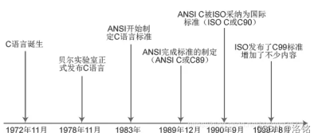

## 1. 基础知识


### 1.2 字面值

**（1）整数常量**

除了常⻅的⼗进制整数外，还可以⽤⼋进制 (0开头) 或⼗六进制 (0x/0X)表⽰法。

```c
int x = 010;     // 8
int y = 0x0A;    // 10
```

通过后缀来区分类型

```
0x200    -> int
200U     -> unsigned int
0L       -> long
0xf0f0UL -> unsigned long
0777LL   -> long long
0xFFULL  -> unsigned long long
```

**（2）浮点常量**

```c
10.0   -> 10
10.    -> 10
.123   -> 0.123
2.34E5 -> 2.34 * (10 ** 5)
67e-12 -> 67.0 * (10 ** -12)

# ⽤ F 后缀表⽰ float，⽤ L 后缀表⽰ long double 类型
```

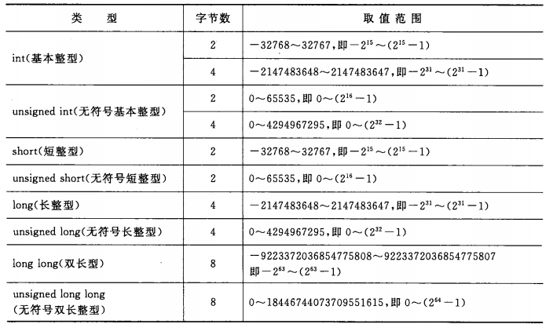

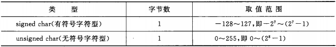

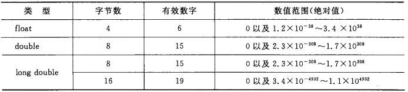

**（3）字符常量**

字符常量默认是 int 类型，除⾮⽤前置 L 表⽰ wchar_t 宽字符类型

```
char c = 0x61;  # 97
char c2 = 'a';
char c3 = '\x61';
printf("%c, %c, %c\n", c, c2, c3);
```

**（4）字符串常量**

字符串是⼀个以 NULL (也就是 \0) 结尾的 char 数组。

空字符串在内存中占⽤⼀个字节，包含⼀个 NULL 字符。

```
char s[] = "Hello, World!";
char* s2 = "Hello, C!";
```

**（5）符号常量**

见名知意，不占内存，只是一个临时的符号。

```
#define PI 3.1416
```


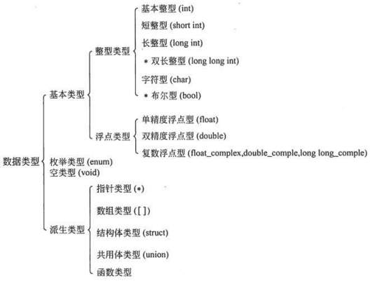


### const相关

#### 1.指针常量和常量指针

- 指针常量

  const修饰的是指针所指向的值，指针的指向可以改变，指针指向的值不可改变。`int const *p`或`const int *p`

- 常量指针

​	const修饰的是指针变量，指针的指向不可改变，指针指向的值可以改变。`int* const p`

#### 2.常量赋值

- 可以使用非const和const数据的地址，赋值给指针常量，<font color='red'>即不可通过指针改变其值。</font>

```c
double rates[5] = {88.99, 100.12, 59.45, 183.11, 340.5};
const double locked[4] = {0.08, 0.075, 0.0725, 0.07};
const double *pc = rates; // 有效
pc = locked; //有效
pc = &rates[3]; //有效
```

- 只能把非const数据的地址赋给普通指针。否则，通过指针就能改变const数组中的数据。

```c
double rates[5] = {88.99, 100.12, 59.45, 183.11, 340.5};
const double locked[4] = {0.08, 0.075, 0.0725, 0.07};
double * pnc = rates; // 有效
pnc = locked; // 无效
pnc = &rates[3]; // 有效
```

```
int x = 20;
const int y = 23;
int *p1 = &x;
const int *p2 = &y;
const int **pp2; // 指向指针的指针，而这个指针所指向的指针最终指向一个const int类型的值
p1 = p2; // 不安全 -- 把const指针赋给非const指针
p2 = p1; // 有效 -- 把非const指针赋给const指针，前提：只进行一级解引用
pp2 = &p1; // 不安全 –- 嵌套指针类型赋值，进行两级解引用时，这样的赋值也不安全，
```

例如：

```
const int **pp2;
int *p1;
const int n = 13;
pp2 = &p1; // 允许，但是这导致const限定符失效（根据第1行代码，不能通过*pp2修改它所指向的内容）

// *pp2（即 p1）是一个int *类型的变量， C语言允许从const int*到int*的隐式转换，
//但这里实际上是反过来的——你正在尝试将一个const int* 类型的值赋给一个int*类型的变量。
//然而，由于赋值是通过指针的指针进行的，编译器实际上会允许这种操作，但 p1 现在指向了一个 
//const int 类型的对象。
*pp2 = &n; // 有效，两者都声明为const，但是这将导致p1指向n（*pp2已被修改）
*p1 = 10;//有效，但是这将改变n的值（但是根据第3行代码，不能修改n的值）
```


## 2. 数组和指针

### 1.数组初始化

#### 1.部分初始化

如果不初始化数组，数组元素和未初始化的普通变量一样，其中储存的都是垃圾值；

但是，如果部分初始化数组，剩余的元素就会被初始化为0。

```c
// 1.不初始化数组  通过下标进行访问时，得到的是随机生成的值
int　some_data[SIZE];


// 2.采用部分初始化
//   剩下的其他元素被初始化为0
int　some_data[SIZE]　=　{1492,　1066};
```

#### 2.指定初始化器（C99）

初始化数组中指定位置的元素。

```c
int arr[6] = {0,0,0,0,0,212}; // 传统的语法
int arr[6] = {[5] = 212};     // C99写法

// 初始化数组中索引为4的元素  如果指定[4] = 20,31,23   那么会将索引4后面的元素都会依次被初始化
#define MONTHS 12
int days[MONTHS] = { 31, 28, [4] = 31, 30, 31, [1] = 29 }; // 31 29 0 0 31 30 31 0 0 0 ...
```


int stuff[] = {1, [6] = 23}; //会发生什么？  

int staff[] = {1, [6] = 4, 9, 10}; //会发生什么？

```txt
编译器会把数组的大小设置为足够装得下初始化的值。所以，stuff数组有7个元素，编号为0～6；而staff数组的元素比stuff数组多两个（即有9个元素）。
```


#### 3.使用复合字面量给数组赋值（C99）

复合字面量是匿名的，所以不能先创建然后再使用它，必须在创建的同时使用它。

```c
int diva[2] = {10,20};  // 字面常量

// 匿名数组
(int [2]){10,20};   // 复合字面量
(int []){50,20,40}; // 内含3个元素的复合字面量
```

```c
// 2.通过指针来指向复合字面量
int *p;
p = (int [2]){10,20};  

// 二维数组
int (*p2)[4];
p2 = (int [2][4]){{1,2,3,4},{5,6,7,8}};
```

```c
// 3.复合字面量作为实参传递给函数
int sum(const int ar[], int n);
sum((int []){4,4,4,5,5,5}, 6);
```


#### 4.指定数组的大小

> 在C99标准之前，声明数组时<font color='wildstrawberry'>只能在方括号中使用整型常量表达式</font>。所谓整型常量表达式，是由整型常量构成的表达式。

```c
float a1[5];        // 可以
float a2[5*2 + 1];  //可以
float a3[sizeof(int) + 1]; //可以
float a4[-4]; // 不可以，数组大小必须大于0
float a5[0];  // 不可以，数组大小必须大于0
float a6[2.5]; // 不可以，数组大小必须是整数
float a7[(int)2.5]; // 可以，已被强制转换为整型常量


int n = 10;
float a8[n]; // C99之前不允许   变长数组
```

2.5+3.7/(1.2-0.3)∗5.0

2.5+3.7/(1.2-0.3)*5.0

### 2.多维数组

#### 1.二维数组

##### 1.初始化

- 使用两层花括号
- 只保留最外面的一对花括号


```c
int arr[3][4];   // 声明一个指向该数组的指针  int (*p)[4];
//等价于
// 格式一: arr3x4
typedef int arr4[4];     // arr4是一个包含4个整型的数组
typedef arr4 arr3x4[3];  // arr3x4是一个包含3个arr4的数组

// 格式二  形参
int arr[][4]    // 声明一个指向N维数组的指针时，只能省略最左边方括号的值
// 第1对方括号只用于表明这是一个指针,而其他的方括号则用于描述指针所指向数据对象的类型
```


### 3.指针和多维数组

```c
// 数组名zippo是该数组首元素的地址，是这个内含两个int值的数组的地址。
int zippo[4][2]; 

// 三者值相同
zippo = &zippo[0] = &zippo[0][0];
```


#### 1.指向多维数组的指针

```c
int arr[3][4];   // 声明一个指向该数组的指针  int (*p)[4];
//等价于
// 格式一: arr3x4
typedef int arr4[4];     // arr4是一个包含4个整型的数组
typedef arr4 arr3x4[3];  // arr3x4是一个包含3个arr4的数组

// 格式二  形参
int arr[][4]    // 声明一个指向N维数组的指针时，只能省略最左边方括号的值
// 第1对方括号只用于表明这是一个指针,而其他的方括号则用于描述指针所指向数据对象的类型
```


#### 2.指针的兼容性

```
int n = 5;
double x;

int *p1 = &n;
double * pd = &x;

x = n; // 隐式类型转换   int => double
pd = p1; // 编译时错误   int* => double*

int *pt;       // pt指向一个int类型值
int (*pa)[3];  // pa指向一个含3个int类型元素的数组
int ar1[2][3]; // ar1指向一个内含3个int类型元素的数组
int ar2[3][2]; // ar2指向一个内含2个int类型元素的数组
int **p2;      // p2指向一个指针

pt = &ar1[0][0]; // 都是指向int的指针
pt = ar1[0]; // 都是指向int的指针
pt = ar1; // 无效   
pa = ar1; // 都是指向内含3个int类型元素数组的指针
pa = ar2; // 无效
p2 = &pt; // both pointer-to-int *
*p2 = ar2[0]; // 都是指向int的指针
p2 = ar2; // 无效   涉及的两个指针都是指向不同的类型
```


## 3. 字符串

### 1.字符串数组的初始化

1. 只用指定字符串初始化数组

   ```c
   const char m[40] = "Limit yourself to one's worth.";
   
   const char m1[] = "Limit yourself to one's worth.";
   ```

2. 标准的数组初始化

   ```c
   const char m[20] = {'H','e','l','l','o','\0'};
   ```

   > 若是字符串，需要<font color='red'>最后加一个空字符'\0'</font>，不然就是字符数组了。


### 2.字符串是否可修改

字符串<font color='red'>存储在静态存储区</font>。

- 数组形式（ar[]）

  ​		在程序运行开始时，会给该数组分配内存空间，并将存储在`静态存储区`中的字符串拷贝一份，给该数组。此时，该字符串会出现两个副本。一个存放在静态存储区、一个存放在ar数组中。（如下，ar的地址和字符串字面值的地址不一致）

  ​		<font color='red'>初始化数组就是把静态存储区的字符串拷贝到数组中。即可以通过ar[i]修改字符串</font>

- 指针形式（*p）

​				<font color='red'>初始化指针只是把字符串的地址拷贝给指针。但这种通过p[i]修改会引发未定义错误</font>

#### 2.1 指针形式表示法

- 错误写法

```c
char * word = "frame";
word[1] = 'l';   // 不允许，是未定义行为，可能会导致内存访问错误

#define MSG "I'm special"
char ar[] = MSG;
const char *pt = MSG;
printf("address of \"I'm special\": %p \n", "I'm special");  // 0x100000f10
printf("address ar: %p\n", ar);		//0x7fff5fbff858
printf("address pt: %p\n", pt);   //0x100000f10
printf("address of MSG: %p\n", MSG); //0x100000f10
printf("address of \"I'm special\": %p \n", "I'm special");  //0x100000f10
```

> 原因：
>
> ​	**<font color='red'>编译器可以用相同的地址替换所有完全相同的字符串字面量值</font>**，如上述所有的"I'm special"字符串字面量的地址是相同的。
> ​	如果编译器使用这种单次副本表示法，并允许p1[0]修改'F'，那将影响所有使用该字符串的代码。所以以上语句打印字符串字面量"I'm special"时实际上都显示的是"F'm special"：

- 推荐写法

```c
// 推荐写法
const char* word = "frame";
```


### 3.字符串输入/输出

#### 1.gets()/puts() 不建议

- **gets(): **读取整行，直到读到换行符（丢弃）为止。

```c
char msg[1024];
gets(msg); 
```

> gets()不建议使用。输入的字符串过长，会导致缓冲区溢出;
>
> 如果这些多余的字符只是占用了尚未使用的内存，就不会立即出现问题；如果它们擦写掉程序中的其他数据，会导致程序异常中止；或者还有其他情况。
>
> Segmentation fault：分段错误。程序试图访问了未分配的内存。
>


- **puts(传入字符串地址):** 遇到空字符停止输出，并自动在末尾加上换行符。

```c
char msg[] = {'a','b','c'};  // 禁止这种写法，puts遇到空白符才会停止   此处不是字符串(少\0)，是字符数组
puts(msg);                   
```


#### 2.fgets()/fputs() 推荐

- fgets()通过第2个参数限制读入的字符数来解决溢出的问题。还有会将读到的\n保存（gets会丢弃）。


- puts()会在待输出字符串末尾添加一个换行符，而fputs()不会。


```c
fgets(words, STLEN, stdin):
// 		参数二：指明读入字符的最大数量  若设置n，则最多读入n-1字符+'\0'，或者读到遇到的第一个换行符为止。
// 		参数三：指明要读入的文件  stdin 从键盘输入

fputs(words, stdout);
//    参数二：指明它要写入的文件。
//    参数三：设置stdout则输出在屏幕上。
//  返回值：
//		fputs()函数返回指向 char的指针。   不会在末尾加换行符
//			若成功，返回的地址与传入的第1个参数相同。
//			如果函数读到文件结尾，它将返回一个特殊的指针：空指针（null pointer）
```

**[示例]：**具体见自定义s_gets()函数

```c
// 如果不想存一行最后的'\n'符
#define LEN 1024;
char msg[LEN];
if(fgets(msg,LEN,stdin) !=NULL && msg[0]!='\n'){
	int i = 0;
    while(msg[i]!='\n'&&msg[i]!='\0')
       	i++;
    if(msg[i]=='\n'){ // 若读到的是一整行，则将最后'\n'删除
        msg[i]='\0';
    }else if(msg[i]=='\0'){ // 字符串太长，一次读不下，将后面溢出的字符都删除
        while(getchar()!='\n')
            continue;
    }
    // 输出时，最后会自动加\n
    puts(msg);
}
```


<font color='red'>**空字符（\0）和空指针（NULL）区别：**</font>

- 空字符是整数类型，而空指针是指针类型。
- 两者都能用数值0表示，但空字符是一个字符，占一个字节；而空指针是一个地址，占4字节。


#### 3.gets_s()

见C11特性

> 如果输入行太长会怎样？
>
> 使用gets()不安全，它会擦写现有数据，存在安全隐患。
>
> gets_s()函数很安全，但是，如果并不希望程序中止或退出，就要知道如何编写特殊的“处理函数”。
>
> 另外，如果打算让程序继续运行，gets_s()会丢弃该输入行的其余字符，无论你是否需要。当输入太长，超过数组可容纳的字符数时，fgets()函数最容易使用，而且可以选择不同的处理方式。如果要让程序继续使用输入行中超出的字符，可以参考程序清单11.8中的处理方法。如果想丢弃输入行的超出字符，可以参考程序清单11.9中的处理方法。

#### 4.自定义s_gets()函数

读取整行输入并用空字符代替换行符，或者读取一部分输入，并丢弃其余部分。

丢弃其余部分：由于输入行中多出来的字符会被留在缓冲区中，会成为下一次读取语句的输入。

```c
char * s_gets(char * st, int n)
{
		char * ret_val;
		int i = 0;
  	// 返回NULL，读到文件结尾或出现读取错误
		ret_val = fgets(st, n, stdin);
		if (ret_val) // 即ret_val != NULL  
		{
				while (st[i] != '\n' && st[i] != '\0')
						i++;
				if (st[i] == '\n')
						st[i] = '\0';
				else
            // 如果字符串中出现空字符，就丢弃该输入行的其余字符，然后返回与fgets()相同的值。
						while (getchar() != '\n')
								continue;
		}
		return ret_val;
}
```


#### 5.scanf()/printf()

scanf()读取字符串：从第一个非空白字符（空行、空格、换行符以及制表符）开始，读取到下一个空白字符结束。

​			**<font color='red'>`后面剩下的部分，依旧存在缓存区中，可在下次scanf()获取`</font>**

printf(传入字符串的地址)不会自动在每个字符串末尾加上一个换行符。


### 4.字符串函数

```c
#include <string.h>
```


**<font color='red'>用到指针参数，必须要进行初始化分配内存！！！！！！！！！！！！！！！</font>**

**<font color='red'>用到指针参数，必须要进行初始化分配内存！！！！！！！！！！！！！！！</font>**

**<font color='red'>用到指针参数，必须要进行初始化分配内存！！！！！！！！！！！！！！！</font>**

**<font color='red'>用到指针参数，必须要进行初始化分配内存！！！！！！！！！！！！！！！</font>**

**<font color='red'>用到指针参数，必须要进行初始化分配内存！！！！！！！！！！！！！！！</font>**


#### 1.strlen()

统计字符串的长度

```c
int strlen(char const*string);
```


#### 2.strcat()/strncat()  

- **strcat() 不安全**

字符串拼接函数： 把字符串str2接到str1后面，初始的str1最后的'\0'被取消，返回str1。 

<font color='red'>strcat()不检测dest空间是否能容纳字符串src，若溢出，对相邻存储单元会造成影响。</font>

```c
char* strcat(char * str1,char * str2); 
```


- **strncat()** 

将字符串src中前maxlen个字符连接到dest中。

<font color='red'>strcat()不检测dest空间是否能容纳字符串src，若溢出，对相邻存储单元会造成影响。</font>

```c
char *strncat(char *dest, const char *src, size_t maxlen);
```

注意：与strncpy不同的是，**<font color='red'>strncat会自动在末尾加‘\0’，若指定长度超过源字符串长度，则只复制源字符串长度即停止</font>**　 


#### 3.strcmp()/strncmp()

- **strcmp()**

比较两个字符串是否相等，只比较空字符前面部分。

>  str1<str2，返回负数
>
> str1=str2，返回 0
>
> str1>str2，返回正数

```c
int strcmp(char * str1,char * str2); 
```

- **strncmp()**

对str1和str2中的前count个字符按字典顺序比较 

```c
int strncmp(char *str1,char *str2,int count) 
```


#### 4.strcpy()/strncpy()

- **strcpy()**

把str2指向的字符串拷贝到str1中去 ，返回指向str1的指针。

```c
char* strcpy(char* str1,char* str2); 
```

```c
char copy[40] = ”Be the best that you can be.“
char *ps;
char *org = "beast";
ps = strcpy(copy+7,org); //copy: Be the beast\0hat you can be.
puts(ps);   // beast
puts(copy); // Be the beast
```

- **strncpy()** <font color='red'>慎用</font>

将字符串src中的count个字符拷贝到字符串dest中去，返回指向dest的指针。

```c
char *strncpy(char *dest, const char *src，int count) 
```

**<font color='red'>注意：</font>**当拷贝的字符串长度count小于src的长度时，它**不会拷贝空字符**.

​		  因此，需要将count设置为比dest目标字符串长度少1，即 count = len(dest)-1;   

​		  然后，把数组最后一个元素设置为空字符，dest[len(dest)-1]='\0';


#### 5.sprintf

将多个字符串格式化输出到 **str** 所指向的字符串，而不是像printf()输出到屏幕上。

```c
#include <stdio.h>
int sprintf(char *str, const char *format, ...) 
```

```c
char str[80];
sprintf(str, "%s %-19s", fast, last);
```


#### 6.strchr

找出str指向的字符串中第一次出现字符ch的位置 

```c
char* strchr(char* str,char ch); 
```


## 4. 存储期、链接和内存管理

### 4.1 作用域

C语言中变量按其[作用域](https://so.csdn.net/so/search?q=作用域&spm=1001.2101.3001.7020)分，可分为局部变量和全局变量：

- **局部变量（内部变量）：在定义它的函数内有效，但是函数返回后失效；**
- **全局变量（外部变量）：在所有源文件内均有效。在同源文件的函数中使用使用全局变量，需要将全局变量提前声明；同时在不包含全局变量定义的不同源文件需要用extern关键字再次声明。**

> - 当局部变量与全局变量同名时，在局部变量的作用范围之内，全局变量不起作用。局部变量优先原则；
>
> - 全局变量是有默认值的（引用类型的变量默认值都是null，基本类型的变量默认值则不一样，int型变量默认值是0），但是局部变量没有默认值；
> - 全局变量可以在函数外定义并初始化，<font color='red'>但不能进行赋值操作。</font>

```c
# include <stdio.h> 
int a = 0;
a = 1;    // 运行时报错，全局变量在函数外不能进行赋值操作
 
int b;
b = 1;   // 此处正确，不是赋值操作，是初始化操作。
int main()
{
	printf("%d\n", a);
 
	return 0;
}
```


### 4.2 存储期

生存周期：指变量从内存分配到释放的时间间隔。

变量的生命周期有三种形式：`不同的存储区对应不同的存储期`

- 自动存储期
- 静态存储期
- 自定义存储期

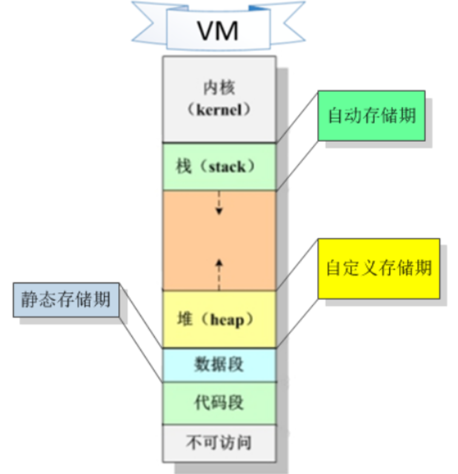

#### 4.1.1 自动存储期

> 变量内存的申请和释放都是操作系统自动进行的，无需手动申请或释放。

​		存储在<font color='red'>栈区</font>的变量，都是拥有自动存储期，因此也都被称为自动变量（局部变量/临时变量）。


#### 4.1.2 静态存储期

> 这些变量的生命周期与整个程序一致，不会因为程序的运行而发生临时性的分配和释放。

​		存储在<font color='red'>数据段中</font>的变量，统统拥有静态存储期，因此也都被称为静态变量。

​		如：全局变量、static全局变量、static局部变量

> static修饰局部变量 **：只在定义它的函数内有效。只是程序仅分配一次内存，函数返回后，该变量不会消失，只有程序结束后才会释放内存；**
>
> static修饰全局变量:  **只在定义它的文件内有效，且生存期在整个程序运行期间。**


注意:

- 若定义时未初始化，则系统会将所有的静态数据自动初始化为0
- 静态数据初始化语句，只会执行一遍
- 静态数据从程序开始运行时便已存在，直到程序退出时才释放。


#### 4.1.3 自定义存储期

> 变量的分配和释放，都是由开发者自己决定的。

​		存储在堆中的变量，统统拥有自定义存储期.

```c
申请堆内存: malloc() / calloc()
清零堆内存: bzero()
释放堆内存: free()
    
    
malloc()申请的堆内存，默认情况下是随机值，一般需要用 bzero()来清零。
calloc()申请的堆内存，默认情况下是已经清零了的，不需要再清零。
free()只能释放堆内存，不能释放别的区段的内存。
```

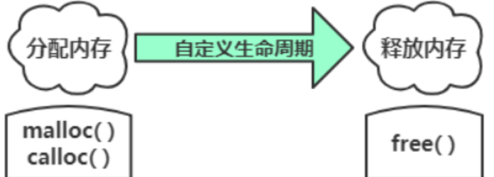


#### 4.1.4 寄存器变量

> 其声明周期与局部变量相同，该变量地址无法获取。
>
> register由于是在寄存器（动态存储区）中，所以，寄存器变量不可能同时又是全局变量或者静态变量！

- 使用关键字register来声明局部变量时，该变量即称为寄存器变量。

- 寄存器变量是<font color='red'>动态局部变量</font>，存放在<font color='red'>CPU的寄存器或动态存储区</font>中（非内存），该类变量的作用域、生存期与自动变量相同。如果没有存放在寄存器中，就按自动变量处理。

寄存器变量的好处是：寄存器的存储速度比内存快得多。但是由于现在编译系统的优化，使得编译器可以自动识别频繁使用的变量，并自动将其存储在寄存器中，故而现在寄存器变量的定义是不必要的。

```c
register 类型 变量名;
```

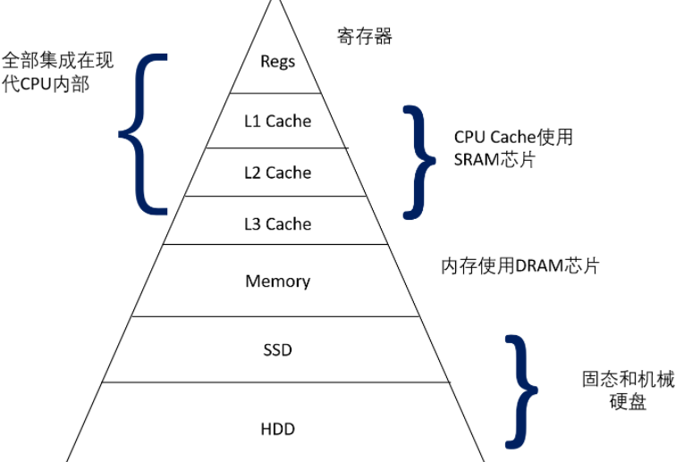


#### 4.1.5 外部变量

外部变量（即全局变量）是在函数的外部定义的，**它的作用域为从变量定义处开始，到本程序文件的末尾。**

**如果其他文件想引用别的文件的外部变量，需在引用之前用关键字extern对该变量作“外部变量声明”。**<font color='red'>表示该变量是一个已经定义的外部变量。</font>

```c
extern 类型 变量名;
```

> 当编译开始的时候，编译器总能**从使用extern进行外部变量声明的地方**开始在本文件中查找外部变量的定义。
>
> - 如果外部变量的定义在本文件中找到，那么外部变量的作用域就在本文件中进行扩展；
>
> - 如果本文件中没有找到，编译器就会去其他文件中查找外部变量的定义。这时，变量的作用域就扩展到了其他文件。


## 5. 预处理

> 预处理指令：
>
> - #define、#include
>
> - #ifdef、#else、#endif、#ifndef
> - #if、#elif
> - #error、#pragma、#line


### 5.1 预定义宏

|       预定义符号       | 说明                                                     |
| :--------------------: | :------------------------------------------------------- |
|       \__FILE__        | 进行编译的源文件                                         |
|       \__LINE__        | 文件当前的行号                                           |
|       \__DATA__        | 文件被编译的日期                                         |
|       \__TIME__        | 文件被编译的时间                                         |
|       \__STDC__        | 若编译器遵循ANSI C，其值为1；否则，未定义                |
|     \__FUNCTION__      | 返回所在函数的函数名                                     |
| \__STDC\_\_VERSION\_\_ | 支持C99标准，设置为199901L；支持C11标准，设置为201112L。 |

```
printf("The file is %s.\n", __FILE__);
printf("The date is %s.\n", __DATE__);
printf("The time is %s.\n", __TIME__);
printf("The version is %ld.\n", __STDC_VERSION__);
printf("This is line %d.\n", __LINE__);
printf("This function is %s\n", __func__);
```


### 5.2 #define 宏定义

- **'#'：将宏参数插入到字符串中**

```c
#define PRINT(X) printf("变量"#X"的值是%d\n", X);

int a = b = 10;
PRINT(a); // printf("变量""a""的值是%d\n", a);
PRINT(b); // printf("变量""b"的值是%d\n", b);
```

- **'##'：**将两边的符号缝合成一个符号

```c
#define CAT(X,Y) X##Y

int vs2003 = 100;
printf("%d\n", CAT(vs, 2003)); // printf("%d\n", vs2003);   转成变量名了
```

注意：\## 也可以将多个符号合成一个符号，比如 **X**##**Y**##**Z**

- 让程序不仅仅打印整数，还可以打印其他类型的数（比如浮点数）：

```c
#define PRINT(X, FORMAT) printf("变量"#X"的值是 "FORMAT"\n", X);

float f = 5.5f;
PRINT(f, "%.1f"); //printf("变量""f""的值是 ""%.1f""\n", f);
```


- **变量宏：... 和 \_ \_VA\_ARGS\_ \_**

```c
#define PR(...) printf(__VA_ARGS__)
PR("Howdy");
PR("weight = %d, shipping = $%.2f\n", wt, sp);

// 预处理展开后
printf("Howdy");
printf("weight = %d, shipping = $%.2f\n", wt, sp)
```

```c
#define PR(X, ...) printf("Message " #X ": " __VA_ARGS__)
int main(void)
{
	double x = 48;
	double y;
	y = sqrt(x);
	PR(1, "x = %g\n", x);
	PR(2, "x = %.2f, y = %.4f\n", x, y);
	return 0;
}

// 预处理展开后
printf("Message " "1" ": " "x = %g\n",x);                 // Message 1: x = 48
printf("Message " "2" ": " "x = %.2f, y = %.4f\n",x,y);   // Message 2: x = 48.00, y = 6.9282
```


### 5.3 #undef移除宏定义

不管前面有没有进行了宏定义，还是可以执行#undef指令。

```c
#define M 100

int main(void) {
    int a = M;
    printf("%d\n", M);
#undef M // 使用完后，移除宏定义,就可以把M重新定义为一个新值
    return 0;
}
```


### 5.4 #line和#error

- **#line**

​	#line指令重置\_\_LINE\_\_和\_\_FILE\_\_宏报告的行号和文件名。

```c
#line 1000          // 把当前行号重置为1000
#line 10 "100.c"    // 把行号重置为10，文件名重置为”100.c“
```

- **#error**

​	#error指令让预处理器发出一条错误消息，该消息包含指令中的文本。如果可能的话，编译过程应该中断。

```c
#if __STDC_VERSION__ != 201112L
#error Not C11
#endif

// 编译后输出
newish.c:14:2: error: #error Not C11
// gcc -std=c11 newish.c  输出空
```


### 5.5 #pragma

\#pragma把编译器指令放入源代码中

> 例如，在开发C99时，标准被称为C9X，可以使用下面的编译指示（pragma）让编译器支持C9X：
>
> \#pragma c9x on


### 5.6 条件编译

让编译器根据编译时的条件执行或忽略信息（或代码）块。

- 常量表达式

​	如果常量表达式为真，参加编译。反之如果为假，则不参加编译

```c
#define 常量表达式
	...
#endif
      

#define PRINT 1
        
// 例如   
#if PRINT == 2 // 假
    printf("rose\n");
#elif 2 == 2 // 真
    printf("you jump\n");
#else 
    printf("i jump\n")
#endif
```


- 判断是否被编译

```
#ifdef 
	...   
#endif 

#ifndef 
   ... 
#endif 
```

```c
#define __DEBUG__ 
int main(void)
{
    int arr[10] = {0};
    int i = 0;
    for (i = 0; i < 10; i++) {
        arr[i] = i;
        #ifdef __DEBUG__ 
        printf("%d ", arr[i]);   
        #endif 
    }
 
    return 0;
}
```

较新的编译器提供另一种方法测试名称是否已定义，即用#if defined (VAX)代替#ifdef VAX。


### 5.7 头文件包含 #include

#### 5.7.1 头文件的查找策略

-  < > 的查找策略：直接去系统目录下查找。（如果仍然找不到，就提示编译错误）

- " " 的查找策略：先在当前所处的工作目录（或文件名中指定的其他目录）查找。如果未找到再查找标准系统目录。

> **linux标准头文件的路径:** /usr/include
>
> **VS环境**: C:\Program Files (x86)\Microsoft Visual Studio 12.0\VC\include

```
#include <stdio.h>       ← 查找系统目录
#include "hot.h"         ← 查找当前工作目录
#include "/usr/biff/p.h" ← 查找/usr/biff目录
```

> 注意：具体查找哪个目录取决于编译器的设定。有些编译器会搜索<font color='wildstrawberry'>源代码文件所在的目录</font>，有些编译器则搜索<font color='wildstrawberry'>当前的工作目录</font>，还有些搜索<font color='wildstrawberry'>项目文件所在的目录</font>


#### 5.7.2 头文件内容

- 明示常量——例如，stdio.h中定义的EOF、NULL和BUFSIZE（标准I/O缓冲区大小）。

- 宏函数——例如，getc(stdin)通常用getchar()定义，而getc()经常用于定义较复杂的宏，头文件ctype.h通常包含ctype系列函数的宏定义。

- 函数声明——例如，string.h头文件（一些旧的系统中是strings.h）包含字符串函数系列的函数声明。在ANSI C和后面的标准中，函数声明都是函数原型形式。

- 结构模版定义——标准I/O函数使用FILE结构，该结构中包含了文件和与文件缓冲区相关的信息。FILE结构在头文件stdio.h中。

- 类型定义——标准 I/O 函数使用指向 FILE 的指针作为参数。通常，stdio.h 用#define 或typedef把FILE定义为指向结构的指针。类似地，size_t和time_t类型也定义在头文件中。
- 声明外部变量供其他文件共享  ` extern int status; // 在头文件中`


#### 5.7.3 嵌套文件的包含

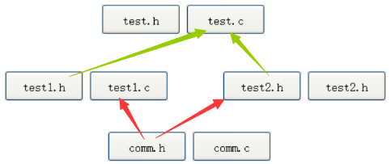

> 问题：最终程序中就会出现两份 **comm.h** 的内容，这样就造成了文件内容的重复。

使用条件编译指令，每个头文件的开头写： **防止头文件被重复多次包含。**

```c
#ifndef __TEST_H__
#define __TEST_H__
// 头文件的内容 
#endif
```

【第二种】

```c
#pragma once // 让头文件即使被包含多次，也只包含一份
```


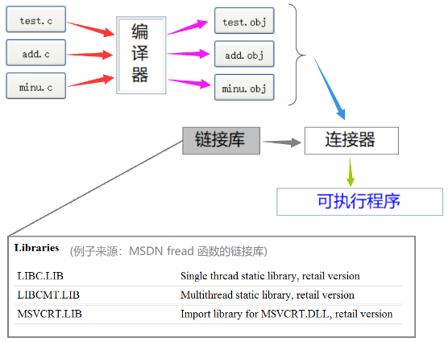


## 6. 文件输入/输出

```
fopen()/fclose();
getc()/putc();
fscanf()/fprintf();fgets()/fputs();  
rewind()、fseek()、ftell()、fflush();
```


## c语言中的一些未定义错误  

编译器在编译时不会检查未定义错误。

- 数据下标越界


格式化输出

```c
%6d   /*按照十进制整型数输出，至少6个字符宽*/
%6f   /*按照浮点数打印，至少6个字符宽*/
%.2f  /*小数点后面2位小数*/
%6.2f /*至少6个字符宽，小数点后有两位小数*/
%.0f  /*强制不打印小数点和小数部分，小数部分位数为0*/
  
%o /*表示八进制数*/
%x /*表示十六进制数*/
%c /*表示字符*/
%s /*表示字符串*/
%% /*表示%本身*/
```

### 字符输入/输出

#### 1.一次读/写一个字符

##### 1.getchar

从流或键盘上，读入一个输入字符。

读取成功，返回ASCII码；失败则返回EOF。

> c = getchar();

##### 2.putchar

打印一个字符，显示在屏幕上。

> putchar();


#### 2.文件复制

第一版本

```c
int c;
while((ch = getchar()) != EOF){  /* !=的优先级比=高*/
		putchar(c);
}
```


## C99特性

### 1.指定初始化器

初始化数组中指定位置的元素。

```c
int arr[6] = {0,0,0,0,0,212}; // 传统的语法
int arr[6] = {[5] = 212};     // C99写法

// 初始化数组中索引为4的元素
#define MONTHS 12
int days[MONTHS] = { 31, 28, [4] = 31, 30, 31, [1] = 29 }; // 31 29 0 0 31 30 31 0 0 0 ...
```

如果指定[4] = 20,31,23   那么会将索引4后面的元素都会依次被初始化


### 2.可变长数组

可变长数组：指的是在<font color='cornflowerblue'>创建时，可以用变量指定数组的维度</font>。但在创建之后，数组的大小是固定的，不可修改。

可动态分配内存，即在运行时指定数组的大小。

#### 1.定义可变长数组

```c
int arr[m];   // C99之前不允许
int arr[n];   // C99之前不允许

// 通用的指定数组大小
int arr[MAXSIZE];
int arr[10];
int arr[sizeof(int)*2];  // sizeof表达式值为整数常量
int arr[(int)2.5];
int arr[5*2+1];
```

#### 2.带变长数组形参的函数

声明的函数可以处理任意大小的二维数组

```c
// ar是一个指针，指向一个含cols个int类型的值的数组  即data[0]
// row和col变量声明在前，ar的声明由于用到row和col，所以必须声明在其之后
int sum2d(int rows, int cols, int ar[rows][cols]);

// 错误写法
int sum2d(int ar[rows][cols], int rows, int cols);

// 省略形参名，用*代替
int sum2d(int, int, int ar[*][*]);
```

> 注意：可变长数组<font color='red'>必须是自动存储类别的</font>，无论是函数声明还是作为函数形参声明，都<font color='red'>不能使用static或extern存储类别说明符</font>。


### 3.复合字面量

字面量：除符号常量以外的常量。 `5是int类型的字面量`、`10.5是double类型的字面量`、`”abc“是字符串类型的字面量(字符串常量)`

<font color='red'>复合字面量是匿名的，不能先创建它再使用它，而是再创建的同时使用它。</font>

- 数组类型的字面量

```c
// 普通的数组声明
int a[2] = {10,20};

// 去掉声明中的数组名，留下的int [2]就是复合字面量的类型
(int [2]){10,20} 

// 复合字面量可忽略大小，编译器会自动计算当前函数的个数
(int []){50,20,90}


// 复合字面量是匿名的，不能先创建它再使用它，而是再创建的同时使用它。
int *ptr;
ptr = (int [2]){10,20};
int (*ptr2)[4];
ptr2 = (int [2][4]){{1,2,3,4},{5,6,7,8}};


// 可把复合字面量作为实参，传递给函数形参
total = sum((int []){10,20},2);
```


### 4.新增关键字（5个）

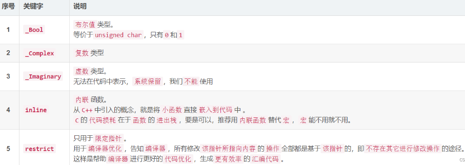


## C11特性

### 1.新增关键字（7个）

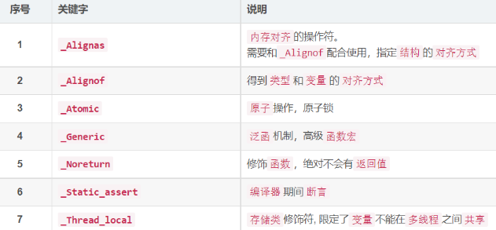


### 2.gets_s()

去除了C99中的gets()函数。

类似于fgets()： gets_s(words, STLEN);

**与fgets()区别：**

```txt
1、gets_s()只从标准输入中读取数据，只需两个参数。 fgets()第三个参数可以从文件读入
2、如果gets_s()读到换行符，会丢弃它而不是储存它。 fgets()会存储       // 这里等价与gets()
```

注意：如果gets_s()读到最大字符数都没有读到换行符。

```
1：把目标数组中的首字符设置为空字符，读取并丢弃随后的输入直至读到换行符或文件结尾，
2：然后返回空指针。
3：接着，调用依赖实现的“处理函数”（或你选择的其他函数），可能会中止或退出程序。
```


- 当读取的字符串超过最长读取限制时，gets()、fgets()、gets_s()三者区别

> 1. gets()不安全，会擦写现有数据
> 2. fgets()安全，可通过while继续读取缓冲区数据，也可对溢出部分进行丢弃。
> 3. gets_s()安全，


### 3. _Generic泛型寻找表达式

_Generic(x, int: 0, float: 1, double: 2, default: 3)

> 第1个项是一个表达式，后面的每个项都由一个类型、一个冒号和一个值组成，如float: 1。
>
> 第1个项的类型匹配哪个标签，整个表达式的值是该标签后面的值。
>
> ​	例如，假设上面表达式中x是int类型的变量，x的类型匹配int:标签，那么整个表达式的值就是0。
>
> ​	如果没有与类型匹配的标签，表达式的值就是default:标签后面的值。
>
> 泛型选择语句与 switch 语句类似，只是前 者用表达式的类型匹配标签，而后者用表达式的值匹配标签。


## C语言踩坑事项

### 1.编译器不会检查数组下标越界

在C标准中，使用越界下标的结果是未定义的。

### 2.函数原型可以省略参数名，函数定义时不能省略

```
// 四种方式等价
int sum(int *ar, int n);
int sum(int *, int);
int sum(int ar[], int n);
int sum(int [], int);
```

### 3.运算符优先级

```
* ++ //优先级一样，结合律从右往左
```

### 4.C11/C99不允许将不同类型的地址相互强转为其他指针类型

```
不允许将double类型的地址赋给指向int的指针  
```

### 5.编译器不会检查指针是否仍指向数组元素

C 只能保证指向数组任意元素的指针和**<font color='wildstrawberry'>指向数组后面第 1 个位置的指针</font>**有效。

但是，如果递增或递减一个指针后超出了这个范围，则是未定义的。

### 6.不能解引用未初始化的指针

创建一个指针时，<font color='red'>系统只分配了储存指针本身的内存，并未分配储存数据的内存</font>。因此，在使用指针之前，必须先用已分配的地址初始化它。

### 7.C++不允许把const指针赋给非const指针。而C则允许这样做

```
const int y;
const int * p2 = &y;
int *p1;
p1 = p2; // C++中不允许这样做，但是C可能只给出警告
```

但是如果通过p1更改y，其行为是未定义的.


## 头文件

### 1. limits.h和float.h

​	这两种头文件中提供了一些用于整型/浮点型的符号常量。

|     **宏**     |               **描述**                |         **值**         |
| :------------: | :-----------------------------------: | :--------------------: |
|   `HAR_BIT`    |           `char` 类型的位数           |        通常为 8        |
|   `CHAR_MIN`   | `char` 类型的最小值（有符号或无符号） |       -128 或 0        |
|   `CHAR_MAX`   | `char` 类型的最大值（有符号或无符号） |       127 或 255       |
|  `SCHAR_MIN`   |      `signed char` 类型的最小值       |          -128          |
|  `SCHAR_MAX`   |      `signed char` 类型的最大值       |          127           |
|  `UCHAR_MAX`   |     `unsigned char` 类型的最大值      |          255           |
| **短整数类型** |                                       |                        |
|   `SHRT_MIN`   |         `short` 类型的最小值          |         -32768         |
|   `SHRT_MAX`   |         `short` 类型的最大值          |         32767          |
|  `USHRT_MAX`   |     `unsigned short` 类型的最大值     |         65535          |
|  **整数类型**  |                                       |                        |
|   `INT_MIN`    |          `int` 类型的最小值           |      -2147483648       |
|   `INT_MAX`    |          `int` 类型的最大值           |       2147483647       |
|   `UINT_MAX`   |      `unsigned int` 类型的最大值      |       4294967295       |
| **长整数类型** |                                       |                        |
|   `LONG_MIN`   |          `long` 类型的最小值          | -9223372036854775808L  |
|   `LONG_MAX`   |          `long` 类型的最大值          |  9223372036854775807L  |
|  `ULONG_MAX`   |     `unsigned long` 类型的最大值      | 18446744073709551615UL |
