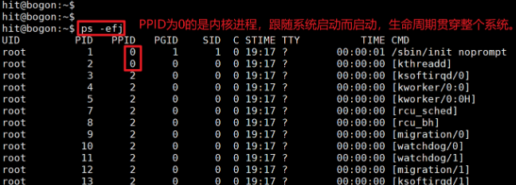
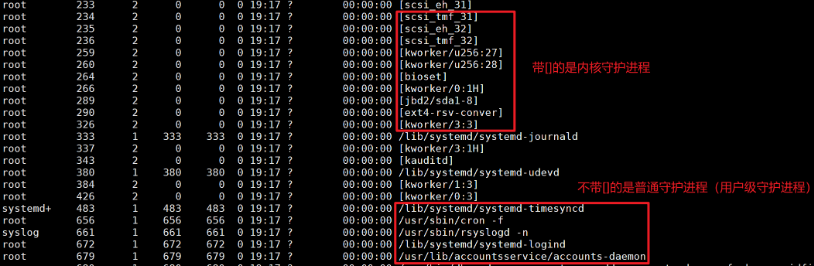
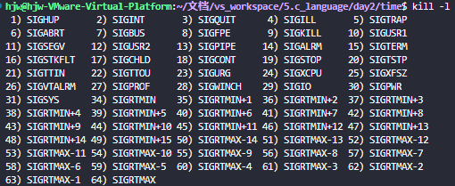
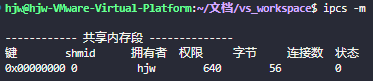

# 面向Linux的C编程

## 1. 进程

### 1.1 常用库函数

#### 1.1.1 查看进程相关信息

```
#include <unistd>; 
#include <sys/types.h>; 
```

1. 查看进程ID

```c
pid_t getpid(void); 
pid_t getppid(void);
```

2. 查看进程用户相关信息

```c
uid_t getuid(void);   // 获取进程所有者的ID 
uid_t geteuid(void);  // 获取进程的有效用户ID
gid_t getgid(void);   // 获取进程的组ID
git_t getegid(void);  // 获取进程的有效组ID
```

```c
struct passwd { 
char *pw_name; /* 登录名称 */ 
char *pw_passwd; /* 登录口令 */ 
uid_t pw_uid; /* 用户 ID */ 
gid_t pw_gid; /* 用户组 ID */ 
char *pw_gecos; /* 用户的真名 */ 
char *pw_dir; /* 用户的目录 */ 
char *pw_shell; /* 用户的 SHELL */ 
};

#include <pwd.h>; 
// 获取进程所属用户的其他信息，如登录名称、登录口令等
struct passwd *getpwuid(uid_t uid);
```


#### 1.1.2 创建子进程

##### 1. fork

```
# 子进程和父进程不同的地方只有他的进程ID和父进程ID,其他的都是一样
pid_t fork();
```

fork调用一次，返回两次。

- 子进程返回0
- 父进程返回新建子进程的进程ID


##### 2. wait or waitpid

1. 进程阻塞函数

```c
// wait系统调用会使父进程阻塞直到一个子进程结束或者是父进程接受到了一个信号

// param:
//    -stat_loc: 子进程的退出状态
// return:
//    调用成功返回子进程ID，否则返回-1,并设置全局变量 errno.
//	  子进程通过调用exit，_exit 或者是 return 来设置这个值
pid_t wait(int *stat_loc); 


// param:
//    -pid: 指定的子进程（>0）
//			=0,则等待任何一个组ID和调用者的组ID相同的进程
// 			=-1 时等同于 wait 调用
//			<-1 时等待任何一个组ID等于pid绝对值的进程
//    -stat_loc: 子进程的退出状态
//    -options: 决定父进程的状态
//			WNOHANG：父进程立即返回当没有子进程存在时
//			WUNTACHED：当子进程结束时 waitpid 返回,但是子进程的退出状态不可得到.
// return:
pid_t waitpid(pid_t pid,int *stat_loc,int options);
```

> 定义了几个宏来测试这个返回值. 
>
> - WIFEXITED：判断子进程退出值是非 0 
>
> - WEXITSTATUS：判断子进程的退出值(当子进程退出时非 0). 
>
> - WIFSIGNALED：子进程由于有没有获得的信号而退出. 
>
> - WTERMSIG：子进程没有获得的信号号(在 WIFSIGNALED 为真时才有意义). 

```c
#include <unistd.h>
#include <sys/types.h>
#include <sys/wait.h>
#include <stdio.h>
#include <errno.h>
#include <math.h>
#include <stdlib.h>
#include <string.h>
void main(void)
{
    pid_t child;
    int status;
    printf("This will demostrate how to get child status\n");
    if ((child = fork()) == -1)
    {
        printf("Fork Error ：%s\n", strerror(errno));
        exit(1);
    }
    else if (child == 0)
    {
        int i;
        printf("I am the child：%d\n", getpid());
        for (i = 0; i < 1000000; i++)
            sin(i);
        i = 5;
        printf("I exit with %d\n", i);
        exit(i);
    }
    while (((child = wait(&status)) == -1) & (errno == EINTR))
        ;
    if (child == -1)
        printf("Wait Error：%s\n", strerror(errno));
    else if (!status) // 子进程状态为0
        printf("Child %d terminated normally return status is zero\n", child);
    else if (WIFEXITED(status)) // 非0
        printf("Child %d terminated normally return status is %d\n", child, WEXITSTATUS(status));
    else if (WIFSIGNALED(status)) // 子进程由于有没有获得的信号而退出
        printf("Child %d terminated due to signal %d not caught\n", child, WTERMSIG(status));
}
```


##### 3. exec函数族

exec 族调用可以执行给定程序，man exec 

```c
int execl(const char *path,const char *arg,...); 
int execlp(const char *file,const char *arg,...); 
int execle(const char *path,const char *arg,...); 
int execv(const char *path,char *const argv[]); 
int execvp(const char *file,char *const argv[])：
```


#### 1.1.3 创建守护进程

守护进程：是一种长期运行的进程，一般是操作系统启动的时候它就启动，操作系统关闭的时候它才关闭。

守护进程跟终端无关联，即它们没有控制终端，所以控制终端退出，也不会导致守护进程退出。

守护进程是在后台运行的，不会占着终端，终端可以执行其他命令。


比如，linux下的`init` 是系统守护进程，它负责启动各运行层次特定的系统服务，所以很多进程的 PPID 是 `init`，并且这个 `init` 也负责收养孤儿进程。

```
# e：显示所有进程
# l：以长格式显示信息，如各种字段信息
# f：全格式显示  TTY（控制终端）
ps -elf
```





大多数守护进程都是以超级用户特权运行的，守护进程没有控制终端，`TTY` 这列显示的是 `?`

- 内核守护进程以无控制终端方式启动
- 普通守护进程无控制终端可能是守护进程调用了 `setsid` 的结果


**守护进程的创建思想：**

- 父进程创建一个子进程  `fork()`
- 子进程杀死父进程  `kill(getppid(),SIGTERM)`
- 信号处理所有的工作由子进程来处理

```c
#include <stdio.h>  
#include <stdlib.h>  
#include <unistd.h>  
#include <sys/types.h>  
#include <sys/stat.h>  
#include <fcntl.h>  
#include <signal.h>  
#include <syslog.h>  
  
// 函数声明  
void daemonize(const char *cmd);  
  
int main(int argc, char *argv[]) {  
    const char *cmd = "mydaemon"; // 守护进程名，用于日志  
  
    // 守护化进程  
    daemonize(cmd);  
  
    // 守护进程主循环  
    while (1) {  
        // 这里可以添加守护进程的主要任务  
        syslog(LOG_INFO, "Daemon is running.");  
        sleep(10); // 休眠10秒  
    }  
  
    return 0;  
}  
  
void daemonize(const char *cmd) {  
    pid_t pid;  
    // 第一步：创建子进程，父进程退出  
    pid = fork();  
    if (pid < 0)  
        exit(EXIT_FAILURE);  
    if (pid > 0)  
        exit(EXIT_SUCCESS);  
    // 第二步：在子进程中创建新会话  
    if (setsid() < 0)  
        exit(EXIT_FAILURE);  
  
    // 第三步：改变当前工作目录  
    // 使用chdir()来改变工作目录到根目录，或者任何目录，但不能是挂载的文件系统  
    if (chdir("/") < 0)  
        exit(EXIT_FAILURE);  
  
    // 第四步：关闭标准文件描述符  
    close(STDIN_FILENO);  
    close(STDOUT_FILENO);  
    close(STDERR_FILENO);  
  
    // 第五步：可选：打开/dev/null，并重定向标准文件描述符  
    int fd = open("/dev/null", O_RDWR);  
  
    if (fd != STDIN_FILENO) {  
        dup2(fd, STDIN_FILENO);  
        close(fd);  
    }  
  
    if (fd != STDOUT_FILENO) {  
        dup2(fd, STDOUT_FILENO);  
        close(fd);  
    }  
  
    if (fd != STDERR_FILENO) {  
        dup2(fd, STDERR_FILENO);  
        close(fd);  
    }  
  
    // 第六步：处理SIGCHLD信号  
    signal(SIGCHLD, SIG_IGN);  
  
    // 第七步：可选：记录守护进程的PID  
    // 这里没有实现，但通常可以写入到/var/run/目录下的某个文件中  
  
    // 第八步：守护进程现在可以继续执行其任务  
    // 注意：使用syslog来记录日志，而不是标准输出或错误输出  
    openlog(cmd, LOG_CONS | LOG_PID | LOG_NDELAY, LOG_LOCAL1);  
    syslog(LOG_NOTICE, "Daemon started by %s", getlogin());  
}
```


## 2. 文件操作

### 2.1 打开/关闭文件

```c
int open(const char *pathname,int flags); 
// flags为O_CREAT时使用
int open(const char *pathname,int flags,mode_t mode); 
int close(int fd);
```

flags标识位，前三位只能用一个

> 1. O_RDONLY：以只读的方式打开文件. 
>
> 2. O_WRONLY：以只写的方式打开文件. 
>
> 3. O_RDWR：以读写的方式打开文件. 
>
> 4. O_APPEND：以追加的方式打开文件. 
>
> 5. O_CREAT：创建一个文件. 
>
> 6. O_EXEC：如果使用了 O_CREAT 而且文件已经存在,就会发生一个错误. 
>
> 7. O_NOBLOCK：以非阻塞的方式打开一个文件. 
>
> 8. O_TRUNC：如果文件已经存在,则删除文件的内容. 

mode标识位

> **S_IRUSR 用户**可以读
>
> **S_IWUSR** 用户可以写
>
> **S_IXUSR** 用户可以执行
>
> **S_IRWXU** 用户可以读写执行

> S_I**R**GRP 组可以读
>
> S_I**W**GRP 组可以写
>
> S_I**X**GRP 组可以执行 
>
> S_I**RWX**G 组可以读写执行

> S_I**R**OTH 其他人可以读
>
> S_I**W**OTH 其他人可以写
>
> S_I**X**OTH 其他人可以执行
>
> S_I**RWX**O 其他人可以读写执行

> S_ISUID 设置用户执行 ID S_ISGID 设置组的执行 ID 

或者使用数字代替：5 个数字来表示文件的各种权限. 	

> 00000：第一位表示设置用户 ID.第二位表示设置组 ID,第三位表示用户自己的权限位,第四位表示组的权限,最后一位表示其他人		的权限. 
>
> rwx：1(1执行权限)，2(10写权限)，4(读权限)

```
# 比如我们要创建一个用户读写执行,组没有权限,其他人读执行的文件.设置用户ID位那么
open("temp",O_CREAT,10705);
```


### 2.2 读/写文件

```c
//read读取正常：返回值 = count
//	  读取异常：读到了文件的结尾或者被一个信号所中断,返回值(0或-1) < count。
//			- 如果是由信号中断引起返回,而且没有返回数据,read 会返回-1,且设置 errno 为 EINTR
//			- 当程序读到了文件结尾的时候,read 会返回 0.
ssize_t read(int fd, void *buffer,size_t count); 
ssize_t write(int fd, const void *buffer,size_t count);
```


### 2.3 文件属性

#### 2.3.1 access 检测文件权限

- 判断文件是否可以进行某种操作(读,写等等)

```c
// R_OK 文件可以读,W_OK 文件可以写,X_OK 文件可以执行,F_OK 文件存在.
// 有权限，返回0；否则如果有一个条件不符时,返回-1.
int access(const char *pathname,int mode);
```

#### 2.3.2 stat和fstat 获取文件的其他属性

- 获取文件的其他属性

```c
// stat 用来判断没有打开的文件
// fstat 用来判断打开的文件，使用最多的属性是 st_mode，来判断给定的文件是一个普通文件还是一个目录,连接等等
int stat(const char *file_name,struct stat *buf); 
int fstat(int filedes,struct stat *buf);
```

```c
struct stat { 
    dev_t st_dev; /* 设备 */ 
    ino_t st_ino; /* 节点 */ 
    mode_t st_mode; /* 模式 */ 
    nlink_t st_nlink; /* 硬连接 */ 
    uid_t st_uid; /* 用户 ID */ 
    gid_t st_gid; /* 组 ID */ 
    dev_t st_rdev; /* 设备类型 */ 
    off_t st_off; /* 文件字节数 */ 
    unsigned long st_blksize; /* 块大小 */ 
    unsigned long st_blocks; /* 块数 */ 
    time_t st_atime; /* 最后一次访问时间 */ 
    time_t st_mtime; /* 最后一次修改时间 */ 
    time_t st_ctime; /* 最后一次改变时间(指属性) */ 
};

S_ISLNK(st_mode)//是否是一个连接
S_ISREG(st_mode)//是否是一个常规文件
S_ISDIR(st_mode)//是否是一个目录
S_ISCHR(st_mode)//是否是一个字符设备
S_ISBLK(st_mode)//是否是一个块设备 
S_ISFIFO(st_mode)//是否是一个FIFO文件
S_ISSOCK(st_mode)//是否是一个 SOCKET 文件
```


### 2.4 目录文件

#### 2.4.1 getcwd 查看当前的工作路径

```c
char *getcwd(char *buffer,size_t size);
```

#### 2.4.2 mkdir 创建文件夹

```c
int mkdir(const char *path,mode_t mode); 
```

#### 2.4.3 opendir

```c
DIR *opendir(const char *path); 
```

#### 2.4.4 readdir

读一个打开的目录

```c
struct dirent *readdir(DIR *dir); 
```

#### 2.4.5 rewinddir

重读目录的和学的 rewind 函数一样

```c
void rewinddir(DIR *dir); 
```

#### 2.4.6 telldir

telldir 和 seekdir 类似与 ftee 和 fseek 函数. 

```c
off_t telldir(DIR *dir); 
```

#### 2.4.7 seekdir

```c
void seekdir(DIR *dir,off_t off); 
```

#### 2.4.8 closedir

```c
int closedir(DIR *dir); 
```


### 2.5 管道文件

Linux提供了许多的过滤和重定向程序,比如 more、cat 等等。还提供了< >; | <<等等重定向操作符

#### 2.5.1 pipe 创建管道

```c
// fildes[0]是用来读的文件描述符,而fildes[1]是用来写的文件描述符
int pipe(int fildes[2]);
```

#### 2.5.2 dup2 重定向

```c
// 用oldfd文件描述符来代替newfd文件描述符,同时关闭newfd文件描述符
// 即所有向 newfd 操作都转到 oldfd 上面
int dup2(int oldfd,int newfd);
```


## 3. 系统时间操作

### 3.1 time和ctime输出系统时间

​	输出系统当前的时间，使用<font color='red'> date 命令</font>

```c
// 1.返回从1970年1月1日0点以来的秒数。
time_t time(time_t *tloc); 
// 2.再将秒数转化为长度固定为26的字符串  可能值为Thu Dec 7 14：58：59 2000 
char *ctime(const time_t *clock);
```

### 3.2 gettimeofday 获取时间

​	将时间保存在结构 tv 之中，tz 一般我们使用 NULL 来代替。

```c
int gettimeofday(struct timeval *tv,struct timezone *tz); 
```

```c
strut timeval { 
    long tv_sec; /* 秒数 */ 
    long tv_usec; /* 微秒数 */ 
};
```

[案例]：计算程序执行的时间

```c
struct timeval start;
struct timeval end;
float timeuse;

gettimeofday(&start,NULL);
// 执行自定义程序
gettimeofday(&end,NULL);
timeuse=1000000*(end.tv_sec-start.tv_sec)+end.tv_usec-start.tv_usec;
timeuse/=1000000; 
printf("Used Time：%f\n",timeuse);
```

### 3.3 计时器使用

linux为每一个进程提供了 3 个内部间隔计时器类型：

（1）ITIMER_REAL：减少实际时间，一到时就发出 SIGALRM 信号.    `无论进程是否在执行，定时器都会继续计时`

（2）ITIMER_VIRTUAL：减少有效时间(进程执行的时间)，产生 SIGVTALRM 信号. 

（3）ITIMER_PROF：减少进程的有效时间和系统时间(为进程调度用的时间)。这个经常和上面一个使用，用来计算系统内核时间和用户时间.产生 SIGPROF 信号. 

```c
struct itimerval { 
	struct timeval it_interval; // 指定了定时器每隔多长时间（以秒和微秒为单位）重复触发。 当定时器到点了，就会将值放到it_value中
	struct timeval it_value;  // 指定了定时器首次触发之前要等待的时间。 下一个计时器的过期时间
}
```

```c
//  which：表示上面使用三个计时器中的哪一个

// getitimer：获取保存在value中的间隔计时器的时间值
// 获取当前某个定时器的设置
int getitimer(int which, struct itimerval *value); 

// setitimer：设置定时器新的间隔时间值为newval，并（可选地）获取旧的值
//   		 设置或重置某个定时器的值，并（可选地）获取旧的值
int setitimer(int which, struct itimerval *newval, struct itimerval *oldval);
```

【示例】

```c
#define _XOPEN_SOURCE 700
#include <stdio.h>
#include <sys/time.h>
#include <unistd.h>
#include <signal.h>
#include <string.h>
#include <stdlib.h>
#define PROMPT "时间已经过去两秒了...\n"

char *prompt = PROMPT;
unsigned int len;

void prompt_info(int signo)
{
    write(STDERR_FILENO, prompt, len);
}

void init_time()
{
    struct itimerval val;
    memset(&val, 0, sizeof(struct itimerval));
    // 设置定时器时间，每隔2秒触发
    val.it_interval.tv_sec = 2;
    val.it_interval.tv_usec = 0;
    // 设置首次触发时间，两秒后
    val.it_value = val.it_interval;
    setitimer(ITIMER_PROF, &val, NULL);
}

void init_sigaction(void)
{
    struct sigaction act;
    act.sa_handler = prompt_info;
    act.sa_flags = 0;
    sigemptyset(&act.sa_mask);
    sigaction(SIGPROF, &act, NULL);
}

int main()
{
    len = strlen(PROMPT);
    init_sigaction();
    init_time();
    while (1);
    exit(0);
}
```


## 4. 信号处理

### 4.1 信号产生




可通过`man 7 signal`查看信号的详细解释。


发送信号有两种来源：

- 硬件原因（如按下键盘）
- 软件原因（使用**系统函数或命令**发出信号）
  - 系统函数（kill、raise、alarm、setitimer）

```c
#include <sys/types.h>
#include <signal.h>
#include <unistd.h>

// kill系统调用负责向进程发送信号 sig
int kill(pid_t pid,int sig);
int raise(int sig); 
unisigned int alarm(unsigned int seconds);
```

#### 4.1.1 kill

kill系统调用负责向进程发送信号 sig，它可以用来终止运行不正常的程序或者反过来拒绝终止的程序。

- 如果 pid >0，那么信号 sig 被发送到**进程 pid.** 

- 如果 pid = 0，那么信号 sig 被发送到**所有和 pid 进程在同一个进程组**的进程

- 如果 pid = -1,那么信号**发给所有的进程表**中的进程。除了最大的那个进程号。 

如果 pid 由于-1,和 0 一样,只是发送进程组是-pid


#### 4.1.2 raise

raise 系统调用向自己发送一个 sig 信号。


#### 4.1.3 alarm

alarm 在 seconds 秒后向自己发送一个 SIGALRM 信号


### 4.2 信号操作

#### 4.2.1 信号集操作

```c
#include <signal.h>; 
// 初始化信号集合set,将set设置为空
int sigemptyset(sigset_t *set); 
// 初始化信号集合,只是将信号集合设置为所有信号的集合
int sigfillset(sigset_t *set); 

// 将信号signo加入到信号集合之中
int sigaddset(sigset_t *set,int signo); 
// 将信号从信号集合中删除
int sigdelset(sigset_t *set,int signo); 
// 查询信号是否在信号集合之中
int sigismember(sigset_t *set,int signo); 

// 将指定的信号集合set加入到进程的信号阻塞集合之中去
//        oset：当前的进程信号阻塞集
//        how： 函数的操作方式
int sigprocmask(int how,const sigset_t *set,sigset_t *oset);
```

【示例】

```c
#define _XOPEN_SOURCE 700
#include <signal.h>
#include <stdio.h>
#include <math.h>
#include <stdlib.h>

int main()
{
    int y;
    sigset_t intmask;
    sigemptyset(&intmask);
    sigaddset(&intmask, SIGINT);
    while (1)
    {
        // 设置阻塞信号集
        //    若没有取消阻塞“CTRL+C”信号，则按下“CTRL+C”，程序不会被终止（信号被屏蔽了，所以进程接收不到，没反应）
        sigprocmask(SIG_BLOCK, &intmask, NULL);
        fprintf(stderr, "SIGINT signal blocked\n");
        for (int i = 0; i < 10; i++)
        {
            y = i;
        }
        fprintf(stderr, "Blocked calculation is finished\n");
        /* 取消阻塞后，信号SIGINT就能起作用了 */
        //    加上取消阻塞后，按下“CTRL+C”，信号发给进程，程序被终止（没反应）
        sigprocmask(SIG_UNBLOCK, &intmask, NULL);
        for (int i = 0; i < 10; i++)
        {
            y = i;
        }
        fprintf(stderr, "Unblocked calculation is finished\n");
    }
    exit(0);
}
```


#### 4.2.2 sigaction函数

```c
#include <signal.h>
// signo：要处理的信号 (SIGKILL和SIGSTOP除外)
// act：对这个信号如何处理
// oact：对这个信号历史的处理，一般为NULL，用于保存信息的。
int sigaction(int signo,const struct sigaction *act, struct sigaction *oact); 
	
struct sigaction {  
	void (*sa_handler)(int signo);   // 要进行的信号操作的函数
	void (*sa_sigaction)(int siginfo_t *info,void *act);  // 和sa_restore使用的不多
	sigset_t sa_mask;    // 阻塞信号集，指定在信号处理函数执行期间需要被阻塞的信号集合
	int sa_flags;  // 设置信号操作的各个情况，一般设置为0
	void (*sa_restore)(void); 
}
```

> sa_handler 有两个特殊的值：SIG_DEL 和 SIG_IGN
>
> - SIG_DEL 是使用缺省的信号操作函数（default）
>
> - SIG_IGN 是使用忽略该信号的操作函数（ignore）

【示例】捕捉用户的”CTRL+C“信号

```c
#include <signal.h>
#include <stdio.h>
#include <string.h>
#include <errno.h>
#include <unistd.h>
#define PROMPT "你想终止程序吗?" 
char *prompt=PROMPT; 

void ctrl_c_op(int signo) 
{ 
	write(STDERR_FILENO,prompt,strlen(prompt)); 
}
/**
*在上面程序的信号操作函数之中,我们使用了 write 函数而没有使用 fprintf 函数
*   是因为如果我们在信号操作的时候又有一个信号发生,那么程序该如何运行呢? 
*      为了处理在信号处理函数运行的时候信号的发生,我们需要设置sa_mask成员
*      我们将我们要屏蔽的信号添加到sa_mask结构当中去，这样这些函数在信号处理的时候就会被屏蔽掉的.
*/
int main() 
{ 
	struct sigaction act; 
	act.sa_handler=ctrl_c_op; 
	sigemptyset(&act.sa_mask); 
	act.sa_flags=0; 
	if(sigaction(SIGINT,&act,NULL)<0) 
	{ 
		fprintf(stderr,"Install Signal Action Error：%s\n\a",strerror(errno)); 
		exit(1); 
	} 
	while(1); 
}
```

#### 4.2.3 其他信号函数（很少用到）

```c
#include <unistd.h> 
#include <signal.h>

// 是挂起进程直到一个信号发生了
int pause(void);
// 挂起进程，只是在调用的时候用sigmask取代当前的信号阻塞集合
int sigsuspend(const sigset_t *sigmask);
```

```c
#include <sigsetjmp>
int sigsetjmp(sigjmp_buf env,int val);
void siglongjmp(sigjmp_buf env,int val);
```


## 5. 消息管理

### 5.1 无名信号量

信号量主要是用来保护共享资源，使得资源在一个时刻只有一个进程所拥有。PV操作

**无名信号量一般<font color='red'>用于线程间同步或互斥</font>，而有名信号量一般用于进程间同步或互斥**。

> 无名信号量的操作与有名信号量差不多，但它不使用文件系统标识，直接存在程序运行的内存中， **不同进程之间不能访问，不能用于不同进程之间相互访问**。

```c
#include <semaphore.h>
// 创建一个信号量,并初始化其值为 value
// pshared：决定了信号量能否在几个进程间共享，但linux中还未实现，所以一般设置为0
int sem_init(sem_t *sem,int pshared,unsigned int value); 
// 销毁信号量
int sem_destroy(sem_t *sem); 

// 阻塞进程,直到信号量的值大于 0
int sem_wait(sem_t *sem); 
// 不阻塞，当信号灯的值为 0 的时，返回 EAGAIN，表示以后重试
int sem_trywait(sem_t *sem);

// 将信号量的值加一，同时发出信号，唤醒等待的进程
int sem_post(sem_t *sem); 
// 获取信号量的值
int sem_getvalue(sem_t *sem);
```


### 5.2 System V信号量

```c
#include <sys/types.h>; 
#include <sys/ipc.h>; 
#include <sys/sem.h>; 

// 根据 pathname 和 proj 来创建一个关键字
key_t ftok(char *pathname,char proj);

// 创建或者打开一个信号量集
/* 参数说明 : 
		key: 由ftok创建的或者可以是IPC_PRIVATE表明由系统选用一个关键字
		nsems： >0 创建一个新的信号量集，指定集合中信号量的数量，一旦创建就不能更改。
			   =0 访问一个已存在的集合
		semflg：创建的权限标志（和我们创建一个文件的标志相同）
*/
int semget(key_t key,int nsems,int semflg); 

/* 对信号集的一系列控制操作（semval 的赋值等）
  参数说明 : semid  :  要操作的信号标志
            semnum :  信号的个数
            cmd：操作的命令  两种：SETVAL(设置信号量的值)和 IPC_RMID(删除信号量).
            arg：给cmd的参数 
*/
int semctl(int semid,int semnum,int cmd,union semun arg); 

/**
	实现信号量的PV操作 
	参数说明： 
		semid：是 semget 返回的信号量集索引
		spos： 指向信号量操作结构体数组
		nspos： 表明数组的个数, opsptr 所指向的数组中的 sembuf 结构体的个数
*/
int semop(int semid,struct sembuf *spos,int nspos); 

// 信号量操作结构体 封装了PV操作的基本参数 
struct sembuf {  
    short sem_num; /* 要操作的信号量在信号量集里的编号  */ 
    short sem_op; /* 信号量操作
                     1.sem_op > 0 : 其值就加到信号量上，即释放信号量控制的资源,并唤醒等待信号增加的进程
                     2.sem_op = 0:  如果信号量是0，就返回，否则，阻塞直到信号量值为0
                     3.sem_op < 0 : 判断信号量 + 这个负值:
                     					- 如果=0，唤醒等待信号量为0的进程；
                     					-    <0，函数阻塞
                                        -    >0, 从信号量里面减去这个值，并返回
                  */
    short sem_flg; /* 操作的标志 
    				 Value: 1. SEM_UNDO 由进程自动释放信号量
                            2. IPC_NOWAIT 不阻塞
    				*/ 
};
```


### 5.3 消息队列

```c
// 1.创建或获取一个消息队列描述符
/**
*   key: 键值，唯一标识一个消息队列，可取由ftok创建的key值或指定的一个非负整数值
*   msgflg: 用于控制 msgget 函数的行为  IPC_CREAT | IPC_EXCL时，若消息队列不存在则创建，否则返回失败并设置erron标识为EEXIST
*/
int msgget(key_t key,int msgflg); 


// 2.向标识符为msgid的消息队列中写入消息   成功返回0，失败返回-1并设置errno指明错误的原因
/*
	msqid: 消息队列标识符
	msgp: 是一个指针，指向调用者定义的结构
	msgsz: 发送消息正文的字节数，注意这里的是指正文内容mtext里面数据的字节数,不含消息类型占用的4个字节
	msgflg: 发送消息标志位
			0 当消息队列满时，msgsnd将会阻塞，直到消息能写进消息队列
			IPC_NOWAIT	当消息队列已满的时候，msgsnd函数不等待立即返回
			IPC_NOERROR 若发送的消息大于size字节，则把该消息截断，截断部分将被丢弃，且不通知发送进程
*/
int msgsnd(int msgid,struct msgbuf *msgp,int msgsz,int msgflg); 


// 3.向标识符为msgid的消息队列中写入消息 成功返回实际读取到的字节数，失败返回-1并设置errno指明错误的原因
/*
	msqid: 消息队列标识符
	msgp: 指针，指向接收数据结构体
	msgsz: 接收的正文内容mtext字节大小，不含消息类型占用的4个字节
	msgtyp: 要接收的消息队列的消息类型
	msgflg:接收消息标志位 
	       0 阻塞式接收消息，没有该类型的消息msgrcv函数一直阻塞等待
	       IPC_NOWAIT  如果没有返回条件的消息调用立即返回，此时错误码为ENOMSG
	       IPC_NOERROR 如果队列中满足条件的消息内容大于所请求的size字节，则把该消息截断，截断部分将被丢弃
*/
int msgrcv(int msgid,struct msgbuf *msgp,int msgsz, long msgtype,int msgflg); 


// 4.获取或设置消息队列的属性 成功返回0，失败返回-1并设置errno指明错误的原因
/**
	msqid: 由msgget函数返回的消息队列标识符
	cmd: 操作指令
	buf: 一个指向 msqid_ds 结构的指针。
         当 cmd 是 IPC_STAT 时，该结构用于获取消息队列的状态信息
         当 cmd 是 IPC_SET 时，该结构用于设置消息队列的属性
         当 cmd 是 IPC_RMID 时，设置为NULL表示删除该消息队列
*/
int msgctl(int msgid,int cmd,struct msqid_ds *buf);
```

```c
// 用户自定义结构体
struct msgbuf { 
    long mtype;       /* message type, must be > 0 */
	char mtext[10];    /* message data */ 
}

struct msqid_ds {
       struct ipc_perm msg_perm;   /* Ownership and permissions */
       time_t          msg_stime;  /* Time of last msgsnd(2) */
       time_t          msg_rtime;  /* Time of last msgrcv(2) */
       time_t          msg_ctime;  /* Time of creation or last
                                      modification by msgctl() */
       unsigned long   msg_cbytes; /* # of bytes in queue */
       msgqnum_t       msg_qnum;   /* # number of messages in queue */
       msglen_t        msg_qbytes; /* Maximum # of bytes in queue */
       pid_t           msg_lspid;  /* PID of last msgsnd(2) */
       pid_t           msg_lrpid;  /* PID of last msgrcv(2) */
};

struct ipc_perm {
        key_t          __key;       /* Key supplied to msgget(2) */
        uid_t          uid;         /* Effective UID of owner */
        gid_t          gid;         /* Effective GID of owner */
        uid_t          cuid;        /* Effective UID of creator */
        gid_t          cgid;        /* Effective GID of creator */
        unsigned short mode;        /* Permissions */
        unsigned short __seq;       /* Sequence number */
};

```

```c
#include <stdio.h>
#include <stdlib.h>
#include <string.h>
#include <time.h>
#include <unistd.h>
#include <errno.h>
#include <sys/types.h>
#include <sys/ipc.h>
#include <sys/msg.h>

#define MSGSIZE 1024

struct msgbuf
{
    long mtype;
    char mtext[80];
};

void usage(char *prog_name, char *msg)
{
    if (msg != NULL)
        fputs(msg, stderr);

    fprintf(stderr, "Usage: %s [options]\n", prog_name);
    fprintf(stderr, "Options are:\n");
    fprintf(stderr, "-s \"msg\"       send message using msgsnd()\n");
    fprintf(stderr, "-r             read message using msgrcv()\n");
    fprintf(stderr, "-t             message type (default is 1)\n");
    fprintf(stderr, "-k             message queue key (default is 1234)\n");
    fprintf(stderr, "-d keyvalue    remove a message queue\n");
    exit(EXIT_FAILURE);
}

/*
 * init_data_msg 初始化消息队列，设置消息队列大小
 *
 * return 返回消息的的msg_id
 */
int msg_queue_init(key_t key)
{
    int ret, msg_id;
	msg_id = msgget(key, IPC_CREAT | IPC_EXCL | 0666);//创建
	if (msg_id == -1) {
		if (errno == EEXIST) {
            printf("Message queue which key: %d is already exit !\n", key);
			msg_id = msgget(key, 0);
            return msg_id;
		} else {
			printf("Message queue creation failed: %s(errno: %d)\n", strerror(errno), errno);
			return -1;
		}
	}

    // 普通用户会设置失败,可能跟系统的限制或SELinux/AppArmor策略有关,要以root运行才行
    struct msqid_ds buf;
	memset(&buf, 0, sizeof(struct msqid_ds));

	ret = msgctl(msg_id, IPC_STAT, &buf);
	if (ret == -1) {
		printf("msgctl IPC_STAT failed: %s(errno: %d)\n", strerror(errno), errno);
	}
	buf.msg_qbytes = 1048576;//1M
	ret = msgctl(msg_id, IPC_SET, &buf);
	if (ret == -1) {
		printf("data msgctl IPC_SET failed: %s(errno: %d)\n", strerror(errno), errno);
	}

    return msg_id;
}

// 删除指定key值的消息队列
int delete_msg_queue(key_t key) {
    int msgid;
    // 通过key值获取消息队列ID
    msgid = msgget(key, 0);
    if (msgid == -1) {
        if (errno == ENOENT) {
            fprintf(stderr, "Message queue with key %d does not exist.\n", key);
        }
        return -1;
    }
    
    // 删除消息队列
    if (msgctl(msgid, IPC_RMID, NULL) == -1) {
        perror("msgctl");
        return -1;
    }
    printf("Message queue with key %d deleted successfully.\n", key);
    return 0;
}

void send_msg(int qid, int msgtype, const char* mtext)
{
    struct msgbuf msg;
    time_t t;

    msg.mtype = msgtype;

    time(&t);
    snprintf(msg.mtext, sizeof(msg.mtext), "%s at %s", mtext,
             ctime(&t));

    if (msgsnd(qid, &msg, sizeof(msg.mtext),
               IPC_NOWAIT) == -1) {
        perror("msgsnd error");
        exit(EXIT_FAILURE);
    }
    printf("sent: %s\n", msg.mtext);
}

void get_msg(int qid, int msgtype)
{
    struct msgbuf msg;

    if (msgrcv(qid, &msg, sizeof(msg.mtext), msgtype,
               MSG_NOERROR | IPC_NOWAIT) == -1) {
        if (errno != ENOMSG) {
            perror("msgrcv");
            exit(EXIT_FAILURE);
        }
        printf("No message available for msgrcv()\n");
    } else
        printf("message received: %s\n", msg.mtext);
}

int main(int argc, char *argv[])
{
    int qid, opt;
    int mode = 0;        /* 1 - send, 2 - receive , 3 - delete*/
    int msgtype = 1;
    int msgkey = 1234;
    char sendbuf[MSGSIZE] = {0};

    while ((opt = getopt(argc, argv, "s:rt:k:d:")) != -1) {
        switch (opt)
        {
        case 's':
            mode = 1;
            memcpy(sendbuf, optarg, strlen(optarg));
            break;
        case 'r':
            mode = 2;
            break;
        case 't':
            msgtype = atoi(optarg);
            if (msgtype <= 0)
                usage(argv[0], "-t option must be greater than 0\n");
            break;
        case 'k':
            msgkey = atoi(optarg);
            break;
        case 'd':
            mode = 3;
            msgkey = atoi(optarg);
            break;
        default:
            usage(argv[0], "Unrecognized option\n");
        }
    }

    if (mode == 0)
        usage(argv[0], "must use either -s or -r option\n");
    else if (mode == 3)
        delete_msg_queue(msgkey);
    else {
        qid = msg_queue_init(msgkey);
        if (mode == 2)
            get_msg(qid, msgtype);
        else
            send_msg(qid, msgtype, sendbuf);
    }

    return 0;
}
```


### 5.4 共享内存（效率最高）

```c
// 创建一个共享内存。成功返回共享内存ID，失败返回-1   0666|IPC_CREAT（所有用户对它可读写，文件不存在，则创建它）
/* 参数 
	   key:共享内存的键值（16进制）
       size:共享内存的大小（字节）
       shmflg:共享内存的访问权限（与文件权限一样）
            IPC_CREAT 
            IPC_EXCL 
*/
int shmget(key_t key,int size,int shmflg); 

// 把共享内存连接到进程的地址空间。成功返回映射到共享内存空间中的起始地址，失败返回NULL
/*
	 参数:
        shmid:共享内存ID号
        shmaddr:NULL 让系统选择一个合适的地址映射
                不为NULL， shmflg设定为SHM_RND 选择离给定地址最近的能够映射的地址进行映射，否则传递地址为4k的整数倍
*/
void *shmat(int shmid,const void *shmaddr,int shmflg); 

// 解除映射。返回值:成功返回0，失败返回-1 
/*
	参数:
	   shmaddr:映射的地址   
*/
int shmdt(const void *shmaddr); 

// 向共享内存发送命令。返回值:成功返回0 ，失败返回-1 
/*
	参数:
	   shmid:共享内存ID号
       cmd:IPC_RMID 删除共享内存
       buf:NULL   
*/
int shmctl(int shmid,int cmd,struct shmid_ds *buf); 
```


```
>> ipcs -m           # 查看系统的共享内存
>> ipcrm -m 共享内存id  # 手动删除
```



```c
#include <stdio.h>
#include <sys/shm.h>
#include <stdlib.h>
#include <string.h>
struct stu
{
    int no;
    char name[50];
};

int main()
{
    // 1.创建共享内存
    int shmid = shmget(IPC_PRIVATE, sizeof(struct stu), 0640 | IPC_CREAT);
    if (shmid == -1)
    {
        printf("shmget exec error!\n");
        exit(1);
    }
    printf("共享内存id:%d\n", shmid);
    // 2.把共享内存连接到当前进程的地址空间
    struct stu *s = (struct stu *)shmat(shmid, NULL, 0);
    if (s == (void *)-1)
    {
        printf("shmat exec error!\n");
        exit(1);
    }
    // 3.对共享内存进行读写
    s->no = 100;
    strcpy(s->name, "小黄");

    // 4.把共享内存从当前进程分离
    if (shmdt(s))
    {
        printf("shmdt exec error!\n");
        exit(1);
    }
    printf("shmdt exec success!\n");

    // 5.删除共享内存
    if (shmctl(shmid, IPC_RMID, NULL))
    {
        printf("shmctl exec error!\n");
        exit(1);
    }
    printf("shmctl exec success!\n");
}
```

