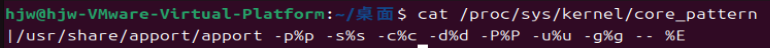
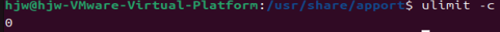
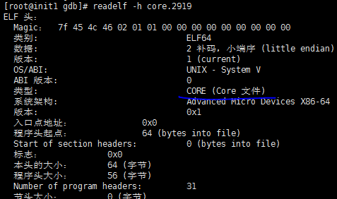
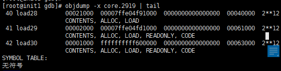
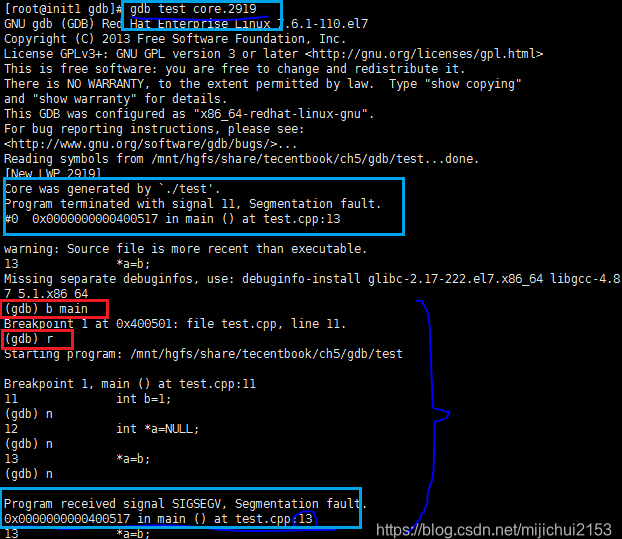
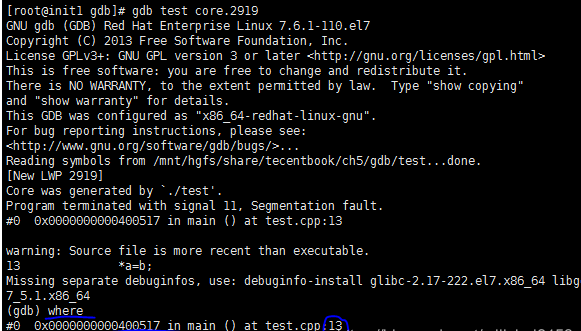

# GDB调试

## 1. 调试命令

```cmd
gcc main.c -o test -g
# -silent:用于屏蔽GDB的前导信息，否则它会在屏幕上打印一堆免责条款。
gdb test [-silent]


# 2)将gdb attach到一个进程
gdb <programe> <pid>
```

|        命令        |                说明                |
| :----------------: | :--------------------------------: |
| list [number/func] |       查看文件代码，默认10行       |
|         b          | 设置断点（根据行号、函数名、地址） |
|       info b       |            查看断点情况            |
|         n          |           运行下一行代码           |
|         s          |         步入函数体内部执行         |
|      p <var>       |             查看变量值             |
|       r(run)       |          执行被调试的程序          |
|    c(continue)     |            恢复程序运行            |
|         q          |              退出调试              |
|   help [command]   |              帮助文档              |


## 2. coredump

### 2.1 概念

- Unix/Linux的记录机制产生的一种保存程序崩溃时现场状态的记录性文件。

> Unix/Linux将程序工作的当前状况存储成一个文件，主要包括<font color='red'>程序运行</font>时候的<font color='wildstrawberry'>内存状态、寄存器状态、堆栈指针、内存管理等</font>现场信息，这就是coredump。

- 在程序崩溃的一瞬间，内核会抛出当时该程序进程的内存详细情况，存储在core.xxx文件中(如core.699)。


### 2.2 操作命令

```cmd
gdb <exec_file> <core_file>
# 或者 -c 指定转储的core文件
gdb -c <core_file> <exec_file>
```

```cmd
# bt查看调用栈
bt      # 显示所有帧栈
bt full # 显示帧栈以及局部变量
```

### 2.3 coredump文件的存储路径

【问题】有时候执行程序出现提示Segmentation fault，但是当前目录下并没有coredump文件。

1. 查询core文件位置

   ```cmd
   cat /proc/sys/kernel/core_pattern
   ```



```cmd
%p: dump（崩溃）进程的PID
%s: 导致本次core dump的信号
%c: 核心文件的大小限制（软限制，以KB为单位）
%u: dump进程的真实user_ID
%g: dump进程的真实group_ID
%e: 程序文件名
%E: dump进程的额外环境变量（格式为NAME=VALUE）
```


2. 更改coredump文件的存储位置

   ```cmd
   # 把core文件生成到/my/coredata目录下
   echo “/my/coredata”> /proc/sys/kernel/core_pattern
   ```

3. 指定内核生成的coredump文件的文件名

   通过修改kernel的参数可以指定内核所生成的coredump文件的文件名。

   ```
   # 例如，使用下面的命令使kernel生成名字为core.filename.pid格式的core dump文件
   echo “/data/coredump/core.%e.%p” > /proc/sys/kernel/core_pattern
   ```

​	这样配置后，产生的core文件中将带有崩溃的程序名、以及它的进程ID。上面的%e和%p会被替换成`程序文件名`以及`进程ID`。


### 2.4 产生coredump文件的条件

默认的core文件大小都是0.

1. 查询当前会话能生成的coredump文件的大小——**ulimit -c**

   > <font color='red'>**通常段错误却不生成core文件的原因就是因为这个0.**</font>

​	

2. 设置**当前会话**允许生成的coredump文件大小

   ```cmd
   # 只在当前会话生效
   ulimit -c unlimited
   ulimit -c [size]  # size单位是block，1block=512byte。
   ```

3. 设置在系统均有效（可以用于避免过大core文件生成的作用。）

   ```cmd
   # 在etc/profile中加入一下一行：
   ulimit -c unlimited
   ```


### 2.5 coredump产生原因

#### 2.5.1 内存访问越界

- 由于使用错误的下标，导致数组访问越界
- 搜索字符串时，依靠字符串结束符来判断字符串是否结束，但是字符串没有正常的使用结束符。
- 使用strcpy, strcat, sprintf, strcmp,strcasecmp等字符串操作函数，将目标字符串读/写爆。应该使用strncpy, strlcpy, strncat, strlcat, snprintf, strncmp, strncasecmp等函数防止读写越界。


#### 2.5.2 多线程程序使用了线程不安全的函数

应该使用下面这些可重入的函数，它们很容易被用错：

```cmd
asctime_r(3c) 
gethostbyname_r(3n) 
getservbyname_r(3n) 
ctermid_r(3s) 
gethostent_r(3n) 
getservbyport_r(3n) 
ctime_r(3c) 
getlogin_r(3c) 
getservent_r(3n) 
fgetgrent_r(3c) 
getnetbyaddr_r(3n) 
getspent_r(3c) 
fgetpwent_r(3c) 
getnetbyname_r(3n) 
getspnam_r(3c) 
fgetspent_r(3c) 
getnetent_r(3n) 
gmtime_r(3c) 
gamma_r(3m) 
getnetgrent_r(3n) 
lgamma_r(3m) 
getauclassent_r(3) 
getprotobyname_r(3n) 
localtime_r(3c) 
getauclassnam_r(3) 
etprotobynumber_r(3n) 
nis_sperror_r(3n) 
getauevent_r(3) 
getprotoent_r(3n) 
rand_r(3c) 
getauevnam_r(3) 
getpwent_r(3c) 
readdir_r(3c) 
getauevnum_r(3) 
getpwnam_r(3c) 
strtok_r(3c) 
getgrent_r(3c) 
getpwuid_r(3c) 
tmpnam_r(3s) 
getgrgid_r(3c) 
getrpcbyname_r(3n) 
ttyname_r(3c) 
getgrnam_r(3c) 
getrpcbynumber_r(3n) 
gethostbyaddr_r(3n)
getrpcent_r(3n)
```


#### 2.5.3 多线程读写的数据未加锁保护

对于会被多个线程同时访问的全局数据，应该注意加锁保护，否则很容易造成coredump


#### 2.5.4 非法指针

##### a) 使用空指针

##### b) 随意使用指针转换

一个指向一段内存的指针，除非确定这段内存原先就分配为某种结构或类型，或者这种结构或类型的数组，否则不要将它转换为这种结构或类型的指针，而应该将这段内存拷贝到一个这种结构或类型中，再访问这个结构或类型。这是因为如果这段内存的开始地址不是按照这种结构或类型对齐的，那么访问它时就很容易因为bus error而core dump。

##### c) 堆栈溢出

不要使用大的局部变量（因为局部变量都分配在栈上），这样容易造成堆栈溢出，破坏系统的栈和堆结构，导致出现莫名其妙的错误。


### 2.6 判断文件是否是core文件

> readelf -h 读取coredump文件头。




## 3.gdb+coredump

1、使用GDB，需要先从执行文件中读取符号表信息，然后再读取core文件。

```
gdb test core.2919
```

【原因】：core文件中没有符号表信息，无法进行调试。验证如下：objdump -x core.2919 | tail



2、调试过程（和使用gdb调试其他程序几乎一样）：



​	

​	当然进入GDB之后也可以直接执行where可以立马找出出错的位置。

