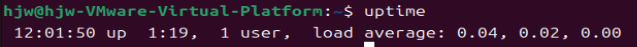

#  Linux常用命令

https://blog.csdn.net/Python_0011/article/details/138857497

## 备：控制终端常用快捷键

| 命令                  | 说明                                            |
| --------------------- | ----------------------------------------------- |
| Ctrl + p（previous）  | 查看上一条输入的命令，等价于按键 ⬆              |
| Ctrl + n （next）     | 查看当前位置下一条的输入命令，等价于按键  **↓** |
| Ctrl + b （backward） | 光标往前移动，等价于按键 ←                      |
| Ctrl + f （forward）  | 光标往后移动，等价于按键 →                      |
| Ctrl + a              | 光标移动至开头，等价于按键 **home**             |
| Ctrl + e              | 光标移动至末尾，等价于按键 **end**              |
| Ctrl + d（delete）    | 删除光标当前位置字符                            |
| Ctrl + u              | 删除光标所在的整行                              |
| Ctrl + k              | 删除从光标所在位置到行末的所有字符              |
|                       |                                                 |
| Ctrl + Shift +  '+/-' | 调大/调小终端字体大小                           |
| Ctrl + Alt +  'T'     | 打开一个新的终端                                |
| Ctrl + l              | 清屏                                            |


## 1. 目录和文件操作

### 1.1 系统目录

| 目录名 | 说明                                     |
| ------ | ---------------------------------------- |
| bin    | 存放二进制可执行文件                     |
| boot   | 存放开机启动程序                         |
| dev    | 存放设备文件： 字符设备、块设备          |
| home   | 存放普通用户的文件                       |
| etc    | 用户信息和系统**配置文件** passwd、group |
| lib    | 库文件：libc.so.6                        |
| root   | 管理员宿主目录（家目录）                 |
| usr    | 用户资源管理目录  unix software resource |

### 1.2 文件类型

| 文件类型 |     说明     |
| :------: | :----------: |
|    -     |   普通文件   |
|    d     |   目录文件   |
|    c     | 字符设备文件 |
|    b     |  块设备文件  |
|    l     |    软连接    |
|    p     |   管道文件   |
|    s     |    套接字    |

### 1.3 目录项/文件权限说明

> 文件权限  硬链接计数  所有者  所属者  大小  时间  文件名/文件夹名


文件权限：第一位代表文件类型，234位代表**所有者 U**读写执行权限，567位代表**同组用户 G**读写执行权限，890位代表**其他人 O**读写执行权限。


### 1.4 目录操作

#### 1.4.1 创建目录

```cmd
# 创建目录
mkdir <dir>

# 创建多个目录
mkdir <dir1> <dir2>

# 递归创建目录树
mkdir -p <多级目录>
```

#### 1.4.2 删除目录/文件

```cmd
# 删除当前目录下的文件
rm <file1> <file2> ...

# 删除当前目录的的文件（不询问）
rm -f <file1> <file2> ...

# 递归删除当前目录下的aaa目录
rm -r aaa

# 递归删除当前目录下的aaa目录（不询问）
rm -rf aaa

# 将当前目录下的所有目录和文件全部删除
rm -rf *                     
```

#### 1.4.3 重命名/移动目录

```cmd
# -f:若目标文件已存在，直接覆盖（不询问）
# -i:若目标文件已存在，就会询问是否覆盖
# -u:若目标文件已存在，且比目标文件新，才会更新
mv [-fui] <old_dir> <new_dir>
```

#### 1.1.4 拷贝目录/文件

```cmd
cp -r <dir1> <dir2>  # 递归复制目录1到目录2
cp -a <dir1> <dir2>  # 复制目录1及其下所有文件到目录2
```

```
cp <dir1> <dir2>  # 递归复制目录1到目录2
```


#### 1.4.5 搜索目录/文件

```bash
find <dir> [OPTIONS] [FILE]
```

| 搜索条件  | 说明                                                         |
| --------- | :----------------------------------------------------------- |
| -type     | 按文件类型搜索， d/p/s/c/b/l/f:                              |
| -name     | 按文件名搜索, find ./ -name "*file*,jpg"                     |
| -maxdepth | 指定搜索深度。应作为第一个参数出现。find ./ -maxdepth 1 -name "*file*.jpg" |
| -size     | 按文件大小搜索。单位：k、M、G。find /home/itcast -size +20M -size -50M |
| -exec     | 将find搜索的结果集执行某一指定命令，find /usr/ -name '*tmp*' -exec ls -ld {} \; |
| -ok       | 以交互式的方式 将find搜索的结果集执行某一指定命令 find /usr/ -name '*tmp*' -ok ls -ld {} \; |
| -xargs    | 将find搜索的结果集执行某一指定命令。  当结果集数量过大时，可以分片映射。find /usr/ -name '\*tmp*'  \| xargs ls -d |


```cmd
# 从根目录开始搜索文件/目录
find / -name file 
# 搜索用户 user1 的文件/目录
find / -user user1 
# 在目录/dir中搜索带有.bin 后缀的文件
find /dir -name *.bin 

# 按文件大小查找文件 n代表数字，+和-代表大于和小于
find /起始路径 -size +|-n[kMG]
```

#### 1.4.6 切换目录

```cmd
cd /     # 切换到根目录
cd /usr  # 切换到根目录下的usr目录
cd ../   # 切换到上一级目录 或者  cd ..
cd ~     # 切换到home目录
cd -     # 切换到上次访问的目录
```

#### 1.4.7 查看目录/文件

```cmd
# -l ：列出长数据串，包含文件的属性与权限数据等
# -a ：列出全部的文件，连同隐藏文件（开头为.的文件）一起列出来（常用）
# -d ：仅列出目录本身，而不是列出目录的文件数据
# -h ：将文件容量以较易读的方式（GB，kB等）列出来
# -R ：连同子目录的内容一起列出（递归列出），等于该目录下的所有文件都会显示出来
ls           # 查看当前目录下的所有目录和文件
ls -a        # 查看当前目录下的所有目录和文件（包括隐藏的文件）
ls -l 或 ll  # 列表查看当前目录下的所有目录和文件（列表查看，显示更多信息）
ls /dir      # 查看指定目录下的所有目录和文件   如：ls /usr
```

查看目录树

```cmd
tree
```

### 1.5 文件操作

#### 1.5.1 创建文件

```cmd
touch aa.txt  # 在当前目录创建一个名为aa.txt的文件
```

#### 1.5.2 修改文件vim

```cmd
vi/vim <FILE> 
```

##### 1.5.2.1 一般模式

在一般模式中可以进行<font color = 'red'>删除、复制、黏贴</font>等动作，但<font color = 'red'>无法进行编辑文件内容</font>。

|     语法     |            功能方法             |
| :----------: | :-----------------------------: |
|      yy      |        复制光标当前一行         |
|    y数字y    | 复制一段（从第这行到第行+数字） |
|      p       |         复制完进行粘贴          |
|      u       |           撤销上一步            |
|      dd      |         删除光标当前行          |
|    d数字d    |     删除光标（含）后多少行      |
|      x       |     剪切一个字母，相当于del     |
|      X       | 剪切一个字母，相当于按回车删除  |
|      yw      |          复制一个单词           |
|      dw      |          删除一个单词           |
|   shift+^    |           移动到行头            |
|   shift+$    |           移动到行尾            |
|  1+shift+g   |        移动到页头，数字         |
|   shift+g    |           移动到页尾            |
| 数字+shift+g |          移动到目标行           |

##### 1.5.2.2 编辑模式

| 按键 |                功能                 |
| :--: | :---------------------------------: |
|  i   |         当前光标行   insert         |
|  a   |          当前光标后 after           |
|  o   | 当前光标的下一行(创建一个空行) over |
|  l   |           光标所在行最前            |
|  A   |           光标所在行最后            |
|  O   |   当前光标行上一行(创建一个空行)    |

##### 1.5.2.3 命令模式

按`:/?`三者中任意一个，进入命令模式

| 按键          | 命令                                                         |
| ------------- | ------------------------------------------------------------ |
| :w            | 保存                                                         |
| :q            | 退出                                                         |
| :!            | 强制执行                                                     |
| /待查找的词   | n查找下一个，N往上查找                                       |
| :noh          | 取消高亮显示                                                 |
| :set nu       | 显示行号                                                     |
| :set nonu     | 关闭行号                                                     |
| :s/old/new    | 替换<font color = 'red'>当前行</font>匹配到的一个old改为new  |
| :s/old/new/g  | 替换<font color = 'red'>当前行</font>匹配到的所有old改为new  |
| :%s/old/new   | 替换<font color = 'red'>每一行</font>匹配到的第一个old 为new |
| :%s/old/new/g | 替换匹配到所有的old 为new                                    |

#### 1.5.3 查看文件

```cmd
# -n 输出行号
# -b 与-n相似，空白行不编号
cat [-nb] /etc/sudo.conf

cat text | less # 查看text文件中的内容,这条命令也可以使用less text来代替 
cat -n app.log | grep 'error' # 过滤有error的行，并输出行号

# 清空 /etc/test.txt 文档内容
cat /dev/null > /etc/test.txt
```

##### 1.5.3.1 分页查看

```cmd
more <FILE>   # 空格翻页，回车下一行，q退出
less <FILE>   # 空格翻页，回车下一行，q退出
```

##### 1.5.3.2 查看文件开头/末尾几行

```bash
head -n <filename>                  # 查看文件前n行，不加n默认查看10行
```

```cmd
tail <OPTIONS> <FILE>

tail -10 /etc/sudo.conf             # 查看文件最后10行
tail -f /run/log/messages           # 查看最新日志  
```

#### 1.5.4 查找文件内容

```bash
grep -r 'copy' ./ -n   # -n 显示行号
```


#### 1.5.5 修改文件操作权限

```bash
# 查看当前用户
whoami
```


```cmd
# 1. 修改文件操作权限
chmod [OPTION] 权限 <FILE|DIR>

# 2. 修改文件所有者
chown [u|g|o|a] [+|-|=] [mode] <FILE>

# 例如，把 /var/run/httpd.pid 的所有者设置 root
chown root /var/run/httpd.pid     
```

```cmd
chmod u+x aaa.sh          # 文件所有者增加可执行权限
chmod u-x aaa.sh          # 文件所有者当前删除可执行权限
chmod g+x aaa.sh          # 文件所有组增加可执行权限
chmod a+x aaa.sh          # 所有用户增加可执行权限

# 给文件file.txt的所有用户（a）设置读取和写入权限
chmod a=rw file.txt
```

[选项]为可选，支持以下常用参数：

| 参数 | 作用                         |
| ---- | ---------------------------- |
| -c   | 改变权限成功后再输出成功信息 |
| -R   | 递归处理所有子文件           |
| -f   | 改变权限失败后不显示错误信息 |
| -v   | 显示执行过程详细信息         |

| 用户表示符 | 说明           |
| ---------- | -------------- |
| u          | 文件所有者     |
| g          | 拥有者同组用户 |
| o          | 其它用户       |
| a          | 所有用户       |

| 权限操作符 | 含义                   |
| :--------- | :--------------------- |
| +          | 表示添加权限           |
| -          | 表示移除权限           |
| =          | 表示设置权限为特定的值 |

| 权限符号 | 含义     |
| :------- | :------- |
| r        | 读取权限 |
| w        | 写入权限 |
| x        | 执行权限 |


#### 1.5.6 硬链接和软链接

链接简单来说就是POSIX中一种文件共享的形式。

当我们在不同目录需要用到相同文件时，可以通过链接的形式来共享同一文件，无需在每个目录下都放置一个相同的文件，不必重复占用磁盘空间。

##### **1.5.5.1 硬链接（给文件起别名）**

<font color='red'>不能对目录创建硬链接</font>

```bash
ln [源文件] [硬链接放置的路径]
```

通过文件系统的inode值，产生新的**文件名**，不是新文件，类似给一个文件取**别名**，这个别名文件和源文件都指向源文件的inode。

**特性：**

- 文件有相同的inode及data block;
- 只能对已存在文件进行创建
- 不能交叉文件系统进行硬链接的创建；
- 删除一个硬链接文件，不影响其他有相同inode号的文件


##### **1.5.5.2 软链接（符号链接）**

对于硬链接，无论使用绝对路径还是相对路径，都会指向相同的文件数据。

对于软链接，如果使用相对路径，软链接在文件位置移动时可能会失效，因为它依赖于相对路径的结构。

```bash
ln -s [源文件/目录路径] [软链接放置的路径及名字]
```


【特性】：

- 软链接有自己的文件属性及权限等；

- 可对不存在的文件或目录创建软连接；

- 软链接可交叉文件系统；

- 创建软链接时，链接计数`i_nlink`不会增加；

- 删除软链接并不影响指向的文件，但若原文件被删除，则软链接就被称为死链接（若被指向路径文件被重新创建，死链接可恢复为正常的软链接）。

  

【示例】

```bash
# 文件软链接
ln -s /root/abc.txt /tmp/abc.txt
# 目录软链接
ln -s /root/abc/ /tmp/abc
```


**【两者区别】**

- 硬链接本质上是同一个文件，软链接不是同一个文件
- 硬链接不支持跨设备，也不支持链接目录，软链接支持；
- 硬链接的inode相同，软链接不同
- 创建新的硬链接，链接数会增加，删除硬链接，链接数减少；创建或删除软链接，不会影响链接数
- 硬链接的原始文件相对路径是相对于**当前工作目录**；软链接的原始文件的相对路径是相对于**链接文件的相对路径**
- 删除源文件，硬链接数减一，但链接文件的访问不受影响；而软链接的话，链接文件将无法访问。


## 2. 系统命令

### 2.1 查看内存 free


### 2.2 查看所有进程 ps


#### 2.2.1 查看某一进程下的信息

```cmd
>> ps -ef | grep tail
>> cd /proc/pid   # 查看该进程下的信息
===============================================
>> ls -l cwd        # 查看进程在哪个目录下运行
>> ls -l fd
```


### 2.3 查看进程CPU利用率 top


### 2.4  查看内存的详情信息


### 2.5 查看系统启动时间 




### 2.6 kill进程

```cmd
kill -<SIG> <PID>
```


### 2.7 man

#### 2.7.1 查看帮助

```cmd
# section:要查看的[帮助文档所属的章节]
# command:要查看的[具体命令或者函数]。
man <section> <command>
```

```tex
man命令的章节划分如下：
1：用户命令或者可执行程序的帮助文档
2：系统调用和内核函数的帮助文档
3：C库函数的帮助文档
4：特殊文件的帮助文档，比如/dev下的设备文件
5：配置文件的帮助文档
6：游戏的帮助文档
7：杂项的帮助文档，比如Linux标准、RFC等
8：系统管理员命令的帮助文档
```


#### 2.7.2 查看命令的帮助级别

```cmd
# 查询以command开头所有相关帮助信息列表 例如执行man -f mkdir
man -f <command>
whatis <command>
```


```cmd
# 查询所有类似(即模糊搜索)帮助文件信息
man -k <command>
```


### 2.8 which

查看命令所在的目录位置。