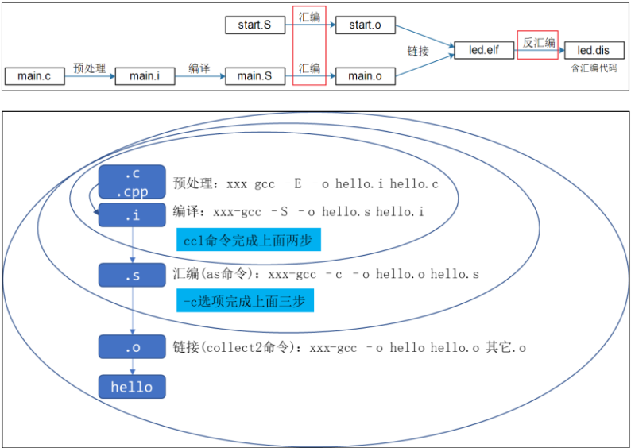
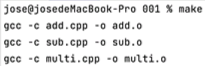
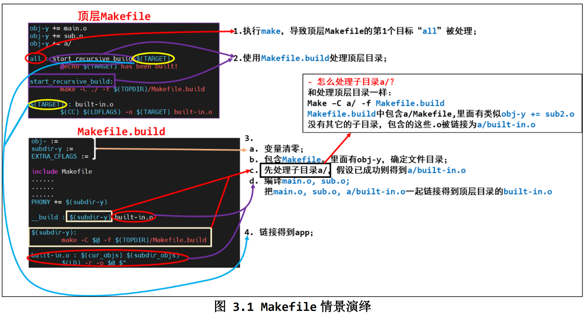

# Makefile笔记

## 1. GCC编译器



### 1.1 常用的编译选项

| 常用选项 | 描述                                                         |
| :------: | ------------------------------------------------------------ |
|    -E    | 做预处理                                                     |
|  **-c**  | **只做预处理、编译、汇编**                                   |
|  **-o**  | **指定输出文件，若没有-o选项，默认输出“a.out”**              |
|    -I    | 指定头文件目录                                               |
|    -L    | 指定链接时库文件目录                                         |
|    -l    | （小写L）指定链接哪一个库文件                                |
|    -M    | 生成文件关联信息（引用的头文件）。包含目标文件所依赖的所有源代码，如：gcc -M hello.c |
|   -MF    | 与-M一起使用，将所有依赖写入文件 如：gcc -M -MF hello.d hello.c |
|   -MD    | 可与-MF 一块使用，在编译hello.c文件的同时，将文件所需依赖写入文件hello.d。如 gcc -c -o hello.o hello.c -MD -MF hello.d |
|  **-g**  | **对源代码进行调试**                                         |
|    -O    | 对程序进行优化编译、链接。采用这个选项，整个源代码会在编译、链接过程中进行优化处理，这样产生的可执行文件的执行效率可以提高。 |
|   -O2    | 比-O更好的优化编译、链接。                                   |
|    -D    | 选择执行不同的代码段（宏定义），如-DOS_LINUX将执行 #define OS_LINUX 代码段1 中的代码 |
|          |                                                              |
| -static  | 仅使用该目录中静态程序库进行链接。                           |
|   -On    | 优化程序，程序优化后执行速度会更快，程序占用空间会更小       |
|  -Wall   | 打开所有gcc能提供的警告信息。                                |
|  -Idir   | 将头文件的搜索路径扩大，包含dir目录                          |
|  -Ldir   | 将链接时使用的链接库搜索路径扩大，包含dir目录。gcc会优先使用共享程序库 |

【示例】：

```
>> gcc -E main.c -o main.i    # 查看预处理结果，比如头文件是哪个
>> gcc -E -dM main.c > 1.txt   # 把所有的宏展开，存在1.txt中
>> gcc -Wp,-MD,abc.dep -c -o main.o main.c # 生成依赖文件abc.dep，后面makefile中会使用

>> echo 'main(){}' | gcc -E -v - # 它会列出头文件目录、库目录（LIBRARY_PATH）
```


### 1.2 编译多个文件

（1）一起编译并链接

```cmd
>> gcc -o test main.c sub.c
```

（2）分开编译、链接

```cmd
# 分别编译
>> gcc -c -o main.o main.c
>> gcc -c -o sub.o sub.c
# 链接
>> gcc -o test main.o sub.o
```


### 1.3 制作动态/静态库

#### 1.3.1 动态库（libxxx.so）

- 是程序运行时加载的库，当动态链接库正确安装后，所有的程序都可以使用动态库来运行程序。

- 是**目标文件的集合**
- 库中函数和变量的地址是相对地址，不是绝对地址，其**真实地址**是**在调用动态库的程序加载时形成**。

##### 参数选项：

- -fPIC： 产生位置无关的代码

- -shared：可以将源代码编译成共享库。当执行链接操作时，编译器会将所有需要的符号和函数引用收集起来，并创建一个共享库文件，在运行时会动态地将共享库加载到内存中，并将符号解析为实际的函数或数据；


别名：lib库名.so(linux和unix)      -soname,libstr.so指定别名     `.dll（windows）`

真名：在别名基础上加上一个小版本号、发布版本等

链接名：程序链接时使用的库名字

（1）制作、编译

```cmd
>> gcc -c -o main.o main.c
>> gcc -c -o sub.o sub.c
# 使用多个.o制作动态库 
# gcc -shared -Wl,-soname,libstr.so -o libstr,o.1 string.c
>> gcc -shared -o libsub.so sub.o sub2.o sub3.o

# 使用
>> gcc -o test main.o -lsub -L /libsub.so/所在目录/
```

> **<font color='red'>注意：</font>**一般情况会将生成的动态库复制到**系统默认的动态链接库搜索路径**下，如/lib、/usr/lib、/usr/local/lib


（2）运行

①：把libsub.o放到Ubuntu的/lib目录中，就可运行test程序

②：若放在其他位置，如目录/a下，需执行：

```cmd
>> export LD_LIBRARY_PATH=$LD_LIBRARY_PATH:/a
>> ./test
```


#### 1.3.2 静态库（libxxx.a）

优点：

1. 代码装载速度快，执行速度略比[动态链接库](https://so.csdn.net/so/search?q=动态链接库&spm=1001.2101.3001.7020)快；
2. 只需保证在开发者的计算机中有正确的.LIB文件，在以二进制形式发布程序时不需考虑在用户的计算机上.LIB文件是否存在及版本问题，可避免DLL地狱等问题。 

缺点：

1.  使用静态链接生成的可执行文件体积较大，包含相同的公共代码，造成浪费；
2.  如果静态库中有全局变量，那么在几个模块中使用，将会导致全局变量有不同的值。
3.  静态库编译时，不会进行链接检查，在生成静态库阶段检查不出来。
4.  几个模块，引用同一静态库，如果有一模块没有编译到，会引起巨大的差异导致问题。


**生成静态库：**

```cmd
>> gcc -c -o main.o main.c
>> gcc -c -o sub.o sub.c
# 生成静态库
# -r：创建库，并把目标文件插到指定库中
>> ar -rcs libsub.a sub.o sub2.o sub3.o
```

**使用静态库：**

```c
# 若.a不在当前目录下，需指定它的绝对或相对路径
>> gcc -o test main.o libsub.a
    
# 2. 使用命令”-l库名“，会在系统默认路径下找sub函数库，并把它链接到要生成的目标程序上。
# 	 可自定义指定库函数的路径。(与当前)
>> gcc -o test main.c -L./ -lsub
```

> 使用-l选项时，要将-o选项的目的名称放到链接库前，否则gcc会认为-l是生成目标。


### 1.4 程序库的链接

我们在编译程序的时候还要指定库的路径，这个时候我们要用到编译器的 -L 选项指定路径。

- 对于自定义库
  - 如有一个库在 `/home/hoyt/mylib`下，这样编译的时候还要加上 **`-L/home/hoyt/mylib`**。

- 对于一些标准库，无需指出路径。只要它们在起缺省库（默认系统库）的路径下就可以了。
  - 系统的缺省库的路径**/lib、/usr/lib、/usr/local/lib** 。


## 2. Makefile使用

在Linux中，常用make命令编译程序；make命令的执行依赖Makefile文件：

利用`make`编译程序，`make clean`清除编译出来的结果。

```makefile
# MakeFile
hello: hello.c
	gcc -o hello hello.c
	
clean:
	rm -f hello
```

> make命令根据文件更新时间戳来决定哪些文件需要重新编译，避免重复编译已经编译过的、没有发生变化的程序，提高编译速率。


### 2.1 Makefile规则

**make [目标]**，若无目标，默认使用第一个目标的命令

#### 2.1.1 常用选项

```
make [-f file] [options] [target目标]
```

> Options:
>
> -r：指定除上述文件名之外的文件作为输入文件。
>
> -v：显示版本号
>
> -n：只输出命令，但不执行，一般用来测试。
>
> -s：只执行命令，但不显示具体命令，可用@符抑制命令输出。
>
> -w：显示执行前执行后的路径。
>
> -C dir：指定makefile所在文件。（不指定，默认从当前目录查找）




#### 2.1.2 规则

使用`make`编译程序，当①依赖文件更新时间比目标文件大，②目标文件还未生成，会重新生成目标文件

**注意：**当执行`make clean`命令时，若当前目录下存在clean文件时，由于clean的依赖文件不存在，且目标clean文件已存在，所以执行该命令时会出现异常，需要指定**clean目标**为**假想目标：.PHONY: clean**

> 伪目标（Phony Target）不是文件，而是一个名字，它与文件名没有关系，不能由Makefile的规则生成。它并不检查日期，无论目标是否存在，相关的命令都会执行。
>
> .PHONY: target_name ……
>
> 常用于定义一些不产生实际文件输出的操作，比如清理临时文件、运行测试等。**它们并不对应真实的文件，所以无论目标名与其他文件名是否冲突，在构建过程中都会被执行。**

```Makefile
目标文件(target)...: 依赖文件1（prerequiries）...
<Tab> 命令（command）
```

```makefile
test: a.o b.o
	gcc -o test a.o b.o

a.o: a.c
	gcc -o a.o a.c

b.o: b.c
	gcc -o b.o b.c
	
clean:
	rm -r *.o test
	
.PHONY: clean
```

升级版：

```makefile
# objs = a.o b.o
objs = $(patsubst %.c, %.o, $(wildcard ./\*.c))
target = test

# dep_files := $(patsubst %, .%.d, $(objs))
# dep_files = $(wildcard $(dep_files))

# 编译参数 -Werror:将所有警告都当成错误 -Iinclude:指定头文件目录为"include"目录 “a.h” => <a.h>
CFLAGS = -Werror -Iinclude

$(target): $(objs)
	$(CC) -o $@ $^ 
		# @echo dep_files = ${dep_files}
		
# 若dep_files 不为空，则将其包含进来
ifneq ($(dep_files),)  
include $(dep_files)  
endif

# 第二种写法: 表示所有的.o文件都依赖与之对应的.c
#     ..c.o:  
#       gcc -c $<
%.o: %.c
	$(CC) $(CFLAGS) -c -o $@ $< -MD -MF  # .$@.d第一个'.'代表是隐藏文件 
	
clean:
	rm -r *.o test
	
# 删除依赖
distclean:
	rm $(dep_files) 
	
.PHONY: clean
```

#### 2.1.3 通配符

|  变量  | 说明                                              |
| :----: | ------------------------------------------------- |
| **$^** | **表示所有依赖文件名（不重复）       针对依赖项** |
| **$@** | **表示目标文件**                                  |
| **$<** | **表示第一个依赖文件**                            |
|   $*   | 表示目标文件名，不包含目标文件的扩展名            |
|   $+   | 表示所有依赖文件名（可能包含重复）                |
|   $?   | 依赖项中，所有目标文件时间戳晚的依赖文件          |
|   $%   | 若目标是归档成员，则该变量表示目标的归档成员名称  |

#### 2.1.4 搜索路径 VPATH

指定需要搜索的路径，make会自动找到指定文件的目录并添加到文件上。

```makefile
VPATH = path1:path2:...
```

【示例】：

```makefile
# add/add_int.c sub/sub_int.c
VPATH = add:sub
add_int.o:%.o:%.c

# make的编译结果（会加上add目录）
# add_int.o:add_int.o:add/add_int.c
# 		cc -c -o add_int.o add/add_int.c
```

注意：该方法会将生成的目标文件放到当前目录下，而不是“add/”下。‘

【解决方案】

```makefile
OBJSDIR = objs
OBJS = add_int.o add_float.o sub_int.o sub_float.o main,o
TARGET = cacu
CFLAGS = -Iadd -Isub -O2
VPATH = add:sub:.
RM = rm -r

$(TARGET):$(OBJSDIR) $(OBJS) # 要执行TARGET命令，需要先看看OBJSDIR和OBJS依赖项是否存在
	$(CC) -o $(TARGET) $(OBJSDIR)/*.o $(CFLAGS)
	
$(OBJS):%.o:%.c
	$(CC) -c $(CFLAGS) $< -o $(OBJSDIR)/$@

$(OBJSDIR):
	mkdir -p ./$@
	
clean:
	-$(RM) $(TARGET)
	-$(RM) $(OBJSDIR)/*.o
```


#### 2.1.5 递归make

常用于多人协作开发，每个人负责一个模块。

**1. 递归调用的方式**

Make命令可以递归地调用子目录中的Makefile。

比如，当前目录下有一个Makefile，而目录add和sub及main.c由不同的人进行维护。

编译add目录中的文件（即先进入add目录，然后执行make命令）

```makefile
add:
	cd add && $(MAKE)
	
# 等价于
add:
	$(MAKE) -C add
```

> 调用”$(MAKE) -C“ 的Makefile叫总控Makefile。
>
> 可通过export将总控Makefile文件的变量传递给子目录中的Makefile

**总控Makefile**

```makefile
TARGET = cacu

export CC = gcc
export OBJSDIR = ${shell pwd}/objs
export CFLAGS = -O2
export RM = rm -r

$(TARGET):$(OBJSDIR) main.o
	$(MAKE) -C add   # 在add目录中递归调用make
	$(MAKE) -C sub
	$(CC) -o $(TARGET) $(OBJSDIR)/*.o
	
main.o:%.o:%.c
	$(cc) -c $< -o $(OBJSDIR)/$@ $(CFLAGS) -Iadd -Isub

$(OBJSDIR):
	mkdir -p $@

clean:
	-$(RM) $(OBJSDIR)/*.o $(TARGET) 
```


**子目录add的Makefile文件**

```makefile
OBJS = add_int,o add_float.o
all:$(OBJS)

# CC、OBJSDIR、CFLAGS在总控Makefile中声明
$(OBJS):%.o:%.c
	$(CC) -c $< -o $(OBJSDIR)/$@ $(CFLAGS)

clean:
	-$(RM) $(OBJS)
```

**子目录sub的Makefile文件**

```makefile
OBJS = sub_int,o sub_float.o
all:$(OBJS)

# CC、OBJSDIR、CFLAGS在总控Makefile中声明
$(OBJS):%.o:%.c
	$(CC) -c $< -o $(OBJSDIR)/$@ $(CFLAGS)

clean:
	-$(RM) $(OBJS)
```


#### 2.1.6 即刻变量、延时变量

1.即时变量（简单变量）：变量定义时确定值

2.延时变量：变量使用时才确定值

> :=  # 即时变量
>
> =   # 延时变量
>
> ?= # 延时变量，若前面该变量已经定义了，则忽略该语句（只有在变量还未定义时才起效）
>
> += # 它是延时变量或即时变量取决于前面的定义。若变量在前面定义为即时变量，即为即时变量。

```makefile
A := 10   # A变量的值在定义时即可确定
B = 12    # B的值使用时才确定   

all:
	@echo $(A) # 输出变量A的值 10   
	@echo $(B) # 输出变量B的值 12
```

```makefile
A := $(C)   # A变量的值在定义时即可确定
B = $(C)    # B的值使用时才确定   

D = 100 
D ?= 120    # 忽略D=100这句定义，该语句才起效   也可通过 make D = 130 设置变量的值
all:
	@echo $(A) # 输出即刻变量A的值 空值  在定义A时，C还未被赋值
	@echo $(B) # 输出延时变量B的值 123
	@echo $(D) # 输出延时变量D的值 100
C = 123
```

#### 2.1.7 变量的导出（export）

在编译程序时，会使用`make -C dir`切换到其他目录，执行其他目录中的Makefile。

若想要让某个变量的值在所有目录都可见，要把它`export`出来。

比如：

```makefile
CC = $(CROSS_COMPILE)gcc
export CC
```

CC变量表示编译器在整个过程的是一样的。定义完后需要导出


#### 2.1.8 使用shell命令

```makefile
TOPDIR := $(shell pwd)
```


### 2.2 Makefile函数

函数调用格式：

> $(function arguments)  
>
> ​	-- function 为函数名
>
> ​	-- arguments 为函数参数，多个参数之间用逗号隔开


#### 2.2.1 字符串替换和分析函数

##### $(subst from,to,text)

**部分匹配**

将text中`from`文本替换为`to`文本。

```makefile
str := feet on the street
str2 := $(subst ee,EE,$(str))   
all:
	@echo s = $(str2)  # 输出 fEEt on the strEEt
```


##### $(patsubst pattern, replacement, text)

**模糊匹配**

寻找`text`中符合`pattern`的字，并用`replacement`替换。

```makefile
$(patsubst %.c, %.o, a.c, b.c, c.h)   # 输出 a.o b.o
```


##### $(filter pattern..., text)

返回在`text`中匹配格式`pattern`的字，并去除不符合格式的`pattern`的字。

```makefile
$(filter %.c %.s, a.c b.s c.h)  # 输出 a.c b.s
```

##### $(filter-out pattern..., text)

返回在`text`中不匹配格式`pattern`的字，并去除符合格式的`pattern`的字。

```makefile
$(filter-out %.c %.s, a.c b.s c.h)  # 输出 c.h
```


##### $find(findstring find, in)

在字符串中`in`搜寻`find`，如果找到则返回`find`，否则返回空字符串

```makefile
$(findstring a, a b c)  # 返回 a
$(findstring d, a b c)  # 返回 空字符串
```


##### $(sort list)

将列表`list`中的字按字母排序，并去除掉重复的字。

```makefile
$(sort foo bar lose) # 输出 bar foo lose
```


#### 2.2.2 文件名函数

##### $(wildcard pattern)

返回和pattern格式匹配的文件名，且用“，”隔开

比如当前目录下有文件：1.c、2.c、1.h、2.h

```makefile
file := $(wildcard *.c)
all:
	@echo files = $(file)
```

则输出 `1.c`、`2.c`


##### $(dir names...)

获取`names`中每个文件名的路径部分。包括从文件名的首字符到最后一个斜杠（含斜杠）之前的一切字符。

```makefile
$(dir src/foo.c hacks) # 输出 src/ ./
```

##### $(nordir names...)

获取`names`除去路径部分的真正文件名

```makefile
$(dir src/foo.c hacks) # 输出 foo.c hacks
```


##### $(suffix name...)

获取`names`中每一个文件名的后缀

```makefile
$(suffix a.c b.c c.o hack)  # 输出 .c .c .o 
```

##### $(basename name...)

获取`names`中每一个文件名除后缀外的一切字符。

```makefile
$(suffix a.c b.c src/test hack)  # 输出 src/test hack
```


#### 2.2.3 其他函数

##### $(foreach var, list, text)

```makefile
dirs := a b c d
files := $(foreach dir, dirs, $(wildcard $(dir)/*))

all:
	@echo files = $(files)
```


### 3.1 Makefile解析

通常我们使用`make`命令来编译程序，它会去当前目录下查找`Makefile`文件，并根据它的指示去执行操作，生成第一个目标。

也可通过`-f`指定文件（不在使用Makefile文件），比如：

```makefile
make -f Makefile.build
```

也可通过`-C`选项指定目录，切换到其他目录中

```makefile
make -C a/ -f Makefile.build
```

也可指定目标

```makefile
make -C a/ -f Makefile.build other_target
```



```makefile
CROSS_COMPILE =   # 不同编译器。它的前缀可能不同 在开发板上进行编译 需要设置为 arm-linux-
AS = $(CROSS_COMPILE) as
LD = $(CROSS_COMPILE) ld
CC = $(CROSS_COMPILE) gcc
CPP = $(CC) -E
AR = $(CROSS_COMPILE) ar
NM = $(CROSS_COMPILE) nm

STRIP = $(CROSS_COMPILE) strip
OBJCOPY = $(CROSS_COMPILE) objcopy
OBJDUMP = $(CROSS_COMPILE) objdump

export AS LD CC CPP AR NM
export STRIP OBJCOPY OBJDUMP

CFLAGS := -Wall -02 -g
CFLAGS += -I $(shell pwd)/include

LDFLAGS :=

export CFLAGS LDFLAGS

TOPDIR := $(shell pwd)
export TOPDIR

TARGET := test

obj-y += main.o
obj-y += sub.o
obj-y += a/

all: start_recursive_build $(TARGET)
	@echo $(TARGET) has been built!

start_recursive_build:
	make -C ./ -f $(TOPDIR)/Makefile.build
```

**Makefile.buid文件内容：**

```makefile
# 设置进入子目录编译
$(subdir-y):
	make -C $@ -f $(TOPDIR)/Makefile.build
	
# 编译当前目录中的文件
%.o: %.c
	$(CC) $(CFLAGS) $(EXTRA_CFLAGS) $(CFLAGS_$@) -Wp,-MD,$(dep_file) -c -o $@ $<
	
# 当前目录下.o和子目录下built-in.o要打包起来
built-in.o: $(cur_objs) $(subdir_objs)
	$(LD) -r -o $@ $^

# 顶层Makefile中把顶层目录的built-in.o链接成APP
$(TARGET): built-in.o
	$(CC) $(LDFLAGS) -o $(TARGET) built-in.o
```

