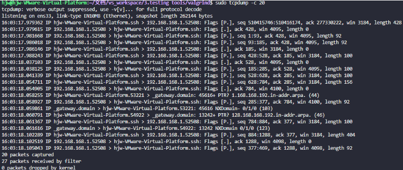
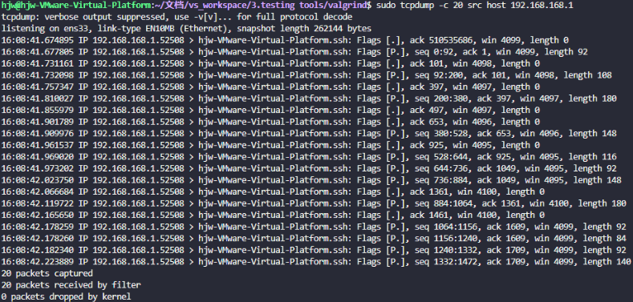
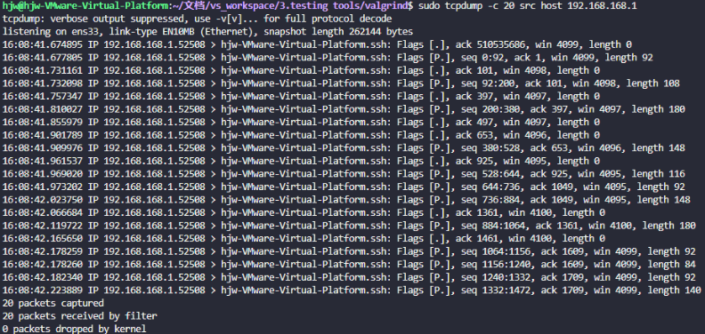

# tcpdump网络抓包工具

## 1. 概念

tcpdump是Linux里的字符界面的数据抓包分析软件。

tcpdump是一个用于截取网络分组，并输出分组内容的工具。

> tcp：传输控制协议      dump: 导出

使用tcpdump来抓包可以知道有哪些客户端的人访问到自己的服务器上了

## 2. 常用参数

只使用tcpdump命令进行抓包：截获主机收到和发出的所有数据包。

截取到的包：默认是数据包的头部。

> 直接启动tcpdump，将监听的是第一个网络接口上所有流过的数据包。



### 2.1 参数选项

| 参数 | 说明                                                         |
| ---- | ------------------------------------------------------------ |
| -i   | 指定抓哪个接口的数据包                                       |
| -vv  | 显示更详细的信息                                             |
| -e   | 显示mac地址                                                  |
| -w   | write写入保存到指定文件中，导入的文件可以使用wireshark打开。文件的后缀名可自定义.pcap packet capture |
| -r   | read读取文件中的数据                                         |
| -c   | 在收到指定包数目后，tcpdump就会停止                          |


### 2.2 type类过滤器

| 参数     | 说明                                                       |
| -------- | ---------------------------------------------------------- |
| host     | 根据主机ip来抓包                                           |
| port     | 根据端口来抓包                                             |
| net      | 根据网段来抓包                                             |
| protocol | 根据协议来抓包(tcp、udp、icmp、ip、arp、rarp、ether协议等) |
| mac      | 指定mac地址进行抓包 src mac：源mac ，dst mac：目的mac      |

- 根据【源/目的】ip来抓包

```cmd
tcpdump -i ens33 [src|dst] host 192.168.168.1 -c 20
```



- 根据【源/目的】端口来抓包

```cmd
# 抓取访问本机的80号端口的数据包。
tcpdump -i ens33 port 80
```

- 根据【源/目的】网段来抓包

```cmd
tcpdump -i ens33 port 80 and src net 192.168.168.0/24
```

- 根据【源/目的】mac地址来抓包

> ether：是值icmp协议中没有源ip和目的ip，所以需要依赖于ether 协议。

```cmd
tcpdump -i ens33 ether src 00:0c:29:ae:89:5d
```

- 抓取源ip地址为192.168.2.137访问本机的tcp协议的80端口的数据包。

```cmd
tcpdump -i ens33 src host 192.168.2.137 and dst port 80 and tcp
```

- 抓取192.168.2.137这台机器ping过来的数据包。

```
tcpdump -i ens33 icmp and src host 192.168.2.137
```

-  抓取访问本机的icmp报文或者arp报文。

```
tcpdump -nn -i ens33 icmp or arp
```


## 3. 对输出结果分析



> 第一列：时分秒毫秒 
>
> 第二列：网络协议 IP
>
> 第三列：发送方的ip地址
>
> 第四列：箭头 >， 表示数据流向
>
> 第五列：接收方的ip地址
>
> 第六列：冒号
>
> 第七列：数据包内容，包括Flags 标识符，seq 号，ack 号，win 窗口，数据长度 length，其中 [P.] 表示 PUSH 标志位为 1。
>
> - `[S]` : SYN（开始连接）
> - `[P]` : PSH（推送数据）
> - `[F]` : FIN （结束连接）
> - `[R]` : RST（重置连接）
> - `[.]` : 没有 Flag （意思是除上面四种类型外的其他情况，有可能是 ACK 也有可能是 URG）