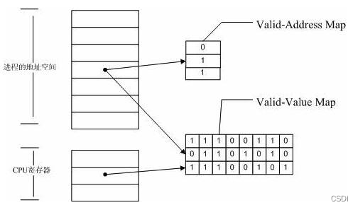

# valgrind

valgrind是一套Linux下开源的仿真调试工具集。

Valgrind由内核(core)以及基于内核的其他调试工具组成。

如下图所示，内核相当于一个框架，它模拟了一个CPU环境并提供服务给其他工具；其他工具则类似于插件(plugin),利用内核提供和的服务完成各种特定的内存调试任务。Valgrind的体系结构如下：


## 1. valgrind原理

### 1.1 常用工具

#### 1.1.1 memcheck

- **检查程序中的内存问题，如泄漏、越界、非法指针等**。

​	能够侦测到如下问题: ①使用未初始化的内存  ②读/写已经被释放的内存  ③读/写内存越界  ④读/写不恰当的	内存栈空间  ⑤内存泄漏  ⑥使用 malloc 和 free 不匹配 等。

#### 1.1.2 cachegrind

- cache分析器：分析CPU的cache命中率、丢失率，用于进行代码优化。

  它模拟CPU中的一级缓存和二级缓存，能够精确地指出程序中cache的丢失和命中。如果需要，它还能够为我们提供cache丢失次数、内存引用次数、以及每行代码、每个函数、每个模块、整个程序产生的指令数。这对优化程序有很大的帮助。

  

#### 1.1.3 **massif**

- 堆栈分析器，指示程序中使用了多少堆内存等信息。


### 1.2 内存检测原理

valgrind能检测内存主要依赖于其两个全局表——Value表和Address表



#### **1.2.1 Valid-Value表**

​	对于进程的整个地址空间中的每一个字节(byte)，都有与之对应的 8 个bits；对于 CPU 的每个寄存器，也有一个与之对应的bit 向量。这些 bits 负责记录该字节或者寄存器值是否具有有效的、已初始化的值。

#### 1.2.2 **Valid-Address表**

​	对于进程整个地址空间中的每一个字节(byte)，还有与之对应的 1 个bit，负责记录该地址是否能够被读写。


#### 1.2.3 **检测原理**

1）当要读写内存中某个字节时，首先检查这个字节对应的 A bit。如果该A bit显示该位置是无效位置(说明不能够读写)，此时memcheck则报告读写错误。

2）内核（core）类似于一个虚拟的 CPU 环境，这样当内存中的某个字节被加载到真实的 CPU 中时，该字节对应的 V bit 也被加载到虚拟的 CPU 环境中。一旦寄存器中的值被用来产生内存地址或者该值能够影响程序输出，则 memcheck 会检查对应的V bits，如果该值尚未初始化(说明该寄存器中的值无效)，则会报告使用未初始化内存错误。


## 2. valgrind使用

### 2.1 基本选项

```
--tool=<name>：指定valgrind使用的工具。
			   默认为 memcheck # 内存泄漏。
			   cachegrind	  #CACHE使用统计
			   massif         #堆使用情况
-h –-help： 显示帮助信息。
--version：显示 valgrind 内核的版本，其中各个工具都有各自的版本。
-q –-quiet：只打印错误信息。
-v –-verbose：显示更加详细的信息, 增加错误数统计。
--trace-children=no|yes：指定是否跟踪子线程，默认为 no。
--track-fds=no|yes：指定是否跟踪打开的文件描述，默认为 no。
--time-stamp=no|yes：指定是否增加 时间戳 到 log，默认为 no。
--log-fd=<number>：指定 log 输出到的描述符文件，默认为 stderr。
--log-file=<filename>：将输出的信息写入到文件，该文件的文件名为 filename.PID，PID 为跟踪的进程号。
--log-file-exactly=<file>：指定输出 log 到的文件，该文件的文件名不加 PID。
--log-file-qualifier=<VAR>：指定某个环境变量的值来做为输出信息的文件名。
```


### 2.2 进阶选项

```
--num-callers=<number>：指定调用者的栈回溯信息的数量。
--error-limit=no|yes：如果太多错误，则停止显示新错误默认为 yes。
--error-exitcode=<number>：如果发现错误则返回错误代码，如果 number = 0 则是关闭该功能。
--db-attach=no|yes：当出现错误，valgrind会自动启动调试器gdb。默认为 no。
--db-command=<command>：启动调试器的命令行选项。
```


### 2.3 memcheck工具的相关选项

```
--leak-check=no|summary|full # 定是否对`内存泄露`给出详细信息
--show-reachable=no|yes      # 示在 内存泄漏检查 中可以检测到的块。默认为 no。
--xml=yes                	 # 将以 xml 格式输出，只有 memcheck 可用。
```


#### 2.3.1 输出分析

##### 1. 内存泄漏类型

- **definitely lost：**指确定泄露的内存，应尽快修复。当程序结束时<font color='red'>如果一块动态分配的内存没有被释放且通过程序内的指针变量均无法访问这块内存</font>，则会报这个错误。

- **indirectly lost：**指**间接泄露的内存**，其总是与 definitely lost 一起出现，只要修复 definitely lost 即可恢复。当<font color='red'>使用了含有指针成员的类或结构</font>时，可能会报这个错误。

- **possibly lost：**指可能泄露的内存，大多数情况下应视为与 definitely lost 一样需要尽快修复。当程序结束时如果一块动态分配的内存没有被释放且通过程序内的指针变量均无法访问这块内存的起始地址，<font color='red'>但可以访问其中的某一部分数据</font>，则会报这个错误。

- **still reachable：**如果程序是正常结束的，那么它可能不会造成程序崩溃，但长时间运行有可能耗尽系统资源，因此建议修复它。如果程序是崩溃（如访问非法的地址而崩溃）而非正常结束的，则应当暂时忽略它，先修复导致程序崩溃的错误，然后重新检测。

- **suppressed：**已被解决。出现了内存泄露但系统自动处理了。可以无视这类错误。

  > 注：对于valgrind即便是“definitely lost”也不一定绝对准确，可能会存在误报的情况。特别是在使用某些库或者框架的时候。作为开发人员要仔细阅读valgrind的警告信息，检查相关位置的代码。


##### 2. 报告格式

问题报告模板：

```
{问题描述}
at {地址、函数名、模块或代码行}
by {地址、函数名、代码行}
by ...{逐层依次显示调用堆栈，格式同上}
Address 0xXXXXXXXX {描述地址的相对关系}
```

##### 3. 报告输出文档格式

```
copyright 版权声明
异常读写报告
2.1 主线程异常读写
2.2 线程A异常读写报告
2.3 线程B异常读写报告
2... 其他线程
堆内存泄露报告
3.1 堆内存使用情况概述(HEAP SUMMARY)
3.2 确信的内存泄露报告(definitely lost)
3.3 可疑内存操作报告 (show-reachable=no关闭)
3.4 泄露情况概述(LEAK SUMMARY)
```

##### 5. 使用注意事项

- 对于一直执行的程序，暂停valgrind要使用kill -10 pid，而不是kill -9 


- 输出内容在**退出时候**才会写到报告文件memory.txt中，而不是实时的刷进去。务必使用kill -10 ，否则memory.txt并不能记录真正的泄漏位置


## 3. 使用案例

### 3.1 非法内存的访问

```c
#include <iostream>
#include <stdlib.h>
using namespace std;
void func(){
	int *x=(int*)malloc(10*sizeof(int));
	x[10]=0;
}
int main(){
	func();
	cout<<"done"<<endl;
	return 0;
}
```

```cmd
# 编译程序
>> gcc -o test test.c -g
# 使用valgrind检查
>> valgrind ./test


# valgrind生成分析结果
>> valgrind --tool=memcheck --leak-check=yes ./valgrindtest
```

> 编译的时候一定要加`-g`，不然不会指出代码行数


### 3.2 使用未初始化的内存

```c
#include <stdio.h>

int main(){
	int a[5];
	int i,s=0;
    // 未对a[2]进行初始化，直接使用会产生未定义错误
	a[0]=a[1]=a[3]=a[4]=0;   
	for(i=0;i<5;++i)
		s+=a[i];
	if(s==33)
		printf("sum is 33\n");
	else
		printf("sum is not 33\n");
	return 0;
}
```


### 3.3 内存读写越界

```c
#include <stdio.h>
#include <stdlib.h>
int main(){
	int len=4;
	int *pt=(int*)malloc(len*sizeof(int));
	int *p=pt;
	for(int i=0;i<len;++i)
		p++;
    // 指针写越界
	*p=5;
	printf("The value of p is %d",*p); // 指针读越界
	return 0;
}
```


### 3.4 内容覆盖

```c
#include <stdio.h>
#include <stdlib.h>
#include <string.h>

int main(){
	char x[50];
	int i;
	for(i=0;i<50;++i)
		x[i]=i+1;
	strncpy(x+20,x,20);
	strncpy(x+20,x,21);
	strncpy(x+20,x,20);
	strncpy(x+20,x,21);
	x[39]='\0';
	strcpy(x,x+20);
	x[39]=39;
	x[40]='\0';
	strcpy(x,x+20);
	return 0;
}
```


### 3.5 动态内存管理

```c
#include <stdio.h>
#include <stdlib.h>

int main(){
	int i;
	char *p=(char*)malloc(10);
	char *pt=p;
	for(i=0;i<10;++i){
		p[i]='z';
	}
    // malloc => free 
	delete p;
	pt[1]='x';
	free(pt);
	return 0;
}
```

