https://datatracker.ietf.org/doc/html/rfc1350

sudo sysctl -w vm.drop_caches=3

# TFTP

TFTP （Trivial File Transfer Protocol）简单文件传输协议。

优点：

- 用于传输文件，传递的是 8 位字节数据。每个非终结数据包都会单独进行确认。

- 基于UDP实现的，设计上小巧且易于实现。

缺点：

- 缺乏 FTP 的大多数功能，只能从远程服务器读取和写入文件（或邮件)，不能列出目录。
- 没有用户认证机制
- 锁步机制的使用在局域网中会限制吞吐量。

**目前支持三种传输模式：**

- netascii：ASCII文本模式     `接收到该类型数据需要转换为自定义格式数据`
- octet：二进制模式，每字节8位  `用于传输8位格式的文件`
- mail：现在已经不使用

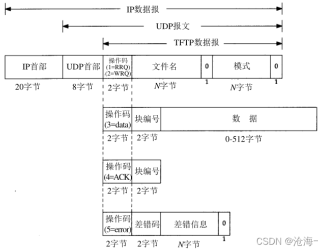

## **1. 协议概述**

​	任何传输都以请求读取或写入文件开始，同时也用于请求连接。如果服务器同意请求，连接将被打开，文件将以固定长度为 **512 字节的块**进行发送。**每个数据包包含一个数据块**，下一个发送数据包必须等收到上一个数据包的确认包后才能发送（锁步）。收到长度小于 512 字节的数据包表示传输结束。如果数据包在网络中丢失，接收方将超时，并可能重新传输其最后一个数据包（可以是数据包或确认包），从而导致丢失的数据包被重新传输。发送方只需保留一个数据包以备重新传输，因为lockedstep确认保证了所有旧数据包已被接收。

> 注意，参与传输的两台机器都被视为发送方和接收方。一台发送数据并接收确认，另一台发送确认并接收数据。

- **发送的错误数据包不会被确认或重传**
  - 错误由三种类型的事件引起：
    - 无法满足请求（文件未找到、访问违规或没有此用户）
    - 接收到无法通过网络延迟或重复解释的数据包（格式不正确的数据包）
    - 失去对必要资源的访问（文件已满或传输期间访问被拒绝）

> 由于发送方发送完错误包后可能会终止，所以它们不会收到确认信息。因此，使用超时来检测错误数据包丢失后的这种终止。

​	TFTP 仅识别一种**不会导致终止**的错误条件，即接收到的数据包的源端口不正确。在这种情况下，会向发起主机发送错误数据包。该协议非常严格，以简化实现。例如，固定长度的数据块使分配变得直接，锁步确认提供了流量控制并消除了重新排序传入数据包的需要。

## **2. 相关的其他协议**

​	 由于数据报协议是建立在互联网协议上的，因此数据包将具有IP头部、UDP头部和 TFTP 头部。此外，数据包可能还会有一个头部（如 LNI、ARPA 头部等），以便通过本地传输介质。如图 3-1 所示，数据包的内容顺序为：如果使用的话，MAC头，IP头，UDP头，TFTP 头部，接着是 TFTP 数据包的其余部分。（这部分可能是数据，也可能不是，具体取决于 TFTP 头部中指定的数据包类型）。

**TFTP 不指定IP头部中的任何值。**另一方面，UDP头部的源端口和目标端口字段被 TFTP 使用，而**长度字段反映了 TFTP 数据包的大小**。TFTP 使用的传输标识符（TID）被传递到传输层作为端口使用，因此它们必须在 0 到 65535 之间。TFTP 头部包括一个 2 字节的操作码字段，用于指示数据包的类型（例如，DATA、ERROR 等）。

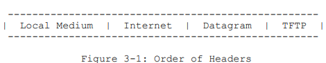

## **3. 初始连接协议**

1. 发送读/写请求

​	通过发送请求（WRQ 用于写入外部文件系统，或 RRQ 用于从中读取），并接收回复写操作的确认数据包或读取操作的第一个数据包来建立传输。（确认数据包将包含被确认的数据包的块号。每个数据包都有一个相关联的块号；块号是连续的，从 1 开始。由于对写请求的积极响应是一个确认数据包，在这种特殊情况下，块号将为零）。如果响应的是错误数据包，则表示该请求已被拒绝。

> 读请求/数据包的确认包：数据包的块号被确认的数据包的块号。
>
> 写请求的确认包：数据包的块号为0

​	为了建立连接，每端连接选择一个 TID，供该连接的整个期间使用。**为连接选择的 TID 应随机选择，以便立即连续选择相同数字的概率非常低**。每个数据包都有与之相关联的两个连接端的 TID，即源 TID 和目标 TID。这些 TID 被交给支持的 UDP作为源端口和目标端口。请求主机选择其源 TID，并将其初始请求发送到服务主机上的已知 TID 69（十进制）或 105（八进制）。

​	在正常操作下，对请求的响应使用**服务器选择的 TID** 作为源 TID，以及**请求方**为先前消息**选择的 TID** 作为目标 TID。

> 用于连接的TID是随机生成的。给UDP数据包作为源端口或目的端口。

**【示例】**

例如，以下显示了建立写请求（写入文件）的连接的步骤。

​	    `WRQ、ACK 和 DATA 分别是写请求、确认和数据类型的数据包名称。`

**1. 主机 A 向主机 B 发送 "WRQ" 请求，源端口为 A 的 TID，目标端口为 69。**

**2. 主机 B 向主机 A 发送一个 "ACK" 确认数据包（块号为 0），源端口为 B 的 TID，目标端口为 A 的 TID。**

​	此时，连接已经建立，主机 A 可以发送第一个数据包，序列号为 1。后续的所有步骤中，主机应确保源 TID 与步骤 1 和 2 中商定的值匹配。如果源 TID 不匹配，则应将数据包丢弃，视为错误地从其他地方发送的。应向错误数据包的源发送错误数据包，但不应打断传输。这只能在 TFTP 实际接收到具有不正确 TID 的数据包时完成。如果支持的协议不允许，这种特定的错误条件将不会发生。

​	比如，主机 A 向主机 B 发送请求。网络中的某处请求数据包被复制，导致主机 A 收到两个确认数据包，这两个确认数据包由主机 B 对两个请求分别选择了不同的 TID。**第一个响应到达时，主机 A 继续连接。当第二个请求的响应到达时，它应该被拒绝，但没有理由终止第一个连接。**因此，如果在主机 B 上为两个连接选择了不同的 TID，且主机 A 检查其接收到的消息的源 TID，则可以保持第一个连接，而通过返回错误数据包来拒绝第二个连接。

## 4. TFTP不同操作码对应的发送包

### 4.1 五种操作码

- 1为读请求包，Read Request（RRQ）
- 2为写请求包，Write Request（WRQ）
- 3为文件数据包，Data（DATA）
- 4为回应包：Acknowledgement（ACK）
- 5为错误信息包：Error（ERROR）

### 4.2 三种传输模式

- netascii：传输ASCII字符，适用于文本文件     `接收到该类型数据需要转换为自定义格式数据`
- octet：二进制模式，每字节8位  `用于传输8位格式的文件`
- mail：现在已经不使用

### 4.3 RRQ和WRQ请求包

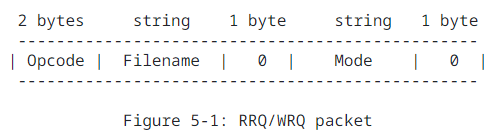

- FileName: 以 netascii 表示的以 0 字节结束字节序列。 
- Mode：传输模式，netascii、octet、mail（或者大写）
  - netascii 模式，主机收到该类型的数据时，必须将数据转换成其自定义格式。
  - octet模式，用于传输以发送方机器的 8 位格式保存的文件。例如，在 DEC-20 这种 36 位的机器上，通常是4个 8 位字节组成一个字，且有4位的额外填充。如果一个主机接收了一个八位字节文件并返回它，则返回的文件必须与原始文件完全一致。
  - mail模式，使用邮件接收者的名字代替文件，并且必须以 WRQ 开头。除此之外，它与 netascii 模式是相同的。邮件接收者的字符串应为“用户名”或“用户名@主机名”的形式。如果使用第二种形式，可以允许通过中继计算机进行邮件转发。

​	上述讨论假设发送方和接收方都在相同的模式下操作，但实际上并不一定如此。

**【示例一】**

​	例如，可以构建一个存储服务器，不需要将 netascii 转换为其自身的文本格式。发送方以 netascii 格式发送文件，但存储服务器以 8 位格式存储这些文件，而不进行转换。

**【示例二】**

​	另一个例子是 DEC-20 系统中存在的问题。netascii 和 octet 模式都无法访问字中的所有位。可以为这样的机器创建一个特殊模式，读取字中的所有位，但接收方以 8 位格式存储信息。当从存储站点检索这样的文件时，必须恢复到原始形式以便使用，因此也必须实现反向模式。用户站点需要记住一些信息来实现这一点。

在这两个例子中，请求包将指定 octet 模式给远程主机，但本地主机将处于其他模式。虽然 TFTP 中没有规定这种特定于机器或应用的模式，但这与规范是兼容的。也可以为配对的主机定义其他模式，但这必须小心进行。没有要求其他主机必须实现这些模式。没有中央机构会定义这些模式或分配它们的名称。

### 4.4 DATA包（Opcode=3）

​	数据实际上是通过图 5-2 所示的 DATA 数据包进行传输的。DATA 数据包（Opcode = 3）包含一个块号和数据字段。数据包上的块号从 1 开始，并且每接收到一个新数据块，块号就增加 1。`该类限制允许程序使用一个单一的编号来区分新数据包和重复的数据包。`

> 数据字段的长度从0- 512 字节。
>
> 如果长度为 512 字节，则该块不是最后一个数据块；如果长度在零到 511 字节之间，则表示传输结束。

### 4.5 ACK包（Opcode=4）

​	**除非发生超时，不然除重复的确认应答（ACK）和用于终止的包之外，所有数据包都需要确认。**发送 DATA 数据包是对上一个DATA 数据包的第一个 ACK 确认包的确认。

​	WRQ 和 DATA 数据包通过 ACK 或 ERROR 数据包进行确认，而 RRQ 和 ACK 数据包则通过 DATA 或 ERROR 数据包进行确认。图 5-3 显示了一个 ACK 数据包（Opcode = 4）。ACK 数据包中的块号回显了正在被确认的 DATA 数据包的块号。WRQ 数据包的确认通过一个块号为0的 ACK 数据包完成。

> ACK确认数据包：Block中是被确认的DATA数据包的块号
>
> WRQ确认数据包：Block中块号是0

### 4.6 ERROR包（Opcode=5）

​	ERROR 数据包（Opcode = 5）的格式，如图 5-4 所示。**ERROR 数据包可以是对任何其他类型数据包的确认。**

- ErrorCode：错误码（整数），指示错误的性质
- ErrMsg：错误信息，使用netascii格式，供人工阅读，以0字节结束。

#### 4.6.1 错误码

| Value                                                  |             含义             |
| :----------------------------------------------------- | :--------------------------: |
| 0（Not defined, see error message (if any)）           | 未定义，参见错误信息（如有） |
| 1（File not found）                                    |          文件未找到          |
| 2（Access violation）                                  |           访问违规           |
| 3（Disk full or allocation exceeded）                  |      磁盘已满或分配超出      |
| 4（Illegal TFTP operation）                            |       非法的 TFTP 操作       |
| 5（Unknown transfer ID）                               |        未知的传输 ID         |
| 6（File already exists）                               |          文件已存在          |
| 7（No such user）                                      |          没有此用户          |
| 8（Transfer  be terminated due to option negotiation） |  由于选项协商问题应终止传输  |

#### 4.6.2 终止情况

- **正常终止**

  ​	传输的结束由一个包含 0 到 511 字节数据的 DATA 数据包标记（即，数据报长度 < 516）。这个数据包会像所有其他 DATA 数据包一样通过 ACK 数据包进行确认。**确认最终 DATA 数据包的主机可以在发送最终 ACK 后终止其连接。**

  ​	**考虑断开连接时，Timewait状态：**另一方面，建议延迟确认。这意味着发送最终 ACK 的主机在终止连接之前会等待一段时间，以便在最终 ACK 丢失的情况下重新传输。

  ① 如果确认者收到最终 DATA 数据包再次到达（发送方没有收到最后一个包的ACK，触发重传），则会知道 ACK 已丢失。**发送最后一个 DATA 数据包的主机必须重新传输它，直到数据包得到确认或发送主机超时。**如果响应是 ACK，则传输成功完成。

  ② 如果数据发送方超时且不再准备重新传输，但实际数据已经成功到达确认者端，传输可能已经成功完成。然而，在这之后，确认者或网络可能遇到问题（例如，丢失了最终的 ACK），导致确认者无法发送确认信息。如果数据的发送方超时并且不准备再传输，而在超时之前确认者或网络已经出现问题，传输可能未能成功完成。

- **过早终止**

​		如果请求无法满足或在传输过程中发生错误，则会发送一个 ERROR 数据包。但由于它不会被重传或确认，因此可能永远不会被	接收到。**超时机制也必须用于检测错误。**

如果说在Timewait时间内又收到了对端的Data包，重传ACK

## 5. TFTP Option选项扩展

`RFC2347.txt`

> 在读写请求数据包中进行选项扩展。
>
> 选项扩展确认（OACK）用于确认客户端的选项协商请求

​	它允许在传输之前通过一种与 TFTP 的请求包格式一致的机制进行文件传输选项的协商。该机制通过执行请求-响应-确认的序列来保持简单，这与 TFTP 本身采用的锁步方法类似。

​	TFTP 选项被附加到**读请求和写请求数据包**中。又定义了一个新的 TFTP 数据包类型——选项确认（Option Acknowledgment，OACK）被用于确认客户端的选项协商请求。此外，定义了一个新的错误代码 8，用于指示由于选项协商问题应终止传输

> **注意：服务器不能请求选项，只能响应选项。如果客户端收到包含未请求选项的OACK，它应响应一个ERROR包（错误码为8），并终止传输。**

### 5.1 REQ/WRQ选项扩展请求包

选项被附加到 TFTP 读请求或写请求数据包中的方式如下：

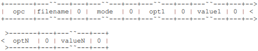

- **opc** ：操作码字段（1为读请求，2为写请求）

- **filename：**文件名，以 NULL 结尾。
- **mode：**文件传输模式，"netascii"、"octet" 或 "mail"，以 NULL 结尾。
- **opt1：**第一个选项，采用不区分大小写的 ASCII（例如，`blksize`），以 NULL 结束。

- **value1：**`value1` 与第一个选项关联的值，采用不区分大小写的 ASCII，以 NULL 结束。

- **optN、valueN：**最后一个选项/值对。每个字段以 NULL 结束，采用不区分大小写的 ASCII。

​	如果协商多个选项，将它们依次附加在一起，选项顺序没有特定要求。请求数据包的最大大小为 512 个八位字节（512 Byte）。

### 5.2 OACK选项确认包（Opcode=6）

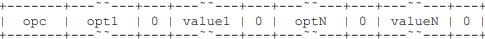

- **opc** ：操作码字段包含 6，表示选项确认
- **opt1：**第一个选项确认，复制自原始请求。

- **value1：**第一个选项关联的确认值。如果这个值与原始请求中的值有何不同，这将会在该选项的规范中详细说明。
- **optN、valueN：**最后一个选项/值对。

> OACK中包括服务器识别并接受的每个选项。如果选项允许提议替代值，这是特定于选项的功能。

### 5.3 **协商协议**

- 客户端在读取请求或写入请求数据包的**末尾附加选项**。可以指定任意数量的选项，但每个选项只能指定一次，选项的顺序不重要。

- 如果服务器支持选项协商，并且识别了请求数据包中指定的一个或多个选项，服务器可以用选项确认（OACK）响应。
  - OACK中包括服务器识别并接受的每个选项。如果选项允许提议替代值，这是特定于选项的功能。

​	服务器不得在OACK中包含客户端未请求的选项，即只有客户端可以启动选项协商。**服务器应省略不支持的选项，不应生成错误包。**如果支持的选项值无效，选项的规范会指示服务器是否应省略该选项、响应替代值，或发送错误包（错误代码8）以终止传输。

​	客户端和服务器必须忽略未被服务器确认的选项，如同这些选项从未被请求过一样。如果请求了多个选项，客户端必须使用服务器确认的选项，并且不能使用未被确认的选项。

#### 5.3.1 三种可能返回包

- 当客户端在**读取请求数据包**的末尾附加选项时，服务器可能返回以下三种响应：

  - **OACK** - 确认读取请求及其选项；

  - **DATA** - 确认读取请求，但不确认选项；

  - **ERROR** - 请求被拒绝。        

- 当客户端在**写入请求数据包**的末尾附加选项时，服务器可能返回以下三种响应：

  - **OACK** - 确认写入请求及其选项；

  - **ACK** - 确认写入请求，但不确认选项；

  - **ERROR** - 请求被拒绝。

#### 5.3.2 服务器若不支持选项协商时处理方式

**忽略选项：**如果服务器不支持选项协商，它可能会忽略附加到客户端请求中的任何选项。在这种情况下，服务器会返回一个读取请求		    的数据包（DATA）或一个写入请求的确认包（ACK），以建立正常的TFTP数据传输。

**重复请求：**如果服务器对带有选项的请求返回错误，客户端可以尝试重复请求，**不附加任何选项**。

​		    这种实现选项适用于**将请求包中的附加数据视为错误**的服务器。

#### 5.3.3 客户端对OACK包的确认

根据原始传输请求，有两种方式让客户端确认接受服务器的OACK。

- 如果传输是通过读取请求发起的，则客户端会发送一个ACK（数据块号设置为0）来**确认服务器OACK包中的值**。

- 如果传输是通过写入请求发起的，则客户端开始传输，发送第一个DATA包，使用协商的值。
- 如果客户端拒绝OACK，则会向服务器发送一个ERROR包（错误码为8），并终止传输。

​	一旦客户端确认了OACK（以适当的非错误响应），客户端同意只使用服务器返回的选项和值。

**请记住，服务器不能请求选项，只能响应选项。如果客户端收到包含未请求选项的OACK，它应响应一个ERROR包（错误码为8），并终止传输。**

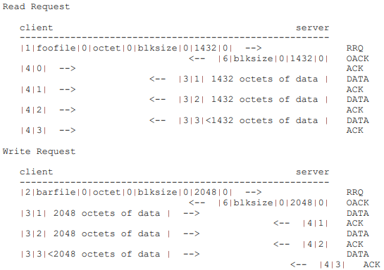

## 6. TFTP块大小选项

`RFC2348.txt`

本文档描述了一种TFTP选项，允许客户端和服务器协商更适合网络介质的区块大小。

**通过块大小协商扩展方法，原始的512字节块在以太网环境中实际上被不大于1468字节的块所替代，以避免IP块分段。**

### 6.1 REQ/WRQ附加块大小选项包

**Blocksize Option Specification**

​	TFTP读取请求或写入请求数据包被修改以包括区块大小选项。**除了“opc”字段外，所有字段都是以NULL终止的。**

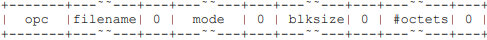

- **opc** ：操作码字段（1为读请求，2为写请求）

- **filename：**文件名，以 NULL 结尾。
- **mode：**文件传输模式，"netascii"、"octet" 或 "mail"，以 NULL 结尾。
- **blksize：**区块大小选项，“blksize”（不区分大小写），以 NULL 结尾。
- **#octets：**数据块中的字节数，以ASCII格式指定。有效值范围在“8”到“65464”字节之间（包含这两个值）。区块大小指的是数据字节数，不包括TFTP头部的四个字节。****

**【示例】**

​	这是一个读取请求，请求文件名为“foobar”，使用八位字节（binary）传输模式，并且块大小为1428字节

> （以太网最大传输单元 1500 - 4 - 8 - 20 = 1468）。

​	如果服务器愿意接受块大小选项，它将向客户端发送一个选项确认（OACK）。指定的值必须小于或等于客户端指定的值。客户端随后必须使用OACK中指定的大小，或者发送一个错误包（ERROR），错误代码为8，以终止传输。

​	接收的数据包的长度小于协商的块大小时，该数据包就是最终数据包。如果块大小大于要传输的数据量，第一个数据包即为最终数据包。如果要传输的数据量是块大小的整数倍，则会发送一个额外的数据包（不包含数据）来结束传输。

### **6.2 Proof of Concept 概念验证**

#### 6.2.1 不同块大小的对比实验

​	性能测试在原型实现上使用了多种块大小进行。测试在负载较轻的以太网环境中进行，测试设备为两台HP-UX 9000，使用“octet”模式，文件大小为2.25MB。下图展示了在有中间网关（g-time）和没有中间网关（n-time）的情况下，平均（5次）传输时间的对比。

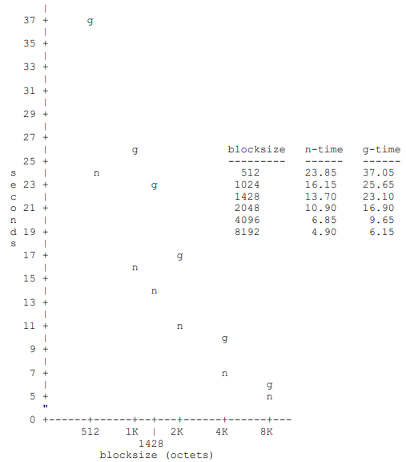

**在没有网关的情况下，标准512字节块大小与协商块大小之间的传输时间比较：**

这部分通常包括图表或数据展示如何不同的块大小（例如协商的块大小与标准的512字节块大小）影响传输时间。在这种情况下：

- **标准512字节块大小**：这是TFTP协议的默认块大小，用于原始测试。
- **协商块大小**：在测试中，通过协商确定的块大小，用于比较其对传输性能的影响。

在性能测试中，可以观察到不同块大小如何影响传输效率。这通常通过计算在不同块大小下完成相同文件传输所需的平均时间来进行比较。

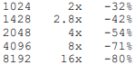

#### 6.2.2 实验结论

​	正如预期的那样，随着块大小的增加，传输时间减少。这是因为数据包的数量减少。例如，将块大小从512字节增加到1024字节，不仅数据包数量减少了一半，而且确认包的数量也减少了一半（同时减少了数据传输方等待确认的次数）。另一个效果是减少了每个数据包的封装和处理开销，从而提高了效率。

​	当然，如果块大小超过了路径的最大传输单元（MTU），则会开始进行IP分片和重组，这将增加更多的开销。这在路径中存在更多网关时尤为明显。

## 7. TFTP超时间隔和传输大小选项

### 7.1 REQ/WRQ附加超时间隔选项包

TFTP 读取请求或写入请求数据包被修改以包括超时选项，如下所示：

- **opc** ：操作码字段（1为读请求，2为写请求）

- **filename：**文件名，该字段以 NULL 结尾。
- **mode：**文件传输模式，"netascii"、"octet" 或 "mail"，该字段以 NULL 结尾。
- **timeout：**超时间隔选项，"timeout"（不区分大小写）。该字段以 NULL 结尾。
- **#secs：**在重传之前等待的秒数，。有效值范围在 "1" 到 "255" 秒之间（含）。该字段以 NULL 结尾。

**【例如】**

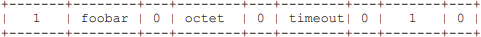

​	这是一个读取请求，请求读取名为 "foobar" 的文件，传输模式为 octet（二进制模式），超时间隔为 1 秒。

如果服务器愿意接受超时间隔选项，它将向客户端发送一个选项确认（OACK）。**指定的超时间隔值必须与客户端指定的值匹配。**

### **7.2 REQ/WRQ附加传输大小选项包**

TFTP 读取请求或写入请求数据包被修改以包括 `tsize` 选项，如下所示：

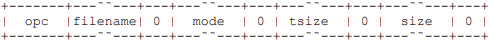

- **opc** ：操作码字段（1为读请求，2为写请求）

- **filename：**文件名，该字段以 NULL 结尾。
- **mode：**文件传输模式，"netascii"、"octet" 或 "mail"，该字段以 NULL 结尾。
- **tsize：**传输大小选项，"tsize"（不区分大小写）。该字段以 NULL 结尾。
- **size：**要传输的文件大小。该字段以 NULL 结尾。

**【例如】**

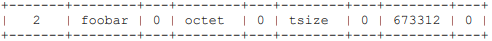

​	这是一个写入请求，文件名为 "foobar"，文件大小为 673312 字节，传输模式为 octet（二进制模式）。

- 在读取请求数据包中，请求中指定的文件大小为 "0"，文件的实际大小（以字节为单位）将在 OACK 中返回。如果文件大小对于客户端来说太大，可以通过错误数据包（错误代码 3）终止传输。
- 在写入请求数据包中，文件的大小（以字节为单位）在请求中指定，并在 OACK 中回显。如果文件对于服务器来说太大，服务器可以通过错误数据包（错误代码 3）终止传输。

## 8. TFTP窗口大小选项

`RFC 2347`

​	“简单文件传输协议”（TFTP，RFC 1350）是一种简单的锁步（lockstep）文件传输协议，允许客户端将文件下载或上传到远程主机上。它的主要用途之一是在节点通过局域网（LAN）启动的早期阶段。TFTP 被用于这个应用，因为它非常简单易于实现。然而，锁步机制的使用在局域网中会限制吞吐量。

​	本文档描述了一种 TFTP 选项，该选项**允许客户端和服务器协商一个连续数据块的窗口大小，以替代单块锁步机制**。

1. 介绍

   虽然TFTP在今天的互联网传输中几乎未被使用，但在网络启动/安装场景中，包括EFI（可扩展固件接口），TFTP仍被广泛使用。TFTP固有的低传输速率目前已通过使用块大小协商扩展 [RFC2348] 部分缓解。通过块大小协商扩展方法，原始的512字节块在以太网环境中实际上被不大于1468字节的块所替代，以避免IP块分段。对于传输大型文件，如Linux发行版的初始ramdisk或微软WDS/MDT/SCCM网络安装中使用的PE镜像，这种策略效果不足。鉴于TFTP今天看起来远未过时，本文档在“TFTP选项扩展” [RFC2347] 的条款下，**提出了一种协商扩展，使TFTP的传输速率可与现代文件传输协议相媲美。**

2. 本文件中使用的约定

   本文件中的关键字“MUST”、“MUST NOT”、“REQUIRED”、“SHALL”、“SHALL NOT”、“SHOULD”、“SHOULD NOT”、“RECOMMENDED”、“NOT RECOMMENDED”、“MAY”和“OPTIONAL”应按照 [RFC 2119] 中的描述进行解释。在本文件中，这些词语只有在全大写时才按该解释使用。小写形式的这些词语不应被解释为具有RFC 2119中赋予的意义。

### 8.1 REQ/WRQ附加窗口大小选项包

​	TFTP 读请求或写请求数据包被修改以包含窗口大小选项，如下所示。

> 除“opc”字段外，所有字段**必须**是ASCII字符串，后跟一个字节的NULL字符。

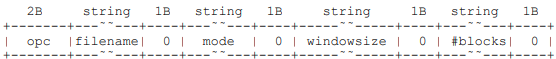

- **窗口大小选项**：`windowsize`（不区分大小写）。

- **#blocks**：窗口中块的数量的十进制ASCII字符串表示。有效值的范围**必须**在1到65535块之间。窗口大小指的是在发送完一定数量的连续数据块后，发送方会暂停并等待对最后一个数据块的确认。

  > 这个机制有助于提高数据传输效率，因为在等待确认的同时可以继续发送多个数据块，而不必逐块发送和确认。

**【示例】**

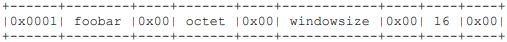

​	这是一个针对名为“foobar”的文件的读取请求，使用八位字节传输模式，窗口大小为16块（此示例中未协商块大小选项，默认每块512字节）。如果服务器愿意接受窗口大小选项，它会向客户端发送一个选项确认（OACK）。指定的值**必须**小于或等于客户端指定的值。然后，客户端**必须**使用OACK中指定的大小，或发送错误代码为8的ERROR数据包以终止传输。

接收到的具有小于协商窗口大小的块数的数据窗口被视为最终窗口。如果窗口大小大于待传输的数据量，则第一个窗口即为最终窗口。

### 8.2 流量控制和错误处理

下图描述了在一个通用窗口大小TFTP文件传输中，数据发送方（DSND）和数据接收方（DRCV）之间的流量流动部分。

- **数据发送方（DSND）**：**必须**周期性地向数据接收方（DRCV）发送协商好的连续数据块窗口，然后正常停止并等待传输窗口的确认					（ACK）。
- **数据接收方（DRCV）**：**必须**向数据发送方（DSND）发送窗口内最后一个数据块的ACK，以确认成功接收了该数据块窗口。

异常情况：

- 如果预期的ACK未能及时到达数据发送方（超时），最后接收到的ACK应设置为**下一窗口的起始块位置**进行发送。
- 在数据块序列错误的情况下，数据接收方（DRCV）**应**通过发送对应于最后一个正确接收数据块的ACK来通知数据发送方（DSND）。被通知的数据发送方（DSND）**应**发送一个新的数据块窗口，其起始位置**必须**基于接收到的序列错误的ACK。

窗口大小为1的数据流**必须**等同于 [RFC1350] 中指定的数据流。

> 对于本节未特别处理的规范流量，请参阅 [RFC1350] 及其更新。

5. 概念验证和窗口大小评估

​	在原型实现上进行了性能测试，使用了不同的窗口大小和固定的1456字节块大小。这些测试在轻负载的千兆以太网上进行，测试设	备为两台Toshiba Tecra Core 2 Duo 2.2 GHz的笔记本电脑，采用“八位字节”模式，传输了一个180 MB的文件。

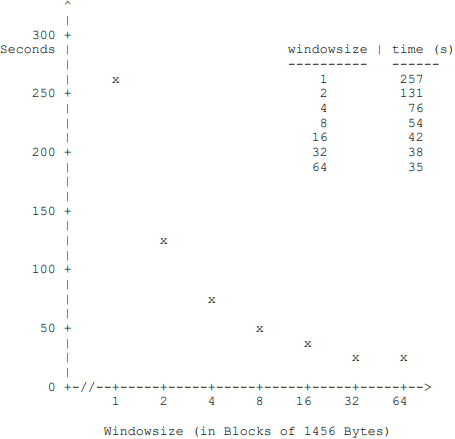

​	相比之下，在相同的环境中，通过映射到服务器消息块（SMB）/公共互联网文件系统（CIFS）上的驱动器进行的180 MB文件传输耗时为23秒。

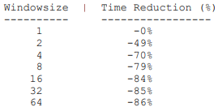

### 8.3 **拥塞和错误控制**

​	使用窗口化方案可以减少传输时间。时间减少的原因是所需的同步确认数量减少了。具体情况下适当的窗口大小取决于基础网络技	术、拓扑结构及其他因素。操作人员**应**测试各种窗口大小，并在选择窗口大小时**应**保持谨慎，因为正如前表和图表所示，继续增大窗	口大小会带来收益递减的情况。

一个针对以太网环境（1 Gbit/s，MTU=1500）进行规模调整的实现示例如下：

- **窗口大小**: 8
- **块大小**: 1456 字节
- **每块/窗口的最大重传尝试次数**: 6 
- **重传之间的超时**: 1 秒
- **最小数据包间隔延迟**: 80 微秒

实现时可能会根据预期和/或测试的操作条件选择其他值。

## 附录

### 1. 头部序列

### 2. TFTP格式

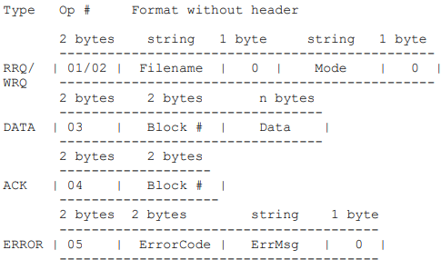

### 3. **读取文件的初始连接协议**

- 主机 A 向主机 B 发送一个 "RRQ" 请求，源地址为 A 的 TID，目标端口号为 69。

- 主机 B 向主机 A 发送一个 "DATA" 数据包（块号为 1），源地址为 B 的 TID，目标地址为 A 的 TID。

### 4. Internet User Datagram Header 互联网用户数据报头

（这仅为方便起见包含在内。TFTP 不必实现于UDP协议之上。）

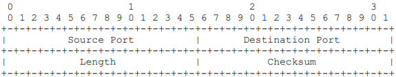

- **源端口：**发送发端口号。
- **目标端口：**目的端口号（RRQ 或 WRQ 的端口为 69）。
- **长度：** UDP 数据包中的字节数，包括 UDP 头。
- **校验和：** 参考 2 描述了计算校验和的规则。（实现者应确保使用正确的算法）字段如果未使用则为零。

注意：TFTP 将传输标识符（TID）传递给互联网用户数据报协议，用作源端口和目标端口。

### **5. 安全考虑**

​	由于 TFTP 不包含登录或访问控制机制，因此在授予 TFTP 服务器进程权限时必须小心，以免违反服务器主机文件系统的安全性。TFTP 通常会配置控制措施，以确保仅有公共读取权限的文件可以通过 TFTP 访问，并且禁止通过 TFTP 写入文件。

# 2. TFTP工作过程

## 1. REQ请求过程

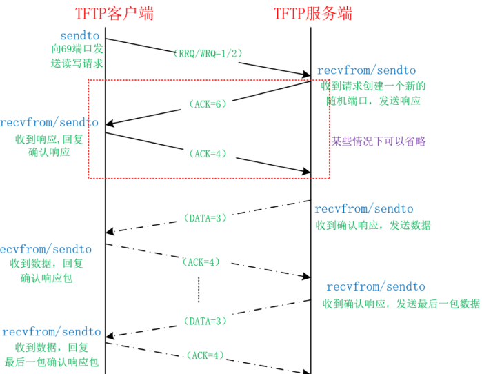
