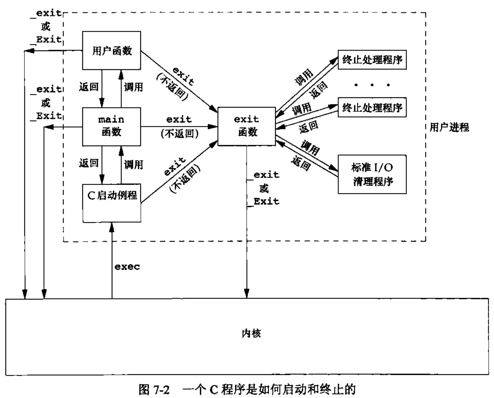
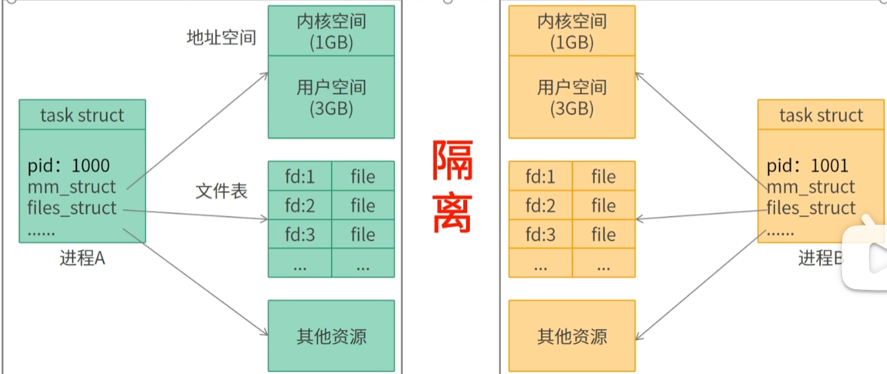
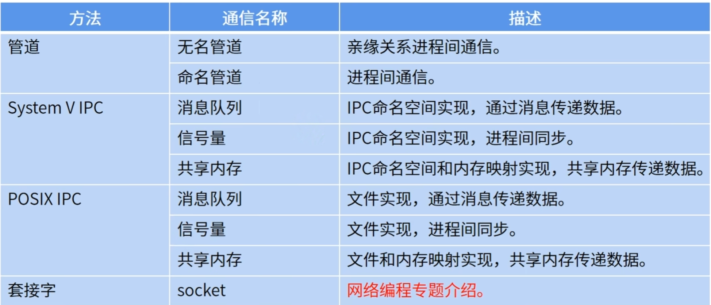
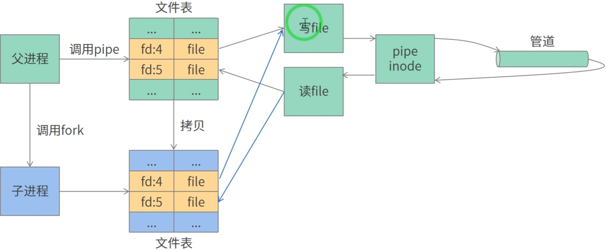
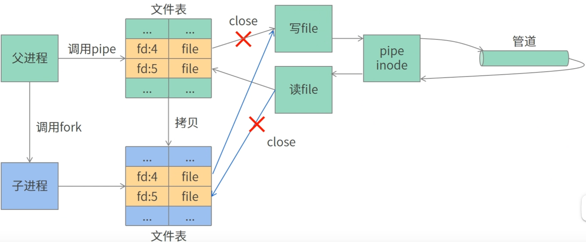
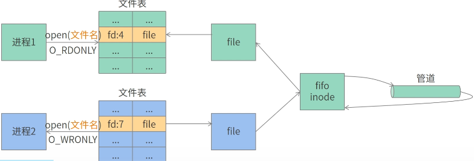
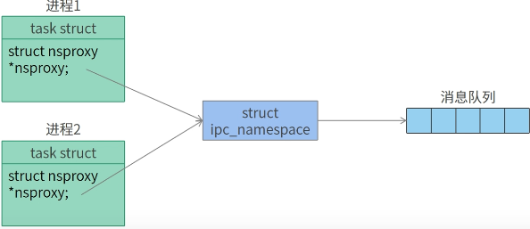
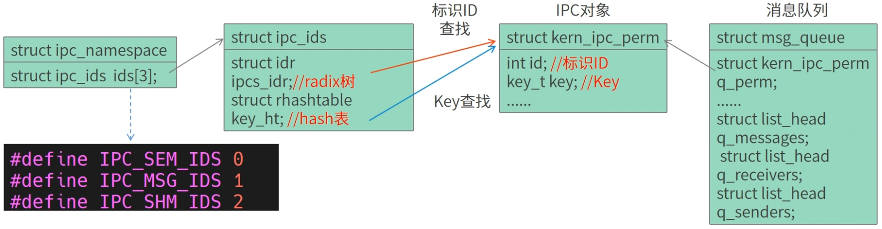

# UNIX环境编程

## 第3章 文件I/O

> 常用的5种I/O函数：open、read、write、lseek和close。

### 3.1 文件描述符

> include <unistd.h>

文件描述符：一个非负整数。  **0 ~ OPEN_MAX-1**

创建时机：打开一个现有文件或新建文件时，内核会向进程返回一个文件描述符。

三种标准输入、标准输出以及标准错误：**STDIN_FILENO（0）、STDOUT_FILENO（1）、STDERR_FIFENO（2）**


### 3.3 文件I/O相关的各种函数

#### 3.3.1 open和openat


#### 3.3.2 creat

#### 3.3.3 close

#### 3.3.4 lseek


## 第7章 进程环境

### 7.1 进程终止

#### 7.1.1 正常终止（5种）

1. 从main返回
2. 调用exit函数
3. 调用_exit函数或\_Exit
4. 最后一个线程从启动例程返回（11.5节）
5. 从最后一个线程调用pthread_exit（11.5节）

#### 7.1.2 异常终止（3种）

1. 调用abort
2. 接到一个信号
3. 最后一个线程对取消请求做出响应（11.5节和12.7节）

#### 7.1.3 退出函数

```c
#include <stdlib.h>
// 这两个终止一个程序，都会立即进入内核
void exit(int status);
void _Exit(int status);

#include <unistd.h>
// 先执行一些清理操作，然后返回进入内核
void _exit(int status);
```

status: 终止状态（退出状态）

> 若main函数终止时没有显示使用return语句或调用exit函数，则进程的终止状态是未定义的。
>
> ​     exit(0) 等价于 return (0)   // main函数返回一个整型值与该值调用exit是等价的。


**进程终止状态为未定义：**

1. main执行了一个不带返回值的return语句
2. main的返回值类型不为int
3. 调用3个退出函数不带终止状态


#### 7.1.4 atexit登记终止处理程序函数

一个进程可以登记至多32个函数（终止处理程序），这些函数被exit()自动调用，由atexit()来登记这些函数。(调用的顺序与登记顺序相反)

```c
int atexit(void (*func)(void));
```

```c
static void my_exit1(void){
    printf("first exit handler\n");
}

static void my_exit2(void){
    printf("second exit handler\n");
}

static void my_exit2(void);

int main(void){
  if(atexit(my_exit2) != 0)
  	err_sys("can't register my_exit2");
  	
  if(atexit(my_exit1) != 0)
  	err_sys("can't register my_exit1");
    
  if(atexit(my_exit1) != 0)
  	err_sys("can't register my_exit1");
    
  printf("main is done\n");
  return 0;
}

// main is done
// first exit handler  每登记一次就会被执行一次
// first exit handler
// second exit handler
```



exit首先会调用所有终止处理程序，然后通过fclose关闭所有打开流。

> 进程自愿终止的唯一方法：
>
> - 显示调用_exit或\_Exit。
> - 通过exit隐式调用_exit或\_Exit
>
> 
>
> 进程非自愿终止：由一个信号来终止


## 第8章 进程控制

### 8.1 进程标识

​		每个进程ID是一个非负整数的唯一ID。

> pid = 0: 调度进程（交换进程），是内核的一部分，但它不执行任何磁盘上的程序。   系统进程
>
> pid = 1: init进程（决不终止）   负责在自举内核后启动一个UNIX系统。  用户进程                 
>
> pid = 2：守护进程  负责支持虚拟存储器系统的分页操作

### 8.2 获取进程有关ID的函数

```c
pid_t getpid(void);    // 进程ID
pid_t getppid(void);   // 父进程ID
 
uid_t getuid(void);    // 进程实际用户ID
uid_t geteuid(void);   // 进程有效用户ID

gid_t getgid(void);    // 进程实际组ID
gid_t getegid(void);   // 进程有效组ID
```


### 8.3 进程常用函数

```c
pid_t fork(void);
```

#### 8.3.1 fork

fork调用一次，返回两次。

- 子进程返回0
- 父进程返回新建子进程的进程ID


## 10. 进程间通信

​		进程间通信（IPC）是指在多个进程之间传输数据或共享信息的机制。

> 在OS中，每个进程都拥有独立的地址空间和资源。通过IPC机制可以实现进程间的数据交换和协作。



- **进程间通信的目的**
  - **数据交换**
    - 实现在不同进程之间传递数据。
  - **共享资源**
    - 实现多个进程共享资源，如共享内存、文件、设备等。
  - **进程同步**
    - 用于实现进程之间的同步操作。
  - **消息传递**
    - 可以通过消息传递的方式实现进程间的通信和协作。

### 10.1 进程间通信方法

分为四类：管道、System V IPC、Posix IPC、套接字。



#### 10.1.1 管道

##### 1. 无名管道

用于在具有亲缘关系的进程间通信。


**特点：**

- 半双工的通信方式，数据只能单向流动。 `一方负责发数据，另一方只能接收数据`
- 以字节流方式通信，数据格式由用户自定义。
- 多用于父子进程间通信，也可用于其他亲缘关系的进程间通信。 


**实现原理：**

1. 父进程调用pipe函数创建两个文件（**读管道文件、写管道文件**）。`对应的文件节点pipe inode(无名管道的)`


2. 父进程调用fork()函数创建子进程，此时，子进程会拷贝父进程的文件表。即父子进程指向相同的文件（操作同一管道）



3. 父进程调用close()函数关闭读文件描述符，子进程调用close()函数关闭写文件描述符。 



> 为什么匿名管道只能用在具有亲缘关系的进程间通信？
>
> ------  无亲缘关系的进程拥有的文件表不同，所以不能访问相同的文件，导致多个进程无法通过匿名管道来进行通信。


##### 2. 命名管道

通过FIFO文件（也称命名管道）来进行不同进程间的通信。

不同进程通过写入和读取相同FIFO文件进行通信。           `半双工通信，调用一次mkfifo函数，只生成一个管道（缓冲区）`


**特点：**

- FIFO文件位于文件系统中，可以像其他文件一样进行访问和管理。
- FIFO文件可以通过文件名进行识别和引用，而不仅仅依赖于文件描述符。
- FIFO文件可以在不同进程之间进行双向通信，允许同时进行读取和写入操作。


```c
// 1. 创建命名管道文件 FIFO文件
int mkfifo(const char* pathname, mode_t mode);
```

**实现原理：**

1.  进程通过调用`mkfifo函数`创建一个FIFO文件，FIFO文件对应一个fifo inode（底层和pipe inode实现相同）

   

2. 进程调用`open函数`打开FIFO文件，由于每个文件都对应唯一的inode节点，所以每个进程打开的是相同的inode节点。
3. 进程调用`write或read函数`来进行读写管道，实现进程间通信。




#### 10.1.2 System V消息队列

它允许在同一系统上运行的不同进程之间传递消息。

**优点：**

- 可以实现独立的进程间通信，不受进程的启动和结束顺序的影响。
- 允许多个进程同时向消息队列中写入和读取消息，实现了并发处理。
- 通过消息优先级机制，可以优先处理重要的消息。


**实现原理：**

具有相同IPC命名空间的进程能**同时访问IPC命名空间相同内存空间**。




```
1. Key: 整数型，用来索引IPC对象（根据哈希表），检索成功返回标识ID；失败则创建IPC对象并返回标识ID。
2. 标识ID：整数型，用来索引IPC对象（根据radix树），并不是由Key产生，而是由其他信息（如序号）通过算法产生。
3. IPC对象：消息队列继承IPC对象，提供一些通用信息
```



3. Key的生成（三种）

   - **第一种：**通过msgget()函数，使用一个随机整数，如：

     ```c
     /**
     *	创建或获取一个System V消息队列描述符
     *   arg： key 唯一标识一个消息队列，可取由ftok创建的key值或指定的一个非负整数值
     *         msgflg 指定创建消息队列的权限和选项。
     *                当使用IPC_CREAT | IPC_EXCL时，若消息队列不存在则创建，否则返回失败并设置erron标识为EEXIST
     *   
     *   return: 标识ID（成功）  失败返回-1，并设置errno
     */
     int msgget(key_t key, int msgflg);
     ```

     **msgget作用：**

      	1. 通过Key查找IPC对象（消息队列）
          - 查找成功 ，直接返回标识ID。说明Key已由IPC对象映射。
          - 查找失败，说明Key对应的IPC对象未创建，需创建一个新的IPC对象。创建的新的IPC对象需根据序号信息生成一个标识ID，再根据标识ID插入radix树。
      	2. 返回一个标识ID（msgid）	
          - 后续进程间通信，通过标识ID查找消息队列进行通信

   |      msgflg参数      | IPC对象存在 |        IPC对象不存在        |
   | :------------------: | :---------: | :-------------------------: |
   |          0           | 返回标识ID  |           返回-1            |
   |      IPC_CREATE      | 返回标识ID  | 创建IPC对象，返回新的标识ID |
   | IPC_CREATE\|IPC_EXEC |   返回-1    | 创建IPC对象，返回新的标识ID |

   

   

   - **第二种：**通过msgget()函数，使用IPC_PRIVATE标识生成，只用于**亲缘关系的进程**

     ```c
     msgget(IPC_PRIVATE,0644)
     ```

     

   - **第三种：**使用ftok()函数生成**（推荐）**

     ```c
     // 通过将pathname的i-node号和proj_id进行组合来生成一个唯一键值
     // arg:    pathname：存在的路径名
     //         proj_id：一个整数
     // return: Key值（成功）  失败返回-1，并设置errno
     key_t ftok(const char *pathname, int proj_id);
     ```

     

##### 1. 发送消息 msgsnd

将一个消息添加到指定的消息队列中

```c
/**
*	arg: msqid 消息队列的标识ID
*		 msgp 指向要发送的消息的指针
* 		 msgsz 要发送的消息的大小。 是消息mtext数据长度
*		 msgflg 控制发送消息的行为
*   return:
*        成功：返回实际发送消息的大小
*        失败返回-1，并设置errno
*/
int msgsnd(int msqid, const void msgp[.msgsz], size_t msgsz, int msgflg);
```

```c
struct msgbuf {
      long mtype;       /* message type, must be > 0 */
      char mtext[1];    /* message data 柔性数组*/   
};
```

##### 2. 接收消息 msgrcv

```c
/**
*	arg: msqid 消息队列的标识ID
*		 msgp 指向接收消息的缓冲区
* 		 msgsz 接收消息的最大长度。    为0表示接收队列中的第一个消息
*		 msgflg 接收消息的行为，控制接收操作的行为
*   return:
*        成功：返回实际接收消息的长度
*        失败返回-1，并设置errno
*/
int msgsnd(int msqid, const void msgp[.msgsz], size_t msgsz, int msgflg);
```


##### 3. 控制操作 msgctl

```c
/**
*	arg: msqid 消息队列的标识ID
*		 op 指定要执行的操作  
*			- IPC_STAT：获取消息队列的状态
*			- IPC_SET：设置消息队列的状态
*			- IPC_RMID：删除消息队列
*
* 		 buf 指向一个结构体msqid_ds指针，用于传递或获取消息队列的属性信息
*
*   return:
*        成功：IPC_STAT,IPC_SET
*        失败：返回-1，并设置errno
*/
int msgctl(int msqid, int op, struct msqid_ds *buf);
```

【使用示例】

```v
// 1. 获取消息队列状态
struct msqid_ds buf = {0};
int msgctl(msqid, IPC_STAT, &buf);

// 2. 设置消息队列的状态
struct msqid_ds buf = {0};
int msgctl(msqid, IPC_SET, &buf);

// 3. 删除消息队列
int msgctl(msqid, IPC_RMID, 0);
```

