# UNIX环境编程

## 第3章 文件I/O

> 常用的5种I/O函数：open、read、write、lseek和close。

### 3.1 文件描述符

> include <unistd.h>

文件描述符：一个非负整数。  **0 ~ OPEN_MAX-1**

创建时机：打开一个现有文件或新建文件时，内核会向进程返回一个文件描述符。

三种标准输入、标准输出以及标准错误：**STDIN_FILENO（0）、STDOUT_FILENO（1）、STDERR_FIFENO（2）**


### 3.3 文件I/O相关的各种函数

#### 3.3.1 open和openat


#### 3.3.2 creat

#### 3.3.3 close

#### 3.3.4 lseek


## 第7章 进程环境

### 7.1 进程终止

#### 7.1.1 正常终止（5种）

1. 从main返回
2. 调用exit函数
3. 调用_exit函数或\_Exit
4. 最后一个线程从启动例程返回（11.5节）
5. 从最后一个线程调用pthread_exit（11.5节）

#### 7.1.2 异常终止（3种）

1. 调用abort
2. 接到一个信号
3. 最后一个线程对取消请求做出响应（11.5节和12.7节）

#### 7.1.3 退出函数

```c
#include <stdlib.h>
// 这两个终止一个程序，都会立即进入内核
void exit(int status);
void _Exit(int status);

#include <unistd.h>
// 先执行一些清理操作，然后返回进入内核
void _exit(int status);
```

status: 终止状态（退出状态）

> 若main函数终止时没有显示使用return语句或调用exit函数，则进程的终止状态是未定义的。
>
> ​     exit(0) 等价于 return (0)   // main函数返回一个整型值与该值调用exit是等价的。


**进程终止状态为未定义：**

1. main执行了一个不带返回值的return语句
2. main的返回值类型不为int
3. 调用3个退出函数不带终止状态


#### 7.1.4 atexit登记终止处理程序函数

一个进程可以登记至多32个函数（终止处理程序），这些函数被exit()自动调用，由atexit()来登记这些函数。(调用的顺序与登记顺序相反)

```c
int atexit(void (*func)(void));
```

```c
static void my_exit1(void){
    printf("first exit handler\n");
}

static void my_exit2(void){
    printf("second exit handler\n");
}

static void my_exit2(void);

int main(void){
  if(atexit(my_exit2) != 0)
  	err_sys("can't register my_exit2");
  	
  if(atexit(my_exit1) != 0)
  	err_sys("can't register my_exit1");
    
  if(atexit(my_exit1) != 0)
  	err_sys("can't register my_exit1");
    
  printf("main is done\n");
  return 0;
}

// main is done
// first exit handler  每登记一次就会被执行一次
// first exit handler
// second exit handler
```


exit首先会调用所有终止处理程序，然后通过fclose关闭所有打开流。

> 进程自愿终止的唯一方法：
>
> - 显示调用_exit或\_Exit。
> - 通过exit隐式调用_exit或\_Exit
>
> 
>
> 进程非自愿终止：由一个信号来终止


## 第8章 进程控制

### 8.1 进程标识

​		每个进程ID是一个非负整数的唯一ID。

> pid = 0: 调度进程（交换进程），是内核的一部分，但它不执行任何磁盘上的程序。   系统进程
>
> pid = 1: init进程（决不终止）   负责在自举内核后启动一个UNIX系统。  用户进程                 
>
> pid = 2：守护进程  负责支持虚拟存储器系统的分页操作

### 8.2 获取进程有关ID的函数

```c
pid_t getpid(void);    // 进程ID
pid_t getppid(void);   // 父进程ID
 
uid_t getuid(void);    // 进程实际用户ID
uid_t geteuid(void);   // 进程有效用户ID

gid_t getgid(void);    // 进程实际组ID
gid_t getegid(void);   // 进程有效组ID
```


### 8.3 进程常用函数

```c
pid_t fork(void);
```

#### 8.3.1 fork

fork调用一次，返回两次。

- 子进程返回0
- 父进程返回新建子进程的进程ID


## 10. 进程间通信

​		进程间通信（IPC）是指在多个进程之间传输数据或共享信息的机制。

> 在OS中，每个进程都拥有独立的地址空间和资源。通过IPC机制可以实现进程间的数据交换和协作。

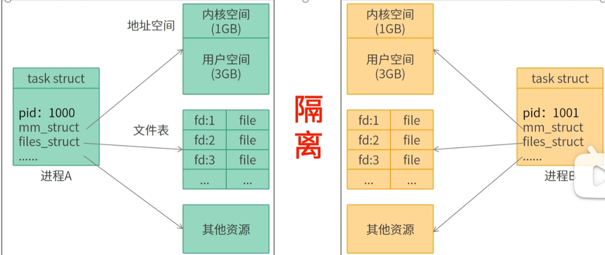

- **进程间通信的目的**
  - **数据交换**
    - 实现在不同进程之间传递数据。
  - **共享资源**
    - 实现多个进程共享资源，如共享内存、文件、设备等。
  - **进程同步**
    - 用于实现进程之间的同步操作。
  - **消息传递**
    - 可以通过消息传递的方式实现进程间的通信和协作。

### 10.1 进程间通信方法

分为四类：管道、System V IPC、Posix IPC、套接字。

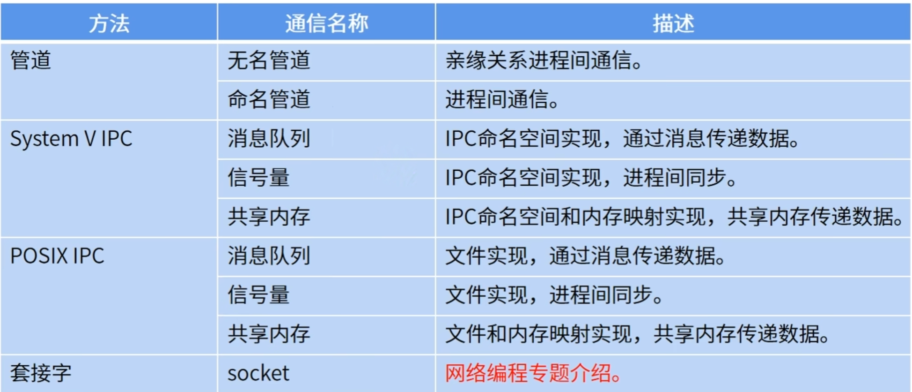

#### 10.1.1 管道

##### 1. 无名管道

用于在具有亲缘关系的进程间通信。


**特点：**

- 半双工的通信方式，数据只能单向流动。 `一方负责发数据，另一方只能接收数据`
- 以字节流方式通信，数据格式由用户自定义。
- 多用于父子进程间通信，也可用于其他亲缘关系的进程间通信。 


**实现原理：**

1. 父进程调用pipe函数创建两个文件（**读管道文件、写管道文件**）。`对应的文件节点pipe inode(无名管道的)`

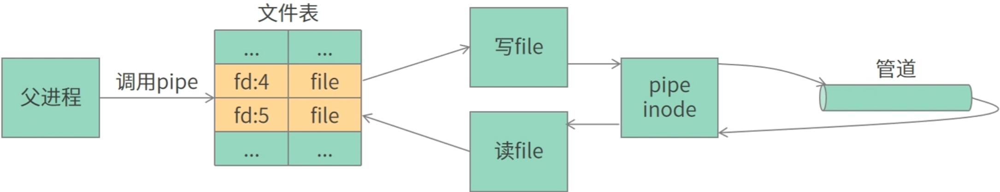

2. 父进程调用fork()函数创建子进程，此时，子进程会拷贝父进程的文件表。即父子进程指向相同的文件（操作同一管道）

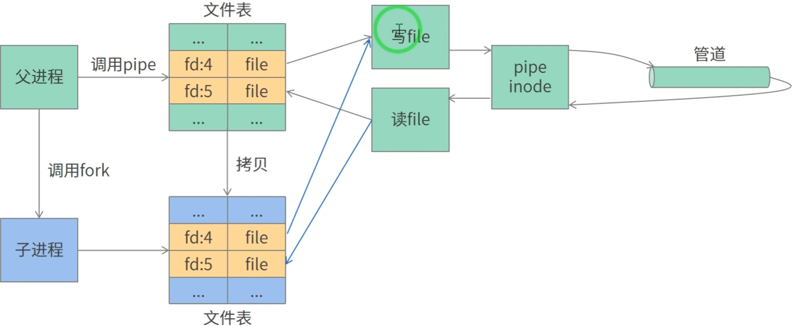

3. 父进程调用close()函数关闭读文件描述符，子进程调用close()函数关闭写文件描述符。 

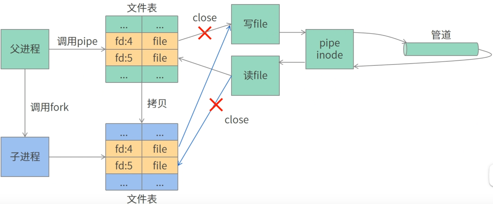

> 为什么匿名管道只能用在具有亲缘关系的进程间通信？
>
> ------  无亲缘关系的进程拥有的文件表不同，所以不能访问相同的文件，导致多个进程无法通过匿名管道来进行通信。


#### 10.1.3 信号量

信号量：一种用于不同进程间或同一个进程内不同线程间同步的原语。

信号量主要是用来<font color='red'>保护共享资源</font>，使得资源在一个时刻只有一个进程所拥有。PV操作

> 为什么已经有了互斥锁和条件变量，还需要信号量？
>
> 【原因】：提供**信号量**主要是提供一种**进程间的同步方式**，这些进程**可能共享**，也**可能不共享内存区**。
>
> ​				  而**互斥锁和条件变量**是**作为线程间的同步机制**说明的，这些线程总是**共享（某个）内存区**。


**两者类型信号量：**

- 二值信号量 `0/1`
  - 初始值通常为1。
- 计数信号量
  - 初始值大于1。


##### 1. System V信号量        

它给信号量新增一级复杂度。即<font color='red'>计数信号量集</font>：由一个或多个计数信号量构成的集合。`每个集合的信号量数限制在25个。`

```c
// 内核维护一个信号量集的信息结构
struct semid_ds
{
	struct ipc_perm sem_perm;  // 信号量集的权限和控制信息
	struct sem *sem_base;      // 指向信号量数组的指针
 	ushort sem_nsems;          // 信号量集中的信号量数量
    time_t sem_otime;          // 最近一次调用 semop 函数的时间
    time_t sem_ctime;          // 信号量集的最后一次更改时间
};
```

- 集合中

```
struct ipc_perm {
    __kernel_uid_t uid;  /* 信号量集的所有者的用户 ID */
    __kernel_gid_t gid;  /* 信号量集的所有者的组 ID */
    __kernel_uid_t cuid; /* 创建信号量集的用户 ID */
    __kernel_gid_t cgid; /* 创建信号量集的组 ID */
    umode_t mode;        /* 访问权限（如读、写、执行） */
    unsigned short seq;  /* 序列号，用于版本管理。*/
    struct timespec __stime; /* Last access time */
    struct timespec __otime; /* Last change time */
    struct timespec __ctime; /* Creation time */
};
```

信号集中信号量的 sem 结构体:

```
struct sem
{
     ushort semval;     /* 信号量的值 */
     pid_t sempid;      /* 最后一次操作该信号量的进程ID */
     ushort semncnt;    /* 等待其值增长的进程数 */
     ushort semzcnt;    /* 等待其值变为0的进程数 */
};
```

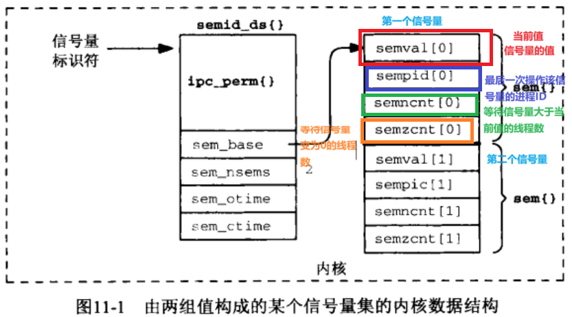

###### 1. semget()

该函数返回的信号量标识符将由`semop或semctl`函数使用。

```c
// 创建一个信号量集或打开一个已存在的信号量集
/* 参数说明 : 
		key: 由ftok创建的或者可以是IPC_PRIVATE表明由系统选用一个关键字
		nsems：指定集合中信号量的数量
			   >0 创建一个新的信号量集，指定集合中信号量的数量，一旦创建就不能更改。
			   =0 访问一个已存在的信号量集
		semflg：创建的权限标志（如 0666是权限设置，表示信号量集合的权限） 包括 IPC_CREAT、IPC_EXCL、IPC_NOWAIT 等。
	返回：
		信号量标识符
*/
int semget(key_t key,int nsems,int semflg); 
```

> 注意：<font color='red'>semget不会初始化信号集中各个信号的值</font>，而是<font color='red'>需要后续通过调用semctl</font>来进行初始化。通过内部传入参数：
>
> - SET_VAL命令：设置一个值
> - SET_ALL命令：设置所有值


> IPC_CREAT：用于创建一个新的信号量集合。如果指定的键值（`key`）对应的信号量集合不存在，则会创建一个新的集合。
>
> IPC_EXCL：与 `IPC_CREAT` 结合使用，确保创建一个新的信号量集合时，如果该信号量集合已经存在则返回错误。
>
> IPC_NOWAIT：用于非阻塞模式。当你请求的操作无法立即完成时，`IPC_NOWAIT` 会使 `semget` 立即返回错误，而不是阻塞等待。
>
> ​							这个标志主要用于防止系统调用被阻塞。

```c
// 使用 semflg = 0，表示获取现有的信号量集合
int semid = semget(key, 0, 0);
```


###### -- 1.1 ftok()

```
// 根据 pathname 和 proj 来创建一个关键字
key_t ftok(char *pathname,char proj);
```


###### 2. semop()

打开一个信号集后，通过semop()来对一个或多个信号集进行操作。

```c
/**
	实现信号量的PV操作 
	参数说明： 
		semid：是 semget 返回的信号量集索引
		spos： 指向信号量操作结构体数组
		nspos： opsptr 所指向的 sembuf 结构体数组中的元素个数
*/
int semop(int semid, struct sembuf *opsptr, size_t npos);
```

```
// 信号量操作结构体 封装了PV操作的基本参数 
struct sembuf {  
    short sem_num; /* 要操作的信号量在信号量集里的编号  */ 
    short sem_op; /* 信号量操作
                     1.sem_op > 0 : 释放资源V操作
                     				其值就加到信号量值semval上，即释放信号量控制的资源,并唤醒等待信号增加的进程
                     2.sem_op = 0:  用于等待信号量达到指定值。 (通常用于同步机制中，确保线程或进程在某些条件下进行操作。比如，线程可以等待某个															条件满足（信号量值为 0）后再继续执行。)
                     				如果信号量是0，就返回,线程会继续执行后续代码，否则，阻塞直到信号量值为0.  
                     				若不为0，则将信号量的semzcnt值+1，调用线程被阻塞，直到semval值为0（到时，再将semzcnt-1）
                     					- 如果sem_flag设为IPC_NOWAIT，那么调用线程不会处于休眠状态，直接会返回一个错误。
                     					- 也有异常情况，会让函数将过早的返回一个错误。比如：如果某个被捕获的信号中断了引起休眠的semop函数，或者											相应的信号量被删除了，那么该函数也会过早的返回一个错误。（未设置IPC_NOWAIT）
                     3.sem_op < 0 : 申请资源P操作
                     				判断信号量 + 这个负值:    
                     					- 如果=0，唤醒等待信号量为0的进程；
                     					-    <0，函数阻塞
                                        -    >0, 从信号量里面减去这个值，并返回
                  */
    short sem_flg; /* 操作的标志 
    				 Value: 1. SEM_UNDO 由进程自动释放信号量 
 !!!!!!!!!!!!!!!!!!!!!!!!!!!!!  注意 设置为该标志后，进程退出后会撤销对信号量的操作（比如之前-1，进程退出后会+1）
                            2. IPC_NOWAIT 不阻塞
    				*/ 
};
```


```
唤醒机制：
	当线程 B 执行某个操作（如增加信号量的值）使得信号量值从 大于0 变为等于 0 时，操作系统会自动唤醒所有在等待该信号量为 0 的线程。
	在这时，线程 A 被自动唤醒并继续执行。
```


###### 3. semctl()

对一个信号量执行各种控制操作。

```c
/* 对信号集的一系列控制操作（semval 的赋值等）
  参数说明 : semid  :  要操作的信号量集
            semnum :  信号量集的某个成员 
            cmd：操作的命令  两种：SETVAL(设置信号量的值)和 IPC_RMID(删除信号量).
            arg：一个用户自定义的联合体 
*/
int semctl(int semid, int semnum, int cmd, ... /* union semun arg */);
```

```
// This function has three or four arguments, depending on cmd.  
// When there are four, the fourth has the type union semun.  The calling program must define this union as follows:

union semun {
   int              val;    /* Value for SETVAL */
   struct semid_ds *buf;    /* Buffer for IPC_STAT, IPC_SET */
   unsigned short  *array;  /* Array for GETALL, SETALL */
   struct seminfo  *__buf;  /* Buffer for IPC_INFO
                               (Linux-specific) */
};
```

**参数cmd的值：**

>
> **GETNCNT**：获得信号量集semid 中的等待给定信号量锁的进程数目，即 semid_ds 结构中 sem.semncnt 的值。
> **GETPID**：获得信号量集semid中最后一个调用 semop 函数的进程 ID，即 semid_ds 结构中的 sem.sempid 的值。
>
> **GETZCNT**：获得信号量集semid 中的等待信号量成为 0 的进程数目，即 semid_ds 结构中的 sem.semncnt 的值。
>
> **IPC_RMID**：删除该信号量。
> **IPC_SET**：按参数 arg.buf 指向的结构中的值设置该信号量对应的 semid_ds 结构。只有有效用户 ID 和信号量的所有者 ID 或创建者 ID 相同的用户进程，以及超级用户进程可以执行这一操作。
> **IPC_STAT**：获得该信号量的 semid_ds 结构，保存在 arg.buf 指向的缓冲区。
>
> 
>
> **SETALL**：通过 semun.array 指针，设置指针信号量集 semid 中每个信号量的值。
>
> **GETALL**：获取信号量集 semid 中所有信号量的值，并将这些值存放在无符号短整型数组 array 中。
>
> **SETVAL**：设置 semid 所表示的信号量集中 semnum 所指定信号量的值。 <font color='cornflowerblue'>初始化某个信号量的值</font>
>
> **GETVAL**：获得 semid 所表示的信号量集中 semunm 所指定信号量的值。


###### 4. 信号量调试

- 查看信号量  

  ```c
  ipcs -a  // 查看消息队列、信号量、共享内存
  ipcs -s  // 查看信号量
  ```

- 创建信号量

  ```c
  ipcmk -S 2 -p 0644  // 信号量集中有2个信号量，权限为0644
  ```

- 删除信号量

  ```c
  ipcrm -s 6         // 删除标识ID为6的信号量
  ```

  

###### 5. 案例

```c
#include <stdio.h>
#include <sys/types.h>
#include <sys/ipc.h>
#include <sys/sem.h>
#include <stdlib.h>
#include <unistd.h>

#define PATH_NAME "./"
#define NSEMS 10

union semun
{
    int val;               /* Value for SETVAL */
    struct semid_ds *buf;  /* Buffer for IPC_STAT, IPC_SET */
    unsigned short *array; /* Array for GETALL, SETALL */
    struct seminfo *__buf; /* Buffer for IPC_INFO
                              (Linux-specific) */
};

/**
 * 初始化信号集中指定的信号量值
 */
int sem_init_value(int semid, int numId, int val)
{
    union semun un;
    un.val = val;
    int ret = semctl(semid, numId, SETVAL, un);
    if (ret == -1)
    {
        perror("semctl SETVAL");
        return -1;
    }
    return 0;
}

/**
 * 获取信号集中指定信号量的值
 */
int sem_get_value(int semid, int numId)
{
    union semun un;
    int val = semctl(semid, numId, GETVAL, un);
    if (val == -1)
    {
        perror("semctl GETVAL");
        return -1;
    }
    return val;
}

/**
 * 模拟P操作，申请资源
 */
int sem_p(int semid)
{
    struct sembuf buf;
    buf.sem_num = 0;
    buf.sem_op = -1;
    buf.sem_flg |= SEM_UNDO;
    int ret = semop(semid, &buf, 1);
    if (ret == -1)
    {
        perror("sem p");
        return -1;
    }
    return 0;
}

/**
 * 等待资源
 */
int sem_wait(int semid)
{
    struct sembuf buf;
    buf.sem_num = 0;
    buf.sem_op = 0;
    buf.sem_flg |= SEM_UNDO;
    int ret = semop(semid, &buf, 1);
    if (ret == -1)
    {
        perror("sem wait");
        return -1;
    }
    return 0;
}

/**
 * 模拟V操作，释放资源
 */
int sem_v(int semid)
{
    struct sembuf buf;
    buf.sem_num = 0;
    buf.sem_op = 1;
    buf.sem_flg |= SEM_UNDO;
    int ret = semop(semid, &buf, 1);
    if (ret == -1)
    {
        perror("sem v");
        return -1;
    }
    return 0;
}

int main(int args, char **argv)
{
    int op, value;
    op = atoi(argv[1]);
    value = atoi(argv[2]);

    key_t key = ftok(PATH_NAME, 1);
    // 1. 创建一个信号量集或打开一个已存在的信号量集
    int semid = semget(key, NSEMS, 0644 | IPC_CREAT);
    printf("sem_set id:%d \n", semid);

    if (value >= 0)
    {
        // 2. 初始化信号量集中某个信号量的值
        sem_init_value(semid, 0, value);
        printf("sem_init val:%d \n", value);
    }

    // 3. 查看指定信号量的值
    int val = sem_get_value(semid, 0);
    printf("before op, sem_%d val:%d\n", 0, val);

    // 4. 根据不同操作，对信号量进行PV、wait操作。
    switch (op)
    {
    case -1:
        sem_p(semid);
        break;
    case 0:
        sem_wait(semid);
        break;
    case 1:
        sem_v(semid);
    default:
        break;
    }

    val = sem_get_value(semid, 0);
    printf("after op, sem_%d val:%d\n", 0, val);
    sleep(5);

    // 5. 删除信号量
    union semun un;
    un.val = 0;
    int ret = semctl(semid, 0, IPC_RMID, un);
    if (ret == -1)
    {
        perror("semctl rm sem");
        return -1;
    }
    return 0;
}
```


#### 10.1.4 共享内存（效率最高）

以往的IPC方式（管道、FIFO和消息队列）的局限性：进程间交换信息时，传递的消息必须经过内核。

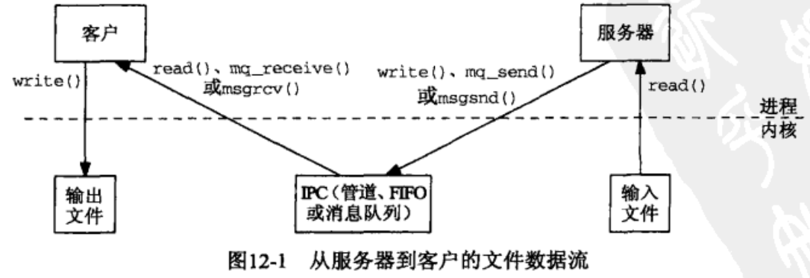

而共享内存的方式，只需让两个进程共享同一个内存区即可，将物理地址的内存区 映射到 共享它的进程的虚拟地址空间。进程只需访问它的虚拟地址空间共享区就能访问共享内存区的内容，无需通过内核。

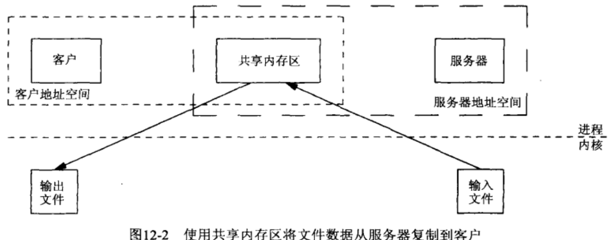

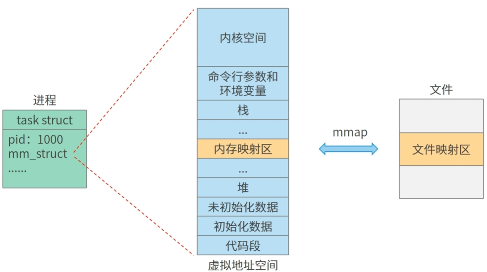


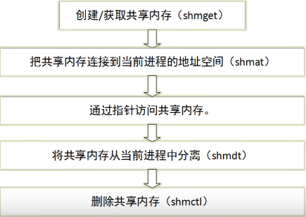

**实现原理**

共享内存实现方式和消息队列、信号量大同小异，它们都是继承同样的IPC对象。

具有相同IPC命名空间的进程能同时访问IPC命名空间相同的内存空间（file对象）。

> file对象用于实现内存映射，完成内存映射后，多个进程能通过共享内存进行通信。

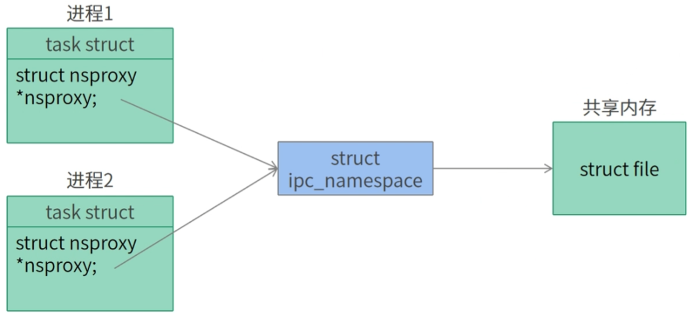

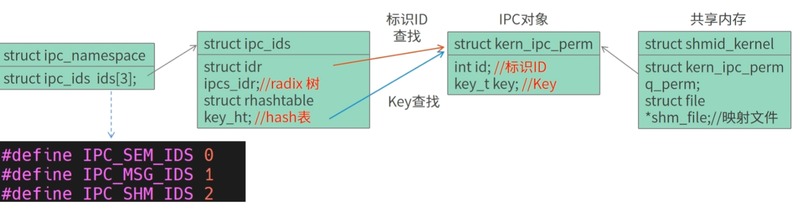

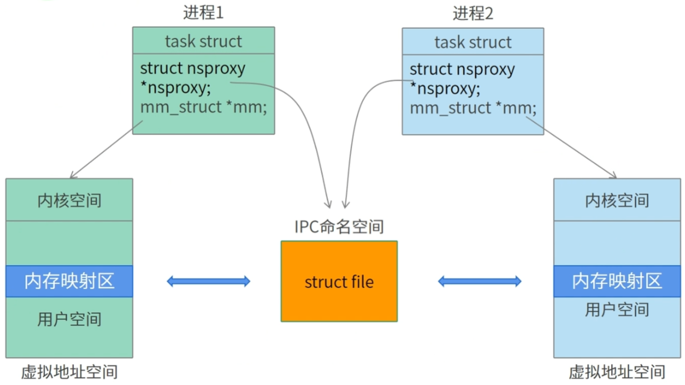

##### 1. System V共享内存

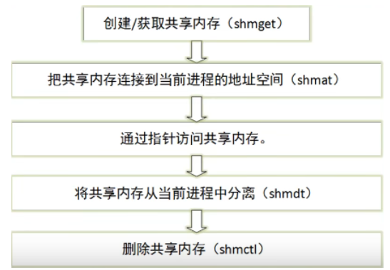

###### 1. shmget()

要使用共享内存，首先要创建一个共享内存区域。

```c
// 创建或打开一个共享内存。成功返回共享内存ID，失败返回-1   0666|IPC_CREAT（所有用户对它可读写，文件不存在，则创建它）
/* 参数 
	   key: 所创建或打开的共享内存的键值（16进制）
       size:共享内存的大小（字节） （创建时生效）
       shmflg:共享内存的访问权限（与文件权限一样）
            IPC_CREAT 
            IPC_EXCL 
   返回值：当函数调用成功时，返回值为共享内存的引用标识符；调用失败时，返回值为 -1。
*/
int shmget(key_t key,int size,int shmflg); 
```

###### 2. shmat()

当一个共享内存创建或打开后，某个进程如果要使用该共享内存，则必须将这个共享内存区域附加到它的地址空间中。

```c
// 把共享内存连接到进程的地址空间。成功返回映射到共享内存空间中的起始地址，失败返回NULL
/*
	 参数:
        shmid: 要附加的共享内存区域的引用标识符
        shmaddr:NULL 让系统自动选择一个合适的地址映射，将共享内存区域附加到第一块有效内存区域上，此时 flag 参数无效。
                不为NULL， shmflg设定为SHM_RND 选择离给定地址最近的能够映射的地址进行映射，否则传递地址为4k的整数倍
     返回值:
     	- 成功，返回指向共享内存区域的指针
     	- 失败，返回值为 -1。
*/
void *shmat(int shmid, const void *shmaddr,int shmflg); 
```

###### 3. shmdt()

当一个进程对共享内存区域的访问完成后，通过调用 shmdt 函数使共享内存区域与该进程的地址空间分离.（不删除共享内存本身）

```c
// 解除映射。返回值:成功返回0，失败返回-1 
/*
	参数:
	   shmaddr:映射的地址   
*/
int shmdt(const void *shmaddr); 
```

###### 4. shmctl()

```c
// 对共享内存进行操作，比如创建、删除、获取和修改共享内存段的属性。 
/*
	参数:
	   shmid: 共享内存的引用标识符
       cmd: 调用该函数希望执行的操作 
       		- SHM_LOCK：将共享内存区域上锁。
			- IPC_RMID：用于删除共享内存。
			- IPC_SET：按参数 buf 指向的结构中的值设置该共享内存对应的 shmid_ds 结构。
 			- IPC_STAT：用于取得该共享内存区域的 shmid_ds 结构，保存到 buf 指向的缓冲区。
			- SHM_UNLOCK：将上锁的共享内存区域释放。
       buf: 指向共享内存数据结构的指针，用于传递或接收共享内存的属性
    返回值: - 不同的cmd参数，返回值不同 ，
    	   - 失败返回-1，并设置errno
*/
int shmctl(int shmid, int cmd, struct shmid_ds *buf); 
```

```c
// 记录了一个共享内存的各种属性
struct shmid_ds {
       struct ipc_perm shm_perm;    /* 所有者和权限 */
       size_t          shm_segsz;   /* 以字节表示的共享内存区域的大小 */
       time_t          shm_atime;   /* 最近一次附加操作的时间 */
       time_t          shm_dtime;   /* 最近一次分离操作的时间 */
       time_t          shm_ctime;   /* 最近一次改变的时间 */
       pid_t           shm_cpid;    /* 创建该共享内存的进程 ID*/
       pid_t           shm_lpid;    /* 最后一次调用shmat(2)/shmdt(2)的进程 */
       shmatt_t        shm_nattch;  /* 当前使用该共享内存区域的进程数 */
       ...
};

struct ipc_perm {
       key_t          __key;    /* Key supplied to shmget(2) */
       uid_t          uid;      /* Effective UID of owner */
       gid_t          gid;      /* Effective GID of owner */
       uid_t          cuid;     /* Effective UID of creator */
       gid_t          cgid;     /* Effective GID of creator */
       unsigned short mode;     /* Permissions + SHM_DEST and
                                   SHM_LOCKED flags */
       unsigned short __seq;    /* Sequence number */
};
```

```
>> ipcs -m           # 查看系统的共享内存
>> ipcrm -m 共享内存id  # 手动删除
```


#### 10.1.5 消息队列

##### 两者区别

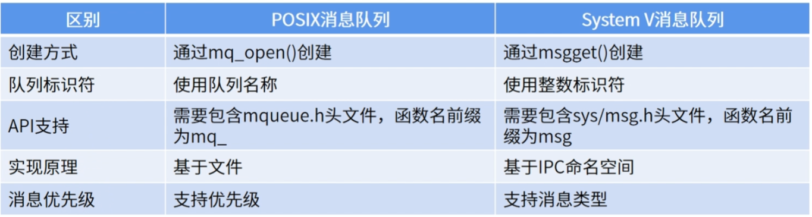


##### 2. Posix消息队列

Posix消息队列是一种基于文件的消息队列，操作Posix消息队列就像操作文件一样简单。


**实现原理：**

Posix消息队列是基于mqueue文件系统的消息队列，Posix消息队列其实是mqueue文件系统中一个inode节点。

> mqueue inode节点是基于红黑树存储数据的。

```
# 查看所有文件系统
cat /proc/filesystems
```

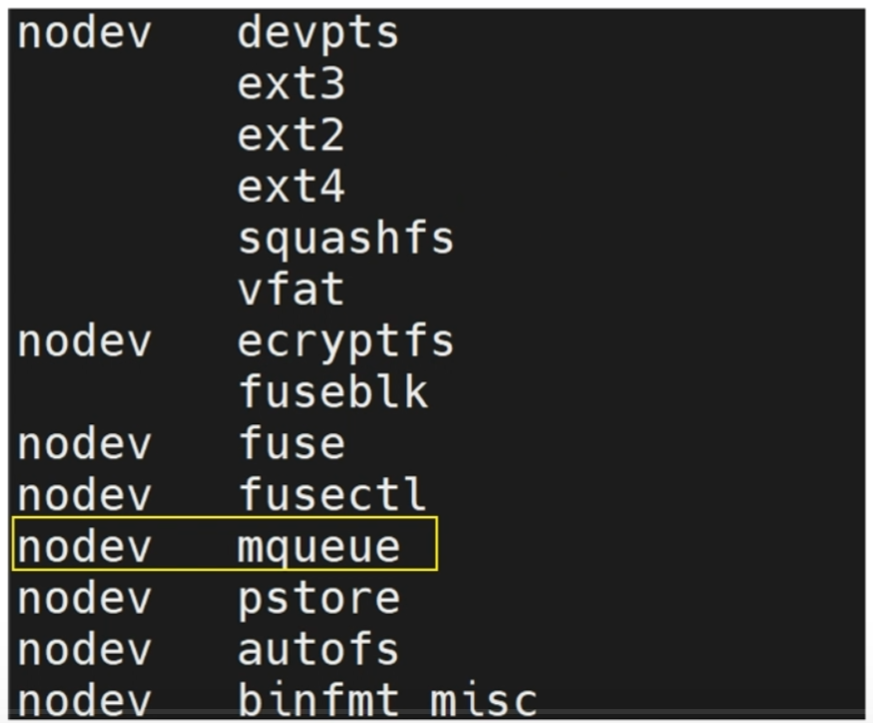

```
# 查看mqueue文件系统挂载点，挂载路径为/dev/mqueue
mount | grep "queue"
```


> 通过`mq_open函数`创建的消息队列文件都保存在`/dev/mqueue`目录下

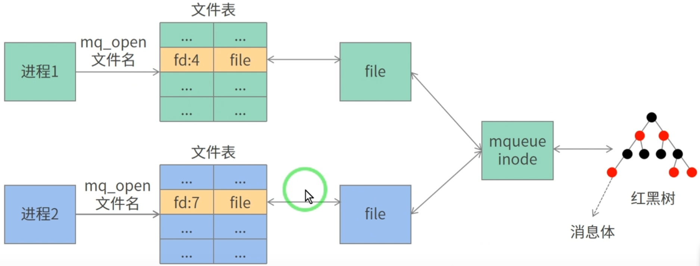


```c
mqd_t mq_open(const char *name, int oflag);
mqd_t mq_open(const char *name, int oflag, mode_t mode, struct mq_attr *attr);
```


```
// 消息队列属性
struct mq_attr {
       long mq_flags;       /* Flags (ignored for mq_open()) */
       long mq_maxmsg;      /* 消息队列最大消息个数 */
       long mq_msgsize;     /* 单个消息最大字节数 (bytes) */
       long mq_curmsgs;     /* 消息队列当前消息个数
                               (ignored for mq_open()) */
};
```

