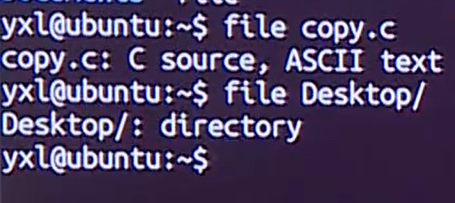
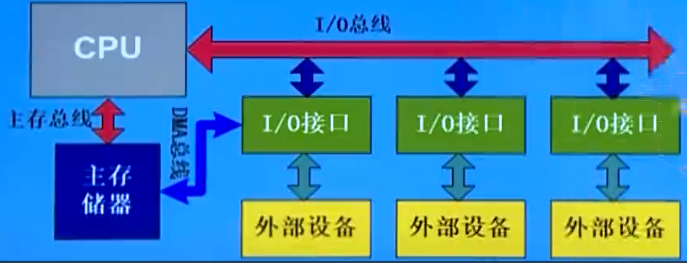
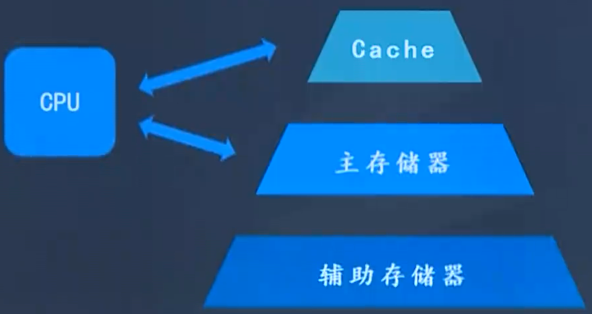
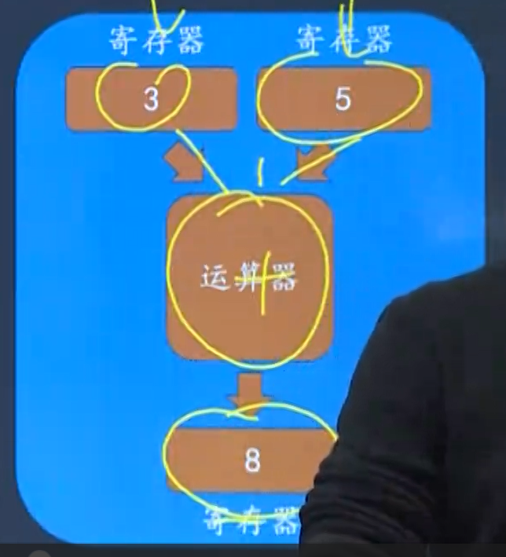

# 嵌入式Linux应用


## Shell 命令

shell：命令行解释器，负责用户与操作系统的交互。


**1. 关机or重启**

```cmd
# 立即关机
>> sudo shutdown -h now
# 定时1h后关机
>> sudp shutdown -h 60
# 立即重启
>> sudo shutdown -r now
>> sudo reboot now
```

**2. 查看历史输入命令**

```cmd
>> history
# 默认最多显示1000条 
>> echo $HISTSIZE
# 设置数量
>> HISTSIZE = 2000
```


### 1. shell中的特殊字符

#### 1. 通配符


#### 2. 管道

管道可以将一系列命令连接起来，如将第一个命令的输出作为第二个命令的输入。

```cmd
# 查看/usr/bin目录下的文件数
>> ls /usr/bin | wc -w
```


#### 3. 输入/输出重定向

输入/输出重定向是改变shell命令或程序**默认的标准输入/输出目标**，**重新定向**到**新目标**。

> linux中默认标准输入为键盘，标准输出定义为终端端口。
>


#### 4. 命令置换

将一个命令的输出作为另一个命令的参数。

```cmd
>> command1 `command2`
>> ls `pwd`
```


### 2. shell中基本的系统维护命令

#### 1. man

#### 2. passwd

修改用户的口令

```cmd
passwd username
```

#### 3. su

用于临时改变用户身份，具有其他用户的权限。

```cmd
# -c表示执行一个命令后就结束， -m表示仍保留环境变量不变
>> su [-c | -m -] username
# 普通用户切换为root用户
>> su 
```

#### 4. echo

用于在标准输出——显示器上显示一段文字，起到提示作用。

```cmd
# -n表示输出文字后不换行
>> echo [-n] information

>> echo "Hello world!"
```

#### 5. date

用于显示和设置系统日期和时间。

```cmd
>> date [-d|-s|-u] datestr
```

#### 6. clear

用于清除屏幕上的信息。ctrl+l

#### 7. df

查看磁盘空间的使用情况。


#### 8. du

列出目录和文件所使用的磁盘块数，每块占512个字节。


### 3. linux的用户管理

#### 1. 用户管理相关配置文件介绍

用户的属性：用户名、口令、用户ID（UID）、用户主目录（HOME）、用户shell

##### 1./etc/passwd文件

存放的是系统能识别的用户清单。用户登录时，系统查询这个文件，确定用户的UID并验证用户口令。

`登录名`、`经过加密的口令`、`UID`、`默认的GID`、个人信息、主目录、登录的shell

##### 2./etc/group文件

包含了UNIX组的名称和每个组中成员列表。

每一行代表一个组，包括4个字段。`组名`、`加密的口令`、`GID号`、`成员列表`


##### 3./etc/adduser.conf

添加用户的配置文件


#### 2. 用户管理命令介绍

##### 1. adduser

添加用户

```cmd
>> adduser <username> 
```

##### 2. passwd

修改用户口令

##### 3. usermod

修改用户属性


```cmd
>> usermod -d /home/newname -m -l newname oldname
```

##### 4. deluser

删除用户

```cmd
>> deluser username
# 同时再将用户的工作目录删除
>> deluser --remove-home username
```

##### 5. addgroup

添加用户组

```cmd
>> addgroup groupname
```


### 4. linux进程管理相关命令

#### 1. ps

查看进程的动态。

```cmd
>> ps [options]

>> ps -elf
>> ps -aux
```

**D：不可中断的静止**

**R：正在执行中**

**S：阻塞状态**

**T：暂停执行**

**Z：不存在但暂时无法消除**     **僵尸进程**

**<：高优先级的进程**

**N：低优先级的进程**

**L：有内存分页分配并锁在内存中**


#### 2.  top

实时监视进程的动态变化。

```
>> ls /proc
```


#### 3. kill

向指定进程发送一个信号signal。默认情况，发送信号15，杀死那些不捕捉或不忽略这个信号的进程。

```cmd
# signal是信号，PID是进程号
>> kill [-signal] PID

# 查看所有信号
>> kill -l
```


### 5. linux文件相关命令

> pwd ls cd touch cp mv rm cat head tail mkdir rmdir

#### 1.file



#### 2.ln

硬链接：linux会给每个文件分配物理编号，**inode**建立链接。 **硬链接不能跨越文件系统。**

软连接：也称为符号链接。利用**文件的路径名**建立链接，通常使用绝对路径而不是相对路径。

> 如果修改的是**硬链接的目标文件名**，链接则依然有效；若修改的是软链接的目标文件名，则链接将断开；
>
> 对一个已存在链接文件执行移动或删除操作，有可能导致链接的断开。假如删除目标文件后，重新创建一个同名文件，软链接将恢复，硬链接不恢复，因为inode已改变。

```cmd
# 创建硬链接
>> ln copy.c copy_link
# 创建软链接
>> ln -s copy.c copy_link
```

#### 3.文件压缩和归档

##### 1.gzip与gunzip

gzip是linux中最流行的压缩工具，具有较好的移植性。

> 与zip不同的是，它**只能压缩一个文件**，不能将多个文件压缩成一个文件。

```cmd
>> gzip [-l|-d|-num] filename
```


```cmd
# "-f"用于解压文件时，对覆盖同名文件不做提示
>> gunzip [-f] filename.gz
```


##### 2.bzip2

在性能上优于gzip，提供了最大限度的压缩比率。


##### 3.zip

常用于在linux和windows之间传输压缩文件。

可压缩多个文件。

```cmd
>> zip destFile.zip destFile
>> unzip destFile.zip
```


##### 4. tar

用于将若干文件或目录合并为一个文件，以便备份和压缩。

```cmd
>> tar [-t|-x|-u|-c|-v|-f|-j|-z] tarfile filelist
```


```cmd
# 将myExamples目录下的所有文件全部归档，打包到一个文件中myExamples.tar
>> tar -cf myExamples.tar myExamples
# 将myExamples目录下的所有文件全部归档，并使用bzip2压缩成一个文件myExamples.tar.bz
>> tar -cjf myExamples.tar.bz myExamples
# 将myExamples目录下的所有文件全部归档，并使用gzip压缩成一个文件myExamples.tar.bz
>> tar -zcf myExamples.tar.bz myExamples


# 查看归档文件中的详细内容
>> tar -tvf myExamples.tar.bz

# 释放归档文件
>> tar -xvf myExamples.tar
>> tar -xvjf myExamples.tar.bz
>> tar -xvzf myExamples.tar.bz
```


### 6. shell脚本编程

#### 1. shell编程

1. 建立shell文件

```cmd
>> vim test.sh

# test.sh文件内容
# !/bin/bash
ls
pwd
```

2. 赋予shell执行权限

```cmd
>> chmod 740 test.sh
```

3. 执行shell

```cmd
>> ./test.sh
# 或者
>> bash test.sh
```

#### 2. shell变量

shell允许用户建立变量来存储数据，但**不支持数据类型**（整型、字符、浮点型），将任何赋给变量的值都解释为字符串。  Variable=value;    **等号前后不加空格**

```shell
#!/bin/test.sh
COUNT=1
echo $COUNT

DATE=`date`
echo $DATE
```


**四种变量**

1. 用户自定义变量

   若变量定义完后不想使用了，可通过`unset`设置。

   ```shell
   #!/bin/val.sh
   COUNT=1
   echo $COUNT
   
   unset COUNT
   # 不会打印出来
   echo $COUNT
   ```

   

2. 位置变量即命令行参数

   

   ```shell
   #!/bin/loc.sh
   echo "0..........$0"
   echo "1..........$1"
   echo "2..........$2"
   echo "3..........$3"
   echo "4..........$4"
   echo "5..........$5"
   echo "6..........$6"
   echo "7..........$7"
   echo "8..........$8"
   echo "9..........$9"
   echo "10..........${10}"
   
   echo "#..........$#"
   echo "\$*..........$*"
   echo "\$@..........$@"
   
   ls
   echo "\$?..........$?"
   echo "\$$..........$$"
   
   # ./loc.sh是第一个参数 abc是第二个参数 ...
   >> ./loc.sh abc
   ```

   

3. 预定义变量

4. 环境变量

   **HOME：**/etc/passwd 文件中列出的用户主目录

   **IFS：**默认为空格、tab以及换行符

   **PATH：**shell搜索路径

   **PS1、PS2：**默认提示符（$）及换行提示符（>）

   **TERM：**终端类型，常用的有vt100、ansi、vt200、xterm等

   ```shell
   #!/bin/env.sh
   echo $HOME
   echo $PATH
   ```


### 7. shell语句

#### 1. 说明性语句

相当于注释

以#号开始到该行结束，不被解释执行。

```shell
#!/bin/sh  告诉os用哪种类型的shell来解释执行该程序
```


#### 2. 功能性语句

任意的shell命令、用户程序或其他shell程序。

##### 1. read var

从标准输入读取一行，并赋值给后面的变量

```shell
read var1 var2 var3
```

把读入行的第一个单词赋值给var1，第二个单词赋值给var2，。。。

```shell
#!/bin/bash

#echo "input year month day: "
read -p "input year month day: " year month day
echo $year-$month-$day
```


##### 2. expr命令

用于进行简单的整数运算。

```shell
#!/bin/bash

read -p "input two number: " val1 val2
num=`expr $val1 + $val2`
echo $num

num=`expr $val1 - $val2`
echo $num

# 这里需 加转义符
num=`expr $val1 \* $val2`
echo $num

num=`expr $val1 / $val2`
echo $num

num=`expr $val1 % $val2`
echo $num
```


#### 3. 结构性语句

条件测试语句（两路分支）、多路分支语句、循环语句、循环控制语句和后台执行语句等。

##### 测试语句

###### 字符串测试

```shell
#!/bin/bash
test "hello" = "hello"
echo $?

test "hello" != "helloworld"
echo $?

# 检测字符串长度是否为0
test -z "hello"
echo $?

# 检测字符串长度是否不为0
test -n "hello"
echo $?
```

###### 整数测试

```shell
#!/bin/bash
test 100 -eq 100
echo "100 -eq 100: " $?

test 100 -ne 120
echo "100 -ne 120: " $?

test 100 -gt 120
echo "100 -gt 120: " $?

test 100 -ge 120
echo "100 -ge 120: " $?

test 100 -lt 120
echo "100 -lt 120: " $?

test 100 -le 120
echo "100 -le 120: " $?
```

###### 文件测试


```shell
#!/bin/bash
test -d test.sh
echo $?
```


##### 1. 条件语句

```shell
if  表达式
then   
	命令表
fi

# 若表达式为真，则执行命令表中命令；否则，则执行fi后面的语句。
```

```shell
#!/bin/bash
if test -f $1
then
	echo "$1 is a file"
else 
	echo "$1 is not a file"
fi

>> ./if.sh if.sh
>> ./if.sh /home
```

```
#!/bin/bash

read -p "input value: " val
if test $val -eq 0
then
	echo "$val = 0"
elif test $val -gt 0
then
	echo "$val > 0"
else
	echo "$val < 0"
fi

>> ./if.sh 
>> 10 
```

##### 2. 多路分支语句

case...esac

> case语句只能检查字符串变量，各模式中可用文件名元字符，以右括号结束

```shell
case 字符串变量 in
	模式1）
		命令表1         # 命令表以单独的双分好结束，退出case语句
		;;
	模式2|模式3）        # 一次可以匹配多个模式，用“|”分开
		命令表2
		;;
	......
	模式n）             # 模式n常写为字符*，表示所有其他模式
		命令表n      
		;;             # 最后一个双分号行可省略
esac
```

案例：

```shell
#!/bin/bash

read val
if [ $val -lt 0] || [ $val -gt 100]
then
	echo "input error"
	exit 0
fi

num=`expr $val / 10`	

case $num in
	8|9|10)
		echo "A"
		;;
	6|7)
		echo "B"
		;;
	*)
		echo "C"
		;;
esac
```


## 第二章 GCC编译器的使用


### 2.1.1 常用的编译选项

| 常用选项 | 描述                                                         |
| :------: | ------------------------------------------------------------ |
|    -E    | 做预处理                                                     |
|    -c    | 只做预处理、编译、汇编                                       |
|    -o    | 指定输出文件，若没有-o选项，默认输出“a.out”                  |
|    -I    | 指定头文件目录                                               |
|    -L    | 指定链接时库文件目录                                         |
|    -l    | （小写L）指定链接哪一个库文件                                |
|    -M    | 生成文件关联信息（引用的头文件）。包含目标文件所依赖的所有源代码，如：gcc -M hello.c |
|   -MF    | 与-M一起使用，将所有依赖写入文件 如：gcc -M -MF hello.d hello.c |
|   -MD    | 可与-MF 一块使用，在编译hello.c文件的同时，将文件所需依赖写入文件hello.d。如 gcc -c -o hello.o hello.c -MD -MF hello.d |
|    -g    | 对源代码进行调试                                             |
|    -O    | 对程序进行优化编译、链接。采用这个选项，整个源代码会在编译、链接过程中进行优化处理，这样产生的可执行文件的执行效率可以提高。 |
|   -O2    | 比-O更好的优化编译、链接。                                   |
|    -D    | 选择执行不同的代码段（宏定义），如-DOS_LINUX将执行 #define OS_LINUX 代码段1 中的代码 |


| -Idir   | 将头文件的搜索路径扩大，包含dir目录                          |
| ------- | ------------------------------------------------------------ |
| -Ldir   | 将链接时使用的链接库搜索路径扩大，包含dir目录。gcc会优先使用共享程序库 |
| -static | 仅使用该目录中静态程序库进行链接。                           |
| -On     | 优化程序，程序优化后执行速度会更快，程序占用空间会更小       |
| -Wall   | 打开所有gcc能提供的警告信息。                                |
|         |                                                              |


如：

```cmd
>> gcc -E main.c -o main.i # 查看预处理结果，比如头文件是哪个
>> gcc -E -dM main.c > 1.txt   # 把所有的宏展开，存在1.txt中
>> gcc -Wp,-MD,abc.dep -c -o main.o main.c # 生成依赖文件abc.dep，后面makefile中会使用
>> echo 'main(){}' | gcc -E -v - # 它会列出头文件目录、库目录（LIBRARY_PATH）
```


### 2.1.2 编译多个文件

第一种：一起编译并链接

```cmd
>> gcc -o test main.c sub.c
```

第二种：分开编译、连接

```cmd
# 分别编译
>> gcc -c -o main.o main.c
>> gcc -c -o sub.o sub.c
# 链接
>> gcc -o test main.o sub.o
```

### 2.1.3 制作、使用动态/静态库

#### 2.1.3.1 动态库（libxxx.so）

- 是程序运行时加载的库，当动态链接库正确安装后，所有的程序都可以使用动态库来运行程序。

- 是**目标文件的集合**
- 库中函数和变量的地址是相对地址，不是绝对地址，其**真实地址**是**在调用动态库的程序加载时形成**。

别名：lib库名.so      -soname,libstr.so指定别名

真名：在别名基础上加上一个小版本号、发布版本等

链接名：程序链接时使用的库名字


**Step 1：**制作、编译

```cmd
>> gcc -c -o main.o main.c
>> gcc -c -o sub.o sub.c
# 使用多个.o制作动态库 
# gcc -shared -Wl,-soname,libstr.so -o libstr,o.1 string.c
>> gcc -shared -o libsub.so sub.o sub2.o sub3.o

# 使用
>> gcc -o test main.o -lsub -L /libsub.so/所在目录/
```

注意：一般情况会将生成的动态库复制到**系统默认的动态链接库搜索路径**下，如/lib、/usr/lib、/usr/local/lib


**Step 2：**运行

①：把libsub.o放到Ubuntu的/lib目录中，就可运行test程序

②：若放在其他位置，如目录/a下，需执行：

```cmd
>> export LD_LIBRARY_PATH=$LD_LIBRARY_PATH:/a
>> ./test
```


#### 2.1.3.2 静态库（libxxx.a）

优点：

1. 代码装载速度快，执行速度略比[动态链接库](https://so.csdn.net/so/search?q=动态链接库&spm=1001.2101.3001.7020)快；
2. 只需保证在开发者的计算机中有正确的.LIB文件，在以二进制形式发布程序时不需考虑在用户的计算机上.LIB文件是否存在及版本问题，可避免DLL地狱等问题。 

缺点：

1.  使用静态链接生成的可执行文件体积较大，包含相同的公共代码，造成浪费；
2. 如果静态库中有全局变量，那么在几个模块中使用，将会导致全局变量有不同的值。
3. 静态库编译时，不会进行链接检查，在生成静态库阶段检查不出来。
4. 几个模块，引用同一静态库，如果有一模块没有编译到，会引起巨大的差异导致问题。


**生成静态库：**

```cmd
>> gcc -c -o main.o main.c
>> gcc -c -o sub.o sub.c
# 生成静态库
# -r：创建库，并把目标文件插到指定库中
>> ar -rcs libsub.a sub.o sub2.o sub3.o
```

**使用静态库：**

```c
# 若.a不在当前目录下，需指定它的绝对或相对路径
>> gcc -o test main.o libsub.a
    
# 2. 使用命令”-l库名“，会在系统默认路径下找sub函数库，并把它链接到要生成的目标程序上。
# 	 可自定义指定库函数的路径。(与当前)
>> gcc -o test main.c -L./ -lsub
```

> 使用-l选项时，要将-o选项的目的名称放到链接库前，否则gcc会认为-l是生成目标。

**运行：不要把静态库libsub.a放到板子上。**

注意：执行`arm-buildroot-linux=gnueabihf-gcc -c -o sub.o sub.c`**交叉编译**需要在后面加上**`-fPIC`**参数。


### 2.1.4 GDB调试

```cmd
>> gcc main,c -o test -g
>> gdb test
```

|      命令      |          说明          |
| :------------: | :--------------------: |
|   l [number]   | 查看文件代码，默认10行 |
|       b        |        设置断点        |
|     info b     |      查看断点情况      |
|       n        |     运行下一行代码     |
|       s        |   步入函数体内部执行   |
|       c        |      恢复程序运行      |
|      p n       |       查看变量值       |
|       r        |        运行代码        |
| help [command] |        帮助文档        |


### 2.1.5 条件编译

​	 编译器会根据条件的真假决定是否编译相关的代码。

1. 根据宏是否定义，其语法如下：

   ```c
   #ifdef 宏名
   ...
   #else
   ...
   #endif
   ```

2. 根据宏的值判断

   ```c
   #define _DEBUG_ 1
   
   int main(){
   #if _DEBUG_
   	printf("hello\n");
   #else
   	printf("welcome\n");
   #endif
   	return 0;
   }
   ```

   


## 第三章 Makefile的使用

在Linux中，常用make命令编译程序；make命令的执行依赖Makefile文件：

利用`make`编译程序，`make clean`清除编译出来的结果。

```makefile
# MakeFile
hello: hello.c
	gcc -o hello hello.c
	
clean:
	rm -f hello
```

> make命令根据文件更新时间戳来决定哪些文件需要重新编译，避免重复编译已经编译过的、没有发生变化的程序，提高编译速率。


### 3.1.1 Makefile规则

**make [目标]**，若无目标，默认使用第一个目标的命令

#### 3.1.1.1 规则

使用`make`编译程序，当①依赖文件更新时间比目标文件大，②目标文件还未生成，会重新生成目标文件

注意：当执行`make clean`命令时，若当前目录下存在clean文件时，由于clean的依赖文件不存在，且目标clean文件已存在，所以执行该命令时会出现异常，需要指定**clean目标**为**假想目标：.PHONY: clean**

```Makefile
目标文件(target)...: 依赖文件1（prerequiries）...
<Tab> 命令（command）
```

```makefile
test: a.o b.o
	gcc -o test a.o b.o

a.o: a.c
	gcc -o a.o a.c

b.o: b.c
	gcc -o b.o b.c
	
clean:
	rm -r *.o test
	
.PHONY: clean
```

升级版：

```makefile
objs = a.o b.o

dep_files := $(patsubst %, .%.d, $(objs))
dep_files = $(wildcard $(dep_files))

# 编译参数 -Werror:将所有警告都当成错误 -Iinclude:指定头文件目录为"include"目录 “a.h” => <a.h>
CFLAGS = -Werror -Iinclude

test: $(objs)
	gcc -o $@ $^ 
		# @echo dep_files = ${dep_files}
# 若dep_files 不为空，则将其包含进来
ifneq ($(dep_files),)  
include $(dep_files)  
endif

%.o: %.c
	gcc $(CFLAGS) -c -o $@ $< -MD -MF .$@.d  # .$@.d第一个'.'代表是隐藏文件 
	
clean:
	rm -r *.o test
	
# 删除依赖
distclean:
	rm $(dep_files) 
	
.PHONY: clean
```

#### 3.1.1.2 通配符

| 变量 | 说明                                          |
| :--: | --------------------------------------------- |
|  $^  | 表示所有依赖文件名（不重复）       针对依赖项 |
|  $@  | 表示目标文件名                                |
|  $<  | 表示第一个依赖文件名                          |
|  $*  | 表示目标文件名，不包含目标文件的扩展名        |
|  $+  | 表示所有依赖文件名（可能包含重复）            |
|  $?  | 依赖项中，所有目标文件时间戳晚的依赖文件      |

#### 3.1.1.3 搜索路径 VPATH

指定需要搜索的路径，make会自动找到指定文件的目录并添加到文件上。

```makefile
VPATH = path1:path2:...
```

【示例】：

```makefile
# add/add_int.c sub/sub_int.c
VPATH = add:sub
add_int.o:%.o:%.c

# make的编译结果（会加上add目录）
# add_int.o:add_int.o:add/add_int.c
# 		cc -c -o add_int.o add/add_int.c
```

注意：该方法会将生成的目标文件放到当前目录下，而不是“add/”下。‘

【解决方案】

```makefile
OBJSDIR = objs
OBJS = add_int.o add_float.o sub_int.o sub_float.o main,o
TARGET = cacu
CFLAGS = -Iadd -Isub -O2
VPATH = add:sub:.
RM = rm -r

$(TARGET):$(OBJSDIR) $(OBJS) # 要执行TARGET命令，需要先看看OBJSDIR和OBJS依赖项是否存在
	$(CC) -o $(TARGET) $(OBJSDIR)/*.o $(CFLAGS)
	
$(OBJS):%.o:%.c
	$(CC) -c $(CFLAGS) $< -o $(OBJSDIR)/$@

$(OBJSDIR):
	mkdir -p ./$@
	
clean:
	-$(RM) $(TARGET)
	-$(RM) $(OBJSDIR)/*.o
```


#### 3.1.1.4 递归make

常用于多人协作开发，每个人负责一个模块。

**1. 递归调用的方式**

Make命令可以递归地调用子目录中的Makefile。

比如，当前目录下有一个Makefile，而目录add和sub及main.c由不同的人进行维护。

编译add目录中的文件（即先进入add目录，然后执行make命令）

```makefile
add:
	cd add && $(MAKE)
	
# 等价于
add:
	$(MAKE) -C add
```

> 调用”$(MAKE) -C“ 的Makefile叫总控Makefile。
>
> 可通过export将总控Makefile文件的变量传递给子目录中的Makefile

**总控Makefile**

```makefile
TARGET = cacu

export CC = gcc
export OBJSDIR = ${shell pwd}/objs
export CFLAGS = -O2
export RM = rm -r

$(TARGET):$(OBJSDIR) main.o
	$(MAKE) -C add   # 在add目录中递归调用make
	$(MAKE) -C sub
	$(CC) -o $(TARGET) $(OBJSDIR)/*.o
	
main.o:%.o:%.c
	$(cc) -c $< -o $(OBJSDIR)/$@ $(CFLAGS) -Iadd -Isub

$(OBJSDIR):
	mkdir -p $@

clean:
	-$(RM) $(OBJSDIR)/*.o $(TARGET) 
```


**子目录add的Makefile文件**

```makefile
OBJS = add_int,o add_float.o
all:$(OBJS)

# CC、OBJSDIR、CFLAGS在总控Makefile中声明
$(OBJS):%.o:%.c
	$(CC) -c $< -o $(OBJSDIR)/$@ $(CFLAGS)

clean:
	-$(RM) $(OBJS)
```

**子目录sub的Makefile文件**

```makefile
OBJS = sub_int,o sub_float.o
all:$(OBJS)

# CC、OBJSDIR、CFLAGS在总控Makefile中声明
$(OBJS):%.o:%.c
	$(CC) -c $< -o $(OBJSDIR)/$@ $(CFLAGS)

clean:
	-$(RM) $(OBJS)
```


#### 3.1.1.5 即刻变量、延时变量

1.即时变量（简单变量）：变量定义时确定值

2.延时变量：变量使用时才确定值

> :=  # 即时变量
>
> =   # 延时变量
>
> ?= # 延时变量，若前面该变量已经定义了，则忽略该语句（只有在变量还未定义时才起效）
>
> += # 它是延时变量或即时变量取决于前面的定义。若变量在前面定义为即时变量，即为即时变量。

```makefile
A := 10   # A变量的值在定义时即可确定
B = 12    # B的值使用时才确定   

all:
	@echo $(A) # 输出变量A的值 10   
	@echo $(B) # 输出变量B的值 12
```

```makefile
A := $(C)   # A变量的值在定义时即可确定
B = $(C)    # B的值使用时才确定   

D = 100 
D ?= 120    # 忽略D=100这句定义，该语句才起效   也可通过 make D = 130 设置变量的值
all:
	@echo $(A) # 输出即刻变量A的值 空值  在定义A时，C还未被赋值
	@echo $(B) # 输出延时变量B的值 123
	@echo $(D) # 输出延时变量D的值 100
C = 123
```

#### 3.1.1.6 变量的导出（export）

在编译程序时，会使用`make -C dir`切换到其他目录，执行其他目录中的Makefile。

若想要让某个变量的值在所有目录都可见，要把它`export`出来。

比如：

```makefile
CC = $(CROSS_COMPILE)gcc
export CC
```

CC变量表示编译器在整个过程的是一样的。定义完后需要导出


#### 3.1.1.7 使用shell命令

```makefile
TOPDIR := $(shell pwd)
```


### 3.1.2 Makefile函数

函数调用格式：

> $(function arguments)  
>
> ​	-- function 为函数名
>
> ​	-- arguments 为函数参数，多个参数之间用逗号隔开


#### 3.1.2.1 字符串替换和分析函数

##### $(subst from,to,text)

**部分匹配**

将text中`from`文本替换为`to`文本。

```makefile
str := feet on the street
str2 := $(subst ee,EE,$(str))   
all:
	@echo s = $(str2)  # 输出 fEEt on the strEEt
```


##### $(patsubst pattern, replacement, text)

**模糊匹配**

寻找`text`中符合`pattern`的字，并用`replacement`替换。

```makefile
$(patsubst %.c, %.o, a.c, b.c, c.h)   # 输出 a.o b.o
```


##### $(filter pattern..., text)

返回在`text`中匹配格式`pattern`的字，并去除不符合格式的`pattern`的字。

```makefile
$(filter %.c %.s, a.c b.s c.h)  # 输出 a.c b.s
```

##### $(filter-out pattern..., text)

返回在`text`中不匹配格式`pattern`的字，并去除符合格式的`pattern`的字。

```makefile
$(filter-out %.c %.s, a.c b.s c.h)  # 输出 c.h
```


##### $find(findstring find, in)

在字符串中`in`搜寻`find`，如果找到则返回`find`，否则返回空字符串

```makefile
$(findstring a, a b c)  # 返回 a
$(findstring d, a b c)  # 返回 空字符串
```


##### $(sort list)

将列表`list`中的字按字母排序，并去除掉重复的字。

```makefile
$(sort foo bar lose) # 输出 bar foo lose
```


#### 3.1.2.2 文件名函数

##### $(wildcard pattern)

返回和pattern格式匹配的文件名，且用“，”隔开

比如当前目录下有文件：1.c、2.c、1.h、2.h

```makefile
file := $(wildcard *.c)
all:
	@echo files = $(file)
```

则输出 `1.c`、`2.c`


##### $(dir names...)

获取`names`中每个文件名的路径部分。包括从文件名的首字符到最后一个斜杠（含斜杠）之前的一切字符。

```makefile
$(dir src/foo.c hacks) # 输出 src/ ./
```

##### $(nordir names...)

获取`names`除去路径部分的真正文件名

```makefile
$(dir src/foo.c hacks) # 输出 foo.c hacks
```


##### $(suffix name...)

获取`names`中每一个文件名的后缀

```makefile
$(suffix a.c b.c c.o hack)  # 输出 .c .c .o 
```

##### $(basename name...)

获取`names`中每一个文件名除后缀外的一切字符。

```makefile
$(suffix a.c b.c src/test hack)  # 输出 src/test hack
```


#### 3.1.2.3 其他函数

##### $(foreach var, list, text)

```makefile
dirs := a b c d
files := $(foreach dir, dirs, $(wildcard $(dir)/*))

all:
	@echo files = $(files)
```


### 3.1.3 Makefile解析

通常我们使用`make`命令来编译程序，它会去当前目录下查找`Makefile`文件，并根据它的指示去执行操作，生成第一个目标。

也可通过`-f`指定文件（不在使用Makefile文件），比如：

```makefile
make -f Makefile.build
```

也可通过`-C`选项指定目录，切换到其他目录中

```makefile
make -C a/ -f Makefile.build
```

也可指定目标

```makefile
make -C a/ -f Makefile.build other_target
```


```makefile
CROSS_COMPILE =   # 不同编译器。它的前缀可能不同 在开发板上进行编译 需要设置为 arm-linux-
AS = $(CROSS_COMPILE) as
LD = $(CROSS_COMPILE) ld
CC = $(CROSS_COMPILE) gcc
CPP = $(CC) -E
AR = $(CROSS_COMPILE) ar
NM = $(CROSS_COMPILE) nm

STRIP = $(CROSS_COMPILE) strip
OBJCOPY = $(CROSS_COMPILE) objcopy
OBJDUMP = $(CROSS_COMPILE) objdump

export AS LD CC CPP AR NM
export STRIP OBJCOPY OBJDUMP

CFLAGS := -Wall -02 -g
CFLAGS += -I $(shell pwd)/include

LDFLAGS :=

export CFLAGS LDFLAGS

TOPDIR := $(shell pwd)
export TOPDIR

TARGET := test

obj-y += main.o
obj-y += sub.o
obj-y += a/

all: start_recursive_build $(TARGET)
	@echo $(TARGET) has been built!

start_recursive_build:
	make -C ./ -f $(TOPDIR)/Makefile.build
```

**Makefile.buid文件内容：**

```makefile
# 设置进入子目录编译
$(subdir-y):
	make -C $@ -f $(TOPDIR)/Makefile.build
	
# 编译当前目录中的文件
%.o: %.c
	$(CC) $(CFLAGS) $(EXTRA_CFLAGS) $(CFLAGS_$@) -Wp,-MD,$(dep_file) -c -o $@ $<
	
# 当前目录下.o和子目录下built-in.o要打包起来
built-in.o: $(cur_objs) $(subdir_objs)
	$(LD) -r -o $@ $^

# 顶层Makefile中把顶层目录的built-in.o链接成APP
$(TARGET): built-in.o
	$(CC) $(LDFLAGS) -o $(TARGET) built-in.o
```


## Vim文本编辑器

有普通模式（命令模式）、插入模式（编辑模式）。

练习工具：vimtutor

### 1. 编辑文本

#### 1. 移动光标（hjkl）

（左）、j（下）、k（上）、l（右）

| 命令 | 说明                        |
| ---- | --------------------------- |
| h    | 左                          |
| j    | 下                          |
| k    | 上                          |
| l    | 右                          |
| nw   | 移动光标向后到n个单词（头） |
| ne   | 移动光标向后到n个单词（尾） |
| 0    | 移动光标到当前行首          |
|      |                             |


#### 2. 删除（x、dd、D、dw）

|  命令   | 说明                                                         |
| :-----: | :----------------------------------------------------------- |
|    x    | 删除当前光标指向的**字符**                                   |
|    X    | 删除当前光标指向的前一个**字符**                             |
|   dd    | 删除一行                                                     |
|   ndd   | 删除n行                                                      |
| D（d$） | 删除当前光标到行尾的所有字符                                 |
|   dw    | 删除以当前光标开始后的所有字符，直到遇到下一个**单词**（dnw 删多个）截止 |
|   de    | 删除以当前光标开始后的所有字符，直到遇到下一个**单词**（dnw 删多个）截止（不删除下一个单词前的空格） |
|    u    | 进行撤销操作                                                 |
| ctrl+r  | 取消一个命令，如执行了u操作，可以对其命令进行取消。          |


#### 3. 复制黏贴（y、p）

y：复制命令，将指定的字符串复制到内存中。yw命令（yank words）**用于复制单词（不是字符）****，可以指定复制数量。

> y2w: 复制两个单词到内存中，用p命令执行黏贴
>
> #include <stdio.h>  
>
> => ##

p：黏贴命令，将**内存中的字符**复制到当前光标的后面。

> 比如：将某一行复制到某个地方，先用dd删除该行，再用u进行撤销，此时内存中是dd命令删除的字符串。

#### 4. 查找字符串（/xxx）

查找当前文件的字符串"return"

> :/return

n：跳到下一个匹配的目标

N：跳到上一个匹配的目标

#### 5. 跳到某一行（G）

> :n  让光标跳到某一行开头(n为行数)
>
> 或 nG

#### 6. 跳转到行尾编辑追加

按A

#### 7. 格式设置

##### 设置下一行的缩进

> :set cindent shiftwidth=4 

##### 设置tab空格数量

默认移动距离是8个空格

> :set tabstop=n

##### 设置行号

> :set number


## Linux文件IO

### 文件基础

文件：一组相关数据的有序集合。

文件类型：

```
常规文件    r
目录文件    d
字符设备文件 c
块设备文件  b
管道文件   p
套接字文件 s
符号链接文件 l
```

### 文件的打开和关闭

#### 1. fopen()

```c
FILE *fopen(const char *path, const char *mode);
```

```c
#include <stdio.h>
#include <error.h>

int main(){
    int fc;
	FILE *fp = fopen("1.txt","r");
	if(fp == NULL){
		perror("open file error: ");
		exit(0);
	}else{
		printf("open file success!\n"); # stdout为行缓冲，遇到\n就刷新缓冲
	}
    fc = fclose(fp);
    if(fc == 0){
        printf("close file success!");
    }else{
        perror("close file error: ");
        exit(0);
    }
}
```


#### 2. fclose()

```c
# 成功返回0，失败返回EOF(-1)，并设置errno
# 参数不能为NULL，否则会出现段错误。
int fclose(FILE *stream);

# 流关闭时自动刷新缓冲区中的数据并释放缓冲区
```


#### 3. 处理错误信息

##### perror()

```c
#include <error.h>
extern int errno;
void perror(const char *s);
char *strerror(int errno);
// errno 存放错误号，由系统生成
// perror 先输出字符串s，再输出错误号对应的错误信息
// strerror 根据错误号返回对应的错误信息
```


## ARM体系结构与接口技术

### Day01 计算机硬件

在计算机中数据的存储、运算和传输都是以高低电平的方式。

数字电路中用高、低电平来表示逻辑1和0。


#### 总线

总线是计算机中**各个部件之间传递信息的公共通信干线**，在物理上就是一束导线。

按类型可分为`数据总线`、`地址总线`、`控制总线`。

##### DMA总线

DMA（Direct Memory Access）即直接存储器访问，使用DMA总线可以不通过CPU**直接在存储器之间进行数据传递**。




#### 多级存储结构与地址空间

##### 1. 三级存储结构



使用三级存储结构是为了兼顾速度、容量、价格。

###### Cache

速度最快、价格最贵、容量最小、断电数据丢失、CPU可直接访问

存储当前正在执行的程序中的活跃部分，以便快速地向CPU提供指令和数据。

###### 主存储器

速度、价格、容量介于Cache与辅存之间、断电数据丢失、cpu可直接访问。

存储当前正在执行的程序和数据。

###### 辅助存储器

速度最慢、价格最低、容量最大、断电数据不丢失、cpu不可直接访问。

存储暂时不运行的程序和数据，需要时再传到主存。


##### 2. 地址空间

一个CPU能够访问（读写）的存储空间是有限的，我们称这个空间为它的地址空间（寻址空间），一般来说，N位地址总线的CPU的地址空间是2^N。


##### 3. CPU工作原理概述


###### 指令的执行过程

一条指令的执行分为三个阶段：

1. 取址

   CPU将PC寄存器中的地址发给内存，内存将其地址存储的指令返回到CPU中的指令寄存器（IR）。

2. 译码

   译码器对IR中的指令进行识别，将指令（机器码）解析成具体的运算。

3. 执行

   控制器控制运算器中对应的运算单元进行运算，运算结果写入寄存器

每执行一条指令后PC的值会自动增加，指向下一条指令。


### Day02 ARM处理器概述

#### RISC处理器

只保留常用的简单指令，硬件结构简单，复杂操作一般通过简单指令的组合实现。一般指令长度固定，且多为单周期指令。

优势：功耗低、体积小、价格低，在嵌入式移动终端领域应用极为广泛。

#### CISC处理器

不仅包含常用指令，还包含了很多不常用的特殊指令，硬件结构复杂，指令条数较多。一般指令长度和周期都不固定。

优势：性能上有优势，多用于PC及服务器等领域。


#### 指令集

##### 指令

指令：能够指示CPU执行某种运算（加减乘除）的命令。

指令在内存中以**机器码（二进制）**的方式存在。

每条指令都对应一条汇编。

**程序是指令的有序集合。**


##### 指令集

指令集：CPU能识别的指令集合。

不同架构的CPU指令集不同

指令集是CPU对开发者提供的结构。


##### ARM指令集

大多数ARM处理器都支持两种指令集：

- ARM指令集

  所有指令（机器码）都占用**32bit存储空间**。

  代码灵活度高、简化了解码复杂度。

  执行ARM指令集时PC值**每次自增4**

  

- Thumb指令集

  所有指令（机器码）都占用**16bit存储空间**。

  代码密度高、节省存储空间。

  执行Thumb指令集时PC值**每次自增2**


#### 编译原理


> 汇编就是用字符来代替机器码，比如ADD代替0101机器码。
>
> X86和ARM两种不同架构的指令和汇编符号是不可移植的。

##### 机器码

机器码（二进制）是CPU能直接识别的语言，不同的机器码代表不同的运算指令。

CPU能识别哪些机器码是由CPU的硬件设计所决定的，不同的CPU机器码不同，所以机器码不可移植

##### 汇编语言

汇编语言是机器码的符号化，即汇编就是用一个符号代替一条机器码，所以不同的处理器汇编也不一样，即汇编语言也不可移植

##### 高级语言

C语言在编译时，可根据不同的编译器将C源码编译成不同架构处理器的汇编，所以C语言可移植


### Day03 ARM存储模型

#### ARM数据类型

ARM采用**32位架构**，基本数据类型有三种：

- Byte            8bits
- Halfword   16bits
- Word          32bits


#### **数据存储**

Word型数据在内存的起始地址必须是4的整数倍

Halfword型数据在内存的起始地址必须是2的整数倍

> 即数据本身是多少位在内存存储时就应该多少位补齐


##### 字节序

- 大端对齐

   低地址存放高位，高地址存放低位。

  a = 0x12345678

- 小端对齐

  低地址存放低位，高地址存放高位。

  a = 0x12345678

> ARM一般使用小端对齐


#### ARM指令存储

- CPU处于ARM状态时

  所有指令在内存的起始地址必须是4的整数倍，PC值由其[31:2]位决定，[1:0]位未定义。

```
4(2):100
8(2):1000
12(2):1100
// 最低2位为0
// 指令寄存器PC中存放的是内存中指令的地址，所以PC最低2位一定为0。不然就不是4的整数倍了


// 假如PC=7，CPU内部会强制将111转为100（将最低2位置为0）
```


- CPU处于Thumb状态时

  所有指令在内存的起始地址必须是2的整数倍，PC值由其[31:1]决定，[0]位未定义。

> 即指令本身是多少位在内存存储时就应该是多少位


#### ARM工作模式（8种）

> User为非特权模式（权限较低），其余模式均为特权模式
>
> FIQ、IRQ、SVC、Abort、Undef属于异常模式，即当处理器遇到异常后，会进入对应模式

- User（用户模式）：非特权模式，一般在执行上层的应用程序时，ARM处于的工作模式
- **FIQ：**当**一个高优先级中断**产生后，ARM将进入这种模式
- **IRQ：**当**一个低优先级中断**产生后，ARM将进入这种模式
- **SVC：**当**复位或执行软中断指令**后，ARM将进入这种模式
- **Abort：**当产生存取异常时，ARM将进入这种模式
- **Undef：**当执行未定义的指令时，ARM将进入这种模式
- System：使用和User模式相同寄存器集的特权模式
- Monitor：为了安全而扩展出的用于执行安全监控代码的模式

> 不同模式拥有不同权限。
>
> 不同模式执行不同代码。
>
> 不同模式完成不同功能。


#### ARM寄存器组织结构

##### 寄存器

寄存器是CPU内存的存储器，没有地址。

用于**暂时存放参与运算的数据和运算结果**。

分为：通用寄存器、专用寄存器、控制寄存器



##### ARM寄存器


##### **专用寄存器**

- R15（PC，Program Counter）

  程序计数器，用于**存储当前取址指令的地址**。

- R14（LR，Link Register）

   链接寄存器，两种 用途

  1. 执行跳转指令（BL/BLX）时，**LR会自动保存跳转下一条指令的地址**。程序需要返回时将LR的值复制到PC即可实现。

  

  2. 产生异常时，对应异常模式下的**LR会自动保存被异常打断的指令的下一条指令地址**，异常处理结束后将LR的值复制到PC可实现程序返回

- R13（SP，Stack Pointer）   

  栈指针，用于存储当前模式下的栈顶指针

- CPSR寄存器

当前程序状态寄存器（Current Program Status Register）

分四个域：

- [31:24]：用F表示条件域
- [23:16]：用S表示状态域
- [15:8]：用X表示预留域
- [8:0]：用C表示控制域


### Day04 ARM的异常处理

#### 异常

CPU在正常执行程序的过程中可能会遇到一些不正常的事件发生，这时CPU就要将当前的程序暂停下来。转而去处理这个异常的事件，异常事件处理完成之后再返回到被异常打断的点继续执行程序。


#### 异常处理机制

不同的CPU对异常处理流程大体相似，但不同的CPU在具体实现的机制上有所不同；

如：CPU遇到哪些事件认为是异常事件、遇到异常事件之后CPU有哪些动作、CPU是如何跳转到异常处理程序去处理异常、处理完异常之后又如何返回到被打断的程序继续执行等。 这些细节的实现称为CPU的异常处理机制。

#### ARM异常源

导致异常产生的事件称为异常源。

| 异常源                |         说明         |
| --------------------- | :------------------: |
| FIQ                   | 快速中断请求引脚有效 |
| IRQ                   | 外部中断请求引脚有效 |
| Reset                 |     复位电平有效     |
| Software Interrupt    |     执行swi指令      |
| Data Abort            |       数据终止       |
| Prefetch Abort        |     指令预取终止     |
| Undefined Instruction |  遇到不能处理的指令  |

> 前两个由外部硬件产生。
>


##### 异常优先级

多个异常同时产生时的服务顺序


#### ARM异常模式

在ARM的基本工作模式中有5个属于异常模式，即ARM遇到异常后会切换成**对应的异常模式**。


#### ARM异常响应

ARM产生异常后的动作（自动完成）

1. 拷贝CPSR（其中保存的是CPU当前的模式等）中的内容到对应异常模式下的SPSR_<mode>
2. 修改CPSR的值
   1. 修改中断禁止位**禁止相应的中断**（防止被其他异常中断所打断）
   2. 修改模式位进行相应的异常模式
   3. 修改状态位进入ARM状态
3. 保存返回地址到对应异常模式下的LR_<mode>
4. 设置PC为相应的异常向量（异常向量表示对应的地址）


**CPSR寄存器：**当前程序状态寄存器


#### 异常向量表

- 异常向量表本质是内存中的一段代码
- 表中为每个异常源分配了4字节存储空间
- 遇到异常后CPU会自动将PC修改为对应的地址
- 因为异常向量表空间有限，一般不会在这里写异常处理程序，而在对应的位置写一条跳转指令使其跳转到指定的异常处理程序入口。

> 注：ARM的异常向量表的基地址默认为0x00地址，但可以通过配置协处理器来修改其地址。


#### 异常返回

ARM异常返回的动作（自己编写）

1. 将SPSR_<mode> 的值复制 给CPSR使处理器恢复之前的状态
2. 将LR_<mode>的值复制给PC使程序跳转会被打断的地址继续执行


## 串口应用程序编程

### UART

#### 概念

UART（Universal Asynchronous Receiver/Transmitter）通用异步收发器，简称串口。

是一种通用的**串行**、**异步**通信总线。该总线有两种数据线，可实现**全双工的发送和接收**。在嵌入式系统中常用于主机与辅助设备之间的通信。

> 异步指发送方和接收方时钟不同步

通过三根线即可，**发送、接收、地线**。


- 通过**TxD->RxD**把ARM开发板要发送的信息发送给PC机。
- 通过**TxD->RxD**把ARM开发板要发送的信息发送给PC机。


#### UART帧格式


### 串口的作用

- 调试：移植u-boot、内核、应用程序时，**主要使用串口查看打印信息**
- 外接各种模块，如GPS、蓝牙


### 串口的使用

- 选择**波特率**（用于描述UART通信时的通信速度，单位bps，**每秒能传输bit的数量**，如9600,19200,115200等）
- 设置数据位、校验位、停止位、流量控制


1. **如何发送1Byte数据，如'A'：0b01000001（2）、0x41（16）**


- 双方约定波特率（每1bit所占据的时间，假设为1s）

  > - 原来是高电平，ARM拉低，保持1bit时间
  > - PC在低电平开始处计时
  > - ARM根据数据驱动TXD电平：
  >   - TxD = Data[0]
  >   - TxD = Data[1]
  >   - ......
  >   - TxD = Data[7]
  >
  > PC:
  >
  > - 在数据位的中间读取引脚状态
  >   - Data[0] = RxD[t0]
  >   - Data[1] = RxD[t1]
  >   - ......
  >   - Data[7] = RxD[t7]


2. RS-232逻辑电平下，传输'A'时的波形？


JZ2440：


#### 串口的发送和接收

​        UART传输数据依靠的是**UART总线**，数据总线用于通过CPU，存储器或微控制器等其他设备将数据发送到UART。数据以**并行形式**从数据总线传输到发送UART。在发送UART从数据总线获得并行数据之后，它将添加起始位，奇偶校验位和停止位，从而创建数据包。接下来，数据包在Tx引脚上逐位串行输出。UART接收端则在其Rx引脚上逐位读取数据包。然后，接收UART将数据转换回并行形式，并删除起始位，奇偶校验位和停止位。最后，接收UART将数据包并行传输到接收端的数据总线。


### TTY体系中设备节点的差别

**/dev/ttyS0、/dev/ttySAC0、/dev/tty、/dev/tty0、/dev/tty1、/dev/console**

红线之内的被称为TTY子系统。


> tty0对应前台终端
>
> tty3、tty4...对应虚拟终端，某个程序所使用的终端
>
> /dev/tty 对应当前程序所使用的终端，再其他终端上不显示当前程序的输出信息。
>
> - shell1、shell2同一时间只能有一个位于前台，给前台发信息可通过/dev/tty0。
>   - shell1位于前台时，访问tty0就是访问tty3，shell2位于前台时，访问tty0就是访问tty4。
>     - 如: 在tty3虚拟终端输入信息打印到tty0上。
>   - while [1]; do echo msg_from_tty3_to_front > /dev/tty0; sleep 3; done
>   - 输出信息到本终端
>     - while [1]; do echo msg_from_tty3_to_front > /dev/tty; sleep 3; done
> - ttyS0是真实终端，tty3、tty4是虚拟终端。


```cmd
// 虚拟终端之间切换
ctrl + (command) + F2/F3/F4/...
```


#### Terminal和Console的区别

前者为终端，后者为控制台。后者权限更大，能查看更多信息。

比如我们在Console上看到内核的打印信息。

- Console是某一个Terminal
- Terminal并不是一个Console
- 可以从多个Terminal选择某个作为Console


**/dev/console**

内核的打印信息我们可以通过内核的cmdline来指定。若没指定，默认时第一个TTY设备。如果内核先安装串口驱动，那么/dev/console就对应第1个串口；如果先安装虚拟终端的驱动，则对应/dev/tty0前台终端

```cmd
>> cat /proc/cmdline
```

比如：console = ttyS0 console = tty    有多个值时，取最后一个值

- 当console = ttyS0时，/dev/console就是ttyS0

- 当console = tty时，/dev/console就是前台程序的虚拟终端

- 当console = tty0时，/dev/console就是前台程序的虚拟终端

- 当console = ttyN时，/dev/console就是/dev/ttyN

  

## 开发板挂载Ubuntu的NFS目录

### NFS协议

NFS（Network File System）实现了一个跨越网络的文件访问功能。整体架构为CS架构，客户端与服务端通过RPC协议进行通信（RPC协议可以理解为一个基于TCP的应用层协议，简化了命令和数据的传输）。

特点：将服**务端的文件系统树映射到客户端**，而在客户端访问服务端目录树像访问本地系统一样简单。

操作：

1. ubuntu中需要开启权限

   ```cmd
   >> cat /etc/exports
   ```

2. 启动NFS服务

   ```cmd
   # 查看NFS服务是否启动
   >> ps -A | grep nfs
   ```

3. 在开发板上将ubuntu目录挂载到本地某个目录

   ```cmd
   >> mount -t nfs -o nolock,vers=3 192.168.3.11:/home/book/nfs_rootfs/ /mnt
   ```

   

