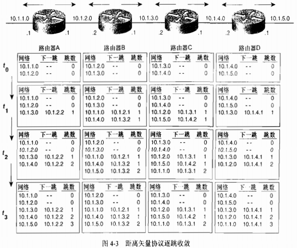
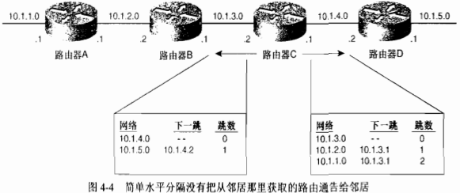
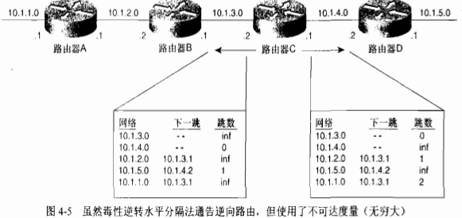
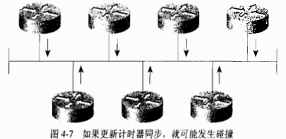
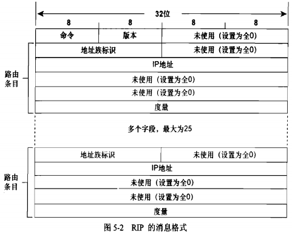
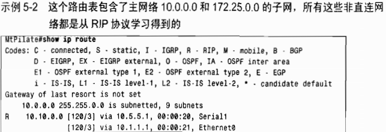
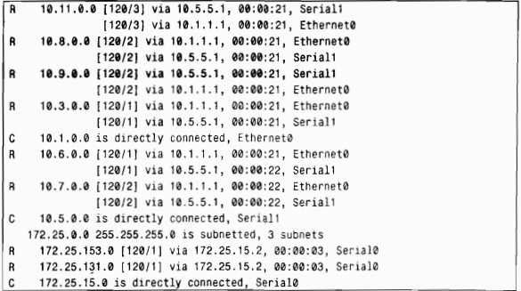

# 路由协议

**分为两类：**

- 外部网关协议EGP（External Gateway Protocol）
- 内部网关协议IGP（Interior Gateway Protocol）

> 根据EGP在区域网络之间（或ISP之间）之间**进行路由选择**。     `使用BGP边界网关协议。`
>
> 根据IGP在区域网络内部（或ISP内部）**进行主机识别**。  `使用RIP、RIP2、OSPF等协议。`
>
> 类似：根据IP地址中的网络部分进行路由选择，根据主机部分在链路内部进行主机识别。

> ISP（互联网服务提供商）


## 基础概念

### 1. 度量

度量是指派给路由的一种变量。当有多条路径到达相同目标网络时，路由器需要一种机制来计算最优路径。

> RIP选择路由器跳数最少的路径为最优路径;
>
> EIGRP基于路径沿路最小带宽和总时延选择最优路径。

#### 1.跳数

**跳数度量**记录路由器跳数。

> 不能作为选择最优路径的最优方法。因为带宽对如何有效地使流量通过网络影响很大。

#### 2.带宽

**带宽度量**将会选择<font color='red'>高带宽路径</font>，而不是低带宽路径。`带宽本身可能不是一个很好的度量`

#### 3.负载

负载度量反应了流量占用沿途链路带宽的数量。`最优路径应该是负载最低的路径`

> 注：争对跳数和带宽，路径上的负载会发生变化，因而度量也会跟着变化。
>
> 如果度量变化过于频繁，路由波动（对路由器的CPU、数据链路的带宽和全网稳定性产生影响）——最优路径频繁变化可能就发生了。

#### 4.时延

时延是度量数据包经过一条路径所花费的时间。`选择最低时延的路径最为最优路径`

> 需考虑链路时延，路由器处理时延和队列时延等因素。

#### 5.可靠性

用来测量链路在某种情况下发生故障的可能性，可靠性可以是变化的或固定的。

> - 可变可靠性度量的例子：链路发生故障的次数或特定时间间隔内收到错误的次数。
>
> - 固定可靠性度量：基于管理员确定的一条链路的已知量。

#### 6.代价

由管理员设置的代价度量可以反应更优或更差路由。


### 2.收敛

> 动态路由选择协议一系列过程：
>
> 1. 路由器向其他路由器通告本地的直连网络，接收并处理来自其他路由器的同类信息
> 2. 传递从其他路由器接收到的信息
> 3. 需定义已确定的最优路径的度量

对于路由选择协议来说，标准是<font color='red'>网络上所有路由器的路由表中的可达性信息必须一致</font>。


**收敛：**使得所有路由表都到达一致状态的过程。

**收敛时间：**全网实现信息共享以及所有路由器计算最优路径所花费的时间总和。


### 3.负载均衡

将流量分配到相同目标网络的多条路径上。


## 路由算法

两种：距离矢量、链路状态算法。

### 1.距离矢量协议

路由是以矢量（距离，方向）的方式被通告出去的。`距离是根据度量定义的，方向是根据下一跳路由器定义的。`

#### 通用属性

##### 1.定期更新

每经过特定时间周期就要发送更新信息。这个时间周期从10s(AppleTalk的RTMP)到 90s(Cisco的IGRP)。

如果更新信息发送过于频繁可能会引起拥塞;但如果更新信息发送不频繁,收敛时间可能长的不能被接收。

##### 2.邻居

在路由器上下文中**,邻居**通常意味着**共享相同数据链路的路由器**或**某种更高层的逻辑邻接关系**。

距离矢量路由选择协议向邻接路由器发送更新信息，并依靠邻居再向它的邻居传递更新信息。`逐跳更新方式`

##### 3.广播更新

向广播地址发送 (在IP网络中，广播地址是255.255.255.255)更新信息。使用相同路由选择协议的邻居路由器将会收到广播数据包并且采取相应的动作。不关心路由更新信息的主机和其他设备仅仅丢弃该数据包。

##### 4.全路由选择表更新

大多数距离矢量路由选择协议广播它的整个路由表，来告诉邻居它所知道的—切。

邻居在收到这些更新信息之后,它们会收集自己需要的信息,而丢弃其他信息。


#### 局限性和改进方式



##### 1.路由失效计时器

> 如图4.3，网络已经收敛，当部分网络拓扑发生变化时，它怎样处理重新收敛问题？
>
> （1）假如网络10.1.5.0发生故障了，在下一个更新周期，路由器D会将这个网络标记为不可达并且发生消息。

> （2）如果网络10.1.5.0没有故障，而是路由器D发生了故障？
>
> 这时路由器A、B和C的路由表仍保存着关于网络10.1.5.0的信息，虽然信息不再有用，但却没有路由器通知他们。它们将不知不觉地向一个不可达网络转发数据包。

解决方案：为路由表中的<font color='red'>每个表项</font>设置<font color='red'>路由失效计时器</font>。

[方案]：当路由器C首次知道网络10.1.5.0并将其输入到路由表中时，**路由器C需为该路由设置计时器**，每隔一定时间间隔路由器C都会收到路由器D的更新信息，路由器C在丢弃有关10.1.5.0的信息同时复位该路由的计时器。

如果路由器D发生故障，路由器C将不能收到关于10.1.5.0的更新信息。这时计时器会超时，路由器C将该路由标记为不可达，并在下一个更新周期时传递信息。

> 路由超时的周期范围3~6个更新周期。路由器在丢失单个更新信息之后将不会使路由无效的，因为数据包的损坏、丢失或者某种网络延时都会造成这种事件的发生。但是，如果路由失效周期太长，网络收敛速度将会过慢


##### 2.水平分割

> 每台路由器在每个更新周期都要向每个邻居发送它的整个路由表。
>
> 比如，图4.3中路由器A知道的每个距离大于0跳的网络都是从网络B中学习的。路由器A将从路由器B学习得的路由信息再广播给路由器B，会造成资源浪费。

逆向路由：**路由的指向**与**数据包流动方向**相反的路由。


<font color='red'>水平分割：</font>在两台路由器之间阻止逆向路由的技术      `阻止路由环路的发生`

> 好处：不造成资源浪费；不会把从路由器学习到的可达信息再返回给这台路由器。


【案例】

> 假设网络10.1.5.0发生故障，路由器D检测到故障，将该网络标记为不可达并在下一个更新周期通知路由器C。而在路由器D的更新计时器触发更新之前，假设路由器C的更新信息到达了路由器D，声明路由器C可以到达网络10.1.5.0，距离为1跳。`但路由器D不知道路由器C通告下一条最优路径并不合理，因而路由器D将跳数+1，并在路由表中记录：路由器C的接口（10.1.4.1）可以到达网络10.1.5.0，距离2跳`。
>
> 此时，10.1.5.3的数据包到达路由器C，路由器C查询路由表并将数据转发给路由器D。路由器D查询路由表又将数据包转发给路由C，路由器C再转回给路由器D，一直无穷尽进行下去，因而导致路由环路的产生。

【解决方案】

<font color='red'>**执行水平分割可以阻止路由环路的发生。**</font>有两类：简单水平分隔法、毒性逆转水平分割法。

######  1. 简单水平分割法

采用**抑制信息**的方式，从`某个接口发送的更新消息`<font color='red'>不能包含</font>从`该接口收到的更新消息所包含的网络`。 

> 比如，图4.3，路由器C向路由器D发送了关于网络10.1.1.0、10.1.2.0和10.1.3.0的更新信息，未包含10.1.4.0和10.1.5.0的网络。因为他们是从路由器D获取的。同样地，发送给路由器B的更新信息包括了网络10.1.4.0和10.1.5.0，不包括10.1.1.0、10.1.2.0和10.1.3.0




###### 2. 毒性逆转水平分割法

改进的一种方式，更安全、更健壮。

当更新信息被发送出某个接口时，信息中将指定从该接口收到的更新信息中获取的网络是不可达的。

> 例如，路由器C向路由器D通告了网络10.1.4.0和10.1.5.0，但这些网络都<font color='red'>被主动标记为不可达</font>。通过设置度量为无穷大（远），标记网络为不可达。



> 假设，路由器B收到错误信息使其相信通过路由器C可以到达子网10.1.1.0，若采用简单水平分割法是无法纠正这错误的，而通过路由器C的毒性逆转更新信息可以立刻制止这种潜在的环路。

缺陷：路由更新数据包更大了，可能会加剧链路的拥塞问题。


##### 3.计数到无穷大

水平分割法切断了邻居路由器之间的环路，但是它不能隔断网络中的环路。

> 减轻计数到无穷大影响的方法是定义无穷大。大多数距离矢量协议定义无穷大为16跳 。在图4.6中 ,随着更新消息在路由器中转圈，到10.1.5.0的跳数最终将增加到 16。那时网络10.1.5.0将被认为不可达。

缺点：收敛速度非常慢


##### 4.触发更新

又称快速更新。如果一个度量变好或变坏，那么路由器将立刻发送更新信息，而不是等更新计时器超时。

这样遇到故障，重新收敛的速度将会比每台路由器必须等待更新周期的方式快，而且可以大大减少计数到无穷大所引发的问题。

> 定期更新和触发更新可能会同时发生，因而路由器可能会在收到来自触发更新的正确信息之后又收到来自未收敛路由器的错误信息。
>
> 这种情况，表明当网络正在进行重新收敛时，还会发生混乱和路由错误。但触发更新将有助于更快消除这些问题。


对触发更新进一步的改进是更新信息中仅包括实际触发该事件的网络,而不是包括整个路由表。

触发更新技术减少了处理时间和对网络带宽的影响。


##### 5.抑制计时器

为了降低接受错误路由选择信息的可能性，抑制计时器引了某种程度的怀疑量。

【介绍】

如果到一个目标的距离增加 (例如，跳数由2增加到4)，那么路由器将为该路由设置抑制计时器。直到计时器超时,路由器才可以接受有关此路由的更新信息。


错误路由选择信息进入路由表的可能性被减小了,但是重新收敛的时间也被耗费了。

如挂起时间太短，不起作用；如果太长，正常路由则会受到不利的影响。


##### 6.异步更新

路由器将不会同时广播更新信息，如果发生这种情况，更新数据包会发生碰撞。但是当几台路由器共享一个广播网络时可能会发生这种情况。因为在路由器中，更新处理所带来的系统时延将导致更新计时器趋于同步。当几台路由器的计时器同步后，碰撞随之发生，这 又进一步影响到系统时延，最终共享广播网络的所有路由器都可能变得同步起来。



【方式】

- 每台路由器的更新计时器独立于路由选择进程，因而而不会受到路由器处理负载的影响
- 在每个更新周期中加入一个小的随机时间或定时抖动作为偏移。


### 2.链路状态协议

也成为最短路径优先协议或分布式数据库协议，围绕着Dijkstra的最短路径算法设计的。

- OSPF
- IS-IS

路由器在了解**网络整体连接状态**的基础上生成路由表。每个路由器需要保持同样的信息


【步骤】

1. 每台路由器与它的邻居之间建立联系，`邻接关系`
2. 每台路由器向每个邻居发送`链路状态通告LSA`的数据单元。`对每台路由器链路都会生成一个LSA，用于标识这条链路、链路状态、路由器接口到链路的代价度量值以及链路所连接的所有邻居`。每个邻居在收到通告之后将依次向他的邻居转发（泛洪）这些通告。
3. 每台路由器要在数据库中保存一份它所收到的LSA备份。如果所有工作正常，所有路由器的数据库应该相同。
4. 完整的拓扑数据库，也叫链路状态库。Dijkstra算法使用它对网络图进行<font color='red'>计算得出每台路由器的最短路径</font>。接着链路状态协议对链路状态数据库进行查询找到每台路由器所连接的子网，并将这些信息输入到路由表中。


#### 1.邻居

建立链路状态环境：邻居发现。这里使用Hello协议`（定义了一个Hello数据包的格式和交换数据包并处理数据包信息的过程。）`


## 路由协议

|       路由协议名        | 下一层协议 |   方式   | 适用范围 | 循环检测 |
| :---------------------: | :--------: | :------: | :------: | :------: |
|           RIP           |    UDP     | 距离向量 |   域内   |  不支持  |
|          RIP2           |    UDP     | 距离向量 |   域内   |  不支持  |
|          OSPF           |     IP     | 链路状态 |   域内   |   支持   |
| EGP（指一种特定的协议） |     IP     | 距离向量 | 对外连接 |  不支持  |
|           BGP           |    TCP     | 路径向量 | 对外连接 |   支持   |


### RIP

基于**距离向量**的一种路由协议，广泛用于LAN。`距离的单位是跳数，指所经过的路由器的个数`

- 每30s从开启RIP协议的接口定期向全网广播自己的路由表信息，若其他路由器没收到信息，则断开连接。`超过6次断开`

- 将已知的路由信息经过下一跳后继续广播   `跳数+1`

> RIP希望尽可能少的通过路由器将数据包转发到目标IP地址。

```
三个要点：
1. 仅和相邻路由器交换信息
2. 交换路由表信息
3. 周期性交换（每隔30秒）
```


#### 1.使用子网掩码时的RIP处理

> RIP不交换子网掩码信息，但可用于使用子网掩码的网络环境。

- 根据接口的IP地址分类，得出网络地址。并与路过路由器的包中的IP地址分类得到的网络地址进行比较，若相同，则以出接口的网络地址长度为准

- 若不同，则以IP地址的分类所确定的网络地址长度为准

  ```
  如：路由器出接口地址：192.168.1.33/27  C类地址
  	按照IP地址分类，它的网络地址为192.168.1.33/24。与它相符合的IP地址，其网络地址长度都是27位。
  	否则，则采用每个地址的分类所确定的网络地址长度。
  ```

##### 注意事项

1. 因IP地址分类而产生不同的网络地址时
2. 构造网络地址长度不同的网络环境时


#### 基本原理及实现

RIP协议的处理是通过UDP 520端口操作的。

RIP消息被封装在UDP的用户数据报协议中，源目端口字段值都是520。

> RIP的度量是基于“跳”数的


##### 两种消息类型

1. 请求消息

​	向邻居路由器发送一个更新。

2. 响应消息

​	用来传送路由更新。


**【步骤】：**

1. RIP会从每个启用RIP协议的接口，广播出带有请求消息的数据包。

2. 接着RIP程序会进入一个循环状态，不断监听来自其他路由器的RIP请求或响应消息，而收到请求的邻接路由器则会回送包含他们的路由表的响应消息。

3. 当发出请求的路由器收到响应消息时，它将开始处理附加在响应消息中的路由更新信息

   - 如果路由更新中的路由条目是新的，路由器则将新的路由连同`通告路由器的地址`（从更新包的源地址字段获取）一起加入到自己的路由表中。

   - 如果网络的RIP路由已在路由表中

     - 若新的路由拥有更小的跳数时更新原来存在的路由条目。

     - 若路由更新通告的跳数大于路由表已记录的跳数，并且更新来自于已记录条目的下一跳路由器，那么该路由器将在一个指定的抑制时间段内被标记为不可达。在抑制时间超过后，同一台邻居路由器仍然通告这个有较大跳数的路由，路由器则接收该路由新的度量值。

```
1. 路由器刚开始工作时，只知道自己到直连网络的距离为1
2. 每个路由器仅和相邻路由器周期性交换并更新路由表信息
3. 若干次交换和更新后，每个路由器都知道到达本自治系统内网络的最短距离和下一跳地址，称为收敛
```

**更新规则**

- 到达的目的网络相同

  - 相同下一跳，最新的路由消息，需更新
  - 不同下一跳，选距离最短的路由
  - 不同下一跳，距离相等，则负载均衡

- 若出现新的目的网络，则直接添加路由条目到路由表

  


##### RIP报文格式

每条消息包含一条命令、一个版本号和路由条目（最多25条）。每个路由条目包括地址族标识、路由可达IP地址和路由的跳数。

> 如果每台路由器必须发送大于25条路由的更新信息，那么必须产生多条RIP消息。
>
> RIP消息的大小（不含IP包头部）最多：
>
> ​	消息头部（4字节）+每个路由条目（20字节）*25 + UDP头部（8字节） = 512字节



- 命令：1表示请求消息，2表示响应消息。
- 版本号：对于RIPv1为1
- 地址族标识（AFI）：对于IP，该项为2。
- IP地址：路由的目的地址。`可以是主网络地址、子网地址或主机路由地址。`
- 度量：在RIP中指跳数，该字段的取值范围在1~16。

缺陷：消息格式中没有使用的比特空间远大于所使用的。


##### 请求消息类型

RIP请求消息可以<font color='red'>请求整个路由表信息</font>，也可以仅<font color='red'>请求某些具体路由的信息</font>。

- 请求消息含有一个地址族标识字段为0（地址为0.0.0.0），度量值为16的单条路由，接收到这个请求的设备将通过单播方式向发出请求的地址回送它的整个路由表。
- 一些诊断测试过程可能需要知道某个或某些具体路由的信息。这种情况下，请求消息可以与特定地址的路由条目一起发送。接收到该请求的设备将根据请求消息逐个处理这些条目，构成一个响应消息。如果该设备的路由表中已有请求消息中地址相对应的路由条目，则将其路由条目的度量值填入metric字段。如果没有，该字段就被设置为 16。在不考虑水平分隔或边界汇总的情况下，响应消息将正确地告诉这台路由器了解的信息。


##### 有类别路由选择

这些路由跳目的权值由方括号中的元组来表示，第一个表示管理距离，第二个标识度量值。

> RIP的管理距离为120，度量值是基于跳数的。

例如，`10.8.0.0`需要通过E0或S1进行2跳才能到达。如果到达同一个目的网络有多条跳数相等的路由，那么RIP进行等价路径的负载均衡。




