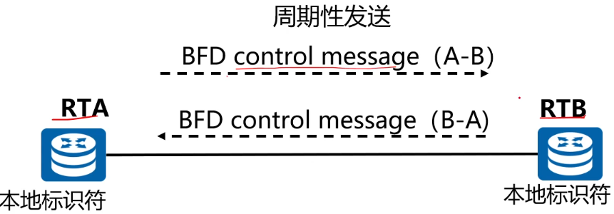
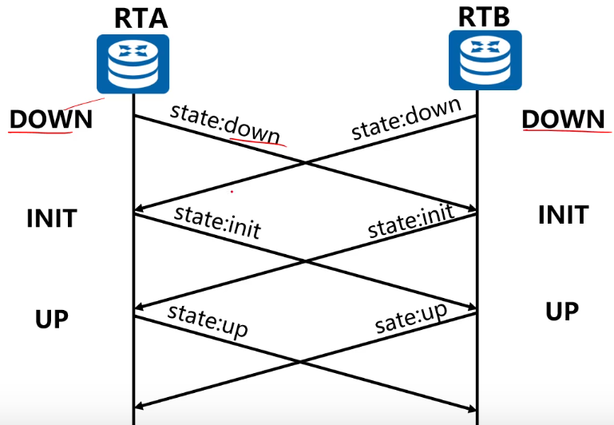
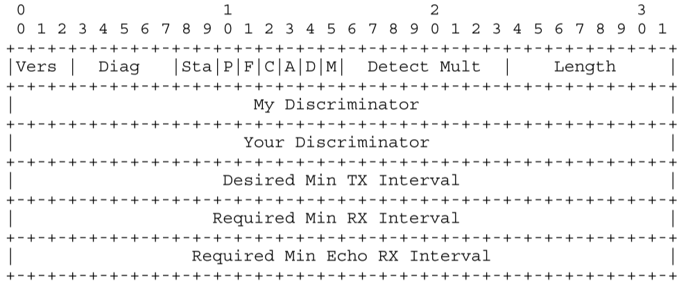
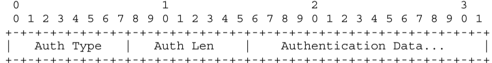
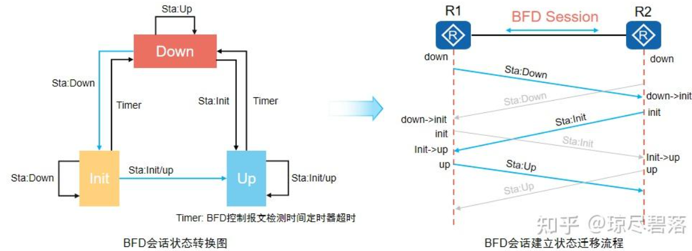
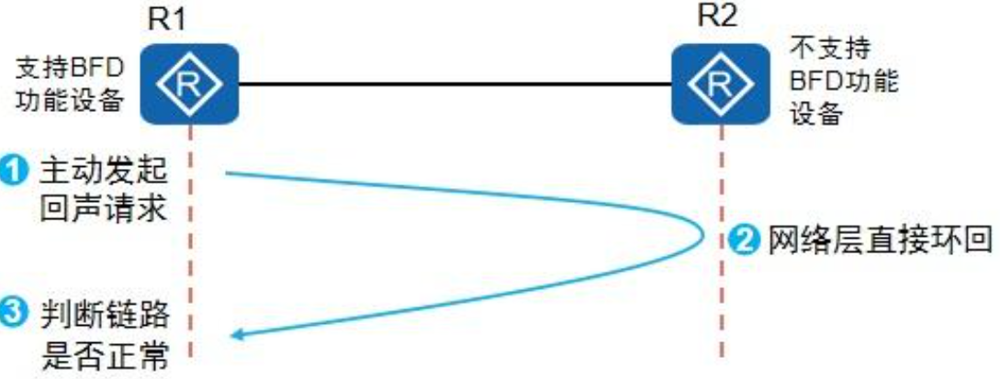

# BFD 

Bidirectional Forwarding Detection 双向转发检测

一种故障检测机制（与协议无关、介质无关），用于快速检测、监控网络中链路或者IP路由转发连通状况



- 两端都要开启bfd
- 绑定对端的ip地址



## BFD报文格式



- Vers（3bits）：协议版本号，目前为1。

- Diag：诊断字，描述会话发生故障原因（例如链路断开、邻居不可达等）。

  - 0: No Diagnostic（没有检测到任何故障）
  - 1: Control Detection Time Expired（控制报文检测时间超时，未在规定时间内收到来自对端的BFD控制报文）
  - 2: Echo Function Failed（Echo功能检测失败，未能通过回环路径接收到Echo报文）
  - 3: Neighbor Signaled Session Down（对端设备主动通知BFD会话状态为Down）
  - 4: Forwarding Plane Reset（转发平面重置，可能导致BFD会话中断）
  - 5: Path Down（检测到链路或路径不可达）
  - 6: Concatenated Path Down（串联路径中的某段链路发生中断）
  - 7: Administratively Down（管理员手动将BFD会话设置为Down状态）
  - 8: Reverse Concatenated Path Down（反向串联路径中某段链路出现故障）

- Sta：BFD会话的状态：`AdminDown`、`Down`、`Init`、`Up`

  -  AdminDown（会话处于管理下线状态，通常由管理员手动关闭）
  - Down（会话未建立或链路不可达）
  - Init（会话已启动，但未完全建立）
  - Up（会话已建立，链路正常）

- **Poll (P)**：用于会话参数的更新，比如会话超时时间的协商。表示请求对方立即回复。

- **Final (F)**：表示本端对接收端的`Poll`请求作出响应。

- Control Plane Independent (C)：指明BFD会话是否依赖于设备的控制平面（CPU）。

  - `1`：会话不依赖于控制平面，运行在转发平面上（数据平面）

  - `0`：会话依赖于控制平面。

    | **属性**          | **控制平面**                         | **转发平面**                                      |
    | ----------------- | ------------------------------------ | ------------------------------------------------- |
    | **主要任务**      | 生成和维护路由表、邻居关系、网络拓扑 | 根据转发表FIB(由控制平面的路由表生成的)转发数据包 |
    | **处理内容**      | 路由协议信息、配置、拓扑更新         | 用户流量（数据包）                                |
    | **实现方式**      | 主要由软件和CPU处理                  | 主要由硬件（如ASIC）处理                          |
    | **速度**          | 较慢（逻辑复杂、计算量大）           | 快速（专注于高效数据转发）                        |
    | **交互方式**      | 控制平面生成的路由信息传递给转发平面 | 转发平面执行具体的数据包处理                      |
    | **常见协议/功能** | RIP、OSPF、BGP、ICMP、SNMP等         | IP数据包转发、ACL、QoS等                          |

- Authentication Present (A)：指示是否在报文中包含认证信息。

- **Demand (D)**：指示设备是否运行在“需求模式”（Demand Mode）。

  - 用于减少网络中周期性控制报文的发送。在链路状态正常且稳定时，BFD设备可以进入需求模式，仅在必要时才发送控制报文，以降低网络流量和设备开销。

- Multipoint (M)：该位保留用于未来 BFD 的点对多点扩展。 发送和接收时它必须为零。

- Detect Mult：表示连续未收到对端报文的最大次数，超过此次数则认为链路失效。  **<font color='red'>默认3次。</font>**

  - 失效检测时间 = Detect Multiplier × 接收间隔

- **Length**：整个BFD控制报文的长度。

- **My Discriminator**：本地会话标识符（Local Discriminator） 。发送系统产生的一个唯一的、非0鉴别值，用来区分一个系统的多个BFD会话。
- **Your Discriminator**：远端会话标识符（Remote Discriminator） 。从远端系统接收到的鉴别值，这个域直接返回接收到的“My Discriminator”，如果不知道这个值就返回0。
- Desired Min TX Interval：本地支持的最小BFD报文发送间隔。**<font color='red'>默认1000毫秒。</font>**
- Required Min RX Interval：本地支持的最小BFD报文接收间隔。**<font color='red'>默认1000毫秒。</font>**
- Required Min Echo RX Interval：本地支持的最小Echo报文接收间隔，单位为微秒（如果本地不支持Echo功能，则设置0），用于回环测试。




- Auth Type：认证类型

  - 0：保留

  - 1：简单密码

  - 2：MD5密钥

  - 3：Keyed MD5，但更严格，要求每个报文都有唯一的序列号（防止重放攻击）

  - 4：SHA-1密钥

  - 5：类似于Keyed SHA1，但更严格，要求每个报文具有唯一的序列号。

    

- Auth Len：身份认证的长度（包括Auth Type、Auth Len）

- 


## BFD 会话状态

​	会话状态的变化是通过BFD报文的state字段传递的，系统根据自己本地的会话状态和接收到的对端BFD报文中state来改变状态。

​	BFD状态机的建立和销毁都采用三次握手机制，：



- 发送时通过报文的state来宣告本端的状态；接收时，根据收到报文的state来获取远端的状态。
- 当处于DOWN状态：
  - 接收到对端的down包，状态机：down->init
  - 接收到对端的init包，状态机：down->up
  - 接收到对端的up包，状态机仍维持down状态
- 当处于INIT状态（正与远端进行通信，并期望进入UP状态）：
  - 若接收到对端的up包或init包，状态机：init->up
  - 若检测超时，会跳转到down状态，意味着与远端通信丢失。
- 当处于UP状态（BFD会话建立成功，并且正在确认链路的连通性，会话会一直处于UP状态，直到链路故障或者管理员手动关闭操作）
  - 若收到down包或者检测超时，状态机：up->down


### BFD 检测模式

异步模式和查询模式两种。

- 异步模式：一直问一直回复。即系统之间相互周期性发送BFD控制包，如果某个系统在检测时间内未收到对端发来的BFD报文，就宣布会话状态为Down。
- 查询模式：有需要时再问，等待回复，如果没有回复的话，则会话状态为Down。

本质区别在于检测位置不同，异步模式检测位置为远端，远端检测对端是否周期性发送BFD控制报文；查询模式的检测位置为本端，本段检测发送的BFD控制报文是否得到了回应。


### BFD 检测时间

由TX（本地最小发送间隔）、RX（本地最小接收间隔）、DM（检测倍数）三者决定。

BFD实际发送的时间间隔由BFD会话协商决定，即按照最大的时间间隔 。

- 本地实际发送时间间隔 = MAX {<font color='red'>**本端**</font>配置的发送时间间隔，<font color='blue'>**对端**</font>配置的接收时间间隔}
- 本地实际接收时间间隔 = MAX {<font color='red'>**本端**</font>配置的接收时间间隔，<font color='blue'>**对端**</font>配置的发送时间间隔}

- 本地实际检测时间间隔：

  - 异步模式：

    - 实际检测时间间隔 = <font color='red'>**本端**</font>实际接收时间间隔 × <font color='blue'>**对端**</font> 配置的BFD检测倍数

  - 查询模式：

    - 实际检测时间间隔 = <font color='red'>**本端**</font>实际接收时间间隔 × <font color='red'>**本端 **</font>配置的BFD检测倍数

      

### **BFD Echo功能**

也称BFD回声功能，是由本地发送BFD Echo报文，远端系统将报文回环的一种检测方式。

**使用场景：在不支持BFD的设备或者不方便配置BFD的场景中可以使用。**



> 在两台直接相连的设备中，其中一台设备支持BFD功能（R1）；另一台设备不支持BFD功能（R2），只支持基本的网络层转发。
>
> 为了能够快速的检测这两台设备之间的故障，可以在支持BFD功能的设备上创建**单臂回声功能**的BFD会话。支持BFD功能的设备主动发起回声请求功能，不支持BFD功能的设备接收到该报文后直接将其环回，从而实现转发链路的连通性检测功能


### BFD 联动功能

联动功能由检测模块、Track和应用模块三部分组成。

#### 组成部分

1. 检测模块：负责检测链路状态、网络性能等，并将探测结果通知给Track模块。

2. Track模块：收到探测结果后，及时改变Track项的状态，并通知应用模块。
3. 应用模块：根据Tracker项的状态，进行相应的处理，从而进行联动。

> 简单理解：
>
> - 当BFD状态down了，进行路由切换或者关闭端口；
>
> - 当BFD状态up了，则恢复路由。


## RFC5880

### 1.接收BFD控制包

- 接收控制包：

  1. 检测版本号是否为1

  2. 检测长度字段是否小于正确值（如果A位为0，不含认证信息，则长度为24；否则，为26）；且是否大于封装协议的有效负载

  3. 检测 Detect Mult 字段是否为零（为0，则丢弃）

  4. 检测M位是否为0

  5. 检测My Discriminator字段值是否为0

  6. 检测Your Discriminator字段值：

     - 当Your Discriminator不为0，需要找到与此BFD数据包相关的会话。若没找到，则直接丢弃。

     - 当Your Discriminator为0且状态字段不是Down或者AdminDown，则直接丢弃。

  7. 当A位不为0，但未使用任何身份验证（bfd.AuthType为0）或者身份验证错误，则直接丢弃

  8. 若A位已为0且正在使用身份验证（bfd.AuthType 非0），则丢弃该数据包

  9. bfd.RemoteDiscr = My Discriminator值

  10. bfd.RemoteState = State (Sta) 字段值

  11. bfd.RemoteDemandMode = D位字段值

  12. bfd.RemoteMinRxInterval =  Min RX Interval 最小接收间隔

  13. 若所需的Min Echo RX Interval字段为0，则Echo数据包的传输（如果有）必须停止。

  14. 如果本地系统正在传输轮询序列并且设置了接收到的数据包中的最终（F）位，则必须终止轮询序列。

  15. 更新传输间隔

  16. 更新检测时间

  17. 如果 bfd.SessionState 为 AdminDown 则丢弃数据包

  18. 如果接收到的state为 AdminDown

      - 如果本地的 bfd.SessionState 为down，
        - bfd.LocalDiag =为 3（邻居发信号通知会话关闭）
        -  将 bfd.SessionState = Down

      否则

      - 如果本地的 bfd.SessionState 为down
        - 若接收到的state为down
          - bfd.SessionState -> init
        - 若接收到的state为init
          - bfd.SessionState -> up
      - 如果本地的 bfd.SessionState 为init
        - 若接收到的state为Init或Up
          - bfd.SessionState = up
      - 若bfd.SessionState为Up
        - 若接收到的state为Down
          - bfd.LocalDiag = 3 (邻居发信号通知会话关闭)
            bfd.SessionState = Down

  19. 检测Demand模式是否激活

      - 如果 bfd.RemoteDemandMode 为 1，bfd.SessionState 为 Up，且 bfd.RemoteSessionState 为 Up，
        - 则远程系统上的Demand Mode处于Active状态，并且本地系统必须停止 BFD 控制数据包的定期传输
      - 如果 bfd.RemoteDemandMode 为 0，或 bfd.SessionState 未启动，或 bfd.RemoteSessionState 未启动，则远程系统上的请求模式未激活，并且本地系统必须定期发送 BFD 控制数据包

  20. 如果设置了轮询 (P) 位，则将轮询 (P) 位清零并设置最终 (F) 位的 BFD 控制数据包发送到远程系统。

  21. 如果数据包未被丢弃，则出于第 6.8.4 节中的检测时间到期规则的目的，已接收该数据包。


### 2.发送BFD控制包

BFD 控制数据包传输间隔：min(bfd.DesiredMinTxInterval, bfd.RemoteMinRxInterval) 

BFD 控制数据包的周期性传输必须在每个数据包的基础上抖动最多 25%，即间隔必须减少 0 到 25% 的随机值，以避免与在相同子网的网络上与其他系统同步。  因此，数据包之间的平均间隔将比协商的间隔大约减少 12.5%。

- 如果 bfd.DetectMult = 1，则传输 BFD 控制数据包之间的间隔必须不大于协商传输间隔的 90%，并且必须不小于协商传输间隔的 75%。 这是为了确保在远程系统上，计算出的Detection Time不会在收到下一个 BFD 控制数据包之前发送过去。
- 每当 bfd.DesiredMinTxInterval 更改或 bfd.RemoteMinRxInterval 更改时，必须重新计算传输间隔，并且传输间隔等于这两个值中的较大者。 
- 如果 bfd.RemoteDiscr 为零且系统处于被动角色，则系统不得传输 BFD 控制数据包。
- 如果 bfd.RemoteMinRxInterval = 0，则系统不得定期传输 BFD 控制数据包。
- 如果远程系统上的Demand Mode处于Active状态（bfd.RemoteDemandMode 为 1，bfd.SessionState 为 Up，bfd.RemoteSessionState 为 Up）并且未传输轮询序列，则系统不得定期传输 BFD 控制数据包。
- 如果接收到的 BFD 控制数据包的轮询 (P) 位设置为 1，则接收系统必须尽快发送轮询 (P) 位清零且最终 (F) 位设置的 BFD 控制数据包，而不考虑传输计时器或任何其他传输限制，而不考虑会话状态，也不考虑Demand Mode在任一系统上是否处于活动状态。 系统可以限制此类数据包的传输速率。 如果速率限制有效，则 Desired Min TX Interval 的通告值必须大于或等于速率限制功能施加的传输数据包之间的间隔。
- 除非 bfd.DemandMode 为 1，bfd.SessionState 为 Up，并且 bfd.RemoteSessionState 为 Up，否则系统不得设置 Demand (D) 位。

- 当 BFD 控制数据包的内容与先前传输的数据包（轮询和最终位除外）中的内容不同时，应在周期性控制数据包传输之间的间隔期间传输 BFD 控制数据包，以便更快速地传达状态更改。
- version = 1、bfd.LocalDiag、bfd.SessionState
- 如果本地需要发送轮询序列 P = 1
- 如果本地系统正在响应接收到的带有轮询 (P) 位设置的控制数据包，则F设置为 1，否则设置为 0。
- 如果本地系统的 BFD 实现独立于控制平面（它可以在控制平面中断时继续运行），则C设置为 1。
- 如果此会话正在使用身份验证（bfd.AuthType 不为零），则A设置为 1，否则设置为 0。

- 当bfd.SessionState 为 Up 并且 bfd.RemoteSessionState 为 Up，才可设置 bfd.DemandMode。 否则，它被D设置为 0。
- M = 0
- bfd.DetectMult
- 固定标头长度 (24) +任何身份验证部分，设置为适当的长度Length
- bfd.LocalDiscr = My Discriminator
- bfd.RemoteDiscr = Your Discriminator
- bfd.DesiredMinTxInterval = Desired Min TX Interval
- bfd.RequiredMinRxInterval = Required Min RX Interval
- 设置为此会话所需的最小Echo数据包接收间隔。 如果该字段设置为零，则表示本端系统不愿意或无法将BFD Echo报文环回对端系统，远程系统将不会发送Echo报文
- 如果正在使用身份验证（bfd.AuthType 非零），则根据第 6.7 节中的规则包含并设置。 否则，此部分不存在。


### 3.接收BFD Echo报文

收到的 BFD Echo 数据包必须解复用到适当的会话进行处理。 必须实现检测丢失的 Echo 数据包的方法，这很可能涉及对接收到的 Echo 数据包的处理。

### 4.发生BFD Echo报文

- 当 bfd.SessionState 不为Up时，不得传输 BFD Echo 数据包。 除非从远程系统接收到的最后一个 BFD 控制数据包在所需的最小Echo接收间隔中包含非零值，否则不得传输 BFD Echo数据包。
- 当 bfd.SessionState 为 Up 时，可以传输 BFD Echo 数据包。 发送的 BFD Echo 数据包之间的间隔不得小于远程系统在所需的最小 Echo RX 间隔中通告的值，但以下情况除外：
  - 25% 的抖动可以应用于传输速率，使得实际间隔可以在建议值的 75% 到 100% 之间。 单个 BFD Echo 数据包可以在正常调度的 Echo 传输间隔之间传输。


### 5.一些值的改变

#### 1. Min Rx Interval 

​	当需要更改 BFD 控制数据包从远程系统到达的速率时，可以随时将 bfd.RequiredMinRxInterval 更改为任何值。 新值将在下一个传出控制数据包中传输，远程系统将进行相应调整。 

#### 2. Min Tx Interval

​	当需要更改 BFD 控制数据包传输到远程系统的速率（取决于相邻系统的要求）时，可以随时将 bfd.DesiredMinTxInterval 更改为任何值。

#### 3. Detect Multiplier

​	当需要更改检测乘数时，bfd.DetectMult 的值可以更改为任何非零值。 新值将与下一个 BFD 控制数据包一起传输，并且不需要使用轮询序列。 

#### 4. Enabling or Disabling The Echo Function

​	如果需要启动或停止 BFD Echo 数据包的传输，可以随时执行此操作。

​	如果需要启用或禁用收到的 BFD Echo数据包的环回，可以随时通过将传出 BFD 控制数据包中所需的最小Echo接收间隔的值更改为零或非零来完成。

#### 5. Enabling or Disabling Demand Mode

​	如果需要启动或停止需求模式，可以随时通过将 bfd.DemandMode 设置为适当的值来完成。 

​	如果远程系统上的需求模式不再处于活动状态，则本地系统必须开始发送定期 BFD 控制数据包。

#### 6. Forwarding Plane Reset

​	当本地系统中的转发平面由于某种原因重置，使得远程系统不能再依赖本地转发状态时，本地系统必须将bfd.LocalDiag设置为4（转发平面重置），并设置到bfd.SessionState 。

#### 7. Administrative Control

​	如果启用会话将 bfd.SessionState 设置为 Down；否则，将 bfd.SessionState 设置为 AdminDown；将bfd.LocalDiag 设置为适当的值 ；停止 BFD Echo 数据包的传输

​	如果从外部 BFD 接收到底层路径已失败的信令，则实现可以通过管理方式禁用诊断路径已关闭的会话。

​	其他场景可以使用诊断“管理性关闭”。

​	BFD 控制数据包应在转换到 AdminDown 状态后至少传输一段检测时间，以确保远程系统了解状态更改。  BFD 控制数据包可以在转换到 AdminDown 状态后无限期地传输，以便维持每个系统中的会话状态。

#### 8. Concatenated Paths（串联路径）

​	如果 BFD 监视的路径与其他路径级联（端到端串联），则可能需要在 BFD 会话中传播这些路径之一的故障指示（为活动提供互通功能）  BFD 和其他技术之间的监控）。

 	为此定义了两个诊断代码：向下串联路径和反向串联路径向下。 第一个传播正向路径故障（其中级联路径在朝向互通系统的方向发生故障），第二个传播反向路径故障（其中级联路径在远离互通系统的方向发生故障，假设是双向链路）  。

​	系统可以通过简单地将 bfd.LocalDiag 设置为适当的诊断代码来发出这些故障状态之一的信号。 请注意，BFD 会话不会被关闭。 如果远程系统上的Demand模式未激活，则无需执行其他操作，因为诊断代码将通过 BFD 控制数据包的定期传输来携带。 如果远程系统上的请求模式处于活动状态（本地系统不发送定期 BFD 控制数据包），则必须启动轮询序列以确保发送诊断代码。 请注意，如果 BFD 会话随后失败，诊断代码将被详细说明失败原因的代码覆盖。 一旦 BFD 会话达到 Up 状态，如果要恢复串联路径故障的传播，则由互通代理再次执行上述过程。


## BFD命令

### 全局配置模式命令

```cmd
Router_config#bfd ?
  init-mode                -- BFD init mode
  slow-timers              -- BFD slow timers
  echo-source-ip           -- BFD echo source ip
```

#### bfd init-mode

```cmd
# active mode
bfd init-mode active
# passive mode
bfd init-mode passive
```

#### bfd slow-timers

```cmd
bfd slow-timers <1000-30000>
```

#### bfd echo-source-ip

```cmd
bfd echo-source-ip <A.B.C.D>
```


### 端口配置模式命令

```cmd
Router_config_g0/0#bfd ?
  authentication-mode      -- BFD authentication mode
  demand                   -- BFD demand mode
  delay     			   -- delay
  echo                     -- BFD echo enable
  enable                   -- BFD enable
  neighbor                 -- BFD neighbor config
  min-echo-rx-interval     -- BFD required min echo rx interval
```


#### bfd enable 

```cmd
bfd enable min_tx <10-999> min_rx <10-999> multi <3-50>
```

#### bfd neighbor

```cmd
Router_config_g0/0#bfd neighbor ?
  A.B.C.D                 -- BFD neighbor ip address
  X:X:X:X::X                 -- BFD neighbor ipv6 address
  
Router_config_g0/0#bfd neighbor 1.1.1.1 ?
  GigaEthernet      -- GigaEthernet interface
  Null              -- Null interface
  <cr>
```


