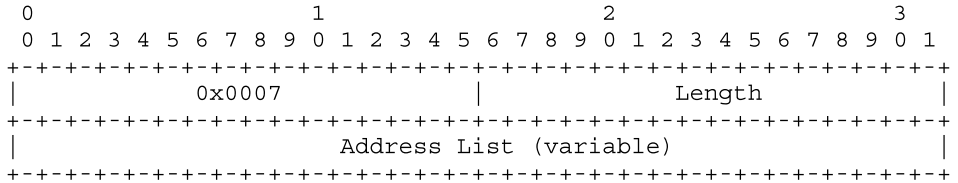
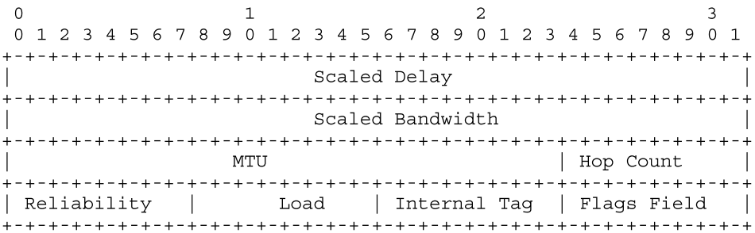
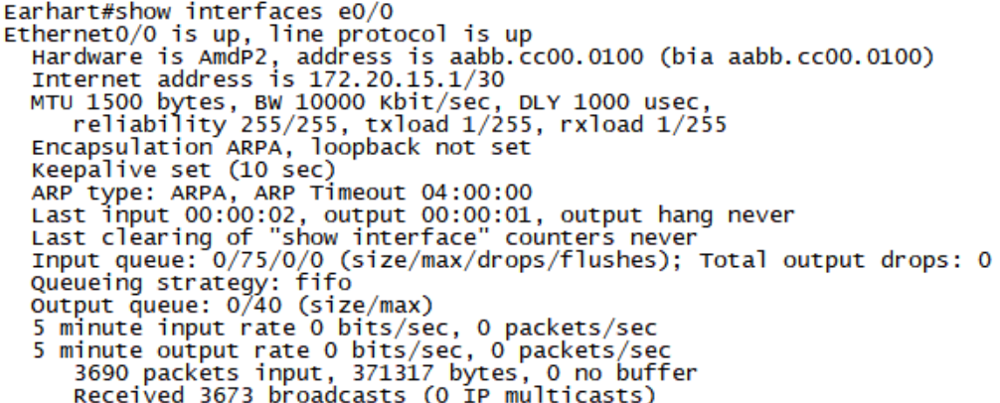

# EIGRP

对比RIPv2

- 通过多个条件对metric值进行计算，计算比RIPv2更严格
- 最大跳数为255
- 收敛速度更快，每5s发送一次Hello报文，确认邻居关系
- 使用DUAL扩散更新算法，快速收敛路由
- 使用增量更新和触发更新来取代周期性更新
- 非等价负载均衡
- 更新周期是 RIP 协议的 3 倍时间长
- 更新数据包格式更有效


## 特点

- 高级距离矢量路由协议
- 快速收敛
- 支持VLSM（可变子网）和不连续子网CIDR（超网）
- 部分更新，带宽占用少
- 多播和单播，而不是广播地址
- 支持多种网络层协议
- 100%无循环无类路由
- 支持所有 LAN 和 WAN 数据链路协议和拓扑。
- 在相等和不相等成本路径上实现负载均衡


## 基本概念

​	EIGRP（Enhanced Interior Gateway Routing Protocol ）即增强型内部网关路由协议。

​	EIGRP结合了**链路状态**和**距离矢量**型路由选择协议的Cisco专用协议，采用扩散更新算法（DUAL）来实现快速收敛，可以**不发送定期的路由更新信息**以减少带宽的占用，支持Appletalk、IP、Novell和NetWare等多种网络层协议。

​	支持等开销负载均衡，默认4条，最大6条，默认ios12.4以上支持16条；同时支持非等开销负载均衡。

​	协议号：88


## 路由状态

​	到达目的地的路由有两种状态：Active和Passive

​	在Passive状态下，路由器不会与其邻居协调执行任何路由的重新计算。

​	

### Active

> 处于Active状态的路由被视为不可用，并且该路由器必须与其邻居协商来搜索新的无环总成本最小路径。

​	在Active状态下，路由器与其邻居协调，主动参与重新计算成本最低的无环路径。每次检测到拓扑改变时，都会重新评估状态，并可能更改状态。`拓扑更改：指任何邻居添加、更改或从EIGRP拓扑表删除到目的地的CD的多种事件`

​	**如果路径不满足FC，该路由就会处于Active状态**，并相所有邻居发送请求，以寻找新的无环路径。

**<font color='red'>注意：如果未通过FC的邻居提供了最低成本路径，则认为该路由处于 ACTIVE 状态，因此不能保证该路径无环路。</font>**

> 当当前最小总成本路径发生故障并且下一个最小总成本路径穿过不是FS时，在拓扑改变期间可能会发生这种情况。


### Passive

​	处于Passive状态的路由，至少存在一条总成本最小的路径，且最少存在一个可行后继者以及一条后继路由。提供总成本最小路径的可行后继者也称为后继者。

<font color='red'>注意：</font><font color='red'>如果总成本最小的路径不是由S提供的，则该路由处于Active状态，需要重新计算。</font>

>  虽然这些邻居保证提供无环路路径，但该路径可能不是最短的可用路径。


## 分配编码

### 1.协议分配编码

`外部协议`字段：用于表示获知该路由的原始路由协议：

```c
Protocols	Value
IGRP		  1
EIGRP         2
Static        3
RIP           4
HELLO         5
OSPF          6
ISIS          7
EGP           8
BGP           9
IDRP          10
Connected     11
```

### 2.目的地址分配编码

目的地类型根据 IANA 地址系列号码分配进行编码。

```c
AFI Description				AFI Number
--------------------------------------
IP (IP version 4)			    1
IP6 (IP version 6) 			    2
EIGRP Common Service Family   16384
EIGRP IPv4 Service Family	  16385
EIGRP IPv6 Service Family	  16386
```


## 报文格式

> EIGRP数据包直接将封装到网络层协议中，例如IPv4或IPv6。
>
> IPv4和IPv6**协议标识符**都使用88

### 1. EIGRP Packet Header


- Header Version：EIGRP数据包头部格式Version为2

- Option：消息的类型

  > EIGRP_OPC_UPDATE  	  1
  > EIGRP_OPC_REQUEST	  2
  > EIGRP_OPC_QUERY	      3
  > EIGRP_OPC_REPLY	       4
  > EIGRP_OPC_HELLO	      5
  >
  > EIGRP_OPC_SIAQUERY	10	SIA查询
  >EIGRP_OPC_SIAREPLY	  11	SIA答复
  
- Checksum：标准的IP校验和。它是基于除了IP头部的整个EIGRP数据包来计算的。`计算时将checknum字段置为0`

- Flag：定义数据包的特殊处理。 

  > INIT-Flag (0x01)：在发送给新发现邻居的初始UPDATE包中设置。 它指示向邻居通告其全部路由。
  >
  > CR-Flag (0x02)：该位表示路由器仅在处于**条件接收模式**时才接收数据包。 
  >
  > ​			     当路由器接收并处理带有<font color='red'>`SEQUENCE TLV的HELLO数据包`</font>时，路由器进入条件接收模式。  
  >
  > RS-Flag (0x04)：在重启期间，HELLO和UPDATE数据包中设置重启标志。 
  >
  > ​				路由器查看RSFlag以检测邻居是否正在重新启动。如果相邻路由器检测到设置了RS-Flag，它将维持邻接关				系，并在其UPDATE数据包中设置RS-Flag以指示它正在进行软重启。  
  >
  > EOT-Flag (0x08)：End-of-Table 标志着与邻居的启动过程的结束。 如果设置了该标志，则表明邻居已完成发送所有 				UPDATE。 此时，路由器将删除在重启事件之前从邻居获知的所有陈旧路由。 陈旧路由是指在重新启动之前				存在且未被邻居通过 UPDATE 刷新的任何路由。

- Sequence Number：传输的每个数据包都将具有一个32位序列号，该序列号对于发送路由器而言是唯一的。

  ​				     值0表示不需要确认。

- Acknowledgment Number：数据包接收方正在确认的 32 位序列号。 

  - 如果seq num值为 0，则不需要确认。 

  - 非零值只能出现在单播数据包中。<font color='red'> 具有非零 ACK 字段的 HELLO 数据包应被解码为 ACK 数据包而不是 HELLO 数据包。</font>

    > 注意，如果数据包本身是单播的，这里的 ACK 字段只能是非零的，因为确认数据包从来都不是组播的。

- Virtual Router Identifier (VRID)：一个16位数字，用于标识与该数据包关联的虚拟路由器。 
  - 0x0000  Unicast Address Family
  - 0x0001  Multicast Address Family
  - 0x8000  Unicast Service Family
  
- Autonomous System Number：发送系统的16位无符号数。 该字段间接用作认证值。 也就是说，接收并接受来自邻居的数据包的路由器必须具有相同的AS号，否则该数据包将被忽略，有效AS编号的范围是1到65,535。

### 2. EIGRP TLV Encoding Format

> TLV：type、length以及value

​	每一个TLV字段都包含2个八位字节的类型号、一个指定TLV字段长度的2个八位字节字段和一个由类型决定其格式的可变字段。


#### 2.1 Type

类型字段的结构分为Type high以及Type low。

Type high：定义协议分类的1个八位字节

|   Protocol    |  ID  | Version |
| :-----------: | :--: | :-----: |
|    General    | 0x00 |   1.2   |
|     IPv4      | 0x01 |   1.2   |
|     IPv6      | 0x04 |   1.2   |
|      SAF      | 0x05 |   3.0   |
| Multiprotocol | 0x06 |   2.0   |


#### 2.2 Length

2个八位字节的无符号数，表示TLV的长度。 该值包括类型和长度字段。

#### 2.3 Value

Value：一个多八位字节字段，包含 TLV 的有效载荷


### 3. EIGRP Generic TLV Definitions

| Type                    | Ver 1.2 | Ver 2.0 |
| ----------------------- | ------- | ------- |
| PARAMETER_TYPE          | 0x0001  | 0x0001  |
| AUTHENTICATION_TYPE     | 0x0002  | 0x0002  |
| SEQUENCE_TYPE           | 0x0003  | 0x0003  |
| SOFTWARE_VERSION_TYPE   | 0x0004  | 0x0004  |
| MULTICAST_SEQUENCE_TYPE | 0x0005  | 0x0005  |
| PEER_INFORMATION_TYPE   | 0x0006  | 0x0006  |
| PEER_TERMINATION_TYPE   | 0x0007  | 0x0007  |
| PEER_TID_LIST_TYPE      | ------- | 0x0008  |

#### 3.1 PARAMETER_TYPE - 0x0001

​	该TLV在**HELLO数据包**中用于传达EIGR 度量系数值： **101000**

​		表示为“K 值”以及Hold Time值。 当发现邻居时，此 TLV 还会用在**初始UPDATE数据包**中。


#### 3.2 AUTHENTICATION_TYPE - 0x0002

​	该TLV可以在**<font color='red'>任何EIGRP数据包</font>**中使用，并传达Authentication Type和Auth Data。 


##### 3.2.1 MD5 - 0x02 

​	MD5将使用Auth Type代码为0x02，Auth Data将是MD5哈希值。

##### 3.2.2 SHA256 - 0x03 

​	SHA2-256将使用Auth Type代码为0x03，Auth Data将是256位SHA2哈希值。

#### 3.3 SEQUENCE_TYPE - 0x0003

​	该TLV用于发送方告诉接收方不要接收设置了CR（条件接收）标志的数据包。 

​	<font color='red'>这用于对组播和单播寻址数据包进行排序。</font>


- Address Length：IPv4值为4，IPv6值为16
- Protocol Address：
  - 发送带有SEQUENCE TLV的HELLO的接口上的邻居地址。
  - HELLO 数据包中列出的每个地址都是**不应**进入**条件接收模式**的邻居。

#### 3.4 SOFTWARE_VERSION_TYPE - 0x0004

​	TLV 版本字段用于确定 TLV 格式版本。 

​	<font color='red'>使用版本1.2 TLV的路由器无法理解版本2.0 TLV，因此版本2.0路由器必须在混合网络中发送具有两种TLV格式的数据包。</font>

|          Field          | Length |
| :---------------------: | :----: |
| Vender OS major version |   1    |
| Vender OS minor version |   1    |
|  EIGRP major revision   |   1    |
|  EIGRP minor revision   |   1    |


#### 3.5 MULTICAST_SEQUENCE_TYPE - 0x0005

下一个组播SEQUENCE TLV。


#### 3.6 PEER_INFORMATION_TYPE - 0x0006

​	该 TLV 是保留的，不是本文档的一部分。

#### 3.7 PEER_ TERMINATION_TYPE - 0x0007

​	该 TLV 在 **<font color='red'>HELLO 数据包</font>**中使用，以通知路由器已重置邻接关系的邻居列表。 

​	该TLV用在HELLO数据包中，通知邻居列表路由器已重置邻接关系。 每当路由器需要重置邻接或向邻接发出即将关闭的信号时，都会使用此功能。



#### 3.8 TID_LIST_TYPE - 0x0008

​	路由器支持的子拓扑标识符列表，包括基本拓扑。


​	如果此信息较上一个状态发生变化，则意味着**添加**了新拓扑或**删除**了现有拓扑。<font color='red'> 在三向握手完成之前，该 TLV 将被忽略。</font>

- 当接收到 TID 列表时，它将该列表与先前发送的列表进行比较。
  - 如果发现先前不存在的 TID，则将该 TID 添加到邻居的拓扑列表中，并将现有的子拓扑发送到Peer。 
  - 如果未找到先前列表中的 TID，则会从邻居的拓扑列表中删除该 TID，并且会从拓扑表中删除通过该子拓扑的邻居获知的所有路由。


### 4 IP路由的TLV

#### 4.1 内部路由TLV

> 内部路由指的是EIGRP自主系统内部可以到达目的地的路径。格式如下：


- 下一跳地址：这个地址可能是、也可能不是始发路由器的地址

- 延迟：以10us为单位表示的延迟总和，表示在无负载路径上传输所需的时间。0xFFFFFFFF表示不可达路由

- 带宽：256×$BW_{IGRP(min)}$​。沿着路由方向的所有接口所配置的最小带宽。

- **MTU**：到达目的地路径的最小MTU。 `没有在度量值计算中使用`

- 跳数：在0x01～0xFF之间的数字，表示到达目的地的路由的跳数。

  - 路由器将通告与之直连网络的跳数为0跳；后续的路由器将记录并通告相对于下一跳路由器的路由。

- 可靠性：一个在 0x01～0xFF 之间的数字，用来反映沿着到达目的地的路由上接口的**出站误码率**的总和，每5min通过一个指数的加权平均来计算。`0xFF表示100%的可靠链路。`

- 负载：一个在 0x01～0xFF 之间的数字，用来反映沿着到达目的地的路由上接口的**出站负载**的总和，每5min通过一个指数的加权平均来计算。`0x01表示一条最小负载的链路。`

- 内部协议标记：由网络管理员分配的、不受 EIGRP 影响的标记。 这允许网络管理员根据该值过滤其他 EIGRP 边界路由器中的路由。

- 记号：EIGRP 在 TLV 中传输许多标志来指示附加路由状态信息。 这些位定义如下：

  - Source Withdraw（位 0）
    - 指示作为目标的原始源的路由器是否正在从网络中撤回路由，或者目标是否由于网络故障而丢失。

  - Candidate Default(CD)(位 1)
    - 设置为指示目的地应被视为默认路由的候选者。  
    - EIGRP 默认路由是从所有发布的候选默认路由中选择度量值最小的。

  - ACTIVE (Bit 2)
    - 指示路由是否处于 ACTIVE 状态。

- 前缀长度：指出一个地址掩码中的网络位的个数。

- 目的地址：表示一个路由的目的地址。`可变长度`

  -  计算长度的公式取决于地址族：

    IPv4: ((Bit Count - 1) / 8) + 1
    IPv6: (Bit Count == 128) ? 16 : ((x / 8) + 1)




##### 4.1.1 IPv4

```c
INTERNAL_TYPE	0x0102
EXTERNAL_TYPE	0x0103
COMMUNITY_TYPE	0x0104
```

**1. 内部类型**


**2. 外部类型**

​	此信息包含创建路由的路由协议的标识、外部度量、AS 编号、是否应将其标记为 EIGRP AS 一部分的指示符以及用于在 EIGRP 进行路由过滤的网络管理员标记 AS 边界。


##### 4.1.2 IPv6

```
INTERNAL_TYPE		0x0402
EXTERNAL_TYPE		0x0403
COMMUNITY_TYPE		0x0404
```


### 2.2 IP外部路由的TLV

​	外部路由是指到达EIGRP AS外部的目的地址的一条路径，或者是一条通过路由重新分配注入到EIGRP域内的路由。


- 下一跳地址：路由的下一跳 IP 地址
- 源路由器：一个IP地址，或重分配外部路由到EIGRP自主系统的路由器ID
- 原自主系统号：指始发路由的路由器所在的自主系统号
- **Arbitrary Tag**：用来携带一组路由映射的标记
- 外部协议度量：一个外部协议的度量。在和 IGRP 协议之间进行重分配时，这个字段用来跟踪 IGRP 协议的度量值
- 保留字段：一个未使用的字段并且总是设置为 0x0000
- 外部协议 ID：用来标识外部路由是从哪一个协议学习到的
- 标记：
  - 如果这个8位字段最右边的第一位设置了（0x01），该路由就是外部路由。
  - 如果右边的第二位设置了（0x02），该路由就是一个候选的缺省路由。


### 3. 不同类型报文


#### Hello报文


#### Update报文

1. 发送给新发现邻居的初始的UPDATE包（单播）


2. 发送Update（单播）


3. 发送的组播Update包


#### Ack报文

1. 对Hello阶段Update包的Ack

> 回复的是Sequence为4的Update包的Ack


> 回复的是Sequence为5的Update包的Ack


2. 


## 五种数据包

> 必须回复Ack的包（可靠的）：Update、Query、Reply
>
> 	- 若未收到Ack，将进行单播重传（最大16次）
> 	- 若依旧失败，则断开邻居关系；RTP在转发这三种包时，还会对其进行排序和流控；
>
> 而Hello和Ack包（不可靠的）是无需回复的。


### 1. Hello包

> <font color='red'>主地址发送hello包</font>

用于建立邻居关系，每5s向224.0.0.10组播地址发送Hello包，确认邻居关系；抑制时间为15s；

#### IPv4

##### 单播

直接发送给指定的邻居路由器（目标邻居的IP地址）。

##### 组播

发送给一个组播地址224.0.0.10

#### IPv6

源地址是传输接口的链路本地地址，目标地址为组播地址：FF02:0:0:0:0:0:0:A。

> 不要求两个EIGRP IPv6邻居在其连接接口上共享公共前缀。  
>
> EIGRP IPv6将检查收到的HELLO是否包含有效的IPv6链路本地源地址。 其他 HELLO 处理将遵循常见的EIGRP检查，包括匹配AS编号和匹配K值。


### 2. Update包

发送路由更新信息（发送Sequence_num）

当发现新邻居时，会使用单播更新数据包向邻居发送整个路由表。

### 3. Query包

当路由信息丢失并没有备用路由时，使用Query数据包向邻居查询，邻居必须回复确认。

> 当FC失败时发送，可能是由于目的地变得无法到达或者度量增加到大于其当前FD值等原因而发生。

### 4. Reply包

对邻居Query数据包的回复，也需要邻居回复确认。

### 5. ACK包

对收到的数据包的确认，告诉邻居自己已经收到数据包了，收到Ack后，不需要再对Ack做回复。


## 维护的三张表

### 1. 邻居表

​	记录运行EIGRP的直连路由器的IP地址。

​	EIGRP在运行时需要首先跟周边的直连路由器建立EIGRP邻居关系。


> H ：记录了所学到的邻居路由器的顺序号。
>
> Address：邻居路由器的端口IP地址
>
> Interface：用于与该邻居通信的本地端口
>
> Hold：距收到上次邻居的 EIGRP 数据包以来，邻居还能维持多少时间（通常为 3 倍的 hello 时间）。
>
> Uptime：自与该邻居建立 EIGRP 邻居关系以来的时间
>
> SRRT（Smooth Round Trip Time）：发送EIGRP包并收到邻居确认的平均往返时间
>
> RTO（Retransmission Timeout）：等待邻居确认时的超时时间，通常与SRRT有关
>
> Q（Queue Count）：发送队列中的数据包数量。0表示没有待处理的数据包
>
> Seq：标识 EIGRP 消息的序列号，是由邻居生成并发送给本地设备的最新确认序列号

#### 1.1 相关字段

##### 1.1.1 SRTT 平均往返时间计时器

​	计算路由器发送EIGRP数据包到邻居和从邻居收到该数据包的确认（ACK）所花费的时间，毫秒（MS）为单位，取3次的平均时间。

##### 1.1.2 Queue count 队列数

> 表示多少可靠报文（Update、Query和Relay）还未得到确认，可通过ACL进行实验。

​	未收到对端ACK，Qcnt=1，收到后，Qcnt=0

##### 1.1.3 RTO 重传超时定时器

​	应该是SRTT的6倍，用于何时进行重传。

​	在组播发送数据包时，该数据包的单播拷贝会放进一个重传队列中排队，一旦这个组播数据包发送失败，即没有收到邻居的Ack确认，那么这个拷贝就会被再次以单播形式发送出去，而触发这个动作的时限，即等待这个Ack的事件就称为RTO，如果重传16次还没得到确认，这个邻居就宣布失效了。


#### 1.1 邻居关系

 	跟OSPF一样，EIGRP使用邻居的概念。在路由器之间通过非常轻量级的EIGRP Hello报文检查邻居之间的可达性，维护邻居关系。

EIGRP邻居发现，邻居参数协商以及维护邻居关系都由EIGRP Hello报文完成。

> 使用组播地址224.0.0.10发送Hello报文。  
>
> 默认每5s发送一次Hello报文，如果连续15s没收到Hello报文，则断开邻居关系，删除从该邻居学到的所有路由。


EIGRP要求建立邻居关系的两台路由器，下列参数需要匹配：

- AS号一致,  `类似于进程号`
- K 值，默认1 0 1 0  0
- 处于同一子网
- 认证信息
- router-id必须不同


#### 1.2 影响EIGRP建立邻居的因素

##### 1.2.1 AS号

​	开启EIGRP进程的路由器之间，需要**AS进程号一致**才能建立邻居。

##### 1.2.2 Key值

​	key值是Metric计算的权重值，发送的Hello包中携带key值:

​	默认数值：K1=1，K2=0，K3=1，K4=0，K5=0；**如果Key值不一致，会导致邻居建立不了。**

##### 1.2.3 源检测

​	运行EIGRP的接口如果有主/secondary地址，发出的Hello包使用主地址为源，确保源检测通过。

##### 1.2.4 Hello包发送方式

​	hello包发送方式需要一致，单播对单播，组播对组播；

##### 1.2.5 **认证**

​	路由器开启了EIGRP认证，认证通过才能建立邻居。


#### 1.3 16次重传

​	数据包原本会以可靠的组播方式发出去，发送至224.0.0.10；MFT时间内没有从邻居收到ACK确认信息，那么数据包会以单播的形式重新向未回复ACK的邻居发送。若经过16次重传后，仍然没有收到ACK回复，则这个邻居被宣告无效，就会重置邻居关系。

> **从组播方式发送切换到单播方式之前，等待一个ACK时间，由组播统计流计时器Multicast flow timer指定。后续的单播之间由RTO（等待邻居确认时的超时时间）指定。MFT和RTO时间是通过SRTT计算出来的**


### 2. 拓扑表

​	本地直连路由和收到的邻居路由信息都会存到拓扑表中。

​	去往某个路径的所有集合。包括所有FS（可行后继路由器）


> P (Passive/Active)：路径状态。 P表示路径稳定，未发生变化；A正在查询更好的路径或正在解决路由问题。
>
> ​	注意：<font color='red'> 仅在路径进入 `Active` 状态时触发查询，表明当前路径存在问题</font>

- 目的网络的可行距离FD
- 所有的可行后继路由器FS
- 每一个可行后继路由器所通告的到达目的网络的通告距离AD；

- 本地路由器所计算的经过每一个可行后继路由器到达目的网络的距离，也就是基于可行后继路由器所通告的到达目的子网的距离和本地路由器与该可行后继路由器之间相连链路的成本计算所得的距离；

### 3. 路由表

​	最优的路由会加入路由表，其他路由作为备选路径。

​	包括拓扑表中所有FS当中选出的S（后继路由器）所传递的路由器。


## 术语

### 邻接关系

> 邻接是指两个互相交换路由信息的邻居之间形成的一条逻辑的关联关系。

​	EIGRP刚启动时，路由器使用 Hello 数据包发现它的邻居并标识自己给邻居识别。

​	当邻居被发现时，EIGRP 协议将试图和它的邻居形成一个邻接关系。一旦邻接建立成功，路由器就可以从它们的邻居那里接收路由更新消息了。


### 通告距离（AD）

> 邻居（下一跳）路由器到达目的网络的度量值

​	或称为RD（报告距离），邻居报告到达目标网络的metric


### 计算距离（CD）

​	AD + 本地路由器到达邻居的距离metric


### 可行性距离（Feasible Distance，FD）

> 本路由器到达目的的Metric值

​	**当前S的CD，**本地路由器到达每个目的网络的最小度量值metric就是该目的网络的可行距离

​	<font color='red'>它是自上次路由从Active状态变为Passive状态以来到达目的网络的最短距离，但不一定是当前最佳距离。</font>

​	可以理解为自上次目的地DUAL计算完后的已知最佳距离的历史记录。因此，FD可以与当前最佳距离一样，也可以更低。


### 后继路由器（Successor）

​	到达目标网络的最佳路径**（CD/FD最小）**的下一跳路由器S


### 可行后继路由器（Feasible Successor，FS）

> 如果本地路由器的邻居路由器所通告的到达目的网络的距离AD <  最优路由的FD（满足了 FC），那么这个邻居就会成为该目的网络的一个可行后继路由器。

​	到达目标网络的备用路由的下一跳路由器。所有的FS都会存储在EIGRP拓扑表内。


> 如上图，对于R1来说，R1去往R8有上中下三条链路，红色为Metric值。
>
> - 下面的链路FD为12，所以为Successor路由；
> - 中间的链路AD值为6，小于下面链路的FD值，所以为Feasible successor；
> - 而上面的链路既不是successor路由，也不是Feasible successor路由。


### 可行性条件（Feasibility Condition，FC）

​	需要满足本地路由器的一个邻居路由器所通告的到达一个目的网络的距离AD是否小于本地路由器到达相同目的网络的可行距离（FD）。    **FD  >  AD**   满足该条件，才是FS路由器

> FC是EIGRP确保完全无环的关键。
>
> FC是一个路由没有环路的充分非必要条件，满足FC的每一条路径都保证是无环的，但并非所有无环路径都满足FC.

​	只要有一条路由有环路风险，无论它是否有环，都不会被EIGRP采纳。可能导致一部分实际上无环的路径无法进入路由表。


## 如何实现快速收敛？

​	当S不再可用时，EIGRP搜索自己的拓扑表，如果有另一个FS，则不经过任何计算，直接通过另一个FS转发数据，同时该FS也就成为了S。如果FS全挂了，R1会发送请求给R4，如果R4有去往2.0网段路由，则直接发送给R1，并使用R4作为S。


## 差异变量命令（variance）

该差异变量命令用来确定哪些路由在**非等价负载均衡（最大路径数，默认为4）**中是可以使用的。

Variance定义了一个倍数因子，用来表示**一条路由的度量值**和**最小代价路由**的差异程度。缺省值为1，必须是**整数**。

> 任何路由的度量值如果超过了最小代价路由的度量值 * Variance，那么这条路由将不被使用。
>
> 如果要实现负载均衡，多条路由的度量值必须是相同的。

```
variance 5
```


## 四大组件


### 1. Hello机制

​	邻居发现和恢复。

### 2. PDM

​	PDM（Protocol-Dependent Module，PDM) 依赖于协议的模块：支持多种网络层协议（IP 协议、IPX 协议和 AppleTalk 协议）。

### 3. RTP（Reliable Transport Protocol,RTP)

​	RTP（Reliable Transport Protocol,RTP) ：可靠传输协议，用来管理EIGRP数据包的发送和接收。

> - 有序的发送：
>   - 通过在每个数据包中包含两个序列号来实现的。
>     - 每一个数据包都包含一个由发送该数据包的路由器分配的序列号，这个序列号在每台路由器发送一个新的数据包时递增 1。
>     - 另外，发送路由器会把最近从目的路由器收到的数据包的序列号放在该数据包中。

​	借鉴TCP的4种可靠机制（确认、重传（默认最大16次）、排序、流控 （传递协议报文的流量不能超过链路带宽的50%）


### 4.扩散更新算法DUAL

​	DUAL（扩散更新算法）: 选择到每个目的网络的最小开销、loop-free的路径

​	为了随时能够打破路由环路，而使用扩散计算去执行一个分布式最短路径路由选择。

​	Loop-free：AD < FD 


操作DUAL的前提条件   `使用邻居发现/恢复和可靠传输协议（RTP）来确定这些前提条件`

- 一个节点需要在有限的时间内检测到一个新邻居的存在或一个相连邻居的丢失。
- 在一个正在运行的链路上传送的所有消息应该在一个有限的时间内正确地收到，并且包含正确的序列号。
- 所有的消息，包括改变链路的代价、链路失败和发现新邻居的通告，都应该在一个有限的时间内一次一个地处理，并且应该被有顺序地检测到。


#### 4.1 重新评估一条路由的FS

一旦产生**输入事件时，**路由器就会重新评估一条路由的FS路由器的列表。输入事件如下：

1. 直连链路的代价发生变化
2. 直连链路的状态（up或down）发生变化
3. 收到现有目的地的Update/Query/Reply数据包


##### **4.1.1 重新评估步骤**

1. 在本地路由器上执行一个本地计算，即对于所有FS，重新计算到达目的网络的距离

   - 如果拥有最低的度量距离的FS和已经存在的S不同，那么FS将变成S；
     - 如果新的度量距离小于FD，则更新FD
     - 如果新的度量距离和已经存在的度量距离不同，那么将向所有邻居发送更新。

2. 当路由器执行一个本地计算时，路由依然保持被动状态。

   - 如果本地路由器在拓扑表中没有发现任何一台FS，那么会进行DUAL计算了，而且该路由的状态**切换为Active;**

   > <font color='red'>DUAL计算完成和路由状态切换为Passive前，路由器不能：</font>
   >
   > - <font color='red'>改变路由的S</font>
   > - <font color='red'>改变正在通告的路由的距离 AD</font>
   > - <font color='red'>改变路由的FD</font>
   > - <font color='red'>开始进行路由的另一个扩散计算</font>

   - 如果发现了至少一台FS，那么将更新消息发送给它的所有邻居，但**路由状态依旧是Passive**


#### 4.1 DUAL有限状态机 FSW


> 术语：
>
> i：当前正在处理或更新目标路由的路由器
>
> j：目标节点或网络地址
>
> k：任意一个节点**i**的邻居
>
> $o_{ij}$：Query查询始发标记
>
> 	- 0： 在 **ACTIVE 状态** 下，计算到目标 **j** 的度量值发生了增加。
> 	- 1：节点 **i** 发起的Query
> 	- 2：在ACTIVE状态下， **QUERY来自S，或者到S的链路成本增加**
> 	- 3：来自当前S的 **QUERY** 请求
>
> $r_{ijk}$​：REPLY 状态标志，表示每个邻居k对于目标j的REPLY回复状态
>
> - 1：等待REPLY
> - 0：已收到REPLY
>
> $l_{ik}$​：节点 i 和邻居 k 的链路


 **<font color='red'>注意：处于Active状态的路由，不会主动发送Query和Update</font>**

**(1)** 如果收到来自<font color='cornflowerblue'>**非S**的Query查询</font>：   **<font color='red'>保持Passive状态</font>**

​	如果**<font color='cornflowerblue'>存在FS</font>**，并且由于S不受Query的影响，因此路由保持Passive状态，并且发送Reply给**非S**。

​	将 QUERY 中收到的度量值记录到拓扑表，并对其执行FC，以判断是否有需要更新的后继路径。

**(3)** 收到来自**<font color='cornflowerblue'>S的Query</font>**，但**<font color='cornflowerblue'>不存在FS</font>**。  **<font color='red'>Passive = > Active (O = 3)</font>**

​	目的路由进入ACTIVE 状态。 QUERY 将发送到所有非水平分割接口上的所有邻居。

​	设置 QUERY flag = 3，以指示源自S的 QUERY。 为所有邻居设置 REPLY 状态标志以指示未完成的回复。


**(2)** 如果直连接口状态发生变化（up或down）或度量值变化，或已收到现有目的网络的度量改变的 UPDATE 或 QUERY

- 如果当前的 **S 未受影响** 或者 **有FS 作为备用，路由保持在 **PASSIVE 状态**。如果有度量值变化，路由器会更新信息并发送 **UPDATE 给邻居。 **<font color='red'>保持Passive状态</font>**

**(4)** 直连链路 down 或其 cost 增加，或者已收到指标增加的<font color='red'>**更新**</font>。 

- 如果没有找到FS，到目的地的路由将进入ACTIVE状态。Query将发送到所有接口上的所有邻居。**<font color='red'>Passive = > Active (O = 1)</font>**

- QUERY flag = 1，用于指示当前路由器发起 QUERY。 
- 所有邻居的 REPLY 状态标志均设置为 1，以指示未完成的回复。


**(5)** 当目的地的路由处于 ACTIVE 状态并且从 **S** 接收到 **QUERY** 时，该路由仍保持 ACTIVE 状态。Active**<font color='red'>（O=0或1 => O=2）</font>**

- 设置 QUERY origin flag = 2，以指示在 ACTIVE 状态下存在另一个拓扑更改。<font color='cornflowerblue'>**0 = > 2**</font>

​	新的 **FS** 会被用来与当前的**S**度量值进行比较。


<font color='red'>**保持Active状态**</font>

**(6)** 当目的地的路由处于 ACTIVE 状态并且从**非 S** 接收到 **QUERY** 时，应向该邻居发送 REPLY。 应记录在 QUERY 中收到的度量。

**(7)** 如果链路成本发生变化，或者在Active状态下从**非S**接收到度量发生变化的**<font color='cornflowerblue'>Update</font>**，则路由仍保持Active，并记录Update中的度量。

**(8)** 如果在**ACTIVE状态**下收到了来自 **<font color='red'>邻居的 REPLY</font>**  或者<font color='red'> **路由器与邻居之间的链接发生故障**</font>：

- 路由器记录 **该邻居Reply**。

- **REPLY flag**置为 **0**，表示该邻居已回复查询。

- 路由器继续保持在 **ACTIVE 状态**，但只有在 **还有其他邻居的回复未收到** 的情况下才继续等待。

  

**(9)和(10)** 如果到达目的地的路由处于 **ACTIVE 状态**，并且与其S之间**发生链路故障**或**成本增加**，则路由器会将此情况视为已收到来自其S的 **REPLY**。 

- (9)：当路由器发起 QUERY 后（QUERY origin flag 为1）发生这种情况时，它会设置 QUERY origin flag = 0，以指示在 ACTIVE 状态下发生了另一个拓扑更改。
- (10)：当S发起 QUERY 后（QUERY origin flag 为3）发生这种情况时，它会设置 QUERY origin flag = 2，以指示在 ACTIVE 状态下发生了另一个拓扑更改。


**(11)** 如果到达目的地的路由处于 ACTIVE 状态，S所**经过的链路的开销增加**，并且从所有邻居收到最后的 REPLY，但没有FS

- 该路由应保持在 ACTIVE 状态。 

- Query被发送到所有邻居
- QUERY origin flag 置为 1

**(12)** 如果目的地的路由由于从S接收到Query而处于 ACTIVE 状态，并且从所有邻居接收到最后的 REPLY，<font color='cornflowerblue'>但没有FS</font>

- 该路由应保持在 ACTIVE 状态。 

- Query被发送到所有邻居
- QUERY origin flag 置为 3


**(13)** 如果从所有邻居收到 **REPLY**，并且通过QUERY origin flag 为3 表示是**S发起的 QUERY**，路由器会转到 **PASSIVE 状态** 并发送 **REPLY** 给旧后继。

**(14)** 如果从所有邻居收到 **REPLY**，并且通过QUERY origin flag为0表示存在 **S的拓扑变化**，当满足FC时，路由会转到 **PASSIVE 状态**，无需发送 **REPLY** 给旧后继。

**(15)** 如果从所有邻居收到 **REPLY**，并且是 **路由器自己发起的 QUERY** 或 **FC 未满足**，路由器会将 **FD**置为无穷大，并选择Reply的度量中的最小值作为FD，转到 **PASSIVE 状态**，如果$O_{ij}$标志指示存在来自后继者的查询，则向旧后继者发送Reply。

**(16)** 如果路由在 **ACTIVE 状态** 下，并且已收到所有邻居的 **REPLY**，同时存在 **FS**，路由器会转到 **PASSIVE 状态**，并向 **后继路由器发送 REPLY**，前提是 **QUERY origin flag** 表示该 **QUERY 来自S**。


```
1.如果通向后继路由器的路径发生故障，又没有可行后继路由器，会发生什么情况呢？
-- DUAL没有可行后继路由器并不代表不存在通向该网络的其它路径。它只能说明DUAL没有通向该网络的保证无环的备用路径，因此未将其它路径作为可行后继路由器加入到拓扑表中。如果拓扑表中没有可行后继路由器，DUAL会将目的路由置于Active状态，并向邻居查询，看是否存在新的后继路由器。
-- 当后继路由器不再可用而且没有可行后继路由器时，DUAL会将该路由置于Active状态。DUAL会向其它路由器发送 EIGRP查询，询问它们是否具有通向此网络的路径。其它路由器会返回EIGRP应答，告知该路由器它们是否有通向所需网络的路径。如果所有的EIGRP应答都没有通向此网络的路径，则该路由器将没有通向此网络的路由。
-- 如果该路由器收到了包含通向所需网络的路径的EIGRP应答，则会将首选路径作为新的后继路由器添加到路由表中。此过程比DUAL的拓扑表中具有可行后继路由器的情况费时，如果DUAL的拓扑表中有可行后继，DUAL可以将新路由快速添加到路由表中。
```


## $BW_{IGRP}和DLY_{IGRP}参考值$


```cmd
# 查看端口的BW和DLY
show interface e0/0

int interface e0/0
	# 修改端口的缺省BW
	bandwidth <val>
	# 修改端口的DLY
	delay <val>
```



> reliability：可靠性。1表示最低可靠的链路，255表示100%可靠链路
>
> txload、rxload：负载


## Metric计算

​	默认，EIGRP使用**带宽和延迟**参与Metric计算，可选的使用可靠性和负载（不推荐）参与Metric计算

> 计算延迟时，使用的是根据端口带宽得到一个参考延迟，而非实际延迟。实际上对Metric影响最大的还是带宽

```c
1. 静态度量值：
	BandWidth = 10^7/链路的最小带宽  kbps   
	Delay = 路径延迟delay之和/10（以10us为单位）
2. 动态度量值，它们会随着时间而不断变化。
    可靠性
    负载
    MTU

Formula with default K values (带宽K1 = 1, 负载K2 = 0, 延迟K3 = 1, 可靠性K4 = 0, MTUK5 = 0): 
	Metric = [K1 * BW + ((K2 * BW) / (256 – load)) + K3 * delay]

(1)默认：
    Metric = (Bandwidth （先向下取整） + Delay) * 256;
(2)K5>0:
	Metric = [K1 * BW + ((K2 * BW) / (256 – load)) + K3 * delay] * [K5 / (reliability + K4)] * 256;
```

> 1）带宽（BW）取路由传递方向**最小带宽**
>
> 2）延时（Delay）取数据传递方向出向接口**延时之和**


## 工作过程

1. 启动配置后，运行EIGRP协议的路由器，通过组播224.0.0.10向所有的邻居发送hello包；
2. 收到邻居的hello包后及标识认识了邻居，生成邻居表；
3. 邻居关系建立后，邻居间使用更新包进行路由信息的共享；
   1. 收集到所有的路由条目后，本地生成拓扑表；拓扑表装载所有的最佳和备份路径；
   2. 本地默认将拓扑表中的最佳路径全部加载到路由表内；收敛完成。之后仅Hello包保活即可。

结构突变：

（1）新增网段：直连新增网段的设备，使用更新包告知所有邻居即可

（2）断开网段：直连断开网段的设备，发出查询包，通过DUAL，收集应答包来重新收敛；完成全网同步。

（3）设备无法沟通：hello time 5s hold time 15s

​		hold time （采取的是倒计时方式）计时器结束断开邻居关系，同时产生删除所有从邻居出学习到的信息


## 配置命令

```cmd
router eigrp <AS>
	network <net-number>   # 宣告网络
	address-family ipv4 unicast autonomous-system 90
	neighbor <A.B.C.D> <出接口>
	passive-interface default   		 	# 让所有接口都不发hello
	no passive-interface <interface_num>    # 额外让该接口发送hello建立邻居关系
	
router eigrp 100                        #100为进程号（AS），范围1-65535
	network 192.168.12.1 0.0.0.0        #精准匹配
 	network 192.168.12.0 0.0.0.255      #反掩码匹配
 	network 192.168.12.0 255.255.255.0  #正掩码匹配
 	network 0.0.0.0 0.0.0.0             #激活全部接口
 	network 0.0.0.0 255.255.255.255     #激活全部接口

# 更改Hello包的发送间隔
ip hello-interval eigrp


# 接口模式下进行手动汇总
# -- 该设备会产生AD为5的汇总路由，指向null0，目的是为防止错误的递归查询。
# -- 可考虑存在默认路由，且某明细路由丢失的情况下，数据包会被丢弃而不是路由到远端
ip summary-address eigrp <AS_num> 10.1.4.0 255.255.255.0


# show 命令
show ip route eigrp
show ip protocols
show ip eigrp interfaces			   # 重要
show ip eigrp neighbors [detail-links]  # 重要
show ip eigrp topology [all-links]
show ip eigrp traffic
debug ip eigrp
```


### network的两层含义

1、network后面的网段所在范围的端口开启EIGRP进程；

2、该端口所在直连网段路由放进EIGRP的拓扑表中。