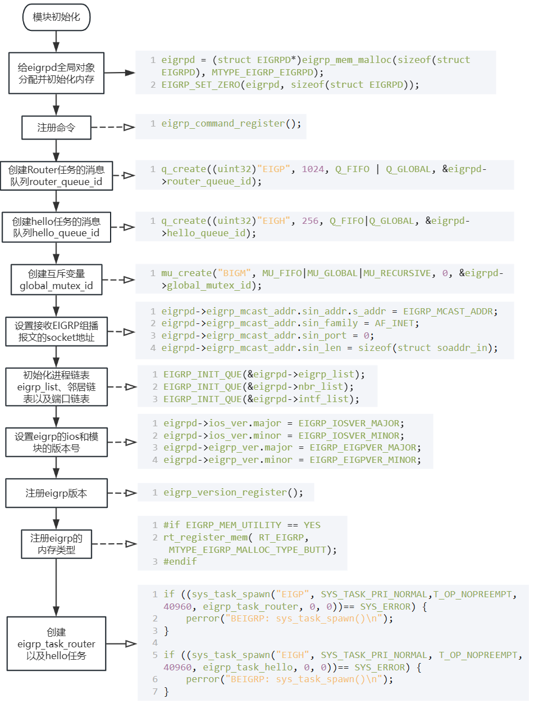

# EIGRP代码

## .h文件

### eigrp_cmd.h

```c
enum EIGRP_MALLOC_TYPE
{
	/* EIGRP  */
	MTYPE_EIGRP_EIGRPD = 0,				/* EIGRPD */
	MTYPE_EIGRP_EIGRP,					/* EIGRP */
	MTYPE_EIGRP_EIGRP_NBR,				/* EIGRP_NBR */
	MTYPE_EIGRP_EIGRP_INTF,				/* EIGRP_INTF */
	MTYPE_EIGRP_REFERENCE_IF,			/* REFERENCE_IF */
	MTYPE_EIGRP_MANUAL_SUMMARY_LIST,	/* MANUAL_SUMMARY_LIST */
	MTYPE_EIGRP_EIGRP_NETWORK_LIST,		/* EIGRP_NETWORK_LIST */

	MTYPE_EIGRP_ROUTE_NODE_LIST,		/* ROUTE_NODE_LIST */
	MTYPE_EIGRP_TOPOLOGY_ENTRY, 		/* TOPOLOGY_ENTRY */
	MTYPE_EIGRP_ENTRY_RDB,				/* ENTRY_RDB */
	MTYPE_EIGRP_SUMMARY_DATA,			/* SUMMARY_DATA */
	MTYPE_EIGRP_EXTERNAL_DATA,			/* EXTERNAL_DATA */
	MTYPE_EIGRP_rt_gateway,				/* rt_gateway */

	MTYPE_EIGRP_EIGRP_TX_Q, 			/* EIGRP_TX_Q */
	MTYPE_EIGRP_EIGRP_TX_Q_ELEM, 		/* EIGRP_TX_Q_ELEM */
	MTYPE_EIGRP_EIGRP_PKTIZE_Q, 		/* EIGRP_PKTIZE_Q */

	MTYPE_EIGRP_ENTRY_RDB_LIST, 		/* ENTRY_RDB_LIST */
	MTYPE_EIGRP_EIGRP_INTF_LIST,		/* EIGRP_INTF_LIST */
	MTYPE_EIGRP_EIGRP_NBR_LIST,			/* EIGRP_NBR_LIST */
	MTYPE_EIGRP_EIGRP_NBR_LIST_LIST,	/* EIGRP_NBR_LIST_LIST */

	MTYPE_EIGRP_MALLOC_TYPE_BUTT
};

```


### 


### eigrp_task_router任务

#### 2. 接收到Hold_Timeout消息

```c
void tq_hold_handler(struct EIGRP_NBR *nbr);
```

```
struct EIGRP_NBR *temp_nbr;
(unsigned char*)temp_nbr - ((unsigned long)(&((((struct EIGRP_NBR *)0)->ListInGlobal)))
```


## 模块入口函数


### eigrp_module_init

```c
// eigrp_init.c

// 初始化全局eigrp对象
struct EIGRPD *eigrpd=NULL;

void eigrp_module_init(void);
```

1. 首先，申请内存空间，并初始化。

```c
eigrpd = (struct EIGRPD*)eigrp_mem_malloc(sizeof(struct EIGRPD), MTYPE_EIGRP_EIGRPD);
if (NULL == eigrpd)
{
	perror("BEIGRP: eigrp_mem_malloc\n");
	return;
}
EIGRP_SET_ZERO(eigrpd, sizeof(struct EIGRPD));
```

2. 创建两个消息队列hello_queue以及router_queue，用于接收和处理消息。

```c
rc = q_create((uint32)"EIGP", 1024, Q_FIFO | Q_GLOBAL, &eigrpd->router_queue_id);
rc = q_create((uint32)"EIGH", 256, Q_FIFO | Q_GLOBAL, &eigrpd->hello_queue_id);
```

3. 创建互斥锁global_mutex

```c
rc = mu_create("BIGM", MU_FIFO|MU_GLOBAL|MU_RECURSIVE, 0, &eigrpd->global_mutex_id);
```

4. 设置全局eigrp对象的多播地址  224.0.0.10

```c
eigrpd->eigrp_mcast_addr.sin_addr.s_addr = EIGRP_MCAST_ADDR;
eigrpd->eigrp_mcast_addr.sin_family = AF_INET;
eigrpd->eigrp_mcast_addr.sin_port = 0;
eigrpd->eigrp_mcast_addr.sin_len = sizeof(struct soaddr_in);
```

5. 初始化eigrp的三个链表，eigrp_list、nbr_list以及intf_list

```c
EIGRP_INIT_QUE(&eigrpd->eigrp_list);
EIGRP_INIT_QUE(&eigrpd->nbr_list);
EIGRP_INIT_QUE(&eigrpd->intf_list);
```

6. 设置eigrp的IOS和EIGRP模块的版本信息

```c
eigrpd->ios_ver.major = EIGRP_IOSVER_MAJOR;		// 11
eigrpd->ios_ver.minor = EIGRP_IOSVER_MINOR;		// 3
eigrpd->eigrp_ver.major = EIGRP_EIGPVER_MAJOR;	// 1
eigrpd->eigrp_ver.minor = EIGRP_EIGPVER_MINOR;	// 0
```

7. 向Routing注册端口和路由事件 

```c
rt_RegisterTask(RTPROTO_EIGRP, 0, eigrp_independent_callback);
```

7. 注册命令模块以及EIGRP version

```c
eigrp_command_register();

/* register eigrp version */
eigrp_version_register();
```

8. 注册EIGRP内存统计

```c
#if EIGRP_MEM_UTILITY == YES
	rt_register_mem( RT_EIGRP,  MTYPE_EIGRP_MALLOC_TYPE_BUTT);
#endif
```

9. 创建两个任务，并将任务设置为就绪状态

```c
if ((sys_task_spawn("EIGP", SYS_TASK_PRI_NORMAL, T_OP_NOPREEMPT, 40960, eigrp_task_router, 0, 0))== SYS_ERROR) {
	perror("BEIGRP: sys_task_spawn()\n");
}
		
if ((sys_task_spawn("EIGH", SYS_TASK_PRI_NORMAL, T_OP_NOPREEMPT, 40960, eigrp_task_hello, 0, 0))== SYS_ERROR) {
	perror("BEIGRP: sys_task_spawn()\n");
}
```




## hello任务

### eigrp_task_hello

```c
// eigrp_init.c
void eigrp_task_hello(void)
{
	int rc;
	struct rt_msg msg;

	while (1)
	{
		rc = q_receive(eigrpd->hello_queue_id, Q_WAIT, 0, (unsigned long *)&msg);
		assert( rc == NOERR );

		switch(msg.type)
		{
		case MSG_EIGRP_HELLO_TIMEOUT:
			tq_hello_handler((struct EIGRP_INTF *)msg.uid);
			break;
		default:
			break;
		}
	}
}
```

#### tq_hello_handler具体处理函数

```c
void tq_hello_handler(struct EIGRP_INTF *intf)
{
	assert(intf);
	if (EIGRP_FALSE == tq_is_exist_intf(intf)) {
		return;
	}

	eigrp_tx_hello(intf, 0);
}
```

##### eigrp_tx_hello定期发送hello报文

```c
void eigrp_tx_hello(struct EIGRP_INTF *intf, uint32 sequence);
```

1. 检查接口是否是passive类型

   ```c
   if (intf->ref_if->if_passive)
   	return;
   ```

2. 向hello报文中添加TLV条目

   ```c
   p = eigrpd->send_buf + EIGRP_HDR_LENGTH;
   
   len = eigrp_append_par_tlv((struct EIGRP_TLV*)p, &intf->eigrp->metric_weight, intf->ref_if->if_hold_time);
   p += len;
   
   len = eigrp_append_sv_tlv((struct EIGRP_TLV*)p, &eigrpd->ios_ver, &eigrpd->eigrp_ver);
   p += len;
   ```


3. 触发eigrp_txpkt函数，发送Hello报文，并将端口绑定的eigrp进程发送的hello包数量+1

   ```c
   eigrp_txpkt((struct EIGRP_HDR*)eigrpd->send_buf, intf, EIGRP_HELLO, (p - eigrpd->send_buf), \
   		EIGRP_MCAST_ADDR, 0, 0, 0);
   intf->eigrp->traffic.hellos.sent++;
   ```


###### eigrp_txpkt 具体的发送报文函数

```c
static void eigrp_txpkt(struct EIGRP_HDR *pkt, struct EIGRP_INTF *intf, uint8 opcode,size_t length,uint32 to, uint32 flags, uint32 sequence,uint32 ack);
```


## router任务

### eigrp_task_router

```c
void eigrp_task_router(void)
{
	int rc;
	struct rt_msg msg;

	while (1)
	{
		rc = q_receive(eigrpd->router_queue_id, Q_WAIT, 0, (unsigned long *)&msg);
		assert( rc == NOERR );
		switch(msg.type)
		{
		case MSG_EIGRP_IP_PACKET_RCVD:
			eigrp_recv();
			break;
		case MSG_EIGRP_HOLD_TIMEOUT:
			tq_hold_handler((struct EIGRP_NBR*)msg.uid);
			break;
		case MSG_EIGRP_RTO_TIMEOUT:
			tq_rto_handler((struct EIGRP_NBR *)msg.uid);
			break;
		case MSG_EIGRP_PKTIZE_TIMEOUT:
			tq_pktize_handler((struct EIGRP_INTF *)msg.uid);
			break;
		case MSG_EIGRP_PACING_TIMEOUT:
			tq_pacing_handler((struct EIGRP_INTF *)msg.uid);
			break;
		case MSG_EIGRP_SIA_TIMEOUT:
			tq_sia_handler((struct EIGRP *)msg.uid);
			break;
		case MSG_EIGRP_METRIC_CHANGE_TIMROUT:
			tq_metric_change_handler((struct EIGRP_INTF *)msg.uid);
			break;
		case MSG_EIGRP_CLR_NBRS_TIMEOUT:
			tq_clr_nbrs_handler((void*)msg.uid);
			break;
		case MSG_EIGRP_GARBAGE_TIMEOUT:
			tq_garbage_handler((struct EIGRP *)msg.uid);
			break;
		default:
			break;
		}
		tm_wkafter(0);
	}
	return;
}
```

#### eigrp_recv 处理接收到IP数据包

```c
static void eigrp_recv(void)
```

1. 初始化接收缓冲区

   ```c
   EIGRP_SET_ZERO(eigrpd->recv_buf, EIGRP_MAXPKT);
   ```

2. 从socket套接字缓冲区获取数据

   ```c
   rc = task_receive_packet(eigrpd->eigrp_socket, &len, (struct soaddr *) &recv_addr, eigrpd->recv_buf, EIGRP_MAXPKT);
   ```

3. 解析IP数据包头部EIGRP_HDR，并获取IP包数据部分长度。

   ```c
   /**
   	struct oip_head* ip; 
   	ip = (struct oip_head *) eigrpd->recv_buf; 
   	len = (ip->ip_vhl & 0x0f) << 2; 
   	hdr = (unsigned char *) ip + len ; 
   	len = ip->ip_len - len; 
   */
   EIGRP_PARSE_IP(eigrpd->recv_buf, hdr, len);
   ```

4. 处理EIGRP报文

   ```c
   eigrp_rxpkt((struct EIGRP_HDR*)hdr, &recv_addr, len);
   ```


##### eigrp_rxpkt 

```c
void eigrp_rxpkt(struct EIGRP_HDR *hdr, struct soaddr_in *src, size_t len);
```

1. 检查此端口是否是passive端口，以及端口是否开启了eigrp协议、端口是否是loopback

   ```c
   uint32 index = ((struct soaddr_intf *)src)->sin_ifno;
   ref_if = eigrpd->rif[index];
   if (ref_if == NULL)
   	return;
   	
   name = ref_if->if_name;
   
   if(ref_if->if_passive)
   {
       eigrp_trace(TR_EIGRP_PKT_ERROR, "BEIGRP: Ignoring packet received passive interface(%s)\n", name);
       return;
   }
   
   if(!ref_if->if_eigrp_intf){
       eigrp_trace(TR_EIGRP_PKT_ERROR, "BEIGRP: Ignoring packet received on %s (not running BEIGRP)\n", name);
   	return;
   }
   
   if(TRUE == rt_get_if_loopback(index))
   {
    	eigrp_trace(TR_EIGRP_PKT_ERROR,"BEIGRP: Ignoring packet received on %s (loopback intf)\n", name);
       return;
   }
   ```

2. 检查源IP地址是否是本地地址、源地址与当前端口地址是否处于同网段；

   检查此IP对应的邻居是否存在`如果收到非邻居的非Hello报文，直接丢弃`

   ```c
   if (if_withaddr(src->sin_addr.s_addr))
   {
       eigrp_trace(TR_EIGRP_PKT_ERROR, "BEIGRP: Ignoring packet received from myself (%s)\n", ip_ntoa(src->sin_addr.s_addr));
       return;
   }
   
   if (EIGRP_FALSE == ref_if->if_unnumbered && (src->sin_addr.s_addr & ref_if->if_subnet_mask) != (ref_if->if_ipaddr & ref_if->if_subnet_mask))
   {
       eigrp_trace(TR_EIGRP_PKT_ERROR, "BEIGRP: Ignoring packet received from %s for network\n", ip_ntoa(src->sin_addr.s_addr));
       return;nbr = eigrp_nbr_lookup(ref_if->if_eigrp_intf, src->sin_addr.s_addr);
       if (NULL == nbr && EIGRP_HELLO != hdr->opcode)
       {
           eigrp_trace(TR_EIGRP_NBRS|TR_EIGRP_PKT_ERROR,
               "BEIGRP: Neighbor(%s) not yet found. hdr->opcode = %d\n",
               ip_ntoa(src->sin_addr.s_addr), hdr->opcode);
           return;
       }
   
   }
   
   nbr = eigrp_nbr_lookup(ref_if->if_eigrp_intf, src->sin_addr.s_addr);
   if (NULL == nbr && EIGRP_HELLO != hdr->opcode)
   {
       eigrp_trace(TR_EIGRP_NBRS|TR_EIGRP_PKT_ERROR,
           "BEIGRP: Neighbor(%s) not yet found. hdr->opcode = %d\n",
           ip_ntoa(src->sin_addr.s_addr), hdr->opcode);
       return;
   }
   ```

3. 对EIGRP报文头部字段进行合法性检查：

   - version：是否为2

   - Option：0~5

   - checksum

   - flag：

     - INIT-flag 只能是Update包携带；

       如果当首次收到Hello包，端口将nbr_flags会置为NBRF_WAIT_INIT，如果收到不携带INIT-FLAG的Update

     - CR-Flag：如果收到的是携带CR-Flag的非Hello，丢弃

   - ack：如果ack不为0，那么肯定是单播，源IP地址不能是EIGRP_MCAST_ADDR ？？？

   - AS


```c
// version
if (EIGRP_VERSION != hdr->version)
{
    eigrp_trace(TR_EIGRP_PKT_ERROR,
        "BEIGRP: Ignoring packet received from %s for different software version(%u/%u)\n",
        ip_ntoa(src->sin_addr.s_addr), \
        hdr->version, EIGRP_VERSION);
    return;
}

// option
if (EIGRP_UPDATE > hdr->opcode || EIGRP_HELLO < hdr->opcode)
{
    eigrp_trace(TR_EIGRP_PKT_ERROR,
        "BEIGRP: Ignoring packet received for illegal option code(%u), version %u\n",
        hdr->opcode, EIGRP_VERSION);
    return;
}

// checksum
check_sum_old = hdr->checksum;
hdr->checksum = 0;
check_sum_new = eigrp_check_sum((void*)hdr, (uint32)len);
if (check_sum_old != check_sum_new)
{
    eigrp_trace(TR_EIGRP_PKT_ERROR, \
        "BEIGRP: check_sum(0X%4X<=:0X%4X) error in received packet.\n", \
        check_sum_old, check_sum_new);
    return;
}

/* flags check */
// INIT-Flag
if (EIGRP_UPDATE != hdr->opcode && BIT_TEST(hdr->flags, INIT_BIT))
{
    eigrp_trace(TR_EIGRP_PKT_ERROR,
        "BEIGRP: Ignoring Init flags in no update packet received from neighbor(%s) in %s\n",
        nbr ? ip_ntoa(nbr->nbr_addr) : "Null",
        name);
    return;
}
else
{  /*Fengsb add this branch 2008-08-08*/ 
    eigrp_trace(TR_EIGRP_PKTS,
        "BEIGRP: eigrp_rxpkt() packet option code =%d, received from neighbor(%s) in %s\n",
        hdr->opcode,
        nbr ? ip_ntoa(nbr->nbr_addr) : "Null",
        name);
}

if (nbr && EIGRP_HELLO != hdr->opcode && BIT_TEST(nbr->nbr_flags,NBRF_WAIT_INIT) && (!BIT_TEST(hdr->flags, INIT_BIT)))
{
	eigrp_trace(TR_EIGRP_PKT_ERROR|TR_EIGRP_PKT_UPDATE, "BEIGRP: Ignoring packet received frm the nbr waiting for Init packets(%s), opcode=%d, flag=%d nbr_flag=%d\n", ip_ntoa(src->sin_addr.s_addr), hdr->opcode, hdr->flags, nbr->nbr_flags);
    return;
}

// CR-Flag
// 收到了非Hello的CR-Flag包
if (nbr && EIGRP_HELLO != hdr->opcode && nbr->nbr_if_conditional_rcv && \
        BIT_TEST(hdr->flags, CONDITIONAL_RCV_BIT))
{
    /*fengsb add trace 2007-03-07*/
    eigrp_trace(TR_EIGRP_PKT_ERROR,
        "BEIGRP: Ignoring packet received for option code(%d), head condition flag=%d\n",
        hdr->opcode, BIT_TEST(hdr->flags, CONDITIONAL_RCV_BIT));

    if (nbr->nbr_nms == hdr->sequence) {
        nbr->nbr_if_conditional_rcv = EIGRP_FALSE;
        nbr->nbr_nms = 0;
    }
    return;
}

// ACK
if (EIGRP_MCAST_ADDR == src->sin_addr.s_addr && 0 != hdr->ack)
{
    eigrp_trace(TR_EIGRP_PKT_ERROR,
        "BEIGRP: Ignoring packet received from %s for illegal Ack field(%u)\n",
        name,hdr->ack);
    return;
}

// AS
if (hdr->as_number != ref_if->if_eigrp_intf->eigrp->as_number)
{
    eigrp_trace(TR_EIGRP_PKT_ERROR,
        "BEIGRP: Ignoring packet received from %s for illegal AS Number field(%u/%u)\n",
        name,\
        hdr->as_number, \
        ref_if->if_eigrp_intf->eigrp->as_number);
    return;
}
```

4. 如果收到的是非Hello的ACK包，即Update（Ack）            `Update Init会携带Ack不为0的确认包`

```c
if (nbr && EIGRP_HELLO != hdr->opcode && 0 != hdr->ack)
{
    eigrp_rx_ack(nbr, hdr->ack);
}	
```

5. 如果收到了历史重复的可靠报文，需要检查当前nbr的可靠报文的发送队列头元素与该报文的序列号是否相同，如果不相同则不做任何操作；否则，执行eigrp_rx_ack检查完的后部分操作。

   之后，需要发送此历史报文的Ack内容

```c
// 重传ACK包
if (EIGRP_HELLO != hdr->opcode) {
    /*
    * 重传标准: 初始化报文, 序列号相同;
    *           非初始化报文, 序列号小于邻居最大序列号
    */
    // 收到重传的Update Init包
    // 收到其他非初始化的可靠报文，并且报文序列号<邻居的序列号（历史可靠数据包，需要对历史包进行确认）
    if ( ((EIGRP_UPDATE == hdr->opcode && BIT_TEST(hdr->flags, INIT_BIT)) &&\
        hdr->sequence == nbr->nbr_sequence && !BIT_TEST(nbr->nbr_flags, NBRF_WAIT_INIT)) || \
        (!(EIGRP_UPDATE == hdr->opcode && BIT_TEST(hdr->flags, INIT_BIT)) && hdr->sequence <= nbr->nbr_sequence)) 
   {            
        uint32 nbr_seq;
        eigrp_rx_ack(nbr, hdr->ack);
        nbr_seq = nbr->nbr_sequence;
        nbr->nbr_sequence = hdr->sequence;
        eigrp_tx_ack(nbr);                 /* 发送重传报文的ACK回应 */
        nbr->nbr_sequence = nbr_seq;
        eigrp_trace(TR_EIGRP_PKT_ERROR,
            "BEIGRP: Ignoring duplicate packet received from neighbor(%s) with sequence = %u(%u)\n",
            ip_ntoa(nbr->nbr_addr), \
            hdr->sequence, nbr->nbr_sequence);
        return;
    } 
    else 
    {
        if (nbr)
            nbr->nbr_sequence = hdr->sequence;
    }
}
```

6. <font color='red'>如果发现邻居设备重启了，需要优先将此邻居进行删除。</font>

```c
if (nbr && EIGRP_HELLO != hdr->opcode && (!BIT_TEST(nbr->nbr_flags,NBRF_WAIT_INIT)) && \
        BIT_TEST(hdr->flags, INIT_BIT))
{
    eigrp_trace(TR_EIGRP_PKT_ERROR|TR_EIGRP_PKT_UPDATE,
        "BEIGRP: Ignoring Init packet received from stable neighbor(%s) in %s\n",
        ip_ntoa(nbr->nbr_addr), \
        name);
    eigrp_nbr_delete(ref_if->if_eigrp_intf, nbr, PEER_RESTARTED);
    return;
}
```

7. 更新邻居的刷新时间nbr->holdtime，并且重启hold_timer定时器

```c
if (nbr)
	/**
	void eigrp_nbr_refresh(struct EIGRP_NBR *nbr)
	{
		if(!nbr || !nbr->hold_timer)
			return;
		time(&nbr->nbr_rtime);
		assert(nbr->hold_timer);
		task_timer_set( \
			nbr->hold_timer, \
			tq_hold_entry, \
			nbr->nbr_hold_time, \
			EIGRP_MAX_SCHEDULE_TIME, \
            (void*)nbr, \
			EIGRP_TRUE);
	}
	*/
	eigrp_nbr_refresh(nbr);
```

8. 区分Hello报文和Hello(Ack)报文

```c
if (EIGRP_HELLO == hdr->opcode)
{
    if (EIGRP_HDR_LENGTH == len)
    {
        hdr->opcode = EIGRP_ACK;
        if (!nbr)
        {
            /*fengsb add trace 2007-03-07*/
            eigrp_trace(TR_EIGRP_PKT_ERROR,"BEIGRP: received ack packet, but this is no nbr\n");
            return;
        }
    }
    else
    {
        hdr->opcode = EIGRP_HI;
        /*fengsb add trace 2007-03-07*/
        eigrp_trace(TR_EIGRP_PKT_ERROR,"BEIGRP: received hello packet from %s\n",\
            ip_ntoa(src->sin_addr.s_addr));
    }
}
```

9. 针对不同类型的报文，执行具体逻辑

```c
eigrp = ref_if->if_eigrp_intf->eigrp;
switch(hdr->opcode)
{
case EIGRP_UPDATE:
    eigrp_rx_update(&hdr->tlvs, nbr, (len - EIGRP_HDR_LENGTH), hdr->flags);
    eigrp->traffic.updates.received++;
    break;
case EIGRP_QUERY:
/*case EIGRP_SPECIAL:     fengsb 2007-08-08 将option code ==10的报文作为特殊的query报文*/    
    eigrp_rx_query(&hdr->tlvs, nbr, (len-EIGRP_HDR_LENGTH));
    eigrp->traffic.queries.received++;
    break;
case EIGRP_REPLY:
    eigrp_rx_reply(&hdr->tlvs, nbr, (len - EIGRP_HDR_LENGTH));
    eigrp->traffic.replies.received++;
    break;
case EIGRP_HI:
    eigrp_rx_hello(&hdr->tlvs, nbr, ref_if->if_eigrp_intf, src, (len - EIGRP_HDR_LENGTH));
    eigrp->traffic.hellos.received++;
    break;
case EIGRP_ACK: // Hello Ack
    eigrp_rx_ack(nbr, hdr->ack);
    eigrp->traffic.acks.received++;
    break;
default:
    break;
}

```


###### eigrp_rx_ack

> 此函数主要处理接收到的ACK包： Hello(Ack)、Update(Ack)

```c
void eigrp_rx_ack(struct EIGRP_NBR *nbr, uint32 ack);
```

1. 检查nbr的发送可靠报文队列（存储的是上一次发送的可靠报文，即等待被确认）队头元素的seq是否等于ack

   ```c
   if (QUE_EMPTY(&nbr->nbr_tx_q))
   		return;
   
   tx_q = nbr->nbr_tx_q.q_forw;
   elm = &tx_q->q_pkt;
   
   if (ack != elm->sequence)
       return;
   ```

2. 将原先nbr->nbr_flags为等待Ack（NBRF_WAIT_ACK）的状态重置。如果说等待确认的可靠报文是Update Init，将状态（NBRF_WAIT_INITACK）重置回去

   ```c
   BIT_RESET(nbr->nbr_flags, NBRF_WAIT_ACK);
   if (EIGRP_UPDATE == elm->opcode)
   {
       if (BIT_TEST(nbr->nbr_flags, NBRF_WAIT_INITACK))
           BIT_RESET(nbr->nbr_flags, NBRF_WAIT_INITACK);
   }
   ```

3. 重新计算与此nbr的SRTT平均往返时间

   ```c
   curr_time = time_msec;
   curr_time -= nbr->nbr_last_reliable_sent;
   if (0 == nbr->nbr_srtt)
       nbr->nbr_srtt = curr_time;
   else
   	nbr->nbr_srtt = nbr->nbr_srtt*2/10 + curr_time*8/10;
   ```

4. 设置nbr重传的一些参数

   ```c
   nbr->nbr_last_rto = nbr->nbr_rto;  // 上一次重传的间隔
   nbr->nbr_rto = 0;				   // 当前重传的间隔
   nbr->nbr_retries = 0;			   // 当前重传次数
   ```

5. 关闭RTO重传定时器

   ```c
   task_timer_set( 
   		nbr->nbr_rto_timer, 
   		tq_rto_entry, 
   		0,
   		0, 
   		(void *)nbr, EIGRP_FALSE);
   ```

6. 将已确认的报文从可靠报文传输队列中移除

   ```c
   EIGRP_RCVQUE(tx_q);
   eigrp_mem_free(tx_q, MTYPE_EIGRP_EIGRP_TX_Q);
   ```

7. 如果可靠报文队列不为空，则继续重传尚未确认的可靠报文

   ```c
   if (!QUE_EMPTY(&nbr->nbr_tx_q))
   {
       tq_rto_handler(nbr);
   }
   ```

   

###### eigrp_rx_hello

> 处理接收到的Hello报文中的TLV条目

```c
static void eigrp_rx_hello(struct EIGRP_TLV *tlv, struct EIGRP_NBR *newnbr, struct EIGRP_INTF *intf, struct soaddr_in *src, size_t tlvs_len)
```

1. 遍历TLV条目

   ```c
   struct EIGRP_TLV *curr_tlv;
   curr_tlv = tlv;
   len = tlvs_len;
   
   while(curr_tlv && len > 0 && 0 != curr_tlv->length)
   {
       switch(curr_tlv->type)
       {
       case TLV_PAR:
           // 检查K1、K2、K3、K4、K5是否与当前eigrp进程一致
           if( (hold_time = eigrp_rx_get_param(intf->eigrp, curr_tlv)) == 0 )
           {
               if (newnbr)
               {
                   /*Fengsb add this debug 2007-05-25*/
                   eigrp_trace(TR_EIGRP_NBRS, \
                       "BEIGRP: eigrp_rx_hello del Neighbor %s on %s.\n",\
                       ip_ntoa(newnbr->nbr_addr), \
                       newnbr->nbr_if_name);
                   // 删除邻居
                   eigrp_nbr_delete(intf, newnbr, PEER_RESTARTED);
               }
               return;
           }            
           break;
       case TLV_SEQ:
           if(EIGRP_FALSE == is_sequence_match)
           {
               // 检查SEQ_TLV中的addr列表中是否有当前端口的ip地址，有返回True
               is_sequence_match = eigrp_rx_get_sequence(newnbr, curr_tlv);
           }
           break;
       case TLV_SV:
           // 获取Software version TLV中的ios和eigrp模块的版本号
           is_softver = eigrp_rx_get_softver(&nbr_ios_ver, &nbr_eigrp_ver, curr_tlv);
           break;
       case TLV_NMS: 
           // 获取下一个组播序列号地址
           next_sequence = eigrp_rx_get_next_sequence(curr_tlv);
           break;
       case TLV_IP_INT:
       case TLV_IP_EXT:
           assert(0);
           break;
       default:
           break;
       }
   
       len -= curr_tlv->length;
       curr_tlv = (struct EIGRP_TLV *) (((uint8 *)(curr_tlv)) + curr_tlv->length);
   }
   ```

2. 如果当前邻居是首次发现的，则需创建一个新的邻居对象，添加至eigrp->nbr_list，状态标识位置为NBRF_WAIT_INIT

   ```c
   if (!newnbr)
   {
       newnbr = eigrp_nbr_get(intf->eigrp, intf, src->sin_addr.s_addr, NBR_DISCOVERED);
       if (NULL == newnbr)
       {
           eigrp_trace(TR_EIGRP_NBRS, "BEIGRP: eigrp_rx_hello alloc new neighbor mem failure.\n");
           return;
       }
       BIT_SET(newnbr->nbr_flags, NBRF_WAIT_INIT);
       nbr_newly = EIGRP_TRUE;
      
   }
   ```

3. 设置nbr邻居对象的一些配置信息

   ```c
   if (is_sequence_match)
   { 
       // 设置不接收该nbr的下一个组播报文
       newnbr->nbr_nms = next_sequence; 
       newnbr->nbr_if_conditional_rcv = EIGRP_TRUE;
   }
   
   if (is_softver)
   {
       newnbr->nbr_ios_ver.major = nbr_ios_ver.major;
       newnbr->nbr_ios_ver.minor = nbr_ios_ver.minor;
       newnbr->nbr_eigrp_ver.major = nbr_eigrp_ver.major;
       newnbr->nbr_eigrp_ver.minor = nbr_eigrp_ver.minor;
   }
   ```

4. 如果Hello报文携带的hold_time不等于当前邻居的hold_time

   ```c
   if(0 != hold_time && newnbr->nbr_hold_time != hold_time)
   {
       newnbr->nbr_hold_time = hold_time;
       if (!nbr_newly)
       {
           task_timer_set( \
                       newnbr->hold_timer, \
                       tq_hold_entry, \
                       newnbr->nbr_hold_time, \
                       EIGRP_MAX_SCHEDULE_TIME, \
                       (void*)newnbr, \
                       EIGRP_TRUE);
       }
   }
   ```

5. 如果是新发现邻居，需要初始化nbr的信息，并创建2个定时器；并构造Update Init报文，发送整个拓扑表信息

   ```c
   if (nbr_newly){
   	eigrp_nbr_add(intf, newnbr, NEW_ADJACENCY);
   }
   ```

   


### 发送可靠报文

#### eigrp_tx_update

#### eigrp_tx_query

#### eigrp_tx_reply

#### eigrp_tx_ack

```c
void eigrp_tx_ack(struct EIGRP_NBR *nbr)
{
	eigrp_txpkt( \
		(struct EIGRP_HDR*)eigrpd->send_buf, \
		nbr->intf, \
		EIGRP_HELLO, \
		EIGRP_HDR_LENGTH, \
		nbr->nbr_addr, \
		0, 0, \
		nbr->nbr_sequence);

	nbr->intf->eigrp->traffic.acks.sent++;
}
```


##### eigrp_txpkt最终发送数据包

```c
static void eigrp_txpkt(struct EIGRP_HDR *pkt, struct EIGRP_INTF *intf,
	uint8 opcode, size_t length, uint32 to, uint32 flags,
	uint32 sequence, uint32 ack);
```

```c
// 1. 检查端口是否是正在被删除状态 `INTF_BEING_DELETE`；以及检查端口是否是回环接口
if (BIT_TEST(intf->intf_flags, INTF_BEING_DELETE))	{
	return;
}

if(EIGRP_TRUE == rt_get_if_loopback(intf->ref_if->if_index))
{
	return;
}

// 2. 检查目的地址是否是组播地址，如果是组播地址，设置组播数据包的 TTL（生存时间）为默认值 1，并使得端口能接收组播数据包；否则，接收单播数据包
/* set sending option */
if (INET_CLASSF_MULTICAST == inet_class_flags(to))
{
	rc = task_set_option(eigrpd->eigrp_socket, TASKOPTION_MULTI_TTL, DEFAULT_TTL);
	if(rc != 0)
	{
   		eigrp_trace(TR_EIGRP_PROTO, "BEIGRP: task setsockopt ERROR \n");
        return;
   	}
    // 设置端口能接收组播数据包
	rc = task_set_option_if(eigrpd->eigrp_socket, intf->ref_if->if_index, to, EIGRP_TRUE);
}
else
{
	rc = task_set_option(eigrpd->eigrp_socket, TASKOPTION_TTL, DEFAULT_TTL);
	if(rc != 0)
    {
    	eigrp_trace(TR_EIGRP_PROTO, "BEIGRP: task setsockopt ERROR \n");
        return;
    }
	rc = task_set_option_if(eigrpd->eigrp_socket, intf->ref_if->if_index, to, EIGRP_FALSE);
}


// 3. 填充EIGRP数据包的头部
EIGRP_SET_ZERO(pkt, EIGRP_HDR_LENGTH);

pkt->version = EIGRP_VERSION;
pkt->opcode = opcode;
pkt->checksum = 0;
pkt->flags = flags;
pkt->sequence = sequence;
pkt->ack = ack;
pkt->as_number = intf->eigrp->as_number;

check_sum = eigrp_check_sum((void*)pkt, (uint32)length);
pkt->checksum = check_sum;

// 4. 构建一个目标地址结构 `addr_dest`，并通过调用 `task_send_packet` 函数发送数据包。
addr_dest.sin_len = sizeof(struct soaddr_in);
addr_dest.sin_family = AF_INET;
addr_dest.sin_addr.s_addr = to;

/* call the task function of routing */
rc = task_send_packet(eigrpd->eigrp_socket, (void*)pkt, length, flag, &addr_dest);
```


### 定时器任务

#### RTO重传定时器

##### tq_rto_entry发送超时消息

```c
void tq_rto_entry(task_timer *tip)
{
	struct rt_msg msg; 
    int rc; 
    msg.type = MSG_EIGRP_RTO_TIMEOUT; 
    msg.uid = (uint32)tip->task_timer_data; 
    msg.len = 0; 
    msg.param = 0; 
    
    rc = q_send(eigrpd->router_queue_id, (ULONG*)&msg); 
    if(rc) 
        eigrp_trace(TR_EIGRP_ALL, "send message to eigrp router task error "
        	"[type: %X, UID: %X, len: %X, PAR: %X]!\n", 
        	type1, uid1, len1, param1); 
}
```

##### tq_rto_handler超时处理函数

> 重传nbr的可靠报文队列中未确认的报文

```c
void tq_rto_handler(struct EIGRP_NBR *nbr);
```

1. 检查nbr在全局eigrpd的nbr_list中是否存在

   ```c
   if (EIGRP_FALSE == tq_is_exist_nbr(nbr)) {
       return;
   }
   ```

2. 关闭RTO定时器

   ```c
   task_timer_set( 
   		nbr->nbr_rto_timer, 
   		tq_rto_entry, 
   		0,
   		0, 
   		(void *)nbr, EIGRP_FALSE);
   ```

3. 如果nbr的nbr_tx_q的可靠报文队列不为空，重传报文  `!QUE_EMPTY(&nbr->nbr_tx_q)` 

   ```c
   if (!QUE_EMPTY(&nbr->nbr_tx_q))
   {
       nbr->nbr_retries++;
       nbr->nbr_retrans++;  // 总的重传次数
   
       if (!BIT_TEST(nbr->nbr_flags, NBRF_BEING_DELETE))
       {
           eigrp_trace(TR_EIGRP_PKT_RETRY, \
               "BEIGRP: resend %s packet for neighbor %s with retry num %d and interval %u*10 ms.\n", \
               eigrp_rx_opcode_name_get(nbr->nbr_tx_q.q_forw->q_pkt.opcode), \
               ip_ntoa(nbr->nbr_addr), \
               nbr->nbr_retries, \
               nbr->nbr_rto);
       }
   
       // 设置等待该可靠报文的确认状态
       BIT_SET(nbr->nbr_flags, NBRF_WAIT_ACK);
      
       /* nbr->nbr_last_reliable_sent = time_msec; */  // 在inft->pacing定时器发送前设置，此处添加到队列后按FIFO顺序发送
       
       // 如果可靠报文的flags不是条件接收模式？？？？？？？？
       assert(!BIT_TEST(nbr->nbr_tx_q.q_forw->q_pkt.flags, CONDITIONAL_RCV_BIT));
       // 将向邻居发送的首个可靠报文添加到intf的发送可靠报文队列intf->pacing_q中
       eigrp_insert_intf_pacingq(nbr->intf, &nbr->nbr_tx_q.q_forw->q_pkt);
   
       /* caculate the new rto time */
       nbr->nbr_last_rto = nbr->nbr_rto;
       /* 
       nbr->nbr_last_rto ? (min(500, max(20, 3*(nbr->nbr_last_rto)/2))):(6*max(nbr->nbr_srtt, nbr->intf->pacing_interval))
       */
       nbr->nbr_rto = NEW_RTO(nbr);
   
       task_timer_set( 
           nbr->nbr_rto_timer, 
           tq_rto_entry, 
           nbr->nbr_rto|TIMER_UNIT_10MSEC,
           EIGRP_MAX_SCHEDULE_TIME, 
           (void *)nbr, 
           EIGRP_TRUE);
   }
   ```

   

#### Pacing可靠报文定期发送定时器

- 开启

```c
task_timer_set( 
    intf->pacing_timer, 
    tq_pacing_entry, 
    intf->pacing_interval | TIMER_UNIT_10MSEC, 
    EIGRP_MAX_SCHEDULE_TIME, 
    (void*)intf, 
    EIGRP_TRUE);
```


##### tq_pacing_entry发送超时消息

```
void tq_rto_entry(task_timer *tip)
{
	struct rt_msg msg; 
    int rc; 
    msg.type = MSG_EIGRP_PACING_TIMEOUT; 
    msg.uid = (uint32)tip->task_timer_data; 
    msg.len = 0; 
    msg.param = 0; 
    
    rc = q_send(eigrpd->router_queue_id, (ULONG*)&msg); 
    if(rc) 
        eigrp_trace(TR_EIGRP_ALL, "send message to eigrp router task error "
        	"[type: %X, UID: %X, len: %X, PAR: %X]!\n", 
        	type1, uid1, len1, param1); 
}
```

##### tq_pacing_handler超时处理函数

```c
void tq_pacing_handler(struct EIGRP_INTF *intf);
```

1. 检查参数intf是否在全局eigrpd对象的intf_list中

   ```c
   if (EIGRP_FALSE == tq_is_exist_intf(intf)) {
       return;
   }
   ```

2. 关闭intf->pacing_timer定时器

   ```c
   task_timer_set( \
       intf->pacing_timer, \
       tq_pacing_entry, \
       0, \
       0, \
       (void*)intf, \
       EIGRP_FALSE);
   ```

3. 当端口对象的可靠报文队列不为空

   ```c
   if (!QUE_EMPTY(&intf->pacing_q))
   {
       tx_q = intf->pacing_q.q_forw;
       elm = &tx_q->q_pkt;
   
       if (elm->nbr)
       {
           elm->nbr->nbr_last_reliable_sent = time_msec;
           assert(!BIT_TEST(elm->flags, CONDITIONAL_RCV_BIT));
       }
       else
       {
           EIGRP_PROCESS_MLOCK;
           QUE_LIST(nbr, &intf->nbr)
           {
               nbr->nbr_last_reliable_sent = time_msec;
           }QUE_LIST_END(nbr, &intf->nbr);
           EIGRP_PROCESS_MUNLOCK;
       }
   
       // 如果不是passive接口
       if (!intf->ref_if->if_passive)
       {
           EIGRP_SET_ZERO(eigrpd->send_buf, EIGRP_MAXPKT);
           switch (elm->opcode)
           {
               case EIGRP_UPDATE:
                   eigrp_tx_update(intf, elm);
                   break;
               case EIGRP_QUERY:
                   eigrp_tx_query(intf, elm);
                   break;
               case EIGRP_REPLY:
                   eigrp_tx_reply(intf, elm);
                   break;
               default:
                   assert(0);
                   break;
           }
       }
   
       // 从可靠报文队列中删除
       EIGRP_RCVQUE(tx_q);
       eigrp_mem_free(tx_q, MTYPE_EIGRP_EIGRP_TX_Q);
   } 
   ```

4. 如果队列依旧不为空，继续开启定时器

   ```c
   if (!QUE_EMPTY(&intf->pacing_q))
   {
       task_timer_set( \
           intf->pacing_timer, \
           tq_pacing_entry, \
           intf->pacing_interval|TIMER_UNIT_10MSEC, \
           EIGRP_MAX_SCHEDULE_TIME, \
           (void*)intf, \
           EIGRP_TRUE);
   }
   ```


#### HoldTime定时器

##### tq_hold_entry发送邻居超时消息

```c
void tq_hold_entry(task_timer *tip)
{
    struct rt_msg msg; 
    int       rc; 
    msg.type = MSG_EIGRP_HOLD_TIMEOUT; 
    msg.uid = (uint32)tip->task_timer_data; 
    msg.len = 0; 
    msg.param = 0; 
    rc = q_send(eigrpd->router_queue_id, (ULONG*)&msg); 
    if(rc) 
        eigrp_trace(TR_EIGRP_ALL, "send message to eigrp router task error "
        "[type: %X, UID: %X, len: %X, PAR: %X]!\n", 
        type1, uid1, len1, param1); 
}
```

##### tq_hold_handler超时处理函数

```c
void tq_hold_handler(struct EIGRP_NBR *nbr);
```

```c
void tq_hold_handler(struct EIGRP_NBR *nbr)
{
	if (EIGRP_FALSE == tq_is_exist_nbr(nbr)) {
		return;
	}

	task_timer_set( \
			nbr->hold_timer, \
			tq_hold_entry, \
			0,\
			0, \
			(void *)nbr, EIGRP_FALSE);

	if (!BIT_TEST(nbr->nbr_flags, NBRF_BEING_DELETE))
	{
		eigrp_trace( \
			TR_EIGRP_NBRS, \
			" BEIGRP: neigrbor %s Hold time expired.\n", \
			ip_ntoa(nbr->nbr_addr));
        // 删除邻居操作
		eigrp_nbr_delete(nbr->intf, nbr, HOLDING_TIME_EXPIRED);
	}
}
```


### nbr邻居相关处理函数


#### eigrp_nbr_add

> 当创建”直连“邻居和邻居发现时，调用此函数

```c
void eigrp_nbr_add(struct EIGRP_INTF *intf, struct EIGRP_NBR *nbr, enum NBRCHANGE_REASON reason);
```

1. 检查如果nbr是邻居发现的

   ```c
   if (NBR_DISCOVERED == nbr->nbr_source)
   {
       intf->nbrs++;
       // 添加一个新邻居时，更新端口的eigrp平均占用带宽
       // eigrpd->rif[if_index]->if_bw_percent = nbrs <= 2 ? DEFAULT_BW_PERCENT : (100 / nbrs);
       eigrp_bw_percent_default(intf->ref_if->if_index);
   }
   ```

2. 设置邻居nbr的相关字段

   ```
   time(&nbr->nbr_ctime); // 创建时间
   time(&nbr->nbr_rtime); // 刷新时间
   nbr->nbr_sequence = 0; // 最近一次从邻居收到的可靠报文的sequence
   nbr->nbr_retrans = nbr->nbr_retries = 0; // 向邻居重传的当前次数以及总次数
   nbr->nbr_srtt = 0;		// 平均往返时间
   nbr->nbr_last_rto = 0;  // 上一次传输可靠报文的时间间隔
   nbr->nbr_if_conditional_rcv = 0; // CR模式
   nbr->nbr_nms = 0;		// 忽略从该邻居的下一个序列号的可靠报文
   nbr->nbr_flags = NBRF_WAIT_INIT;  // 等待Update Init报文
   nbr->nbr_rto = NEW_RTO(nbr);	  // 向邻居发送可靠报文的间隔
   ```

3. 初始化nbr两个队列

   ```c
   EIGRP_INIT_QUE(&nbr->nbr_tx_q);
   EIGRP_INIT_QUE(&nbr->nbr_unreply_list_list);
   ```

4. 如果邻居是新发现的，创建hold_time定时器(开启)以及RTO重传定时器

   **<font color='red'>构造Update Init报文并发送整个拓扑表信息</font>**

   ```c
   if (NBR_DISCOVERED == nbr->nbr_source)
   {
       /* create hold timer and rto timer */
       nbr->hold_timer = task_timer_create(\
           "EIGRP_HOLD", \
           tq_hold_entry, \
           0,\
           nbr->nbr_hold_time, \
           nbr->nbr_hold_time,\
           (void *)nbr, EIGRP_TRUE);
   
       nbr->nbr_rto_timer = task_timer_create(\
           "EIGRP_RTO", \
           tq_rto_entry, \
           0,\
           3000|TIMER_UNIT_10MSEC, \
           nbr->nbr_rto|TIMER_UNIT_10MSEC,\
           (void *)nbr, EIGRP_FALSE);
   	
       
       eigrp_send_startup(nbr);
   }
   ```

   


## 命令

```c
u->struct_s[0] = as_number;
u->struct_s[3] = vrf_id;

u->struct_p[0] = net_addr;
```


### network

执行`network A.B.C.D`命令后，会调用 eigrp_cmd_network 函数：

1. 首先检查argc是否小于2，如果小于2，提示命令不完整，并直接返回

2. 获取参数net_addr的值

   ```c
   switch (getaddress(&net_addr, argc, argv, u))
   {
   	case ARG_NOERR:
   		break;
       case ARG_GENER:
           return -1;
       case ARG_PARAM:
            eng_chi(u, "Incomplete command", "命令不完整");
            return -1;
   	case ARG_QUEST:
       case ARG_QUERY:
            eng_chi(u,"  A.B.C.D                -- Network number",\
                    	"  A.B.C.D                -- 网络地址");
            return 1;
       default:
            eng_chi(u, "Incomplete command", "命令不完整");
            return -1;
   }
   
   argc--;
   argv++;
   ```

3. 如果不携带mask的network命令，检查eigrp进程是否存在

   3.1 如果存在获取network的自然掩码，执行`eigrp_network_specify`函数

   ```c
   eigrp_network_specify(as_number, net_addr&net_mask, net_mask, EIGRP_TRUE);
   ```

   3.2 如果携带mask的network命令，继续调用子命令`subcmd(eigrp_network_mask, NULL, argc, argv, u);`，并执行eigrp_cmd_network_mask 函数

   ​	1. 获取参数net_mask，并检查net_mask参数的合法性

   ```c
   switch (getaddress(&net_mask, argc+1, argv-1, u))
   {
   	case ARG_NOERR:
       	break;
       case ARG_GENER:
           return -1;
       case ARG_PARAM:
           eng_chi(u, "Incomplete command", "命令不完整");
           return -1;
       case ARG_QUEST:
       case ARG_QUERY:
           eng_chi(u, "  A.B.C.D                -- Network mask",
                      "  A.B.C.D                -- 网络掩码");
           return 1;
       default:
           eng_chi(u, "Incomplete command", "命令不完整");
           return -1;
   }
   
   rc = cmdend(argc - 1, argv + 1, u);
   if (rc)
   {
   	return rc;
   }
   
   if (0 != net_mask && (!check_mask(net_mask)))
   {
   	eng_chi(u, "Network mask error",
                  "网络掩码错误");
   	return -1;
   }
   ```

   ​		2. 执行`eigrp_network_specify(as_number, net_addr&net_mask, net_mask)`函数

#### eigrp_network_specify函数

​	首先，查找全局对象eigrpd的整个eigrp_list进程链表，找到network是否在多个进程中重复覆盖，如果该网段已经被某个进程宣告了，则直接返回		

```c
EIGRP_PROCESS_MLOCK;
	QUE_LIST(temp_eigrp, &eigrpd->eigrp_list)
	{
#ifdef VRF_MODULE
		if( temp_eigrp->vrfid != vrf_id )
		{
			continue;
		}
#endif

		QUE_LIST(network_list, &temp_eigrp->network_list)
		{
			/* the old prefix smaller than the config one */
			if ((network_list->network_number&network_list->subnet_mask& \
				subnet_mask) == (network_number&network_list->subnet_mask& \
				subnet_mask))
			{
					vty_output( \
						"BEIGRP: This network has intersection with network %s\n",\
						ip_ntoa(network_list->network_number));
					EIGRP_PROCESS_MUNLOCK;
					return;
			}
		}QUE_LIST_END(network_list, &temp_eigrp->network_list);
	}QUE_LIST_END(temp_eigrp, &eigrpd->eigrp_list);
EIGRP_PROCESS_MUNLOCK;
```

​	否则，新建并初始化一个network_list节点，并添加到当前eigrp进程的network_list链表中。

```c
network_list = (struct EIGRP_NETWORK_LIST*)eigrp_mem_malloc(sizeof(struct EIGRP_NETWORK_LIST), MTYPE_EIGRP_EIGRP_NETWORK_LIST);

if (NULL == network_list)
{
	vty_output("BEIGRP: eigrp_mem_malloc()\n");
	return;
}
	
EIGRP_SET_ZERO(network_list, sizeof(struct EIGRP_NETWORK_LIST));
EIGRP_INIT_QUE(network_list);
network_list->if_major_network = if_major_network;
network_list->network_number = network_number;
network_list->subnet_mask = subnet_mask;
EIGRP_INSQUE(network_list, eigrp->network_list.back);
```

​	如果接口的ip地址处于network宣告的网段，则调用`eigrp_intf_enable`**激活端口**

```c
for (i=0;i<MAX_DEVICES;i++)
{
	if (!eigrpd->rif[i])
		continue;
		
	/* the link is down */
	if (EIGRP_FALSE == eigrpd->rif[i]->if_linkup)
			continue;
			
	/* the address is not covered by the network config*/
#ifdef VRF_MODULE
	if( (network_number == (eigrpd->rif[i]->if_ipaddr&subnet_mask))
			&& (subnet_mask <= eigrpd->rif[i]->if_subnet_mask)
			&& (eigrpd->rif[i]->vrfid == eigrp->vrfid) )
#else
	if((network_number == (eigrpd->rif[i]->if_ipaddr & subnet_mask))
			&& (subnet_mask <= eigrpd->rif[i]->if_subnet_mask))
#endif
	{
		eigrp_intf_enable(eigrpd->rif[i], eigrp);
	}
}
```

##### eigrp_intf_enable函数

###### struct EIGRP_INTF结构体

```c
/**
 EIGRP_INTF对象存储在REFERENCE_IF->if_eigrp_intf下、当前进程eigrp->intf_list中
 EIGRP_INTF->ListInGlobal存储在全局对象的eigrpd->intf_list中
*/
struct EIGRP_INTF
{
	struct EIGRP_INTF *intf_forw, *intf_back;
	tEIGRP_DLL_HDR	ListInGlobal;

	struct REFERENCE_IF *ref_if;	/* Intf对应的REFERENCE IF*/
	struct EIGRP *eigrp;	/*Intf所属的EIGRP进程*/
	uint16 intf_flags;	/*Intf的标志位*/
	uint16 nbrs;				/* Intf上所发现的邻居个数。*/

	struct EIGRP_NBR nbr;	/*Intf上所发现的邻居列表。链表头表示自己。*/
	task_timer *hello_timer;	/* 周期性发送Hello报文的定时器。*/
	struct EIGRP_TX_Q pacing_q;	/* 发送可靠报文的队列。链表头不使用。*/
	time_t pacing_interval;	/* Intf上发送可靠报文的定步间隔。单位：毫秒。 */
	task_timer *pacing_timer;	/* 可靠报文定步发送的定时器。 */
	time_t last_reliable_sent;	/* 最近一次可靠报文的发送时间。(时间戳，调用time可获得。可参考bgp_print_time函数实现类似Cisco时间格式的打印) */
	time_t mean_srtt;	/* Intf上所有邻居平滑回程时间的平均值。单位：毫秒。 */
	struct EIGRP_PKTIZE_Q pktize_q;	/* 准备封包的队列。链表头不使用。 */
	task_timer *pktize_timer;	/* Intf上的封包定时器。 */
	task_timer *metric_change_timer;	/* 延迟处理端口MetricChange的定时器。超时后重新计算来自intf上所有邻居的路由。如果该字段非0，表示已经启动了intf上的MetricChange事件。  */
	uint32 vrf_id;
};
```

1. 首先，检查该端口下是否存在eigrp_inft对象，如果有，则直接返回；否则，新建一个eigrp_intf接口对象，并初始化

```c
// 函数int eigrp_intf_enable(struct REFERENCE_IF *ref_if,struct EIGRP *eigrp)
if (ref_if->if_eigrp_intf)
	return EIGRP_SUCC;

intf = (struct EIGRP_INTF *)eigrp_mem_malloc(sizeof(struct EIGRP_INTF), MTYPE_EIGRP_EIGRP_INTF);

if (NULL == intf)
	return EIGRP_FAIL;

EIGRP_SET_ZERO(intf, sizeof(struct EIGRP_INTF));
EIGRP_INIT_QUE(intf);
EIGRP_INIT_QUE(&intf->ListInGlobal);

// 挂载到ref_if下
ref_if->if_eigrp_intf = intf;
intf->eigrp = eigrp;
intf->ref_if = ref_if;

// 添加到eigrp的端口链表中
EIGRP_INSQUE(intf, eigrp->intf_list.intf_back);
EIGRP_INSQUE(&intf->ListInGlobal, eigrpd->intf_list.eigrp_back);
	
EIGRP_INIT_QUE(&intf->pacing_q);  // 发送可靠报文的队列
EIGRP_INIT_QUE(&intf->pktize_q);  // 准备封包的队列
EIGRP_INIT_QUE(&intf->nbr);		  // 初始化该端口发现的邻居

/*
* 设置端口发送可靠报文的间隔：
	(((8*100*mtu)/(10*bw*percent)<1))?1:(8*100*mtu)/(10*bw*percent)
	
	if_bw_percent: 保存"ip eigrp bandwidth-per"的配置。端口创建时设置为确省值DEFAULT_BW_PERCENT。*/
*/

intf->pacing_interval = EIGRP_PACING_INTERVAL(ref_if->if_metric.mtu, ref_if->if_metric.bandwidth, ref_if->if_bw_percent);
```

2. 设置端口能够发送/接收组播报文

```c
task_set_option_group(eigrpd->eigrp_socket,
			     TASKOPTION_GROUP_ADD,
				 ref_if->if_index,
				 &eigrpd->eigrp_mcast_addr);
```

3. 创建eigrp端口的定时器

```c
if (EIGRP_TRUE != ref_if->if_passive && (!rt_get_if_loopback(ref_if->if_index)))
{
#define FIRST_HELLO_TIME     ((uint16)(1 + rand()%4))
	init_time = FIRST_HELLO_TIME;
	intf->hello_timer = task_timer_create(\
		"EIGRP_HELLO", \
		tq_hello_entry, \
		0,\
		init_time, \
		ref_if->if_hello_interval,\
		(void *)intf, TIMERF_ENABLE);
}

intf->pacing_timer = task_timer_create(\
			"EIGRP_PACING", \
			tq_pacing_entry, \
			0,\
			intf->pacing_interval | TIMER_UNIT_10MSEC, \
			intf->pacing_interval | TIMER_UNIT_10MSEC,\
			(void *)intf, EIGRP_FALSE);

intf->pktize_timer = task_timer_create(\
			"EIGRP_PKTIZE", \
			tq_pktize_entry, \
			0,\
			DEFAULT_PKTIZE_TIME, \
			DEFAULT_PKTIZE_TIME,\
			(void *)intf, EIGRP_FALSE);
```

4. 如果端口下设置了` ip beigrp summary-address` 命令，即存在ref_if->if_summary_list，进行手动汇总，添加手动汇总路由

```c
p.family = AF_INET;
p.safi = SAFI_UNICAST;

EIGRP_PROCESS_MLOCK;
QUE_LIST(summary_list, &ref_if->if_summary_list)
{
	p.prefixlen = (unsigned char)mask_to_prefix(summary_list->subnet_mask);
	p.u.prefix4.s_addr = summary_list->network_address;
	eigrp_manual_summary_report(eigrp, intf, &p);
}QUE_LIST_END(summary_list, &ref_if->if_summary_list);
EIGRP_PROCESS_MUNLOCK;
```


###### eigrp_manual_summary_report函数

```c
int eigrp_manual_summary_report(struct EIGRP *eigrp, struct EIGRP_INTF *intf, struct prefix *prefix);
```

1. 检查端口是否在eigrp进程端口列表中，如果没有直接返回；否则，调用`eigrp_summary_rdb_get`，检查该prefix表示的网络前缀地址是否已被汇总。

   -- 如果没有被汇总，则调用`eigrp_summary_rdb_get`	

```c
/* 2.	端口是否在进程端口列表中，否则返回 */
if (!EIGRP_LIST_IS_IN_QUE(intf, &eigrp->intf_list))
	return EIGRP_FAIL;

/* 3.	网络地址是否已自动汇总 */
	/*
    * 从eigrp的topology表中查询：node = route_node_lookup(eigrp->topology, p);
    *	node->info下挂载TOPOLOGY_ENTRY路由条目entry，遍历entry->rdbs链表（RDB记录经过一个邻居到达目标网络的路径信息）
		EIGRP_PROCESS_MLOCK;
		QUE_LIST(rdb, &entry->rdbs)
		{
			if (rdb->summary != NULL)
			{
				EIGRP_PROCESS_MUNLOCK;
				return rdb;
			}
		}QUE_LIST_END(rdb, &entry->rdbs);
		EIGRP_PROCESS_MUNLOCK;
    */
manual_rdb = eigrp_summary_manual_find_rdb(eigrp, prefix);
if (manual_rdb == NULL)
{
    
	manual_rdb = eigrp_summary_rdb_get(eigrp, prefix, &rdb_is_new);
	if (NULL == manual_rdb)
		return EIGRP_FAIL;
	manual_rdb->summary->if_automatic = EIGRP_FALSE;
}
else
{
    ？？？？？？？？？？？？？？？？？
        ？？？？？？？？？？？？
	if (manual_rdb->summary->if_automatic)
		return EIGRP_FAIL;
}
```


5. ？？？？

```c
eigrp_summary_intf_enable(intf);

```


6.  执行`eigrp_connected_report`

###### eigrp_connected_report函数

```c
eigrp_connected_report(intf);
// int eigrp_connected_report(struct EIGRP_INTF *intf)
```

​	6.1 检查eigrp端口状态是否是`INTF_BEING_DELETE`，如果不是，则需要调用`eigrp_nbr_get`创建一个新的**直连**邻居。

```c
/**
	针对于NBR_CONNECTED的邻居
		此函数首先会从eigrp->dead_nbr_list中查询（addr、NBR_CONNECTED）,如果找到，则将其从dead_nbr_list中移除，并添加到eigrp->nbr_list中；并添加为端口intf的nbr链表的头节点（而通过NBR_DISCOVERED邻居发现的节点，是插入intf->nbr.back）。
	否则，如果没有找到，则新建一个EIGRP_NBR邻居节点以及EIGRP_NBR_LIST链表节点：
		EIGRP_INIT_QUE(nbr_list);
		nbr_list->nbr = nbr;
		EIGRP_INSQUE(nbr_list, eigrp->nbr_list.nbr_back);添加到eigrp的nbr_list链表下
		
		EIGRP_SET_ZERO(nbr, sizeof(struct EIGRP_NBR));
		EIGRP_INIT_QUE(nbr);
		EIGRP_INIT_QUE(&nbr->ListInGlobal);
		EIGRP_INIT_QUE(&nbr->nbr_rdb_list);

		nbr->nbr_source = nbr_source;
		nbr->nbr_addr = nbr_addr;
		nbr->intf = intf;
		nbr->nbr_if_eterid = intf->ref_if->if_eterid;
		strcpy(nbr->nbr_if_name, intf->ref_if->if_name);
		
		// 添加到端口inft的nbr链表下
		EIGRP_INSQUE(nbr, &intf->nbr);  
		
		//（而通过邻居发现的节点，是插入intf->nbr.back：即 EIGRP_INSQUE(nbr, intf->nbr.nbr_back);）
*/
nbr = eigrp_nbr_get(intf->eigrp, intf, intf->ref_if->if_ipaddr, NBR_CONNECTED);
```


7. 如果是首次开启了eigrp进程，创建socket，并进行报文重定向。

```c
/*Fengsb add 2014-09-12 首次active the firset eigrp interface，
	创建socket，并需要设置报文重定向*/
	EIGRP_PROCESS_MLOCK;
	if(!eigrpd->active_ifnum)
	{
		eigrp_socket_init();
		if (sys_runningas_ctrlcard())
			eigrp_set_sspctl();
	}
	eigrpd->active_ifnum++;
	EIGRP_PROCESS_MUNLOCK;
	/*code end 2014-09-12*/
```


### redistribute

在执行`router eigrp <AS>`后，初始化eigrp进程时，会初始化它的转发链表`link_protocol`，并注册转发处理函数。

```c
struct link_protocol
{
	struct link_protocol *lp_forw;
	struct link_protocol *lp_back;

	uint32          lp_proto_fg;
	uint32          lp_process;
	void            (*lp_func) (uint32 proto, uint32 process, uint32 type, void *detail);

	struct _qelement lp_redistribute;
};

```

```c
// 文件：eigrp_init.c
eigrp->redistribute_list = init_proto_independent(RTPROTO_EIGRP, as_number, eigrp_redistribute_callback);
```

- 初始化转发链表

```c
// 文件：routing/rt_indep.c
/* 
	此函数首先会遍历全局转发链表对象proto_lk，查询是否已存在lp_proto_fg为RTPROTO_EIGRP且进程号是as_number的节点，如果有则直接返回。
	否则，新建节点。
*/
linkp = (struct link_protocol *)rt_mem_malloc(sizeof(struct link_protocol), RTPROTO_ANY, LINK_PROTO_TYPE);
if(linkp == NULL) {
	vty_output("ROUTING: Can't get memory in 'init_proto_independent'(%s, %d)\n", __FILE__, __LINE__);
	return 0;
}
bzero((void *)linkp, sizeof(struct link_protocol));

linkp->lp_proto_fg = proto_fg;
linkp->lp_process = process;
linkp->lp_func = func;

/* init link pointer */
linkp->lp_redistribute.q_forw = linkp->lp_redistribute.q_back = &linkp->lp_redistribute;

INSQUE(linkp, (struct link_protocol *)proto_lk.q_back);
```


- 执行 **redistribute** **protocol** [**process**] **route-map** *name*

```c
struct route_redistribute
{
	struct route_redistribute *rr_forw;
	struct route_redistribute *rr_back;

	unsigned long   proto;
	unsigned long   proto_fg;
	unsigned long   process;
	unsigned long   type_n;
	unsigned long   metric;
	unsigned long   tag;
	unsigned long   flags;
	struct route_map_struct rr_map;

	uint32          vrf_id;
};
```

1.  在全局转发链表对象proto_lk中找到当前eigrp进程的转发对象节点linkp

```c
int rt_do_redis_proto(struct redistribute_cmd_struct *ptr, int add)
{
	int change = FALSE;
	struct link_protocol *linkp, *linkp_n;
	
	for(linkp = (struct link_protocol *)proto_lk.q_forw; linkp != (struct link_protocol *)&proto_lk; linkp = linkp_n){
		linkp_n = linkp->lp_forw;
		if((linkp->lp_proto_fg == ptr->redis_into_protocol) && (linkp->lp_process == ptr->redis_into_process)){
			struct route_map *rmap = NULL;

			/* validate the change */
			if(add){
				change = do_redis_proto(ptr->vrf_id, linkp, ptr, &rmap);
			}else{
				change = do_no_redis_proto(ptr->vrf_id, linkp, ptr);
			}

			if(change){
				struct redistribute_chg_infor rci;
				
				rci.proto   = ptr->proto_fg /*redis_from_protocol*/;
				rci.process = ptr->process /*redis_from_process*/;
				rci.rr_map  = rmap;
				rci.vrf_id  = ptr->vrf_id;

				/* update the route information */
				linkp->lp_func(linkp->lp_proto_fg, linkp->lp_process, change, (void *)&rci);			
			}
			break;
		}			
	}
	return change;
}
```

2.  执行 `do_redis_proto(ptr->vrf_id, linkp, ptr, &rmap)`

​	2.1 遍历当前eigrp进程的转发链表linkp->lp_redistribute，查询是否已存在转发进来的协议和进程；

​	-- 如果不存在，则会新建一个route_redistribute类型节点

```
for(rr = (struct route_redistribute *)linkp->lp_redistribute.q_forw; rr != (struct route_redistribute *)&linkp->lp_redistribute; rr = rr_next) {
	rr_next = rr->rr_forw;

	if((rr->proto_fg == ptr->proto_fg) && (rr->process == ptr->process) && (rr->vrf_id == vrf_id)) {
		found = TRUE;
		...
}
```


```c
if(!found) {
	rr = (struct route_redistribute *)rt_mem_malloc(sizeof(struct route_redistribute), RTPROTO_ANY, ROUTE_REDIS_TYPE);
	if(!rr) {
		syslog(LOG_WARNING, "ROUTING: Can't get memory in 'do_redis_proto'(%s, %d)\n", __FILE__, __LINE__);
		return 0;
	}
	bzero((void *)rr, sizeof(struct route_redistribute));

	rr->proto_fg = ptr->proto_fg /*redis_from_protocol*/;
	rr->proto = ptr->proto_fg /*redis_from_protocol*/;
	rr->process = ptr->process /*redis_from_process*/;
	rr->vrf_id = vrf_id;

	if(BIT_TEST(ptr->flags, CMDF_REDISTRIBUTE_SET_ROUTEMAP)) {
		/* "redistribute protocol route-map" */
		rr->rr_map.name = rt_mem_malloc(strlen(ptr->route_map_name) + 1, RTPROTO_ANY, CHAR_TYPE);
		if(!rr->rr_map.name){
			rt_mem_free((void *)rr, RTPROTO_ANY, ROUTE_REDIS_TYPE);
			syslog(LOG_CRIT, "ROUTING: Can't get name memory in 'do_redis_proto', new\n");
			return 0;
		}
		BIT_SET(rr->flags, CMDF_REDISTRIBUTE_SET_ROUTEMAP);
		rr->rr_map.ptr = NULL;
		strcpy((void *)rr->rr_map.name, (const void *)ptr->route_map_name);
		
        // 向route-map模块注册回调函数，并获取获取route-map的id、name以及指针
		redistribute_rtmap_register(linkp, rr, TRUE);
	}
	
    // OSPF
	if(BIT_TEST(ptr->flags, CMDF_REDISTRIBUTE_SET_METRICTYPE) && ptr->ospf_type_n != 2/*2 is the default value*/){
		rr->type_n = ptr->ospf_type_n;
		BIT_SET(rr->flags, CMDF_REDISTRIBUTE_SET_METRICTYPE);
	}
    
    // ?????????????????????
	if(BIT_TEST(ptr->flags, CMDF_REDISTRIBUTE_SET_METRIC)) {
		rr->metric= ptr->ospf_metric;
		BIT_SET(rr->flags, CMDF_REDISTRIBUTE_SET_METRIC);
	}
	if(BIT_TEST(ptr->flags, CMDF_REDISTRIBUTE_SET_TAG)) {
		rr->tag = ptr->ospf_tag;
		BIT_SET(rr->flags, CMDF_REDISTRIBUTE_SET_TAG);
	}

	INSQUE(rr, linkp->lp_redistribute.q_back);
	rc = INDEPEND_CHG_REDISTRIBUTE_ADD;
}
(*rmap) = rr->rr_map.ptr;
```

​	-- 如果已存在，即route-map完全一样，包括route-map的name也一样，则不做任何操作

​	   否则，如果一开始命令没有携带route-map参数，或者route-map的name名字改变了

​		--  将之前设置的route-map注销

```c
if(BIT_TEST(ptr->flags, CMDF_REDISTRIBUTE_SET_ROUTEMAP)) {
	if(rr->rr_map.ptr != NULL && strcmp(rr->rr_map.name, ptr->route_map_name) == 0 ) {
		rc = 0;
	} 
    else {
		/* "redistribute protocol route-map" */
		if(BIT_TEST(rr->flags, CMDF_REDISTRIBUTE_SET_ROUTEMAP)) {
			redistribute_rtmap_register(linkp, rr, FALSE);
			rt_mem_free(rr->rr_map.name, RTPROTO_ANY, CHAR_TYPE);
			rr->rr_map.name = NULL;
		}

		rr->rr_map.name = rt_mem_malloc(strlen(ptr->route_map_name) + 1, RTPROTO_ANY, CHAR_TYPE);
		if(!rr->rr_map.name){
			syslog(LOG_CRIT, "ROUTING: Can't get name memory in 'do_redis_proto', change\n");
			return 0;
		}
        
		BIT_SET(rr->flags, CMDF_REDISTRIBUTE_SET_ROUTEMAP);
		rr->rr_map.ptr = NULL;
		strcpy((void *)rr->rr_map.name, (const void *)ptr->route_map_name);
  
		redistribute_rtmap_register(linkp, rr, TRUE);
		rc = INDEPEND_CHG_REDISTRIBUTE_CHG;
	}
}

if (BIT_TEST(ptr->flags, CMDF_REDISTRIBUTE_SET_METRICTYPE) && !BIT_TEST(rr->flags, CMDF_REDISTRIBUTE_SET_METRICTYPE) && ptr->ospf_type_n == 1){
		rr->type_n = ptr->ospf_type_n;
		BIT_SET(rr->flags, CMDF_REDISTRIBUTE_SET_METRICTYPE);
		rc = INDEPEND_CHG_REDISTRIBUTE_CHG;
	}else if (BIT_TEST(ptr->flags, CMDF_REDISTRIBUTE_SET_METRICTYPE) && BIT_TEST(rr->flags, CMDF_REDISTRIBUTE_SET_METRICTYPE) && ptr->ospf_type_n == 2 && rr->type_n == 1){
		rr->type_n = 0;
		BIT_RESET(rr->flags, CMDF_REDISTRIBUTE_SET_METRICTYPE);
		rc = INDEPEND_CHG_REDISTRIBUTE_CHG;
	}

	if (BIT_TEST(ptr->flags, CMDF_REDISTRIBUTE_SET_METRIC) && ptr->ospf_metric != rr->metric){
		rr->metric = ptr->ospf_metric;
		BIT_SET(rr->flags, CMDF_REDISTRIBUTE_SET_METRIC);
		rc = INDEPEND_CHG_REDISTRIBUTE_CHG;
	}

	if (BIT_TEST(ptr->flags, CMDF_REDISTRIBUTE_SET_TAG) && ptr->ospf_tag != rr->tag){
		rr->tag= ptr->ospf_tag;
		BIT_SET(rr->flags, CMDF_REDISTRIBUTE_SET_TAG);
		rc = INDEPEND_CHG_REDISTRIBUTE_CHG;
	}
	break;
}
```


## 端口下命令

### summary-address

如果希望从某个接口发出的路由信息需要手动汇总，执行命令 `**ip beigrp summary-address** *as_number* *address mask*

#### eigrp_cmd_if_summary

```c
static int eigrp_cmd_if_summary(int argc, char *argv[], struct user *u);
```

1.  检查参数个数是否合法
2. 获取net_addr参数值

```c
 if (argc <2)
{
	eng_chi(u, "Incomplete command", "命令不完整");
    return -1;
}

switch (getaddress(&net_addr, argc, argv, u))
{
	case ARG_NOERR:
    	break;
    case ARG_GENER:
        return -1;
    case ARG_PARAM:
        eng_chi(u, "Incomplete command", "命令不完整");
        return -1;
    case ARG_QUEST:
    case ARG_QUERY:
        eng_chi(u, "  A.B.C.D                -- IP Address", \
                   "  A.B.C.D                -- IP 地址");
        return 1;
    default:
        eng_chi(u, "Incomplete command", "命令不完整");
        return -1;
}
EIGRP_SET_NET_ADDR(u, net_addr);

argc--;
argv++;
```

3. 解析net_mask参数，执行`eigrp_cmd_if_summary_mask`

##### eigrp_cmd_if_summary_mask

1. 获取当前用户所在的端口号

   ```
   if_index = rt_if_index(u);
   ```

2. 参数边界检查

   ```c
   rc = cmdend(argc - 1, argv + 1, u);
   if (rc)
   {
   	return rc;
   }
   ```

3. 获取net_mask参数，并检查值的合法性

   ```c
   switch (getaddress(&net_mask, argc+1, argv-1, u))
   {
   	case ARG_NOERR:
       	break;
       case ARG_GENER:
           return -1;
       case ARG_PARAM:
           eng_chi(u, "Incomplete command", "命令不完整");
           return -1;
       case ARG_QUEST:
       case ARG_QUERY:
           eng_chi(u, "  A.B.C.D                -- Network mask",
                      "  A.B.C.D                -- 网络掩码");
           return 1;
       default:
           eng_chi(u, "Incomplete command", "命令不完整");
           return -1;
   }
   
   if (0 != net_mask && (!check_mask(net_mask)))
   {
   	eng_chi(u, "Network mask error", "网络掩码错误");
       return -1;
   }
   
   switch(TypeOfFunc(u))
   {
   	case NORMAL_FUNC:
       	eigrp_summary_address_config(if_index, (EIGRP_GET_NET_ADDR(u)&net_mask), net_mask);
           break;
       case NOPREF_FUNC:
       case DEFPREF_FUNC:
           eigrp_summary_address_remove(if_index, (EIGRP_GET_NET_ADDR(u)&net_mask), net_mask);
           break;
       default:
           break;
   }
   ```


4. 执行`eigrp_summary_address_config`

###### eigrp_summary_address_config

```c
void eigrp_summary_address_config(uint32 if_index,uint32 network_number, uint32 subnet_mask);
```

​	4.1 检查此端口是否已配置了该手动汇总路由，如果已有则直接返回；没有则新建一个，并添加到端口的汇总链表中

```c
struct MANUAL_SUMMARY_LIST *manual_summary_list;
network_number = network_number & subnet_mask;
 /**
    struct 	MANUAL_SUMMARY_LIST *manual_summary_list;
	EIGRP_PROCESS_MLOCK;
	QUE_LIST(manual_summary_list, &ref_if->if_summary_list)
	{
		if (manual_summary_list->network_address == net_addr \
			&& manual_summary_list->subnet_mask == net_mask) {
			EIGRP_PROCESS_MUNLOCK;
			return manual_summary_list;
		}
	}QUE_LIST_END(manual_summary_list, &ref_if->if_summary_list);
	EIGRP_PROCESS_MUNLOCK;
	return (struct 	MANUAL_SUMMARY_LIST *)0;
 */
manual_summary_list = eigrp_summary_intf_find_manual_summary_list(eigrpd->rif[if_index], network_number, subnet_mask);
if (manual_summary_list == NULL)
{
   
	manual_summary_list = eigrp_mem_malloc(sizeof(struct MANUAL_SUMMARY_LIST), MTYPE_EIGRP_MANUAL_SUMMARY_LIST);
	if (NULL == manual_summary_list)
		return;
    
	EIGRP_INIT_QUE(manual_summary_list);
	manual_summary_list->network_address = network_number;
	manual_summary_list->subnet_mask = subnet_mask;
	EIGRP_INSQUE(manual_summary_list, eigrpd->rif[if_index]->if_summary_list.list_back);
}
else
{
	return;
} 
```

​	4.2 如果此端口上运行了eigrp进程，则需要执行`eigrp_manual_summary_report`函数

```c
intf = eigrpd->rif[if_index]->if_eigrp_intf;
if (NULL == intf)
	return;

p.family = AF_INET;
p.safi = SAFI_UNICAST;
p.prefixlen = (unsigned char)mask_to_prefix(subnet_mask);
p.u.prefix4.s_addr = network_number&subnet_mask;
eigrp_manual_summary_report(intf->eigrp, intf, &p);
```

