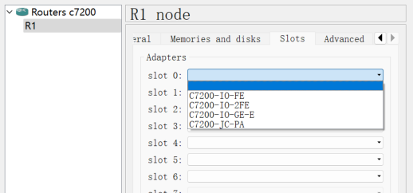
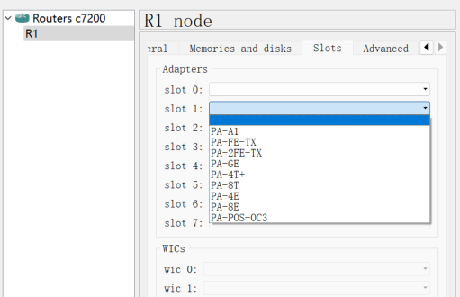

# GNS3

## Router 7200

### slot

- **FE接口**（Fast Ethernet），就是快速以太网接口
- **GE接口**（Gigabit Ethernet）,就是千兆以太网接口

| slot          | 说明                                          |
| ------------- | --------------------------------------------- |
| C7200-IO-FE   | 1 Fast Ethernet port                          |
| C7200-IO-2FE  | 2 Fast Ethernet ports                         |
| C7200-IO-GE-E | 1 Gigabit Ethernet port/1个Gigabit Ethernet口 |
| PA-A1         | 1 ATM port                                    |
| PA-FE-TX      | 1 Fast Ethernet port                          |
| PA-2FE-TX     | 2 Fast Ethernet ports/2个FastEthernet口       |
| PA-GE         | 1 Gigabit Ethernet port                       |
| PA-4T+        | 4 serial ports/4个串口                        |
| PA-8T         | 8 serial ports                                |
| PA-4E         | 4 Ethernet ports                              |
| PA-8E         | 8 Ethernet ports                              |
| PA-POS-OC3    | 1 POS port                                    |
|               |                                               |
|               |                                               |
|               |                                               |
|               |                                               |
|               |                                               |

