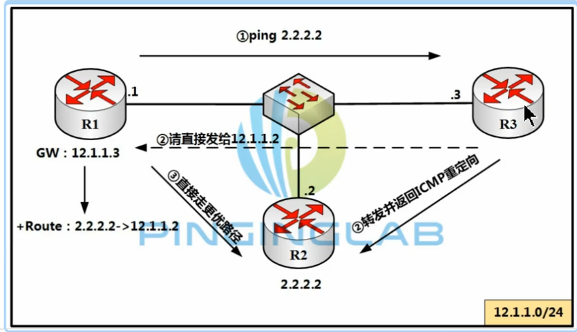
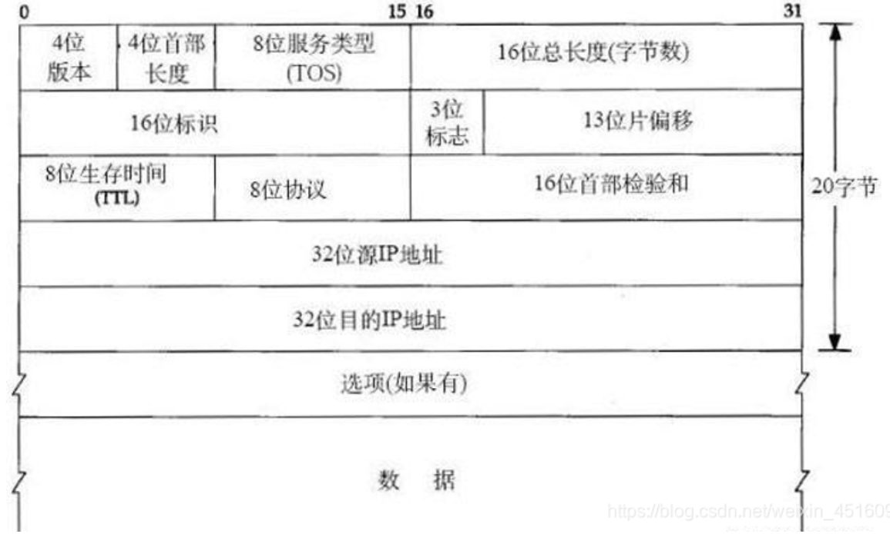

## 2. 互联网架构

​	本章不包含任何要求。 然而，它确实包含有关互联网和路由器的一般体系结构的有用背景信息。 有关互联网架构和支持协议套件的一般背景和讨论可以在 DDN 协议手册 [ARCH:1] 中找到； 有关背景，请参阅 [ARCH:2]、[ARCH:3] 和 [ARCH:4] 等示例。 越来越多的教科书也涵盖了互联网架构和协议，例如 [ARCH:5] 和 [ARCH:6]。

### 2.1 简介

#### ICMP

  ICMP 提供错误报告、流量控制、第一跳路由器重定向以及其他维护和控制功能。

#### IGMP

  IGMP 提供了主机和路由器加入和离开 IP 多播组的机制。 

​	互联网系统由许多互连的分组网络组成，支持使用互联网协议的主机之间的通信。 这些协议包括 **Internet 协议 (IP)**、**Internet 控制消息协议 (ICMP)**、**Internet 组管理协议 (IGMP)** 以及依赖于它们的各种传输和应用协议。 正如[1.2]节中所述，互联网工程指导小组定期发布官方协议备忘录，列出所有互联网协议。 

​	所有 Internet 协议都使用 IP 作为基本数据传输机制。  IP 是一种数据报或无连接的互联网服务，包括寻址、服务类型规范、分段和重组以及安全性的规定。  ICMP 和 IGMP 被视为 IP 的组成部分，尽管它们在架构上是分层于 IP 之上的。  ICMP 提供错误报告、流量控制、第一跳路由器重定向以及其他维护和控制功能。  IGMP 提供了主机和路由器加入和离开 IP 多播组的机制。 

​	可靠的数据传输由传输层协议（例如传输控制协议（TCP））在互联网协议套件中提供，该协议提供端到端重传、重新排序和连接控制。 传输层无连接服务由用户数据报协议（UDP）提供。

### 2.2 架构的元素

#### 2.2.1 架构的元素

​	为了使用互联网系统进行通信，主机必须实现构成互联网协议套件的分层协议集。 主机通常必须至少实现每一层的一个协议。 互联网架构中使用的协议层如下[ARCH:7]：

##### 应用层

​	应用层是互联网协议族的顶层。 尽管某些应用层协议确实包含一些内部子层，但互联网套件并未进一步细分应用层。 互联网套件的应用层本质上结合了 OSI 参考模型 [ARCH:8] 的顶层两层（表示层和应用层）的功能。 互联网协议套件中的应用层还包括 OSI 参考模型中归属于会话层的一些功能。 我们区分两类应用层协议：**直接向用户提供服务的用户协议和提供通用系统功能的支持协议**。 最常见的互联网用户协议是：

- Telnet (remote login)

- FTP (file transfer)
- SMTP (electronic mail delivery) 还有许多其他标准化用户协议和许多私有用户协议。

​	**用于主机名映射、引导和管理的支持协议包括 SNMP、BOOTP、TFTP、域名系统 (DNS) 协议和各种路由协议。** 

​	与路由器相关的应用层协议将在本备忘录的第 7、8 和 9 章中讨论。

##### 传输层

​	传输层提供端到端的通信服务。 该层大致相当于OSI参考模型中的传输层，只不过它还融合了OSI的一些会话层建立和销毁功能。 目前有两种主要的传输层协议：

- 传输控制协议(TCP) 
- 用户数据报协议(UDP) 

​	TCP 是一种可靠的面向连接的传输服务，提供端到端可靠性、重新排序和流量控制。  UDP 是一种无连接（数据报）传输服务。 研究界已经开发了其他传输协议，并且官方互联网传输协议集将来可能会得到扩展。 与路由器相关的传输层协议将在第 6 章中讨论。

##### 网络层

​	所有 Internet 传输协议都使用 Internet 协议 (IP) 将数据从源主机传送到目标主机。  IP 是一种无连接或数据报互联网络服务，不提供端到端传送保证。  **IP 数据报到达目标主机时可能会损坏、重复、无序或根本不到达。**IP 之上的各层负责在需要时提供可靠的传送服务。  IP 协议包括寻址、服务类型规范、分段和重组以及安全性的规定。  

​	IP 的数据报或无连接性质是互联网架构的基本特征和特征。 

​	互联网控制消息协议 (ICMP) 是一种控制协议，被认为是 IP 的组成部分，尽管它在架构上是基于 IP 分层的 - 它使用 IP 端到端地传送其数据。  ICMP 提供错误报告、拥塞报告和第一跳路由器重定向。

​	互联网组管理协议 (IGMP) 是一种互联网层协议，用于为 IP 多播建立动态主机组。 

​	第 4 章讨论了互联网层协议 IP、ICMP 和 IGMP。

##### 数据链路层

​	**要在直连的网络上进行通信，主机必须实现用于连接该网络的通信协议。** 我们称之为链路层协议。 

​	一些较旧的 Internet 文档将此层称为网络层，但它与 OSI 参考模型中的网络层不同。 

​	该层包含互联网层以下和物理层以上的所有内容（物理层是媒体连接，通常是电或光，用于编码和传输消息）。 它的责任是正确传递消息，它不区分其中的不同。 

​	该层中的协议通常不属于互联网标准化的范围； 互联网（有意）尽可能使用现有标准。 因此，互联网链路层标准通常仅涉及地址解析和通过特定链路层协议传输IP数据包的规则。 互联网链路层标准将在第 3 章中讨论。

#### 2.2.2 网络

​	互联网系统的组成网络只需要提供分组（无连接）传输。 根据 IP 服务规范，数据报可能会无序传送、丢失或重复，和/或包含错误。为了使使用 IP 的协议（例如 TCP）获得合理的性能，网络的丢失率应该非常低。 在提供面向连接的服务的网络中，虚拟电路提供的额外可靠性增强了系统的端到端鲁棒性，但对于互联网操作来说并不是必需的。

组成网络通常可分为两类：

- 局域网 (LAN) 

  LAN 可以有多种设计。  LAN 通常覆盖较小的地理区域（例如，单个建筑物或工厂站点）并提供高带宽和低延迟。  LAN 可以是无源的（类似于以太网），也可以是有源的（例如 ATM）。  

- 广域网 (WAN) 

  地理上分散的主机和 LAN 通过广域网（也称为长途网络）互连。 这些网络可能具有复杂的线路和分组交换机内部结构，也可能像点对点线路一样简单。

  

#### 2.2.3 路由器

​	在互联网模型中，各个组成网络主要通过IP数据报的转发器（被称为路由器或IP路由器）连接在一起。在本文档中，每次使用“路由器”一词时均指代IP路由器。许多较旧的互联网文档将路由器称为网关。历史上，路由器是通过**在通用CPU上执行的数据包的交换软件实现的**。然而，随着定制硬件开发变得更加便宜以及对更高吞吐量的需求增加，专用硬件变得越来越普遍。本规范适用于无论其实现方式如何的路由器。

​	路由器连接到两个或多个逻辑接口，这些接口**由IP子网或未编号的点对点线路表示**（在第[2.2.7]节中讨论）。因此，它至少有一个物理接口。转发IP数据报通常需要路由器选择下一跳路由器的地址和相关接口，或者（对于最终跳）目标主机的地址或相关接口。**这个选择称为中继或者转发**（relaying或forwarding），它依赖于路由器内部的路由数据库。路由数据库也称为路由表或转发表。“路由器”一词源于构建这个路由数据库的过程；路由协议和配置在一个称为路由的过程中相互作用。

​	路由数据库应动态维护，以反映互联网系统的当前拓扑。路由器通常通过与其他路由器参与分布式路由和可达性算法来实现这一点。	路由器仅提供数据报传输，并试图最小化维持此服务所需的状态信息，以追求路由的灵活性和鲁棒性。

​	分组交换设备也可以在链路层运行； 此类设备通常称为**网桥**。 通过网桥连接的网段共享相同的 IP 网络前缀，形成单个 IP 子网。 这些其他设备不属于本文档讨论的范围。

> 集线器Hub：所有设备都在同一广播/冲突域，共享相同的带宽（带宽低），安全性低。可泛洪到其他接口，半双工通信（同一时刻，只能发送/接收数据）
>
> 网桥bridge：工作在数据链路层。分割冲突域


#### 2.2.4 自治系统

​	自治系统 (AS) 是网络拓扑的连接段，由通过一组路由互连的子网集合（连接有主机）组成。 子网和路由器预计将由单个运营和维护 (O&M) 组织控制。  AS 内的路由器可能使用一个或多个内部路由协议，有时还使用多组度量。  AS 应该向其他 AS 呈现一致的内部路由计划以及通过 AS 可到达的目的地的一致图片。  AS 由自治系统编号来标识。  AS 的概念在 Internet 路由中起着重要作用（参见第 7.1 节）。

#### 2.2.5 寻址架构

​	IP 数据报携带 32 位源地址和目标地址，每个地址都分为两部分 ----- 组成网络前缀和该网络上的主机号。

```c
IP-address ::= { <Network-prefix>, <Host-number> }
```

​	为了最终传送数据报，其路径中的最后一个路由器必须将 IP 地址的主机号（或其余部分）映射到主机的MAC地址。

##### 2.2.5.1 经典IP寻址架构

​	尽管在其他地方 [INTERNET:2] 有详细记录，但描述网络前缀的历史使用还是很有用的。 为描述它而开发的语言在本文档和其他文档中使用，并渗透到许多协议背后的思想中。 

​	最简单的经典网络前缀是 A、B、C、D 或 E 类网络前缀。 这些地址范围是通过观察地址最高有效位的值来区分的，并将地址分解为简单的前缀和主机号字段。  [INTERNET:18]对此进行了描述。 简而言之，分类就是：

```c
0xxx - Class A - general purpose unicast addresses with standard
8 bit prefix
10xx - Class B - general purpose unicast addresses with standard
16 bit prefix
110x - Class C - general purpose unicast addresses with standard
24 bit prefix
1110 - Class D - IP Multicast Addresses - 28 bit prefix, non-
aggregatable
1111 - Class E - reserved for experimental use    
```

​	这个简单的概念已通过子网的概念得到扩展。 引入这些是为了允许组织内互连 LAN 结构的任意复杂性，同时使互联网系统免受分配的网络前缀和路由复杂性的爆炸性增长的影响。 子网为互联网系统提供了多级分层路由结构。  [INTERNET:2] 中描述的子网扩展是 Internet 架构的必需部分。 基本思想是将 <Host-number> 字段分为两部分：子网号和该子网上的真实主机号：

```c
IP-address ::= { <Network-number>, <Subnet-number>, <Host-number> }
```

​	组织内互连的物理网络使用相同的网络前缀但不同的子网号。 这种子网网络的子网之间的区别通常在该网络外部不可见。 因此，Internet 其余部分中的路由仅使用 IP 目标地址的 <Network-prefix> 部分。 网络外部的路由器将 <网络前缀> 和 <主机号> 一起视为 32 位 IP 地址的未解释的其余部分。 在子网网络中，路由器使用扩展网络前缀：

```
{ <Network-number>, <Subnet-number> }
```

​	历史上，包含此扩展网络号的位位置由称为子网掩码的 32 位掩码指示。  <子网号> 位应该是连续的，并且位于 <网络号> 和 <主机号> 字段之间。 最新的协议不涉及子网掩码，而是涉及前缀长度； 地址的“前缀”部分是由子网掩码选择的部分，其最高有效位全为 1，其余为 0。 前缀的长度等于子网掩码中的个数。 本文档假设所有子网掩码都可以表示为前缀长度。

​	子网机制的发明者假设组织网络的每个部分都只有一个子网号。 在实践中，事实证明让多个子网共享一条物理电缆是必要的或有用的。 因此，路由器应该能够在同一物理接口上配置多个子网，并将它们（从路由或转发的角度）视为不同的物理接口。


##### 2.2.5.2 CIDR（无类别域间路由）

> Classless Inter Domain Routing

​	互联网的爆炸性增长迫使人们重新审视地址分配策略。 通用（A、B 和 C 类）网络的传统用途已被修改，以更好地利用 IP 的 32 位地址空间。 无类别域间路由 (CIDR) [INTERNET:15] 是目前部署在互联网骨干网中以实现这种更高效率的一种方法。  CIDR 取决于部署和路由到任意大小的网络。 在此模型中，主机和路由器不对互联网中寻址的使用做出任何假设。  **D 类（IP 多播）和 E 类（实验）地址空间被保留**，尽管这主要是一种分配策略。

​	根据定义，CIDR 包含三个元素： 

- 拓扑上重要的地址分配     =====》   **IP地址**
- 能够聚合网络层可达性信息的路由协议，以及 
- 一致的转发算法（“最长匹配”）。 

​	网络和子网的使用现已成为历史，尽管用于描述它们的语言仍在使用。 它们已被更容易处理的网络前缀概念所取代。 根据定义，网络前缀是定义一组系统的地址较高端的一组连续位； 主机号在这些系统中进行选择。 不要求所有互联网都统一使用网络前缀。 为了折叠路由信息，将互联网划分为寻址域是有用的。 在这样的域内，可以获得有关组成网络的详细信息； 在其外部，仅通告公共网络前缀。 

​	经典的 IP 寻址架构使用地址和子网掩码来区分主机号和网络前缀。 对于网络前缀，指示前缀中的位数就足够了。 两种表示形式都很常用。 结构上正确的子网掩码能够使用前缀长度描述来表示。 它们包含所有可能的位模式的子集

- 较高有效端的连续 1， 
- 较低有效端的连续 0，以及 
- 没有中间位。

​	路由器应该始终将路由视为网络前缀，并且应该拒绝与该模型不一致的配置和路由信息。

```c
IP-address ::= { <Network-prefix>, <Host-number> }
```

​	使用 CIDR 的一个效果是与路由表中的地址前缀相关联的目的地集合可以表现出子集关系。 描述较小的目的地集合（较长的前缀）的路由被认为比描述较大的目的地集（较短的前缀）的路由更具体； 类似地，描述较大的目的地集合（较短的前缀）的路由被认为比描述较小的目的地集合（较长的前缀）的路由更不具体。 **路由器在转发流量时必须使用最具体的匹配路由（最长的匹配网络前缀）**。


#### 2.2.6 IP组播

​	IP 组播是链路层组播到IP 互联网的扩展。 使用 IP 多播，可以将单个数据报寻址到多个主机，而无需将其发送给所有主机。 在扩展情况下，这些主机可能驻留在不同的地址域中。 **这个主机集合称为组播组**。 每个组播组都表示为 D 类 IP 地址。 发送到组的 IP 数据报将以与单播 IP 流量相同的尽力传送方式传送到每个组成员。 **数据报的发送者本身不需要是目标组的成员。**

​	IP 多播组成员资格的语义在 [INTERNET:4] 中定义。 该文档描述了主机和路由器如何加入和离开多播组。 它还定义了一种协议，即 Internet 组管理协议 (IGMP)，用于监视 IP 多播组成员资格。  

​	IP多播数据报的转发是通过静态路由信息或通过组播路由协议实现的。转发IP组播数据报的设备称为组播路由器。这些设备可能同时也会转发IP单播数据。组播数据报的转发是基于其源地址和目标地址进行的。IP组播数据包的转发将在第[5.2.1]节中更详细地描述。附录D讨论了组播路由协议。

#### 2.2.7 未编号的线路和网络前缀

​	传统上，IP 主机或路由器上的每个网络接口都有自己的 IP 地址。 这可能会导致稀缺 IP 地址空间的使用效率低下，因为它会强制为每个点对点链路分配 IP 网络前缀。 

​	为了解决这个问题，许多人提出并实现了**无编号点对点线路**的概念。 未编号的点对点线路没有任何与其关联的网络前缀。 因此，连接到未编号点对点线路的网络接口没有 IP 地址。 

​	由于 IP 架构传统上假设所有接口都有 IP 地址，因此这些未编号的接口会导致一些有趣的困境。 例如，某些 IP 选项（例如，记录路由）指定路由器必须将接口地址插入到选项中，但未编号的接口没有 IP 地址。 更基本的（正如我们将在第 5 章中看到的）是路由包含下一跳路由器的 IP 地址。 路由器期望该 IP 地址位于该路由器所连接的 IP（子）网上。 如果唯一的连接是未编号的点对点线，那么当然会违反该假设。 

​	为了解决这些困难，提出了两种方案。 第一种方案表示，**通过未编号的点对点线路连接的两个路由器根本不是真正的两个路由器，而是两个半路由器，它们一起组成一个虚拟路由器。** 未编号的点对点线路本质上被认为是虚拟路由器中的内部总线。 虚拟路由器的两半必须协调它们的活动，使它们的行为与单个路由器完全相同。 

​	该方案非常适合 IP 架构，但有两个重要的缺点。 第一个是，虽然它处理单个未编号点对点线路的常见情况，但它不容易扩展以处理路由器网格和未编号点对点线路的情况。 第二个缺点是半路由器之间的交互必然复杂且不标准化，有效地排除了来自不同供应商的设备使用无编号的点对点线路的连接。

​	由于这些缺点，本备忘录**采用了一种替代方案**，该方案已被多次发明，但最初可能是菲尔·卡恩 (Phil Karn) 提出的。 **在此方案中，具有未编号的点对点线路的路由器也有一个特殊的 IP 地址，在本备忘录中称为 router-id**。  router-id 是路由器的 IP 地址之一（路由器必须至少有一个 IP 地址）。 使用此路由器 ID 就好像它是所有未编号接口的 IP 地址一样。

#### 2.2.8 值得注意的怪事

##### 2.2.8.1 嵌入式路由器

​	路由器可以是独立的计算机系统，专用于其IP路由器功能。 或者，可以将路由器功能嵌入到支持连接到两个或多个网络的主机操作系统中。 具有嵌入式路由器代码的操作系统的最著名示例是 Berkeley BSD 系统。 嵌入式路由器功能看似使构建网络变得容易，但它有许多隐藏的陷阱：

​	 (1)  如果主机只有一个组成网络接口，它不应该充当路由器。

​		例如，具有嵌入式路由器代码的主机在同一网络上无偿转发广播数据包或数据报通常会导致数据包雪崩。 

​	 (2) 如果（多宿主）主机充当路由器，则它须遵守本文档中包含的路由器要求。 

​		例如，路由协议问题以及路由器控制和监控问题对于嵌入式路由器和独立路由器来说同样困难且重要。 互联网路由器的要求和		规格可能会随着操作系统的变化而变化。 强烈建议在互联网中运行嵌入式路由器的管理部门维护和更新路由器代码。 这可能需		要路由器源代码。  

​	(3) 当主机执行嵌入式路由器代码时，它就成为互联网基础设施的一部分。 因此，软件或配置中的错误可能会阻碍其他主机之间的通信。 结果，主机管理员必须失去一些自主权。 在许多情况下，主机管理员需要禁用操作系统中嵌入的路由器代码。 因此，禁用嵌入式路由器功能应该很简单。

​	(4) 当运行嵌入式路由器代码的主机同时用于其他服务时，两种使用模式的运维要求可能会发生冲突。 例如，路由器的运维很多情况下是由运营中心远程进行； 这可能需要主机管理员通常不希望分配的特权系统访问权限。

##### 2.2.8.2 透明路由器

​	在互联网中互连局域网和广域网（或长途）有两种基本模型。 首先，为局域网分配一个网络前缀，并且 Internet 中的所有路由器都必须知道如何路由到该网络。 在第二种情况下，局域网共享广域网（一小部分）的地址空间。 支持第二种模型的路由器称为地址共享路由器或透明路由器。 本备忘录的重点是支持第一种模型的路由器，但这并不意味着排除透明路由器的使用。 

​	透明路由器的基本思想是，路由器后面的局域网上的主机共享路由器前面的广域网的地址空间。 在某些情况下，这是一种非常有用的方法，并且这些限制不会带来重大缺陷。

​	前面和后面的文字表明了这种方法的局限性之一：这种互连模型仅适用于地理（和拓扑）有限的存根环境。 它要求在广域网的网络级寻址中存在某种形式的逻辑寻址。 本地环境中的 IP 地址映射到广域网中的几个（通常是一个）物理地址。 此映射的发生方式与整个广域网中使用的 { IP 地址 <-> 网络地址 } 映射一致。 

​	在一个广域网上可以实现多宿主，但如果接口在地理上或拓扑上分离，则可能会出现路由问题。 由于地址混乱，两个（或多个）广域网上的多宿主是一个问题。

​	如果透明路由器无法完全模拟正常的广域网服务，则主机从表面上同一网络中的其他主机看到的行为可能会有所不同。 例如，阿帕网使用链路层协议，该协议提供“目的地失效”指示，以响应向离线主机发送数据的尝试。 然而，如果 ARPANET 和以太网之间存在透明路由器，则 ARPANET 上的主机将不会收到以太网主机的“目的地失效”指示。

### 2.3 路由器特性

​	Internet 路由器执行以下功能：

​	(1) 符合本文档中指定的特定 Internet 协议，包括 Internet 协议 (IP)、Internet 控制消息协议 (ICMP) 以及其他必要的协议。 

​	(2) 到两个或多个分组网络的接口。 对于每个连接的网络，路由器必须实现该网络所需的功能。 这些功能通常包括： 使用连接的网络帧（例如，以太网标头和校验和）封装和解封装 IP 数据报， 

- 发送和接收 IP 数据报，最大尺寸为该网络支持的最大大小，该大小是网络的最大传输 单位或 MTU， 

- 如果需要，将 IP 目标地址转换为所连接网络的适当网络级地址（例如以太网硬件地址），以及 

- 响应网络流量控制和错误指示（如果有）。 

  请参见第 3 章（链路层）。  

  (3) 接收和转发Internet数据报。 这个过程中的重要问题是缓冲区管理、拥塞控制和公平性。

  - 识别错误情况并根据需要生成 ICMP 错误和信息消息。  
  - 丢弃生存时间字段已达到零的数据报。  
  - 必要时对数据报进行分段以适应下一个网络的 MTU。 
    - 有关详细信息，请参阅第 4 章（互联网层 - 协议）和第 5 章（互联网层 - 转发）。

​	(4) 根据路由数据库中的信息，为每个 IP 数据报选择下一跳目的地。 有关详细信息，请参阅第 5 章（互联网层 - 转发）。

​	(5)（通常）支持内部网关协议（IGP）以与同一自治系统中的其他路由器执行分布式路由和可达性算法。 此外，一些路由器需要支持外部网关协议（EGP）以与其他自治系统交换拓扑信息。 有关详细信息，请参阅第 7 章（应用层 - 路由协议）。  

​	(6)提供网络管理和系统支持设施，包括加载、调试、状态报告、异常报告和控制。 有关详细信息，请参阅第 8 章（应用层网络管理协议）和第 10 章（操作和维护）。

​	路由器供应商在特定路由器产品的功率、复杂性和功能方面有多种选择。 观察互联网系统既不是同质的也不是完全连接的可能会有所帮助。 由于技术和地理的原因，它正在发展成为一个全球互连系统以及边缘的 LAN 边缘。 越来越多的这些边缘 LAN 的互连程度越来越高，从而使它们不再处于边缘，对路由器的要求也越来越高。

- 全球互连系统由许多广域网组成，其中连接了多个自治系统（AS）的路由器； 直接连接到系统的主机相对较少。
- 大多数主机都连接到 LAN。 许多组织都有通过本地路由器互连的 LAN 集群。 每个这样的集群都通过路由器在一个或多个点连接到全球互连系统中。 如果仅在一个点连接，则 LAN 称为末节网络。

全球互连系统中的路由器通常需要：

- 高级路由和转发算法

  这些路由器需要高度动态的路由算法，施加最小的处理和通信负担，并提供服务类型路由。 拥塞仍然是一个没有完全解决的问题（参见第[5.3.6]节）。 由于研究界正在积极研究这些问题，因此预计这些领域会得到改进。

- 高可用性

  这些路由器需要高度可靠，提供每周 7 天、每天 24 小时的服务。 设备和软件故障可能会产生广泛的（有时是全球性的）影响。 一旦失败，他们必须迅速恢复。 在任何环境中，路由器都必须高度稳健，并且能够在网络资源极度拥塞或故障的情况下（可能处于降级状态）运行。

- 先进的运维特性

  互联网路由器通常以无人值守模式运行。 它们通常从集中监控中心远程操作。 他们需要提供复杂的手段来监视和测量流量和其他事件以及诊断故障。

- 高性能

  当今互联网中的长途线路最常见的是全双工 56 KBPS、DS1 (1.544 Mbps) 或 DS3 (45 Mbps) 速度。  LAN 是半双工多路访问介质，通常是以太网 (10Mbps)，也有少数是 FDDI (100Mbps)。 然而，网络媒体技术正在不断进步，未来可能会有更高的速度。

​	LAN 边缘（例如校园网）中使用的路由器的要求很大程度上取决于本地网络的需求。 这些可能是高性能或中等性能的设备，可能是从几个不同的供应商竞争性采购的，并由内部组织（例如，校园计算中心）运营。 这些路由器的设计应强调低平均延迟和良好的突发性能，以及延迟和服务类型敏感的资源管理。 在这种环境下，运维可能不太正式，但也不会那么重要。 随着网络变得更加复杂和互连，对高度动态的路由机制的需求将变得更加重要。 由于全球互连的速度，用户将对本地连接提出更多要求。 

​	随着网络的发展，以及越来越多的网络变得足够老旧以至于正在逐步淘汰旧设备，路由器与其他供应商的路由器互操作变得越来越重要。

​	尽管互联网系统没有完全互连，但系统的许多部分都需要具有冗余连接。 尽管通信线路和路由器发生故障，丰富的连接性仍然可以提供可靠的服务，并且还可以通过缩短互联网路径和提供额外的容量来改善服务。 不幸的是，这种更丰富的拓扑会使选择到达特定目的地的最佳路径变得更加困难。

### 2.4 架构假设

​	当前的互联网架构基于一组有关通信系统的假设。 与路由器最相关的假设如下：

- 互联网是网络的网络。 

  每个主机都直接连接到某个特定的网络； 它与互联网的连接只是概念性的。 同一网络上的两台主机使用与远程网络上的主机通信时使用的同一组协议进行相互通信。

- 路由器不保存连接状态信息。 

  为了提高通信系统的鲁棒性，路由器被设计为无状态的，独立于其他数据包转发每个 IP 数据包。 因此，即使中间路由器和网络出现故障，也可以利用冗余路径来提供稳健的服务。 端到端流量控制和可靠性所需的所有状态信息都在主机、传输层或应用程序中实现。 因此，所有连接控制信息都与通信端点位于同一位置，因此只有当端点发生故障时才会丢失。 路由器仅通过丢弃数据包或增加网络延迟来间接控制消息流。 请注意，未来的协议开发很可能最终会将更多状态放入路由器中。 这对于多播路由、资源预留和基于流的转发尤其可能。  

- 路由的复杂性应该在路由器中。 

  路由是一个复杂而困难的问题，应该由路由器而不是主机来执行。 一个重要的目标是使主机软件免受因互联网路由架构不可避免的演变而引起的变化。

- 系统必须能够容忍广泛的网络变化。

  互联网设计的基本目标是容忍广泛的网络特性，例如带宽、延迟、数据包丢失、数据包重新排序和最大数据包大小。 另一个目标是使用仍然可用的任何带宽，抵御各个网络、路由器和主机故障的鲁棒性。 最后，目标是完全开放的系统互连：互联网路由器必须能够通过不同的互联网路径与任何其他路由器或互联网主机稳健且有效地互操作。 

  有时，实施者的设计目标并不那么雄心勃勃。 例如，LAN 环境通常比整个 Internet 环境要好得多；  LAN 的数据包丢失和延迟较低，并且不会对数据包重新排序。 一些供应商已经提供了足以满足简单 LAN 环境的实现，但对于一般互操作来说效果不佳。 供应商认为这种产品在受限的 LAN 市场中是经济的。 然而，孤立的 LAN 很少会长期保持孤立状态。 它们很快就会相互连接，连接到整个组织范围的互联网，并最终连接到全球互联网系统。 最终，客户和供应商都不会使用不完整或不合格的路由器。 

  本文档中的要求是针对全功能路由器而设计的。 完全兼容的路由器将可用于互联网的几乎任何部分。


## 3. 链路层协议

​	尽管 [INTRO:1] 涵盖了链路层标准（各种链路层上的 IP、ARP 等），但本文档预计链路层材料将在单独的链路层要求文档中涵盖。 链路层要求文档适用于主机和路由器。 因此，本文档不会废弃 [INTRO:1] 中处理链路层问题的部分。

### 3.1 简介

​	路由器与其他类型的互联网系统具有本质上相同的链路层协议要求。 这些要求在 Internet 网关要求 [INTRO:1] 第 3 章中给出。 路由器必须遵守其要求并应遵守其建议。 由于该文档中的某些材料已有些过时，因此下面包含一些附加要求和解释。

**讨论** 

​	预计互联网社区将制定互联网链路层标准的要求，该标准将取代本章和[简介：1]中标题为“互联网层协议”的章节。

### 3.2 链路/互联网层接口

​	本文档不尝试指定链路层和上层之间的接口。 然而，请注意，本文档的其他部分，特别是第 5 章，需要跨此层边界传递各种类型的信息。 

​	本节使用以下定义：

- 源物理地址 -----  源物理地址是接收数据包的主机或路由器的链路层地址。

- 目标物理地址 ----- 目标物理地址是数据包发送到的链路层地址。

  

  对于每个收到的数据包，必须从链路层传递到IP层的信息是：

(1) IP 数据包[5.2.2]，

(2) 链路层帧的部分数据的长度（即不包括链路层帧）[5.2.2]，

(3) 接收IP数据包的物理接口标识 [5.2.3]，以及 

(4) 根据数据包中的目的MAC地址分类为链路层单播、广播或组播 [4.3.2]、[5.3.4]。

(5) 源MAC地址。 


​	对于每个传输的数据包，必须从互联网层传递到链路层的信息是：

- IP数据包
- IP数据包的长度
- 目的物理地址
- 下一跳IP地址

​	此外，互联层还应提供：

- 链路层优先级值[5.3.3.2] 

​	如果要传输的数据包引起链路层优先级相关错误，链路层还必须通知互联网络层[5.3.3.3]。

### 3.3 具体问题

#### 3.3.1 尾部封装

​	可以连接到 10 兆以太网的路由器可能能够接收和转发使用 [LINK:1] 中描述的尾部封装进行封装的以太网数据包。 然而，路由器不应该生成尾部封装的数据包。 路由器不得在没有首先使用[INTRO:2]中描述的机制验证数据包的直接目的地愿意并且能够接受尾部封装的数据包之前，不得发起尾部封装的数据包。 路由器不应该同意（使用这些机制）接受尾部封装的数据包。

#### 3.3.2 地址解析协议 - ARP

​	实现 ARP 的路由器必须符合并且应该无条件符合 [INTRO:2] 中的要求。 

​	链路层不得仅仅因为没有目的地的 ARP 缓存条目而向 IP 报告目的地不可达错误； 在执行 ARP 请求/应答序列时，它应该将少量数据报短暂排队，并且仅当这证明无济于事时才回复队列中的数据报之一无法到达目的地。 

​	路由器不得相信任何声称另一台主机或路由器的链路层地址是广播或组播地址的 ARP 回复。

#### 3.3.3 以太网和 802.3 共存

​	可以连接到 10 兆以太网的路由器必须符合并且应该无条件符合 [INTRO:2] 的以太网要求。

#### 3.3.4 最大传输单元-MTU

​	每个逻辑接口的 MTU 必须在该接口的合法 MTU 范围内进行配置。

​	许多链路层协议定义了可以发送的最大帧大小。 在这种情况下，路由器不得允许设置 MTU，否则将允许发送大于链路层协议允许的帧。 然而，路由器应该愿意接收与最大帧大小一样大的数据包，即使它大于 MTU。 

**讨论** 

​	 请注意，这是比 [INTRO:2] 对主机提出的更严格的要求，后者要求每个物理接口的 MTU 是可配置的。 如果网络使用的 MTU 小于链路层的最大帧大小，则路由器可能会从配置错误和初始化不完整的主机接收大于 MTU 的数据包。 鲁棒性原则表明路由器应该尽可能成功地接收这些数据包。

#### 3.3.5 点对点协议-PPP

​	与 [INTRO:1] 相反，互联网确实有一个标准的点对点线路协议：点对点协议 (PPP)，在 [LINK:2]、[LINK:3]、[LINK:4] 中定义和[链接：5]。 

​	点对点接口是设计用于通过点对点线路发送数据的任何接口。 此类接口包括电话、租用、专用或直接线路（2 线或 4 线），并且可以使用点对点通道或多路复用接口的虚拟电路，例如 ISDN。 它们通常使用标准化调制解调器或位串行接口（例如 RS-232、RS-449 或 V.35），并使用同步或异步时钟。 复用接口通常具有特殊的物理接口。 

​	通用串行接口使用与点对点线路相同的物理介质，但支持使用链路层网络以及点对点连接。 链路层网络（例如 X.25 或帧中继）使用替代的 IP 链路层规范。 实现点对点或通用串行接口的路由器必须实现 PPP。

​	路由器上的所有通用串行接口必须支持 PPP。 路由器可以允许将线路配置为使用 PPP 以外的点对点线路协议。 点对点接口在启用时应该默认使用 PPP，或者在启用之前需要配置链路层协议。 通用串行接口在启用之前应要求配置链路层协议。

##### 3.3.5.1 简介 

​	本节为路由器实现者提供指南，以便他们能够确保**通过同步或异步链路使用 PPP 与其他路由器的互操作性**。 

​	实现者理解选项协商机制的语义至关重要。 选项是本地设备向远程对等点指示本地设备将从远程对等点接受什么而不是希望发送什么的一种方式。 由远程对等方决定在本地设备声明其可以接受的选项集范围内最方便发送的内容。 因此，即使远程对等点不支持任何这些选项，远程对等点确认 LCP 配置请求 (CR) 中指示的所有选项也是完全可以接受和正常的。 同样，这些选项只是任一设备向其对等设备指示它将接受什么，而不一定是它将发送什么的机制。

##### 3.3.5.2 链路控制协议（LCP）选项

​	PPP 链路控制协议 (LCP) 提供了许多可以协商的选项。 这些选项包括（除其他外）地址和控制字段压缩、协议字段压缩、异步字符映射、最大接收单元 (MRU)、链路质量监控 (LQM)、幻数（用于环回检测）、密码身份验证协议 (PAP)、 质询握手身份验证协议 (CHAP) 和 32 位帧校验序列 (FCS)。 

​	路由器可以在同步或异步链路上使用地址/控制字段压缩。 路由器可以在同步或异步链路上使用协议字段压缩。 表明它可以接受这些压缩的路由器也必须能够接受未压缩的 PPP 标头信息。

**讨论** 

​	这些选项控制 PPP 头的外观。 通常PPP报头由地址、控制字段和协议字段组成。 **点对点线路上的地址是0xFF，表示“广播”。 控制字段为0x03，表示“未编号信息”。** 协议标识符是一个两字节值，指示帧的数据区域的内容。 如果系统协商地址和控制字段压缩，则它向其对等方表明它将接受在标头前面具有或不具有这些字段的 PPP 帧。 它并不表示它将发送删除了这些字段的帧。 

​	协议字段压缩在协商时表明系统愿意接收压缩为一字节的协议字段（当这是合法的时）。 

​	不要求发件人这样做。 地址/控制字段压缩的使用与编号模式（可靠）PPP 的使用不一致。

**实现** 

​	某些硬件不能很好地处理可变长度标头信息。 在这些情况下，远程对等方发送完整的 PPP 标头最有意义。 实现可以通过不向远程对等点发送地址/控制字段和协议字段压缩选项来确保这一点。 即使远程对等方已指示能够接收压缩标头，也不需要本地路由器发送压缩标头。

​	路由器必须为异步 PPP 链路协商异步控制字符映射表 (ACCM)，但不应为同步链路协商 ACCM。 如果路由器收到通过同步链路协商 ACCM 的尝试，它必须确认该选项，然后忽略它。

**讨论** 

​	有一些实现提供同步和异步操作模式，并且可以使用相同的代码来实现选项协商。 在这种情况下，一端或另一端可能会在同步链路上发送 ACCM 选项。

​	路由器应该正确协商最大接收单元（MRU）。 即使系统协商的 MRU 小于 1,500 字节，它也必须能够接收 1,500 字节的帧。 

​	路由器应该协商并启用链路质量监控（LQM）选项。

**讨论** 

​	本备忘录没有指定确定链接质量是否足够的策略。 然而，路由器禁用失败的链路很重要（请参见第[3.3.6]节）。 

​	路由器应该实现并协商用于环回检测的幻数选项。 

​	路由器可以支持身份验证选项（PAP - 密码身份验证协议，和/或 CHAP - 质询握手身份验证协议）。 

​	路由器必须支持 16 位 CRC 帧校验序列 (FCS)，并且可以支持 32 位 CRC。

##### 3.3.5.3 IP 控制协议（IPCP）选项 

​	路由器可以提供执行IP地址协商的功能。 路由器必须接受对等方执行 IP 地址协商的拒绝 (REJect)。 以 19,200 BPS 或更低的链路速度运行的路由器应该实现并提供执行 Van Jacobson 报头压缩。 实施 VJ 压缩的路由器应该实施启用或禁用它的管理控制。

#### 3.3.6 接口测试 

​	路由器必须有一种机制允许路由软件确定物理接口是否可用于发送数据包； 在为有限的邻居组打开永久虚拟电路的多路复用接口上，路由器还必须能够确定虚拟电路是否可行。 路由器应该有一种机制允许路由软件判断物理接口的质量。 路由器必须具有一种机制，用于在物理接口因管理操作而变得可用或不可用时通知路由软件。 路由器必须具有一种机制，用于在检测到链路层接口因任何原因变得可用或不可用时通知路由软件。

**讨论** 

​	路由器具有确定其网络连接是否正常运行的可行机制至关重要。 未能检测到链路丢失，或者在检测到问题时未能采取适当的措施，可能会导致黑洞。

​	可用于检测网络连接问题的机制有很大差异，具体取决于所使用的链路层协议和接口硬件。 目的是最大限度地提高在链路层限制内检测故障的能力。


## 4. 互联网层 - 协议

### 4.1 简介 

​	本章和第 5 章讨论网络层使用的协议：IP、ICMP 和 IGMP。 由于转发显然是讨论路由器的文档中的一个关键主题，因此第 5 章仅限于与转发直接相关的协议方面。 本章包含互联网层协议讨论的其余部分。

### 4.2 IP协议

#### 4.2.1 介绍

​	路由器必须实现 [INTERNET:1] 定义的 IP 协议。 它们还必须实现其强制扩展：子网（在 [INTERNET:2] 中定义）、IP 广播（在 [INTERNET:3] 中定义）和无类域间路由（CIDR，在 [INTERNET:15] 中定义）。 

​	路由器实现者无需考虑遵守 [INTRO:2] 中标题为“Internet 协议 - IP”的部分，因为该部分在本文档中完全重复或被取代。 路由器必须并且应该无条件地符合 [INTRO:2] 中与 IP 相关的标题为“具体问题”的部分的要求。 

​	下面，在某些情况下指定的操作是静默丢弃接收到的数据报。 这意味着数据报将被丢弃而不进行进一步处理，并且路由器将不会因此发送任何 ICMP 错误消息（参见第 [4.3] 节）。 然而，为了诊断问题，路由器应该提供记录错误的能力（参见第[1.3.3]节），包括默默丢弃的数据报的内容，并且应该对丢弃的数据报进行计数。

#### 4.2.2 协议演练 

​	RFC 791 [INTERNET:1] 是 Internet 协议的规范。

##### 4.2.2.1 选项：RFC 791 第 3.2 节

​	在路由器本身接收到的数据报中，IP 层必须解释它理解的 IP 选项，并保留其余部分不变，以供更高层协议使用。

​	更高层协议可能需要能够在它们发送的数据报中设置 IP 选项或检查它们接收的数据报中的 IP 选项。 本文档的后续部分讨论高层协议所需的特定 IP 选项支持。

**讨论** 

​	本备忘录和 [INTRO:2] 都没有定义接收方必须处理同一 IP 标头中的多个选项的顺序。 发起包含多个选项的数据报的主机和路由器必须意识到，当与源路由选项结合使用时，这会导致某些选项的含义不明确。	

以下是特定 IP 选项的要求： 

(a) 安全选项 

​	某些环境要求在每个发起或接收的数据包中使用安全选项。 路由器应该实施[INTERNET:5]中描述的修订后的安全选项。 

**讨论** 

​	请注意，[INTERNET:1] 和 RFC 1038 ([INTERNET:16]) 中描述的安全选项已过时。  

(b) 流标识符选项 

​	该选项已过时； 路由器不应该将此选项放置在路由器生成的数据报中。 路由器收到的数据报中必须忽略此选项。  

**(c) 源路由选项**

​	路由器必须能够充当源路由的最终目的地。 如果路由器收到包含完整源路由的数据包，则该数据包已到达其最终目的地。 在这样的选项中，指针指向最后一个字段之外，并且 IP 头中的目标地址对路由器进行寻址。 收到的选项（记录的路由）必须传递到传输层（或 ICMP 消息处理）。 

​	在一般情况下，对源路由数据报的正确响应会经过相同的路由。 路由器必须提供一种方法，使传输协议和应用程序能够反转接收到的数据报中的源路由。 当路由器不知道策略约束时，必须将这种反向源路由插入到它们生成的数据报中（详细信息请参见[INTRO:2]）。 然而，如果路由器具有策略感知能力，它可以选择另一条路径。 

​	路由器中的某些应用程序可能要求用户能够输入源路由。 

​	路由器不得生成包含多个源路由选项的数据报。 如果要求转发包含多个源路由选项的数据包，路由器应该做什么，如第 [5.2.4.1] 节所述。 

​	当创建源路由选项时（当路由器发起源路由数据报或由于特殊过滤器而插入源路由选项时会发生这种情况），它必须正确形成，即使它是通过反转 记录的路由错误地包含源主机（请参阅下面讨论中的情况 (B)）。

**讨论** 

​	假设源路由数据报要通过路由器 G1、G2、Gn 从源S 路由到目的地 D。 源 S 构造一个数据报，以 G1 的 IP 地址作为其目标地址，并使用**源路由选项**将数据报继续传送到目的地。 然而，规范中对于 S 发出的数据报中的源路由选项应该是 (A) 还是 (B) 存在歧义：

(A): {>>G2, G3, ... Gn, D} <--- CORRECT
(B): {S, >>G2, G3, ... Gn, D} <---- WRONG

​	（其中 >> 代表指针）。 如果按(A)发送，则D处接收到的数据报将包含选项：{G1，G2，...Gn>>}，其中S和D作为IP源地址和目标地址。 如果按(B)发送，则 D 处收到的数据报将再次包含 S 和 D 作为相同的 IP 源地址和目标地址，但选项将为：{S, G1, ...Gn >>}； 即，始发主机将是路由中的第一跳。

**(d) 记录路由选项** 

​	路由器可以支持由路由器发起的数据报中的记录路由选项。  

**(e) 时间戳选项** 

​	路由器可以支持由路由器发起的数据报中的时间戳选项。 以下规则适用： 

- 当发起包含时间戳选项的数据报时，路由器必须在选项中记录时间戳，如果 
  - 其互联网地址字段未预先指定，或者 
  - 其第一个预先指定的地址是逻辑网络的 IP 地址 发送数据报的接口（如果数据报是通过未编号的接口发送的，则为路由器的路由器 ID）。  
- 如果路由器本身接收到包含时间戳选项的数据报，则在将该选项传递给传输层或 ICMP 进行处理之前，路由器必须将当前时间插入到时间戳选项中（如果选项中有空间这样做）。 如果空间不存在，路由器必须增加选项中的溢出计数。
- 时间戳值必须遵循 [INTRO:2] 中定义的规则。

**实现** 

​	为了最大限度地利用时间戳选项中包含的时间戳，插入的时间戳应该尽可能接近数据包到达路由器的时间。 对于由路由器发起的数据报，插入的时间戳应尽可能接近数据报传递到链路层进行传输的时间。 

​	时间戳选项允许使用非标准时钟，但使用非同步时钟会限制时间戳的实用性。 因此，强烈建议路由器实施网络时间协议以同步其时钟。

##### 4.2.2.2 选项中的地址：RFC 791 第 3.1 节

​	路由器被要求将其地址插入**记录路由**、**严格源和记录路由**、**松散源和记录路由或时间戳选项**中。 当路由器将其地址插入此类选项时，它必须使用发送数据包的逻辑接口的 IP 地址。 如果因为输出接口没有 IP 地址（即，是一个未编号的接口）而无法遵守此规则，则路由器必须插入其 router-id。 路由器的 router-id 是路由器的 IP 地址之一。 路由器 ID 可以基于系统或基于每个链路来指定。 用作 router-id 的路由器地址不得更改（即使重新启动），除非网络管理员更改。 相关管理更改包括重新配置路由器，以便用作路由器 ID 的 IP 地址不再是路由器的 IP 地址之一。 具有多个未编号接口的路由器可以有多个路由器 ID。 每个未编号的接口必须与特定的路由器 ID 相关联。 如果不重新配置路由器，则此关联不得更改（即使重新启动）。 

**讨论** 

​	这一规范不允许路由器没有至少一个 IP 地址。 我们不认为这是一个严重的限制，因为即使路由器仅连接到点对点链路，路由器也需要 IP 地址来满足第 [8] 章的可管理性要求。

**实现** 

​	选择满足此要求的 router-id 的一种可能方法是使用分配给路由器的数字上最小（或最大）的 IP 地址（将地址视为 32 位整数）。

##### 4.2.2.3 未使用的 IP 头位：RFC 791 第 3.1 节

​	IP 标头包含两个保留位：一个在服务类型字节中，另一个在标志字段中。 路由器不得在路由器发起的数据报中将这些位中的任何一个设置为 1。 路由器不得仅仅因为这些保留位中的一个或多个具有非零值而丢弃（拒绝接收或转发）数据包； 即，路由器不得检查这些位的值。 

**讨论** 

​	IP 协议的未来修订版可能会利用这些未使用的位。 这些规则旨在确保可以部署这些修订，而无需同时升级互联网中的所有路由器。

##### 4.2.2.4 服务类型：RFC 791 第 3.1 节

​	IP 标头中的服务类型字节分为三部分： 优先级字段（高位 3 位），该字段通常称为服务类型或 TOS  （接下来的 4 位）和保留位（低位）。 

​	管理保留位的规则在[4.2.2.3]节中描述。 

​	关于 TOS 字段及其使用的更广泛的讨论可以在 [ROUTE:11] 中找到。  

​	IP优先级字段的描述被第[5.3.3]节取代。  RFC 795（服务映射）已过时，不应实施。

##### 4.2.2.5 报头校验和：RFC 791 第 3.1 节 

​	如第 [5.2.2] 节所述，路由器必须验证收到的任何数据包的 IP 校验和，并且必须丢弃包含无效校验和的消息。 路由器不得提供禁用此校验和验证的方法。 

​	当 IP 标头的唯一更改是生存时间时，路由器可以使用增量 IP 标头校验和更新。 这将减少路由器未检测到的 IP 标头损坏的可能性。 有关增量更新校验和的讨论，请参阅 [INTERNET:6]。 

**实现** 

​	对 IP 校验和的更广泛的描述，包括广泛的实现提示，可以在 [INTERNET:6] 和 [INTERNET:7] 中找到。

##### 4.2.2.6 无法识别的标头选项：RFC 791 第 3.1 节

​	路由器必须忽略它无法识别的 IP 选项。 此要求的必然结果是路由器必须实现“选项列表结束”选项和“无操作”选项，因为两者都不包含显式长度。 

**讨论** 

​	所有未来的 IP 选项都将包含明确的长度。

##### 4.2.2.7 分段：RFC 791 第 3.2 节

​	分段，如 [INTERNET:1] 中所述，路由器必须支持。 当路由器对 IP 数据报进行分段时，**它应该最大限度地减少分段数量**。 

​	当路由器对 IP 数据报进行分段时，它应该按顺序发送分段。 如果分片方法生成的一个 IP 片段比另一个小很多，则可能导致第一个 IP 片段比另一个小。 

**讨论** 

​	互联网上常用的分片技术有以下几种：一种是将 IP 数据报分割成 IP片段，第一个片段为 MTU 大小，其他片段大小大致相同，但小于 MTU。这样做的原因有二。序列中的第一个 IP 片段将是主机之间当前路径的有效 MTU，而接下来的 IP 片段的大小是为了尽量减少 IP 数据报的进一步分片。另一种技术是将另一种技术是将 IP 数据报分割成 MTU 大小的 IP 片段，最后一个片段是唯一较小的片段，如 [INTERNET:1] 所述。	

 	TCP/IP 的某些实现使用的常见技巧是，当 IP 数据报要通过路由器传输时，将 IP 数据报分段为不大于 576 字节的 IP 片段。 这样做的目的是允许生成的 IP 片段通过路径的其余部分，而无需进一步分段。 然而，这会在目标主机上产生更多的负载，因为它将有大量的 IP 片段需要重新组装成一个 IP 数据报。 在 MTU 仅更改一次并保持远大于 576 字节的网络上，它也不会高效。 示例包括 LAN 网络，例如 MTU 为 2048 的 IEEE 802.5 网络或 MTU 为 1500 的以太网网络。

**讨论**

​	另一种分段技术是将 IP 数据报分割成大致相等大小的 IP 片段，其大小小于或等于下一跳网络的 MTU。 这样做的目的是最大限度地减少因路径上进一步分段而产生的分段数量，并确保每个分段的延迟相等。 

​	路由器应该生成尽可能少的 IP 片段。

​	使用慢速机器使我们相信，如果需要对消息进行分段，首先发送小 IP 片段可以最大限度地提高具有慢速接口的主机接收所有片段的机会。

##### 4.2.2.8 重组：RFC 791 第 3.2 节 

​	正如 [INTRO:2] 相应部分中所指定的，路由器必须支持对其传送给自身的数据报进行重组。

##### 4.2.2.9 生存时间：RFC 791 第 3.2 节

​	路由器发起或接收的数据包的生存时间 (TTL) 处理由 [INTRO:2] 控制； 本节不改变其任何规定。 然而，由于 [INTRO:2] 的 IP 协议部分的其余部分被重写，因此本部分也被重写。 

​	特别要注意的是，除了转发数据包时，**路由器不得检查数据包的 TTL**。   **<font color='red'>（除了转发数据包才会检查数据包的TTL）</font>**

​	路由器不得发起或转发生存时间 (TTL) 值为0的数据报文。 

​	路由器绝不能仅仅因为收到的数据报的 TTL 等于 0 或 1 就丢弃该数据报； 如果它是发送给路由器的并且在其他方面有效，则路由器必须尝试接收它。

​	对于路由器发出的消息，IP 层必须为传输层提供一种方法来设置发送的每个数据报的 TTL 字段。 当使用固定 TTL 值时，它必须是可配置的。 这个数字应该超过典型的互联网直径，当前的智慧表明它应该超过互联网直径的两倍以允许增长。 当前建议值通常发布在分配编号 RFC 中。  TTL 字段有两个功能：限制 TCP 段的生命周期（请参阅 RFC 793 [TCP:1]，第 28 页）和终止 Internet 路由循环。 虽然 **TTL 是以秒为单位**的时间，但它也具有跳数的一些属性，因为每个路由器都需要将 TTL 字段至少减少一。  

​	TTL 过期旨在导致数据报被路由器丢弃，但不会被目标主机丢弃。 因此，通过转发数据报充当路由器的主机必须遵循路由器的 TTL 规则。 

​	更高层协议可能需要设置 TTL，以便实现对某些 Internet 资源的“扩展范围”搜索。 这被某些诊断工具使用，并且预计可用于使用 IP 多播等方式定位给定类别的“最近”服务器。 特定的传输协议可能还希望指定其自己的最大数据报生命周期的 TTL 界限。

​	固定的默认值必须至少足够大以适应互联网“直径”，即最长的可能路径。 合理的值约为直径的两倍，以允许互联网持续增长。 截至撰写本文时，穿越美国的消息经常经过 15 到 20 个路由器； 这表明默认 TTL 值应超过 40，而 64 是一个常见值。

##### 4.2.2.10 多子网广播：RFC 922 

​	全子网广播（在 [INTERNET:3] 中称为多子网广播）已被弃用。 参见第[5.3.5.3]节。

##### 4.2.2.11 地址：RFC 791 第 3.2 节

​	如 2.2.5.1 中所述，现在有五类 IP 地址：A 类到 E 类。D 类地址用于 IP 组播 [INTERNET:4]，而 E 类地址保留用于实验用途。  A、B、C 类地址之间的区别不再重要； 它们被用作通用单播网络前缀，仅对其类别有历史意义。  

​	IP组播地址是代表一组主机的28位逻辑地址，可以是永久的也可以是暂时的。 永久组播地址由互联网号码分配机构[INTRO:7]分配，而临时地址可以动态分配给临时组。 组成员身份是使用 IGMP [INTERNET:4] 动态确定的。 

​	现在，我们总结通用单播 IP 地址的重要特殊情况，使用以下 IP 地址表示法：

​	{ <Network-prefix>, <Host-number> } ， **符号 -1 表示包含全 1 位**和 **符号 0 表示包含全 0 位**的字段。

(a) { 0, 0 }

​	在该网络上的主机。 它不得被路由器用作源地址，除非路由器可以使用它作为源地址作为初始化过程的一部分（例如，如果路由器使用 BOOTP 加载其配置信息）。

​	如果路由器实现了相关协议并且该协议明确定义了要采取的适当操作，则必须接受源地址为 { 0, 0 } 的传入数据报，这些数据报是为本地传送而接收的（参见第 [5.2.3] 节）。 否则，路由器必须默默地丢弃源地址为 { 0, 0 } 的任何本地传送的数据报。

**讨论** 

​	一些协议定义了响应接收到的源地址为 { 0, 0 } 的数据报而采取的特定操作。  BOOTP 和 ICMP 掩码请求就是两个示例。 这些协议的正确操作通常取决于接收源地址为{0, 0}的数据报的能力。 然而，对于大多数协议，最好忽略源地址为 { 0, 0 } 的数据报，因为它们可能是由配置错误的主机或路由器生成的。 因此，如果路由器知道如何处理具有 {0, 0} 源地址的给定数据报，则路由器必须接受它。 否则，路由器必须丢弃它。

另请参阅第 [4.2.3.1] 节了解 { 0, 0 } 的非标准使用。

(b) { 0, <Host-number> } 

​	该网络上的指定主机。 它不能由路由器发送，除非路由器可以使用它作为源地址作为初始化过程的一部分，通过该过程它可以学习自己的 IP 地址。 

(c) { -1, -1 } 

​	有限广播。 它不得用作源地址。 具有此目标地址的数据报将被连接的物理网络上的每个主机和路由器接收，但不会转发到该网络之外。  

(d) { <Network-prefix>, -1 } 

​	直接广播 - 定向到指定网络前缀的广播。 它不得用作源地址。 路由器可以发起网络定向广播数据包。 路由器必须接收网络定向广播数据包； 然而，路由器可能有一个配置选项来阻止接收这些数据包。 这样的选项必须默认为允许接收。  

(e) { 127, <any> } 

​	内部主机回环地址。 这种形式的地址不得出现在主机外部。

​	<Network-prefix> 是通过管理方式分配的，因此其值在设备所连接的路由域中是唯一的。 除上面列出的特殊情况外，IP 地址的 <Host-number> 或 <Network-prefix> 字段不允许具有值 0 或 -1。 这意味着这些字段中的每一个都至少有两位长。 

**讨论** 

​	本文档的先前版本还指出，子网号不能为 0 也不能为 -1，并且长度必须至少为两位。 在 CIDR 世界中，子网号显然是网络前缀的扩展，如果没有前缀的其余部分就无法解释。 因此，对于 CIDR 而言，子网号的这种限制毫无意义，可以安全地忽略。

​	有关广播地址的进一步讨论，请参见第 [4.2.3.1] 节。 

​	当路由器发起任何数据报时，IP 源地址必须是其自己的 IP 地址之一（但不是广播或多播地址）。 唯一的例外是在初始化期间。

​	对于大多数目的，处理寻址到广播或多播目的地的数据报就好像它已寻址到路由器的 IP 地址之一一样； 也就是说：

- 路由器必须正常接收和处理任何具有广播目标地址的数据包。
- 路由器必须正常接收并处理发送到路由器要求接收的多播目标地址的任何数据包。 

​	术语“特定目标地址”是指主机的等效本地 IP 地址。 特定目标地址被定义为 IP 标头中的目标地址，除非标头包含广播或多播地址，在这种情况下，特定目标是分配给数据报到达的物理接口的 IP 地址。 

​	路由器必须默默地丢弃任何收到的包含根据本节规则无效的 IP 源地址的数据报。 此验证可以由 IP 层或（在适当时）传输层中的每个协议来完成。 与路由器丢弃的任何数据报一样，应该对丢弃的数据报进行计数。 讨论 寻址错误的数据报可能是由单播数据报的链路层广播或另一个混淆或配置错误的路由器或主机引起的。


#### 4.2.3 具体问题

##### 4.2.3.1 IP 广播地址

​	由于历史原因，有许多 IP 地址（有些是标准的，有些不是）用于指示 IP 数据包是 IP 广播。 一个路由器

(1)必须将寻址到 255.255.255.255 或 { <Network-prefix>, -1 } 的数据包视为 IP 广播数据包。 

(2)应在收到任何地址为 0.0.0.0 或 { <Network-prefix>, 0 } 的数据包时默默丢弃（即，甚至不传递给路由器中的应用程序）。 如果这些数据包没有被悄悄丢弃，它们必须被视为 IP 广播（参见第 [5.3.5] 节）。 可能有一个配置选项允许接收这些数据包。 该选项应该默认丢弃它们。  

(3)当发起发往已连接（子）网络的 IP 广播时（默认情况下）应使用有限广播地址 (255.255.255.255)（发送 ICMP 地址掩码回复时除外，如第 [4.3.3.9] 节中所述）  ）。 路由器必须接收有限的广播。 

(4)不应生成寻址到 0.0.0.0 或 { <Network-prefix>, 0 } 的数据报。 可能有一个配置选项允许生成这些数据包（而不是使用相关的 1s 格式广播）。 该选项应该默认不生成它们。

**讨论** 

​	在第二个项目符号中，如果路由器没有到该网络前缀的接口，则路由器显然无法识别 { <Network-prefix>, 0 } 形式的地址。 在这种情况下，第二个项目符号的规则不适用，因为从路由器的角度来看，该数据包不是 IP 广播数据包。

##### 4.2.3.2 IP组播

​	IP 路由器应该满足有关 IP 组播的主机要求，如 [INTRO:2] 中指定的。  IP 路由器应该支持所有连接网络上的本地 IP 多播。 当指定了从 IP 多播地址到链路层地址的映射时（请参阅各种 IP-over-xxx 规范），它应该使用该映射，并且可以配置为使用链路层广播。 在点对点链路和所有其他接口上，多播被封装为链路层广播。 对本地IP多播的支持包括发起多播数据报、加入多播组和接收多播数据报以及离开多播组。 这意味着支持所有 [INTERNET:4]，包括 IGMP（参见第 [4.4] 节）。

**讨论** 

​	尽管 [INTERNET:4] 的标题是“IP 多播的主机扩展”，但它适用于所有 IP 系统，包括主机和路由器。 特别是，由于路由器可以加入多播组，因此它们执行 IGMP 的主机部分，将其组成员身份报告给可能存在于其连接网络上的任何多播路由器（无论它们本身是否是多播路由器）是正确的。 

​	某些路由器协议可能特别要求支持 IP 多播（例如，OSPF [ROUTE:1]），或者可能推荐它（例如，ICMP Router Discovery [INTERNET:13]）。

##### 4.2.3.3 路径MTU发现

​	为了消除碎片或最小化碎片，需要知道从源到目的地的路径上的路径 MTU 是多少。 路径MTU是路径中每一跳的MTU中的最小值。  [INTERNET:14]描述了一种用于动态发现任意互联网路径的最大传输单元（MTU）的技术。 对于通过不支持 [INTERNET:14] 的路由器的路径，此技术可能无法发现正确的路径 MTU，但它始终会选择与路径 MTU 一样准确的路径 MTU，并且在许多情况下比路径 MTU 更准确。  MTU 将由旧技术或当前实践选择。

​	当路由器发起 IP 数据报时，它应该使用 [INTERNET:14] 中描述的方案来限制数据报的大小。 如果路由器到数据报目的地的路由是从提供路径 MTU 信息的路由协议中获知的，则仍使用 [INTERNET:14] 中描述的方案，但来自路由协议的路径 MTU 信息应该用作初始猜测，如下所示 到路径 MTU，也作为路径 MTU 的上限。

##### 4.2.3.4 子网划分 

​	在某些情况下，可能需要支持仅通过不属于子网划分的网络的路径互连的特定网络的子网。 这称为不连续子网支持。 路由器必须支持不连续的子网。

**实施** 

​	在传统的 IP 网络中，这是很难实现的。 在 CIDR 网络中，它是一个自然的副产品。 因此，路由器不应该对子网架构做出假设，但应该将每个路由视为通用网络前缀。 

**讨论** 

​	互联网近来一直在以惊人的速度增长。 这给 IP 寻址技术带来了严重的压力。 造成这种压力的一个主要因素是严格的 IP 地址类别边界。 这些使得难以有效地调整其网络的网络前缀大小以及将多个网络前缀聚合到单个路由通告中。 通过消除 IP 地址的严格类别边界并将每个路由视为通用网络前缀，可以大大减少这些压力。 

​	当前执行此操作的技术是无类域间路由 (CIDR) [INTERNET:15]。

​	出于类似的原因，与给定网络前缀相关联的地址块可以被细分为不同大小的子块，使得与子块相关联的网络前缀将具有不同的长度。 例如，在网络前缀为8位长的块内，一个子块可以具有16位网络前缀，另一个子块可以具有18位网络前缀，第三个子块可以具有14位网络前缀。 

​	路由器必须在其接口配置和路由数据库中支持可变长度网络前缀。

#### 4.3.3 互联网控制消息协议- ICMP 

##### 4.3.1 简介 

​	ICMP 是一种辅助协议，为IP 提供路由、诊断和错误功能。  [INTERNET:8] 对此进行了描述。 路由器必须支持 ICMP。  ICMP 消息分为两类，将在以下几节中讨论： 

**ICMP 错误消息：**

- 第4.3.3.1节 目标不可达 

- 第4.3.3.2节 重定向 
- 第4.3.3.3节 源抑制 
- 第4.3.3.4节 超时时间
- 第4.3.3.5节 参数问题

**ICMP 查询消息：**

- 第4.3.3.6节 回显部分 
- 第4.3.3.7节 信息部分 
- 第4.3.3.8节 时间戳部分  
- 第4.3.3.9节 地址掩码部分 
- 第4.3.3.10节路由器发现部分 

##### 4.3.2 通用问题

###### 4.3.2.1 未知消息类型 

​	如果收到未知类型的 ICMP 消息，则必须将其传递到 ICMP 用户界面（如果路由器有）或静默丢弃（如果路由器没有）。

###### 4.3.2.2 ICMP 消息 TTL 

​	当发起 ICMP 消息时，路由器必须初始化 TTL。  ICMP 响应的 TTL 不得取自触发响应的数据包。  

###### 4.3.2.3 原始消息头 

​	从历史上看，每个 ICMP 错误消息都包含 Internet 头和触发错误的数据报的至少前 8 个数据字节。 由于使用了 IP-in-IP 隧道和其他技术，这已不再足够。 因此，ICMP 数据报应包含尽可能多的原始数据报，且 ICMP 数据报的长度不超过 576 字节。 返回的 IP 头（和用户数据）必须与接收到的相同，但路由器不需要撤消对 IP 标头的任何修改，这些修改通常在检测到错误之前执行的转发中执行（例如， 减少 TTL，或更新选项）。 请注意，在某些情况下，[4.3.3.5]节的要求会取代此要求（即，对于参数问题消息，如果问题出现在修改的字段中，则路由器必须撤消修改）。 参见第[4.3.3.5]节）。

###### 4.3.2.4 ICMP 消息源地址 

​	除非本文档另有规定，路由器发起的 ICMP 消息中的 IP 源地址必须是与传输 ICMP 消息的物理接口关联的 IP 地址之一。 如果接口没有与之关联的 IP 地址，则使用路由器的 router-id（请参阅第 [5.2.5] 节）。 

###### 4.3.2.5 TOS 和优先顺序 

​	ICMP 错误消息应该将其 TOS 位设置为与引发 ICMP 错误消息发送的数据包中的 TOS 位相同的值，除非将它们设置为该值会导致 ICMP 错误消息被 立即丢弃，因为它无法路由到目的地。 否则，ICMP 错误消息必须与正常（即零）TOS 一起发送。  ICMP 回复消息应该将其 TOS 位设置为与引发回复的 ICMP 请求中的 TOS 位相同的值。  ICMP 源抑制错误消息（如果确实发送）必须将其 IP 优先级字段设置为与引发 ICMP 源抑制消息发送的数据包中的 IP 优先级字段相同的值。 所有其他 ICMP 错误消息（目标无法到达、重定向、超时和参数问题）应将其优先级值设置为 6（INTERNETWORK CONTROL）或 7（NETWORK CONTROL）。 这些错误消息的 IP 优先级值可以设置。  ICMP 回复消息必须将其 IP 优先级字段设置为与引发回复的 ICMP 请求中的 IP 优先级字段相同的值。  

###### 4.3.2.6 源路由 

​	如果引发发送 ICMP 错误消息的数据包包含源路由选项，则 ICMP 错误消息还应该包含相同类型（严格或松散）的源路由选项，该选项是通过反转之前的部分而创建的。 原始数据包的源路由选项中记录的路由指针，除非 ICMP 错误消息是抱怨原始数据包中的源路由选项的 ICMP 参数问题，或者除非路由器知道会发生以下情况的策略： 防止 ICMP 错误消息的传送。 讨论 在使用美国国防部安全选项（在 [INTERNET:5] 中定义）的环境中，ICMP 消息可能需要包含安全选项。 有关此主题的详细信息应从国防通信局获得。

###### 4.3.2.7 何时不发送 ICMP 错误 

​	不得因接收以下内容而发送 ICMP 错误消息： 

- ICMP 错误消息，或
- 未通过第 [5.2.2] 节中描述的 IP 标头验证测试的数据包（除 其中该部分明确允许发送 ICMP 错误消息），或
- 发往 IP 广播或多播地址的数据包，或
- 作为链路层广播或多播发送的数据包，或
- 源地址具有以下地址的数据包： 网络前缀为零或者是无效的源地址（如第 [5.3.7] 节中所定义），或者
- 除了第一个片段之外的数据报的任何片段（即，IP 标头中的片段偏移量不为零的数据包）  ）。 此外，在本备忘录规定数据包将被静默丢弃的任何情况下，都不得发送 ICMP 错误消息。 注意：这些限制优先于本文档中其他有关发送 ICMP 错误消息的要求。 讨论 这些规则旨在防止因路由器或主机响应广播数据包而返回 ICMP 错误消息而导致的广播风暴。 例如，发送到不存在端口的广播 UDP 数据包可能会触发来自所有没有该目标端口客户端的设备的大量 ICMP 目标不可达数据报。 在大型以太网上，由此产生的冲突可能会使网络在一秒或更长时间内无法使用。 在连接的网络上广播的每个数据包都应该有一个有效的 IP 广播地址作为其 IP 目的地（请参阅第 [5.3.4] 和 [INTRO:2] 节）。 然而，有些设备违反了这一规则。 因此，为了确保检测到广播数据包，路由器需要检查链路层广播以及 IP 层地址。 实现+ 这要求链路层在收到链路层广播数据包时通知 IP 层； 参见[3.1]节。


###### 4.3.3.2 重定向 

> ICMP重定向报文是ICMP控制报文中的一种。在特定情况下，当路由器R3检测到一台机器使用非最优路由（源IP与目的IP处于同一网段，直接发给R2即可）时，会向主机R1发送一个ICMP重定向报文，请求主机改变路由。



​	ICMP 重定向消息的生成是**为了通知本地主机对于某些流量应该使用不同的下一跳路由器**。 

​	与 [INTRO:2] 相反，如果路由器正在运行路由协议，或者在路由器和数据包所在的接口上启用了转发，则在为路由器发起的数据包选择路径时，路由器可以忽略 ICMP 重定向。 

##### 4.3.3.3 源抑制

​	路由器不应发起 ICMP 源抑制消息。 正如[4.3.2]节中所指定的，发起源抑制消息的路由器必须能够限制它们生成的速率。

**讨论** 

​	研究似乎表明，源抑制会消耗网络带宽，但却是一种无效（且不公平）的拥塞解决方案。 例如，参见 [INTERNET:9] 和 [INTERNET:10]。  [5.3.6]节讨论了当前关于路由器应该如何处理过载和网络拥塞的想法。

​	路由器可以忽略它收到的任何 ICMP 源抑制消息。

**讨论** 

​	路由器本身可能会收到源抑制，作为发送到另一个路由器或主机的数据包的结果。 此类数据报可能是发送到另一个路由器的 EGP 更新，或者发送到主机的 telnet 流。 已经提出了一种机制（[INTERNET:11]、[INTERNET:12]），通过控制数据包发送的速率来使 IP 层直接响应源抑制，但是，该提议目前处于实验阶段，目前不推荐。

##### 4.3.3.4 超时时间

​	当路由器转发数据包并且数据包的 TTL 字段减小为 0 时，适用[5.2.3.8]节的要求。 

​	当路由器重新组装发往该路由器的数据包时，它充当互联网主机。 因此，[INTRO:2] 的重新组装要求适用。 

​	当路由器接收到（即发往该路由器的）超时消息时，它必须遵守 [INTRO:2]。

##### 4.3.3.5 参数问题

​	路由器必须针对其他 ICMP 消息未明确涵盖的任何错误生成参数问题消息。  IP 头字段或 IP 选项（包括由指针字段指示的字节）必须不改变地包含在随该 ICMP 消息返回的 IP 头中。  [4.3.2] 节定义了此要求的例外情况。

[INTRO:2] 中定义了参数问题消息的新变体：代码 1 = 缺少必需选项。

**讨论** 

​	该变体目前在军事界中使用，因为它缺少安全选项。

##### 4.3.3.6 回显请求/回复

​	路由器必须实现 ICMP Echo 服务器功能，接收发送到路由器的 Echo 请求，并发送相应的 Echo 回复。 路由器必须准备好接收、重新组装和回显 ICMP 回显请求数据报，其最大值至少为 576 和所有连接网络的 MTU。  

​	Echo 服务器功能可以选择不响应发送至 IP 广播或多播地址的 ICMP echo 请求。

​	路由器应该有一个配置选项，如果启用该选项，则会导致路由器默默地忽略所有 ICMP 回显请求； 如果提供，此选项必须默认为允许响应。

**讨论** 

​	关于响应广播和多播 Echo 请求的中立规定源自 [INTRO:2] 的“Echo 请求/回复”部分。

​	如第[10.3.3]节所述，路由器还必须实现用户/应用层接口，用于发送回显请求和接收回显应答，以用于诊断目的。 所有 ICMP Echo Reply 消息必须传递到此接口。  

​	ICMP Echo Reply 中的 IP 源地址必须与相应 ICMP Echo Request 消息的特定目标地址相同。  

​	ICMP 回显请求中收到的数据必须完全包含在生成的回显应答中。

​	如果在 ICMP 回显请求中接收到记录路由和/或时间戳选项，则应更新此选项（这些选项）以包含当前路由器并包含在回显应答消息的 IP 标头中，而不进行截断。 因此，记录的路线将是整个往返的路线。 

​	如果在 ICMP 回显请求中收到源路由选项，则返回路由必须反转并用作回显应答消息的源路由选项，除非路由器知道会阻止消息传递的策略。

## 5. 互联网层 - 转发

### 5.1 介绍

本节介绍了报文转发的过程。

### 5.2 转发演练

​	IP中没有单独的转发功能规范。 相反，转发由互联网层协议（[INTERNET:1]、[INTERNET:2]、[INTERNET:3]、[INTERNET:8] 和 [ROUTE:11]）的协议规范涵盖。

#### 5.2.1 转发算法

​	由于主要协议文档都没有详细描述转发算法，因此我们在这里介绍它。 这只是一个总体概述，省略了重要的细节，例如拥塞的处理，这些细节将在后面的部分中讨论。 不要求实现完全遵循[5.2.1.1]、[5.2.1.2]和[5.2.1.3]节中给出的算法。 编写路由器软件的大部分挑战是**最大化路由器转发数据包的速率**，同时仍然实现相同的算法效果。 有关如何执行此操作的详细信息超出了本文档的范围，部分原因是它们严重依赖于路由器的体系结构。 相反，我们只是指出步骤之间的顺序依赖性：

1. 在根据header内容执行任何操作之前，路由器必须验证 IP header，如第 [5.2.2] 节所述。 这使得路由器能够在消耗其他资源之前检测并丢弃坏数据包。
2. 处理某些IP选项需要路由器将其IP地址插入到选项中。 如第 [5.2.4] 节所述，**插入的地址必须是发送数据包的逻辑接口的地址**，或者**如果数据包是通过未编号的接口发送的，则插入的地址必须是路由器的 router-id**。 因此，只有在选择输出接口之后才能完成这些选项的处理。
3. 由于第[4.2.2.9]节中提到的原因，路由器在检查数据包是否应传递到路由器本身之前无法检查并递减 TTL。
4. 更一般地，当数据包在本地传送到路由器时，不得以任何方式修改其 IP 头（除非路由器可能需要将时间戳插入到 IP 头中的任何时间戳选项中）。 因此，在路由器确定数据包是否要本地传送到路由器之前，它不能以任何不准备撤消的方式更新IP报头。


##### 5.2.1.1 General

本节介绍一般转发算法。 该算法适用于要转发的所有形式的数据包：**单播、组播和广播**。

1. 路由器从链路层接收 IP 数据包（以及有关它的附加信息，如第 [3.1] 节所述）。

2. 路由器验证 IP头，如第 [5.2.2] 节所述。 请注意，IP 重组不会完成，除了在步骤 (4) 中排队等待本地传送的 IP 片段之外。 

3. 路由器执行任何 IP 选项的大部分处理。 如第[5.2.4]节所述，一些IP选项在做出路由决定后需要额外的处理。 

4. 路由器检查IP数据报的目的IP地址，如第[5.2.3]节所述，以确定它应如何继续处理IP数据报。 存在三种可能性：

   - IP 数据报的目的地是路由器，并且应该排队等待本地转发，并在需要时进行重组。
   - IP 数据报不是发往路由器的，应排队等待转发。
   - IP 数据报应排队等待转发，但（副本）也必须排队等待本地转发。

   

##### 5.2.1.2 单播

由于 [INTRO:2] 很好地涵盖了本地传送情况，因此下面**【假设 IP 数据报已排队等待转发】**。

如果目标是 IP 单播地址：

> 1. 检查数据包的源IP地址和目的IP地址是否有效
> 2. 转发器将TTL至少减一
> 3. 转发器可能需要对IP数据包进行分段
> 4. 转发器会查询路由表，查找出数据包的下一跳地址以及出接口
> 5. 确定下一跳的链路层地址，再将IP数据包（或者分段）封装在链路层帧中，并等待转发

5. 【转发器】通常通过在路由器的路由表中查找数据包的目的地来确定数据包的下一跳 IP 地址。 该过程在[5.2.4]节中有更详细的描述。 此过程还决定哪个网络接口应该用于发送数据包。
6. 【转发器】验证是否允许转发数据包。 源地址和目标地址应该是有效的，如第 [5.3.7] 节和第 [5.3.4] 节中所述。 如果路由器支持转发的管理约束，例如第 [5.3.9] 节中所述的那些约束，则这些约束必须是 使满意。
7. 【转发器】递减（至少 1）并检查数据包的 TTL，如第 [5.3.1] 节中所述。  
8. 【转发器】执行步骤 3 中无法完成的任何 IP 选项处理。
   1. 【转发器】执行任何必要的 IP 分段，如第 [4.2.2.7] 节中所述。 由于此步骤发生在出接口选择（步骤5）之后，因此同一数据报的所有片段都将从同一接口发送出去。
9. 【转发器】确定数据包下一跳的链路层地址。 执行此操作的机制取决于链路层（请参阅第 3 章）。
10. 【转发器】将 IP 数据报（或其每个片段）封装在适当的链路层帧中，并将其排队以便在步骤 5 中选择的接口上输出。
11. 【转发器】在必要时发送 ICMP 重定向，如第 [ 4.3.3.2]中所述。。

##### 5.2.1.3 组播

如果目的地是 IP 多播，则执行以下步骤。 请注意，IP 单播转发和 IP 多播转发之间的主要区别是

- IP 组播通常根据数据报的源 IP 地址和目标 IP 地址进行转发
- IP 组播使用扩展环搜索
- IP 组播转发为 **链路级组播**，并且 ICMP 错误永远不会发送以响应 IP 多播数据报。

请注意，IP 组播转发仍处于实验阶段。 因此，下面提出的算法不是强制性的，并且仅作为示例提供。

(5a) 根据数据报报头中找到的 IP 源地址和目标地址，路由器确定是否已在正确的接口上接收到数据报并进行转发。 如果不是，则数据报将被静默丢弃。 确定正确接收<font color='red'>接口的方<法取决于所使用的多播路由算法。 在最简单的算法之一——反向路径转发（RPF）中，**正确的接口是用于将单播转发回数据报源的接口**。

(6a) 根据数据报报头中的 IP 源地址和目标地址，②路由器确定数据报的传出接口。 为了实现 IP 多播的扩展环搜索（参见[INTERNET:4]），为每个传出接口指定了最小 TTL 值。 通过在每个最小 TTL 值小于或等于数据报头中的 TTL 值的传出接口上单独应用剩余步骤，将多播数据报的副本转发出每个此类接口。

(7a) 路由器将数据包的 TTL 减 1。

(8a)转发器执行步骤(3)中无法完成的任何IP选项处理。 

 (9a) 转发器执行任何必要的 IP 分段，如第 [4.2.2.7] 节中所述。  

(10a) 转发器确定在链路层封装中使用的链路层地址。 执行此操作的机制取决于链路层。 在 LAN 上，选择链路级多播或广播作为数据报 IP 多播地址的算法转换。 有关更多详细信息，请参阅各种 IP-over-xxx 规范。 

 (11a) 转发器将数据包（或其每个片段）封装在适当的链路层帧中，并将其排队以便在适当的接口上输出。



#### 5.2.2 IP头验证

​	在路由器处理任何 IP 数据包之前，它必须对数据包的 IP 头进行以下基本有效性检查，以确保header有意义。 如果数据包未通过以下任何测试，则必须将其静默丢弃，并且应记录错误。

(1) 链路层报告的**packet length必须足够大以容纳最小长度的合法IP数据报（20字节）**。  

(2) IP checksum必须正确。 

(3) IP version必须为4。如果版本号不是4，则该数据包可能是另一个版本的IP，例如IPng或ST-II。  

(4) IP header长度字段必须足够大，以容纳最小长度的合法 IP 数据报（20 字节 = 5 个字）。 

(5) IP total length字段必须足够大以容纳IP数据报头，其长度在IP header length字段中指定。

路由器不得有禁用这些测试的配置选项。 

​	如果数据包通过了第二次和第三次测试，IP头长度字段至少为4，并且IP total length字段和链路层报告的数据包长度都至少为16，那么，尽管有上述规则，路由器可以 响应ICMP参数问题消息，其指针指向IP头长度字段（如果第四次测试失败）或IP总长度字段（如果第五次测试失败）。 然而，它仍然必须丢弃数据包并且仍然应该记录错误。 

​	这些规则（以及整个文档）仅适用于互联网协议的第 4 版。 这些规则不应被解释为禁止路由器支持其他版本的 IP。 此外，如果路由器能够真正将数据包分类为 IP 的其他版本，那么它不应该将该数据包视为本备忘录上下文中的错误数据包。

**实现** 

为了错误报告的目的，需要确定header无效的原因，尽管并不总是完全可能。 可能的原因有四个：

- 链路层截断了 IP 头。
- 数据报使用的是标准 IP 版本（版本 4）以外的 IP 版本。
- IP 头在传输过程中已损坏。
- 发送方生成了非法的 IP 头。

​	可能需要按照列出的顺序执行检查，因为我们相信这种顺序最有可能正确地对错误原因进行分类。 出于错误报告的目的，还可能需要检查未通过这些测试的数据包是否具有指示 IPng 或 ST-II 的 IP 版本号； 这些应根据各自的规范进行处理。

​	此外，路由器应该验证**链路层报告的数据包长度至少与数据包的 IP 标头中记录的 IP 总长度一样大**。 如果数据包看起来已被截断，则必须丢弃该数据包，应记录错误，并且路由器应使用 **ICMP 参数问题消息**进行响应，该消息的指针指向 IP 总长度字段。

**讨论** 

​	由于**任何涉及数据损坏的高层协议都会在数据包数据到达其最终目的地时检测到数据包数据的截断**，因此路由器不一定需要执行上述建议的检查来维护协议的正确性。 然而，通过进行此检查，路由器可以大大简化确定路径中的哪一跳正在截断数据包的任务。 它还将减少路由器下游的资源消耗，因为下游系统不需要处理数据包。


​	最后，如果 IP 头中的目标地址不是路由器的地址之一，则路由器应该**验证数据包不包含严格源和记录路由选项**。 如果数据包未通过此测试（如果它包含严格的源路由选项），则路由器应记录该错误，并应使用 ICMP 参数问题错误进行响应，其中指针指向有问题的数据包的 IP 目标地址。

**讨论** 

​	有些人可能建议路由器应该响应 Bad Source Route 消息而不是 Parameter Problem 消息。 然而，当数据包未通过此测试时，通常表明前一跳路由器存在协议错误，而错误源路由Bad Source Route 则表明源主机请求的网络路径不存在或已损坏。


#### 5.2.3 本地分发决策

​	当路由器接收到 IP 数据包时，它必须决定该数据包是【发送】至【路由器（并应在本地传送）】还是【发送】至【另一个系统（并应由转发器处理】）。 还有一种混合情况，其中某些 IP 广播和 IP 组播既在本地传送和转发。 路由器必须使用以下规则确定这三种情况中的哪一种适用。

- 未过期的源路由选项是指其指针值未指向源路由中最后一个条目的选项。 如果数据包包含未过期的源路由选项，则选项中的指针会前进，直到指针确实指向选项中的最后一个地址，或者下一个地址不是路由器自己的地址之一。 在后一种（正常）情况下，无论以下规则如何，都会转发数据包（而不是在本地传递）。

- 在以下情况下，数据包在本地传送，不考虑转发：
  - 数据包的目标地址与路由器的 IP 地址之一完全匹配
  
  - 数据包的目标地址是有限广播地址255.255.255.255，或者
  
  - 数据包的目的地是从不转发的 IP 组播地址（例如 224.0.0.1 或 224.0.0.2），并且（至少）与数据包到达的物理接口关联的逻辑接口之一是目的地的成员 组播组。
  
    > 224.0.0.1：向该子网上的所有主机包括路由器发送信息
    >
    > 224.0.0.2：向该子网上的所有路由器发送信息
  
- 在以下情况下，数据包将传递到转发器并在本地传送：
  - 数据包的目标地址是一个 IP 广播地址，它至少寻址路由器的一个逻辑接口，但不寻址与数据包到达的物理接口关联的任何逻辑接口
  - 数据包的目的地是允许转发的 IP 组播地址（与 224.0.0.1 和 224.0.0.2 不同），并且（至少）与数据包到达的物理接口关联的逻辑接口之一是目的地的成员 多播组。
  
- 如果数据包的目标地址是 IP 广播地址（有限广播地址除外），并且至少寻址与数据包到达的物理接口关联的逻辑接口之一，则数据包将在本地传送。 数据包也会传递到转发器，除非数据包到达的链路使用的 IP 封装与单播不同（例如，通过使用不同的链路层目标地址）封装广播。

- 在所有其他情况下，数据包都会传递到转发器。

**讨论：**

​	第四个项目符号最后一句中的要求的目的是处理到同一物理电缆上另一个网络前缀的定向广播。 通常，这按预期工作：发送方将广播作为链路层单播发送到路由器。 路由器注意到它是作为单播到达的，因此必须指定与发送方发送它的网络前缀不同的网络前缀。 因此，路由器可以安全地将其作为链路层广播发送到其到达的同一（物理）接口。 但是，如果路由器无法判断数据包是否作为链路层单播接收，则该语句确保路由器执行安全但错误的操作，而不是不安全但正确的操作。

**实现：**

​	如第[5.3.4]节所述，通常不转发作为链路层广播接收的数据包。 避免将数据包传递给转发器可能是有利的，该转发器稍后会因为该部分中的规则而丢弃数据包。 某些链路层（由于硬件或驱动程序中的特殊代码）可以向路由器传送其传输的所有链路层广播和多播的副本。 使用此功能可以简化数据包必须传递到转发器并在本地传递的情况的实现，因为转发数据包将自动导致路由器接收数据包的副本，然后可以在本地传递数据包。 在这些情况下必须小心，以防止将收到的环回数据包视为收到的正常数据包（然后遵守转发规则等）。

​	即使没有这样的链路层，当然也几乎没有必要制作整个数据包的副本以将其排队以进行转发和本地传送，但必须小心分段，因为重组是在本地传送的数据包上执行的，而不是在本地传送的数据包上执行的。 在转发的数据包上。 一种简单的方案是将一个标志与路由器输出队列上的每个数据包相关联，该标志指示该数据包在发送后是否应排队等待本地传送。

#### 5.2.4 确定下一跳地址

​	当路由器要【转发】数据包时，它必须确定是否可以将其直接发送到目的地，或者是否需要通过另一个路由器将其传递。 如果是后者，则需要确定使用哪个路由器。 本节解释如何做出这些决定。

本节使用以下定义：

- LSRR：宽松路由选项
- SSRR：严格路由选项

> LSRR在选项的ip地址列表中并不列出一条完备而严格的路径，而是只给出路径中的某些关键点。在关键的之间可以通过路由器的自动路由选择功能进行路由，此选项在数据包分片的时候也必须被复制。 
>
> SSRR选项要求数据包必须严格按照发送方规定的路径经过每一个路由器，这些路由器应该是一一相连的，每两个指定的路由器之间不能有其他未指定的路由器，且路由器的顺序是不能改变的。如果数据包在传输时无法直接到达下一跳指定的路由器，路由器就会丢弃该数据包，然后产生一个源路由失败的目的不可达的ICMP差错报文报告给发送方。

- Source Route选项：LSRR 或 SSRR
- Ultimate Destination Address：最终目标地址，即数据包发送到的位置：源路由数据包的源路由中的最后一个地址，或非源路由数据包的 IP 标头中的目标地址
- 相邻 - 无需通过任何 IP 路由器即可到达
- 下一跳地址 - 数据包下一步应发送到的相邻主机或路由器的 IP 地址
- IP 目标地址 - 最终目标地址，源路由数据包中除外，它是源路由中指定的下一个地址
- 直接目标 - 节点、系统、路由器、终端系统或 IP 目标地址所寻址的任何内容。

##### 5.2.4.1 IP 目的地址

如果：

- IP header中的目标地址是路由器的地址之一， 
- 数据包包含【Source Route Option】，并且 
- 【Source Route Option】中的指针**【未指向】**该选项的末尾，

则下一个 IP 目标地址是**该选项中指针所指向的地址**。 如果：

- IP  header中的目标地址是路由器的地址之一，
- 数据包包含【Source Route Option】，并且
- 源路由选项中的指针**【指向】**该选项的末尾，

然后该消息被发送至分析该消息的系统。

在确定如何处理数据包时，路由器必须使用 IP 目标地址，而不是最终目标地址（源路由选项中的最后一个地址）。 **数据报中出现多个源路由选项是一种错误**。

如果它收到这样的数据报，它应该丢弃该数据包并回复一个 ICMP 参数问题消息，该消息的指针指向第二个源路由选项的开头。

##### 5.2.4.2 本地/远程决策

在确定需要根据[5.2.3]节中指定的规则转发IP数据包后，必须使用以下算法来确定【Immediate Destination】是否可直接访问（参见[INTERNET:2]）。 

1. 对于尚未分配任何 IP 地址的每个网络接口（如第 [2.2.7] 节中所述的未编号行），将线路另一端的 router-id 与 IP 目标地址进行比较。 如果它们完全相等，则数据包可以通过该接口传输。

**讨论：**

​	换句话说，线路远程端的路由器或主机是数据包的目的地，或者是源路由数据包的源路由中的下一步。

2. 如果在第一步中未选择任何网络接口，则对于分配给路由器的每个 IP 地址： 

   (a) 隔离该接口使用的网络前缀。

**实现** 

​	该操作的结果通常在初始化期间计算并保存。  

​	(b) 从数据包的 IP 目标地址中分离出相应的位组。 

​	(c) 比较结果网络前缀。 如果相等，则数据包可以通过相应的网络接口传输。  

3. 如果目的地既不是未编号接口上邻居的路由器 ID，也不是直接连接的网络前缀的成员，则 IP 目的地只能通过某个其他路由器访问。 路由器和下一跳IP地址的选择在[5.2.4.3]节中描述。 如果主机不是路由器，则这可能是配置的默认路由器。

​	IETF [ARCH:9, NRHP] 正在进行的工作考虑了某些情况，例如多个 IP（子）网络覆盖在同一链路层网络上时。 排除策略限制，如果存在足够的信息，使用公共链路层网络的主机和路由器即使不在同一IP（子）网络中也可以直接通信。 下一跳路由协议 (NHRP) 使 IP 实体能够确定用于穿过此类链路层网络到达远程目的地的“最佳”链路层地址。

4. 如果选定的“下一跳”可通过配置为使用 NHRP 的接口到达，则适用以下附加步骤：

   (a) 将 IP 目标地址与 NHRP 缓存中的目标地址进行比较。 如果该地址在缓存中，则将数据报发送到对应的缓存链路层地址。  

   (b) 如果该地址不在缓存中，则构造一个包含 IP 目标地址的 NHRP 请求数据包。 此消息将发送到为该接口配置的 NHRP 服务器。 这可能是路由器本身中逻辑上独立的进程或实体。

   (c) NHRP 服务器将使用正确的链路层地址进行响应，以用于将数据报和后续数据报传输到同一目的地。 系统可以在等待 NHRP 回复时将数据报传输到传统的“下一跳”路由器。

##### 5.2.4.3 下一跳地址

**编辑+评论**

​	路由器应用上一节中的算法来确定 IP 目标地址是否相邻。 如果是，则下一跳地址与 IP 目标地址相同。 否则，数据包必须通过另一个路由器转发才能到达其直接目的地。 该路由器的选择是本节的主题。 

​	如果数据包包含 SSRR，路由器必须丢弃该数据包并回复 ICMP 错误源路由的错误。 否则，路由器会在其路由表中查找 IP 目标地址以确定适当的下一跳地址。 

**讨论** 

​	根据 IP 规范，严格源路由必须指定数据包必须经过的节点序列； 数据包必须从源路由的一个节点到达下一个节点，仅穿过中间网络。 因此，如果该路由器与源路由的下一步不相邻，则源路由不能被满足。 因此，路由器会拒绝此类请求，并显示 ICMP 错误源路由错误。

​	下一跳选择过程的目标是检查路由器转发信息库 (FIB) 中的条目，并从 FIB 中的可用路由中为数据包选择最佳路由（如果有）。 

​	从概念上讲，任何路由查找算法都从一组包含 FIB 全部内容的候选路由开始。 该算法由一系列从集合中丢弃路由的步骤组成。 这些步骤称为修剪规则。 通常，当算法终止时，集合中只剩下一条路由。 如果集合变空，则数据包将被丢弃，因为目的地无法到达。 当集合中保留多于一条路由时，算法也可能终止。 在这种情况下，路由器可以任意丢弃除其中一个以外的所有路由，或者可以通过选择最近最少使用的路由来执行“负载分配”。

​	除了规则 3（弱 TOS）之外，路由器在为数据包选择下一跳时必须使用以下修剪规则。 如果路由器在做出下一跳决策时确实考虑 TOS，则必须按下面所示的顺序应用规则 3。 这些规则必须（概念上）按照它们出现的顺序应用于 FIB。  （有关一些历史观点、附加修剪规则和其他常用算法，请参阅附录 E。）

**讨论** 

​	规则 3 是可选的，[5.3.2] 节规定路由器在做出转发决策时只应该考虑 TOS。 

 (1) 基本匹配 

​	该规则丢弃除数据包的 IP 目标地址之外的任何目的地的路由。 例如，如果数据包的 IP 目标地址是 10.144.2.5，则此步骤将丢弃到网络 128.12.0.0/16 的路由，但会保留到网络前缀 10.0.0.0/8 和 10.144.0.0/16 的所有路由，以及任何 默认路由。 

​	更准确地说，我们假设每个路由都有一个目的地属性（称为route.dest）和相应的前缀长度（称为route.length），以指定route.dest的哪些位是重要的。 正在转发的数据包的 IP 目标地址是 ip.dest。 此规则丢弃候选集中的所有路由，除了那些route.dest 和ip.dest 的最高有效route.length 位相等的路由之外。

​	例如，如果数据包的 IP 目标地址为 10.144.2.5，并且存在网络前缀 10.144.1.0/24、10.144.2.0/24 和 10.144.3.0/24，则该规则将仅保留 10.144.2.0/24； 它是唯一一个其前缀与数据包的 IP 目标地址中的相应位具有相同值的路由。 

(2) 最长匹配

​	如上所述，最长匹配是基本匹配的改进。 执行基本匹配修剪后，算法会检查剩余路由以确定其中哪些路由具有最大的route.length 值。 除了这些之外的所有内容都被丢弃。 

​	例如，如果数据包的 IP 目标地址为 10.144.2.5，并且存在网络前缀 10.144.2.0/24、10.144.0.0/16 和 10.0.0.0/8，则此规则将仅保留第一个 (10.144.2.0/  24) 因为它的前缀长度最长。

（3）弱服务条款

​	每个路由都有一种服务属性，称为route.tos，假定其可能值与IP 标头的TOS 字段中使用的值相同。 分发TOS信息的路由协议在它们添加到FIB的路由中适当地填写route.tos； 来自其他路由协议的路由被视为具有默认 TOS (0000)。 正在路由的数据包的 IP 标头中的 TOS 字段称为 ip.tos。 

​	检查候选路由集以确定它是否包含任何route.tos = ip.tos 的路由。 如果是这样，除了那些route.tos = ip.tos 的路由之外的所有路由都将被丢弃。 如果不是，则从候选路由集中丢弃除那些route.tos = 0000 之外的所有路由。 

​	基于弱 TOS 的路由的其他讨论可以在 [ROUTE:11] 中找到。

**讨论**

​	此规则的作用是仅选择那些具有与数据包中请求的 TOS 相匹配的 TOS 的路由。 如果不存在这样的路由，则考虑具有默认 TOS 的路由。 具有非默认 TOS（不是数据包中请求的 TOS）的路由永远不会被使用，即使此类路由是前往数据包目的地的唯一可用路由。

(4)最佳度量 

​	每个路由都有一个度量属性，称为route.metric，和一个路由域标识符，称为route.domain。 将候选路线集合中的每个成员与该集合中的每个其他成员进行比较。 如果两条路由的route.domain 相等，并且其中一条路由的route.metric 与另一条路由相比严格较差，则度量值较低的一条将从集合中丢弃。 劣质的确定通常通过简单的算术比较来进行，尽管某些协议可能具有需要更复杂比较的结构化指标。 

(5) 供应商策略 

​	供应商策略有点包罗万象，以弥补前面列出的规则通常不足以从可能的路由中进行选择的事实。 供应商策略修剪规则是非常特定于供应商的。 参见[5.2.4.4]节。

​	该算法有两个明显的缺点。 据推测，路由器实现者可能会开发技术来处理这些缺点，并使它们成为供应商策略修剪规则的一部分。  

​	(1) IS-IS和OSPF路由类不直接处理。  

​	(2) 忽略除服务类型（例如 MTU）之外的路径属性。 

​	还值得注意的是 TOS 支持方式的缺陷：在转发具有非零 TOS 值的数据包时，隐式首选支持 TOS 的路由协议。


基本匹配和最长匹配修剪规则概括了许多特定类型路由的处理。 这些路由按照以下优先级递减的顺序进行选择： 

(1) 主机路由：这是到特定终端系统的路由。  

(2)分层网络前缀路由：这是到特定网络前缀的路由。 请注意，FIB 可能包含到相互包含的网络前缀的多条路由（一个前缀是另一个具有附加位的前缀）。 这些是按照前缀长度递减的顺序选择的。  

(5)默认路由：这是到所有没有显式路由的网络的路由。 根据定义，它是前缀长度为零的路由。 如果在应用修剪规则后，路由集为空（即没有找到路由），则必须丢弃数据包并生成适当的 ICMP 错误（如果 IP 目标地址来自源路由，则生成 ICMP 错误源路由） 选项；否则，以 ICMP 目标主机不可达或目标网络不可达中的任意一个为准，如第 [4.3.3.1] 节所述。

##### 5.2.4.4 管理偏好 

​	供应商策略修剪规则的一个建议机制是使用管理偏好，这是一种简单的优先级算法。 这个想法是手动对可能需要选择的路线进行优先级排序。

​	基于路由的各种属性，每条路由都具有与其关联的偏好值（下面建议了用于分配偏好值的具体机制）。 该偏好值是 [0..255] 范围内的整数，其中 0 是最优选的，254 是最不优选的。  255 是一个特殊值，意味着永远不应该使用该路由。 供应商策略修剪规则的第一步丢弃除最优选路由之外的所有路由（并且始终丢弃优先值为 255 的路由）。 

​	该策略并不安全，因为它很容易被滥用以创建路由环路。 由于没有协议可以确保为路由器配置的首选项与其邻居中配置的首选项一致，因此网络管理员在配置首选项时必须小心谨慎。  

- 地址匹配 

  能够将单个优先级值分配给所有路由（从同一路由域获知）到任何指定的目标集合中的任何一个，其中该目标集合是与指定网络前缀匹配的所有目标。

- 路由类别 

  对于保持区别的路由协议，能够为具有特定路由类别（区域内、区域间、外部）的所有路由（从同一路由域获知）分配单个优先级值非常有用。 使用内部指标，或使用外部指标）。

- 接口 

  能够为所有路由（从特定路由域获知）分配单个优先级值非常有用，这将导致数据包从路由器上的特定逻辑接口路由出去（逻辑接口通常一对一映射） 到路由器的网络接口上，但任何具有多个 IP 地址的网络接口都会有多个与其关联的逻辑接口）。  

- 源路由器 

  能够为从一组路由器中的任何一个学习到的所有路由（从同一路由域中学习到的）分配单个优先级值非常有用，其中该组路由器是其更新具有源地址的路由器 匹配指定的网络前缀。

- 始发AS 

  对于提供信息的路由协议，能够为源自另一个特定路由域的所有路由（从特定路由域获知）分配单个优先值是有用的。 对于 BGP 路由，始发 AS 是路由的 AS_PATH 属性中列出的第一个 AS。 对于 OSPF 外部路由，如果标记的自动位已设置且标记的路径长度不等于 3，则始发 AS 可能会被视为该路由的外部路由标记的低位 16 位。

- 外部路由标记 

  它对于能够将单个优先级值分配给所有外部路由标记与指定值列表中的任何一个匹配的 OSPF 外部路由（从同一路由域获悉）。 由于外部路由标记可能包含结构化值，因此提供匹配标记的特定子字段的能力可能很有用。

- AS 路径 

  能够向其 AS 路径“匹配”一组指定值中的任何一个的所有 BGP 路由（从同一路由域获知）分配单个优先级值可能很有用。 目前尚不清楚到底哪种类型的匹配最有用。 一个简单的选项是允许匹配在路由的 AS_PATH 属性中任何位置出现（或未出现）特定 AS 编号的所有路由。 更通用但更困难的替代方案是允许匹配 AS 路径与指定正则表达式匹配的所有路由。

##### 5.2.4.5 负载均衡 

​	在下一跳选择过程结束时，可能仍然存在多条路由。 发生这种情况时，路由器有多种选择。 它可能会任意丢弃一些路由。 它可以通过比较来自不被认为等效的路由域的路由度量来减少候选路由的数量。 它可以保留多个路由并采用负载平衡机制在它们之间分配流量。 也许关于这些选项的相对优点，唯一可以说的是负载平衡在某些情况下有用，但在其他情况下则不然，因此实现负载平衡的明智实施者还将为网络管理员提供一种禁用它。 

#### 5.2.5 未使用的 IP 标头位：RFC-791 第 3.1 节

​	IP 头在服务类型字段和标志字段中包含几个保留位。 路由器绝不能仅仅因为这些保留位中的一个或多个具有非零值而丢弃数据包。 

​	路由器必须忽略并必须不改变地传递这些保留位的值。 如果路由器对数据包进行分段，则它必须将这些位复制到每个分段中。

**讨论** 

​	IP 协议的未来修订版可能会利用这些未使用的位。 这些规则旨在确保可以部署这些修订，而无需同时升级互联网中的所有路由器。

#### 5.2.6 分段和重组：RFC-791 第 3.2 节 

​	正如第 [4.2.2.7] 节中所讨论的，路由器必须支持 IP 分段。 路由器在转发数据报之前不得重新组装任何数据报。 

**讨论** 

​	一些人建议，在某些拓扑中，路由器重新组装传输数据报可能会提高性能。 片段可能采用不同的路径到达目的地这一事实妨碍了此类功能的安全使用。 

​	本节中的任何内容均不应被解释为控制或限制路由器作为链路层功能执行的分段或重组。 

​	类似地，如果一个 IP 数据报封装在另一个 IP 数据报中（例如，它是隧道传输的），则该数据报又被分段，必须重新组装这些分段才能转发原始数据报。 本节并不排除这种情况。

#### 5.2.7 互联网控制消息协议-ICMP 

​	ICMP 的一般要求在第[4.3] 节中讨论。 本节讨论仅由路由器发送的 ICMP 消息。  

##### 5.2.7.1 目的地不可达

​	ICMP 目的地不可达消息由路由器发送，以响应由于目的地（或下一跳）不可达或服务不可用而无法转发的数据包。 此类情况的示例包括发送至不存在的主机（因此不响应 ARP 请求）的消息，以及发送至路由器没有有效路由的网络前缀的消息。 

​	路由器必须能够生成 ICMP 目标不可达消息，并且应该选择与生成消息的原因最匹配的响应代码。


[INTERNET:8] 和 [INTRO:2] 中定义了以下代码： 

- 0 = 网络不可达 - 如果到目标网络的转发路径（路由）不可用，则由路由器生成；  
- 1 = 主机不可达 - 如果直连网络上到目标主机的转发路径（路由）不可用（不响应 ARP），则由路由器生成；  
- 2 = 协议不可达 - 如果最终目的地的传输层不支持数据报中指定的传输协议，则生成；  
- 3 = 端口不可达 - 如果指定的传输协议（例如 UDP）无法在最终目的地的传输层中解复用数据报，但没有协议机制通知发送方，则生成；  
- 4 = Fragmentation Needed and DF Set - 如果路由器需要对数据报进行分段但由于设置了 DF 标志而无法分段，则生成；  
- 5 = 源路由失败 - 如果路由器无法将数据包转发到源路由选项中的下一跳，则生成此消息；  
- 6 = 目标网络未知 - 不应生成此代码，因为它暗示路由器部分目标网络不存在（应使用网络不可达代码 0 代替代码 6）；  
- 7 = 目标主机未知 - 仅当路由器可以确定（根据链路层建议）目标主机不存在时生成；  
- 11 = 服务类型网络不可达 - 如果具有请求或默认 TOS 的目标网络的转发路径（路由）不可用，则由路由器生成；  
- 12 = 服务类型无法到达主机 - 如果路由器无法转发数据包，因为其到目的地的路由与数据报中请求的 TOS 或默认 TOS (0) 不匹配，则生成此消息。 

特此定义以下附加代码： 

- 13 = 通信管理禁止 - 如果路由器由于管理过滤而无法转发数据包，则生成此代码；
- 14 = 主机优先级冲突。 由第一跳路由器发送到主机，以指示对于源/目标主机或网络、上层协议和源/目标端口的特定组合不允许请求的优先级；  
- 15 = 优先级截止有效。 网络运营商规定了操作所需的最低优先级，数据报以低于该级别的优先级发送； 

注意：[INTRO:2] 为隔离的源主机定义了代码 8。 路由器不应生成代码 8； 应使用代码 0（网络无法访问）和 1（主机无法访问）中合适的一个来代替。  [INTRO:2] 还定义了用于管理禁止与目标网络通信的代码 9 和用于管理禁止与目标主机通信的代码 10。 这些代码旨在供美国军事机构使用的端到端加密设备使用。 如果路由器对数据包进行管理过滤，则应使用新定义的代码 13（管理禁止通信）。 

​	路由器可能有一个配置选项，导致不生成 Code 13（通信管理禁止）消息。 启用此选项后，不会发送 ICMP 错误消息来响应由于管理上禁止转发而被丢弃的数据包。 

​	类似地，路由器可以有一个配置选项，导致不生成代码 14（主机优先级冲突）和代码 15（优先级截止有效）消息。 启用此选项后，不会发送 ICMP 错误消息来响应因优先级冲突而被丢弃的数据包。 

​	当同一目标网络上的其他主机可能可达时，路由器必须使用主机不可达或目标主机未知代码； 否则，源主机可能会错误地认为网络上的所有主机均不可达，但事实可能并非如此。  

​	[INTERNET:14] 描述了对包含代码 4（需要分段和 DF 设置）的目标无法到达消息的形式的轻微修改。 当发起 Code 4 Destination Unreachable 消息时，路由器必须使用此修改后的形式。

##### 5.2.7.2 重定向 

​	生成ICMP 重定向消息是为了通知本地主机对于特定类别的流量应使用不同的下一跳路由器。 路由器不得生成 [INTERNET:8] 中指定的网络重定向或网络重定向和服务类型消息（代码 0 和 2）。 

​	路由器必须能够生成重定向主机消息（代码 1），并且应该能够生成[INTERNET:8]中指定的服务类型和主机重定向消息（代码 3）。 

**讨论** 

​	如果直接连接的网络未划分子网（在传统意义上），路由器通常可以生成适用于指定远程网络上所有主机的网络重定向。 使用网络而不是主机重定向可能会稍微节省网络流量和主机路由表存储。 然而，节省的费用并不显着，而且子网会导致用于解释网络重定向的子网掩码变得模糊。 在 CIDR 环境中，很难准确指定可以使用网络重定向的情况。 因此，路由器必须仅发送主机（或主机和服务类型）重定向。 

​	当引发重定向的数据包具有目的地时，将生成代码 3（针对主机和服务类型的重定向）消息，而路由器选择的路径将（部分）取决于所请求的 TOS。

​	可以生成代码 3 重定向（主机和服务类型）的路由器必须有一个配置选项（默认为打开），以启用代码 1（主机）重定向来替代代码 3 重定向。 如果路由器已配置为这样做，则它必须发送代码 1 重定向来代替代码 3 重定向。 

​	如果路由器无法生成代码 3 重定向，则在需要代码 3 重定向的情况下，它必须生成代码 1 重定向。 

​	除非满足以下所有条件，否则路由器不得生成重定向消息：

- 数据包从接收数据包的同一物理接口转发出去，
- 数据包中的 IP 源地址位于同一逻辑 IP（子）网络上 作为下一跳 IP 地址，并且
- 数据包不包含 IP 源路由选项。 

​	ICMP 重定向中使用的源地址必须与目标地址属于同一逻辑（子）网。 

​	使用路由协议（静态路由除外）的路由器在转发数据包时不得考虑从 ICMP 重定向获知的路径。 如果路由器不使用路由协议，则路由器可以进行配置，如果设置了该配置，则允许路由器在转发数据包时考虑通过 ICMP 重定向获知的路由。 

**讨论** 

​	ICMP 重定向是路由器向主机传送路由信息的一种机制。 路由器使用其他机制来学习路由信息，因此没有理由服从重定向。 相信与路由器的其他信息相矛盾的重定向可能会造成路由循环。 

​	另一方面，当路由器不充当路由器时，它必须遵守主机所需的行为。  

##### 5.2.7.3 超时 

​	当路由器由于 TTL 字段过期而丢弃数据包时，必须生成超时消息代码 0（传输中）。 路由器可以有一个针对每个接口的选项来禁止在该接口上发起这些消息，但该选项必须默认允许发起消息。  

#### 5.2.8 互联网组管理协议 - IGMP 

​	IGMP [INTERNET:4] 是在单个物理网络上的主机和多播路由器之间使用的协议，用于建立特定多播组中的主机成员资格。 组播路由器使用此信息并结合组播路由协议来支持 Internet 上的 IP 组播转发。 路由器应该实现 IGMP 的组播路由器部分。

### 5.3 具体问题 

#### 5.3.1 生存时间（TTL） 

​	IP header中的生存时间（TTL）字段被定义为限制数据报生存时间的计时器。 它是一个8位字段，单位是秒。 每个处理数据包的路由器（或其他模块）必须将 TTL 至少减少一，即使经过的时间远小于一秒。 由于这种情况很常见，因此 TTL 实际上是数据报可以通过 Internet 传播多远的跳数限制。 

​	当路由器转发数据包时，它必须将 TTL 至少减少 1。 如果它持有一个数据包超过一秒，它可能会每秒将 TTL 减一。 

​	如果 TTL 减少到零（或更少），则必须丢弃数据包，并且如果目的地不是组播地址，则路由器必须向源发送 ICMP 超时消息、代码 0（TTL 传输中超出）消息。 请注意，路由器绝不能仅仅因为它可以预测到数据包的最终目的地路径上的另一个路由器会将 TTL 减少到零而丢弃具有非零 TTL 的 IP 单播或广播数据包。 然而，路由器可以对 IP 组播这样做，以便更有效地实现 IP 多播的扩展环搜索算法（参见 [INTERNET:4]）。 

**讨论** 

​	IP TTL 被用作跳数限制和时间限制，这有点让人精神分裂。 它的跳数功能对于确保路由问题不会导致数据包在网络中无限循环而导致网络瘫痪至关重要。  TCP等传输协议使用时间限制功能来确保可靠的数据传输。 当前的许多实现将 TTL 视为纯粹的跳数，并且在互联网社区的某些部分中，有一种强烈的观点认为时间限制功能应该由需要它的传输协议来执行。 

 	在本规范中，我们勉强决定遵循路由器供应商的坚定信念，即时间限制功能应该是可选的。 他们认为，实施时限功能非常困难，目前尚未普遍实施。 他们进一步指出，缺乏记录案例表明这种捷径导致 TCP 损坏数据（当然，我们预计所产生的问题很少且难以重现，因此缺乏记录案例并不能保证没有 存在一些未记录的案例）。

​	除非将 TTL 视为纯跳数，否则 IP 组播概念（例如扩展环搜索）可能无法按预期工作。  Traceroute 追踪路由也有同样的情况。 

​	需要 ICMP 超时消息，因为跟踪路由诊断工具依赖于它们。 

​	因此，需要在严重削弱（如果不是消除的话）两个非常有用的工具和避免可能根本不会发生的非常罕见和短暂的数据传输问题之间进行权衡。 我们选择保留这些工具。


#### 5.3.2 服务类型（TOS）

​	IP 头中的服务类型字节分为三部分：**优先级字段**（高位 3 位）、通常称为**服务类型或“TOS”的字段**（接下来的 4 位）以及保留位 （低位）。控制保留位的规则在[4.2.2.3]节中描述。优先级字段将在[5.3.3]节中讨论。 关于 TOS 字段及其使用的更广泛的讨论可以在 [ROUTE:11] 中找到。

​	路由器在决定如何转发数据包时应考虑数据包 IP 头中的 TOS 字段。

​	路由器必须为其路由表中的**每条路由维护一个 TOS 值**。 通过不支持 TOS 的路由协议学习到的路由必须分配为零的 TOS（默认 TOS）。 


​	要选择一条到目的地的路由，路由器必须使用相当于以下的算法：

- 路由器在其路由表中定位到目的地的所有可用路由（参见第[5.2.4]节）。
  - 如果没有，则路由器丢弃该数据包，因为目的地不可达。 参见[5.2.4]节。  
  - 如果其中一条或多条路由的 TOS 与数据包中指定的 TOS 完全匹配，则路由器选择具有最佳metric的路由。  
  - 否则，路由器重复上述步骤，除了查看 TOS 为零的路由之外。

- 如果上面没有选择路由，则路由器将丢弃该数据包，因为目的地不可达。 路由器返回 ICMP 目标无法到达错误，并指定相应的代码：网络无法到达服务类型（代码 11）或主机无法到达服务类型（代码 12）。

**讨论** 

​	尽管 TOS 过去很少使用，但现在互联网主机 RFC 要求（[INTRO:2] 和 [INTRO:3]）强制要求主机使用它。 路由器中对 TOS 的支持将来可能会成为必须，但现在是应该的，直到我们获得更多的经验并能够更好地判断其好处和成本。

​	许多人都提出 TOS 应该影响转发功能的其他方面。 例如： 

1. 路由器可以将低延迟位设置的数据包放置在其输出队列中的其他数据包之前。

2. 路由器被迫丢弃数据包，它可以尽量避免丢弃那些设置了高可靠性位的数据包。 

   这些想法已在 [INTERNET:17] 中进行了更详细的探讨，但我们还没有足够的此类方案经验来提出这方面的要求。

#### 5.3.3 IP 优先级 

​	本节规定了路由器中 IP 优先级字段适当处理的要求和指南。 优先级是一种根据不同流量的相对重要性来分配网络资源的方案。  IP 规范定义了该字段中用于各种类型流量的特定值。 

​	路由器中优先级处理的基本机制是优先资源分配，包括优先顺序队列服务和基于优先级的拥塞控制，以及链路层优先级功能的选择。 路由器还为其产生的路由、管理和控制流量选择 IP 优先级。 有关 IP 优先级及其实现的更广泛讨论，请参阅 [FORWARD:6]。 

​	本节所讨论的优先顺序队列服务包括但不限于转发过程的队列和出局链路的队列。 支持优先级的路由器也应该在其处理中涉及有限资源分配的任何点（例如数据包缓冲区或链路层连接）使用优先级指示。 这些点的集合取决于实现。

**讨论**  

​	尽管优先级字段最初是供 DOD 系统使用的，在 DOD 系统中，大量流量激增或对网络的重大损坏被视为固有威胁，但它对于许多非军事 IP 网络也有有用的应用。 尽管近年来网络的流量处理能力有了很大的提高，但用户的流量产生能力也随之增强，网络过载的情况仍然时有发生。 由于基于 IP 的路由和管理协议对于互联网的成功运行变得越来越重要，因此过载会给网络带来两个额外的风险： 

1. 高延迟可能导致路由协议数据包丢失。 这可能会导致路由协议错误地推断出拓扑更改并将此错误信息传播到其他路由器。 这不仅会导致路由振荡，而且可能会给其他路由器带来额外的处理负担。
2. 高延迟可能会干扰使用网络管理工具来分析并可能纠正或缓解网络中导致过载情况发生的问题。 

优先机制的实施和适当使用可以缓解这两个问题。

##### 5.3.3.1 优先顺序队列服务 

​	路由器应该实现优先顺序队列服务。 优先顺序队列服务意味着当选择在（逻辑）链路上输出数据包时，将发送已在该链路上排队的最高优先级数据包。 实现优先顺序队列服务的路由器还必须有一个配置选项来抑制互联网层中的优先顺序队列服务。 

​	任何路由器都可以实现其他基于策略的吞吐量管理程序，这些程序会导致严格优先级排序以外的结果，但它必须可配置以抑制它们（即使用严格排序）。 

​	如第[5.3.6]节中详细描述的，出于拥塞控制目的，实现优先顺序队列服务的路由器在丢弃高优先级数据包之前丢弃低优先级数据包。 抢占（中断数据包的处理或传输）并未被设想为互联网层的功能。 其他层的某些协议可能提供抢占功能。

##### 5.3.3.2 低层优先级映射 

​	实现优先顺序排队的路由器必须实现低层优先级映射，而其他路由器应该实现低层优先级映射。 实现较低层优先级映射的路由器： 

- 必须能够将 IP 优先级映射到已定义此类功能的链路层的链路层优先级机制。
- 必须有一个配置选项来选择链路层对所有 IP 流量的默认优先级处理
- 应能够为每个接口配置 IP 优先级值到链路层优先级值的特定非标准映射。 


**讨论** 

​	一些研究质疑某些链路层协议的优先级特性的可行性，并且某些网络可能对链路层优先级机制有错误的实现。 提供一种逃逸机制似乎是明智的做法，以防网络中出现此类问题。 

​	另一方面，有人建议使用新颖的排队策略来实现特殊服务，例如多媒体带宽预留或低延迟服务。 特殊服务和支持它们的排队策略是当前的研究课题，并且正在标准化过程中。 

​	实施者可能希望考虑 DOD 网络上使用的 TCP/IP 系统的 DOD 政策需要 IP 优先级的正确链路层映射。 由于这些要求旨在鼓励（但不是强制）使用优先级功能，以期为所有用户提供更好的 Internet 服务，因此支持优先级排序队列服务的路由器应默认保持严格的优先级排序，无论请求的服务类型如何 。

##### 5.3.3.3 所有路由器的优先级处理 

​	路由器（无论是否采用优先级排序队列服务）： 

1. 必须正常接受和处理所有优先级的传入流量，除非已通过管理配置进行其他操作。
2. 可以实施验证过滤器，以管理性地限制特定流量源对优先级的使用。 如果提供，此过滤器不得过滤或切断以下类型的 ICMP 错误消息：目标无法到达、重定向、超时和参数问题。 如果提供了此过滤器，则此过滤器还需要按地址进行数据包过滤所需的过程。 

​	**讨论** 

​		优先级过滤应适用于特定源/目标 IP 地址对、特定协议、特定端口等。 

​	当验证过滤器丢弃数据包时，应发送代码为 14 的 ICMP 目标不可达消息，除非已通过配置选择抑制这种情况。  

3. 可以实现切断功能，允许将路由器设置为拒绝或丢弃优先级低于指定级别的流量。 此功能可以通过管理操作或某些依赖于实现的启发式方法来激活，但必须有一个配置选项来禁用任何无需人工干预即可运行的启发式机制。 当数据包被切断功能丢弃时，应该发送代码为 15 的 ICMP 目标不可达消息，除非这种情况已被配置选择抑制。 

   路由器不得仅仅因为优先级截止而拒绝转发 IP 优先级为 6（互联网控制）或 7（网络控制）的数据报。 然而，其他标准可以与优先级截止结合使用来过滤高优先级流量。 

   **讨论** 

   ​	无限制的优先级切断可能会导致路由和控制流量的意外切断。 一般情况下，主机流量应限制在 5 (CRITIC/ECP) 或以下； 这不是必需的，并且在某些系统中可能不正确。

4. 不得更改非其发起的数据包的优先级设置。

5. 应能够为每个支持的路由或管理协议配置不同的优先级值（除了那些指定必须使用哪个优先级值的协议，例如 OSPF）。

6. 可以为每个对等地址独立配置路由或管理流量优先级值。

7. 必须对提供的链路层优先级相关错误指示做出适当响应。 当由于优先级相关条件导致链路无法接受数据包而丢弃数据包时，应发送代码为 15 的 ICMP 目标不可达消息，除非已通过配置选择抑制这种情况。 

   **讨论** 

   ​	(3) 中描述的优先级截止机制有些争议。 根据受切断影响的区域的拓扑位置，路由协议可能会将中转流量引导到切断区域，并在那里将其丢弃。 仅当通信点之间存在另一条不受切断影响的路径时，这才会成为问题。 避免此问题的建议方法包括即使在过载条件下也向所有优先级提供一些最小带宽，或者在路由协议中传播截止信息。 由于该问题缺乏广泛接受（和实施）的解决方案，建议在激活交通网络中的切断机制时非常谨慎。 

   ​	传输层中继可以合法地提供上述（4）所禁止的功能。 更改优先级可能会导致与 TCP 甚至其他协议的微妙交互； 正确的设计是一项艰巨的任务。 

   ​	(5) 和 (6) 的目的（以及第 [4.3.2] 节中 ICMP 消息中的 IP 优先级的讨论）是应该适当地设置 IP 优先级位，无论该路由器是否对任何路由器中的这些位进行操作。 其他方式。 我们期望将来的路由协议和网络管理协议规范将指定如何为这些协议发送的消息设置 IP 优先级。

   ​	(7) 的适当响应取决于所使用的链路层协议。 通常，路由器应在一段时间内停止尝试向该目的地发送攻击性流量，并应向流量源返回带有代码 15（服务不可用于优先级请求）的 ICMP 目的地不可达消息。 它也不应该在一段时间内尝试重新建立被抢占的链路层连接。

#### 5.3.4 链路层广播的转发 

​	大多数链路层协议（PPP 除外）中 IP 数据包的封装允许接收者只需检查链路层协议头（最常见的是链路层目标地址）即可区分广播和组播与单播。 本节中涉及链路层广播的规则仅适用于允许区分广播的链路层协议； 同样，涉及链路层组播的规则仅适用于允许区分组播的链路层协议。

​	路由器不得转发其作为链路层广播接收到的任何数据包，除非该数据包定向到 IP 组播地址。 在后一种情况下，人们会认为由于缺乏有效的多播服务而使用了链路层广播。

​	路由器不得转发路由器作为链路层多播接收的任何数据包，除非数据包的目标地址是 IP 多播地址。

​	路由器应该默默地丢弃通过链路层广播接收但未指定 IP 多播或 IP 广播目标地址的数据包。 

​	当路由器以链路层广播形式发送数据包时，IP 目标地址必须是合法的 IP 广播或多播地址。

#### 5.3.5 互联网层广播的转发

​	IP 广播地址主要有两种类型： 有限广播和定向广播。 此外，定向广播还有三种子类型：定向到指定网络前缀的广播、定向到指定子网的广播和定向到指定网络的所有子网的广播。 路由器将广播分类为这些类别之一取决于广播地址以及路由器对目标网络的子网结构的理解（如果有）。 同一个广播在不同的路由器上会有不同的分类。

​	有限 IP 广播地址定义为全 1：{ -1, -1 } 或 255.255.255.255。

​	网络前缀定向广播由 IP 地址的网络前缀和全 1 的本地部分或 { <Networkprefix>, -1 } 组成。 例如，A 类网络广播地址为 net.255.255.255，B 类网络广播地址为 net.net.255.255，C 类网络广播地址为 net.net.net.255，其中 net 是 网络地址。 

​	全子网定向广播在 CIDR 环境中没有明确定义，并且在本备忘录的版本 1 中已弃用。 如第 [4.2.3.1] 节所述，路由器可能会遇到某些非标准 IP 广播地址：

- 0.0.0.0 是有限广播地址的过时形式
- { <Network-prefix>, 0 } 是过时形式 网络前缀定向广播地址。 

​	正如该节中所述，寻址到这些地址中的任何一个的数据包都应该被静默丢弃，但如果不是，则必须根据应用于寻址到所述广播地址的非过时形式的数据包的相同规则来处理它们 多于。 这些规则将在接下来的几节中描述。

##### 5.3.5.1 有限广播 

​	不得转发有限广播。 有限的广播不得被丢弃。 可以发送并且应该发送有限广播，而不是在有限广播就足够的情况下发送定向广播。 

**讨论** 

​	一些路由器包含 UDP 服务器，这些服务器通过将请求（作为单播或定向广播）重新发送到其他服务器来发挥作用。 此要求不应被解释为禁止此类服务器。 但请注意，如果配置错误，此类服务器很容易导致数据包循环。 因此，此类服务器的提供商可能会被强烈建议仔细记录其设置并仔细考虑所发送数据包的 TTL。

##### 5.3.5.2 定向广播 

​	路由器必须将所有发往远程网络或附加的非子网网络的有效定向广播分类为网络前缀定向广播。 请注意，从 CIDR 的角度来看，这些似乎是网络前缀内的主机地址； 我们排除对此类网络前缀的主机部分的检查。 给定一个路由并且没有覆盖策略，那么路由器必须转发网络前缀定向的广播。 可以发送网络前缀定向广播。 

​	路由器可以有一个选项来禁用在接口上接收网络前缀定向广播，并且必须有一个选项来禁用转发网络前缀定向广播。 这些选项必须默认允许接收和转发网络前缀定向广播。 

**讨论** 

​	关于转发或不转发定向广播存在一些争论。 在本备忘录中，我们根据路由器对目标网络前缀的了解来做出转发决策。 除了这些知识之外，路由器无法确定消息是单播还是定向广播。 根据定义，转发或不转发消息的决定只能在最后一跳路由器中进行。

##### 5.3.5.3 全子网定向广播 

​	本备忘录的第一个版本描述了一种将定向广播分发到经典网络号的所有子网的算法。 该算法被认为是“被破坏的”，并且指定了某些失败案例。 

​	在CIDR路由域中，传统的IP网络号是没有意义的，全子网定向广播的概念也是没有意义的。 据工作组所知，该设施从未实施或部署，现在已被扔进历史的垃圾箱。  

##### 5.3.5.4 子网定向广播 

​	本备忘录的第一版详细说明了处理子网定向广播的程序。 在 CIDR 路由域中，这些与网络定向广播没有区别。 因此，这两者在[5.3.5.2 定向广播]部分中一起对待，并且应被视为网络前缀定向广播。

#### 5.3.6 拥塞控制 

​	网络中的拥塞被宽泛地定义为对资源（通常是带宽或CPU 时间）的需求超过容量的情况。 拥塞避免试图防止需求超出容量，而拥塞恢复则试图恢复运行状态。 路由器可以对这两种机制做出贡献。 人们花费了大量的精力来研究这个问题。 鼓励读者阅读[FORWARD:2]以对该作品进行调查。 关于该主题的重要论文包括 [FORWARD:3]、[FORWARD:4]、[FORWARD:5]、[FORWARD:10]、[FORWARD:11]、[FORWARD:12]、[FORWARD:13]、[FORWARD  :14] 和 [互联网:10] 等。 

​	当主机使用合理的拥塞策略（例如[FORWARD:5]中所述）时，路由器应可用于处理峰值瞬时需求的存储量是链路带宽乘以流的路径延迟的乘积的函数 使用该链接，因此存储应该随着带宽*延迟乘积的增加而增加。 存储容量与丢弃概率之间的确切函数尚不清楚。 

​	当路由器收到超出其存储容量的数据包时，它必须（根据定义，而不是法令）丢弃该数据包或其他一些数据包。 丢弃哪个数据包是很多研究的主题，但不幸的是，到目前为止还没有达成一致。 迄今为止最好的智慧建议从最频繁使用该链路的数据流中丢弃数据包。 然而，许多附加因素可能是相关的，包括流量的优先级、活动带宽预留以及与选择该数据包相关的复杂性。 

​	路由器可以丢弃它刚刚收到的数据包； 这是最简单的策略，但不是最好的策略。 理想情况下，路由器应从最严重滥用链路的会话之一中选择数据包，前提是适用的服务质量策略允许这样做。 在使用 FIFO 队列的数据报环境中，推荐的策略是丢弃从队列中随机选择的数据包（请参阅 [FORWARD:5]）。 使用公平队列的路由器中的等效算法是从最长队列或使用最大虚拟时间的队列中丢弃（参见[FORWARD:13]）。 路由器可以使用这些算法来确定丢弃哪个数据包。 

​	如果路由器实施丢弃策略（例如随机丢弃），根据该策略从合格数据包池中选择要丢弃的数据包：

- 如果优先顺序队列服务（在第[5.3.3.1]节中描述）被实现并启用，路由器不得丢弃其IP优先级高于未丢弃的数据包的数据包。
- 路由器可以保护其 IP 标头请求最大可靠性 TOS 的数据包，除非这样做会违反先前的规则。
- 路由器可以保护分段的 IP 数据包，因为丢弃数据报的片段可能会导致源重新传输数据报的所有片段，从而增加拥塞。
- 为了帮助防止路由扰动或管理功能中断，路由器可以保护用于路由控制、链路控制或网络管理的数据包不被丢弃。 专用路由器（即，不是通用主机、终端服务器等的路由器）可以通过保护源或目的地是路由器本身的数据包来实现此规则的近似。 

​	先进的拥塞控制方法包括公平的概念，因此因丢失数据包而受到惩罚的“用户”是对拥塞造成最大影响的用户。 无论采用什么机制来处理带宽拥塞控制，重要的是所消耗的 CPU 工作量足够小，以便路由器不会陷入 CPU 拥塞。 

​	如第 [4.3.3.3] 节所述，本文档建议路由器不应向其丢弃的数据包的发送方发送源抑制。  ICMP 源抑制是一种非常弱的机制，因此路由器没有必要发送它，并且主机软件不应专门将其用作拥塞指示器。

#### 5.3.7 火星地址过滤 

​	如果IP 源地址是4.2.2.11 或5.3.7 中定义的特殊IP 地址，或者不是单播地址，则该IP 源地址无效。 

​	如果 IP 目标地址属于 4.2.3.1 中定义的非法目标地址，或者是 E 类地址（255.255.255.255 除外），则该 IP 目标地址无效。 

​	路由器不应该转发任何具有无效 IP 源地址或网络 0 上的源地址的数据包。路由器不应该转发任何具有网络 127 上的源地址的数据包，除非通过环回接口。路由器可以有 允许网络管理员禁用这些检查的开关。 如果提供了这样的开关，它必须默认执行检查。 

​	路由器不应该转发任何具有无效 IP 目标地址或网络 0 上的目标地址的数据包。路由器不应该转发任何具有网络 127 上的目标地址的数据包，除非通过环回接口。 允许网络管理员禁用这些检查的开关。 如果提供了这样的开关，它必须默认执行检查。 

​	如果路由器由于这些规则而丢弃数据包，则它应该至少记录 IP 源地址、IP 目标地址，如果问题出在源地址上，则还应记录接收数据包的物理接口和链路层 接收数据包的主机或路由器的地址。

#### 5.3.8 源地址验证 

​	路由器应该实现基于数据包源地址与接收数据包的逻辑接口转发表的比较来过滤流量的能力。 如果启用此过滤，并且接收数据包的接口不是转发数据包以到达源地址中包含的地址的接口，则路由器必须默默地丢弃数据包。 简单地说，如果路由器不会通过特定接口路由包含该地址的数据包，那么如果该地址作为源地址出现在从该接口读取的数据包中，则它不应该相信该地址。 

​	如果实现此功能，则必须默认禁用它。 

**讨论** 

​	此功能在某些情况下可以提供有用的安全性改进，但在路径不对称的情况下可能会错误地丢弃有效数据包。  

#### 5.3.9 数据包过滤和访问列表 

​	作为提供安全性和/或限制通过网络部分的流量的一种手段，路由器应该提供有选择地转发（或过滤）数据包的能力。 如果提供了此功能，则数据包的过滤应该可配置为转发所有数据包或根据源和目标前缀有选择地转发它们，并且可以根据其他消息属性进行过滤。 每个源地址和目标地址应该允许指定任意前缀长度。 

**讨论** 

​	此功能可以提供一定程度的隐私保护，其中边界外部的系统不允许与边界内部的系统交换某些协议，或者限制它们可以与哪些系统通信。 它还可以帮助防止某些类别的安全漏洞，其中边界外部的系统伪装成边界内部的系统并模仿与其进行的会话。

​	如果支持，路由器应该可配置为允许以下之一：

- 包含列表 - 要转发的消息定义列表的规范，或
- 排除列表 - 不转发的消息定义列表的规范。 

​	在本文中，“消息定义”指定源和目的地网络前缀，并且可以包括其他标识信息，例如IP协议类型或TCP端口号。 

​	路由器可以提供一个配置开关，允许在指定包含或排除列表或其他等效控制之间进行选择。 

​	匹配任何地址的值（例如关键字any、掩码全为0的地址或长度为零的网络前缀）必须被允许作为源和/或目标地址。 

​	除了地址对之外，路由器还可以允许指定传输和/或应用协议以及源端口和目标端口的任意组合。 

​	路由器必须允许数据包被静默丢弃（即在不发送 ICMP 错误消息的情况下丢弃）。 当数据包被丢弃时，路由器应该允许发送适当的 ICMP 不可达消息。  ICMP 消息应该指定通信管理禁止（代码 13）作为目的地不可到达的原因。 

​	路由器应该允许为每个地址对、协议类型和允许指定的端口的组合配置 ICMP 目标不可达消息（代码 13）的发送。 路由器应该计数并且应该允许选择性记录未转发的数据包。

#### 5.3.10 广播路由 

​	IP 路由器应**支持基于静态组播路由或由组播路由协议**（例如，DVMRP [ROUTE:9]）动态确定的路由转发 IP 组播数据包。 转发IP组播数据包的路由器称为组播路由器。

#### 5.3.11 转发控制 

​	对于每个物理接口，路由器应该有一个配置选项来指定是否在该接口上开启转发。 当接口上的转发被禁用时，路由器：

- 必须默默地丢弃在该接口上接收到的任何数据包（发给当前路由器的数据包除外）
- 不得从该接口转发数据包，该路由器自行发起的数据报是允许的
- 不得通过任何路由协议宣布通过接口的路径的可用性（不会宣告该接口所处的直连路由）

**讨论** 

​	此功能允许网络管理员从本质上关闭接口，但仍可对其进行网络管理。 

​	理想情况下，此控制将应用于逻辑接口而不是物理接口。 它不能因为在逻辑接口和物理接口之间没有一对一对应关系的情况下，路由器无法确定数据包到达哪个逻辑接口。

#### 5.3.12 状态更改 

​	在路由器操作期间，接口可能会出现故障或被手动禁用，或者可能会可供路由器使用。 类似地，可以针对特定接口或整个路由器禁用转发，或者可以（重新）开启转发。 虽然这种转换（通常）不常见，但路由器正确处理它们很重要。  

##### 5.3.12.1 当路由器停止转发 

​	当路由器停止转发时，它必须停止通告除第三方路由之外的所有路由。 它可以继续接收和使用来自其路由域中其他路由器的路由。 如果转发数据库被保留，路由器不得停止对转发数据库中的路由进行计时。 如果记住了从其他路由器接收到的路由，则路由器不得停止对其所记住的路由进行计时。 它必须丢弃在禁用转发时定时器到期的任何路由，就像启用转发时一样。

**讨论** 

​	当路由器停止转发时，它必须停止通告所有路由，第三方路由除外。 它可以继续接收和使用来自其路由域中其他路由器的路由。 如果转发数据库被保留，路由器不能停止对转发数据库中的路由进行计时。 如果记住了从其他路由器接收到的路由，则路由器不得停止对其所记住的路由进行计时。 它必须丢弃在禁用转发时定时器到期的任何路由，就像启用转发时一样。

​	路由器可以向其无法转发的数据包的发送者发送 ICMP 目标不可达（主机不可达）消息。 <font color='red'>它不应该发送 ICMP 重定向消息。 </font>

**讨论** 

​	请注意，<font color='red'>发送 ICMP 目标不可达（主机不可达）是**路由器操作**</font>。 该消息**不应由主机发送**。 允许主机规则的这种例外，以便数据包可以在尽可能短的时间内重新路由，从而避免黑洞。

##### 5.3.12.2 当路由器开始转发 

​	当路由器开始转发时，它应该加速向所有与其正常交换路由信息的路由器发送新的路由信息。  

##### 5.3.12.3 当接口发生故障或被禁用 

​	如果接口发生故障或被禁用，路由器必须删除并停止通告其转发数据库中使用该接口的所有路由。 它必须禁用使用该接口的所有静态路由。 如果路由器学习或记住了到相同目的地和 TOS 的其他路由，则路由器必须选择最佳替代路由，并将其添加到其转发数据库中。 路由器应该根据情况发送 ICMP 目标不可达或 ICMP 重定向消息，以回复由于接口不可用而无法转发的所有数据包。  

##### 5.3.12.4 当接口被启用时 

​	如果一个不可用的接口变得可用，路由器必须重新启用使用该接口的任何静态路由。 如果路由器获悉将使用该接口的路由，则必须将这些路由与所有其他获悉的路由一起评估，并且路由器必须决定应将哪些路由放入转发数据库中。 实现者请参阅第 [7] 章“应用层 - 路由协议”，以获取有关如何做出此决定的更多信息。 

​	路由器应该加速向所有与其正常交换路由信息的路由器发送新的路由信息。

##### 5.3.13 IP 选项 

​	多个选项（如记录路由和时间戳）包含路由器在转发数据包时插入其地址的槽。 然而，每个这样的选项都有有限数量的时隙，因此路由器可能会发现没有空闲时隙可以插入其地址。 下面列出的任何要求均不应被解释为要求路由器将其地址插入到没有剩余插槽可插入的选项中。  [5.2.5] 节讨论路由器必须如何选择将其哪个地址插入到选项中。

##### 5.3.13.1 无法识别的选项 

​	转发数据包中无法识别的 IP 选项必须原封不动地通过。  

##### 5.3.13.2 安全选项 

​	某些环境要求每个数据包中都包含安全选项。 此类要求超出了本文档和 IP 标准规范的范围。 但请注意，[INTERNET:1] 和 [INTERNET:16] 中描述的安全选项已过时。 路由器应该实施[INTERNET:5]中描述的修订后的安全选项。 

**讨论** 

​	用于具有多个安全级别的网络的路由器应支持基于 IPSO (RFC-1108) 标签的数据包过滤。 为了实现此支持，路由器需要允许路由器管理员在每个接口上配置敏感度下限（例如未分类）和敏感度上限（例如秘密）。 两个限制相同（例如单级接口）的情况很常见，但并不总是如此。  IPSO 过滤器捕获的超出范围的数据包应被静默丢弃，并且计数器应记录由于超出范围 IPSO 标签而丢弃的数据包数量。  

##### 5.3.13.3 流标识符选项 

​	该选项已过时。 如果流标识符选项出现在路由器转发的数据包中，则该选项必须被忽略并原封不动地通过。  

##### 5.3.13.4 源路由选项 

​	路由器必须在转发的数据包中实现对源路由选项的支持。 路由器可以实现一个配置选项，该选项在启用时会导致所有源路由数据包被丢弃。 但是，默认情况下不得启用此类选项。

**讨论** 

​	通过互联网获取路由数据报的能力对于各种网络诊断工具来说非常重要。 然而，源路由可用于绕过网络内的管理和安全控制。 具体来说，使用路由表操作代替数据包过滤等其他方法来提供管理分离的情况可能会因源路由数据包而受到攻击。 

**编辑+评论** 

​	如果数据包过滤应用于除源路由路径最后一段的路由器之外的任何路由器，则源路由也可能会破坏数据包过滤。 路由和数据包过滤器都不构成完整的安全解决方案。

##### **5.3.13.5 记录路由选项** 

​	路由器必须支持转发数据包中的记录路由选项。 

​	路由器可以提供一个配置选项，如果启用该选项，将导致路由器忽略（即不改变地通过）转发数据包中的记录路由选项。 如果提供，这样的选项必须默认启用记录路由。 该选项不应影响路由器本身接收的数据报中的记录路由选项的处理（特别是，ICMP 回显请求中的记录路由选项仍将根据[4.3.3.6]节进行处理）。 

**讨论** 

​	有些人认为记录路由是一个安全问题，因为它公开了有关网络拓扑的信息。 因此，本文档允许将其禁用。

##### 5.3.13.6 时间戳选项 

​	路由器必须支持转发数据包中的时间戳选项。 时间戳值必须遵循[INTRO:2]给出的规则。 

​	如果标志字段= 3（时间戳和预先指定的地址），如果下一个预先指定的地址与路由器的任何IP地址匹配，则路由器必须添加其时间戳。 预先指定的地址不必是数据包到达的接口的地址或者数据包将通过其发送的接口的地址。 

**实现**

​	为了最大限度地利用时间戳选项中包含的时间戳，建议插入的时间戳尽可能接近数据包到达路由器的时间。 对于由路由器发起的数据报，插入的时间戳应该尽可能接近数据报被传递到网络层进行传输的时间。

​	 路由器可以提供一个配置选项，如果启用该选项，当标志字设置为 0（仅时间戳）或 1（时间戳和注册 IP 地址）时，将导致路由器忽略（即不改变地通过）转发数据报中的时间戳选项 ）。 如果提供，此类选项必须默认为关闭（即路由器不会忽略时间戳）。 该选项不应影响路由器本身接收的数据报中的时间戳选项的处理（特别是，路由器将在路由器接收的数据报中的时间戳选项中插入时间戳，并且ICMP回显请求中的时间戳选项仍将根据 [4.3.3.6]）。 

**讨论** 

​	与“记录路由”选项一样，“时间戳”选项可以显示有关网络拓扑的信息。 有些人认为这是一个安全问题。