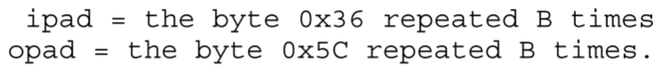
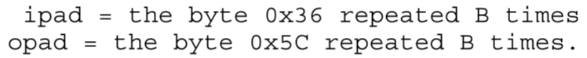
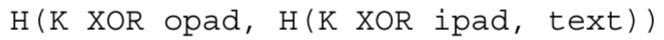

# HMAC

​	HMAC可与任何加密哈希函数结合使用，还使用密钥来计算和验证消息认证值。

**特性：**

- 无需修改即可使用可用的哈希函数。
- 保持散列函数的原始性能而不导致显着下降。
- 以简单的方式使用和处理钥匙。
- 基于对底层哈希函数的合理假设，对身份验证机制的强度进行充分理解的密码学分析。
- 在发现或需要更快或更安全的散列函数的情况下，允许轻松替换底层散列函数。

​	本文档使用通用加密哈希函数（用 H 表示）指定 HMAC。  HMAC 的具体实例需要定义特定的哈希函数。 目前此类哈希函数的候选函数包括 SHA-1 [SHA]、MD5 [MD5]、RIPEMD-128/160 [RIPEMD]。  HMAC 的这些不同实现将被表示为 HMAC-SHA1、HMAC-MD5、HMAC-RIPEMD 等。

​	MD5 最近被证明容易受到碰撞搜索攻击 [Dobb]。 此攻击和其他当前已知的 MD5 弱点不会影响本文档中指定的 HMAC 中 MD5 的使用。然而，SHA-1 似乎是一个加密功能更强的函数。 迄今为止，对于 MD5 的卓越性能至关重要的应用程序，可以考虑在 HMAC 中使用 MD5。

## 定义

​	HMAC 的定义需要一个加密哈希函数（我们用 H 表示）和一个密钥 K。假设 H 是一个加密哈希函数，其中通过在数据块上迭代基本压缩函数来对数据进行哈希处理。 我们用 B 表示此类块的字节长度（对于上述所有哈希函数示例，B=64），用 L 表示哈希输出的字节长度（对于 MD5，L=16，对于 SHA-1，L=20）  ）。

​	定义两个固定且不同的字符串 ipad 和 opad 如下（“i”和“o”是内部和外部的助记符）：

<<<<<<< Updated upstream

**计算公式：**

=======

**计算公式：**

>>>>>>> Stashed changes

**步骤：**

1. 在密钥K末尾追加零以创建 B 字节字符串（例如，如果 K 的长度为 20 字节且 B=64，则 K 将追加 44 个零字节 0x00）
2. 将步骤 (1) 中计算出的 B 字节字符串与 ipad 进行 XOR（按位异或）
3. 将数据流“text”附加到步骤 (2) 生成的 B 字节字符串
4. 将 H 应用到步骤 (3) 中生成的流
5. XOR（按位异或）使用 opad 在步骤 (1) 中计算出的 B 字节字符串
6. 将步骤 (4) 的 H 结果附加到步骤 (5) 产生的 B 字节字符串
7. 将H应用于步骤(6)中生成的流并输出结果

​	HMAC 的定义方式使得底层哈希函数 H 可以在不修改其代码的情况下使用。 特别地，它使用具有预定义初始值IV（每个迭代哈希函数指定的固定值来初始化其压缩函数）的函数H。 然而，如果需要，可以通过（可能）修改 H 的代码以支持变量 IV 来实现性能改进。

​	这个想法是，B字节块(K XOR ipad)和(K XOR opad)上的压缩函数的中间结果只能在生成密钥K时或在其第一次使用之前预先计算一次。 这些中间结果被存储，然后在每次需要验证消息时用于初始化 H 的 IV。 对于每个经过验证的消息，该方法保存了 H 在两个 B 字节块上（即，在 (K XOR ipad) 和 (K XOR opad) 上）的压缩函数的应用。 当验证短数据流时，这样的节省可能是显着的。 

​	

​	HMAC 的应用程序可以选择通过输出某些参数 t 的 HMAC 计算的最左边 t 位来截断 HMAC 的输出（即，按照上面第 2 节中定义的正常方式进行计算，但最终结果被截断为 t 位）。 我们建议输出长度 t 不小于哈希输出长度的一半（以匹配生日攻击界限）并且不小于 80 位（攻击者需要预测的位数的合适下限） ）。 我们建议将使用具有 t 位输出的哈希函数 H 的 HMAC 实现表示为 HMAC-H-t。 例如，HMAC-SHA1-80 表示使用 SHA-1 函数计算的 HMAC，并将输出截断为 80 位。 （如果未指定参数t，例如HMAC-MD5，则假设输出散列的所有位。）

​	这里提出的消息认证机制的安全性取决于散列函数 H 的加密属性：对冲突发现的抵抗力（仅限于初始值是秘密且随机的情况，并且函数的输出不能显式地提供给其他人） 攻击者），以及 H 的压缩函数应用于单个块时的消息认证属性（在 HMAC 中，攻击者部分不知道这些块，因为它们包含内部 H 计算的结果，特别是不能完全选择） 由攻击者）。

​	这些属性（实际上是更强的属性）通常被假定为与 HMAC 一起使用的哈希函数。 特别是，不满足上述属性的散列函数将变得不适合大多数（可能是所有）加密应用，包括基于此类函数的替代消息认证方案。  （有关 HMAC 函数的完整分析和基本原理，读者可以参考 [BCK1]。）

​	1. 该构造独立于所使用的特定散列函数H的细节，并且后者可以被任何其他安全（迭代）密码散列函数替换。

​	2. 消息认证与加密相反，具有“暂时”效果。 消息认证方案的公开破坏将导致该方案的替换，但不会对过去认证的信息产生对抗性影响。 这与加密形成鲜明对比，如果加密算法被破坏，今天加密的信息可能会在未来暴露。

​	已知针对 HMAC 的最强攻击是基于哈希函数 H（“生日攻击”）[PV，BCK2] 的冲突频率，并且对于最低合理哈希函数来说是完全不切实际的。

​	举个例子，如果我们考虑像 MD5 这样的哈希函数，其中输出长度等于 L=16 字节（128 位），攻击者需要获取在大约2\**64上计算的正确消息身份验证标签（使用相同的密钥 K！）  64 个已知明文。 这将需要在 H 下处理至少 2\*\*64 个块，这在任何现实场景中都是不可能的任务（对于 64 字节的块长度，这将在连续 1Gbps 链路中花费 250,000 年，并且在不更改密钥 K 的情况下） 一直以来）。 只有发现函数 H 的冲突行为中的严重缺陷（例如，在 2**30 条消息后发现冲突），这种攻击才可能成为现实。 这样的发现将决定函数 H 的立即替换（对于数字签名、公钥证书等背景下的 H 的传统用途来说，这种失败的影响将严重得多）。

## Key

​	认证密钥K可以是任意长度，最多可达 B（散列函数的块长度）。 使用长于B字节的密钥将首先使用H散列密钥，然后使用生成的 L 字节字符串作为 HMAC 的实际密钥。 在任何情况下，K 的最小推荐长度是 L 字节（作为哈希输出长度）；少于 L 字节，会降低函数的安全强度；长度超过 L 字节的密钥是可以接受的，但额外的长度不会显着增加功能强度。 

​	密钥K需要随机选择（或使用具有随机种子的加密强伪随机生成器），并定期刷新。

<<<<<<< Updated upstream

## 哈希算法

### md5

### sha1

​	 用于计算消息或数据文件的压缩表示。 当输入任意长度（小于2^64 位）的消息时，SHA-1 会生成160 位的消息摘要。 然后，例如，可以将消息摘要输入到生成或验证消息的签名的签名算法。 对消息摘要而不是消息进行签名通常可以提高过程的效率，因为消息摘要的大小通常比消息小得多。 数字签名的验证者必须使用与数字签名的创建者所使用的相同的哈希算法。 传输中消息的任何更改都极有可能导致不同的消息摘要，并且签名将无法验证。

​	SHA-1 之所以被称为安全，是因为在计算上无法找到与**给定消息摘要**相对应的消息，或者找到**产生相同消息摘要的两个不同消息**。 对传输中的消息进行任何更改都极有可能导致不同的消息摘要，并且签名将无法验证。

> 1个字 => 32bit => 4字节 => 8个16进制数
>
> 512bit => 64字节 => 16个字

> AND：按位与
>
> OR：按位或
>
> XOR：异或
>
> NOT：补位

​	为了紧凑性，可以用十六进制表示消息。 消息填充的目的是使填充的消息的总长度为 512 的倍数。SHA-1 在计算消息摘要时顺序处理 512 位的块。 下面指定如何执行此填充。 总之，将一个“1”后跟 m 个“0”后跟一个 64 位整数附加到消息末尾，以生成长度为 512 * n 的填充消息。64 位整数是原始消息的长度。 然后，填充的消息由 SHA-1 处理为 n 个 512 位块。
=======
>>>>>>> Stashed changes
