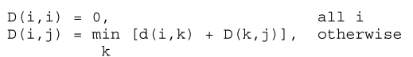
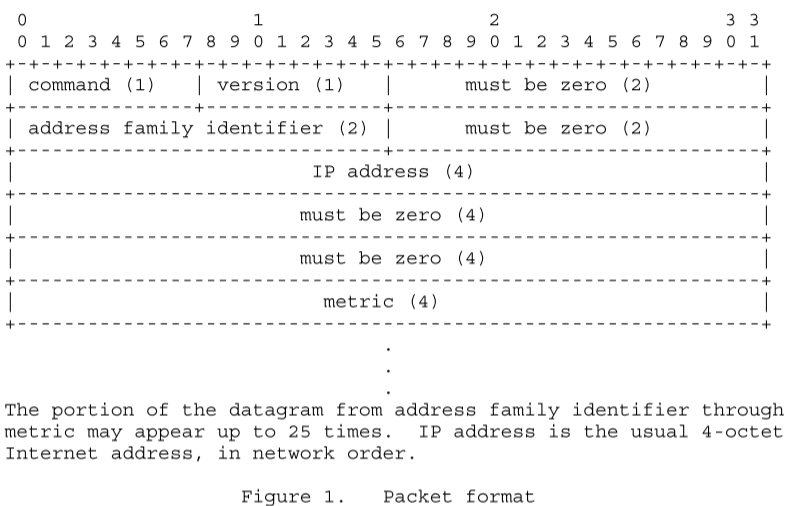
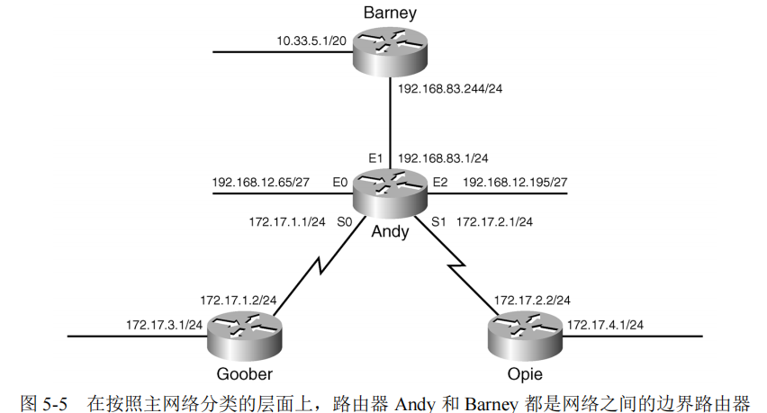
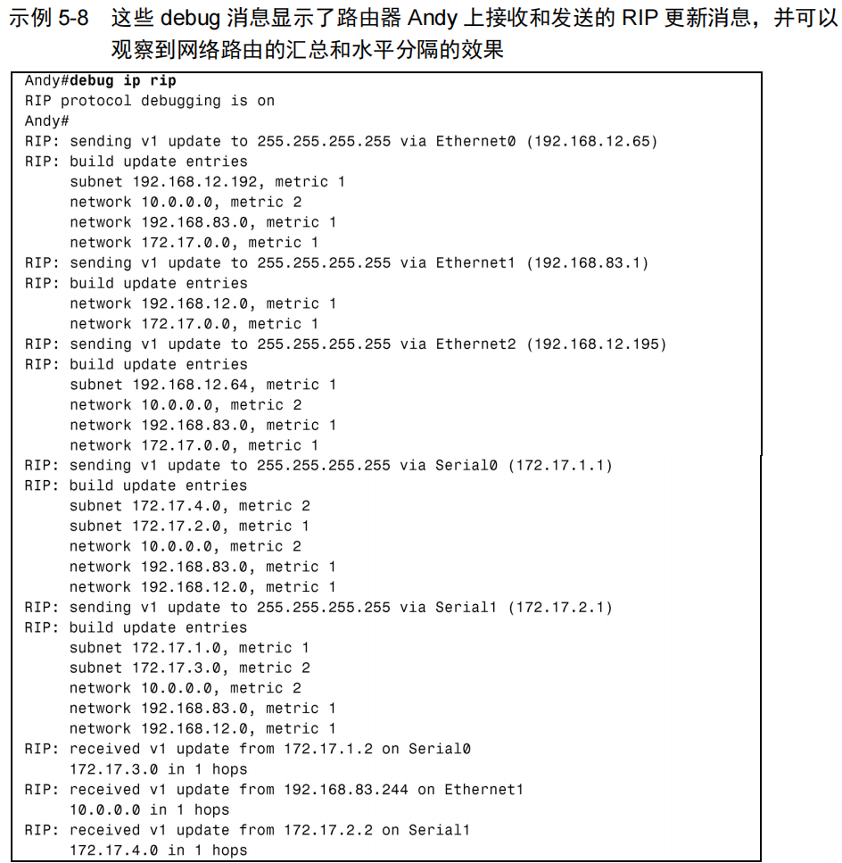

# RIP协议

Routing Information Protocol 路由信息协议。一种<font color='red'>**有类别路由选择协议**</font>

> 有类别路由选择协议特征：
>
> ​	**在通告目的地址时，不能随之一起通告它的掩码地址。**所以，首先**必须匹配一个**与目的地址对应于A类、B类或C类的**主网络号**。
>
> ​	对于每个通过这台路由器的**数据包**：
>
> - 如果目的地址是一个和路由器直连的主网络的成员，那么该网络的路由器接口上配置的子网掩码将被用来确定目标地址的子网。
> - 如果不是，则路由器将会尝试去匹配该目的地址对应于A类、B类或C类的主网络号。


## 距离向量算法

设D(i,j)表示从实体i到实体j最佳路径的度量，即实体i到实体j的开销。




## 消息格式

RIP是一种基于udp的协议。每个使用RIP协议的主机都有一个**路由进程**，**发送和接收UDP端口号为520的数据报文**。所有指向另一个主机的RIP处理器的通信都被发送到520端口。

> 所有路由更新消息都从520端口发送。非请求路由更新消息的源端口和目的端口都等于520。响应请求而发送的消息被发送到请求发出的端口。特定的查询和调试请求可能从520以外的端口发送，但它们被定向到目标机器上的520端口。

协议中有允许“静默”RIP进程的条款。**静默进程**是指**通常不发送任何消息的进程**。但是，它**侦听其他进程发送的消息**。不充当网关的主机可能会使用静默RIP，去侦听路由更新，以便监视本地网关并使其内部路由表保持最新状态。与除一个网络外的所有网络失去联系的网关可能会选择静默，因为它实际上不再是网关。

但是，如果相邻的网关有可能依赖其消息来检测故障网络已经恢复运行，则不应该这样做。



每条消息包含一条命令、一个版本号和路由条目（最多25条）。每个路由条目包括地址族标识、路由可达IP地址和路由的跳数。

- 命令：1表示请求消息（**rip update request** 请求rip路由更新），2表示响应消息（**rip update response** 响应rip路由更新）。
  - 请求 --->  要求其他系统发送全部或部分路由表。
  - 应答 --->  发送全部或部分路由表。
- 版本号：值为1，表示RIP-1；值为2，表示RIP-2。
- 地址族标识（AFI）：对于IP，该项为2。
- IP地址：路由的目的IP地址。`可以是子网号（131.108.1.0）、主机地址（131.108.1.1）、主类网络号（131.108.0.0）或全 0（表示默认路由）`
- 度量：路由的跳数，该字段的取值范围在1~16。


> **间隔30s的原因：避免大量路由器同时发送路由表而造成网络拥塞**


### 请求消息类型

- 请求整个路由表

​	请求消息含有一个地址族标识字段为 0（地址为 0.0.0.0），度量值为 16 的单条路由，接收到这个请求的设备将通过单播方式向发出请求的地址回送它的整个路由表，并遵循一些规则如水平分隔和边界汇总。

- 请求部分路由信息

​	一些诊断测试过程可能需要知道某个或某些具体路由的信息。这种情况下，**请求消息可以与特定地址的路由条目**一起发送。接收到该请求的设备将根据请求消息逐个处理这些条目，构成一个响应消息。

​	如果该设备的路由表中已有请求消息中地址相对应的路由条目，则将其路由条目的度量值填入 metric 字段。如果没有，metric 字段就被设置为 16。在不考虑水平分隔或边界汇总的情况下，响应消息将正确地告诉这台路由器了解的信息。


## RIP程序执行过程

- 初始化

  启动一个路由守护程序，判断开启了哪些接口，并在每个接口上发送一个**特殊请求报文**（command字段为1，地址族标识字段为0，度量字段设置为16），要求与其某个直连路由器发送完整的路由表。

  > 在点对点链路中，请求是发送给其他终点的。
  >
  > 如果支持广播的话，请求是以广播形式发送的。

- 接收到请求
  - 若收到的是特殊请求报文，路由器需要**以单播形式发送**其完整的路由表给请求者。
  - 若是路由更新的请求报文，则处理请求中的每一个表项；如果有连接到指明地址的路由，则将度量设置成我们的值，否则设置为16，然后发送响应。
- 接收到响应
  - 可能会更新路由表
  - 可能会增加新表项，对已有表项进行修改或是删除
- 定期选路更新
  - 每过30s，所有或部分路由器会将其完整的路由表发送给相邻路由器（以广播形式或点对点链路的其他终点的）
- 触发更新
  - 当每条路由的度量发生变化时，就对他更新。不需要发送完整的路由表，而只需要发送那些发生变化的表项。

每条路由都有与之关联的定时器。如果运行RIP的系统发现一条路由在3分钟内未更新，就将该路由的度量设置为16（无穷大），并标记为删除。

> 意味着在6个30s更新时间里没收到`通告该路由的路由器`的更新了。再过60s，从本地路由表中删除该路由，以保证该路由的失效已被传播开。


## 开启RIP协议的路由查询过程

当一个数据包到达开启RIP的路由器后，路由器将进行路由表的查询，定位数据包的下一跳。

1. 首先，读出数据包目的地址的网络部分（基于有类别路由选择协议的主网络号）
   - **根据有类别路由表查询规则**，读出基于A类、B类或C类主网分类的网络号。
2. 查看这个网络部分在路由表中是否有其匹配的条目。
   - 如果没有匹配条目，则丢弃该数据包 ，同时发送一个ICMP目的不可达的消息给发送数据包的源端。
   - 如果有，那么路由表中会列出匹配这个主网络的所有子网，并进一步再这些子网中进行筛查。
     - 若有子网与其匹配，则转发该数据包
     - 若没有，则被丢弃，并发送一个ICMP目的不可达的消息。

### 案例

（1）假设有一个目的地址为 192.168.35.3 的数据包进入路由器，由于该路由器在路由表中没有发现和网络 192.168.35.0 （C类）匹配的条目，因此该数据包将被丢弃。

（2）假设有一个目的地址为 172.25.33.89 数据包进入路由器，在路由表中有一个和 B 类网络 172.25.0.0/24 匹配的条目，那么进一步检查路由表中列出的网络 172.25.0.0/24 的子网条目；显然没有和网络 172.25.33.0 匹配的子网条目，因此该数据包被丢弃。

（3）最后一个例子，假设要到达地址 172.25.153.220 的数据包进入路由器，这时，路由表中有和网络 172.25.0.0/24 匹配的条目，进一步检查到有和子网 172.25.153.0 匹配的条目，因此，该数据包将被转发到下一跳地址 172.25.15.2。


## RIP配置

### 常用命令

| 命令                                                         | 说明                                                         |
| ------------------------------------------------------------ | ------------------------------------------------------------ |
| **debug ip rip [events]**                                    | 简要地**显示路由器收发的RIP信息**                            |
| **ip address** ip-address mask **secondary**                 | 在接口上指定一个ip地址作为辅助地址                           |
| **ip rip triggered**                                         | 在某个接口上配置RIP的触发扩展特性                            |
| **neighbor** ip-address                                      | 通过指定接口邻居的IP地址来建立邻接关系                       |
| <font color='red'>**network** network-number</font>          | 指定一个需要运行RIP的网络                                    |
| **offset-list** {*access-list-number\|name*} {**in\|out**} *offset* [*type* *number*] | 指定路由表中一个与指定的访问列表匹配的路由条目，将自己的度量值增加一个指定的偏移量 |
| **output-delay** *delay*                                     | 设定一个指定延迟长度的延迟间隙，以便协调高速路由器和低速路由器之间的延迟问题 |
| <font color='red'>**router rip** </font>                     | 启动 RIP 进程                                                |
| **timers basic** *update invalid holddown flush*             | 修改指定的计时器的值                                         |
| **passive-interface** *type number*                          | 在指定类型和序列号的接口上阻止 RIP 广播                      |


### 配置RIP协议

1.  开启RIP进程

   ```bash
   router rip
   ```

2.  进入到 **config-router** 配置模式，指定每个需要运行RIP协议的**主网络**

   ```bash
   network network-number
   ```

   由于 RIP 协议具有**有类别路由选择**的特性，从而**在网络边界上会出现子网屏蔽**的情形，这意味着 **network 命令中不需要指定子网**，而**仅仅需要指定相对应的 A 类、B 类或 C 类的主网络地址**。任何一个接口，只要它的配置地址属于 **network** 命令指定的网络，都将会运行 RIP。

### 案例

一个含有 4 台路由器的网络，它包含 4 个主网络号（10.0.0.0、192.168.83.0、192.168.12.0、172.17.0.0）。路由器 Goober 和网络172.17.0.0 的两个子网相连。



**1. 对路由器进行RIP配置**

- **路由器Goober的RIP配置**

```bash
router rip
  network 172.17.0.0
```

- **路由器Opie的RIP配置**

```
router rip
  network 172.17.0.0
```

- **路由器Barney的RIP配置**

```c
router rip
  network 10.0.0.0
  network 192.168.83.0
```

- **路由器Andy的RIP配置**

```
router rip
  network 10.0.0.0
  network 192.168.12.0
  network 192.168.83.0
```


**2. 在路由器Andy上开启RIP协议的调试命令**

```cmd
Andy#debug ip rip
```

