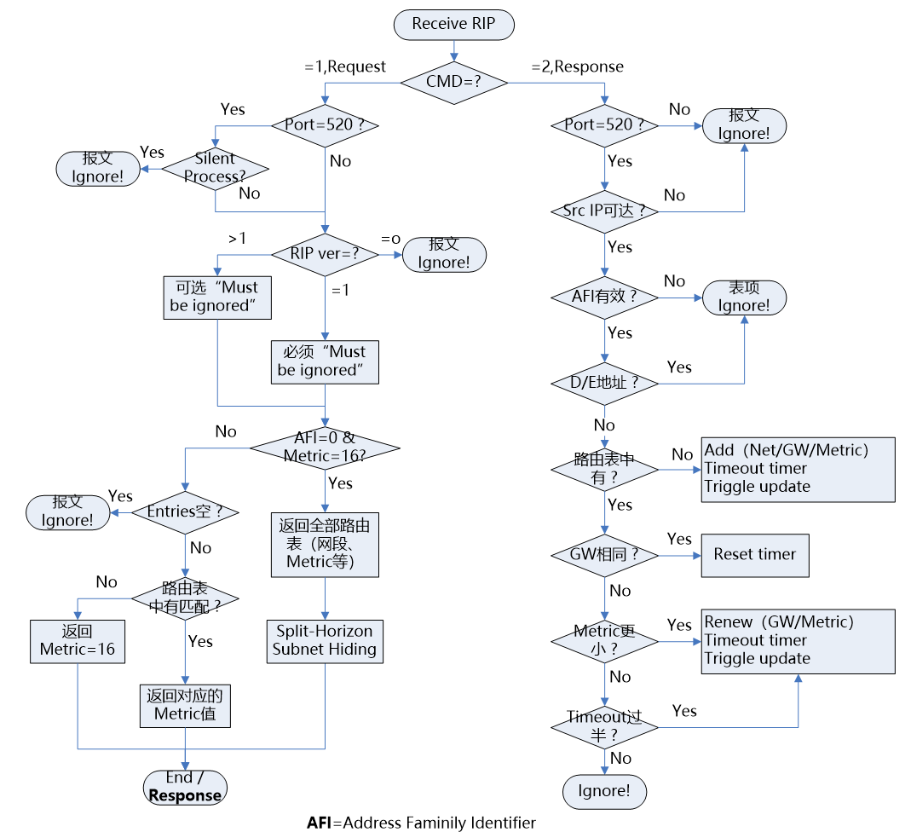
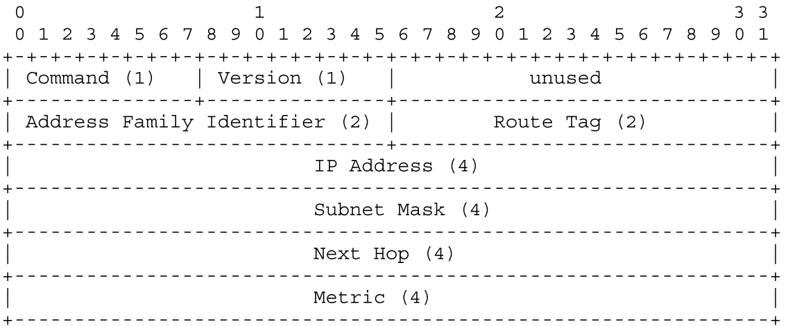
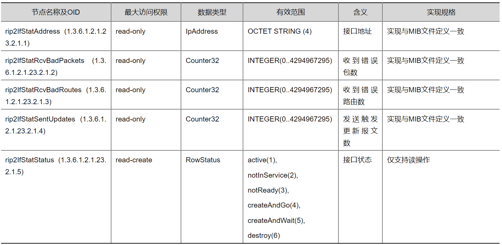

# RIP协议

Routing Information Protocol 路由信息协议，用于在网关和其他主机之间交换路由信息的动态路由协议。

运行在同一个AS（自治系统）号内的路由协议。<font color='red'>**内部网关协议**</font> 

> AS号：一种用于识别互联网上每个自治系统的唯一编号。一个AS号就是一个运营商或大型公司。
>
> **16位AS号（ASN-16）**：范围是1到65535，其中64512到65535为私有保留号段。
>
> **32位AS号（ASN-32）**：扩展了号码范围，以应对不断增长的网络需求。


<font color='red'>**有类别路由选择协议**</font>       适用于中小型网络

> 有类别路由选择协议特征：（通告路由更新的时候不会携带子网掩码）
>
> ​	**在通告目的地址时，不能随之一起通告它的掩码地址。**所以，首先**必须匹配一个**与目的地址对应于A类、B类或C类的**主网络号**。

> 对于每个通过这台路由器的**数据包**：
>
> - 如果目的地址是一个和路由器直连的主网络的成员，那么该网络的路由器接口上配置的子网掩码将被用来确定目标地址的子网。
> - 如果不是，则路由器将会尝试去匹配该目的地址对应于A类、B类或C类的主网络号。


RIP 是<font color='red'>**距离矢量协议**</font>，默认会自动开启汇总功能，即在边界路由器上将路由汇总成主类网段。但是，一般都需要关闭自动汇总。就算在需要的时候，也是通过手动汇总的方式。

```
# IOU2关闭自动汇总
IOU2(config-router)#no auto-summary
# IOU1手动开启汇总
IOU1(config-if)#ip summary-address rip 172.16.0.0 255.255.0.0
```


## 优点

- 在小型网络中，RIP使用的带宽以及配置和管理时间方面的开销非常小
- 易实施


## 版本

### RIPv1

有类路由协议，通过**广播（255.255.255.255）**的形式来发送路由更新的

### RIPv2

无类路由协议，通过**组播（224.0.0.9）**的形式来发送路由更新的


## 四个时间

### 1. 更新时间

默认30s。运行RIP的路由器会每隔30s，向邻接路由器发送自己完整的路由表信息。

### 2. 失效时间

​	默认是180s。如果在180s内没收到来自对方的更新，则认为对方可能处于失效状态。

### 3. 抑制时间

默认是180s，用于维护路由表的稳定，避免环路。

> 不一致的路由信息会导致rip的网络产生环路。


#### 1. 避免环路机制

##### 1.1 定义最大跳数

当RIP的数据包到达第16跳时，就会执行数据包的丢弃流程，所以最大可达跳数是15跳。

##### 1.2 水平分割

从一个接口收到的路由条目信息，该信息不会再从该接口发送出去

##### 1.3 路由毒化

开启了路由毒化功能后，就会自动关闭水平分割。标记了中毒的路由信息，其跳数会被设置为无穷大。

##### 1.4 抑制计时器

在180s内，不会再相信其他路由器发送过来的相关路由的信息（比如E0口网线处于松动情况，一会有路由，一会没有路由）


##### 1.5 触发更新

一旦路由表发送变化，马上触发路由更新。


### 4. 刷新时间

默认是240s，经过240s后，原本处于失效状态的路由条目信息就会被路由器删除。


## 距离矢量算法

> 网关周期性（30s）向外广播发送更新报文，报文中包含它当前的路由表信息（即它所知道的所有目的地及其距离）。其他网关收到该报文后，会根据最短路径原则（Bellman-Ford算法）更新它们自己的路由表。

### 优缺点

优点：简单易于实现

缺点：无法适应路径剧烈变化或大型网间网环境，因为路径变化信息传播缓慢。也因传播速度缓慢，V-D刷新路径过程中，可能出现路径不一致问题。V-D算法的另一个缺陷是它需要大量的信息交换，一方面，V-D报文会发送所有条目，相当于一个路由表，其中许多表目是无关的；另一方面，V-D算法要求所有网关参与信息交换，信息量极大。


### 具体过程

- 首先，路由器启动时，会初始化其路由表，表中只包含与本网关直连的网络。`由于是直连的网络，其距离设置为 0。`

- 其次，网关每隔一定时间（如 30 秒）向直接相连的邻居网关广播其当前的 V-D 路由表。

  该报文包含所有已知目的地及其到达距离。

- 当**相邻网关Gi**收到 V-D 报文后，会检查并根据以下情况修改其本地路由表：

  - 添加新条目：如果相邻网关 Gj 列出某条目，而本地网关 Gi 的路由表中没有该条目
    - Gi 的路由表需增加该条目，条目的**目的地址**为 Gj 表目中的目的地址，距离为 Gj 表目中的**距离** + 1，**路径**为 Gj。

  - 更新条目：如果 Gj 去往某目的地址的距离比 Gi 去往该目的地址的【距离 - 1】还小，说明 Gi 通过 Gj 去往该目的地址的距离更短。
    - Gi 更新其对应条目，目的地址不变，距离改为 Gj 表目中的距离 + 1，路径为 Gj。

  - 路径变化：Gi 去往某目的地址的路径经过 Gj，且 Gj 去往该目的地址的路径发生变化。
    - **删除路径**：如果 Gj 的 V-D 表不再包含去往该目的地址的路径，Gi 中应删除相应路径
    - **更新距离**：如果 Gj 的 V-D 表中去往该目的地址的距离发生变化，则 Gi 中相应表目的距离也需修改为 Gj 中的距离 + 1。

> V-D算法的路径更新发生与相邻网关之间，因此V-D报文不一定以广播方式发送，经过优化，网关直接向相邻的网关发送V-D报文，无需广播。


设D(i,j)表示从实体i到实体j最佳路径的度量，即实体i到实体j的开销。


每个表项包含的信息：

- 目的IP地址
- 度量，到达目的网络所经过的路由器个数，跳数
- 到达目的网络的下一个网关IP地址；若目的网络是直连路由， 则忽略此项
- 路由变更标识
- 与路由相关的各种计时器


###  Metric计算

- 启动时，直连网段，Metric设置为0
- 收到Response报文后，Metric = Metric + Cost


## 消息格式

​	RIP是一种基于udp的协议。每个使用RIP协议的主机都有一个**路由进程**，**发送和接收UDP端口号为520的数据报文**。所有指向另一个主机的RIP处理器的通信都被发送到520端口。

> 所有路由更新消息都从520端口发送。非请求路由更新消息的源端口和目的端口都等于520。响应请求而发送的消息被发送到请求发出的端口。**特定的查询和调试请求可能从520以外的端口发送**，但它们被定向到目标机器上的520端口。

​	**“静”进程**是指**通常不发送任何消息的进程**。但是，它**侦听其他进程发送的消息**。不充当网关的主机可能会使用”静“RIP，去侦听路由更新，以便监视本地网关并使其内部路由表保持最新状态。与除一个网络外的所有网络失去联系的网关可能会选择”静“模式，因为它实际上不再是网关。

但是，如果相邻的网关有可能依赖其消息来检测故障网络已经恢复运行，则不应该这样做。


每条消息包含一条命令、一个版本号和路由条目（最多25条）。每个路由条目包括地址族标识、路由可达IP地址和路由的跳数。

- 命令：1表示请求消息（**rip update request** 请求rip路由更新），2表示响应消息（**rip update response** 响应rip路由更新。为3或4时，被废弃、无用；为5时，给Sun Microsystem预留
  - 请求 --->  要求其他系统发送全部或部分路由表。
  - 应答 --->  发送全部或部分路由表。可能是响应请求或轮询而发送的，也可能是发送方生成的更新消息
- 版本号：值为1，表示RIP-1；值为2，表示RIP-2。
- 地址族标识（AFI）：对于IP，该项为2。
- IP地址（4种类型）：路由的目的IP地址。
  - `子网号（131.108.1.0）`
  - `主机地址（131.108.1.1）`
  - `主类网络号（131.108.0.0）`
  - `全 0（表示默认路由）`
- 度量：路由的跳数，该字段的取值范围在1~16。

> **间隔30s的原因：避免大量路由器同时发送路由表而造成网络拥塞**


**Request**


**Response**


### 请求消息类型

Request请求报文：用于请求对端的全部或部分路由表信息

- 请求整个路由表

​	请求消息含有一个地址族标识字段为 0（地址为 0.0.0.0），度量值为 16 的单条路由，接收到这个请求的设备将通过单播方式向发出请求的地址回送它的整个路由表，并遵循一些规则如水平分隔和边界汇总。

- 请求部分路由信息

​	一些诊断测试过程可能需要知道某个或某些具体路由的信息。这种情况下，**请求消息可以与特定地址的路由条目**一起发送。接收到该请求的设备将根据请求消息逐个处理这些条目，构成一个响应消息。

​	如果该设备的路由表中已有请求消息中地址相对应的路由条目，则将其路由条目的度量值填入 metric 字段。如果没有，metric 字段就被设置为 16。在不考虑水平分隔或边界汇总的情况下，响应消息将正确地告诉这台路由器了解的信息。


##  RIP服务端处理流程



### 接收Request/Response报文流程

#### 1.处理Request报文

```
UDP报文目的端口为520，源端口一般也是520，此时slient processes主机（哑进程，指不关心路由表的设备，如非gateway的普通pc设备）无需响应，若源端口不是520，则所有主机必须响应（源端口非520，通常用于监控网关设备、网管服务器等，此时哑进程也必须回复）
```

#### 2.处理Response报文

```
-- 验证报文的合理性，不合理则丢弃报文：
1.检查报文是否来自端口520的UDP数据报，如果不是，则丢弃
2.检查报文的源IP地址是否是直连的邻居，如果不是，则丢弃
3.检查RIP报文的版本号，如果为0，这个报文就被忽略；如果为1，检查必须为0的字段，如果不为0，忽略该报文；如果大于1，RIP－1对必须为0的字段就不检查。
3.请求的Address Family Identifier与路由表中不符
4.请求的是D、E这类IP地址

-- 若路由表中无相关条目，则加入
1.将Network、Metric、Gateway写入路由表
2.Metric取Metric+Cost（metric计算公式）、16中的较小值
3.启动Timeout Timer计时器
4.置位route change flag，进行触发更新

-- 若路由表中有相关条目，则按先GW再Metric的顺序判断
1.若Response从同一个Gateway中收到，则复位Timeout计时器
2.若Gateway不同，Metric值比原来小，则更新路由条目（GW和Metric）、复位Timeout Timer，并进行触发更新
3.若Gateway不同，Metric值相同，则判断Timeout计时是否过半。若没有，则保留原条目；若过半，则采用新条目（可选机制）
4.若Gateway不同，Metric值比原来大，则忽略
```

### 发送Response流程

> 由于RIP正常工作时，除了**启动时发送Request**外，其他时间都在进行Response更新，此处只关注Response

Response报文主要用于更新对方的路由表，通常在以下三种情况发送：

- 收到有效Request时

- 根据timer定期发送（发送全部路由信息）

- metric变化等引起的**触发更新**（发送只更新变化的路由）

```
// 发送Response报文
1.设置源IP地址，为端口IP地址，它将成为对方的网关
2.设置Version版本号
3.将当前的路由表中的条目依次填入RIP报文的Payload中（上限为512bytes）
```


### 定时器

> 路由器会对路由表中的每个条目都会设置2个定时器：超时定时器和垃圾回收定时器

> 每添加一个新表项就会增加两个定时器。当收到新的路由或该路由更新时，会对超时定时器进行重置。如果在180秒内没有接收到包含该路由的RIP消息，该路由的度量就被设置为16，并启动该路由的垃圾回收定时器。如果120秒过去了，也没有收到该路由的RIP消息，该路由就从路由表中删除。如果在垃圾回收定时器到120秒之前，收到了包含路由的消息，计时器被清0，而路由被安装到路由表中。


#### 1. 路由更新定时器Timer

每**30秒**向所有相邻的网关发送路由更新消息。然而，当网络中存在大量网关时，这些网关可能会因为系统负载或其他因素而**同步**，导致它们几乎同时发送更新消息。

**解决方案**：

- 使用一个不受**系统负载或前一个更新定时器服务时间**影响的时钟来触发30秒更新。
- 每次设置30秒定时器时，都**添加一个小的随机时间偏移量**，以避免同步。


#### 2. **超时定时器Timeout Timer和垃圾回收定时器Garbage-collection Time**

每条路由都有2个定时器：**超时定时器和垃圾回收定时器**。

超时后，该路由将不再有效。但是，它会在表中**保留很短的一段时间**，以便通知邻居该路由已经被丢弃。

当路由删除定时器到时间时，路由最终会从表中删除。

> 超时定时器初始化时机：**建立路由或收到路由的更新**时。如果距离上次初始化超时时间**超过180秒**，则认为该路由已经过期，将其定为无效（Metric设为16），并启动Garbage-collection Timer，相应的路由条目还会参与Response更新，直到Garbage-collection倒计时结束。

> 垃圾回收定时器：当路由因为**超时**或**收到特定更新（如度量值被设置为16，表示不可达）**而开始删除流程时，会为这个路由设置一个120秒的垃圾收集定时器。在这个定时器过期后，路由最终从路由表中删除。并设置一个标志，表示该条目已被更改，并向输出进程发出信号以触发响应。


#### 3. 保持计时器Holddown Timer

如果RIP从同一接口收到某路由的失效更新（跳数为16），则该条目进入Holdown状态，期间忽略所有的对应更新，这是为了防止因错误的更新信息引起的路由环路或不稳定。

> Holddown Timer=120


### 输入处理

#### 1. 格式检查

在UDP端口520上接收到的数据报的处理过程。

1. 进行数据报文的格式检查
   - 版本号
     - =0，则忽略该数据包
     - =1，将按照本规范其余部分的描述进行处理
     - \>1，数据报将按照本规范其余部分的描述进行处理

#### 2. Request请求

​	用于请求主机全部或部分的路由表。从UDP源端口520以广播形式发送。

> ”静“进程如果收到来自520端口的请求，则不用响应；若是其他的UDP端口，就必须要响应


- **特殊请求：**如果请求中只有一个条目，地址族标记为0（表示未指定），度量值为无穷大（16），则是<font color='red'>获取整个路由表的请求</font>。

- 普通请求：处理请求是逐项处理的，如果没有条目，不会作出响应。对于请求中的条目列表的每个条目，会在主机的路由数据库中查找目的路由。

  - 如果有路由，则将该路由的度量值放到数据报文的度量字段中

  - 如果没有到指定目的地的路由，则将无穷大值16放到数据报文的度量字段中

​	一旦条目被填满（25条），设置命令响应并将数据报文发送回它来自的端口。

> 如果请求是针对完整的主机路由表，则完成正常的输出处理。这包括**水平分割和子网隐藏**，这样路由表中的某些条目就不会显示出来。
>
> 如果请求是针对特定的表项，则在主机表中查找它们并返回信息。在这种情况下，不会进行分割范围处理，且如果请求中明确需要，子网信息也会被返回。

> 当一个主机刚刚启动时，它会向所有连接的网络广播请求，以获取完整的路由表。
>
> 完整路由表的请求通常用于更新其他主机的路由表，因此需要进行水平分割和其他形式的过滤，以确保路由信息的准确性和避免路由循环。
>
> 而对特定网络的请求则主要用于诊断目的，不参与实际的路由决策过程。


#### 3. Response响应

收到以下三种情况请求的响应处理：

- 获取整个路由表的请求
- 定期更新路由的请求
- 通过度量值得改变触发的更新请求


收到请求后的响应，第一步需要检查响应的有效性。

- 响应验证
  - 检查响应是否来自520端口，若不是，则忽略它
  - 检查数据报文的源IP地址，是否来自一个邻居主机 `数据包必须是处于一个直连网络的设备发送的。`
  - 检查响应是否来自主机自身的地址，以避免处理自己的输出作为新输入。

- 响应内容处理
  - 逐一处理响应中的条目，首先进行验证。如果度量值大于无穷大（16），则忽略该条目。
  - 检查目的地址
    - 查看地址族标识符是否是internet（2），如果不是2，则忽略该条目。
    - 地址类型（如果为D类、E类地址、或在网络0上（0.0.0.0默认路由除外）或在网络127上（回环网络）、广播地址以及地址中未使用的八位字节中出现非0（如果协议版本为1），则忽略该条目。
  - 更新度量值
    - 通过添加消息到达的网络开销来更新度量，如果结果大于16，则使用16作为新的度量值。


- 路由表更新

  - **添加新路由**：如果路由表中没有该目的地址的路由，并且满足添加条件（如度量值不是无穷大，且主机不是已存在主网络或子网的一部分），则添加新路由。

    > - 将新路由的目的地址和度量值设置为数据包中目的地址和度量值
    > - 将网关设置为数据包来源的主机
    > - 初始化路由超时。如果有垃圾回收定时器，则停止它
    > - 设置路由更改标志，并向输出进程发出信号触发更新

  - **更新现有路由**：如果路由表中已存在该目的地址的路由，则根据**网关**和**度量值**进行比较和更新。若网关相同，则初始化超时定时器；再比较度量值， 如果新度量值更低或度量值不同，则执行

    > - 使用数据报文中的路由。即设置为数据报文中的度量值，并将网关设置为源主机
    > - 初始化超时定时器
    > - 设置路由更改标志，并向输出进程发出信号触发更新
    > - 如果新的度量值为16（无穷大），则开始删除进程

  - **删除路由**：如果新度量值为无穷大（16），则开启删除路由过程。该路由将不再用于路由数据包，并启动垃圾回收定时器。

    > 注意：只有**当度量值第一次被设置为16时，删除才会开始**。如果度量值已经为16，则不会开始新的删除。(开始删除会设置一个计时器。值得关注的是，我们不希望每30秒重置一次计时器，因为新消息到达时带有无限度量。)

  

### 输出处理

用于创建包含全部或部分路由表的响应消息的处理。

触发方式（3种）

- 请求响应：当接收到请求时，生成响应，且仅发送给一个目的地
- 定期更新：每30秒发送包含整个路由表的响应给所有相邻网关。
- 触发更新：当路由的度量值发生变化时，就会触发更新


通常，当要向**所有目的地**发送响应时(即定期更新或触发更新)，将响应发送到每个连接的点对点链路的另一端的主机，并在所有支持广播的连接网络上广播响应。因此，**为每个直连网络准备一个响应，并发送到相应的(目的地或广播)地址**。

在大多数情况下，这将到达所有相邻的网关。然而，在某些情况下，这可能还不够好。**这可能涉及不支持广播的网络**(例如，ARPANET)，或者涉及**哑网关**的情况。在这种情况下，可能需要指定相邻主机和网关的实际列表，并显式地向每个主机和网关发送数据报。这是留给实现者来决定是否需要这样的机制，并定义如何指定列表。

触发的更新需要特殊处理有两个原因。首先，经验表明，**触发更新**可能会**在容量有限或网关众多的网络上**造成过大的负载。因此，协议要求实现者包括限制触发更新频率的条款。**在触发更新发送后，应该设置一个计时器，在1到5秒之间随机设置一个时间**。如果在计时器到期之前发生其他会触发更新的变化，则在计时器到期时触发单个更新，然后将计时器设置为1到5秒之间的另一个随机值。如果在被触发的更新发送时间之前有一个常规更新到期，则触发的更新可能会被抑制。

其次，触发更新不需要包括整个路由表，只需要包括那些已经发生变化的路由。因此，作为触发更新的一部分生成的消息必须至少包括那些设置了路由更改标志的路由。它们可以包括额外的路由，或者所有的路由，由实现者自行决定;但是，当完全路由更新需要多个数据包时，强烈不建议发送所有路由。当处理触发的更新时，应该为每个直连网络生成消息。分割水平处理在生成触发更新和正常更新时完成。


#### 为特定直连网络生成响应数据报

- 源IP地址：发送数据包的主机IP地址

  > 有时网关在单个物理接口上设置多个IP地址。这意味着多个逻辑IP网络在一个物理介质上传输。在这种情况下，必须为每个地址发送单独的更新消息，并将该地址作为IP源地址。

- 版本号：设置为RIP的版本（1或2）

- 命令：设置为2（响应），并将必须为零的字节设为零

- 条目：遍历内部路由表，填充响应条目。每个数据报的最大大小为512字节，若空间不足，则发送当前消息并开始新的消息。

  > 如果正在生成触发更新，则只需要包含设置了路由更改标志的条目。

  

  

## RIP程序执行过程

- 初始化

  启动一个路由守护程序，判断开启了哪些接口，并在每个接口上发送一个**特殊请求报文**（command字段为1，地址族标识字段为0，度量字段设置为16），要求与其某个直连路由器发送完整的路由表。

  > 在点对点链路中，请求是发送给其他终点的。
  >
  > 如果支持广播的话，请求是以广播形式发送的。

- 接收到请求
  - 若收到的是特殊请求报文，路由器需要**以单播形式发送**其完整的路由表给请求者。
  - 若是路由更新的请求报文，则处理请求中的每一个表项；如果有连接到指明地址的路由，则将度量设置成我们的值，否则设置为16，然后发送响应。
- 接收到响应
  - 可能会更新路由表
  - 可能会增加新表项，对已有表项进行修改或是删除
- 定期选路更新
  - 每过30s，所有或部分路由器会将其完整的路由表发送给相邻路由器（以广播形式或点对点链路的其他终点的）
- 触发更新
  - 当每条路由的度量发生变化时，就对他更新。不需要发送完整的路由表，而只需要发送那些发生变化的表项。

每条路由都有与之关联的定时器。如果运行RIP的系统发现一条路由在3分钟内未更新，就将该路由的度量设置为16（无穷大），并标记为删除。

> 意味着在6个30s更新时间里没收到`通告该路由的路由器`的更新了。再过60s，从本地路由表中删除该路由，以保证该路由的失效已被传播开。


## 开启RIP协议的路由查询过程

当一个数据包到达开启RIP的路由器后，路由器将进行路由表的查询，定位数据包的下一跳。

1. 首先，读出数据包目的地址的网络部分（基于有类别路由选择协议的主网络号）
   - **根据有类别路由表查询规则**，读出基于A类、B类或C类主网分类的网络号。
2. 查看这个网络部分在路由表中是否有其匹配的条目。
   - 如果没有匹配条目，则丢弃该数据包 ，同时发送一个ICMP目的不可达的消息给发送数据包的源端。
   - 如果有，那么路由表中会列出匹配这个主网络的所有子网，并进一步再这些子网中进行筛查。
     - 若有子网与其匹配，则转发该数据包
     - 若没有，则被丢弃，并发送一个ICMP目的不可达的消息。

### 案例

（1）假设有一个目的地址为 192.168.35.3 的数据包进入路由器，由于该路由器在路由表中没有发现和网络 192.168.35.0 （C类）匹配的条目，因此该数据包将被丢弃。

（2）假设有一个目的地址为 172.25.33.89 数据包进入路由器，在路由表中有一个和 B 类网络 172.25.0.0/24 匹配的条目，那么进一步检查路由表中列出的网络 172.25.0.0/24 的子网条目；显然没有和网络 172.25.33.0 匹配的子网条目，因此该数据包被丢弃。

（3）最后一个例子，假设要到达地址 172.25.153.220 的数据包进入路由器，这时，路由表中有和网络 172.25.0.0/24 匹配的条目，进一步检查到有和子网 172.25.153.0 匹配的条目，因此，该数据包将被转发到下一跳地址 172.25.15.2。


## RIP配置

### 常用命令

| 命令                                                         | 说明                                                         |
| ------------------------------------------------------------ | ------------------------------------------------------------ |
| **debug ip rip [events]**                                    | 简要地**显示路由器收发的RIP信息**                            |
| **ip address** ip-address mask **secondary**                 | 在接口上指定一个ip地址作为辅助地址                           |
| **ip rip triggered**                                         | 在某个接口上配置RIP的触发扩展特性                            |
| **neighbor** ip-address                                      | 通过指定接口邻居的IP地址来建立邻接关系                       |
| <font color='red'>**network** network-number</font>          | 指定一个需要运行RIP的网络                                    |
| **offset-list** {*access-list-number\|name*} {**in\|out**} *offset* [*type* *number*] | 指定路由表中一个与指定的访问列表匹配的路由条目，将自己的度量值增加一个指定的偏移量 |
| **output-delay** *delay*                                     | 设定一个指定延迟长度的延迟间隙，以便协调高速路由器和低速路由器之间的延迟问题 |
| <font color='red'>**router rip** </font>                     | 启动 RIP 进程                                                |
| **timers basic** *update invalid holddown flush*             | 修改指定的计时器的值                                         |
| **passive-interface** *type number*                          | 在指定类型和序列号的接口上阻止 RIP 广播                      |


### 配置RIP协议

1.  开启RIP进程

   ```bash
   router rip
   ```

2.  进入到 **config-router** 配置模式，指定每个需要运行RIP协议的**主网络**

   ```bash
   network network-number
   ```

   由于 RIP 协议具有**有类别路由选择**的特性，从而**在网络边界上会出现子网屏蔽**的情形，这意味着 **network 命令中不需要指定子网**，而**仅仅需要指定相对应的 A 类、B 类或 C 类的主网络地址**。任何一个接口，只要它的配置地址属于 **network** 命令指定的网络，都将会运行 RIP。

### 案例

#### 1. 基本RIP配置案例

一个含有 4 台路由器的网络，它包含 4 个主网络号（10.0.0.0、192.168.83.0、192.168.12.0、172.17.0.0）。路由器 Goober 和网络172.17.0.0 的两个子网相连。


**1. 对路由器进行RIP配置**

- **路由器Goober的RIP配置**

B类地址

```bash
router rip
  # version 2 -- RIP版本
  network 172.17.0.0  # 通告网段，是主类网段（B类）。如果通告的不是主类网段，会被设备修改为主类网段
```

- **路由器Opie的RIP配置**

B类地址

```
router rip
  network 172.17.0.0
```

- **路由器Barney的RIP配置**

A、C类地址

```c
router rip
  network 10.0.0.0
  network 192.168.83.0
```

- **路由器Andy的RIP配置**

A、C类地址

```
router rip
  network 10.0.0.0
  network 192.168.12.0
  network 192.168.83.0
```

```
show ip route rip
```

**2. 在路由器Andy上开启RIP协议的调试命令**

```cmd
Andy#debug ip rip
```

> 192.168.12.010 00001 (27)
>
> 192.168.12.110 00011 (27)

- 由于 E0（192.168.12.65/27）和E2接口（192.168.12.195/27）都是和192.168.12.0**相连的**，所以子网192.168.12.64 和192.168.12.192可以在这两个接口上进行通告。
- 在和其他**不同的网络相连**的E1（192.168.83.1/24）、S0（172.17.1.1/24）、S1（172.17.2.1/24）接口上，这两个子网需要**汇总后**才通告出去。
- 同样地，192.168.83.0和172.17.0.0在通过**有类别网络边界**时，也会被路由汇总后通告出去。


#### 2. 被动接口案例

在网络中增加路由器 Floyd，但不希望在路由器 Floyd 和 Andy 之间交换 RIP协议的通告消息。


- **路由器Floyd配置**

```bash
router rip
	network 192.168.100.0
```

没有设置包含192.168.12.0的network命令，路由器Floyd就不会在E0接口上通告192.168.12.0。但是，路由器 Andy 有两个和网络 192.168.12.0 相连的接口，因此网络 192.168.12.0 必须包含在 RIP 中。如

如果一台路由器接口**处于一个启动 RIP协议的网络的子网**中，那么路由器**会在该接口上发出 RIP 广播**，为了阻塞这样的 RIP 广播，在 RIP 的处理中就需要增加一条 **passive-interface** 命令。

- **路由器Andy的被动接口配置**

```
router rip
	passive-interface Ethernet0
	network 172.17.0.0
	network 192.168.12.0
	network 192.168.83.0
```

> 命令 **Passive-interface** 不是 RIP 协议专有的命令，它可以在所有的 IP 路由选择协议中配置使用。
>
> 通过该命令，使得在一条特定的数据链路上，将路由器作为一台“静”主机来看待，即只在特定链路上监听RIP广播，从而更新自己的路由表。与”静“主机不同的是，在被动接口上，不会响应请求的消息。


#### 3. 配置单播更新案例

​	增加一台新的路由器 Bea，并连接到路由器 Andy 和 Floyd 之间的以太网共享链路上。在路由器 Andy 和 Floyd 之间的链路上依然保留不启动 RIP协议的路由策略，但在路由器 Bea 和 Andy 之间，Bea 和 Floyd 之间现在都必须交换 RIP通告消息。


- **路由器Bea的RIP配置**

```
router rip
	network 192.168.12.0
	network 192.168.200.0
```

- **路由器Andy的RIP配置**

通过neighbor命令，使得RIP协议能以单播方式向路由器Bea的接口发送通告，而此时，路由器Andy上的passive-interface命令仍继续防止在该链路上广播更新。

```
router rip
	passive-interface Ethernet0
	network 172.17.0.0
	network 192.168.12.0
	network 192.168.83.0
	neighbot 192.168.12.67
```

**路由器Floyd的RIP配置**

因为路由器 Floyd 现在必须发送 RIP 通告给路由器 Bea，因此也必须增加一条通告192.168.12.0 的 **network** 命令。为了防止广播更新，也要增加一条 **Passive-interface** 命令，并且要增加 **neighbor** 命令以单播方式通告 RIP 更新给路由器 Bea。

```
router rip
	passive-interface Ethernet0
	network 192.168.100.0
	network 192.168.12.0
	neighbor 192.168.12.67
```


#### 4. 不连续的子网案例

​	另一台路由器Ernest_T被添加到原来的网络上，它通过一个 E1 接口和子网 10.33.32.0/20相连。现在问题出现了，网络 10.0.0.0 的另一个子网（10.33.0.0/20）是和路由器 Barney 相连的，它和子网 10.33.32.0/20 之间只有一条惟一的经过网络 192.168.83.0 和 192.168.12.0 的路由路径，而这是它们完全不同的两个网络。结果，网络 10.0.0.0 将变成为不连续的。


路由器 Barney 会认为自己是网络 10.0.0.0 和网络 192.168.83.0 之间的边界路由器；

路由器 Ernest_T 也会认为自己是网络 10.0.0.0 和网络 192.168.12.0 之间的边界路由器。

它们都将通告一条网络 10.0.0.0 的汇总路由，结果路由器 **Andy** 将会“傻乎乎”地认为它有**两条等价的路径**可以到达同一个网络。在这种情况下，路由器 Andy 将在与路由器 Barney 和Ernest_T 相连的链路上进行**均分负载**，因而，要到达网络 10.0.0.0 的数据包现在只有 50%的机会可以转发到正确的子网上。


> 解决方法是在网络 192.168.83.0/24 和 192.168.12.192/27 **<font color='red'>所在的同一条链路上配置网络10.0.0.0 的子网</font>**，这可以通过在路由器接口上配置辅助 IP 地址（secondary IP address）实现。

- **路由器Barney配置辅助IP地址**

```
interface e0
	ip address 10.33.55.1 255.255.240.0 secondary
```

- **路由器Andy配置辅助IP地址，并在RIP中新增一个网络**

因为路由器 Andy 在前面的配置中没有和网络 10.0.0.0 相连的接口，所以在 RIP 配置中增加了一条网络声明（**network** 10.0.0.0）

```
interface e1
	ip address 10.33.55.2 255.255.240.0 secondary
interface e2
	ip address 10.33.75.1 255.255.240.0 secondary
router rip
	network 10.0.0.0
```

- **路由器Ernest_T配置辅助IP地址**

```
interface e0
	ip address 10.33.75.2 255.255.240.0 secondary
```


## RIPv1局限性

- 不考虑自治系统和 IGP/EGP 交互
- 是有类别路由选择协议，即更新路由时不携带子网掩码信息
- 不支持身份验证


## RIPv2

与 RIP-1 一样，RIP-2 不支持无地址链路（不使用特定IP地址进行通信的网络链路）。

> RFC 1721：RIP-2 分析
>
> RFC 1722：RIP-2 适用性声明
>
> RFC 1723：RIP-2 协议描述
>
> RFC 1724：RIP-2 MIB描述


### 消息格式



> 所有字段均按 IP 网络字节序（大端）进行编码


#### 新增字段

##### 1. Authentication

**身份验证（2字节）**是针对每条消息的功能。  

> 路由信息本身通常不需要保密，但必须防止无法访问网络的人插入虚假路由信息。

由于任何合理的身份验证方案都需要两个以上的八位字节，**RIPv2 的身份验证方案将使用 1 个字节的空间**。 

> **身份验证条目：**如果消息中第一个条目（或仅第一个）的**<font color='red'>地址族标识符为0xFFFF</font>**，则该条目的**其余部分包含身份验证**。
>
> **RIP条目：**那么，消息的其余部分最多可以有 24 个 RIP 条目。

> 如果未使用身份验证，则消息中的任何条目都不应具有地址族标识符 0xFFFF。


> 目前的身份验证类型：**简单密码（类型为2）**。其余 **16 个八位字节包含纯文本密码**，若密码小于16个八进制位，则**必须左对齐**并用**空值 (0x00) 填充到右侧**。


##### 2. Route Tag

若干RIP支持外部网关协议（EGP），该字段包含一个自治系统号。

路由标记（RT）字段是分配给路由的属性，必须与路由一起保留和重新通告该路由。

用途：提供一种将”内部“RIP路由（RIP 路由域内的网络的路由）与”外部“RIP路由分开的方法，`”外部RIP路由可能是从 EGP 或另一个 IGP 导入的`

> 支持RIP以外的路由协议可配置为”允许为从不同源导入的路由配置“路由标记。

> 例如，从 EGP 或 BGP 导入的路由应该能够将其路由标记设置为任意值，或者至少设置为从中获知路由的自治系统的编号。

```c
/*RIP路由标识*/
enum RIP_ROUTE_TAG
{
	RIP_INTERNAL_ROUTE = 1,/*域内路由*/
	RIP_EXTERNAL_ROUTE = 0,/*域外路由*/
	RIP_ROUTE_TAG_BUTT  // 用于表示枚举的结束或保留值，无实际意义。
};
```

##### 3. Subnet mask

该字段包含与IP地址相关的子网掩码，用于确定IP地址的非主机部分。如果此字段为零，则表示该条目没有包含子网掩码。

**与RIP-1的兼容性规则**：

- **网络内部信息**：来自一个网络内部的信息不得广播到另一个网络，以避免信息混乱。
- **更具体子网的广播**：更具体的子网信息不能**在RIPv1路由器将其视为主机路由**的情况下进行通告。
- **超网路由的广播**：超网路由（即比“自然”网络掩码更不具体的路由）不得在RIP-1路由器中被广播，以防止误解。


##### 4. Next Hop（建议性字段）

- **下一跳IP地址：**指向数据包在达到目标地址时需要转发的下一个路由器的IP地址。
  - 如果设置为`0.0.0.0`，表示数据包将通过发出RIP通告的路由器进行路由。
- **直接可达性：**下一跳地址必须是在逻辑子网上直接可达的。
- **减少额外跳数：**下一跳字段的目的是减少数据包在网络中经过的跳数，从而优化路由路径。这在并不是所有路由器都运行RIP的情况下尤为重要。
- **建议性字段：**虽然下一跳提供了指导信息，但如果该信息被忽略，路由仍然是有效的，只是可能不是最优的。如果接收到的下一跳不可达，则应将其视为`0.0.0.0`。


##### 5. Multicasting

- **减少负载**：通过使用多播地址（224.0.0.9），只有监听RIP-2消息的主机会接收到信息，从而**减轻不需要这些消息的主机的负担**。
- **IGMP不需要**：因为这些消息是在路由器之间传递的，所以不需要IGMP协议，且这些消息不会被转发。
- **向后兼容性**：为了兼容旧版协议，使用多播地址的功能是可配置的，允许在需要时启用或禁用。
- **接口使用**：如果启用多播，则应在所有支持的接口上使用。


##### 6. Queries

如果 RIP-2 路由器收到 RIP-1 请求，它应使用 RIP-1 响应进行响应。 如果路由器配置为仅发送 RIP-2 消息，则它不应响应 RIP-1 请求。

##### 

### 兼容性开关

#### 发送开关配置选项

- RIP-1：仅发送RIP-1消息
- RIP-1 compatibility（默认）：广播RIP-2消息，兼容RIP-1
- RIP-2：以多播方式发送RIP-2消息
- none：禁用发送RIP消息

> 路由器还应该实现一个接收控制开关，该开关将确定是否接受、仅接受 RIP-1、仅接受 RIP-2、两者都接受或不接受。 它还应该可以在每个接口的基础上进行配置。


### RIP-2认证算法

**认证算法**：描述了如何对RIP消息进行认证。

- 如果路由器未配置为认证RIP-2消息，则接受RIP-1和未认证的RIP-2消息，而认证的RIP-2消息将被丢弃。
- 如果路由器配置为认证RIP-2消息，则只接受通过认证的RIP-2消息和RIP-1消息；未认证或认证失败的RIP-2消息将被丢弃。
  - 为了最大限度地提高安全性，当使用认证时，应忽略RIP-1消息。

**地址族标识符**：认证条目的地址族标识符（AFI）为0xFFFF，这意味着**RIP-1系统会忽略此条目**，因为它属于非IP地址族。

​			   `使用认证不会阻止RIP-1系统接收RIP-2消息`

**多播选项**：如果需要<font color='red'>避免RIP-1系统接收RIP-2消息</font>，可以使用**多播**来实现。


## RIPv2-MIB 扩展

Management Information Base（MIB）管理信息库，包含对所有对象类型的规范

> MIB：包含全局计数器，用于检测RIP不兼容的有害影响；两个“接口”表和一个可选的“邻居”表。

作用：实现RIPv2**接口统计信息、接口配置信息和邻居路由器信息的记录和读取**。

文件名：rfc1724-rip.mib


### Definitions

定义RIPv2-MIB模块的起始部分，包含了模块的基本信息、导入的对象和模块标识等内容

```c
// 定义模块开始部分
RIPv2-MIB DEFINITIONS ::= BEGIN

// 导入基础对象类型和符号
IMPORTS
	MODULE-IDENTITY, OBJECT-TYPE, Counter32,
	TimeTicks, IpAddress			FROM SNMPv2-SMI  // 从 SNMPv2-SMI 模块中导入，用于定义对象类型。
	TEXTUAL-CONVENTION, RowStatus	FROM SNMPv2-TC   // 从SNMPv2-TC模块中导入，用于文本约定和行状态。
	MODULE-COMPLIANCE, OBJECT-GROUP	FROM SNMPv2-CONF // 从SNMPv2-CONF模块中导入，用于模块合规性和对象分组。
	mib-2							FROM RFC1213-MIB;// 从RFC1213-MIB模块中导入，表示基本的MIB2根节点。

// 定义模块标识信息
rip2 MODULE-IDENTITY
	LAST-UPDATED "9407272253Z" -- Wed Jul 27 22:53:04 PDT 1994	// 表示该模块的最后更新时间
	ORGANIZATION "IETF RIP-II Working Group"	//表示该MIB模块是由IETF RIP-II工作组开发和维护的。
	CONTACT-INFO 	// 联系人信息 
	"	Fred Baker
		Postal: Cisco Systems
				519 Lado Drive
				Santa Barbara, California 93111
		Tel:	+1 805 681 0115
		E-Mail: fbaker@cisco.com
		Postal: Gary Malkin
				Xylogics, Inc.
				53 Third Avenue
				Burlington, MA 01803
		Phone: (617) 272-8140
		EMail: gmalkin@Xylogics.COM"
	DESCRIPTION
			"The MIB module to describe the RIP2 Version 2 Protocol"
            
	::= { mib-2 23 } // 对象标识符OID，表示rip2模块的OID是mib-2的第23个子标识符。
					 // mib-2是SNMP管理信息库的根节点之一，23表示该模块在mib-2树中的位置。


// RouteTag 作为一种文本约定的类型
// 它表示数据包头部或路由条目中“路由域（Route Domain）”字段的内容。
// RouteTag 通常用于区分不同的路由域，虽然在某些情况下，这个字段可能已经不再被广泛使用或被其他机制替代。
RouteTag ::= TEXTUAL-CONVENTION
	STATUS	current
	DESCRIPTION
		"the RouteTag type represents the contents of the Route Domain field in the packet header or route entry"
	SYNTAX	OCTET STRING (SIZE (2))  //指定RouteTag的数据类型(字节字符串)和长度(固定为2个字节（16位）)
```


### 1. Global Counters

全局计数器组，包括两个对象：`rip2GlobalRouteChanges` 和 `rip2GlobalQueries`

全局计数器组**用于统计和监控RIP2协议的全局状态信息**。这些计数器用于调试快速变化的路由或失败的邻居，帮助网络管理员了解和诊断网络中的动态变化。

> 对于RIP2全局组的实现是强制性的。

```C
// rip2Globals对象标识符，是rip2模块下的第一个子标识符，表示RIPv2全局计数器组的根节点。
rip2Globals OBJECT IDENTIFIER ::= { rip2 1 }

// 该对象表示RIP协议对IP路由数据库所做的路由变更次数。但它不包括路由老化时间的刷新操作。
//     通过该计数器，管理员可以监控RIP协议导致的路由变更频率，有助于识别不稳定的路由情况或者快速变化的网络状态。
rip2GlobalRouteChanges OBJECT-TYPE
	SYNTAX Counter32 // 表示一个32位的无符号整数，通常用于累加计数
	MAX-ACCESS read-only
	STATUS current
	DESCRIPTION
		"The number of route changes made to the IP Route Database by RIP. This does not include the refresh of a route’s age."
	::= { rip2Globals 1 } // 表示 rip2GlobalRouteChanges 是 rip2Globals 组下的第一个对象
	

// 该对象表示系统响应来自其他系统的RIP查询的次数。
//		通过该计数器，管理员可以了解系统与其他RIP邻居间的交互情况，特别是在响应查询方面的频率。
rip2GlobalQueries OBJECT-TYPE
	SYNTAX Counter32
	MAX-ACCESS read-only
	STATUS current
	DESCRIPTION
		"The number of responses sent to RIP queries from other systems."
	::= { rip2Globals 2 } // 表示 rip2GlobalQueries是 rip2Globals 组下的第二个对象
```


### 2. RIP Interface Tables

属于RIP接口组

对于实现RIP-2的系统，这些接口组的实现是强制性的。

#### 2.1 RIP接口状态表

```c
// 该表用于描述接口统计信息
rip2IfStatTable OBJECT-TYPE  // 对象类型
	SYNTAX SEQUENCE OF Rip2IfStatEntry  // 语法：Rip2IfStatEntry的序列
	MAX-ACCESS not-accessible  // 最大访问权限：不可访问
	STATUS current  // 状态： 当前
	DESCRIPTION     // 描述：需要在RIP中进行单独监视状态的子网列表
		"A list of subnets which require separate status monitoring in RIP."
	::= { rip2 2 }
```

```c
rip2IfStatEntry OBJECT-TYPE 
	SYNTAX Rip2IfStatEntry  // 语法：Rip2IfStatEntry
	MAX-ACCESS not-accessible
	STATUS current
	DESCRIPTION    // 索引：在单个子网中的单个路由域
		"A Single Routing Domain in a single Subnet." 
	INDEX { rip2IfStatAddress } // 索引：rip2IfStatAddress
	::= { rip2IfStatTable 1 }
```

```c
Rip2IfStatEntry ::=
	SEQUENCE {
		rip2IfStatAddress
			IpAddress,
		rip2IfStatRcvBadPackets
			Counter32,
		rip2IfStatRcvBadRoutes
			Counter32,
		rip2IfStatSentUpdates
			Counter32,
		rip2IfStatStatus
			RowStatus
	}
```

```c
// Rip2IfStatEntry中的序列
rip2IfStatAddress OBJECT-TYPE
	SYNTAX IpAddress      // 语法：IpAddress
	MAX-ACCESS read-only  // 最大访问权限： 只读
	STATUS current
	DESCRIPTION   // 指定子网上该系统的 IP 地址。
    			  // 对于未编号的接口，值为 0.0.0.N，其中最低有效 24 位 (N) 是网络字节序中 IP 接口的 ifIndex。”
		"The IP Address of this system on the indicated subnet. For unnumbered interfaces, the value 			0.0.0.N, where the least significant 24 bits (N) is the ifIndex for the IP Interface in network 		byte order."
	::= { rip2IfStatEntry 1 }

rip2IfStatRcvBadPackets OBJECT-TYPE
	SYNTAX Counter32 // 语法：Counter32
	MAX-ACCESS read-only
	STATUS current
	DESCRIPTION 
    	// RIP进程收到的RIP响应数据包的数量，这些数据包随后因任何原因（例如版本0数据包或未知的命令类型）而被丢弃。
		"The number of RIP response packets received by the RIP process which were subsequently 				discarded for any reason (e.g. a version 0 packet, or an unknown command type)."
	::= { rip2IfStatEntry 2 }

rip2IfStatRcvBadRoutes OBJECT-TYPE
	SYNTAX Counter32
	MAX-ACCESS read-only
	STATUS current
    DESCRIPTION
    	// 有效RIP数据包中因任何原因（例如未知地址族或无效度量）而被忽略的路由数量。
		"The number of routes, in valid RIP packets, which were ignored for any reason (e.g. unknown 			address family, or invalid metric)."
	::= { rip2IfStatEntry 3 }

rip2IfStatSentUpdates OBJECT-TYPE
	SYNTAX Counter32
	MAX-ACCESS read-only
	STATUS current
	DESCRIPTION  // 在此接口上实际发送的触发RIP更新的数量。这明确不包括发送的包含新信息的完整更新
		"The number of triggered RIP updates actually sent on this interface. This explicitly does NOT 			include full updates sent containing new information."
	::= { rip2IfStatEntry 4 }

rip2IfStatStatus OBJECT-TYPE
	SYNTAX RowStatus
	MAX-ACCESS read-create
	STATUS current
	DESCRIPTION  // 写入无效会删除此接口。
		"Writing invalid has the effect of deleting this interface."
	::= { rip2IfStatEntry 5 }
```




#### 2.2 RIP接口配置表

The RIP Interface Configuration Table.

##### rip2IfConfTable

```c
rip2IfConfTable OBJECT-TYPE
	SYNTAX SEQUENCE OF Rip2IfConfEntry
	MAX-ACCESS not-accessible
	STATUS current
	DESCRIPTION // 需要在RIP中单独配置的子网列表。
		"A list of subnets which require separate configuration in RIP."
	::= { rip2 3 }
```

##### rip2IfConfEntry

```c
rip2IfConfEntry OBJECT-TYPE
	SYNTAX Rip2IfConfEntry
	MAX-ACCESS not-accessible // 最大访问权限：不可访问
	STATUS current
	DESCRIPTION // 单个子网中的单个路由域
		"A Single Routing Domain in a single Subnet."
	INDEX { rip2IfConfAddress }
	::= { rip2IfConfTable 1 }

Rip2IfConfEntry ::=
	SEQUENCE {
		rip2IfConfAddress
			IpAddress,
		rip2IfConfDomain
			RouteTag,
		rip2IfConfAuthType
			INTEGER,
		rip2IfConfAuthKey
			OCTET STRING (SIZE(0..16)),
		rip2IfConfSend
			INTEGER,
		rip2IfConfReceive
			INTEGER,
		rip2IfConfDefaultMetric
			INTEGER,
		rip2IfConfStatus
			RowStatus,
		rip2IfConfSrcAddress
			IpAddress
}
```

###### 1.rip2IfConfAddress

```c
rip2IfConfAddress OBJECT-TYPE
	SYNTAX IpAddress
	MAX-ACCESS read-only
	STATUS current
	DESCRIPTION
		// 指定子网上此系统的 IP 地址。
    	// 对于未编号的接口，值为0.0.0.N，其中最低有效24位(N)是ifIndex 为网络字节序的IP接口。
		"The IP Address of this system on the indicated subnet. For unnumbered interfaces, the value 			0.0.0.N, where the least significant 24 bits (N) is the ifIndex for the IP Interface in network 		byte order."
	::= { rip2IfConfEntry 1 }

```

###### 2.rip2IfConfDomain

```c
rip2IfConfDomain OBJECT-TYPE
	SYNTAX RouteTag
	MAX-ACCESS read-create
	STATUS obsolete
	DESCRIPTION
    	// 插入到此接口上发送的所有RIP数据包的路由域字段中的值。
		"Value inserted into the Routing Domain field of all RIP packets sent on this interface."
	DEFVAL { ’0000’h }
	::= { rip2IfConfEntry 2 }
```

###### 3.rip2IfConfAuthType

```c
rip2IfConfAuthType OBJECT-TYPE
	SYNTAX INTEGER {
		noAuthentication (1),
		simplePassword (2),
		md5 (3)
	}
	MAX-ACCESS read-create
    STATUS current
	DESCRIPTION
		"The type of Authentication used on this interface."
	DEFVAL { noAuthentication }
	::= { rip2IfConfEntry 3 }
```

###### 4.rip2IfConfAuthKey

```c
rip2IfConfAuthKey OBJECT-TYPE
	SYNTAX OCTET STRING (SIZE(0..16)) // OCTET STRING (SIZE(0..16))
	MAX-ACCESS read-create  // 最大访问权限：读取创建状态
	STATUS current
	DESCRIPTION
        // 每当 rip2IfConfAuthType 的相应实例具有 noAuthentication 以外的值时，将用作身份验证密钥的值。对 rip2IfConfAuthType 的相应实例的修改不会修改 rip2IfConfAuthKey 值。如果提供的字符串短于 16 个八位字节，则它将左对齐并填充到16个八位字节，在右侧，用空值 (0x00)
		"The value to be used as the Authentication Key whenever the corresponding instance of 					rip2IfConfAuthType has a value other than noAuthentication. A modification of the corresponding 		instance of rip2IfConfAuthType does not modify the rip2IfConfAuthKey value. If a string shorter 		than 16 octets is supplied, it will be left-justified and padded to 16 octets, on the right, with	  	nulls (0x00). 
    
    	// 读取该对象始终会产生长度为零的八位字节字符串； 无法通过读取 MIB 对象来绕过身份验证。 
    	Reading this object always results in an OCTET STRING of length zero; authentication 					may not be bypassed by reading the MIB object."
	DEFVAL { ’’h }
	::= { rip2IfConfEntry 4 }
```

###### 5.rip2IfConfSend

```c
rip2IfConfSend OBJECT-TYPE
	SYNTAX INTEGER {
		doNotSend (1),
		ripVersion1 (2),
		rip1Compatible (3),
		ripVersion2 (4),
		ripV1Demand (5),
		ripV2Demand (6)
	}
	MAX-ACCESS read-create
	STATUS current
	DESCRIPTION
        // 路由器在此接口上发送的内容。 
        // ripVersion1 意味着发送符合RFC 1058的RIP更新。
        // 		rip1Compatible 意味着使用RFC1058路由包含规则，广播RIP-2更新。
        // ripVersion2 意味着多播RIP-2更新。 
        //		ripV1Demand 表示根据RIP-1规则，在WAN接口上使用请求RIP。 
        //		ripV2Demand 表示根据RIP-2规则，在WAN接口上使用请求RIP。
		"What the router sends on this interface. ripVersion1 implies sending RIP updates compliant with RFC 1058. rip1Compatible implies broadcasting RIP-2 updates using RFC 1058 route subsumption rules. ripVersion2 implies multicasting RIP-2 updates. ripV1Demand indicates the use of Demand RIP on a WAN interface under RIP Version 1 rules. ripV2Demand indicates the use of Demand RIP on a WAN interface under Version 2 rules."
	DEFVAL { rip1Compatible }
	::= { rip2IfConfEntry 5 }
```

###### 6.rip2IfConfReceive

```c
rip2IfConfReceive OBJECT-TYPE
	SYNTAX INTEGER {
		rip1 (1),
		rip2 (2),
		rip1OrRip2 (3),
		doNotRecieve (4)
	}
	MAX-ACCESS read-create
	STATUS current
	DESCRIPTION
        // 这表明要接受哪个版本的 RIP 更新。 注意 rip2 和 rip1OrRip2 意味着接收多播数据包。
		"This indicates which version of RIP updates are to be accepted. Note that rip2 and
rip1OrRip2 implies reception of multicast packets."
	DEFVAL { rip1OrRip2 }
	::= { rip2IfConfEntry 6 }
```

###### 7.rip2IfConfDefaultMetric

```c
rip2IfConfDefaultMetric OBJECT-TYPE
	SYNTAX INTEGER ( 0..15 )
	MAX-ACCESS read-create
	STATUS current
	DESCRIPTION
    	// 此变量指示在该接口上发起的 RIP 更新中用于默认路由条目的度量。
    	// 值为零表示不应发起任何默认路由；在这种情况下，可以传播通过另一个路由器的默认路由 
		"This variable indicates the metric that is to be used for the default route entry in RIP updates originated on this interface. A value of zero indicates that no default route should be originated; in this case, a default route via another router may be propagated."
	::= { rip2IfConfEntry 7 }
```

###### 8.rip2IfConfStatus

```c
rip2IfConfStatus OBJECT-TYPE
	SYNTAX RowStatus
	MAX-ACCESS read-create
	STATUS current
	DESCRIPTION // “写入无效，具有删除该接口的效果。
		"Writing invalid has the effect of deleting this interface."
	::= { rip2IfConfEntry 8 }
```

###### 9.rip2IfConfSrcAddress

```c
rip2IfConfSrcAddress OBJECT-TYPE
	SYNTAX IpAddress
	MAX-ACCESS read-create
	STATUS current
	DESCRIPTION
    	// 该系统将用作该接口上的源地址的 IP 地址。
    	// 如果它是编号接口，则该值必须与 rip2IfConfAddress 的值相同。
    	// 在未编号的接口上，它必须是系统上某些接口的 rip2IfConfAddress 的值。
		"The IP Address this system will use as a source address on this interface. If it is a numbered
interface, this MUST be the same value as rip2IfConfAddress. On unnumbered interfaces, it must be the value of rip2IfConfAddress for some interface on the system."
	::= { rip2IfConfEntry 9 }
```


### 3. Peer Table

> 对端表：此表的实现（可选）。
>
> RIP Peer Group：提供当前活跃的RIP邻居关系，旨在帮助调试。 
>
> **活跃的邻居（Active Peer）**：指的是那些在最近的180秒内发送过有效RIP更新的路由器。如果一个路由器超过180秒没有发送更新，那么它将不再被认为是活跃的邻居。

#### 3.1 rip2PeerTable

```c
rip2PeerTable OBJECT-TYPE
	SYNTAX SEQUENCE OF Rip2PeerEntry
	MAX-ACCESS not-accessible
	STATUS current
	DESCRIPTION
		"A list of RIP Peers."
	::= { rip2 4 }
```

#### 3.2 rip2PeerEntry

rip2PeerEntry：RIPv2的邻居条目

```c
rip2PeerEntry OBJECT-TYPE
	SYNTAX Rip2PeerEntry
	MAX-ACCESS not-accessible
	STATUS current
	DESCRIPTION	
    	// 此对象类型包含与某个单一的RIP路由邻居相关的信息。
		"Information regarding a single routing peer."
	INDEX { rip2PeerAddress, rip2PeerDomain } // 定义了该表的索引。通过rip2PeerAddress和rip2PeerDomain字段唯一标识。
	::= { rip2PeerTable 1 } // 表示 rip2PeerEntry是rip2PeerTable对象的第一个子对象


// Rip2PeerEntry 被定义为一个 SEQUENCE（序列），表示它包含多个字段，每个字段都有特定的含义和数据类型：
Rip2PeerEntry ::=
	SEQUENCE {
		rip2PeerAddress // 表示RIP邻居的IP地址。用于标识RIP邻居的网络位置。
			IpAddress,
		rip2PeerDomain
			RouteTag,
		rip2PeerLastUpdate
			TimeTicks,
		rip2PeerVersion
			INTEGER,
		rip2PeerRcvBadPackets
   			Counter32,
		rip2PeerRcvBadRoutes
			Counter32
	}
```

###### 1. rip2PeerAddress

它表示邻居使用的源IP地址，即邻居设备发送RIP消息时使用的IP地址。

```c
rip2PeerAddress OBJECT-TYPE
	SYNTAX IpAddress // 数据类型是IpAddress，表示该对象保存一个标准的IPv4地址。
	MAX-ACCESS read-only
	STATUS current // 表明状态是当前有效的和被广泛使用的。
	DESCRIPTION
    	// 在没有编号的链路上，这个IP地址可能不是系统中任何子网的成员地址
		"The IP Address that the peer is using as its source address. Note that on an unnumbered link, this may not be a member of any subnet on the system."
	::= { rip2PeerEntry 1 }
```

###### 2.rip2PeerDomain

它表示从邻居接收到的RIP数据包中的路由域字段的值。

> 由于路由域支持（domain support）已被弃用，因此该值**必须为零**。这意味着尽管该字段被定义和使用，但在现代RIP实现中，它没有实际功能，仅作为保留字段存在。

```c
rip2PeerDomain OBJECT-TYPE
	SYNTAX RouteTag  // 数据类型是 RouteTag，用于表示特定的路由标签或域信息。
	MAX-ACCESS read-only
	STATUS current 
	DESCRIPTION
		"The value in the Routing Domain field in RIP packets received from the peer. As domain suuport
is deprecated, this must be zero."
	::= { rip2PeerEntry 2 }
```

###### 3.rip2PeerLastUpdate

它用于表示接收某个RIP邻居最近一次更新的时间。

```c
rip2PeerLastUpdate OBJECT-TYPE
	SYNTAX TimeTicks // 表示自设备启动以来的时间数（通常以1/100秒为单位）
	MAX-ACCESS read-only
	STATUS current
	DESCRIPTION
    	// sysUpTime：设备自启动以来的时间计数，表示从设备启动到接收该RIP更新之间的时间间隔
		"The value of sysUpTime when the most recent RIP update was received from this system."
	::= { rip2PeerEntry 3 }
```

###### 4.rip2PeerVersion

它用于表示最近一次从邻居接收到的RIP数据包的版本号

```c
rip2PeerVersion OBJECT-TYPE
	SYNTAX INTEGER ( 0..255 )
	MAX-ACCESS read-only
	STATUS current
	DESCRIPTION
		"The RIP version number in the header of the last RIP packet received."
	::= { rip2PeerEntry 4 }
```

###### 5.rip2PeerRcvBadPackets

记录从特定RIP邻居接收到的**无效RIP响应数据包**的数量

> 这些无效数据包可能由于格式错误、不符合协议规范或包含错误信息等原因被丢弃。

```c
rip2PeerRcvBadPackets OBJECT-TYPE
	SYNTAX Counter32  // 记录接收到的无效数据包数量
	MAX-ACCESS read-only
	STATUS current
	DESCRIPTION
    	// 用于统计从RIP邻居接收到的、因无效而被丢弃的数据包数量
		"The number of RIP response packets from this peer discarded as invalid."
	::= { rip2PeerEntry 5 }
```

###### 6.rip2PeerRcvBadRoutes

记录从某个RIP邻居接收到的**无效路由条目**的数量。

```c
rip2PeerRcvBadRoutes OBJECT-TYPE
	SYNTAX Counter32  // 记录接收到的无效路由条目的数量
	MAX-ACCESS read-only
	STATUS current
	DESCRIPTION
		"The number of routes from this peer that were ignored because the entry format was invalid."
	::= { rip2PeerEntry 6 }
```


### 4. Conformance information

一致性信息

```c
// rip2Conformance对象标识符，表示与RIP2协议相关的一致性信息的起始点。其值为rip2的第五个部分。
rip2Conformance OBJECT IDENTIFIER ::= { rip2 5 }

// rip2Groups对象标识符
//		一致性信息的第一部分，定义了RIP2系统的多个分组。
rip2Groups OBJECT IDENTIFIER ::= { rip2Conformance 1 }
// rip2Compliances对象标识符
// 		一致性信息的第二部分，具体包括合规性声明。
rip2Compliances OBJECT IDENTIFIER ::= { rip2Conformance 2 }
```

##### 4.1 compliance statements

合规性声明

```c
rip2Compliance MODULE-COMPLIANCE
	STATUS current
	DESCRIPTION
		"The compliance statement "
    
	MODULE -- this module   // 表示该模块的开始部分
	MANDATORY-GROUPS {  	// RIP2必须实现的四个分组
		rip2GlobalGroup,
		rip2IfStatGroup,
		rip2IfConfGroup,
		rip2PeerGroup
	}
	
	// 该组定义了RIP2系统的全局控制选项
	GROUP rip2GlobalGroup 
	DESCRIPTION
		"This group defines global controls for RIP-II systems."
        
    // 该组定义了RIP2系统的接口统计信息
	GROUP rip2IfStatGroup
	DESCRIPTION
		"This group defines interface statistics for RIP-II systems."
        
    // 该组定义了RIP2系统的接口配置选项。
	GROUP rip2IfConfGroup
	DESCRIPTION
		"This group defines interface configuration for RIP-II systems."
        
    // 该组定义了RIP2系统的邻居信息。
	GROUP rip2PeerGroup
	DESCRIPTION
		"This group defines peer information for RIP-II systems."
	::= { rip2Compliances 1 }
```

##### 4.2 units of conformance

一致性单位

```c
// 1.rip2GlobalGroup对象组
// 该组定义了RIP2系统的全局控制信息，包括全局的路由变更和查询统计。
rip2GlobalGroup OBJECT-GROUP
	OBJECTS {
		rip2GlobalRouteChanges, // 全局路由变化的数量
		rip2GlobalQueries       // 全局查询的数量
	}
	STATUS current
	DESCRIPTION
		"This group defines global controls for RIP-II systems."
	::= { rip2Groups 1 }
	
// 2.rip2IfStatGroup对象组
// 该组定义了RIP2系统的接口统计信息，包括无效数据包和无效路由条目的数量、接口的状态等。
rip2IfStatGroup OBJECT-GROUP
	OBJECTS {
		rip2IfStatAddress,   		// 统计与接口相关的地址信息
		rip2IfStatRcvBadPackets,	// 统计接收到的无效数据包数量
		rip2IfStatRcvBadRoutes,		// 统计接收到的无效路由条目数量
		rip2IfStatSentUpdates,		// 统计发送的更新数据包数量
		rip2IfStatStatus			// 统计接口的状态信息
	}
	STATUS current
	DESCRIPTION
		"This group defines interface statistics for RIP-II systems."
	::= { rip2Groups 2 }

// 3.rip2IfConfGroup对象组
// 该组定义了RIP2系统的接口配置选项，包括地址、认证、发送接收设置、默认度量值和接口状态等。
rip2IfConfGroup OBJECT-GROUP
	OBJECTS {
		rip2IfConfAddress, 		// 配置接口地址
		rip2IfConfAuthType,		// 配置接口的认证类型
		rip2IfConfAuthKey,		// 配置接口的认证密钥
		rip2IfConfSend,			// 配置接口是否发送RIP更新
		rip2IfConfReceive,		// 配置接口是否接收RIP更新
		rip2IfConfDefaultMetric,// 配置接口的默认度量值
		rip2IfConfStatus,		// 配置接口的状态信息
		rip2IfConfSrcAddress	// 配置接口的源地址
	}
	STATUS current
	DESCRIPTION
		"This group defines interface configuration for RIP-II systems."
	::= { rip2Groups 3 }

// 4.rip2PeerGroup对象组
// 该组定义了RIP2系统中邻居的信息，包括邻居的IP地址、最近更新时间、RIP版本号，以及接收的无效数据包和无效路由条目等。
rip2PeerGroup OBJECT-GROUP
	OBJECTS {
		rip2PeerAddress, 	  	// 邻居的IP地址。
		rip2PeerDomain,			// 邻居的路由域信息（尽管该功能已被弃用）
		rip2PeerLastUpdate,		// 最近一次从邻居接收的RIP更新时间
		rip2PeerVersion,		// 最近一次接收的RIP数据包的版本号
		rip2PeerRcvBadPackets,	// 从邻居接收到的无效数据包数量
		rip2PeerRcvBadRoutes	// 从邻居接收到的无效路由条目数量
	}
	STATUS current
	DESCRIPTION
		"This group defines peer information for RIP-II systems."
	::= { rip2Groups 4 }
```

