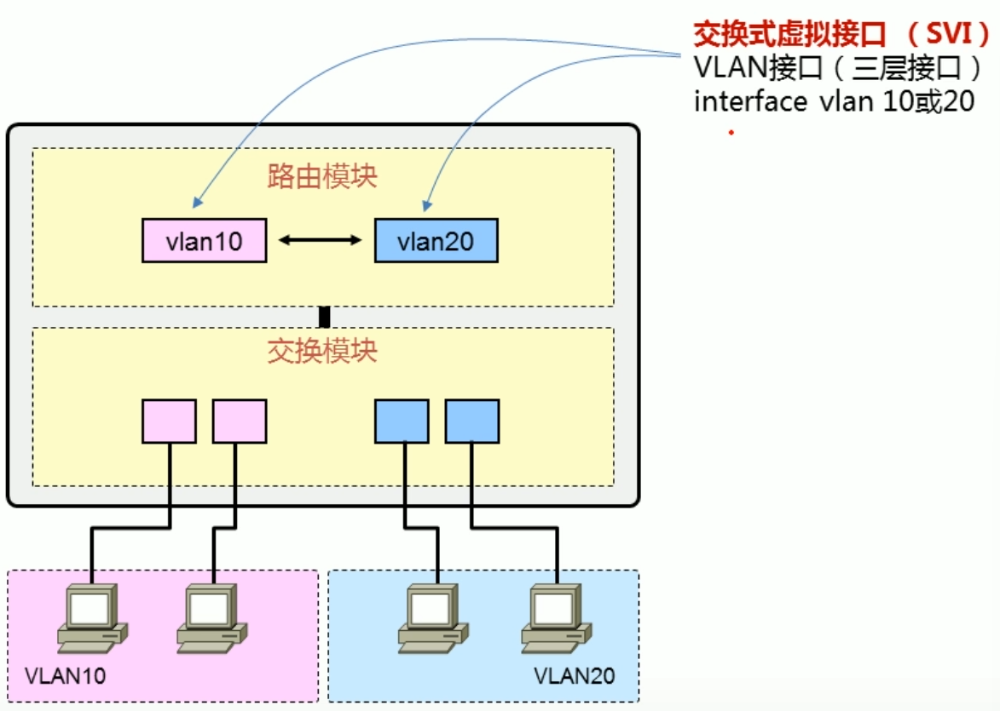

# Rip_switch

## SVI（交换式虚拟接口）

```cmd
# 进入VLAN 10的VLAN接口
interface vlan 10 # 进入配置VLAN接口（三层接口）
```



### 三层交换机的端口模式

- 二层接口（switchport）

  > 二层交换机只能有一个VLAN接口拥有IP地址，且用于这台设备的管理

  - access模式
  - trunk模式

- 三层接口

  - 路由接口（no switchport或routed port）


```
# 进入交换机的接口
int f0/1
# 将接口设置为二层接口
switchport mode access
switchport pvid 10

# 将一个物理接口变为三层接口
no switchport 
```

```
# 三层交换机开启路由功能
ip routing

```


```c
# 创建vlan
int vlan 10
ip address 192.168.2.1 255.255.255.0

# 给端口g0/1绑定vlan 10
int g0/1
switchport pvid 10

# 开启rip实例
router rip 1

# 将其设置到vlan中
int vlan 10
ip rip 1 enable
```


## cmd

### ip rip \<processid> enable

- 首先，根据解析命令行参数，获取到device_index

- 根据device_index获取对应的pintf

- 根据命令类型判断

  - 若是Normal，根据入参，检查端口是否绑定了进程

  - 若绑定了，则无需设置

  - 否则，如果pintf->processid!=0说明已经设置过了，返回错误

  - 根据processid从全局的进程链表中获取对应的RIP进程

  - 若没有，则需要以该端口的vrf，创建RIP实例

    ```cmd
    ret = rip_cmd_rip_process_enter(u, processid, pintf->vrf_id, FALSE);
    ```

  - 之后，根据查询到的pprocess，检查和端口的vrf-id是否一样，若不一样，也可继续配置，等待端口配置的vrf-id改变为一致时生效

  - 然后，端口和pprocess进行关联

    ```
    pintf->process_id = processid;
    pintf->pprocess = pprocess;
    /* 将端口添加到rip进程的端口链表中*/
    rip_relate_intf_to_process(device_index, pprocess, RIP_INTF_ADD_TO_PROCESS);
    
    // chuang'jia
    rip_process_route_activate(pprocess, &msg);
    ```


- 针对带参数的命令行

  - router rip <process_id>

  ```c
  param.type = ARG_UINT;
  param.min = 1;
  param.max = 65535;
  param.flag = ARG_MIN | ARG_MAX;
  
  // router rip processid
  rc = getparameter(argc + 1, argv - 1, u, &param);
  if (rc != 0)
  {
      return rc;
  }
  
  processid = param.value.v_int;
  vrfid = 0;
  
  rc = cmdend(argc - 1, argv + 1, u);
  if (rc != 0)
  {
      return rc;
  }
  ```


### 协议配置态命令

- 没有参数的命令行

  - 只有一个命令

    - check-zero-domain          =》 pprocess->flags =  0x02
    - validate-update-source   =》  pprocess->flags = 0x01
    - auto-summary                  =》  pprocess->auto_summary_flag = 1

    ```c
    // 检查参数边界
    rc = cmdend(argc - 1, argv + 1, u);
    
    // (u)->struct_s[0]
    processid = GetProcID( u );
    
    ret = rip_lookup_process_byprocessid(processid, &pprocess);
    if (ret != RIP_SUCCESS)
    {
        rip_debug(RIP_DEBUG_IP_RIP_RETURN, "RIP: %s %d.\n", __FILE__,__LINE__);
        return RIP_FAIL;
    }
    ```

    

- 带参数的命令

  - 带一个参数

    - default-metric <metric>
    - version <value>
    - input-queue <value >

    ```c
    // 检查参数边界
    rc = cmdend(argc - 1, argv + 1, u);
    
    // processid = u->struct_s[0]
    // device_index = u->struct_p[1];
    processid = GetProcID( u );
    
    // 获取metric参数
    param.type = ARG_UINT;
    param.min = 1;
    param.max = 16;
    param.flag = ARG_MIN | ARG_MAX;
    ret = getparameter(argc + 1, argv - 1, u, &param);
    if(ret != 0) 
    {
        return ret;
    }
    
    pprocess->default_metric = param.value.v_int;
    ```

    

### 接口配置态命令

#### 不带参数

- ip rip passive       =>  BIT_SET(rip_intf_array[device_index]->special_flag, RIP_PASSIVE_ENABLE);     // 0x01

- ip rip deaf            =>  BIT_SET(rip_intf_array[device_index]->special_flag, RIP_NOTRECV_ENABLE);   // 0x02   

  - 端口上不接收rip报文，但会发送Update更新报文        

- ip rip v1demand/v2demand =>  BIT_SET(rip_intf_array[device_index]->special_flag, RIP_SEND_V1DEMAND); // 0x04

  ​							 BIT_SET(rip_intf_array[device_index]->special_flag, RIP_SEND_V2DEMAND); // 0x08

  - 只发送v1/v2格式的请求报文                         

- ip rip split-horizon simple | poisoned  

  ​                                         => rip_intf_array[device_index]->split_flag |= RIP_SIMPLE_SPLIT_HORIZON_ENABLE; // 0x01

  ​                                         => rip_intf_array[device_index]->split_flag |= RIP_POISONED_SPLIT_HORIZON_ENABLE;  // 0x02

  

#### 带参数

##### 含一个参数

- ip rip send version <version> [compatibilty]
- ip rip receive version <version>

```c
ret = cmdend(argc - 1, argv + 1, u);
if(ret != 0)
{
    return ret;
}

param.type = ARG_UINT;
param.min = 1;
param.max = 2;
param.flag = ARG_MIN | ARG_MAX ;
ret = getparameter(argc + 1, argv - 1, u, &param);
if( ret != 0 )
{
    return ret;
}
device_index = u->struct_p[1];

if( 1 == param.value.v_int )
{
    rip_intf_array[device_index]->send_version = RIP_SEND_VERSION_1;
}
else if( 2 == param.value.v_int )
{
    rip_intf_array[device_index]->send_version = RIP_SEND_VERSION_2_MULTICAST;
}


```

