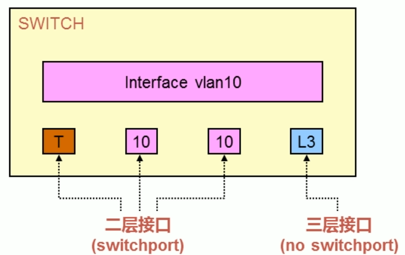

# Rip_switch

## SVI（交换式虚拟接口）

```cmd
# 进入VLAN 10的VLAN接口
interface vlan 10 # 进入配置VLAN接口（三层接口）
```


### 三层交换机的端口模式

- 二层接口（switchport）

  > 二层交换机只能有一个VLAN接口拥有IP地址，且用于这台设备的管理

  - access模式
  - trunk模式

- 三层接口

  - 路由接口（no switchport或routed port）



```
# 进入交换机的接口
int f0/1
# 将接口设置为二层接口
switchport mode access
switchport pvid 10

# 将一个物理接口变为三层接口
no switchport 
```

```
# 三层交换机开启路由功能
ip routing

```


```c
# 创建vlan
int vlan 10
ip address 192.168.2.1 255.255.255.0

# 给端口g0/1绑定vlan 10
int g0/1
switchport pvid 10

# 开启rip实例
router rip 1

# 将其设置到vlan中
int vlan 10
ip rip 1 enable
```


## cmd

### ip rip \<processid> enable

- 首先，根据解析命令行参数，获取到device_index

- 根据device_index获取对应的pintf

- 根据命令类型判断

  - 若是Normal，根据入参，检查端口是否绑定了进程

  - 若绑定了，则无需设置

  - 否则，如果pintf->processid!=0说明已经设置过了，返回错误

  - 根据processid从全局的进程链表中获取对应的RIP进程

  - 若没有，则需要以该端口的vrf，创建RIP实例

    ```cmd
    ret = rip_cmd_rip_process_enter(u, processid, pintf->vrf_id, FALSE);
    ```

  - 之后，根据查询到的pprocess，检查和端口的vrf-id是否一样，若不一样，也可继续配置，等待端口配置的vrf-id改变为一致时生效

  - 然后，端口和pprocess进行关联

    ```
    pintf->process_id = processid;
    pintf->pprocess = pprocess;
    /* 将端口添加到rip进程的端口链表中*/
    rip_relate_intf_to_process(device_index, pprocess, RIP_INTF_ADD_TO_PROCESS);
    
    // chuang'jia
    rip_process_route_activate(pprocess, &msg);
    ```

    
