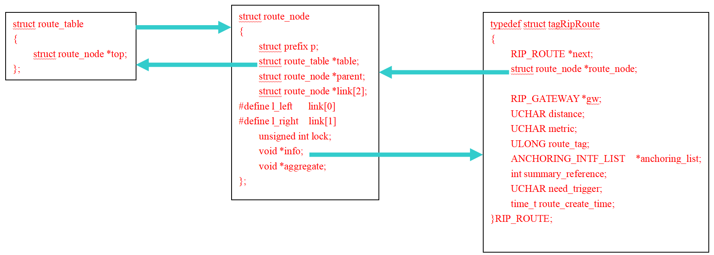
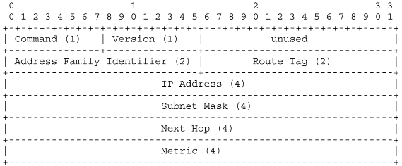
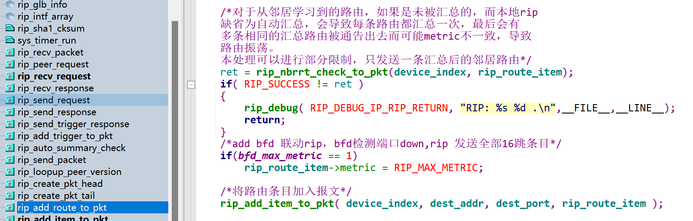

# RIP代码

```
  1. RIP RFC，包括MIB brower，读取mib节点
  2. rip和cisco模拟器做互通性实验；
  3. 走读代码，并在组内做rip模块介绍
  4. 对照入网测试文档，移动入围测试文档，自己尝试写测试用例，做测试设计，并进行测试。
```


## 预编译指令

`#pragma pack(1)` ：将结构体成员按 1 字节对齐

`#pragma align 1`：在某些编译器中可能用于设置对齐方式

`#pragma align 0`：通常用于恢复默认对齐设置

`#pragma pack ()`：取消自定义字节对齐方式


## 外部数据结构

### rt_msg

```c
struct rt_msg 
{
	unsigned long type;
	unsigned long uid;
	unsigned long len;
	unsigned long param;
};
```

```c
struct MESSAGE_PARAM 
{
	union {
		unsigned long dest;
		unsigned long ifindex;

		unsigned long proto;
		/* DV_DEVICE_ENTRY * ifap; */
		unsigned long data_uint32;
		long data_int32;
		void * ptr;
	} data1;
	union {
		unsigned long mask;
		unsigned long ipaddr;
		
		void *ptr;
		unsigned long data_uint32;
	} data2;
	union {
		unsigned long dest;
		unsigned long next_hop;
		unsigned long ifindex;

		unsigned long data_uint32;
	} data3; 
	union {
		unsigned long mask;
		long metric;
		unsigned long data_uint32;
	} data4;
	union {
		unsigned long next_hop;
		long tag;
		unsigned long data_uint32;
	} data5;
	union {
		unsigned long metric;
		unsigned long data_uint32;
		void *ptr;
	} data6;
	union {
		unsigned long tag;
		unsigned long data_uint32;
	} data7;
	union {
		unsigned long data_uint32;
	} data8;
	union {
		unsigned long data_uint32;
	} data9;
	union {
		unsigned long data_uint32;
	} data10;
	union {
		unsigned long data_uint32;
	} data11;
	union {
		unsigned long data_uint32;
	} data12;
	union {
		unsigned long data_uint32;
	} data13;
	union {
		unsigned long data_uint32;
	} data14;
	union {
		unsigned long data_uint32;
	} data15;
};
```

### route_table

```c
/* Routing table top structure. */
/* 路由表结构，用来操作路由表，常在添加、删除、查找路由信息时使用 */
struct route_table
{
    /* 某个路由表的入口(头指针)，用来指向第一个route_node节点，如二叉树中的根节点 */
	struct route_node *top;
	
	/* vrf identifier. */
	uint32 vrf_id; /* 该路由表所属的vrf(每个vrf对应一个路由表) */
};
```

### route_node

```c
/* Each routing entry.  用来存储路由信息 */
struct route_node
{
	/* Actual prefix of this radix. */
	struct prefix p; /* 该路由节点具体的网段信息 */

	/* Tree link. */
	struct route_table *table; /* 指向该路由节点所属的路由表的入口地址 */
	struct route_node *parent; /* 指向父节点(二叉树上的) */
	struct route_node *link[2]; /* 左右子树的头结点 */
#define l_left   link[0]    /* 左孩子 */
#define l_right  link[1]    /* 右孩子 */

	/* Lock of this radix */
	/* 在操作过程中对该路由节点的锁定，以避免删除引起的非法访问等问题，
	实际上就是一个引用计数，为0时需删除该节点，非0时不能删除 */
	uint32 lock;

	/* Each node of route. */
	void *info; /* 用来保存具体的路由信息 */
	void *node_info[1]; /* 可以用来保存一些附加信息，比如具体的激活路由等 */

	uint32 flags;
	uint32 exf_operating;  /*note this node whether is being added to exf for rtv6lc*/
	
#define rn_data flags
#define rn_value exf_operating

#ifdef INCLUDE_ADJACENCY_TABLE
    /*供egress使用的记录信息*/
	uint32 egrcookie;
#endif
};
```




### route_distance

```c
/* XXXXXX: Route distance object is identified by source and mask pair. */
/* Route Distance structure. */
struct route_distance {
	struct route_distance *prev;
	struct route_distance *next;
	struct route_distance_list *list;
	
	/* Use this to filter the route source address. */
	struct prefix prefix_source;

	unsigned char distance;	/* route distance, 0 is invalide */
	
	/* Use acl to filter the route destination address. */
	unsigned long acl_id;
	char *acl_name;
	void *acl;
};

/* Route Distance structure list */
struct route_distance_list {
	struct route_distance_list *next;

	unsigned long long protocol;	/* Route protocol flag. */
	unsigned long process;			/* Route protocol process. */
	uint32 vrfid;					/* vrfid */

	void (*func)(unsigned long long, unsigned long, uint32 vrfid);/* Function used to refresh routes. */
	unsigned char default_distance;	/* Default distance. 0 is invalide */
	
	struct route_distance *head;	/* Head of route distance list. */
	struct route_distance *tail;	/* Tail of route distance list. */
};
```


### prefix

```c
/* IPv4 and IPv6 unified prefix structure. */
struct prefix
{
  u_int8_t family;
  u_int8_t prefixlen;
  u_int8_t prefix_style;
  u_int8_t pad1;
  union
  {
    u_int8_t prefix;
    struct in_addr prefix4;
#ifdef HAVE_IPV6
    struct in6_addr prefix6;
#endif /* HAVE_IPV6 */
    struct
    {
      struct in_addr id;
      struct in_addr adv_router;
    } lp;
    u_int8_t val[9];
  } u;
};
```


## RIP报文


### rip_pkt_head_


```c
/*RIP报文头部数据结构*/
typedef struct rip_pkt_head_
{
	uint8  cmd;   /*报文类型       */
	uint8  version;/*报文版本类型*/
	uint16 zero;  /*零项               */
}rip_pkt_head_t;
```

### rip_route_item_


```c
/*RIP路由条目数据结构*/
typedef struct rip_route_item_
{
	 uint16  afi;			/*AFI*/
	 uint16  route_tag;     /*路由标记:域内路由/域外路由*/
	 uint32  network;       /*网络号*/
	 uint32  mask;          /*网络掩码*/
	 uint32  next_hop;      /*下一跳地址*/
	 uint32  metric;        /*Metric值*/
}rip_route_item_t;
```


###  rip_authen_head_


```c
/* rip authen 报文头部 */
typedef struct rip_authen_head_
{
	uint16 afi;
	uint16 authen_type;
	uint16 packet_len;    /*不包括报文尾部*/
	uint8 keyid;
	uint8 authen_data_len;/*尾部信息长度*/
	int32 sequence_number;
	uint32 zero1;
	uint32 zero2;
}rip_authen_head_t;
```

### rip_authen_tail_

```c
/*rip动态认证的尾部*/
typedef struct rip_authen_tail_
{
	uint16 afi;
	uint16 route_tag;
	union 
	{
		char md5[16];
		char sha1[20];
	}key;
}rip_authen_tail_t;
```


#### rip_md5_head_

```c
/*
   |             0xFFFF            | AuType=Keyed Message Digest   |
   +-------------------------------+-------------------------------+
   |    RIP-2 Packet Length        |    Key ID    | Auth Data Len  |
   +-+-+-+-+-+-+-+-+-+-+-+-+-+-+-+-+-+-+-+-+-+-+-+-+-+-+-+-+-+-+-+-+
   |               Sequence Number (non-decreasing)                |
   +-+-+-+-+-+-+-+-+-+-+-+-+-+-+-+-+-+-+-+-+-+-+-+-+-+-+-+-+-+-+-+-+
   |               reserved must be zero                           |
   +-+-+-+-+-+-+-+-+-+-+-+-+-+-+-+-+-+-+-+-+-+-+-+-+-+-+-+-+-+-+-+-+
   |               reserved must be zero                           |

*/
```

```c
/* MD5报文头部 */
typedef struct rip_md5_head_
{
	uint16 afi;
	uint16 authen_type;
	uint16 packet_len;     /* 不包括MD5报文尾部 */
	uint8 md5_keyid;
	uint8 authen_data_len; /* MD5尾部信息长度 */
	int32 sequence_number;
	uint32 zero1;
	uint32 zero2;
}rip_md5_head_t;
```

#### rip_md5_tail_

```c
/*
   +-+-+-+-+-+-+-+-+-+-+-+-+-+-+-+-+-+-+-+-+-+-+-+-+-+-+-+-+-+-+-+-+
   |             0xFFFF            |       0x01                    |
   +-+-+-+-+-+-+-+-+-+-+-+-+-+-+-+-+-+-+-+-+-+-+-+-+-+-+-+-+-+-+-+-+
   /  Authentication Data (var. length; 16 bytes with Keyed MD5)   /
   +-+-+-+-+-+-+-+-+-+-+-+-+-+-+-+-+-+-+-+-+-+-+-+-+-+-+-+-+-+-+-+-+
*/
```

```
/*MD5报文尾部*/
typedef struct rip_md5_tail_
{
	uint16 afi;
	uint16 route_tag;
	char password[16];
}rip_md5_tail_t;
```

****

### 报文头部字段

#### Command字段

```c
#define	RIPCMD_REQUEST		1	/* want info */             // 请求其他主机发送全部或部分路由表
#define	RIPCMD_RESPONSE		2	/* responding to request */ // 发送全部或部分路由表
#define	RIPCMD_TRACEON		3	/* turn tracing on */
#define	RIPCMD_TRACEOFF		4	/* turn it off */
#define	RIPCMD_POLL			5	/* like request, but anyone answers */
#define	RIPCMD_POLLENTRY	6	/* like poll, but for entire entry */
```

#### Version字段

```c
#define	RIP_VERSION_0	0
#define	RIP_VERSION_1	1
#define	RIP_VERSION_2	2
```

#### Address Family Identifier字段

```c
#define	RIP_AF_UNSPEC	0
#define	RIP_AF_INET	2       // 
#define	RIP_AF_AUTH	0xffff
```


## rip_glb_info_

```c
typedef struct rip_glb_info_
{
	int socket_id;/*RIP socket id,全局共用一个socket*/

	uint32 queue_id;
	uint32 sem_id;/*semphore id*/
	uint32 input_queue;

	uint8 debug_flag;
}rip_glb_info_t;
```


## rip_intf_

```c
/*接口的RIP配置信息*/
typedef struct rip_intf_
{   
    uint32 device_index;	            /* 端口ID*/
	uint32 vrf_id;                      /*端口对应的VRF*/     
    
	uint32 process_id; /*被使能的进程号*/
	struct rip_process_info_ *pprocess;    // 端口对应的RIP进程信息
    
	uint32 encap_type;  /*端口封装类型*/
	uint8 state;        /*端口链路状态*/

	uint8 addr_type;    /*端口地址类型*/
	uint32 address;     /* 接口IP地址*/	
	uint32 mask;        /* 接口IP地址掩码*/
	uint32 aid;  	    /* address id ，当在接口配置多个地址时，表示其id*/

	uint8 split_flag;   /* 端口开启的分割类型（水平分割/毒性逆转水平分割） */
	uint8 special_flag; /*passive,notreceive,v1demand,v2demand--dangzhw,20091111*/
    
	uint8 send_version; /*端口发送RIP报文的版本类型*/
	uint8 recv_version; /*端口接收RIP报文的版本类型*/
	uint8 auth_type;	/*端口开启的Auth认证类型*/
    
	uint8 md5_type;     /*md5 key的存储类型*/
	char simple_key[16+1];
	char md5_key[16+1];
	uint8 md5_keyid;

	struct rip_route_ *connect_route;      /*端口对应的直连路由*/
	struct rip_route_list_ nbr_route_list; /*该端口学习到的路由链表*/

	uint rip2IfStatRcvBadPackets;/*端口接收到的错误报文数*/
	uint rip2IfStatRcvBadRoutes;/*端口接收到的错误路由数*/
	uint rip2IfStatSentUpdates;/*端口发送的更新报文数*/
	uint rip2IfStatRecvUpdates;/*端口收到的更新报文数*/
	
	int nbr_route_num;
	uint32 auth_commit_timer_id;
	uint32 auth_commit_time;
	/* 端口enable bfd,just for show */
	uint8 bfd_enable_flag;

	/* Commented by dangzw in 2009.03.04 19:10:01 */
	uint8  dynamicflag;
	uint32 sequence;/*序列号*/
    
	uint32 key_start_timer_id;/*key开始生效定时器*/
	uint32 key_lift_timer_id; /*key有效时间长度定时器*/
    
	struct dynamic_key_list_  key_list;			/*邻居的key链表*/
	struct dynamic_key_list_  key_timeout_list; /*邻居间超时的key链表*/
}rip_intf_t;
```


### rip_route_list_

```c
/*RIP路由链表*/
typedef struct rip_route_list_
{
	struct rip_route_list_ *forw, *back;
	struct rip_route_ *rip_route;
}rip_route_list_t;
```

#### rip_route_

```c
/*存储RIP路由信息*/
typedef struct rip_route_
{
	struct rip_route_ *forw, *back;
	struct route_node *route_node;

	struct rip_process_info_ *pprocess; /*路由归属的rip进程*/

	uint32 gw_addr;   /*网关地址*/
	uint32 gw_index;  /*路由对应的端口*/	
	uint32 next_hop;	
	uint32 distance;  /*RIP路由管理距离*/
	uint32 metric;    /*RIP路由metric值*/
	uint16 route_tag; /*RIP路由标识（域内或域外）*/
	uint16 route_type;/*路由类型:邻居, 直连, 转发, 汇总，缺省*/

	int32 refresh_time;   /*路由刷新时间*/
	uint32 equi_route_num;/*等价路由数*/	
	uint32 equi_nbr_num;  /*从邻居学习到的等价路由数目，只针对邻居的同distance和metric的路由信息*/
	
	/*Fengsb add 2006-05-23  */
	rip_subrt_t rip_connect; /* list for subnet connect route */
	uint32 sum_cnt;/*本路由所汇总的直连(子网) 路由数目*/
	uint16 b_supress; /*是否被汇总，用于直连路由，目前暂不使用*/
	uint16 rmap_set_metric; /* metric值是否为route-map所设 */

	struct rip_route_list_ *hold_ptr;/*指向holddown list中的指针*/
    struct rip_route_list_ *nbr_ptr; /*point to the nbr list on the interface */
	struct rip_route_list_ *red_ptr; /*Fengsb 2006-02-19 指向redistribute list中entry的指针*/
}rip_route_t;
```

#### rip_route_info_

```c
/*RIP控制信息*/
typedef struct rip_route_info_
{
	uint32 network;
	uint32 mask;
	uint32 next_hop;
	
	uint32 gw_index; /*路由对应的端口*/
	uint32 gw_addr;  /*网关地址*/

	uint16 route_type;
	uint16 route_tag;
	uint32 metric;
}rip_route_info_t;
```


### dynamic_key_list_

```c
/*邻居的动态key链表*/
typedef struct dynamic_key_list_
{
	struct dynamic_key_list_ *forw, *back;/*key链表*/
	uint32 key_state;                     /*key的状态[超时|激活|为使用|延期]*/
	uint8 key_id;                         /*key id*/
	uint8 algorithms;                     /*算法*/
	uint8 md5_type;                       /*md5 key值存储类型*/
	char key[20+1];                       /*key值*/
	struct key_start_time_ start_time;    /*开始生效时间*/
	struct key_lift_time_ lift_time;      /*有效时间长度*/
}key_list_t;
```

#### key_start_time_

```c
/*动态key开始生效的时间结构*/
typedef struct key_start_time_
{
	uint16 year;/*年*/
	uint16 month;/*月*/
	uint16 day;/*日*/
	uint16 hour;/*小时*/
	uint16 minute;/*分*/
	uint16 second;/*秒*/
}key_start_time;
```

#### key_lift_time_

```c
/*动态key有效时间长度*/
typedef struct key_lift_time_
{
	uint16 hour;  /*小时*/
	uint16 minute;/*分*/
}key_lift_time;
```


## 

## rip_process_list_

```c
/*rip所有进程的链表*/
typedef struct rip_process_list_
{
	struct rip_process_list_ *forw;
	struct rip_process_list_ *back;

	struct rip_process_info_ *rip_process_info;
}rip_process_list_t;
```

### rip_process_info_

```c
/*RIP进程的配置信息*/
typedef struct rip_process_info_
{
	uint32 process_id;    // 进程id
	uint32 vrf_id;

	struct rip_process_list_ *pprocess_list;   // 进程链表

	uint8 version;/*全局版本号*/
	uint8 flags; /*源地址检查，零域检查等的标志*/
	uint8 auto_summary_flag;/*自动汇总标志位*/

	uint8 default_route_flag;/*default-information originate标志位*/
	uint16 default_metric; /*RIP缺省metric值*/

	uint32 update_timeout; /*配置的RIP update超时时间*/
	uint32 expire_timeout; /*配置的RIP invalid超时时间*/
	uint32 holddown_timeout; /*配置的RIP holddown超时时间*/
	uint32 trigger_timeout; /*Fensb add for configure trigger timeout*/
	uint32 peer_timeout;/*peer timeout time --dangzhw*/

	uint32 update_timer_id;   /*RIP update定时器ID*/
	uint32 expire_timer_id;   /*RIP invalid定时器ID*/
	uint32 holddown_timer_id; /*RIP holddown定时器ID*/
	uint32 trigger_timer_id;  /*RIP触发更新定时器ID*/
	uint32 peer_timer_id;     /*RIP peer超时定时器ID*/
	
	struct rip_route_list_  holddown_list; /*处于holddown状态的路由列表*/
	/*struct rip_trigger_list_ trigger_list; *//*RIP 触发更新路由列表*/
	struct route_table * trigger_table ; /*用于建立二叉树的触发表*/

	struct rip_neigh_list_ neigh_list; /*所配置的邻居信息列表*/
	struct rip_peer_list_ peer_list;   /*动态peer信息列表*/
	struct rip_md5_record_ md5_record;
		
    uint rip2GlobalRouteChanges; /* init as 0*/
    uint rip2GlobalQueries ; /* init as 0*/

	uint32 max_nh_num;/*这里只对从邻居学习到的路由生效，并且要求这些路由具有同样的distance和metric，dangzhw2010325*/
	/*xuhaiqing 2010-12-21号将最大路由条目数限制取消*/
	/*uint32 max_route_num;*//*RIP路由表最大路由数*/
	uint32 route_num;/*RIP路由表中路由数*/
/*	uint32 totle_intf_ref;/*记录所有的intf被rip覆盖的次数，当不大于0时，不接受数据，dangzhw20091106*/

	int connect_route_num;/*路由表直连路由数目*/
	int sum_route_num;/*路由表汇总路由数目*/
	int nbr_route_num;/*学习路由数目*/
	int redis_route_num;/*转发路由数目*/
	int holddown_route_num;/*holddown路由数目*/	

	/*struct rip_net_list_ network_list;RIP网络列表*/
	struct route_distribute_list *filter_list;/*RIP过滤列表*/
	struct route_distance_list *distance_list;/* RIP管理距离列表*/
	struct route_offset_list *offset_list;/*RIP offset-list列表*/

	struct link_protocol *rip_redis_link; /*RIP转发信息*/
	struct rip_redis_list_ redis_list;/*记录转发的信息*/

	struct route_table *rip_table;     /*RIP本地路由表*/

	struct rip_process_intf_list_ intf_list;/*用来保存本进程有效的interface*/
}rip_process_info_t;
```

#### rip_peer_list_

```c
typedef struct rip_peer_list_
{
	struct rip_peer_list_ *forw, *back;

	uint32 peer_addr;      // 邻居使用的IP地址
	uint16 peer_port;	   //
	uint16 peer_domain;     /*保存该peer收到的上一个报文的routing domain域的值*/
	uint32 peer_intf;       
	
	uint32 rip2PeerVersion;
	int32  rip2PeerLastUpdate;
	
	uint   rip2PeerRcvPackets;/*add 2019.8.30*/   
	uint   rip2PeerRcvBadPackets;			      // 从RIP邻居接收到的无效RIP数据包的数量。
	
	uint   rip2PeerRcvRoutes;/*add 2019.8.30*/
	uint   rip2PeerRcvBadRoutes;                  // 从某个RIP邻居接收到的**无效路由条目**的数量。

	int  ref_num; /*该peer接收到的路由数目*/
	int  auth_state; /* 0:通过认证, 1:等待认证 */
}rip_peer_list_t;
```

#### rip_neigh_list_

```c
/*RIP 邻居列表*/
typedef struct rip_neigh_list_
{
	struct rip_neigh_list_ *forw, *back;
	uint32 neigh_addr;
}rip_neigh_list_t;
```


## rip_trigger_list_

```c
/*RIP触发更新列表*/
typedef struct rip_trigger_list_
{
	struct rip_trigger_list_ *forw, *back;
    
	/*Fengsb 2006-02-13 add: if  route_node==NULL, means the route is rmv frm rip local table
	so update timeout, this entry can't be compressed */
	struct route_node *route_node; 
	uint32 network;
	uint32 mask;
	uint32 next_hop;
	uint32 metric;

	uint32 gw_index;
	uint32 gw_addr;

	uint16 route_type;
	uint16 route_tag;
}rip_trigger_list_t;
```


## MBI扩展

### 根节点

so(1).org(3).dod(6).internet(1).mgmt(2).mib-2(1).rip2(23)

```c
oid rip_variables_oid[] = { 1,3,6,1,2,1,23 };
```

### 全局节点

```c
// 如OID对象标识符：1.3.6.1.2.1.23.1.(1/2)
#define RIP2GLOBALROUTECHANGES	                1
#define RIP2GLOBALQUERIES		                2
```

### 表节点

#### 接口状态表

```c
// 接口状态表 2.1
// 如OID对象标识符：1.3.6.1.2.1.23.2.1.(1/2/3/4/5)
#define RIP2IFSTATADDRESS		                1
#define RIP2IFSTATRCVBADPKTS	                2
#define RIP2IFSTATRCVBADROUTES	                3
#define RIP2IFSTATSENTUPDATES	                4
#define RIP2IFSTATSTATUS		                5
```

#### 接口配置表

```c
// 接口配置表 3.1
// 如OID对象标识符：1.3.6.1.2.1.23.3.1.(1/2/3/4/5/6/...)
#define RIP2IFCONFADDRESS		                1
#define RIP2IFCONFDOMAIN		                2
#define RIP2IFCONFAUTHTYPE		                3
#define RIP2IFCONFAUTHKEY		                4
#define RIP2IFCONFSEND			                5
#define RIP2IFCONFRECEIVE		                6
#define RIP2IFCONFDEFAULTMETRIC	                7
#define RIP2IFCONFSTATUS		                8
#define RIP2IFCONFSRCADDRESS	                9
```

#### 邻居表

```c
// 邻居表 4.1
#define RIP2PEERADDRESS			                1
#define RIP2PEERDOMAIN			                2
#define RIP2PEERLASTUPDATE		                3
#define RIP2PEERVERSION			                4
#define RIP2PEERRCVBADPKTS		                5
#define RIP2PEERRCVBADROUTES	                6
```


## rip_init.c

### RIP模块初始化 RipTask

```c
void RipTask( void )
```

> 1.初始化rip_glb_info全局信息
>
> ```c
> memset(&rip_glb_info, 0, sizeof(struct rip_glb_info_));
> rip_glb_info.socket_id = -1;
> rip_glb_info.input_queue = RIP_DEF_INPUT_QUEUE;
> rip_process_list.back =rip_process_list.forw = &rip_process_list;
> ```
>
> 2.创建信号量
>
> ```c
> ret = sm_create((int8 *)"S_RIP", 1, SM_GLOBAL | SM_FIFO | SM_UNBOUNDED, &rip_semaphore);
> ```
>
> 3.创建消息队列
>
> ```c
> ret = q_create((uint32) "RIPD", 0, Q_FIFO|Q_NOLIMIT|Q_GLOBAL, &(rip_glb_info.queue_id) );
> ```
>
> 4.创建互斥量ID
>
> ```c
> ret = mu_create("RIPM", MU_FIFO | MU_RECURSIVE | MU_GLOBAL, 0, &(rip_glb_info.sem_id) );
> ```
>
> 5.向Routing注册端口和路由事件
>
> ```c
> rt_RegisterTask( RTPROTO_RIP, 0, rip_task_callback );
> ```
>
> 6.启动一个RipMain主任务
>
> ```c
> #ifndef OS_VXWORKS
> 	unsigned long tid;
> #endif
> ......
> #ifdef OS_VXWORKS	
> 	// 启动一个新的任务（线程）
> 	// ---- 任务名、优先级、调度选项（不可抢占）、为任务分配的栈大小、入口函数、`0,0`传给RipMain的参数
> 	if (sys_task_spawn("RIPT", SYS_TASK_PRI_NORMAL, T_OP_NOPREEMPT, 50*1024, RipMain, 0, 0)== (TASK_ID)SYS_ERROR) {
> 		perror("RIP: sys_task_spawn()\n");
> 	}
> #else
> 	// 其他操作系统环境下的任务创建
> 	ret = t_create("RIPT", 128, 40960, 4096, 0, &tid);
> 	if (ret != NOERR) {
> 		perror("RIP: t_create()\n");
> 	}
> 	ret = t_start(tid, T_SUPV | T_NOPREEMPT | T_NOTSLICE, RipMain, 0);
> 	if (ret != NOERR) {
> 		perror("RIP: t_start()\n");
> 	}
> #endif
> ```
>
> 7.注册RIP模块命令
>
> ```c
> ret = rip_register_cmd();
> ```
>
> 8.注册MIB
>
> ```c
> ret = rip_register_mib();
> ```
>
> 9.注册版本信息
>
> ```c
> rip_version_register();   
> ```

### socket初始化 rip_socket_init

> 初始化rip_glb_info中的sockfd

```c
int rip_socket_init( void )
```

> 1.创建socket
>
> 2.为socket设置参数选项
>
> - 设置为非阻塞：NONBLOCKING
> - 开启广播：BROADCAST
> - 设置发送/接收缓冲区的大小
>   - task_set_option(rip_glb_info.socket_id, TASKOPTION_SENDBUF, RIP_MAX_PACKET_SIZE)
>   - task_set_option(rip_glb_info.socket_id, TASKOPTION_RECVBUF, RIP_MAX_PACKET_SIZE*rip_glb_info.input_queue )
> - 启用 RCVDSTADDR 选项，获得数据包的目标地址
> - 设置数据包的TTL
> - 禁用多播环回
> - 设置多播数据包的TTL
>
> 3.注册socket
>
> ```c
> memset((void *) &sa, 0, sizeof(struct soaddr_in));
> sa.sin_len    = sizeof(struct soaddr_in);
> sa.sin_family = AF_INET;
> sa.sin_port   = htons(RIP_PORT); 
> 	
> if( task_addr_local( rip_glb_info.socket_id, &sa, rip_glb_info.queue_id ) ) 
> {
> 	return RIP_FAIL;
> }
> ```


#### 端口初始化

##### rip_intf_add

> 端口开启RIP后，初始化端口的RIP配置信息

1. 检查参数端口号是否合法

2. 查看此端口是否已经设置过RIP了

3. 分配内存并初始化端口的RIP配置信息

   - 设置端口发送/接收RIP报文的版本类型
   - 设置端口开启的Auth认证类型
   - 设置端口的分割类型
   - 初始化端口学习到的路由列表
   - 初始化key_list和key_timeout_list
   - 为端口设置定时器
     - key开始生效定时器
     - key有效时间长度定时器
     - 邻居认证定时器

   - 获取并设置端口名称
   - 初始化邻居的路由器数量

   

##### rip_intf_del

> 删除端口上设置的RIP配置

1. 检查参数端口号是否合法
2. 查看此端口是否已经设置过RIP了
3. 删除该端口学习到的路由


## rip_main.c

### RipMain

```c
// 主要处理来自从Socket接口监听到和timer计时器触发的事件信息,
void RipMain( void );
```

> 1.从消息队列中取出消息
>
> ```c
> /*变量初始化*/
> memset( (void *)(&msg), 0, sizeof(struct rt_msg) );
> /*从消息队列接收消息*/
> ret = q_receive( rip_glb_info.queue_id, Q_WAIT, 0, (uint32 *)&msg);
> ```
>
> 2.根据消息的类型进行处理
>
> ```c
> switch(msg.type)
> {
>     case IP_SOCKET_RECV_PACKET:  // 接收到消息报文
>         rip_debug( RIP_DEBUG_IP_RIP_MSG, "RIP: Receive packet(length = %d)\n", msg.len );
>         /*从socket接收数据*/
>         rip_recv_packet( msg.len );
>         break;
>     case MSG_RIP_UPDATE_TIMEOUT: /*周期更新定时器超时*/
>         rip_debug( RIP_DEBUG_IP_RIP_MSG, "RIP: Update timer timeout(process %d)\n" ,msg.uid );
>         /*周期更新定时器超时*/
>         rip_update_timeout(msg.uid);
>         break;
>     case MSG_RIP_EXPIRE_TIMEOUT:
>         rip_debug( RIP_DEBUG_IP_RIP_MSG, "RIP: Expire timer timeout(process %d)\n",msg.uid );
>         /*route-expire定时器超时*/
>         rip_expire_timeout(msg.uid);
>         break;
>     case MSG_RIP_HOLDDOWN_TIMEOUT:
>         rip_debug( RIP_DEBUG_IP_RIP_MSG, "RIP: Holddown timer timeout(process %d)\n",msg.uid );
>         /*route-holddown 定时器超时*/
>         rip_holddown_timeout(msg.uid);
>         break;
>     case MSG_RIP_TRIGGERED_TIMEOUT:
>         rip_debug( RIP_DEBUG_IP_RIP_MSG, "RIP: Trigger timer timeout(process %d)\n",msg.uid );
>         /*触发更新定时器超时*/
>         rip_trigger_timeout(msg.uid);
>         break;
>     /* peer超时定时器会在有peer的时候周期性的扫描peer链表；
>     扫描时，当距离上次收到该peer的时间间隔大于等于peer超时时间，但同时小于3*peer超时定时器时，
>     将会向该peer发送一次request(当peer的rip路由为空的时候，发送全部路由查询分组，bdcom和思科的设备
>     都不回应，所以发送一条网段为0metic也为0的特定路由查询--收到后因为AFI也不会加入到database里，实现同bdcom设备的peer维护)；
>     当距离上次收到该peer的时间间隔大于等于3*peer超时时间，则删除该peer;
>     同时去除del route时删除peer的操作，在删除rip进程的时候清除全部peer；
>     peer定时器默认周期为(RIP_DEF_EXPIRE_TIMEOUT +RIP_DEF_HOLDDOWN_TIMEOUT)/3 +2s,
>     超时的时候还将检查peer是否被network覆盖或是不是neighbor，若都不是将被删除(不然该peer还可能发送request分组)；	
>     注意，当系统一起来的时候，若对端没有路由信息，将不能将对端加到peer中来(有时间可以完善)
>      * Commented by dangzhw in 2009.12.05 09:01:56 */
>     case MSG_RIP_PEER_TIMEOUT:
>         rip_debug( RIP_DEBUG_IP_RIP_MSG, "RIP: peer timeout(process %d)\n",msg.uid );
> 
>         /*触发更新定时器超时*/
>         rip_peer_timeout(msg.uid);
>         break;
>     case MSG_RIP_INTF_KEY_START:
>         rip_debug( RIP_DEBUG_IP_RIP_MSG, "RIP: intf key timer start(device_index %d)\n",msg.uid );
>         rip_neighb_timer_key_start_check(msg.uid);
>         break;
>     case MSG_RIP_INTF_KEY_TIMEOUT:
>         rip_debug( RIP_DEBUG_IP_RIP_MSG, "RIP: intf key timer timeout(device_index %d)\n",msg.uid );
>         rip_neighb_key_life_out(msg.uid);
>         break;
>     case MSG_RIP_INTF_AUTH_COMMIT_TIMEOUT:
>         rip_debug( RIP_DEBUG_IP_RIP_MSG, "RIP: intf auth failure timer timeout(device_index %d)\n",msg.uid );
>         rip_auth_commit_timeout(msg.uid);
>         break;
>     default:
>         break;
> }
> ```
>
> 


### rip_get_recv_version

```c
// 获取端口上的RIP进程支持接收到报文的版本号
int rip_get_recv_version( uint32 device_index );
```

> 1.根据端口获取其开启的RIP进程
>
> ```c
> struct rip_process_info_ *pprocess = rip_intf_array[device_index]->pprocess;
> ```
>
> 2.返回端口设置的接收RIP报文的版本号
>
> ```c
> switch( rip_intf_array[device_index]->recv_version )
> {
>     case RIP_RECV_VERSION_DEF:  // 端口设置的RIP version设置为默认，则查询全局RIP信息
>         if( RIP_VERSION_DEF == pprocess->version )
>         {
>             return RIP_RECV_VERSION_1_2;/*接收版本1 和2*/
>         }
>         else if( RIP_VERSION_1 == pprocess->version )
>         {
>             return RIP_RECV_VERSION_1;/*接收版本1 */
>         }
>         else if( RIP_VERSION_2 == pprocess->version )
>         {
>             return RIP_RECV_VERSION_2;/*接收版本2*/
>         }
>         break;
>     case RIP_RECV_VERSION_1:
>         return RIP_RECV_VERSION_1;/*接收版本1 */
>         break;
>     case RIP_RECV_VERSION_2:
>         return RIP_RECV_VERSION_2;/*接收版本2*/
>         break;
>     case RIP_RECV_VERSION_1_2:
>         return RIP_RECV_VERSION_1_2;/*接收版本1 和2*/
>         break;
>     default:
>         break;
> }
> ```

### rip_set_send_version

```c
int rip_set_send_version( uint32 device_index );
```

> 1.返回端口设置的send_version
>
> ```c
> /*端口版本优先*/
> switch( rip_intf_array[device_index]->send_version )
> {
>     // 若端口指定为默认，需要根据全局rip进程的设置来返回send_version
>     case RIP_SEND_VERSION_DEF:
>         if( RIP_VERSION_1 == pprocess->version )
>         {
>             return RIP_SEND_VERSION_1;      /*发送版本1*/
>         }
>         else if( RIP_VERSION_2 == pprocess->version )
>         {
>             return RIP_SEND_VERSION_2_MULTICAST;/*发送版本2,目的地址224.0.0.9*/
>         }
>         /* 为了配合北京联通测试，增强rip的自适应功能，在缺省version的情况下(全局version和端口version都缺省)，
>         若目前该端口和对端是一对一的链接时，则按照对端的版本号发送；
>         若该端口对端是多个接口(一对多，如通过hub)，但这多个接口运行的版本号一致，
>         则发送他们共同的verision；
>         若这多个接口的version不一致，则按系统默认的version发送(目前是version 1)
>          * Commented by dangzhw in 2009.10.12 09:57:15 */
>         else if(RIP_VERSION_DEF == pprocess->version)
>         {
> 			// 若目前该端口和对端是一对一的链接时，则按照对端的版本号发送；
>             peer_version = rip_loopup_peer_version(device_index);
>             if( (peer_version == RIP_VERSION_1) || (peer_version == RIP_VERSION_2))
>                 return peer_version;
>             else
>             {
>                 /*return RIP_SEND_VERSION_1;*/
> 
>                 /* 为了规避收到rip报文后对verison1下的路由信息合法性耗时的检查,
>                 将默认版本号设置为version2的multicast方式
>                  * Commented by dangzhw in 2010.02.20 14:25:50 */
>                 return RIP_SEND_VERSION_2_MULTICAST;
>             }
>         }
>         break;
>     case RIP_SEND_VERSION_1:
>         return RIP_SEND_VERSION_1;           /*发送版本1*/
>         break;
>     case RIP_SEND_VERSION_2_BROADCAST:
>         return RIP_SEND_VERSION_2_BROADCAST; /*广播发送版本2*/
>         break;
>     case RIP_SEND_VERSION_2_MULTICAST:
>         return RIP_SEND_VERSION_2_MULTICAST; /*发送版本2,目的地址224.0.0.9*/
>         break;
>     default:
>         break;
> }
> ```
>
> 


### rip_enable_auto_summary

```c
/**
函数功能: 判断自动汇总功能是否启动
输入参数: rip_tbl_info: RIP路由表
输出参数: 无
返回值:    自动汇总功能启动,返回TRUE
          自动汇总功能禁止,返回FALSE
*/
BOOL rip_enable_auto_summary( struct rip_process_info_ *pprocess,uint32 device_index );
```

> 1.检查端口的send_version，若是RIPv1则返回TRUE；否则，查看全局RIP信息
>
> ```c
> sendversion = rip_set_send_version(device_index);
> if(/*RIP_VERSION_DEF == sendversion || */RIP_VERSION_1 == sendversion)
> {
>     return TRUE;
> }
> else
> {
>     if(RIP_AUTO_SUMMARY_DISABLE == pprocess->auto_summary_flag)
>         return FALSE;
>     else 
>         return TRUE;
> }
> ```
>
> 

## rip_intf.c

### rip_task_callback

```c
// RIP信息回调函数
// args: procotol: 协议号
//		 process: 协议进程
// 		 msg: 回调消息
int rip_task_callback( uint32 procotol, uint32 process, struct rt_msg *msg )
```

> 1.参数协议号检查
>
> 2.根据消息的类型执行相应逻辑
>
> ```c
> switch ( msg->type )
> {
>     case MSG_ROUTING_INTF_ADD:/*增加RIP接口*/
>         rip_debug( RIP_DEBUG_IP_RIP_MSG, "RIP: Receive [MSG_ROUTING_INTF_ADD] message\n" );
>         device_index = msg->uid;
>         ret = rip_intf_add( device_index );
>         break;
> 
>     case MSG_ROUTING_INTF_DEL:/*删除RIP接口*/
>         rip_debug( RIP_DEBUG_IP_RIP_MSG, "RIP: Receive [MSG_ROUTING_INTF_DEL] message\n" );
>         device_index = msg->uid;
>         ret = rip_intf_del( device_index );
>         break;
> 
>     case MSG_ROUTING_PROTO_UP:/*端口链路状态UP*/
>         rip_debug( RIP_DEBUG_IP_RIP_MSG, "RIP: Receive [MSG_ROUTING_PROTO_UP] message\n" );
>         device_index = msg->uid;
>         ret = rip_intf_link_up( device_index );
>         break;
> 
>     case MSG_ROUTING_PROTO_DOWN:/*端口链路状态down*/
>         rip_debug( RIP_DEBUG_IP_RIP_MSG, "RIP: Receive [MSG_ROUTING_PROTO_DOWN] message\n" );
>         device_index = msg->uid;
>         ret = rip_intf_link_down( device_index);
>         break;
> 
>     case MSG_ROUTING_ADD_PPPLOCAL:	/*增加PPP协议地址*/			
>     case MSG_ROUTING_ADD_PRIMARY:   /*增加主IP地址*/
>     case MSG_ROUTING_ADD_UNNUMBERED:/*增加端口unnumbered地址*/
>         if( msg->type == MSG_ROUTING_ADD_PPPLOCAL )
>         {
>             rip_debug( RIP_DEBUG_IP_RIP_MSG, "RIP: Receive [MSG_ROUTING_ADD_PPPLOCAL] message\n" );
>             addr_type = RIP_PPPLOCAL_ADDRESS;
>         }
>         else if( msg->type == MSG_ROUTING_ADD_PRIMARY )
>         {
>             rip_debug( RIP_DEBUG_IP_RIP_MSG, "RIP: Receive [MSG_ROUTING_ADD_PRIMARY] message\n" );
>             addr_type = RIP_PRIMARY_ADDRESS;
>         }
>         else if( msg->type == MSG_ROUTING_ADD_UNNUMBERED )
>         {
>             rip_debug( RIP_DEBUG_IP_RIP_MSG, "RIP: Receive [MSG_ROUTING_ADD_UNNUMBERED] message\n" );
>             addr_type = RIP_UNNUMBERED_ADDRESS;
>         }
> 
>         rip_param = (struct MESSAGE_PARAM *)msg->param;
>         address = rip_param->data1.data_uint32;
>         mask = rip_param->data2.data_uint32;
>         device_index = rip_param->data3.data_uint32;
>         aid = rip_param->data4.data_uint32;         /*Fengsb add 2007-07-12*/
>         vrf_id = rip_param->data5.data_uint32;
> 
>         ret = rip_intf_addr_add( device_index, aid, address, mask, addr_type, vrf_id );
>         break;	
> 
>     case MSG_ROUTING_DEL_PRIMARY:
>     case MSG_ROUTING_DEL_UNNUMBERED:
>     case MSG_ROUTING_DEL_PPPLOCAL:
>         if( msg->type == MSG_ROUTING_DEL_PRIMARY )
>         {
>             rip_debug( RIP_DEBUG_IP_RIP_MSG, "RIP: Receive [MSG_ROUTING_DEL_PRIMARY] message\n" );
>             addr_type = RIP_PRIMARY_ADDRESS;
>         }
>         else if( msg->type == MSG_ROUTING_DEL_UNNUMBERED )
>         {
>             rip_debug( RIP_DEBUG_IP_RIP_MSG, "RIP: Receive [MSG_ROUTING_DEL_UNNUMBERED] message\n" );
>             addr_type = RIP_UNNUMBERED_ADDRESS;
>         }
>         else if( msg->type == MSG_ROUTING_DEL_PPPLOCAL )
>         {
>             rip_debug( RIP_DEBUG_IP_RIP_MSG, "RIP: Receive [MSG_ROUTING_DEL_PPPLOCAL] message\n" );
>             addr_type = RIP_PPPLOCAL_ADDRESS;
>         }
>         rip_param = (struct MESSAGE_PARAM *)msg->param;
>         address = rip_param->data1.data_uint32;
>         mask = rip_param->data2.data_uint32;
>         device_index = rip_param->data3.data_uint32;
>         vrf_id = rip_param->data5.data_uint32;
>         ret = rip_intf_addr_del( device_index, address, mask, addr_type, vrf_id );
>         break;
> 
>     case MSG_VRF_DEL:
>         rip_param = (struct MESSAGE_PARAM *)msg->param;
>         vrf_id = rip_param->data1.data_uint32;
>         rip_debug( RIP_DEBUG_IP_RIP_MSG, "RIP: Receive [MSG_VRF_DEL] message(vrfid %d)\n",vrf_id );
>         ret = rip_del_vrf_process( vrf_id );
>         break;
> 
>     case MSG_VRF_INTF_ADD:
>         rip_debug( RIP_DEBUG_IP_RIP_MSG, "RIP: Receive [MSG_VRF_INTF_ADD] message\n" );
>         rip_param = (struct MESSAGE_PARAM *)msg->param;
>         device_index = rip_param->data1.data_uint32;
>         vrf_id =rip_param->data2.data_uint32; 
>         ret = rip_add_intf_vrf( vrf_id,device_index );
>         break;
> 
>     case MSG_VRF_INTF_DEL:
>         rip_debug( RIP_DEBUG_IP_RIP_MSG, "RIP: Receive [MSG_VRF_INTF_DEL] message\n" );
>         rip_param = (struct MESSAGE_PARAM *)msg->param;
>         device_index = rip_param->data1.data_uint32;
>         vrf_id = rip_param->data2.data_uint32;
>         ret = rip_del_intf_vrf( vrf_id ,device_index);
>         break;
> 
>     case MSG_IPRT_TASKPOLICY_CHANGE:
>         rip_debug( RIP_DEBUG_IP_RIP_MSG, "RIP: Receive [MSG_IPRT_TASKPOLICY_CHANGE] message\n" );
>         rip_param = (struct MESSAGE_PARAM *)(msg->param);
>         rth = (struct _rt_head *)(rip_param->data1.data_uint32);
>         ret = rip_route_change( rth );
>         break;
> 
>     default:
>         break;
> }
> ```
>
> 


### rip_intf_add

```c
// 端口开启Rip的处理函数
int rip_intf_add( uint32 device_index )
```

> 1.对端口号合法性检查
>
> 2.判断该端口是否已经开启了RIP，若已添加，则return
>
> 3.为端口分配内存，并初始化
>
> ```c
> rip_intf_array[device_index] = (struct rip_intf_ *)rip_mem_malloc( sizeof(struct rip_intf_), RIP_INTF_TYPE );
> if( rip_intf_array[device_index] == NULL )
> {
>     /*内存分配失败*/
>     fprintf(stderr, "RIP: Malloc memory failed.(%s, %d)\n", __FILE__, __LINE__ );
>     return RIP_MEM_FAIL;
> }
> memset( rip_intf_array[device_index], 0, sizeof(struct rip_intf_) );
> 
> /*初始化*/
> // 端口id
> rip_intf_array[device_index]->device_index = device_index;
> // 指的端口发送/接收RIP的版本号   （缺省发送/接收RIP报文版本）
> rip_intf_array[device_index]->send_version = RIP_SEND_VERSION_DEF;
> rip_intf_array[device_index]->recv_version = RIP_RECV_VERSION_DEF;
> 
> // 设置端口是否开启对报文认证
> rip_intf_array[device_index]->auth_type = RIP_AUTH_NONE;
> // 设置端口开启水平分割模式
> rip_intf_array[device_index]->split_flag = RIP_SPLIT_HORIZON_DEF;
> 
> /*初始化端口学习到的路由列表*/
> rip_intf_array[device_index]->nbr_route_list.forw = &(rip_intf_array[device_index]->nbr_route_list);
> rip_intf_array[device_index]->nbr_route_list.back = &(rip_intf_array[device_index]->nbr_route_list);
> 
> /* Commented by dangzw in 2009.03.04 19:48:18 */
> // 初始化邻居key链表  ？？？
> rip_intf_array[device_index]->key_list.forw = &( rip_intf_array[device_index]->key_list);
> rip_intf_array[device_index]->key_list.back = &( rip_intf_array[device_index]->key_list);
> // 初始化邻居间key的超时链表
> rip_intf_array[device_index]->key_timeout_list.forw = &( rip_intf_array[device_index]->key_timeout_list);
> rip_intf_array[device_index]->key_timeout_list.back = &( rip_intf_array[device_index]->key_timeout_list);
> ```
>
> 4.为端口创建定时器
>
> ```c
> ret = rip_intf_creat_timer(device_index);
> ```
>
> 5.根据端口id和端口名，检查是否准确
>
> ```
> name = rip_intf_array[device_index]->intf_name;
> get_if_namebyid( device_index, &name );
> ```
>
> 6.邻居路由数初始化为0
>
> ```c
> rip_intf_array[device_index]->nbr_route_num = 0;   
> ```


### rip_intf_del

```c
// 端口关闭RIP后的处理函数
int rip_intf_del( uint32 device_index )
```

> 1.device_index参数合法性检查
>
> 2.检查端口是否开启了RIP，若没开启，则无需操作
>
> ```c
> if( NULL == rip_intf_array[device_index] ){
> 	/*该端口还没有增加,不需处理*/
> 	return RIP_SUCCESS;
> }
> ```
>
> 3.删除端口学到的路由信息
>
> ```c
> rip_route_list_temp = rip_intf_array[device_index]->nbr_route_list.forw;
> while( rip_route_list_temp != &(rip_intf_array[device_index]->nbr_route_list))
> {
>     rip_route_list_forw = rip_route_list_temp->forw;
> 
>     /*从holddown列表中删除*/
>     rip_del_holddown( rip_route_list_temp->rip_route );
> 
>     /*删除从端口学习到的路由*/
>     ret = rip_del_route( rip_route_list_temp->rip_route );
>     if( RIP_SUCCESS != ret )
>     {
>         return ret;
>     }
> 
>     /*从路由链表中删除*/
>     REMQUE( rip_route_list_temp );
>     rip_mem_free( rip_route_list_temp, RIP_ROUTE_LIST_TYPE );
> 
>     rip_intf_array[device_index]->nbr_route_num--;
> 
>     rip_route_list_temp = rip_route_list_forw;
> };
> ```
>
> 4.删除端口的邻居key
>
> 5.关闭定时器
>
> 6.释放端口


### rip_create_connect_route

```c
// 创建直连路由
int rip_create_connect_route( uint32 device_index ,uint warning)
```

> 1.对device_index进行参数合法性验证
>
> ```c
> if( (device_index > INTERFACE_DEVICE_MAX_NUMBER)
> 	|| (NULL == rip_intf_array[device_index]) )
> {
> 	return RIP_FAIL;
> }
> ```
>
> 2.根据device_index检查端口对应的RIP进程是否为NULL
>
> ```c
> if(!(pprocess = rip_intf_array[device_index]->pprocess))
> 		return RIP_FAIL;
> ```
>
> 3.根据device_index检查该端口的直连路由是否已被创建
>
> ```c
> if(rip_intf_array[device_index]->connect_route)
> 	return RIP_SUCCESS;
> ```
>
> 4.填充route_prefix
>
> ```c
> memset( &route_prefix, 0, sizeof(struct prefix) );
> route_prefix.family   = AF_INET;
> route_prefix.safi     = SAFI_UNICAST;   // 交换的是 IPv4 单播路由
> route_prefix.prefixlen = mask_to_prefix( rip_intf_array[device_index]->mask );
> route_prefix.u.prefix4.s_addr = rip_intf_array[device_index]->address & rip_intf_array[device_index]->mask;
> ```
>
> 5.根据route_prefix获取端口对应的RIP进程下的路由表中相应的结点 `rip_route_node`
>
> ```c
> /*获取route_node*/
> rip_route_node = route_node_get( pprocess->rip_table, &route_prefix, NULL );
> if( NULL == rip_route_node ){
> 	return RIP_FAIL;
> }
> ```
>
> 6.检查路由节点中的info是否为NULL，若不为NULL，则删掉与直连路由等价的`学到和重发布的路由`
>
> ```c
> rip_route = (struct rip_route *)(rip_route_node->info);
> if(rip_route){
>     /* 删掉学到的路由和重发布的相同路由 */
> 	rip_del_route_node(rip_route); 
> 	rip_route = (struct rip_route_ *)(rip_route_node->info);
> 	if(rip_route){
> 		route_unlock_node(rip_route_node);
> 		syslog(LOG_ERR, "rip: create connect route fail!\n");
> 		return RIP_FAIL; 
> 	}
> } 
> ```
>
> 7.填充rip_route数据信息
>
> ```c
> rip_route = (struct rip_route_ *)rip_mem_malloc(sizeof(struct rip_route_), RIP_ROUTE_TYPE );
> if( NULL == rip_route ){
> 	route_unlock_node(rip_route_node);
> 	fprintf(stderr, "RIP: Malloc memory failed.'(%s, %d)\n", __FILE__, __LINE__ );
> 	return RIP_MEM_FAIL;
> }
> memset( (void *)rip_route, 0, sizeof(struct rip_route_) );
> rip_route->forw = rip_route;
> rip_route->back = rip_route;
> 
> rip_route->route_tag = RIP_INTERNAL_ROUTE;  // 路由标记：域内路由
> rip_route->route_type = RIP_CONNECT_ROUTE;  // 路由类型：直连
> 	
> rip_route->refresh_time = time_sec;	
> rip_route->pprocess= pprocess;
> 	
> rip_route->gw_index = device_index;
> /*Fengsb add 2006-04-30 : this distance is the distance that no consider network and mask*/
> rip_route->distance = pprocess->distance_list->default_distance;
> 	
> rip_route->gw_addr = 0;/*直连路由,无网络地址*/
> rip_route->metric = RIP_DIRECT_METRIC;
> 
> rip_route->hold_ptr = NULL;
> 	
> /*路由加入route node */
> rip_route_node->info = (void *)rip_route;	
> rip_route->route_node = rip_route_node;
> 	
> pprocess->route_num++;
> pprocess->connect_route_num++;
> rip_route->equi_route_num++;
> ```
>
> 8.后续的处理
>
> ```c
> // 添加接口的直连路由
> rip_intf_array[device_index]->connect_route = rip_route;
> /*将新路由加入触发更新列表*/
> rip_add_trigger( rip_route, pprocess, FALSE );	
> rip_debug(RIP_DEBUG_IP_RIP_DATABASE, "RIP-DB: Adding connected route %s/%d to RIP database\n", ip_ntoa(route_prefix.u.prefix4.s_addr), route_prefix.prefixlen );
> 
> pprocess->rip2GlobalRouteChanges++;
> /*Fengsb 2006-05-23 创建汇总路由*/
> rip_create_summary_route(device_index , rip_route ,pprocess);
> ```
>
> 


### rip_del_route

```c
// 删除该路由
int rip_del_route( struct rip_route_ *rip_route )
```

> 1.将路由对应的节点下的info转为` rip_route_ *`类型，返回路由头节点
>
> ```c
> rip_route_head = (struct rip_route_ *)(rip_route->route_node->info);
> if(rip_route_head == NULL )
> 	return RIP_SUCCESS;
> ```
>
> 2.检查rip_route_head的pprocess进程是否为空
>
> ```c
> if(!(pprocess = rip_route_head->pprocess)){
> 	rip_debug( RIP_DEBUG_IP_RIP_RETURN, "RIP: %s %d .\n",__FILE__,__LINE__);
> 	return RIP_FAIL;
> }
> ```
>
> 3.等价路由条目-1
>
> ```c
> rip_route_head->equi_route_num--;
> ```
>
> 4.检查删除的rip_route节点是否与头节点相同
>
> ```c
> if( rip_route_head != rip_route ){
> 	/*rip_route从route_node中删除*/
> 	REMQUE( rip_route );
> }
> else{
> /*Fengsb add note 2006-02-14此处应该考虑等价路由，若存在等价路由，需要把下一route entry挂在info上，同时需要注意equi_route_num的处理*/
>     // 若该删除的路由是头节点，则判断是否存在其他等价路由，若存在，则修改头节点信息
> 	if(rip_route_head->equi_route_num != 0){
> 		rip_route->route_node->info = rip_route->forw;
> 		rip_new_rthead = (struct rip_route_ *)(rip_route->route_node->info);
> 		rip_new_rthead->equi_route_num = rip_route_head->equi_route_num;
> 		rip_new_rthead->equi_nbr_num = rip_route_head->equi_nbr_num;
> 		rip_route_head = rip_new_rthead;
> 		/*remove头节点以后，调整后续节点链表指针*/
> 		rip_route->forw->back = rip_route->back;
> 		rip_route->back->forw = rip_route->forw;		
> 	}
> 	else{
> 		rip_route->route_node->info = NULL;
> 	}
> }
> ```
>
> 5.根据不同的路由类型做相应处理
>
> ```c
> switch( rip_route->route_type )
> {
> 	case RIP_CONNECT_ROUTE:
> 		device_index = rip_route->gw_index;
> 		rip_intf_array[device_index]->connect_route = NULL;
> 		pprocess->connect_route_num--;
> 		pprocess->route_num--;
> 		rip_debug(RIP_DEBUG_IP_RIP_DATABASE, "RIP-DB: Deleting connected route %s/%d from RIP database\n", ip_ntoa(rip_route->route_node->p.u.prefix4.s_addr), rip_route->route_node->p.prefixlen );
> 		break;
> 	case RIP_NBR_ROUTE:
> 		/*学习路由,从主路由表中删除*/
> 		/*before del route, del the peer first*/
> 		rip_peer = pprocess->peer_list.forw;
> 		while(rip_peer != &(pprocess->peer_list))
> 		{
> 			rip_peer_forw = rip_peer->forw;
> 			if(rip_peer->peer_addr == rip_route->gw_addr)
> 			{
> 				rip_peer->ref_num --;
> 				break;
> 			}
> 			rip_peer = rip_peer_forw;
> 		}
> 		rip_del_from_main_tbl( rip_route ,pprocess->process_id);
> 
> 		pprocess->nbr_route_num--;
> 		pprocess->route_num--;
> 		rip_route_head->equi_nbr_num--;
> 
> 		if( rip_glb_info.debug_flag & RIP_DEBUG_IP_RIP_DATABASE )
> 		{
> 			sprintf(string, "RIP-DB: Deleting learn route %s/%d <metric %ld>", ip_ntoa(rip_route->route_node->p.u.prefix4.s_addr), rip_route->route_node->p.prefixlen, rip_route->metric );
> 			sprintf(string, "%s via %s from RIP database", string, ip_ntoa( rip_route->gw_addr ) );
> 			rip_debug(RIP_DEBUG_IP_RIP_DATABASE, "%s\n", string );
> 		}
> 
> 		break;
> 	case RIP_REDIS_ROUTE:
> 		/*转发路由*/
> 		pprocess->redis_route_num--;
> 		pprocess->route_num--;
>         b_del_redis = TRUE; /*Fengsb 2006-04-27 add */
> 	    rip_debug(RIP_DEBUG_IP_RIP_DATABASE, "RIP-DB: Deleting redistributed route %s/%d from RIP database\n", ip_ntoa(rip_route->route_node->p.u.prefix4.s_addr), rip_route->route_node->p.prefixlen );
> 		break;
> 	case RIP_DEF_ROUTE:
> 		/*缺省路由*/			
> 		pprocess->route_num--;  
> 		b_del_redis = TRUE; /* ygc add 2012-09-25 */
> 		rip_debug(RIP_DEBUG_IP_RIP_DATABASE, "RIP-DB: Deleting rip default route %s/%d from RIP database\n", ip_ntoa(rip_route->route_node->p.u.prefix4.s_addr), rip_route->route_node->p.prefixlen );
> 		break;
> 	case RIP_SUMMARY_ROUTE:
> 		/*汇总路由*/			
> 		pprocess->route_num--; 
> 		pprocess->sum_route_num--;  
> 		rip_debug(RIP_DEBUG_IP_RIP_DATABASE, "RIP-DB: Deleting rip summary route %s/%d from RIP database\n", ip_ntoa(rip_route->route_node->p.u.prefix4.s_addr), rip_route->route_node->p.prefixlen );
> 		break;
> 	default:
> 		break;
> }
> ```
>
> 6.触发更新
>
> ```c
> /*Fengsb 2006-02-15 add the first condition to avoid route linar circle 
> 	触发更新,metric值为16*/
> if( (rip_route_head->equi_route_num == 0) 
>     && ( RIP_MAX_METRIC != rip_route->metric ) && (rip_route->route_type != RIP_SUMMARY_ROUTE))
> {
> 	rip_route->metric = RIP_MAX_METRIC;		
> 	rip_add_trigger(rip_route, pprocess, TRUE);
> }
> else if(b_del_redis == TRUE)
> { /*用于删除转发路由后，同一节点还存在邻居学习到的路由的情况*/
> 	rip_add_trigger(rip_route, pprocess, TRUE);
> }
> 	
> /*Fengsb 2006-02-16 因为每次添加路由，都对route_node lock++，所以删除路由
> 的时候，也需要对route node lock--*/
> 	route_unlock_node( rip_route->route_node );		
> 
> 	/*释放rip_route*/
> 	rip_mem_free( rip_route, RIP_ROUTE_TYPE );
> 	rip_route=NULL;  /* fangqi add this */
> 	pprocess->rip2GlobalRouteChanges++;
> ```
>
> 


### rip_del_from_main_tbl

```c
void rip_del_from_main_tbl( struct rip_route_ *rip_route ,uint32 processid)
```

```c
// 从主路由表中删除路由
// 主路由表中只允许缺省4条，最大8条等价路由，因此，此处的尽管rip可能存在多条等价路由，也只能添加4或者8条进入主路由表
void rip_del_from_main_tbl( struct rip_route_ *rip_route ,uint32 processid);
```

> 1.从等价路由表中删除路由信息
>
> ```c
> rt_delete_protort_notify( rip_route->pprocess->vrf_id,
> 							rip_route->route_node->p.u.prefix4.s_addr,
> 							prefix_to_mask(rip_route->route_node->p.prefixlen),
> 						      RTPROTO_RIP,
> 						      processid );
> ```
>
> 2.检查是否存在其他等价路由，若有，则再加入主路由表中
>
> ```c
> if(( rip_route_head == NULL) || ( rip_route_head->equi_route_num == 0 )){
> 	return;
> }
> equal_rtnum = rt_get_equal_rtnum_confg();    // 4
> rip_gateway_temp = ( struct rt_gateway *)rip_mem_malloc( sizeof(struct rt_gateway)*equal_rtnum, RIP_RT_GATEWAY_TYPE );
> if(!rip_gateway_temp)return;
> bzero( rip_gateway_temp, sizeof(struct rt_gateway)*equal_rtnum);
> ```
>
> 3.向路由表中添加等价路由
>
> ```c
> gateway_num = 0;	
> for( count = 1, rip_route_temp = rip_route_head; count <= rip_route_head->equi_route_num; rip_route_temp = rip_route_temp->forw, count++ )
> {	
>     /*not add metric = 16 rip route to rt table*/
>     if( (RIP_NBR_ROUTE == rip_route_temp->route_type)
>         && (rip_route_temp->distance >= RIP_MAX_DISTANCE || rip_route_temp->metric >= RIP_MAX_METRIC)) 
>     {
>         continue;
>     }
> 
>     /*Fengsb 2006-02-19 注意，只能向主路由表添加学习到的路由，
>     因为转发进来的路由放在route node的第一个节点，所以需要进行
>     判断*/
>     if(RIP_REDIS_ROUTE == rip_route_temp->route_type)
>     {
>         continue;
>     }
>     if(RIP_SUMMARY_ROUTE == rip_route_temp->route_type)
>     {
>         continue;
>     }
>     /*fengsb add the following  if case 2006-05-18*/
>     if(RIP_DEF_ROUTE == rip_route_temp->route_type)
>     {
>         continue;
>     }
> /*		memset( (void *)&rip_gateway_temp[gateway_num], 0, sizeof(struct rt_gateway) ); */
> 
>     if( rip_route_temp->next_hop != 0 )
>     {
>         rip_gateway_temp[gateway_num].gateway = rip_route_temp->next_hop;
>     }
>     else
>     {
>         rip_gateway_temp[gateway_num].gateway = rip_route_temp->gw_addr;
>     }
> 
>     rip_gateway_temp[gateway_num].flags = 1;
>     if(rip_intf_array[rip_route_temp->gw_index])
>         rip_gateway_temp[gateway_num].aid = rip_intf_array[rip_route_temp->gw_index]->aid;
>     rip_gateway_temp[gateway_num].index   = rip_route_temp->gw_index;
>     rip_gateway[gateway_num] = &rip_gateway_temp[gateway_num];
>         
>     /*Fengsb 2006-02-13, 不能超过主路由表允许的等价路由数目*/
>     gateway_num++;
>     if(gateway_num >= equal_rtnum)
>     {
>         break;
>     }
> }
> 
> if(gateway_num > 0)
> {
>     rt_add_protort_notify( rip_route->pprocess->vrf_id, 
>                         rip_route->route_node->p.u.prefix4.s_addr,
>                         prefix_to_mask(rip_route->route_node->p.prefixlen),
>                         RTPROTO_RIP,
>                         gateway_num,
>                         rip_gateway,
>                         0,
>                         NULL,
>                         RTS_INTERIOR|RTS_ELIGIBLE,
>                         rip_route->metric,
>                         rip_route->distance,
>                         rip_route->route_tag,
>                         processid, 0);
> }
> rip_mem_free(rip_gateway_temp, RIP_RT_GATEWAY_TYPE);
> ```
>
> 

## rip_packet.c

### rip_recv_packet

```c
int rip_recv_packet( uint32 pkt_len );
```

> 1.对报文长度参数进行合法性验证
>
> ```c
> if( pkt_len > RIP_MAX_PACKET_SIZE )
> {
>     rip_debug( RIP_DEBUG_IP_RIP_PROTO_RECV, "RIP: Ignored RIP packet(Illegal packet size).\n" );
>     return RIP_FAIL;
> }
> ```
>
> 2.从socket的接收缓冲区中接收数据
>
> ```c
> struct soaddr_in src_socket;
> int temp_len;
> 
> memset( rip_recv_buffer, 0, RIP_MAX_PACKET_SIZE );
> temp_len = sizeof(struct soaddr);
> recv_pkt_len = so_recvfrom( rip_glb_info.socket_id, rip_recv_buffer, pkt_len, 0, (struct soaddr *)(&src_socket), &temp_len );
> ```
>
> 3.获取发送数据包的设备端口id，并检查合法性
>
> ```c
> src_socket_intf = (struct soaddr_intf *)(&src_socket);
> device_index = (uint32)(src_socket_intf->sin_ifno);
> if( device_index > INTERFACE_DEVICE_MAX_NUMBER )
> {
>     rip_debug( RIP_DEBUG_IP_RIP_RETURN, "RIP: %s %d ( %d).\n",__FILE__,__LINE__, device_index);
>     return RIP_FAIL;
> }
> ```
>
> 4.检查端口上是否开启了RIP进程
>
> ```c
> if(!(pintf = rip_intf_array[device_index]) || (pintf->process_id == 0) )
> {
>     rip_debug( RIP_DEBUG_IP_RIP_RETURN, "RIP: %s %d .\n",__FILE__,__LINE__);
>     return RIP_FAIL;
> }
> ```
>
> 5.检查端口是否接收RIP报文
>
> ```c
> // 检查其是否是不接受rip报文的接口
> if(BIT_TEST( rip_intf_array[device_index]->special_flag,RIP_NOTRECV_ENABLE))
> {
>     rip_debug( RIP_DEBUG_IP_RIP_PROTO_RECV, "RIP: Ignored RIP packet from %s(deaf interface).\n", ip_ntoa(src_socket_intf->sin_addr.s_addr));
>     return RIP_FAIL;		
> }
> 
> /*接收报文端口链路状态必须是UP,否则不处理*/
> if(!BIT_TEST( pintf->state ,RIP_INTF_PROCESS_ACTIVE))
> {
>     pintf->rip2IfStatRcvBadPackets++;
>     if(peer != &(pprocess->peer_list))peer->rip2PeerRcvBadPackets++;
>     rip_debug( RIP_DEBUG_IP_RIP_RETURN, "RIP: %s %d .\n",__FILE__,__LINE__);
>     return RIP_FAIL;
> }
> ```
>
> 6.获取端口上的RIP进程
>
> ```c
> if(!(pprocess = pintf->pprocess))
> {
>     rip_debug( RIP_DEBUG_IP_RIP_PROTO_RECV, "RIP: %s %d.\n",__FILE__,__LINE__ );
>     return RIP_FAIL;
> }
> ```
>
> 7.根据报文的源ip地址吗，从端口RIP进程下的邻居节点链表查找相应节点
>
> ```c
> peer = pprocess->peer_list.forw;
> while(peer != &(pprocess->peer_list))
> {
>     if(peer->peer_addr == src_socket_intf->sin_addr.s_addr)
>         break;
>     peer = peer->forw;
> }
> if(peer != &(pprocess->peer_list))peer->rip2PeerRcvPackets++;/*add 2019.8.30 peer收到的数据包数目*/
> pintf->rip2IfStatRecvUpdates++;/*add 2019.8.30intf收到的数据包数目*/
> ```
>
> 8.对接收到的报文进行合法性验证
>
> ```c
> ret = rip_packet_check( device_index, &src_socket );
> if( RIP_SUCCESS != ret )
> {
>     pintf->rip2IfStatRcvBadPackets++;
>     if(peer != &(pprocess->peer_list))peer->rip2PeerRcvBadPackets++;
>     rip_debug( RIP_DEBUG_IP_RIP_RETURN, "RIP: %s %d .\n",__FILE__,__LINE__);
>     return ret ;
> }
> ```
>
> 9.若没找的邻居节点，则新建一个
>
> ```c
> if(peer == &(pprocess->peer_list))  ？？？
> {
>     peer = rip_mem_malloc(sizeof(struct rip_peer_list_), RIP_PEER_LIST_TYPE);
>     if(peer==NULL)return RIP_FAIL;
>     memset((void *)peer, 0, sizeof(struct rip_peer_list_));
>     peer->peer_addr = src_socket_intf->sin_addr.s_addr;
>     peer->peer_port = src_socket_intf->sin_port;
>     peer->peer_intf = device_index;   // 
>     INSQUE(peer, pprocess->peer_list.back);
> 
>     if(pprocess->peer_timer_id && (sys_timer_state(pprocess->peer_timer_id) != PTIMER_RUNNING))
>     {
>         sys_start_timer(pprocess->peer_timer_id, pprocess->peer_timeout);
>     }
> }
> ```
>
> 10.存储邻居发送的更新路由信息
>
> ```
> /*记录端口的peer信息*/
> peer->rip2PeerVersion = rip_pkt_head->version;
> peer->peer_domain = rip_pkt_head->zero;
> peer->rip2PeerLastUpdate = time_sec;
> ```
>
> 11.根据command类型，处理请求或响应数据
>
> ```c
> switch( rip_pkt_head->cmd )
> {
>     case RIP_REQUEST:
>         ret = rip_recv_request( device_index, pkt_len, peer );
>         if( RIP_SUCCESS != ret )
>         {
>             return ret;
>         }
>         break;
>     case RIP_RESPONSE:
>         ret = rip_recv_response( device_index , pkt_len, peer );
>         if( RIP_SUCCESS != ret )
>         {
>             return ret;
>         }
>         break;
>     default:
>         break;				
> }
> ```
>
> 

#### rip_packet_check ？

```c
int rip_packet_check( uint32 device_index, struct soaddr_in *src_socket );
```



> 1.获取报文头部
>
> rip_pkt_head = (struct rip_pkt_head_ *)rip_recv_buffer;
>
> 2.对报文头部字段进行检测
>
> ```c
> /*报文类型检测*/
> if( (RIP_REQUEST != rip_pkt_head->cmd) && (RIP_RESPONSE != rip_pkt_head->cmd) )
> {
>     rip_debug( RIP_DEBUG_IP_RIP_PROTO_RECV, "RIP: ignored V%d packet from %s (Illegal packet type)\n", rip_pkt_head->version, ip_ntoa(src_socket->sin_addr.s_addr) );
>     return RIP_FAIL;
> }
> 
> /* 报文版本检测*/
> if( (RIP_VERSION_1 != rip_pkt_head->version) && (RIP_VERSION_2 != rip_pkt_head->version) )
> {
>     rip_debug( RIP_DEBUG_IP_RIP_PROTO_RECV, "RIP: ignored V%d packet from %s (illegal version)\n", rip_pkt_head->version, ip_ntoa(src_socket->sin_addr.s_addr) );
>     return RIP_FAIL;
> }
> 
> /*零域检测*/
> if( 0 != rip_pkt_head->zero )
> {
>     rip_debug( RIP_DEBUG_IP_RIP_PROTO_RECV, "RIP: ignored V%d packet from %s (Illegal packet zero field)\n", rip_pkt_head->version, ip_ntoa(src_socket->sin_addr.s_addr) );
>     return RIP_FAIL;
> }
> ```
>
> 3.对发送RIP的报文源进行检测
>
> ```c
> /* RIP响应报文的源端口必须是520*/
> if( (RIP_RESPONSE == rip_pkt_head->cmd) && (htons(RIP_PORT) != src_socket->sin_port) )
> {
>     rip_debug( RIP_DEBUG_IP_RIP_PROTO_RECV, "RIP: ignored V%d packet from %s (Illegal source port %d)\n", rip_pkt_head->version, ip_ntoa(src_socket->sin_addr.s_addr), htons(src_socket->sin_port) );
>     return RIP_FAIL;
> }
> 
> /*报文源地址检测:报文源非本地地址*/
> if( rt_is_local_addr_vrf(src_socket->sin_addr.s_addr, rip_intf_array[device_index]->vrf_id, TRUE) )
> {
>     rip_debug( RIP_DEBUG_IP_RIP_PROTO_RECV, "RIP: ignored V%d packet from %s (Source address is local address)\n", rip_pkt_head->version, ip_ntoa(src_socket->sin_addr.s_addr) );
>     return RIP_FAIL;
> }
> 
> /*报文源地址检测:报文源地址与接收端口应是同一网段
> 	   若端口是unnumbered（无IP地址）地址,则不进行源地址验证*/
> if( (BIT_TEST(pprocess->flags ,RIP_SRC_CHECK_ENABLE))
>     && (RIP_UNNUMBERED_ADDRESS != rip_intf_array[device_index]->addr_type) )
> {
>     /*非同一网段*/
>     if( (src_socket->sin_addr.s_addr & rip_intf_array[device_index]->mask ) !=  (rip_intf_array[device_index]->address &  rip_intf_array[device_index]->mask) )
>     {
>         /*点对点端口*/
>         if( rip_intf_array[device_index]->encap_type == INTERFACE_DEVICE_FLAGS_NET_POINTTOPOINT )
>         {
>             /*对点对点端口的特殊处理*/
>             natural_intf_network = rip_get_natural_network( rip_intf_array[device_index]->address );
>             natural_intf_mask = rip_get_natural_mask( rip_intf_array[device_index]->address );
>             if((src_socket->sin_addr.s_addr & natural_intf_mask) !=  (natural_intf_network & natural_intf_mask) )
>             {
>                 rip_debug( RIP_DEBUG_IP_RIP_PROTO_RECV, "RIP: ignored V%d packet from %s (Source validate failed)\n", rip_pkt_head->version, ip_ntoa(src_socket->sin_addr.s_addr) );
>                 return RIP_FAIL;
>             }
>         }
>         else
>         {
>             /*非点对点端口*/
>             rip_debug( RIP_DEBUG_IP_RIP_PROTO_RECV, "RIP: ignored V%d packet from %s (Source validate failed)\n", rip_pkt_head->version, ip_ntoa(src_socket->sin_addr.s_addr) );
>             return RIP_FAIL;
>         }
>     }
> }
> ```
>
> 4.对报文版本进行检测
>
> ```c
> ret = rip_version_check( device_index, src_socket->sin_addr.s_addr );
> if( RIP_SUCCESS != ret )
> {
>     return RIP_FAIL;
> }
> ```
>
> 5.认证检测，认证成功再判断
>
> ```c
> ret = rip_auth_check( device_index, src_socket->sin_addr.s_addr );
> if( RIP_SUCCESS != ret )
> {
>     return RIP_FAIL; 
> }//表示该接口是否处于“认证提交”状态。它可能是一个定时器，用于监控邻居认证状态
> else if(rip_intf_array[device_index]->auth_commit_time) 
> {
>     struct rip_peer_list_ *peer = pprocess->peer_list.forw;
>     int cnt = 0;
>     while(peer != &(pprocess->peer_list))
>     {
>         if(peer->peer_addr==src_socket->sin_addr.s_addr)
>             peer->auth_state=0;
>         // 记录未通过认证的数量
>         else if((peer->peer_intf==device_index)&&peer->auth_state)cnt++; 
>         peer=peer->forw;
>     }
>     if(cnt==0)  ？？？
>     {
>         rip_intf_array[device_index]->auth_commit_time=0;
>         sys_stop_timer(rip_intf_array[device_index]->auth_commit_timer_id);
>     }
> }
> ```

#### rip_version_check

```c
// 检测端口能否接收该rip报文的版本号
int rip_version_check( uint32 device_index, uint32 src_addr )
```

> 1.获取报文头部的RIP版本号
>
> ```c
> rip_pkt_head = (struct rip_pkt_head_ *)rip_recv_buffer;
> recv_version = rip_get_recv_version( device_index );
> ```
>
> 2.根据版本号来判断能否接收
>
> ```c
> switch( recv_version )
> {
>     case RIP_RECV_VERSION_1:
>         if( RIP_VERSION_1 != rip_pkt_head->version )
>         {
>             rip_debug( RIP_DEBUG_IP_RIP_PROTO_RECV, "RIP: ignored V%d packet from %s (Illegal version).\n", rip_pkt_head->version, ip_ntoa(src_addr) );
>             return RIP_FAIL;
>         }
>         break;
>     case RIP_RECV_VERSION_2:
>         if( RIP_VERSION_2 != rip_pkt_head->version )
>         {
>             rip_debug( RIP_DEBUG_IP_RIP_PROTO_RECV, "RIP: ignored V%d packet from %s (Illegal version).\n", rip_pkt_head->version, ip_ntoa(src_addr) );
>             return RIP_FAIL;
>         }
>         break;
>     case RIP_RECV_VERSION_1_2:
>     case RIP_RECV_VERSION_DEF:
>         if( (RIP_VERSION_1 != rip_pkt_head->version) && (RIP_VERSION_2 != rip_pkt_head->version) )
>         {
>             rip_debug( RIP_DEBUG_IP_RIP_PROTO_RECV, "RIP: ignored V%d packet from %s (Illegal version).\n", rip_pkt_head->version, ip_ntoa(src_addr) );
>             return RIP_FAIL;
>         }
>         break;
>     default:
>         return RIP_FAIL;
> }
> ```

#### rip_auth_check ？

```c
// 对接收到的报文进行认证
int rip_auth_check( uint32 device_index, uint32 src_addr );
```


> 1.获取报文头部
>
> ```c
> rip_pkt_head = (struct rip_pkt_head_ *)rip_recv_buffer;
> rip_route_item = (struct rip_route_item_ *)(rip_recv_buffer + sizeof(struct rip_pkt_head_) );
> ```
>
> 2.如果收到的报文不需要认证，但本地端口开启了认证功能
>
> ```c
> if( htons(RIP_AUTH_AFI) != rip_route_item->afi )
> {
>     /*接收到非认证报文*/
>     // 但是端口开启了认证：
>     // 1.如果是明文认证，并且simple_key不为NULL且未开启邻居动态认证
>     // 2.如果是md5认证，并且md5_key不为NULL且未开启邻居动态认证
>     // 3.如果是邻居间动态认证，并且开启了邻居动态认证
>     if( ((rip_intf_array[device_index]->auth_type == RIP_AUTH_SIMPLE)
>                 && (0 != strlen(rip_intf_array[device_index]->simple_key))&&(!rip_intf_array[device_index]->dynamicflag) )
>             || ( (rip_intf_array[device_index]->auth_type == RIP_AUTH_MD5)
>                 && (0 != strlen(rip_intf_array[device_index]->md5_key))&&(!rip_intf_array[device_index]->dynamicflag))
>                 || ( (rip_intf_array[device_index]->auth_type == RIP_AUTH_DYNAMIC) &&rip_intf_array[device_index]->dynamicflag))
>     {
>         // 第三种情况
>         if(rip_intf_array[device_index]->dynamicflag)
>         {
>             struct dynamic_key_list_ *key = rip_intf_array[device_index]->key_list.forw;
>             while(key != &(rip_intf_array[device_index]->key_list))
>             {
>                 // 若邻居key是正在生效的key或超时延期使用的key，则验证失败  ？？？
>                 if(key->key_state==RIP_NEIGHBOR_KEY_ACTIVE||key->key_state==RIP_NEIGHBOR_KEY_EXTENSIONUSE)
>                     break;
>                 key=key->forw;
>             }
>             if(key==&(rip_intf_array[device_index]->key_list))return RIP_SUCCESS;
>         }
> 		
>         // 若是RIPv1的报文，并且端口也是接收的RIPv1，则通过验证
>         if(RIP_VERSION_1 == rip_pkt_head->version)
>         {
>             ret = rip_get_recv_version(device_index);
>             if (RIP_RECV_VERSION_1 == ret) return RIP_SUCCESS;
>         }
> 
>         /*本地支持认证,接收到非认证报文,Ignored*/
>         rip_debug( RIP_DEBUG_IP_RIP_PROTO_RECV, "RIP: ignored V%d packet from %s (Authentication failed(%d))\n", rip_pkt_head->version, ip_ntoa(src_addr) ,__LINE__);
>         return RIP_FAIL;
>     }
> }
> ```
>
> 3.否则，若收到了认证报文，并且报文头部版本是RIPv2
>
> ```c
> if(RIP_VERSION_2 == rip_pkt_head->version)
> {
>     /*认证类型不一致*/
>     if( rip_intf_array[device_index]->auth_type != htons(rip_route_item->route_tag) )
>     {
>         rip_debug( RIP_DEBUG_IP_RIP_PROTO_RECV, "RIP: ignored V%d packet from %s (Authentication failed(%d))\n", rip_pkt_head->version, ip_ntoa(src_addr) ,__LINE__);
>         return RIP_FAIL;
>     }
>     else
>     {		
>         /*认证类型一致,但密钥不一致*/
>         if( RIP_AUTH_SIMPLE == rip_intf_array[device_index]->auth_type &&(!rip_intf_array[device_index]->dynamicflag) )
>         {
>             rip_simple_head = (struct rip_simple_head_ *)( rip_recv_buffer +sizeof(struct rip_pkt_head_) );
> 
>             if( 0 != memcmp(rip_intf_array[device_index]->simple_key, rip_simple_head->password, 16 ) )
>             {
>                 rip_debug( RIP_DEBUG_IP_RIP_PROTO_RECV, "RIP: ignored V%d packet from %s (Authentication failed(%d))\n", rip_pkt_head->version, ip_ntoa(src_addr) ,__LINE__);
>                 return RIP_FAIL;
>             }					
>         }
>         else if( RIP_AUTH_MD5 == rip_intf_array[device_index]->auth_type &&(!rip_intf_array[device_index]->dynamicflag)  )
>         {
>             rip_md5_head = (struct rip_md5_head_ *)( rip_recv_buffer+sizeof(struct rip_pkt_head_) );
>             rip_md5_tail = (struct rip_md5_tail_ *)( rip_recv_buffer + htons(rip_md5_head->packet_len) );
> 
>             /*check the time sequence */
>             ret = rip_auth_seq_check(device_index , src_addr, htonl(rip_md5_head->sequence_number) );
>             if(RIP_SUCCESS != ret)
>             {
>                 /*debug ip rip protocol*/
>                 rip_debug( RIP_DEBUG_IP_RIP_PROTO_RECV, "RIP: ignored V%d packet from %s (Authentication failed(%d))\n", rip_pkt_head->version, ip_ntoa(src_addr) ,__LINE__);
>                 return RIP_FAIL;
>             }
> 
>             packet_len = htons(rip_md5_head->packet_len) + rip_md5_head->authen_data_len;
> 
>             memcpy( password_md5, rip_md5_tail->password, 16 );
> 
>             memcpy( rip_md5_tail->password, rip_intf_array[device_index]->md5_key, 16);   /*fengsb add: it's no use 2006-01-25*/
> 
>             rt_md5_cksum( (byte *)rip_recv_buffer, packet_len, packet_len, rip_md5_tail->password, (uint32 *)0 );
> 
>             if( (memcmp(rip_md5_tail->password, password_md5, 16) != 0)
>                 || (rip_intf_array[device_index]->md5_keyid != rip_md5_head->md5_keyid))
>             {
>                 /*debug ip rip protocol*/
>                 rip_debug( RIP_DEBUG_IP_RIP_PROTO_RECV, "RIP: ignored V%d packet from %s (Authentication failed(%d))\n", rip_pkt_head->version, ip_ntoa(src_addr) ,__LINE__);
>                 return RIP_FAIL;
>             }
>         }
>         else if( RIP_AUTH_DYNAMIC== rip_intf_array[device_index]->auth_type  &&rip_intf_array[device_index]->dynamicflag )
>         {
>             key =  rip_intf_array[device_index]->key_list.forw;
>             while(key != & rip_intf_array[device_index]->key_list)
>             {
>                 if(key->key_state ==RIP_NEIGHBOR_KEY_ACTIVE||key->key_state ==RIP_NEIGHBOR_KEY_EXTENSIONUSE)
>                 {
>                     activekey=1;
>                     break;
>                 }
>                 key =key->forw;
>             }
> 
>             if( !activekey)
>             {
>                 rip_debug( RIP_DEBUG_IP_RIP_PROTO_RECV, "RIP: ignored V%d packet from %s (dynamic authentication failed,no active key(%d)!)\n", rip_pkt_head->version, ip_ntoa(src_addr) ,__LINE__);
>                 return RIP_FAIL;
>             }
>             authen_head = (struct rip_authen_head_ *)( rip_recv_buffer+sizeof(struct rip_pkt_head_));
>             authen_tail = (struct rip_authen_tail_ *)( rip_recv_buffer + htons(authen_head->packet_len) );
> 
>             ret = rip_intf_auth_seq_check( device_index, htonl(authen_head->sequence_number) );
>             if(RIP_SUCCESS != ret)
>             {
>                 /*debug ip rip protocol*/
>                 rip_debug( RIP_DEBUG_IP_RIP_PROTO_RECV, "RIP: ignored V%d packet from %s (dynamic authentication failed(%d))\n", rip_pkt_head->version, ip_ntoa(src_addr) ,__LINE__);
>                 return RIP_FAIL;
>             }
> 
>             packet_len = htons(authen_head->packet_len) + authen_head->authen_data_len;
> 
>             key =rip_intf_array[device_index]->key_list.forw;
>             while(key != &rip_intf_array[device_index]->key_list)
>             {
>                 if(key->key_id ==authen_head->keyid)
>                 break;
>                 key =key->forw;
>             }
> 
>             if(key == &rip_intf_array[device_index]->key_list)
>             {
>                 /*debug ip rip protocol*/
>                 rip_debug( RIP_DEBUG_IP_RIP_PROTO_RECV, "RIP: ignored V%d packet from %s (dynamic authentication failed(%d))\n", rip_pkt_head->version, ip_ntoa(src_addr) ,__LINE__);
>                 return RIP_FAIL;
>             }
>             if(key->key_state != RIP_NEIGHBOR_KEY_ACTIVE && key->key_state != RIP_NEIGHBOR_KEY_EXTENSIONUSE)
>             {
>                 /*debug ip rip protocol*/
>                 rip_debug( RIP_DEBUG_IP_RIP_PROTO_RECV, "RIP: ignored V%d packet from %s (dynamic authentication failed(%d))\n", rip_pkt_head->version, ip_ntoa(src_addr) ,__LINE__);
>                 return RIP_FAIL;
>             }
> 
> 
>             if(key->algorithms ==RIP_NEIGHB_MD5)
>             {
>                 memcpy( password_md5, authen_tail->key.md5,16);
>                 memcpy( authen_tail->key.md5, key->key, 16);
>                 rt_md5_cksum( (byte *)rip_recv_buffer, packet_len, packet_len, authen_tail->key.md5, (uint32 *)0 );
>                 if( (memcmp(authen_tail->key.md5, password_md5, 16) != 0))
>                 {
>                     /*debug ip rip protocol*/
>                     rip_debug( RIP_DEBUG_IP_RIP_PROTO_RECV, "RIP: ignored V%d packet from %s (dynamic authentication failed(%d))\n", rip_pkt_head->version, ip_ntoa(src_addr) ,__LINE__);
>                     return RIP_FAIL;
>                 }
>             }
>             else if(key->algorithms == RIP_NEIGHB_SHA1)
>             {
>                 memcpy( password_sha1, authen_tail->key.sha1,20);
>                 memcpy( authen_tail->key.sha1, key->key, 20);
>                 rip_sha1_cksum( (byte *)rip_recv_buffer, packet_len, packet_len, authen_tail->key.sha1, (uint32 *)0 );
>                 if( (memcmp(authen_tail->key.sha1, password_sha1, 20) != 0))
>                 {
>                     /*debug ip rip protocol*/
>                     rip_debug( RIP_DEBUG_IP_RIP_PROTO_RECV, "RIP: ignored V%d packet from %s (dynamic authentication failed(%d))\n", rip_pkt_head->version, ip_ntoa(src_addr) ,__LINE__);
>                     return RIP_FAIL;
>                 }
>             }
>             else return RIP_FAIL;
>         }
>     }
> }
> ```
>
> 

#### rip_auth_seq_check

> 感觉pprocess->md5_record记录的是上次收到消息的邻居路由器的ip和seq_num

```c
// 对认证报文的sequence number进行检测
// - src_address: 报文源地址
// - seq_number: 认证报文中的源sequence number
int rip_auth_seq_check(uint32 device_index, uint32 src_address, uint32 seq_number );
```

> 1.获取端口的RIP进程信息，并遍历其下的md5_record链表，根据报文源IP检测是否有相应的md5_record
>
> ```c
> struct rip_process_info_ *pprocess = rip_intf_array[device_index]->pprocess;
> for( rip_md5_record_temp = pprocess->md5_record.forw; rip_md5_record_temp != &(pprocess->md5_record); rip_md5_record_temp = rip_md5_record_temp->forw )
> {
>     if( rip_md5_record_temp->src_addr == src_address )
>     {
>         // 防止重放攻击
> 		// seq_number的作用是确保每个消息的顺序是唯一且线性递增的。
> 	 	// 如果一个恶意攻击者捕获到之前的合法消息并尝试重放，接收方可以通过比较序列号来识别该消息是否为重复消息并拒绝处理它
>         if( seq_number >= rip_md5_record_temp->sequence_number )
>         {
>             rip_md5_record_temp->sequence_number = seq_number;
>             return RIP_SUCCESS;
>         }
>         else
>         {
>             rip_md5_record_temp->sequence_number = seq_number;
>             return RIP_FAIL;
>         }
>     }
> }
> ```


### rip_recv_request

```c
//函数功能: RIP接收到request报文的处理函数
//输入参数: device_index : 接收到的报文的端口
//          pkt_len      : 接收到的报文长度
//          src_address  : 报文源地址
//          src_port     : 报文源端口
int rip_recv_request( uint32 device_index , uint32 pkt_len, struct rip_peer_list_ *peer);
```

> 1.输入参数的合法性校验
>
> ```c
> if( device_index > INTERFACE_DEVICE_MAX_NUMBER )
> {
>     return RIP_FAIL;
> }
> 	
> /* add by fangqi 2006-10-10*/
> if(rip_intf_array[device_index]==NULL)
> {
>     return RIP_FAIL;
> }
> ```
>
> 2.对request报文的处理
>
> ```c
> pprocess= rip_intf_array[device_index]->pprocess;
> /*获取报文头部*/
> rip_pkt_head = (struct rip_pkt_head_ *)rip_recv_buffer;
> packet_len = sizeof( struct rip_pkt_head_ );
> is_special_request = FALSE;
> request_entry_num = 0;
> 
> // 包头长度 + 
> while( (packet_len + sizeof(struct rip_route_item_)) <= pkt_len )
> {
>     rip_route_item = (struct rip_route_item_ *)(rip_recv_buffer + packet_len);
>     packet_len += sizeof(struct rip_route_item_);
> 	// 前面已经认证过了
>     if( RIP_AUTH_AFI == htons(rip_route_item->afi)  )
>     {
>         /*对报文中的认证信息不处理*/
>         continue;
>     }
> 
>     /* 判断是否是special request报文*/    
>     if( (0 == request_entry_num)   // 请求特定的路由条目，即请求整个路由表
>         && (0 == rip_route_item->afi)
>         && (RIP_MAX_METRIC == htonl(rip_route_item->metric)) )
>     {
>         is_special_request = TRUE;
>     }
> 
>     request_entry_num++;
> 	
>     // 请求的是整个路由表
>     if( TRUE == is_special_request )  
>     {
>         /*special request报文的处理*/
>         if( request_entry_num > 1)
>         {
>             /*special request报文只能有一个entry*/
>             rip_debug( RIP_DEBUG_IP_RIP_PROTO_RECV, 
>                 "RIP: ignored V%d request packet from %s (illegal request)\n", rip_pkt_head->version, ip_ntoa(peer->peer_addr) );
>             return RIP_SUCCESS;
>         }
>         else
>         {
>             rip_debug( RIP_DEBUG_IP_RIP_PROTO_RECV, "\taddress_family_identifier = %d\n", htons(rip_route_item->afi) );
>             rip_debug( RIP_DEBUG_IP_RIP_PROTO_RECV, "\tmetric = %d\n",htonl(rip_route_item->metric) );
>         }
>     }
>     else/*( FALSE == is_special )*/   
>     {
>         // 请求获取是某些路由信息，路由表中不存在，则metric设置为16，否则，设为相应的值
>         /*非special request报文的处理*/
>         if( rip_glb_info.debug_flag & RIP_DEBUG_IP_RIP_PROTO_RECV )
>         {
>             sprintf(string, "\t%s/%d", ip_ntoa(rip_route_item->network), mask_to_prefix(rip_route_item->mask) );
>             sprintf(string, "%s via %s metric %lu", string, ip_ntoa(rip_route_item->next_hop), htonl(rip_route_item->metric));
> 
>             rip_debug(RIP_DEBUG_IP_RIP_PROTO_RECV, "%s\n", string );
>         }
> 
>         /*本地是否有相应的路由*/
>         rip_route = rip_get_route( rip_route_item, pprocess->rip_table);
>         if( NULL == rip_route )
>         {
>             /*本地没有改路由,entry的metric值添16*/
>             rip_route_item->metric = htonl(RIP_MAX_METRIC);
>         }
>         else
>         {
>             /*本地有改路由,entry的metric值为找到的改路由的metric值*/
>             rip_route_item->metric = htonl(min((rip_route->metric + 1), RIP_MAX_METRIC));
>         }
>     }
> };
> ```
>
> 3.request报文中没有请求路由条目,则不作回应
>
> ```c
> if( 0 == request_entry_num )
> {
>     rip_debug( RIP_DEBUG_IP_RIP_PROTO_RECV, 
>         "RIP: ignored V%d request packet from %s (illegal request)\n", rip_pkt_head->version, ip_ntoa(peer->peer_addr) );
> 
>     return RIP_SUCCESS;
> }
> ```
>
> 4.检测是否是被动接口，即只接收请求，但不做响应
>
> ```c
> if(BIT_TEST(rip_intf_array[device_index]->special_flag ,RIP_PASSIVE_ENABLE)
>     && !rip_is_neigh_addr(pprocess , peer->peer_addr))
> {
>     rip_debug( RIP_DEBUG_IP_RIP_PROTO_RECV, 
>         "RIP: ignored V%d request packet from %s (interface is passive)\n", rip_pkt_head->version, ip_ntoa(peer->peer_addr) );
>     return RIP_SUCCESS;
> }
> ```
>
> 5.发送响应
>
> ```c
> if( TRUE == is_special_request )
> {
>     /*接收到special request报文,发送本地所有路由*/
>     rip_send_response( device_index, peer->peer_addr, peer->peer_port);		
> }
> else if(rip_intf_array[device_index]->auth_type==RIP_AUTH_NONE
> 			||rip_intf_array[device_index]->auth_type==RIP_AUTH_SIMPLE)
> {	
>     /*接收到entry by entry request报文,回应相应的response报文*/
>     rip_pkt_head->cmd = RIP_RESPONSE;
> 
>     ret = rip_send_packet( device_index, peer->peer_addr, peer->peer_port, rip_recv_buffer, pkt_len );
>     if( RIP_SUCCESS != ret )
>     {
>         rip_debug( RIP_DEBUG_IP_RIP_RETURN, "RIP: %s %d .\n",__FILE__,__LINE__);
>         return ret;
>     }
> }
> ```
>
> 


### rip_send_response

```c
//函数功能: 发送response报文的处理函数
//输入参数: device_index : 发送报文的端口
//         dest_addr : 发送报文的目的地址
//         dest_port : 发送报文的目的端口
void rip_send_response( uint32 device_index, uint32 dest_addr, uint16  dest_port);
```

> 1.填充响应报文头部
>
> rip_create_pkt_head( device_index, RIP_RESPONSE );
>
> 2.检测端口是否开启的路由汇总功能
>
> ```c
> // 若开启了自动汇总，在构建要发送的RIP数据包时，将合并特定网络的路由信息
> if(TRUE == rip_enable_auto_summary(pprocess,device_index))
> {		
>     head_node = route_top( pprocess->rip_table);
>     rip_route_node = head_node;
>     label:while(NULL != rip_route_node)
>     {
>         rip_rthead = rip_route_node->info;
> 
>         if(NULL != rip_rthead )
>         {
>             prefixlen = rip_route_node->p.prefixlen;
> 			// 如果是默认路由
>             if (prefixlen ==0)  /*default route node */
>             {
>                 rip_route_item.mask =0;
>                 goto ADDPACKET;
>             }
>             else
>             {
>                 if (rip_get_natural_network (rip_route_node->p.u.prefix4.s_addr)
>                     == rip_get_natural_network (rip_intf_array[device_index]->address) ) /*主网相同*/
>                 {
>                     if( rip_rthead->route_type !=RIP_SUMMARY_ROUTE )
>                     {
>                         if(send_version == RIP_SEND_VERSION_2_BROADCAST || send_version == RIP_SEND_VERSION_2_MULTICAST)
>                         {
>                             /****版本2  下,只要自然网络相同均发送*/
>                             rip_route_item.mask = prefix_to_mask (rip_rthead->route_node->p.prefixlen);
>                             goto ADDPACKET;
>                         }
>                         else
>                         {
>                             if (prefixlen ==32 ||(prefix_to_mask(prefixlen)==(rip_intf_array[device_index]->mask)) )
>                             {
>                                 rip_route_item.mask =0;
>                                 goto ADDPACKET;
>                             }
>                             else
>                             {
>                                 rip_route_node = route_next (rip_route_node);
>                                 goto label;
>                             }							
>                         }
>                     }
>                     else   /*主网相同的summary 路由不发送*/
>                     {
>                         rip_route_node =route_next(rip_route_node);
>                         goto label;
> 
>                     }
>                 }
>                 else
>                 {   	/*主网不相同*/
> 
>                     goto ADDSUMPACKET;
> 
>                 }
>             }
>         }
>         else
>         {
>             /*当前结点为空*/
>             rip_route_node = route_next (rip_route_node);
>             goto label;
>         }
>     ADDPACKET:      /*添加路由信息*/
>         rip_route_item.network = rip_rthead->route_node->p.u.prefix4.s_addr; // 路由的
>         rip_add_route_to_pkt(device_index, dest_addr, dest_port, rip_rthead, &rip_route_item);
>         rip_route_node=route_next(rip_route_node);
> 
>         goto label;
>     ADDSUMPACKET: /*添加汇聚路由信息*/
>         rip_route_item.network=rip_get_natural_network(rip_rthead->route_node->p.u.prefix4.s_addr);
>         if(send_version==RIP_SEND_VERSION_2_BROADCAST|| send_version==RIP_SEND_VERSION_2_MULTICAST)
>         {
>             rip_route_item.mask = rip_get_natural_mask(rip_route_item.network);
>         }
>         else rip_route_item.mask =0;
>         rip_add_route_to_pkt(device_index,dest_addr, dest_port, rip_rthead, &rip_route_item);
>         rip_route_node=route_next_skip_child(rip_route_node);
>         goto label;
>     }
> }
> ```
>
> 3.如果没有开启路由汇总
>
> ```c
> for( rip_route_node = route_top( pprocess->rip_table); rip_route_node != NULL; )
> {
>     rip_rthead = rip_route_node->info;
>     if( NULL != rip_rthead )
>     {
>         rip_no_auto_sum_updt( device_index, dest_addr, dest_port, rip_rthead );
>     }
>     rip_route_node = route_next(rip_route_node);
> }
> ```
>
> 

#### rip_create_pkt_head

```c
void rip_create_pkt_head( uint32 device_index, uint8 cmd_type )
```

> 1.构造rip_pkt_head结构体，并填充数据包头部字段
>
> ```c
> rip_pkt_head = (struct rip_pkt_head_ *)rip_send_buffer;
> rip_pkt_head->cmd = cmd_type;
> // 获取端口设置的send_version
> send_version = rip_set_send_version( device_index );
> if( send_version == RIP_SEND_VERSION_1 )
> {
>     /*版本1*/
>     rip_pkt_head->version = RIP_VERSION_1;
> }
> else if( (send_version == RIP_SEND_VERSION_2_BROADCAST)
>         || (send_version == RIP_SEND_VERSION_2_MULTICAST))
> {
>     /*版本2*/
>     rip_pkt_head->version = RIP_VERSION_2;
> }
> else
> {
>     /*其他情况,版本2(暂时)*/
>     rip_pkt_head->version = RIP_VERSION_2;
> }	
> ```
>
> 2.若是填充Request请求头，会根据端口设置的特殊标志，设置特定rip version版本
>
> ```c
> if(cmd_type == RIP_REQUEST)
> {
>     if(BIT_TEST(rip_intf_array[device_index]->special_flag, RIP_SEND_V1DEMAND))
>         rip_pkt_head->version = RIP_VERSION_1;
>     else if(BIT_TEST(rip_intf_array[device_index]->special_flag, RIP_SEND_V2DEMAND))
>         rip_pkt_head->version = RIP_VERSION_2;
> }
> 
> /*零域*/
> rip_pkt_head->zero = 0;
> ```
>
> 3.若是认证报文，需要填充认证信息
>
> ```c
> if( RIP_VERSION_2 == rip_pkt_head->version )
> {
>     if( (RIP_AUTH_SIMPLE == rip_intf_array[device_index]->auth_type)
>         && (0 != strlen(rip_intf_array[device_index]->simple_key)) )
>     {
>         /*明文认证*/
>         rip_simple_head = (struct rip_simple_head_ *)( rip_send_buffer + send_pkt_len );
>         rip_simple_head->afi = htons(RIP_AUTH_AFI);
>         rip_simple_head->authen_type = htons(RIP_AUTH_SIMPLE);
>         /*strcpy(rip_simple_head->password, rip_intf_array[device_index]->simple_key);*/
>         memcpy(rip_simple_head->password, rip_intf_array[device_index]->simple_key, 16);
> 
>         send_pkt_len += sizeof(struct rip_simple_head_);			
>     }
>     else if( (RIP_AUTH_MD5 == rip_intf_array[device_index]->auth_type)
>         && (0 != strlen(rip_intf_array[device_index]->md5_key)) &&(!rip_intf_array[device_index]->dynamicflag))
>     {
>         /*MD5认证*/
>         rip_md5_head = (struct rip_md5_head_ *)( rip_send_buffer + send_pkt_len );
>         rip_md5_head->afi = htons(RIP_AUTH_AFI);
>         rip_md5_head->authen_type = htons(RIP_AUTH_MD5);
>         rip_md5_head->md5_keyid = rip_intf_array[device_index]->md5_keyid;
>         rip_md5_head->sequence_number = htonl(time_sec);
> 
>         send_pkt_len += sizeof(struct rip_md5_head_);
>     }
>      else if(RIP_AUTH_DYNAMIC== rip_intf_array[device_index]->auth_type && rip_intf_array[device_index]->dynamicflag)
>      {
>         key =rip_intf_array[device_index]->key_list.forw;
>         while(key != &rip_intf_array[device_index]->key_list)
>         {
>             if(key->key_state == RIP_NEIGHBOR_KEY_ACTIVE ||key->key_state == RIP_NEIGHBOR_KEY_EXTENSIONUSE)
>                 keynum++;
>             key = key->forw;
>         }
> 
>         if(keynum == 0)
>             return;
>         else
>         {
>             /*选取随机的active的key*/
>             srand( time(NULL));
>             keyid =rand()%keynum;
>         }
> 
>         key =rip_intf_array[device_index]->key_list.forw;
>         keynum =0;
>         while(key != &rip_intf_array[device_index]->key_list)
>         {
>             if(key->key_state == RIP_NEIGHBOR_KEY_ACTIVE ||key->key_state == RIP_NEIGHBOR_KEY_EXTENSIONUSE)
>             {
>                 if(keynum == keyid)break;
>                 keynum++;
>             }
>             key = key->forw;
>         }
>         authen_head = (struct rip_authen_head_ *)( rip_send_buffer + send_pkt_len );
>         authen_head->afi = htons(RIP_AUTH_AFI);
>         authen_head->authen_type = htons(RIP_A UTH_MD5);
>         authen_head->sequence_number = htonl(time_sec);
>         authen_head->keyid = key->key_id;
> 
>         send_pkt_len += sizeof(struct rip_authen_head_);
> 
>      }
> 
> }
> ```
>
> 


##### rip_loopup_peer_version

```c
// 获取对端的send_version
// * PARAMS:	device_index
// * RETURN:	0:没有合适的version
// 				非0:要填充到head中的version
// *
// * NOTE:	当端口对应的peer为一个或者对应多个peer但多个peer的version一致，返回他们他们共同的version
// 			否则,不修改head中的version
int rip_loopup_peer_version(uint32 device_index);
```

> 1.获取接口的rip进程信息
>
> ```c
> if(rip_intf_array[device_index] == NULL)
> 		return 0;
> 		
> if(!(pprocess = rip_intf_array[device_index]->pprocess))
> {
>     rip_debug( RIP_DEBUG_IP_RIP_RETURN, "RIP: %s %d .\n",__FILE__,__LINE__);
>     return RIP_FAIL;
> }
> ```
>
> 2.查询接口的对端的send_version
>
> ```c
> peer = pprocess->peer_list.forw;
> while(peer != &pprocess->peer_list)
> {
>     if(peer->peer_intf == device_index)
>     {
>         peer_num ++;
>         // 若出现多个邻居端口对一，并且版本存在不一致情况，需设置为默认版本
>         if(peer_num > 1)
>         {
>             if(version != peer->rip2PeerVersion)
>             {
>                 version_same = FALSE;
>                 break;
>             }
>         }
>         else
>             version = peer->rip2PeerVersion;
>     }
>     peer = peer->forw;
> }
> // 若版本都一致，需设置邻居的版本
> if(peer_num > 0 && version_same == TRUE )
> 	return version;
> else
>     return 0;
> ```

#### rip_add_route_to_pkt

```c
/*===========================================================
函数名: rip_add_route_to_pkt
函数功能: 将路由加入报文
输入参数: device_index : 发送报文的端口
		  dest_addr : 报文目的地址
		  dest_port : 报文目的端口
		  rip_route_info : 路由信息
备注:
===========================================================*/
void rip_add_route_to_pkt( uint32 device_index, uint32 dest_addr, uint16 dest_port, struct rip_route_ * rip_route,  struct rip_route_item_ *rip_route_item)
```

> 1.初始化路由信息
>
> ```c
> struct rip_route_info_ rip_route_info;
> memset( &rip_route_info, 0, sizeof(struct rip_route_info_) );
> 
> rip_route_info.gw_addr = rip_route->gw_addr;
> rip_route_info.gw_index = rip_route->gw_index;
> rip_route_info.mask = prefix_to_mask(rip_route->route_node->p.prefixlen);
> rip_route_info.metric = rip_route->metric;
> rip_route_info.network = rip_route->route_node->p.u.prefix4.s_addr;
> rip_route_info.next_hop = rip_route->next_hop;
> rip_route_info.route_tag = rip_route->route_tag;
> rip_route_info.route_type = rip_route->route_type;
> ```
>
> 2.对即将发送的路由进行水平分割
>
> ```
> /*对发送出去的路由进行水平分割过滤*/
> ret = rip_split_check( device_index, &rip_route_info );
> if( RIP_SUCCESS != ret )
> {
>     rip_debug( RIP_DEBUG_IP_RIP_RETURN, "RIP: %s %d .\n",__FILE__,__LINE__);
>     return;
> }
> ```
>
> 3.对发送出去的路由进行filter out过滤
>
> ```c
> if(rip_route->route_type==RIP_NBR_ROUTE)
> 		gateway = (rip_route->next_hop)?(rip_route->next_hop):(rip_route->gw_addr);
> 
> /*对发送出去的路由进行filter out过滤*/
> ret = rip_filter_out_check( device_index, gateway, rip_route_item );
> if( RIP_SUCCESS != ret )
> {
>     rip_debug( RIP_DEBUG_IP_RIP_RETURN, "RIP: %s %d .\n",__FILE__,__LINE__);
>     return;
> }
> ```
>
> 4.构造路由条目rip_route_item，并对字段进行检查
>
> ```c
> rip_route_item->afi = htons(AF_INET);
> /*metric*/
> if( RIP_REDIS_ROUTE == rip_route_info.route_type )
> {
>     /*Fengsb 2006-02-17 shielded Yuhuiping's code 
>     转发路由的metric之前就已经设置。yuhuiping的代码只考虑了添加转发路由
>     的情况，删除时metric应该为16
>     rip_route_item.metric = rip_tbl_array[vrf_id]->default_metric;
>     */	
>     /*fangqi modify this 2006-11-23  */
>     /*转发路由的metric值应该为default-metric*/
>     /*至于检测其metric值是否大于RIP_MAX_METRIC,则由rip_offset_out_check来完成*/
>     rip_route_item->metric = htonl((rip_route->rmap_set_metric)?(rip_route_info.metric):((uint32)(pprocess->default_metric)));		
> }
> else
> {
>     rip_route_item->metric = htonl(rip_route_info.metric + 1);
> }
> 
> /*对发送出去的路由进行offset out信息控制, metric*/
> rip_offset_out_check( device_index, rip_route_item );
> 
> /*对路由条目的next-hop进行检查, next-hop*/
> rip_next_hop_check( device_index, &rip_route_info, rip_route_item );
> 
> rip_pkt_head = (struct rip_pkt_head_ *)rip_send_buffer;
> /*route-tag*/
> if( RIP_VERSION_1 == rip_pkt_head->version )
> {
>     rip_route_item->route_tag = 0;
> }
> else if( RIP_VERSION_2 == rip_pkt_head->version )
> {
>     rip_route_item->route_tag = htons(rip_route_info.route_tag);
> }
> ```
>
> 5.对于从邻居学习到的路由，如果是未被汇总的，而本地rip缺省为自动汇总，会导致每条路由都汇总一次，最后会有多条相同的汇总路由被通告出去而可能metric不一致，导致路由振荡。
>
> ```c
> //本处理可以进行部分限制，只发送一条汇总后的邻居路由
> ret = rip_nbrrt_check_to_pkt(device_index, rip_route_item);
> if( RIP_SUCCESS != ret )
> {
>     rip_debug( RIP_DEBUG_IP_RIP_RETURN, "RIP: %s %d .\n",__FILE__,__LINE__);
>     return;
> }
> ```
>
> 6.add bfd 联动rip，bfd检测端口down,rip 发送全部16跳条目
>
> ```c
> /*add bfd 联动rip，bfd检测端口down,rip 发送全部16跳条目*/
> if(bfd_max_metric == 1)
> 	rip_route_item->metric = RIP_MAX_METRIC;
> ```
>
> 7.将路由条目加入报文
>
> ```
> /*将路由条目加入报文*/
> rip_add_item_to_pkt( device_index, dest_addr, dest_port, rip_route_item );	
> ```
>
> 

##### rip_split_check

```c
/*===========================================================
函数功能: 检查端口发送出去的路由是否被水平分割禁止发送
输入参数: device_index : 发送报文的端口
         rip_route_info : 待检查的路由信息
输出参数: 无
返回值:    若报文能通过水平分割过滤,返回RIP_SUCCESS
          若报文不能通过水平分割过滤,返回RIP_FAIL
备注:
===========================================================*/
int rip_split_check( uint32 device_index, struct rip_route_info_ *rip_route_info );
```

> 1.如果端口类型为一对多，则通过；表示水平分割机制不适用，允许路由发送
>
> ```c
> if( INTERFACE_DEVICE_FLAGS_NET_POINTTOMULTI == rip_intf_array[device_index]->encap_type )
> 		return RIP_SUCCESS;
> ```
>
> 2.检查该路由信息是否是从该接口收到的
>
> ```
> if( (rip_route_info->gw_index == device_index)||  // 路由条目从该接口收到的
> 		( (RIP_REDIS_ROUTE == rip_route_info->route_type) &&  // 重分发路由
> 		   (rip_route_info->network == (rip_intf_array[device_index]->address & rip_intf_array[device_index]->mask ))
> 		   && (rip_route_info->mask == rip_intf_array[device_index]->mask) )  )  // 这条路由
> {
>     if(rip_intf_array[device_index]->split_flag & RIP_POISONED_SPLIT_HORIZON_ENABLE)
>     {
>         /* 毒素分割启动，metric返回16  */
>         rip_route_info->metric = RIP_MAX_METRIC;
>         return RIP_SUCCESS;
>     }
>     else if ((rip_intf_array[device_index]->split_flag & RIP_SIMPLE_SPLIT_HORIZON_ENABLE) ==0)
>     {
>         /*毒素逆转没启动,水平分割禁止.可以发送相关路由*/
>         return RIP_SUCCESS;
>     }
> 
>     return RIP_FAIL;
> }
> return RIP_SUCCESS;
> ```
>
> 

##### rip_filter_out_check

```c
/*===========================================================
函数名: rip_filter_out_check
函数功能: 对发送出去的路由进行filter out过滤检查
输入参数: device_index : 发送报文的端口
         dest_addr : 发送报文的目的地址
         rip_route_item:待发送出去的路由条目
输出参数: 无
返回值:   若报文能通过filter 过滤,返回RIP_SUCCESS
         若报文不能通过filter 过滤,返回RIP_FAIL
===========================================================*/
int rip_filter_out_check( uint32 device_index, uint32 gateway, struct rip_route_item_ *rip_route_item )
```

##### rip_offset_out_check

```c
/*===========================================================
函数名: rip_offset_out_check
函数功能: 对接收到的路由路由进行offset信息控制
输入参数: device_index : 发送报文的端口
         rip_route_item : 发送的路由条目
输出参数: 无
返回值:   无
备注:
===========================================================*/
int rip_offset_out_check( uint32 device_index,struct rip_route_item_ *rip_route_item )
```

##### rip_next_hop_check

```c
/*===========================================================
函数名: rip_next_hop_check
函数功能: 对发送出去路由的next-hop信息控制
输入参数:  device_index : 发送报文端口
          rip_route_info : 待发送出去的路由信息
          rip_route_item : 待发送出去的路由条目
输出参数: 无
返回值:   无
备注:
===========================================================*/
void rip_next_hop_check( uint32 device_index, struct rip_route_info_ *rip_route_info, struct rip_route_item_ *rip_route_item )
```

> ```c
> if( RIP_VERSION_1 == rip_pkt_head->version )
> {
>     rip_route_item->next_hop = 0;
> }
> else if( RIP_VERSION_2 == rip_pkt_head->version )
> {
>     if( INTERFACE_DEVICE_FLAGS_NET_POINTTOPOINT != rip_intf_array[device_index]->encap_type )
>     {
>         /*非点对点端口*/
>         // 首先检查下一跳是否在本地网络段，如果不在，则检查网关地址；如果两者都不在，则设置下一跳为 0。
>         if((rip_route_info->next_hop & rip_intf_array[device_index]->mask) == (rip_intf_array[device_index]->address & rip_intf_array[device_index]->mask) )
>         {
>             rip_route_item->next_hop = rip_route_info->next_hop;
>         }
>         else if( (rip_route_info->gw_addr & rip_intf_array[device_index]->mask ) == (rip_intf_array[device_index]->address & rip_intf_array[device_index]->mask) )
>         {
>             rip_route_item->next_hop = rip_route_info->gw_addr;
>         }
>         else
>         {
>             rip_route_item->next_hop = 0;
>         }
>     }
>     else
>     {
>         /*点对点端口*/
>         rip_route_item->next_hop = 0;
>     }
> }
> 
> ```


##### rip_add_item_to_pkt

```c
/*===========================================================
函数名: rip_add_item_to_pkt
函数功能: 将路由条目加入报文
输入参数: device_index : 发送报文端口
	     dest_addr : 发送报文目的地址
	     dest_port : 发送报文的目的端口
		 rip_route_item : 待发送的路由条目
输出参数: 无
返回值:   无
备注:
===========================================================*/
void rip_add_item_to_pkt( uint32 device_index, uint32 dest_addr, uint16 dest_port, struct rip_route_item_ *rip_route_item );
```

> 1.若是RIPv2
>
> - md5验证
>
> ```c
> if( (RIP_VERSION_2 == rip_pkt_head->version)
> 		&& (RIP_AUTH_MD5 == rip_intf_array[device_index]->auth_type)
> 		&& (0 != strlen(rip_intf_array[device_index]->md5_key)) && (!rip_intf_array[device_index]->dynamicflag))
> {
>     /*MD5认证报文*/
>     if( (send_pkt_len + sizeof(struct rip_route_item_)) >= (RIP_MAX_PACKET_SIZE - sizeof(struct rip_md5_tail_)) )
>     {
>         /*填充MD5报文尾部*/
>         rip_md5_head = (struct rip_md5_head_ *)(rip_send_buffer + sizeof(struct rip_pkt_head_));
>         rip_md5_head->packet_len = htons(send_pkt_len);
> 
>         rip_md5_tail = (struct rip_md5_tail_ *)( rip_send_buffer + send_pkt_len);
>         rip_md5_tail->afi = htons(RIP_AUTH_AFI);
>         rip_md5_tail->route_tag = htons(RIP_MD5_TAIL_TAG);
> 
>         memcpy( rip_md5_tail->password, rip_intf_array[device_index]->md5_key, 16);
>         // auth_data_len
>         rip_md5_head->authen_data_len = sizeof(rip_md5_tail->afi) + sizeof(rip_md5_tail->route_tag) + sizeof(rip_md5_tail->password);
> 
>         send_pkt_len += rip_md5_head->authen_data_len;
> 		// 计算md5校验和
>         rt_md5_cksum( (byte *)rip_send_buffer, send_pkt_len, send_pkt_len, rip_md5_tail->password, (uint32 *)0 );
> 
>         /*发送报文*/
>         ret = rip_send_packet( device_index, dest_addr, dest_port, rip_send_buffer, send_pkt_len );
>         if( RIP_SUCCESS != ret )
>         {
>             rip_debug( RIP_DEBUG_IP_RIP_RETURN, "RIP: %s %d .\n",__FILE__,__LINE__);
>             return;
>         }
> 
>         offset = sizeof(struct rip_pkt_head_) + sizeof(struct rip_md5_head_);
>         memset( (rip_send_buffer + offset), 0, (RIP_MAX_PACKET_SIZE - offset) );
>         memcpy((rip_send_buffer + offset ), rip_route_item, sizeof(struct rip_route_item_) );
> 
>         /*发送报文长度复位*/
>         send_pkt_len = offset + sizeof(struct rip_route_item_);
>         send_item_len = sizeof(struct rip_pkt_head_) + sizeof(struct rip_route_item_);
>     }
>     else
>     {
>         /*累加发送报文长度*/
>         memcpy((rip_send_buffer + send_pkt_len ), rip_route_item, sizeof(struct rip_route_item_) );
>         send_pkt_len += sizeof(struct rip_route_item_);
>         send_item_len += sizeof(struct rip_route_item_);
>     }
> ```
>
> - 明文验证
>
>   ```c
>   else if( (RIP_VERSION_2 == rip_pkt_head->version)
>   		    && (RIP_AUTH_SIMPLE == rip_intf_array[device_index]->auth_type)
>   		    && (0 != strlen(rip_intf_array[device_index]->simple_key) ) )
>   {
>       if( (send_pkt_len + sizeof(struct rip_route_item_)) >  RIP_MAX_PACKET_SIZE )
>       {
>           /*发送报文*/
>           ret = rip_send_packet( device_index, dest_addr, dest_port, rip_send_buffer, send_pkt_len );
>           if( RIP_SUCCESS != ret )
>           {
>               rip_debug( RIP_DEBUG_IP_RIP_RETURN, "RIP: %s %d .\n",__FILE__,__LINE__);
>               return;
>           }
>   
>           offset = sizeof(struct rip_pkt_head_) + sizeof(struct rip_simple_head_);
>           memset( (void *)(rip_send_buffer + offset), 0, (RIP_MAX_PACKET_SIZE - offset) );
>           memcpy((rip_send_buffer + offset ), rip_route_item, sizeof(struct rip_route_item_) );
>   
>           /*发送报文长度复位*/
>           send_pkt_len = offset + sizeof(struct rip_route_item_);
>           send_item_len = sizeof(struct rip_pkt_head_) + sizeof(struct rip_route_item_);
>       }
>       else
>       {
>           memcpy((rip_send_buffer + send_pkt_len ), rip_route_item, sizeof(struct rip_route_item_) );
>   
>           /*累加发送报文长度*/
>           send_pkt_len += sizeof(struct rip_route_item_);
>           send_item_len += sizeof(struct rip_route_item_);
>       }
>   }
>   ```
>
> - 邻居间动态认证
>
>   ```c
>   else if( (RIP_VERSION_2 == rip_pkt_head->version)
>   		    && (RIP_AUTH_SIMPLE == rip_intf_array[device_index]->auth_type)
>   		    && (0 != strlen(rip_intf_array[device_index]->simple_key) ) )
>   {
>       if( (send_pkt_len + sizeof(struct rip_route_item_)) >  RIP_MAX_PACKET_SIZE )
>       {
>           /*发送报文*/
>           ret = rip_send_packet( device_index, dest_addr, dest_port, rip_send_buffer, send_pkt_len );
>           if( RIP_SUCCESS != ret )
>           {
>               rip_debug( RIP_DEBUG_IP_RIP_RETURN, "RIP: %s %d .\n",__FILE__,__LINE__);
>               return;
>           }
>   
>           offset = sizeof(struct rip_pkt_head_) + sizeof(struct rip_simple_head_);
>           memset( (void *)(rip_send_buffer + offset), 0, (RIP_MAX_PACKET_SIZE - offset) );
>           memcpy((rip_send_buffer + offset ), rip_route_item, sizeof(struct rip_route_item_) );
>   
>           /*发送报文长度复位*/
>           send_pkt_len = offset + sizeof(struct rip_route_item_);
>           send_item_len = sizeof(struct rip_pkt_head_) + sizeof(struct rip_route_item_);
>       }
>       else
>       {
>           memcpy((rip_send_buffer + send_pkt_len ), rip_route_item, sizeof(struct rip_route_item_) );
>   
>           /*累加发送报文长度*/
>           send_pkt_len += sizeof(struct rip_route_item_);
>           send_item_len += sizeof(struct rip_route_item_);
>       }
>   }
>   ```
>
> 2.如果是版本1
>
> ```c
> if( (send_pkt_len + sizeof(struct rip_route_item_)) >  RIP_MAX_PACKET_SIZE )
> {
>     /*发送报文*/
>     ret = rip_send_packet( device_index, dest_addr, dest_port, rip_send_buffer, send_pkt_len );
>     if( RIP_SUCCESS != ret )
>     {
>         rip_debug( RIP_DEBUG_IP_RIP_RETURN, "RIP: %s %d .\n",__FILE__,__LINE__);
>         return;
>     }
> 
>     offset = sizeof(struct rip_pkt_head_);
>     memset( (void *)(rip_send_buffer + offset), 0, (RIP_MAX_PACKET_SIZE - offset) );
>     memcpy((rip_send_buffer + offset ), rip_route_item, sizeof(struct rip_route_item_) );
> 
>     /*发送报文长度复位*/
>     send_pkt_len = offset + sizeof(struct rip_route_item_);
>     send_item_len = sizeof(struct rip_pkt_head_) + sizeof(struct rip_route_item_);
> }
> else
> {
>     memcpy((rip_send_buffer + send_pkt_len ), rip_route_item, sizeof(struct rip_route_item_) );
> 
>     /*累加发送报文长度*/
>     send_pkt_len += sizeof(struct rip_route_item_);
>     send_item_len += sizeof(struct rip_route_item_);
> }
> ```
>
> 


#### rip_no_auto_sum_updt ？？

```c
/*===========================================================
函数名: rip_no_auto_sum_updt
函数功能: 对发送出去路由路由不进行auto-summary过滤
输入参数: device_index : 发送报文端口
         rip_rthead : 待发送出去的路由信息
输出参数: rip_route_item : 待发送出去的路由条目
返回值:    路由通过auto-summary过滤,返回RIP_SUCCESS
          路由不能通过auto-summary过滤,返回RIP_FAIL
备注:		禁止自动汇总时的常规更新
===========================================================*/
int rip_no_auto_sum_updt(uint32 device_index, uint32 dest_addr, uint16 dest_port, struct rip_route_ * rip_rthead)
```

> 1.填充数据包中ip address、mask字段
>
> ```c
> struct rip_route_item_ rip_route_item;
> memset( &rip_route_item, 0, sizeof(struct rip_route_item_) );
> rip_route_item.network = rip_rthead->route_node->p.u.prefix4.s_addr;
> if( RIP_VERSION_1 == rip_pkt_head->version )
> {
>     rip_route_item.mask = 0;
> }
> else if( RIP_VERSION_2 == rip_pkt_head->version )
> {
>     rip_route_item.mask = prefix_to_mask(rip_rthead->route_node->p.prefixlen);
> }	
> ```
>
> 2.根据路由信息的类型，进行填充
>
> ```c
> // 若是汇总路由，则不发送
> if(rip_rthead->route_type == RIP_SUMMARY_ROUTE)
> {   /*在no auto sum 的时候，汇总路由不发，但是要发送从邻居学习到的路由*/
>     if(rip_rthead->equi_route_num > 1)
>     {
>         rip_route = rip_rthead->forw; 
>         for( count = 1; count < rip_rthead->equi_route_num; rip_route = rip_route->forw, count++ )
>         {
>             // 寻找其中的一个路由，其下一跳通过当前设备
>             if(rip_route->gw_index == device_index)
>             {
>                 rip_rthead = rip_route;
>                 break;
>             }
>         } 
>         if(rip_rthead->route_type == RIP_SUMMARY_ROUTE)rip_rthead=rip_rthead->forw;
>         rip_add_route_to_pkt( device_index, dest_addr, dest_port, rip_rthead, &rip_route_item );
>     }				
> }
> ```
>
> 


#### rip_send_packet

```c
/*===========================================================
函数名: rip_send_packet
函数功能: 发送RIP报文
输入参数: device_index : 发送报文的端口
          dest_addr : 发送报文的目的地址
          dest_port : 发送报文的目的端口
          packet :发送的RIP报文
          pkt_len : 发送报文的长度
输出参数: 无
返回值: 处理成功,返回RIP_SUCCESS
        处理失败,返回RIP_FAIL
=============================================================*/
int rip_send_packet( uint32 device_index, uint32 dest_addr, uint16 dest_port, void *packet, uint32 pkt_len );
```

> 1.对输入参数进行合法性检查
>
> ```
> /*输入参数合法性检验*/
> if( ( device_index > INTERFACE_DEVICE_MAX_NUMBER )
>     || ( 0 == dest_addr )
>     || ( NULL == packet )
>     || ( pkt_len > RIP_MAX_PACKET_SIZE ) )
> {
>     rip_debug( RIP_DEBUG_IP_RIP_RETURN, "RIP: %s %d .\n",__FILE__,__LINE__);
>     return RIP_FAIL;
> }
> ```
>
> 2.检查目的ip地址是否是自己端口的ip
>
> ```c
> /*IP不能向自己发送*/
> if( ( !BIT_TEST( rip_intf_array[device_index]->state ,RIP_INTF_PROCESS_ACTIVE))
>     || (dest_addr == rip_intf_array[device_index]->address))
> {
>     rip_debug( RIP_DEBUG_IP_RIP_RETURN, "RIP: %s %d .\n",__FILE__,__LINE__);
>     return RIP_FAIL;
> }
> ```
>
> 3.查看目的ip是否是组播地址
>
> ```c
> /*定义变量初始化*/
> uint32 value[2];
> value[0] = dest_addr;    // 地址
> value[1] = device_index; // 端口
> if( dest_addr == htonl(RIP_MULTICAST_ADDRESS) ) 
> {
>     // 针对组播通信的端口配置，用于多对多的组播数据包传输
>     ret = so_setsockopt( rip_glb_info.socket_id, IPPROTO_IP, IP_MULTICAST_PORT, (char *)value, sizeof( value ) );
>     if( ret < 0 )
>     {
>         rip_debug( RIP_DEBUG_IP_RIP_RETURN, "RIP: %s %d (%d).\n",__FILE__,__LINE__,ret);
>         return RIP_FAIL;
>     }
> }else{
>     // 进行单播通信的端口配置，适用于一对一的数据包传输
>     ret = so_setsockopt( rip_glb_info.socket_id, IPPROTO_IP, IP_PORT, (char *)value, sizeof( value ) );
>     if( ret <0 )
>     {
>         rip_debug( RIP_DEBUG_IP_RIP_RETURN, "RIP: %s %d (%d).\n",__FILE__,__LINE__,ret);
>         return RIP_FAIL;
>     }
> }
> ```
>
> 4.设置目的地socket
>
> ```c
> memset( (void *)&socket, 0, sizeof(struct soaddr_in) );
> socket.sin_len = sizeof( struct soaddr_in );
> socket.sin_family = AF_INET;
> socket.sin_addr.s_addr = dest_addr;
> socket.sin_port = dest_port;
> ```
>
> 5.发送数据包
>
> ```c
> ret = so_sendto ( rip_glb_info.socket_id, packet, pkt_len, MSG_DONTROUTE, (struct soaddr *)&socket, sizeof(struct sockaddr_in) );
> if( ret != pkt_len )
> {
>     rip_debug( RIP_DEBUG_IP_RIP_RETURN, "RIP: %s %d (%d).\n",__FILE__,__LINE__,ret);
>     return RIP_FAIL;
> }
> rip_intf_array[device_index]->rip2IfStatSentUpdates++;
> ```
>
> 

### rip_get_route

```c
//函数功能: 根据网络信息获取对应的路由
//输入参数: rip_route_item : 网络信息
//         rip_tbl_info: RIP路由表
struct rip_route_ *rip_get_route( struct rip_route_item_ *rip_route_item, struct route_table *table  );
```

> 1.获取路由条目的子网掩码
>
> ```c
> uint32 mask;
> if( 0 == rip_route_item->mask)
> {
>     mask = rip_get_mask( rip_route_item->network );
> }
> else
> {
>     mask = rip_route_item->mask;
> }
> ```
>
> 2.在路由表中查找与构造的前缀匹配的路由节点
>
> ```c
> struct route_node *rip_route_node;
> struct rip_route_ *rip_route_head;
> struct prefix route_node_prefix;
> 
> memset( (void *)&route_node_prefix, 0, sizeof(struct prefix) );
> route_node_prefix.family = AF_INET;     					   // IPv4
> route_node_prefix.safi = SAFI_UNICAST;  					   // 单播地址
> route_node_prefix.prefixlen = (u_char)mask_to_prefix( mask);   // 根据子网掩码获取前缀长度
> route_node_prefix.u.prefix4.s_addr = rip_route_item->network;  // 要查找的网络地址
> 
> rip_route_node = route_node_lookup(table, &route_node_prefix ); // 在路由表中查找与构造的前缀匹配的路由节点
> if( rip_route_node != NULL )
> {
>     route_unlock_node( rip_route_node );
> 
>     rip_route_head = rip_route_node->info;
>     if( rip_route_head->equi_route_num >= 1 )  // 如果等价路由数量大于或等于 1，则返回该路由信息。
>     {
>         return rip_route_head;
>     }
> }
> return NULL;
> ```

### rip_del_route_node

```c
// 清空路由节点
void rip_del_route_node( struct rip_route_ *rip_route );
```


> 1.对`rip_route`参数合法性检查
>
> 2.删除路由逻辑
>
> ```c
> rip_route_temp = rip_route->forw;
> while( rip_route_temp != rip_route )
> {
> 	rip_route_forw = rip_route_temp->forw;
> 	/*从holddown列表中删除*/
> 	rip_del_holddown( rip_route_temp);
> 	/*从相应端口的学习路由列表中删除*/
> 	rip_del_from_nbr_list( rip_route_temp );
> 	/*从重发布列表中删除*/
> 	rip_del_from_redis_list( rip_route_temp );
> 	/*删除路由*/
> 	ret = rip_del_route( rip_route_temp );
> 	if( RIP_SUCCESS != ret )
> 	{
> 		rip_debug( RIP_DEBUG_IP_RIP_RETURN, "RIP: %s %d .\n",__FILE__,__LINE__);
> 		return;
> 	}
> 	rip_route_temp = rip_route_forw;
> };
> 
> /*free rip_route*/
> /*从holddown列表中删除*/
> rip_del_holddown( rip_route );
> /*从相应端口的学习路由列表中删除*/
> rip_del_from_nbr_list( rip_route );
> /*从重发布列表中删除*/
> rip_del_from_redis_list( rip_route );
> /*删除路由*/
> ret = rip_del_route( rip_route );
> if( RIP_SUCCESS != ret ){
> 	rip_debug( RIP_DEBUG_IP_RIP_RETURN, "RIP: %s %d .\n",__FILE__,__LINE__);
> 	return;
> }
> ```


### 


## rip_timer.c

### rip_add_trigger

```c
// 将路由添加到触发更新列表中
void rip_add_trigger( struct rip_route_ *rip_route, struct rip_process_info_ *pprocess, BOOL b_DelFrmRipTbl )
```

> 1.
>
> ```c
> struct rip_route_ *rip_route_head = rip_route->route_node->info;
> // 默认路由、转发路由和汇总路由不会添加
> if(rip_route_head && (rip_route_head != rip_route) && (rip_route_head->metric != RIP_MAX_METRIC)){
> 	if((rip_route_head->route_type==RIP_DEF_ROUTE)
> 		||(rip_route_head->route_type==RIP_REDIS_ROUTE)
> 		||(rip_route_head->route_type==RIP_SUMMARY_ROUTE)){
> 			rip_debug( RIP_DEBUG_IP_RIP_RETURN, "RIP: %s %d .\n",__FILE__,__LINE__);
> 			return;
> 		}
> }
> ```
>
> 


### rip_del_holddown

```c
// 从holddown更新列表中删除该路由
void rip_del_holddown( struct rip_route_ *rip_route )
```

> 1.检查路由是否处于holddown状态，若不处于则无需处理
>
> ```c
> if((!rip_route)||(NULL == rip_route->hold_ptr)){
> 	return;
> }
> ```
>
> 2.检查路由类型是否是从邻居节点学习到的
>
> ```c
> /*只有学习到的路由才会加入路由表*/
> if( RIP_NBR_ROUTE != rip_route->route_type ){
> 	return;
> }
> ```
>
> 3.检查管理路由的进程是否为NULL
>
> ```
> if(!(pprocess = rip_route->pprocess)){
> 	rip_debug( RIP_DEBUG_IP_RIP_RETURN,"RIP:%s,%d ,error pprocess %x\n",__FILE__,__LINE__,pprocess);
> 	return;
> }
> ```
>
> 4.删除路由下的hold_ptr
>
> ```c
> REMQUE( rip_route->hold_ptr ); //  ？？？？
> rip_mem_free( rip_route->hold_ptr, RIP_ROUTE_LIST_TYPE );
> rip_route->hold_ptr = NULL;
> ```
>
> 5.rip进程的holddown_route_num减一
>
> ```c
> pprocess->holddown_route_num--;
> ```
>
> 6.检查holddown_route_num是否为0，若为0，则需关闭holddown定时器
>
> ```c
> if( (pprocess->holddown_route_num == 0) && (pprocess->holddown_timer_id != 0) ){
> 	/*停止holddown定时器*/
> 	sys_stop_timer( pprocess->holddown_timer_id );
> }
> ```


### rip_del_from_nbr_list

```c
// 从相应端口的学习路由列表中删除指的路由
void rip_del_from_nbr_list( struct rip_route_ *rip_route )
```

> 1.检查路由类型是否是`从邻居节点学习到`的类型
>
> ```c
> /*只对学习到的路由进行处理*/
> if(!rip_route || RIP_NBR_ROUTE != rip_route->route_type ){
> 	return;
> }
> ```
>
> 2.从gw_index的学习列表中删除
>
> ```c
> device_index = rip_route->gw_index;
> rip_route_list_temp = rip_route->nbr_ptr;
> if(rip_route_list_temp){
>     REMQUE( rip_route_list_temp );
>     rip_mem_free( rip_route_list_temp, RIP_ROUTE_LIST_TYPE );
>     rip_intf_array[device_index]->nbr_route_num--;
>     rip_route->nbr_ptr = NULL;
> }
> ```


## rip_redis.c

### rip_del_from_redis_list

```c
void rip_del_from_redis_list(struct rip_route_ *rip_route)
```

> 1.检查是否是转发路由
>
> ​	if(!rip_route||rip_route->route_type!=RIP_REDIS_ROUTE) return;
>
> 2.从重发布列表中删除路由
>
> ```c
> redis_list=rip_route->red_ptr;
> if(redis_list){
> 	REMQUE(redis_list);
> 	rip_mem_free(redis_list,RIP_ROUTE_LIST_TYPE);
> 	rip_route->red_ptr=NULL;
> }
> ```


## rip_cmd.c

### rip_intf_creat_timer

```c
// 设置定时器，并在超时后通过消息队列向指定的设备发送超时消息
int rip_intf_creat_timer(uint32 device_index)
```

> ```c
> TIMER_USER_DATA timer_user_data;
> uint32 ret;
> 
> /*Register rip neighbor timer*/
> // 初始化定时器用户数据，包括消息队列id，具体的消息
> memset( &timer_user_data, 0, sizeof(TIMER_USER_DATA) );
> timer_user_data.msg.qid = (MSG_Q_ID)rip_glb_info.queue_id;
> timer_user_data.msg.msg_buf[0] = MSG_RIP_INTF_KEY_START;  // 第一个字节 消息类型
> timer_user_data.msg.msg_buf[1] = device_index;			  // 第二个字节 端口id
> // TIMER_MSG_METHOD：设置定时器的触发方式，表示超时后通过消息机制（消息队列）通知。
> // &timer_user_data：该数据将在定时器超时时作为消息发送。
> // key_start_timer_id：端口的key开始生效超时定时器ID
> ret = sys_add_timer(TIMER_MSG_METHOD, &timer_user_data, &(rip_intf_array[device_index]->key_start_timer_id));
> if( SYS_NOERR != ret )
> {
>     rip_debug( RIP_DEBUG_IP_RIP_RETURN, "RIP: %s %d .\n",__FILE__,__LINE__);
>     return RIP_FAIL;
> }
> 
> memset( &timer_user_data, 0, sizeof(TIMER_USER_DATA) );
> timer_user_data.msg.qid = (MSG_Q_ID)rip_glb_info.queue_id;
> timer_user_data.msg.msg_buf[0] = MSG_RIP_INTF_KEY_TIMEOUT;
> timer_user_data.msg.msg_buf[1] = device_index;
> // key_lift_timer_id：端口的key有效时间超时定时器
> ret = sys_add_timer (TIMER_MSG_METHOD, &timer_user_data, &(rip_intf_array[device_index]->key_lift_timer_id));
> if( SYS_NOERR != ret )
> {
>     rip_debug( RIP_DEBUG_IP_RIP_RETURN, "RIP: %s %d .\n",__FILE__,__LINE__);
>     return RIP_FAIL;
> }
> 
> memset( &timer_user_data, 0, sizeof(TIMER_USER_DATA) );
> timer_user_data.msg.qid = (MSG_Q_ID)rip_glb_info.queue_id;
> timer_user_data.msg.msg_buf[0] = MSG_RIP_INTF_AUTH_COMMIT_TIMEOUT;
> timer_user_data.msg.msg_buf[1] = device_index;
> //auth_commit_timer_id：端口的认证提交超时定时器
> ret = sys_add_timer (TIMER_MSG_METHOD, &timer_user_data, &(rip_intf_array[device_index]->auth_commit_timer_id));
> if( SYS_NOERR != ret )
> {
>     rip_debug( RIP_DEBUG_IP_RIP_RETURN, "RIP: %s %d .\n",__FILE__,__LINE__);
>     return RIP_FAIL;
> }
> ```


rip_peer->peer_addr == rip_route->gw_addr?? gw_addr在哪设置的

## expire_timer

- 如果路由一直不更新 >= 180s

  - 若该路由存在等价路由

    - 将路由从gw_index的学习列表中删除

    ```c
    device_index = rip_route->gw_index;
    rip_route_list_temp = rip_route->nbr_ptr;
    if(rip_route_list_temp)
    {
        REMQUE( rip_route_list_temp );
        rip_mem_free( rip_route_list_temp, RIP_ROUTE_LIST_TYPE );
        rip_intf_array[device_index]->nbr_route_num--;
        rip_route->nbr_ptr = NULL;
    }
    ```

    - 从路由表中删除

    ```
    
    ```

    

  - 若不存在

    ```c
    *路由进入holddown状态*/
    rip_add_holddown( rip_route );	
    
     /*通知主路由表路由状态的改变*/
    rip_change_notify( rip_route );
    ```


route_unlock_node

```c
int route_unlock_node(struct route_node *node)
{
	if (node == NULL) return -1;
	if (node->lock > 0) node->lock--;	
	else 
        syslog(LOG_CRIT, "RTLIB: node 0x%x lock value is 0 before unlock it!\n", node);
	if (node->lock == 0)
		return route_node_delete(node);
	return 0;
}

```

# 汇总路由

> rip_recv_request 》 rip_send_response 》 rip_no_auto_sum_updt
>
> 需要查看汇总路由的构建？rip_rthead->route_type == RIP_SUMMARY_ROUTE
>
> 转发进来的路由一定放在rip_route_head(除非有默认路由);
> 同样的，对于本地直连路由创建的汇总路由也这样处理

```c
if(rip_rthead->route_type == RIP_SUMMARY_ROUTE)
{   /*在no auto sum 的时候，汇总路由不发，但是要发送从邻居学习到的路由*/
    if(rip_rthead->equi_route_num > 1)
    {
        rip_route = rip_rthead->forw; 
        for( count = 1; count < rip_rthead->equi_route_num; rip_route = rip_route->forw, count++ )
        {
            /*if(rip_route->route_type == RIP_SUMMARY_ROUTE)
                continue;*/
            if(rip_route->gw_index == device_index)
            {
                rip_rthead = rip_route;
                break;
            }
        } 
        if(rip_rthead->route_type == RIP_SUMMARY_ROUTE)rip_rthead=rip_rthead->forw;
        rip_add_route_to_pkt( device_index, dest_addr, dest_port, rip_rthead, &rip_route_item );
    }				
}
else if((rip_rthead->route_type==RIP_REDIS_ROUTE) || (rip_rthead->route_type==RIP_DEF_ROUTE))
{		
    rip_add_route_to_pkt( device_index, dest_addr, dest_port, rip_rthead, &rip_route_item );
}
else
{
    if(rip_rthead->equi_route_num > 1)
    {
        rip_route = rip_rthead; 
        for( count = 1; count <= rip_rthead->equi_route_num; rip_route = rip_route->forw, count++ )
        {
            if(rip_route->gw_index == device_index)
            {
                rip_rthead = rip_route;
                break;
            }
        }                
    }
    rip_add_route_to_pkt( device_index, dest_addr, dest_port, rip_rthead, &rip_route_item );
}	
```

汇总发送时

```
if (rip_get_natural_network (rip_route_node->p.u.prefix4.s_addr)
						== rip_get_natural_network (rip_intf_array[device_index]->address) ) /*主网相同*/
{
    if( rip_rthead->route_type != RIP_SUMMARY_ROUTE )
    {
        if(send_version == RIP_SEND_VERSION_2_BROADCAST || send_version == RIP_SEND_VERSION_2_MULTICAST)
        {
            /****版本2  下,只要自然网络相同均发送*/
            rip_route_item.mask = prefix_to_mask (rip_rthead->route_node->p.prefixlen);
            goto ADDPACKET;
        }
        else
        {
            // 版本1，主机路由或子网掩码与接口一致，直接发送
            if (prefixlen == 32 || (prefix_to_mask(prefixlen)==(rip_intf_array[device_index]->mask)) )
            {
                rip_route_item.mask =0;
                goto ADDPACKET;
            }
            else
            {
                rip_route_node = route_next (rip_route_node);
                goto label;
            }							
        }
    }
    else   /*主网相同的summary 路由不发送*/
    {
        rip_route_node =route_next(rip_route_node);
        goto label;

    }
}
else
{   	/*主网不相同*/
    // 若发送的路由自然网段与接口不一致，则需要对路由汇总后再发送
    goto ADDSUMPACKET;

}
```


- rip_route->route_type==RIP_NBR_ROUTE何时设置？

```c
if(rip_route->route_type==RIP_NBR_ROUTE)
		gateway = (rip_route->next_hop)?(rip_route->next_hop):(rip_route->gw_addr);
```

- rip_route_item->next_hop 

  > rip_next_hop中设置的

  ```c
  if( INTERFACE_DEVICE_FLAGS_NET_POINTTOPOINT != rip_intf_array[device_index]->encap_type )
  {
      /*非点对点端口*/
      // 
      if((rip_route_info->next_hop & rip_intf_array[device_index]->mask) == (rip_intf_array[device_index]->address & rip_intf_array[device_index]->mask) )
      {
          rip_route_item->next_hop = rip_route_info->next_hop;
      }
      else if( (rip_route_info->gw_addr & rip_intf_array[device_index]->mask ) == (rip_intf_array[device_index]->address & rip_intf_array[device_index]->mask) )
      {
          rip_route_item->next_hop = rip_route_info->gw_addr;
      }
      else
      {
          rip_route_item->next_hop = 0;
      }
  }
  else
  {
      /*点对点端口*/
      rip_route_item->next_hop = 0;
  }
  ```

  




```
# head     next
默认路由 -> 重分布路由 -> 邻居路由
重分布路由 -> 汇总路由 -> 邻居路由

rip_route->gw_index = device_index; # 收到路由的端口
rip_route->gw_addr = src_addr;      # 发送路由更新的源ip地址
```


# rip_cmds

## router rip

```C
/*router rip的命令*/
struct cmds rip_cmd_router_tab[] =
{
	{
		"rip",    				// 命令名称
		MATCH_AMB,				// 匹配模式
		cmdPref(PF_CMDNO, 0, 0),// 权限等级
		0,						
		rip_cmd_router_rip,
		NULL,
		NULL,
		0,
		0,
		"rip	--Enable Routing Information Protocol(RIP) ",
		"rip	--启动RIP或进入RIP配置",
		NULLCHAR,
		NULLCHAR,
	},
	
	{ NULLCHAR }
};

/*===========================================================
函数名:   rip_cmd_router_rip
函数功能: router rip命令解析
输入参数: argc/argv :命令参数
          u   : 命令用户
输出参数: 无
返回值:   处理成功,返回RIP_CMD_SUCCESS
          处理失败,返回RIP_CMD_FAIL
备注:
=============================================================*/
int rip_cmd_router_rip(int argc, char **argv, struct user *u)
{
	return subcmd(rip_cmd_process_tab , NULL,argc , argv , u);
}

struct cmds rip_cmd_process_tab[] =
{
	{
		"1234567890",
		MATCH_DIG,
		cmdPref(PF_CMDNO, 0, 0),
		0,
		rip_cmd_rip_process,
		NULL,
		NULL,
		0,
		0,
		"<1-65535>        -- RIP Process ID",
		"<1-65535>        -- RIP协议进程号", 
		NULLCHAR,
		NULLCHAR,
	},
	
	{ NULLCHAR }
};
```

### rip_cmd_rip_process

```c
// router rip processid命令处理函数
int rip_cmd_rip_process(int argc, char **argv, struct user *u)
{
	int rc = 0;
	uint32 processid = 0, vrfid = 0;
	struct parameter param;

	if (argc == 1)
	{
		param.type = ARG_UINT;
		param.min = 1;
		param.max = 65535;
		param.flag = ARG_MIN | ARG_MAX;

		rc = getparameter(argc+1, argv-1, u, &param);
		if (rc != 0)
		{
			return rc;
		}

		processid = param.value.v_int;
		vrfid = 0;
	
		rc = cmdend(argc - 1, argv + 1, u);
		if (rc != 0)
		{
			return rc;
		}

		rip_cmd_rip_process_enter(u, processid, vrfid, TRUE);
	}
	else
	{
		return subcmd(rip_cmd_vrf_table, NULL, argc, argv, u);
	}
				
	return 0;
}
```

#### rip_cmd_rip_process_enter

```c
int rip_cmd_rip_process_enter(struct user *u, uint32 processid, uint32 vrfid, uint8 enter_process_mode)
{
	int ret = 0;
	struct rip_process_info_ *pprocess = NULL;

	/*根据命令类型做不同处理*/
	switch (TypeOfFunc(u))
	{
		case NORMAL_FUNC:
			/*进入RIP配置模式*/
			ret = rip_enter_rip_process_mode(u, processid ,vrfid, enter_process_mode);
			if (RIP_SUCCESS != ret)
			{
				vty_output("RIP:rip_cmd_rip_process_enter,enter mode fail\n");
				return RIP_FAIL;
			}
			
			ret = rip_lookup_process_byprocessid(processid, &pprocess);
			if (ret != RIP_SUCCESS)
			{
				/*第一次配置进程的时候生成进程*/
				rip_process_init(processid, vrfid);		
			}
			else
			{
				/*若进程已经存在，需要进程模式配置命令时候，绑定到vrf下的进程可以不输入vrf名字
				即可再次进入，但是没有绑定到vrf的进程，再次进入进程模式的时候，若输入vrf则提示错误，dangzhw20103.25*/
				if (pprocess->vrf_id != vrfid)
				{
					if (vrfid != 0)
					{
						vty_output("RIP:process %d VRF specified does not match existing router\n", pprocess->process_id);
						PrepareSwitch(u, FG_CONFIG);
						modifyCmdFlag(u, FG_CFG_ST, FG_ANY);
					}
					else
					{
						SetVrfID(u, pprocess->vrf_id);/*设置真实的vrfid*/
						break;
					}
					
					return RIP_FAIL;
				}
			}
			break;
		case NOPREF_FUNC: // no router rip
			ret = rip_lookup_process_byprocessid(processid, &pprocess);
			if (ret != RIP_SUCCESS)
			{
				/*rip并没有启动,不作处理*/
				return RIP_SUCCESS;
			}

			/*退出RIP配置模式*/
			ret = rip_exit_rip_mode(u, pprocess);
			if (RIP_SUCCESS != ret)
			{
				return RIP_FAIL;
			}
			break;
		default:
			break;
	}

	return RIP_SUCCESS;
}
```

##### rip_exit_rip_mode

```c
int rip_exit_rip_mode( struct user *u ,struct rip_process_info_ *pprocess)
{
	int ret;
	if(!pprocess)
		return RIP_FAIL;
	
	/*停止RIP模块定时器*/
	ret = rip_process_stop_timer(pprocess);
	if( RIP_SUCCESS != ret )
	{
		return ret;
	}

	/*删除RIP模块定时器*/
	ret = rip_process_delete_timer(pprocess);
	if( RIP_SUCCESS != ret )
	{
		return ret;
	}
	
	ret = sm_p(rip_semaphore, SM_WAIT, 0);
	assert(ret == 0);
	
	/*删除进程下所有RIP路由表*/
	rip_clear_process_table(pprocess);

	/*删除RIP全局变量中保存的信息*/
	rip_clear_process_info(pprocess);
	ret = sm_v(rip_semaphore);
	assert(ret == 0);
	
	PrepareSwitch(u, FG_CONFIG);
	modifyCmdFlag(u, FG_CFG_ST, FG_ANY);

	return RIP_SUCCESS;
}
```


## ip rip send version 缺省

```c
/*ip rip send version命令*/
// ip rip send version 按下tab后调用 rip_cmd_intf_send_ver
struct cmds rip_cmds_intf_send_tab[] =
{ 
	{ 
		"version",
		MATCH_AMB,
		cmdPref(PF_CMDNO, PF_CMDDEF, 0),
		0,
		rip_cmd_intf_send_ver,
		NULL,
		NULL, 
		0,
		0,
		"version           -- Send version control",
		"version           -- 发送版本控制", 
		NULLCHAR,
		NULLCHAR
	},
	
	{ NULLCHAR }
};

/*===========================================================
函数名:   rip_cmd_intf_send_ver
函数功能: ip rip send version命令解析
输入参数: argc/argv :命令参数
         u: 命令用户
输出参数: 无
返回值:   处理成功,返回RIP_CMD_SUCCESS
         处理失败,返回RIP_FAIL
备注:
=============================================================*/
int rip_cmd_intf_send_ver( int argc, char **argv, struct user *u )
{
    int ret;
    uint32 device_index;

    switch(TypeOfFunc(u)) 
    {
    case NORMAL_FUNC:/*ip rip send version ?*/
        return subcmd( rip_cmds_intf_send_ver_tab, NULL, argc, argv, u);
        break;			
    case NOPREF_FUNC:/*no ip rip send version*/
    case DEFPREF_FUNC:/*default ip rip send version*/
        ret = cmdend(argc - 1, argv + 1, u);
        if( ret != 0 )
        {
            return ret;
        }
        device_index = u->struct_p[1];
        /*check the device index add by fangqi  2006-10-11*/
        if(rip_intf_array[device_index]==NULL)
        {
            return RIP_FAIL;
        }
        rip_intf_array[device_index]->send_version = RIP_SEND_VERSION_DEF;
        break;
    default:
        break;
    }

    return RIP_SUCCESS;
}

/*ip rip send version <1-2>命令*/
struct cmds rip_cmds_intf_send_ver_tab[] =
{
	{ "1234567890",
        MATCH_DIG,
        0,
        0,
		rip_cmd_intf_send_ver_val,
        NULL,
        NULL, 
		0, 0,
		"<1-2>             -- Send version",
		"<1-2>             -- 发送版本",
		NULLCHAR,
        NULLCHAR
	},
	
	{
		"compatibility",
		MATCH_AMB,
		0,
		0,
		rip_cmd_intf_send_comp,
		NULL,
		NULL, 
		0,
		0, 
		"compatibility     -- Send version 2 update broadcast",
		"compatibility     -- 广播发送RIP版本2更新报文", 
		NULLCHAR,
		NULLCHAR
	},
	
	{ "<cr>", MATCH_AMB, cmdPref(PF_CMDNO, PF_CMDDEF, PF_NOCMDNOR), 0,
		NULL, NULL, NULL, 
		0, 0,
		"<cr>", 
		"<cr>", 
		NULLCHAR, NULLCHAR
	},
	{ NULLCHAR }
};
```

```c
/*===========================================================
函数名:   rip_cmd_intf_send_ver_val
函数功能: ip rip send version <1-2>命令解析
输入参数: argc/argv :命令参数
          u   : 命令用户
输出参数: 无
返回值:   处理成功,返回RIP_CMD_SUCCESS
         处理失败,返回RIP_FAIL
备注:
=============================================================*/
int rip_cmd_intf_send_ver_val( int argc, char **argv, struct user *u )
{
	int ret;
	uint32 device_index;
	struct parameter param;
	
	ret = cmdend(argc - 1, argv + 1, u);
	if(ret != 0)
	{
		return ret;
	}

	param.type = ARG_UINT;
	param.min = 1;
	param.max = 2;
	param.flag = ARG_MIN | ARG_MAX ;

	ret = getparameter(argc + 1, argv - 1, u, &param);
	if( ret != 0 )
	{
		return ret;
	}
	device_index = u->struct_p[1];
	/*check the device index add by fangqi  2006-10-11*/
       if(rip_intf_array[device_index]==NULL)
	{
        	return RIP_FAIL;
	}
	
	if( 1 == param.value.v_int )
	{
		rip_intf_array[device_index]->send_version = RIP_SEND_VERSION_1;
	}
	else if( 2 == param.value.v_int )
	{
		rip_intf_array[device_index]->send_version = RIP_SEND_VERSION_2_MULTICAST;
	}

	return RIP_SUCCESS;	
}
```


# rip_register_cmd

```c
// 注册RIP模块命令
int rip_register_cmd(void) 
    // 注册route rip命令下的子命令
	registerncmd(rip_cmd_topcmds, (sizeof(rip_cmd_topcmds)/sizeof(struct topcmds)) - 1);
	// 注册route rip命令
	ret = register_subcmd_tab( "router", cmdPref(PF_CMDNO, 0, 0), IF_NULL, FG_CONFIG, rip_cmd_router_tab, 1 );				
	// 注册接口配置模式下的RIP配置子命令
	ret = register_subcmd_tab ( "ip", cmdPref(PF_CMDNO, PF_CMDDEF, 0), 
#ifdef OS_VXWORKS
				                IF_ROUTING & ~IF_VIRT, 
#else
				                IF_ANY & ~IF_VIRT, 
#endif
				                FG_CONFIG, rip_cmds_intf_tab, 1);
	/*show ip 下相关RIP命令*/
	ret = register_subcmd_tab("show ip", 0, IF_NULL, FG_ENABLE, rip_cmds_show_ip_tab, 1);

	/*debug ip 下相关RIP命令*/
	ret = register_subcmd_tab("debug ip", cmdPref(PF_CMDNO, 0, 0), IF_NULL, FG_ENABLE, rip_cmds_debug_ip_tab, 1);

	/* RIP模块show running命令 */
	ret = interface_set_showrunning_service(MODULE_TYPE_RIP, rip_show_running);
```


## **接口配置模式ip rip命令**

```c
// 注册接口配置模式下的RIP配置子命令
ret = register_subcmd_tab ( "ip", cmdPref(PF_CMDNO, PF_CMDDEF, 0), 
#ifdef OS_VXWORKS
	IF_ROUTING & ~IF_VIRT, 
#else
	IF_ANY & ~IF_VIRT, 
#endif
	FG_CONFIG, rip_cmds_intf_tab, 1);

/*接口配置模式ip rip命令*/
struct cmds rip_cmds_intf_tab[] = 
{
	{ 
		"rip",
		MATCH_AMB,
		cmdPref(PF_CMDNO, PF_CMDDEF, 0),
		0,
		rip_cmd_intf_rip,
		NULL,
		NULL,
		0,
		0,
		"rip               -- Set RIP parameter on interface", 
		"rip               -- 在端口上配置RIP参数", 
		NULLCHAR,
		NULLCHAR
	},

  {NULLCHAR}
};

/*===========================================================
函数名:   rip_cmd_intf_rip
函数功能: ip rip命令解析
输入参数: argc/argv :命令参数
          u   : 命令用户
输出参数: 无
返回值:   处理成功,返回RIP_CMD_SUCCESS
          处理失败,返回RIP_FAIL
备注:
=============================================================*/
int rip_cmd_intf_rip(int argc, char **argv, struct user *u)
{
	/*fengsb 针对bug 5970: 在76上的POS口配置rip相关命令，无法生效*/
	/*Fengsb add 20070810 用于保存端口配置状态下对应的端口
	diid，避免了在内部函数中多次调用GetMomentaryDevId( u, (DEVICE_ID *)&device_index );
	优点是:1.可以提高效率
	       2. 更重要的是采用了统一的封装函数rt_if_index,便于在76**机型
	          上的移植工作,CPOS口转以太口，在线卡上显示的G口，而
	          在主控上显示的是类似s1/1的串口*/
	/*u->struct_p[1] = rt_if_index(u);*/
	RIP_SET_DEVICE_INDEX(u);
	return subcmd(rip_cmds_intf_rip_tab, NULL, argc, argv, u);
}

/*RIP接口配置命令*/
struct cmds rip_cmds_intf_rip_tab[] = 
{
	{ 
		"0123456789", 
		MATCH_DIG, 
		cmdPref(PF_CMDNO, 0, 0),
		0,
		rip_cmd_intf_rip_process,    
		NULL,
		NULL,
		0,
		0,
		"<1-65535>              -- Special the process id",
		"<1-65535>              -- 配置RIP 进程号",
		NULLCHAR, 
		NULLCHAR
	},
	{ 
		"authentication",
		MATCH_AMB,
		cmdPref(PF_CMDNO, 0, 0),
		0,
		rip_cmd_intf_auth,
		NULL,
		NULL,
		0,
		0,
		"authentication      -- Set authentication mode",
		"authentication      -- 设置认证模式 ", 
		NULLCHAR,
		NULLCHAR
	},

	{
		"md5-key", 
		MATCH_AMB, 
		cmdPref(PF_CMDNO, 0, 0), 
		0,
		rip_cmd_intf_md5, 
		NULL, 
		NULL, 
		0, 
		0,
		"md5-key             -- Set md5 authentication key and key-id",
		"md5-key             -- 设置MD5认证的密钥和认证ID ", 
		NULLCHAR, 
		NULLCHAR
	},
	{ 
		"dynamic-key", 
		MATCH_AMB,
		cmdPref(PF_CMDNO, 0, 0), 
		0,
		rip_neigh_cmd_key, 
		NULL, 
		NULL, 
		0, 
		0,
		"dynamic-key         -- Set  dynamic authentication key",
		"dynamic-key         -- 设置动态认证密钥", 
		NULLCHAR, 
		NULLCHAR
	},

	{ 
		"passive", 
		MATCH_AMB, 
		cmdPref(PF_CMDNO, PF_CMDDEF, 0), 
		0,
		rip_cmd_intf_passive, 
		NULL, 
		NULL, 
		0, 
		0,
		"passive             -- Only receive Update on the interface",
		"passive             -- 在端口上只接收Update报文 ", 
		NULLCHAR, 
		NULLCHAR
	},

	{ 
		"deaf", 
		MATCH_AMB, 
		cmdPref(PF_CMDNO, PF_CMDDEF, 0), 
		0,
		rip_cmd_intf_deaf, 
		NULL, 
		NULL, 
		0, 
		0,
		"deaf                -- not receive any rip packet on the interface",
		"deaf                -- 端口上不接收rip报文", 
		NULLCHAR, 
		NULLCHAR
	},

	{ 
		"v1demand", 
		MATCH_AMB, 
		cmdPref(PF_CMDNO, PF_CMDDEF, 0), 
		0,
		rip_cmd_intf_v1demand, 
		NULL, 
		NULL, 
		0, 
		0,
		"v1demand            -- use v1 format when send request on the interface",
		"v1demand            -- 在发送request时，只发送v1格式的报文", 
		NULLCHAR, 
		NULLCHAR
	},

	{ 
		"v2demand", 
		MATCH_AMB, 
		cmdPref(PF_CMDNO, PF_CMDDEF, 0), 
		0,
		rip_cmd_intf_v2demand, 
		NULL, 
		NULL, 
		0, 
		0,
		"v2demand            -- use v2 format when send request on the interface",
		"v2demand            -- 在发送request时，只发送v2格式的报文", 
		NULLCHAR, 
		NULLCHAR
	},
		
	
	{ 
		"password", 
		MATCH_AMB, 
		cmdPref(PF_CMDNO, 0, 0), 
		0,
		rip_cmd_intf_simple,
		NULL, 
		NULL, 
		0, 
		0,
		"password            -- Set simple authentication password",
		"password            -- 设置明文认证密钥 ", 
		NULLCHAR,
		NULLCHAR
	},

	{ 
		"receive", 
		MATCH_AMB, 
		cmdPref(PF_CMDNO, PF_CMDDEF, 0), 
		0,
		rip_cmd_intf_recv, 
		NULL, 
		NULL, 
		0, 
		0,
		"receive             -- Set receive version on the interface",
		"receive             -- 设置端口接收版本", 
		NULLCHAR, 
		NULLCHAR
	},

	{
		"send",
		MATCH_AMB, 
		cmdPref(PF_CMDNO, PF_CMDDEF, 0), 
		0,
		rip_cmd_intf_send, 
		NULL, 
		NULL, 
		0, 
		0,
		"send                -- Set send version on the interface",
		"send                -- 设置端口发送版本", 
		NULLCHAR,
		NULLCHAR
	},
	
	{ 
		"split-horizon",
		MATCH_AMB,
		cmdPref(PF_CMDNO, PF_CMDDEF, 0),
		0,
		rip_cmd_intf_split,
		NULL,
		NULL,
		0,
		0,
		"split-horizon       -- Set split horizon on the interface",
		"split-horizon       -- 设置端口水平分割",
		NULLCHAR,
		NULLCHAR
	},
	
  	{NULLCHAR}
};
```

```c
int rip_cmd_intf_rip_process(int argc , char **argv , struct user *u)
{	
	return subcmd(rip_cmd_intf_rip_process_tab, NULL, argc, argv, u);
}

struct cmds rip_cmd_intf_rip_process_tab[] =
{
	{
		 "enable",
		 MATCH_AMB,
		 cmdPref(PF_CMDNO, PF_CMDDEF, 0),
		 0,
		 rip_cmd_intf_rip_process_enable,   // ip rip <process-id> enable/disable
		 NULL,
		 NULL,
		 0,
		 0,
		 "enable  -- enable/disable RIP process",
		 "enable  -- 在端口启动/停止RIP进程",
		 NULLCHAR,
		 NULLCHAR
	},

	{NULLCHAR}
};

/*******************************************************************************
 *
 * FUNCTION	:	rip_cmd_intf_rip_process_enable
 * NOTE			:	对端口上ip rip processid enable命令的处理，添加本地路由和进程端口
 * AUTHOR		:	dangzhw
 * DATE			:	2010.03.05 11:19:26
 *
*******************************************************************************/
int rip_cmd_intf_rip_process_enable(int argc, char **argv, struct user *u)
{
	int ret = 0;
	uint32 processid = 0;
	uint32 device_index = 0;
	struct rip_intf_ *pintf = NULL;
	struct rip_process_info_ *pprocess = NULL;
	struct rip_route_activate_msg_ msg;

	/*检测命令行参数是否多余*/
	ret = cmdend(argc - 1, argv + 1, u);
	if (ret != 0) 
	{
		return ret;
	}
	
    // ip rip <process-id> enable
	ret = getuintrc(&processid, argc+2, argv-2, 1, 65535, u);
	if (ARG_NOERR != ret)
	{
		return -1;
	}

	device_index = RIP_GET_DEVICE_INDEX(u);
	pintf = rip_intf_array[device_index];
	if (NULL == pintf)
	{
		return RIP_FAIL;
	}
	
	switch ( TypeOfFunc(u) )
	{
	case NORMAL_FUNC: 
		/* 一个端口只能绑定到一个进程
		 * Commented by dangzhw in 2010.03.03 11:12:35 */
		if (pintf->process_id != processid)
		{
			if (pintf->process_id != 0)/*已经属于别的进程*/
			{
				/*syslog(LOG_WARNING,"RIP:%s has been bind to process %d\n",pintf->intf_name , pintf->process_id);*/
				vty_output("RIP:interface %s has been bind to process %d\n",pintf->intf_name, pintf->process_id);/*快速打印，直接返回*/
				return RIP_FAIL;
			}
		}
		else/*已经配置过该条命令*/
		{
			return RIP_SUCCESS;
		}
		
		/* 将端口绑定到某个进程前需要先在全局下生成该进程
		 * Commented by dangzhw in 2010.03.03 11:17:50 */
		ret = rip_lookup_process_byprocessid(processid, &pprocess);
		if (ret != RIP_SUCCESS)
		{
#if 0
			vty_output("RIP:please creat process %d first\n", processid);
			return RIP_FAIL;
#else
			/* 在上面的情况中，保存ip rip n enable的配置命令在当前显示风格中重启不能生效,
			修订为若当前不存在该实例，则以该端口上的vrf创建实例
			 * Commented by dangzhw in 2010.06.07 16:23:13 */
			ret = rip_cmd_rip_process_enter(u, processid, pintf->vrf_id, FALSE);
			if (ret != RIP_SUCCESS)
			{
				return ret;
			}

			ret = rip_lookup_process_byprocessid(processid, &pprocess);
			if (ret != RIP_SUCCESS)
			{
				vty_output("RIP:process %d not exist\n", processid);
				return RIP_FAIL;
			}
#endif
		}

		/* 在接口和进程的vrf不一致的给出提示，但仍能配置，等待接口配置的vrf改变的一致时生效
		 * Commented by dangzhw in 2010.03.24 10:20:15 */
		if (pprocess->vrf_id != pintf->vrf_id)
		{
			vty_output("Rip warning:interface %s has a different vrf wirh process %d(%d vs %d)",
					pintf->intf_name, pprocess->process_id, pintf->vrf_id, pprocess->vrf_id);
		}

		/* 关联端口到对应的进程
		 * Commented by dangzhw in 2010.03.03 11:23:37 */
		pintf->process_id = processid;
		pintf->pprocess = pprocess;

		/* 将端口添加到rip进程的端口链表中
		 * Commented by dangzhw in 2010.03.03 11:23:50 */
		rip_relate_intf_to_process(device_index, pprocess, RIP_INTF_ADD_TO_PROCESS);

		memset(&msg, 0, sizeof(struct rip_route_activate_msg_));
		msg.u.intf.device_index = device_index;
		msg.u.intf.warning = TRUE;
		msg.type = RIP_ROUTE_INTF_PROCESS_ENABLE;

		rip_process_route_activate(pprocess, &msg);
		break;			
	case NOPREF_FUNC:
		if (pintf->process_id != processid)
		{
			rip_debug(RIP_DEBUG_IP_RIP_RETURN, "RIP: %s %d.\n", __FILE__,__LINE__);
			return RIP_FAIL;
		}

		ret = rip_lookup_process_byprocessid(processid, &pprocess);
		if (ret != RIP_SUCCESS)
		{
			vty_output("RIP:process %d not exist\n", processid);
			return RIP_FAIL;
		}
		
		memset(&msg, 0, sizeof(struct rip_route_activate_msg_));
		msg.u.intf.device_index = device_index;
		msg.type= RIP_ROUTE_INTF_PROCESS_DISABLE;

		/* 将直连路由和汇总路由从进程的database中删除
		 * Commented by dangzhw in 2010.03.05 11:17:11 */
		rip_process_route_activate(pprocess, &msg);

		/* 将端口从进程的端口链表中清除
		 * Commented by dangzhw in 2010.03.05 11:17:35 */
		rip_relate_intf_to_process(device_index, pprocess, RIP_INTF_DEL_FROM_PROCESS);

		pintf->pprocess = NULL;
		pintf->process_id = 0;
		break;
	default:
		break;
	}

	return RIP_SUCCESS;
}
```


# RIP配置命令

## 全局配置态

### 1. router rip

使用router rip *process-id*全局命令来配置RIP实例，no router rip *process-id*则关闭RIP实例。

- router rip process-id [vrf vrf-name]
- no router rip process-id [vrf vrf-name]

| 参数       | 参数说明                                          |
| ---------- | ------------------------------------------------- |
| Process-id | 配置的实例ID，取值范围是1-65535，不可缺省         |
| Vrf-name   | 指定RIP实例归属的VRF，未指定的话实例不属于任何vrf |

> 必须先启动RIP实例，才能进入路由实例配置态，才能配置RIP实例的各种全局性参数，而配置与接口相关的参数则不受是否已经启动RIP实例的限制。 


### 2. show ip rip [status]

显示RIP实例的所有RIP路由，或实例相关配置信息及路由统计。

> 加了status，展示实例相关配置信息及路由统计。

```cmd
# 显示所有的RIP路由
Router(config)#show ip rip 
Codes: R - RIP, C - connected, S - Static, O - OSPF, B - BGP
Sub-codes:
      (n) - normal, (s) - static, (d) - default, (r) - redistribute,
      (i) - interface

     Network            Next Hop         Metric From            Tag Time
C(i) 22.2.2.0/24        0.0.0.0               1 self              0
```

```cmd
# 显示RIP实例的相关配置信息及路由统计信息
Router(config)#show ip rip status 
Routing Protocol is "rip"
  Sending updates every 30 seconds with +/-50%, next due in 9 seconds
  Timeout after 180 seconds, garbage collect after 120 seconds
  Outgoing update filter list for all interface is not set
  Incoming update filter list for all interface is not set
  Default redistribution metric is 1
  Redistributing: ospf
  Default version control: send version 2, receive any version 
    Interface        Send  Recv   Key-chain
    loop1            1     1 2    
  Routing for Networks:
    loop1
  Routing Information Sources:
    Gateway          BadPackets BadRoutes  Distance Last Update
  Distance: (default is 120)
      
(n) - normal, (d) - default, (r) - redistribute, (i) - interface

Sub_type             ALL-Routes           Active-Routes  (vrf default)
i                    1                    1                    
------
Totals               1                    1 
```


### 3. show ip rip_export

显示RIP实例的**配置命令信息**以及**输出json格式**

- **show ip rip_export {network|neighbor|interface|ifname name} [json]**

|    参数     | 参数说明               |
| :---------: | ---------------------- |
| nointerface | 实例配置不显示端口配置 |
|   network   | network配置            |
|  neighbor   | neighbor配置           |
|  interface  | 端口配置               |
|   ifname    | 指定端口配置显示       |
|    name     | 端口名                 |
|    json     | 指定json 格式参数      |


### 4. debug rip events

监视路由事件

```
Router# debug rip events
update timer fire!
SEND UPDATE to g0.1 ifindex 18
multicast announce on g0.1 

RIP: RECV packet from 182.168.200.22 port 520 on g0.1 (VRF default)
```

| 域             | 描述           |
| :------------- | -------------- |
| 182.168.200.22 | 接收报文源地址 |
| g0.1           | 发送或接受端口 |
| VRF            | 端口所属vrf    |


### 5. debug rip packet

监视RIP收发的报文

```cmd
RIP: RECV RESPONSE version 2 packet size 44
RIP:   123.123.123.0/24 -> 0.0.0.0 family 2 tag 1 metric 1
RIP:   222.2.0.0/16 -> 0.0.0.0 family 2 tag 0 metric 1
```

|        域         |            描述            |
| :---------------: | :------------------------: |
|     SEND/RECV     |  表示是发送还是接收的报文  |
| 123.123.123.0/24  |    路由信息中的目的网络    |
|    -> 0.0.0.0     |         下一跳地址         |
|    version 1/2    | 发送或者接收的报文的版本号 |
| RESPONSE/ REQUEST |          报文类型          |
|      size 44      |          报文长度          |
|        tag        |          认证标记          |
|      metric       |         路由的代价         |

### 6. debug rip zebra

监视RIP与zebra联动事件，如路由的添加到zebra和端口状态变化等。 

```cmd
Router# debug rip zebra
RIP: Install into zebra: 222.2.0.0/24
RIP: interface va1000 vrf 0 index 21 flags 1090 metric 0 mtu 1500 is down
RIP: interface delete va1000 vrf 0 index 21 flags 0x1090 metric 0 mtu 1500
```


## rip全局配置态

### 1. allow-ecmp

**默认关闭**

> 开启功能后rip路由表会存储多个等价路由，否则只会存储一个，存储的是最开始的路由，新来的等价路由会忽略。

- allow-ecmp命令激活等价路由功能
- no allow-ecmp命令则关闭等价路由功能

```
router rip 
    allow-ecmp
```


### 2. default-information

**默认关闭**

> 开启后，无条件的在rip本地路由表中生成一条缺省路由，在发送路由更新时，携带0.0.0.0/0路由信息

- **default-information** **originate**：产生一条缺省路由
- **no default-information** **originate**：关闭这个功能

```
router rip 
    default-information originate
```


### 3. default-metric

**默认为1**          范围：[1-16]

> 用于设定将其它路由协议的路由导入到RIP报文中时使用的缺省路由代价。
>
> 当使用redistribute命令导入其它协议路由时，如果不指定具体的路由代价，则以default-metric所指定的缺省路由代价导入。 

- **default-metric [number] 设定导入路由的缺省路由代价**
- **no default-metric 恢复缺省设置**

```cmd
# 宣告来自OSPF的路由导入到RIP的路由权值
router rip 
    default-metric 8
	redistribute ospf 
```


### 4. network

使用命令后，会将接口绑定到某个rip实例中，成为该实例的rip接口，并且生成接口对应的直连网段作为rip路由；

每个接口只能关联一个rip实例

- **network {** ifname**|** prefix **}**：前者是端口名，后者是端口网段` A.B.C.D[/mask]`
- **no network {** ifname**|** prefix **}**

> network 可以指明端口名也可以指明网段，指明网段会自己查找对应端口。当端口有多个地址时，指明网段只会作用于该网段，而指明端口会作用于端口上多个地址。

```cmd
router rip
	network g0
	network 192.168.0.0/16
```


### 5. neighbor

使用neighbor命令定义以单播交换路由信息的邻居设备，no neighbor 取消该邻居。

- neighbor ip-address：指明交换路由信息的邻居设备的IP地址
- no neighbor ip-address

> neighbor命令指定需要定点传送的地址，这主要是为了应付某些不能以广播地址发送的特定非广播网的特殊需求。

```
router rip
	neighbor 131.108.20.4  # 允许使RIP更新发送给指定的邻居
```


### 6. offset-list

使用offset-list 命令对通过RIP学习到的（入站或出站）路由权值加上一个偏移量，no offset-list取消增加偏移量。

- **offset-list** *access-list-name* {**in** **|** **out**}  *<ifname* |all> *offset_value*

- **no** **offset-list** *access-list-name* {**in** **|** **out**}  *<ifname* |all> *offset_value*

| 参数                 | 参数说明                                     |
| -------------------- | -------------------------------------------- |
| in                   | 对入站的路由权值 应用 访问列表               |
| out                  | 对出站的路由权值 应用 访问列表               |
| **access-list-name** | 被应用的标准访问列表代号或名字。             |
| Offset_value         | 正的偏移量，应用于匹配访问列表网络的路由权值 |
| *ifname*             | (可选的)端口名 ，(不选，默认全部端口)        |

```
offset-list abc in 10 g0
```


### 7. timers basic

使用 timers basic 配置命令调整RIP网络的常规**更新计时器**、**超时计时器**，**回收计时器**，no timers basic 恢复缺省的各类计时器

- **timers basic update timeout garbage**
- **no timers basic** 

|  参数   | 参数说明                                                     |
| :-----: | ------------------------------------------------------------ |
| update  | 路由器基本的计时参数，指定路由更新发送的时间间隔(单位：秒)，缺省值是30秒。 |
| timeout | 路由被宣告为无效的时间间隔（单位：秒），至少是参数update的三倍。如果没有刷新路由的更新到来，该路由成为无效路由，进入阻止状态，被标记为不可访问和不可到达的。缺省值是180秒。 |
| garbage | 指定路由删除的时间间隔(单位：秒)，缺省值是120秒。（抑制时间） |

```
router rip 
	timers basic 5 30 20
```


### 8. version

> 默认按照在每个端口上的配置发送和接收rip分组
>
> 若端口没有配置version，则按rip的自适应规则选择peer的version，若尚未有peer，则发送缺省的RIP-2的分组。

使用version 【1/2】命令设定RIP的版本，no version则恢复缺省值

> 可以在接口上指定可用的RIP版本，使用ip rip receive version 和 ip rip send version 命令
>
> 否则将按照全局的配置版本发送接收RIP报文。


### 9. distance

> 管理距离是一个从0到255的整数。一般情况下，这个数值越高，可信任度就越低。
>
> 如果命令中使用了可选参数访问列表access-list-name，这个访问列表在一条网络路由被插入路由表时被应用。这样做可以根据提供路由信息的路由器地址对某些网路进行过滤。 

设置RIP路由的管理距离

- **distance <weight> [ address/len [ access-list-name ]]**
- **no distance <weight> [ address/len [ access-list-name ]]**

| 参数             | 参数说明                                                     |
| ---------------- | ------------------------------------------------------------ |
| weight           | 管理距离，范围从1到255。建议使用范围从10到255（0~9保留）。如果这个参数单独使用，它告诉系统软件在没有关于某一路由信息源的相关规定时，就用它作为缺省的管理距离。管理距离为255的路由不会加入在路由表中。 |
| address          | (可选的) 源IP地址（形式为aa.bb.cc.dd）                       |
| len              | (可选项) IP地址掩码长度。如果长度与address不匹配，软件将忽略地址中相应位的值。 |
| access-list-name | (可选项)标准访问列表名字。                                   |

```cmd
# 从192.1.1.0/24网络接收的路由，其distance值设为100。
router rip
	distance 100 192.1.1.0/24
```


### 10. distribute-list

对接收和发送的RIP路由进行过滤。

- **distribute-list [ access-list-name | prefix prefix-list-name ] { in | out } { iframe | * }**
- **no distribute-list [ access-list-name | prefix prefix-list-name ] { in | out } { iframe | * }**

| 参数             | 参数说明                                                     |
| ---------------- | ------------------------------------------------------------ |
| access-list-name | **标准IP访问列表**名字，这个列表定义了在路由更新中哪些网络被接收，哪些网络被抑制。 |
| prefix-list-name | 标准IP prefix列表名字，这个列表定义了在路由更新中哪些网络被接收，哪些网络被抑制。 |
| ***\*in/out\**** | 对进站/出站路由更新应用访问列表。                            |
| ifname           | (可选项) 在哪个接口上对进站/出站更新应用访问列表。如果没有接口被指定，将对所有进站/出站更新应用访问列表。 |

```cmd
# 从端口g0发送出去的路由10.0.0.0/8被过滤。
ip access-list-rip mylsit deny 10.0.0.0/8 

router rip 
	distribute-list mylist out g
```


### 11. redistribute

重分布其他协议路由到rip 路由表中。同时可以指定重分布进来的路由跳数以及过滤路由。

- **redistribute protocol [ metric metric | route-map name ]**
- **no redistribute protocol [ metric metric | route-map name ]**

| 参数         | 参数说明                                     |
| ------------ | -------------------------------------------- |
| **protocol** | 指定协议名。 connect、isis、ospf、static...  |
| metric       | （可选）指定重分布进来的路由跳数(1-16)。     |
| name         | 〔可选〕配置只能引入符合指定路由策略的路由。 |

```
router rip 
	redistribute ospf 
```


### 12. route-map

对接收和发送的RIP路由进行route-map策略过滤

- **route-map map-name { in | out } ifname**
- **no route-map map-name { in | out } ifname**

| 参数             | 参数说明                                    |
| ---------------- | ------------------------------------------- |
| map-name         | route-map 策略。                            |
| ***\*in/out\**** | 对进站/出站路由更新 策略route-map过滤。     |
| ifname           | 在哪个接口上对进站/出站更新 应用route-map。 |

```cmd
route-map-rip maprip deny 10 
match metric 10 

# 从端口g0发送出去的路由跳数等于10的路由被过滤。可以匹配多项，也可以调用acl进行过滤
router rip 
	route-map maprip out g0
```


### 13. passive-interface

指定端口不发送更新报文，即只收不发。使用no redistribute 命令取消该该行为。

- **passive-interface { iframe | default }**
- **no passive-interface**

| 参数    | 参数说明               |
| ------- | ---------------------- |
| ifname  | 指定端口名。           |
| default | 默认该实例下所有端口。 |

```cmd
# 指定g0口只收不发rip报文。
router rip 
	passive-interface g0 
```


## 接口配置态

### 1. ip rip authentication

默认不认证，RIPv1不支持

> 用于指定RIP-2包的认证类型

- **ip rip authentication mode { md5 | text}**

- **ip rip authentication { key-chain | string} \<key-chain/password\>：指的RIPv2的MD5认证key-chain或明文认证密码(最大16字符)**
- **no ip rip authentication {key-chain | string} ：取消相应的认证密码**

```cmd
interface g0
	ip rip authentication mode text
	ip rip authentication string 123456
```


#### 其他设备命令配置

```cmd
# 在端口模式下开启端口的动态认证
# 默认设置，端口发送和接收到rip设置为version2，并且配置的key的有效时间参考了系统的当前时间
# - 若当前存在激活的key，发送报文的时候将从激活状态的key中随机选择一个key对报文进行认证摘要计算；当接收到报文后，将依据报文中key id从端口中选择对应的key，然后对报文进行验证，通过则处理路由条目，否则丢弃。
# - 若当前不存在激活状态的key（刚配置key，而无key生效），当端口设置了rip的version2，则发送非认证报文，且接收到认证报文后直接丢弃;若收到非认证报文，则接收。
ip rip authentication dynamic
# 进入配置动态认证密钥

ip rip dynamic_authen_key {key_id, algorithms[md5|sha1], key, start_time,lift_time} {……}

# 删除key_id的key 
# 需要考虑key的当前状态 
# - 若key的生效时间段已经过时，从端口的key timeout链表中删除
# - 若key的生效时间段未到，直接删除
# - 若key正在被使用，停止该key的使用，若当前还有别的key亦在此时间段有效，do no thing ；否则进入非认证状态
no ip rip dynamic_authen_key {key_id, algorithms[md5|sha1] }

# 停止端口的动态认证
# 但维护key状态的模块仍会不断改变key的状态
no ip rip authentication dynamic

# 在配置模式下，则删除端口下全部关于动态认证的配置；若无配置动态认证，do nothing
config >> no interface e1/1   
```

> ​	针对每个rip端口，设置两个动态key的链表，在启用认证前或者认证过程中，可以随时输入新key，防止key消耗殆尽的情况.
>
> ​	对于peer两端配置的key要求一致，比如key的start_time，lift time，此时peer两端最好以标准时间为参考（保证配置的key对应同一个时间段）。


**Key链表**

> 在端口下有**两个key链表**
>
> 1. key list保存了**尚未生效**或**正在生效**或**延长lift time的key**
> 2. 而key timeout list中保存了**已经失效了的key**，被移植到timeout中的key将不会再次被使用。
>
> ​	在添加key的时候，模块将根据key的开始生效时间和系统的当前时间，然后根据key的lift time判断将key放置到哪个链表中。在key的开始生效时间尚未到达，设置key的标准为VALID，并根据**key的开始生效时间的大小从早到晚**插入到key list的双向链表中
>
> ​	在配置key开始生效时间的时候，一般配置的格式为xxxx-xx-xx-xx:xx，年-月-日-时（24小时制）:分 ，其中md5的key最大为16个字符，sha1最大20个字符。


**定时器**

> 当端口上配置了动态认证后，将会启动两个定时器。
>
> - 定时器1：每隔一分钟查询一次的key生效的定时器。
>
> - 定时器2：每隔一分钟查询一次的key超时的定时器。
>
> 在动态认证的情况下，系统会选择有效的key对要发送的报文进行动态认证摘要，当前有多个有效的key的时候，将随机选择一个key认证。

> 在动态认证的端口上收到报文的时候，将按动态认证处理。
>
> - 若不是**动态认证报文**或者**收到的报文中的key id在系统内已经失效**、或者**不存在相应的key**、或者key id对应的key对报文进行摘要运算后将丢弃该报文。

- 当key的开始有效时间一到达

  1. 设置key状态为active

  2. 若当前有EXTERSIONUSE状态的key，将该EXTERSIONUSE 的key，从端口的key list链表中删除，并添加到端口下的key timeout list链表中

- 当key有效期超时
  1. 若当前还有别的key为active状态
     1. 直接将该key从key list链表移到key timeout list中，并设置为EXPIRE标志
  2. 否则，延长最后一个key的lift time


### 2. ip rip receive/send version

默认接收/发送RIP-1和RIP-2的分组

- **ip rip receive/send version** [1] [2]：指定接口允许接收/发送哪个版本的RIP包
- **no ip rip receive/send version ：** 指定接口不允许接收/发送任何版本

```cmd
interface g0
	ip rip receive version 1 2 # 配置接口可以接收版本1和2的RIP包
	ip rip receive version 1   # 配置接口只可以接收版本1的RIP包
```


### 3. ip rip split-horizon

默认是简单水平分割

- **ip rip split-horizon** **[poisoned-reverse ]**：开启带毒性逆转的水平分割
- **no ip rip split-horizon** **[poisoned-reverse ]**：关闭带毒性逆转的水平分割

```cmd
interface g0
	ip rip split-horizon poisoned-reverse
```


### 4. ip rip v2-broadcast

默认是v1 广播v2组播】

- **ip rip** **v2-broadcast**：开启该功能，v2报文将不再以组播发送，只以广播方式发送
- **no ip rip** **v2-broadcast**

```
interface g0
	ip rip v2-broadcast
```


- 向routing注册端口和路由事件

  - 添加RIP端口，参数device_index

    - 检测参数是否合法，端口是否已经添加过了，
    - 若没添加，则申请内存rip_intf_array[device_index]，并对字段进行初始化
      - device_index、send_version、recv_version、auth_type、split_flag、nbr_route_num
      - 初始化链表，从邻居学习到的路由链表nbr_route_list、动态验证链表key_list、key_timeout_list
    - 创建三个定时器，key_start_timer_id、key_lift_timer_id、auth_commit_timer_id
    - 根据id，查找接口名，并初始化

    

  - 删除RIP端口，参数device_index

    - 检测参数是否合法，端口是否存在
    - 删除通过该端口从邻居学习到的路由，`rip_intf_array[device_index]->nbr_route_list`
    - 由于端口绑定在RIP进程下，需要从process中intf_list根据device_id删除该端口
    - 删除并释放内存，key_list和key_timeout_list中节点
    - 暂停三个定时器，并删除
    - 根据device_index从进程的peer_list中删除该端口信息

    

  - 端口UP，参数device_index

    - 检测参数是否合法、端口是否存在、端口状态是否已经UP

    - 获取并设置端口的封装类型

    - 记录端口的状态为UP

    - 如果端口的RIP进程没有开启，则直接Return

    - 否则，若满足network覆盖、vrf一致等条件将会向进程**添加直连路由**

      - 设置端口的状态为Active
      - 设置端口能够发送组播报文
      - 创建直连路由
      - 该端口发送request报文，请求对端所以路由信息

      

  - 端口DOWN，参数device_index

    - 检测参数是否合法，端口是否存在，端口状态是否DOWN

    - 设置端口状态为DOWN

    - 检查端口状态是否为ACTIVE

      - 若是，则关闭端口的广播设置，删除直连路由、从端口学到的邻居路由、**创建重分布直连路由？？**

      

  - 给端口设置地址，类型：PPP协议地址、主IP地址和Unnumbered地址

    > PPP 协议地址：PPP 连接过程中用于协商和管理连接的地址，主要在链路建立过程中使用。
    >
    > 主 IP 地址：接口的核心地址，用于标识接口和进行 IP 通信。
    >
    > Unnumbered 地址：通过共享其他接口的 IP 地址来标识链路，节省 IP 地址资源

    - 检查参数是否合法，addr、mask、addr_type、vrf_id和aid是否和之前的一致

    - 若一致，则跳出，不继续处理

    - 否则，进行设置，若端口上进程未开启，则直接return，`process_id = 0`

    - 检查是否需要添加直连路由

      - 若端口状态为激活状态，则return

      - 否则，若 `端口上没有ip地址、端口的vrf和进程的不一致、端口的proto不是up的，均不添加直连路由`

        - 设置端口的状态为Active
        - 设置端口能够发送组播报文
        - 创建直连路由
        - 该端口发送request报文，请求对端所以路由信息

        

  - 删除端口的地址，地址类型：PPP协议地址、主IP地址和Unnumbered地址

    - 检查参数是否合法，端口是否存在，接收到的addr、mask、addr_type与所记录的端口地址信息不一致, 不作处理
    - 查看端口上的进程是否开启，若开启了，且接口状态为UP、接口的进程id与主进程id一致
      - 关闭端口的广播设置，删除直连路由、从端口学到的邻居路由、**创建重分布直连路由？？**
    - 将端口的信息重置

    

  - 删除vrf后对rip进程的处理

    - 遍历pprocess_list，找到指定vrf的进程，
      - 关闭并删除RIP模块的定时器
      - 删除pprocess进程下所有RIP路由表
        - 销毁三个链表，filter_list、distance_list、offset_list
        - 遍历intf_list，清除进程对端口的关联：禁止接口发送组播报文、删除直连路由
        - 销毁rip_table
        - 销毁redis_list
      - RIP全局变量中保存的信息

  

  - 端口添加vrf
    - 参数合法性检查
    - 如果端口已经绑定了vrf，检查和传入的vrf是否一致，一致则直接return
    - 若没绑定
      - 设置接口的vrf-id
      - 检查process-id是否为0，若为0，则return
      - 否则，添加添加直连路由，并发送request

  

  - 端口删除vrf

  

  - 接收到routing路由发生变化时的处理函数
