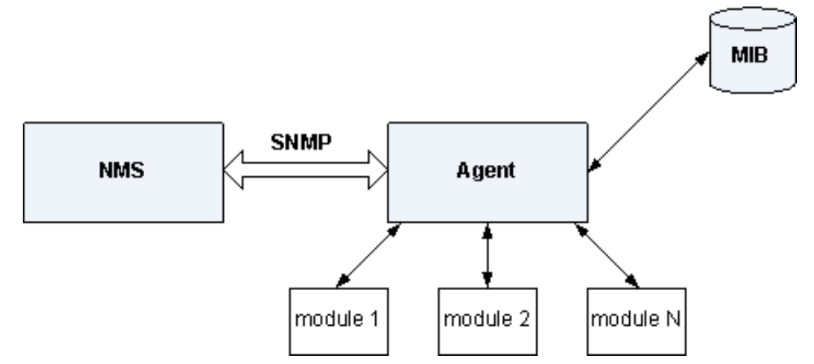
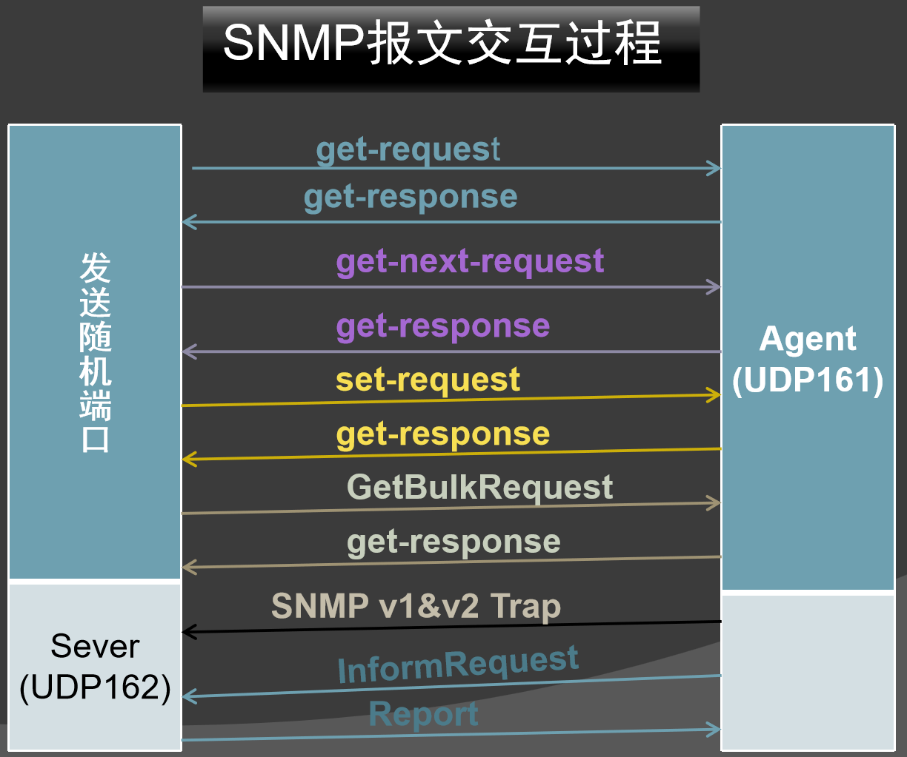
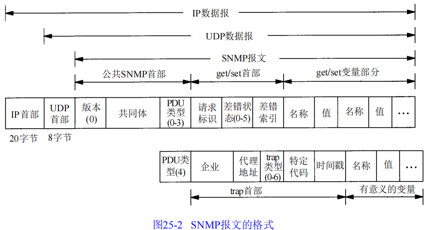
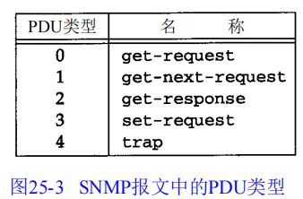
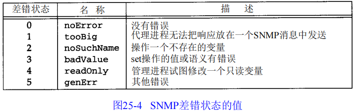
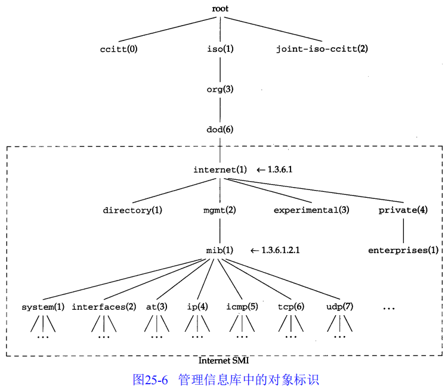
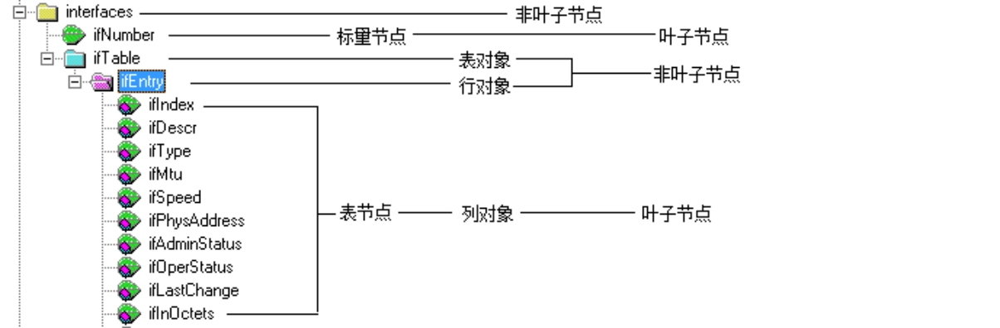

# SNMP

SNMP（Simple Network Manager Protocol）简单网络管理协议（**应用层协议**）。

- 基于UDP协议的，在管理设备（Server）和被管理设备（Agent）之间传递信息。
- 可通过SNMP采集设备运行状态信息
- 可通过SNMP对设备进行管理
- 可通过SNMP设备主动向管理站告警


Agent Port：161

Server Port：162


## 1. 两种进程

**基于TCP/IP的网络管理**分为两个部分：

- 网络管理站（**管理进程**，manager）：查看所有被管设备的状态（连接是否掉线、各种连接上的流量）
- 被管的网络单元（被管设备，涉及**代理进程**）：路由器、交换机、打印机、X终端、终端服务器等（设备共同点就是都运行着TCP/IP协议）


### 1.1 两种通信方式

管理进程和代理进程之间的通信方式：

- 管理进程向代理进程发出请求，询问一个具体的参数值（例如，你产生了多少个ICMP端口不可达差错）、也可以按要求改变代理进程的参数值（例如，把默认的IP TTL改为64）
- 代理进程主动向管理进程报告发生了哪些重要事件（例如，一个连接口掉线了）


## 2. 四个组成部分

**基于SNMP的网络管理体系**包含4个主要组成部分：

### 2.1 NMS（网络管理站）

​	通常是一个独立的设备，运行网络管理应用程序。网络管理应用程序至少能提供一个人机交互界面，网络管理员通过它能完成绝大多数网络管理工作。

### 2.2 SNMP Agent

​	Agent是驻留在被管理设备的一个软件模块，主要负责接收和处理来自NMS的请求报文，并形成响应报文，返回给NMS。在一些紧急情况下，他会主动发送Trap报文，通知NMS。

### 2.3 MIB（管理信息库）

- 是一个被管理对象的集合，是NMS同AGENT进行沟通的桥梁，可以使网关软件和设备进行标准对接。每一个Agent维护一个MIB，NMS能对MIB库中对象的值进行读取或设置。
- 包含**所有代理进程**的所有**可被查询和修改**的**参数**

#### 2.3.1 MIB分类


### 2.4 SNMP协议

​	应用层协议，用于在NMS和被管理设备间交互信息，一种管理进程与代理进程之间的通信协议，通过端口号（Agent:161和Server:162）通信。





> - NMS通过SNMP协议与设备的Agent通信，完成对MIB的查询或修改操作，从而实现对网络设备的监控和管理。
>
> - SNMP是NMS与Agent之间通信的载体，通过其协议数据单元PDU（Protocol Data Unit）完成信息交换。SNMP并不负责数据的实际传输，数据交换的任务是通过UDP等传输层协议来完成的。
>
> - Agent是设备上的代理进程，主要工作包括与NMS通信，对设备中的MIB库进行维护，以管理和监控设备中的各个模块。
>
> - MIB保存设备中各个模块的信息。通过对MIB信息的读写操作来完成对设备的监控和维护。


#### 2.4.1 两种使用方式

- 轮询

​	轮询是网络监控的一种主动形式。通过写一个应用程序，发送SNMP GET请求给一个SNMP代理来查看某些值。如果该设备响应了请求，就得到了需要的信息，如果该设备没有响应请求，就能够知道存在某些问题。

- 陷阱

​	被动形式的网络监控。通过配置SNMP设备的代理，让他在某些动作发生时联系另一个SNMP代理来实现的。可以配置为在某些事件发生时发送SNMP陷阱。

```
例如，你可以配置Cisco的IOS（IOS：snmp服务器开启了链路断开的snmp陷阱）在某个独立事件（例如链路断开）发生时，或者在任何定义的陷阱事件发生时，发送SNMP陷阱。当陷阱事件发生时，设备中的snmp代理会发送该陷阱到一个预先配置好的通常成为陷阱主机的目标上。
陷阱主机会运行有自己的SNMP代理，该代理能够接受并处理传入的陷阱。这些陷阱的处理由陷阱处理器来完成。陷阱处理器可以用任何语言编写，并且可以通过STDIN（标准输入）传入的来自发送陷阱的信息。该处理器之后可以根据陷阱进行任何想作的事情，例如发送邮件或者你想要的任何事情。
```


## 3. 协议

### 3.1 五种报文



**管理进程发出的报文：**

- **get-request报文**：从代理进程**【获取】**一个或多个参数值
- **get-next-request报文**：从代理进程**【获取】**一个或多个参数的**下一个参数值**

- **set-request报文**：**【设置】**代理进程的一个或多个参数值

|            SNMPv1报文类型            |                             说明                             |
| :----------------------------------: | :----------------------------------------------------------: |
|           **get-request**            |             **从代理进程处提取一个或多个参数值**             |
|         **get-next-request**         |       **从代理进程处提取紧跟当前参数值的下一个参数值**       |
|           **set-request**            |              **设置代理进程的一个或多个参数值**              |
|           **get-response**           | **返回的一个或多个参数值。这个操作是由代理进程发出的，它是前面三种操作的响应操作** |
| **SNMPv1-Trap** **(GP,SP,Trap-OID)** |    **代理进程主动发出的报文，通知管理进程有某些事情发生**    |


|    SNMPv2报文类型     |               说明                |
| :-------------------: | :-------------------------------: |
|   **informRequest**   |      带有**确认报文**的通知       |
| SNMPv2-Trap(Trap-OID) |   **Trap的分类方式与v1有不同**    |
|  **GetBulkRequest**   | 针对多个oid连续取多次get-next操作 |
|        Report         |         Inform的确认报文          |


**代理进程发出的报文：**

- **get-response报文**：代理进程**【返回】**一个或多个参数值，是前三个报文的响应报文
- **trap报文**：代理进程主动发出的报文，通知管理进程发生了某些事件


### 3.2 报文格式

SNMP报文由两部分组成：报文头和报文体（也被称为PDU，协议数据单元）



- **报文头**

  - **版本号**：通过SNMP的版本号减1获得（0表示SNMP v1）
  - **共同体**：管理进程与代理进程之间的口令（明文格式），默认值为public
  - **PDU类型**：如 `GetRequest`、`GetNextRequest`、`SetRequest`、`GetResponse`、`Trap` 等

  

- **报文体**

  - **请求标识**：标识 SNMP 报文的请求，由管理进程设置，然后由代理进程在get-response中返回
  - **差错状态**：在请求中，该字段通常设置为 0。在响应中，指示是否发生错误以及错误类型（如 `noError`、`tooBig`、`noSuchName` 等）。`由代理进程设置`
  - **差错索引**：表示当有差错发生了，指出差错发生在哪个参数。



### 3.3 数据类型

- INTEGER：整型
- OCTER STRING：**【0或多个】**8比特字节，每个字节值0-255，不以NULL结尾。
- NULL：代表变量没有值
- IpAddress：4字节长度的OCTER STRING，以网络序表示的IP地址
- Counter：非负整数（0 - 2^32 -1）
- TimeTicks：时间计数器，以0.01s为单位递增
- SEQUENCE：类似C语言中的“structure”。包含一个或多个元素，每个元素又是另一个ASN.1类型


###  3.4 OID对象标识

> 它也是一种数据类型，用于指明一种“授权”命名的对象（由权威机构分配和管理的）。

对象标识是一个整数序列，以[`.`]分隔。例如，所有的MIB变量是从1.3.6.1.2.1这个标识开始的。




- 单实例叶子  1.3.6.1.2.1.1.2

  > 1.3.6.1.2.1.1.2.**0**  ->  增加一个0表示一个对象

- 多实例叶子（表格）

  > //  注意： 当一个OID为表格时，可能存在多索引
  >
  > 1.3.6.1.2.1.2.2.1.2.**X** -> X表示索引值


## 4. MIB

管理信息库，含有**所有代理进程包含的**、并且**能够被管理进程进行查询和设置**的信息集合。

MIB是一个树形结构，SNMP协议消息通过遍历MIB树形目录中的节点来访问网络中的设备

| 字段                                                         | 说明                                  |
| :----------------------------------------------------------- | ------------------------------------- |
| Name:sysDescr                                                | 节点名称                              |
| Type:OBJECT-TYPE                                             | 节点类型，还有可能是NOTIFICATION-TYPE |
| OID:1.3.6.1.2.1.1.1                                          | OID节点的值                           |
| Full path:iso(1).org(3).dod(6).internet(1).mgmt(2).mib-2(1).system(1).sysDescr(1) |                                       |
| Module:RFC1213-MIB                                           | 所属的mib模块名称                     |
| Parent:system                                                | 父节点名称                            |
| Next sibling:sysObjectID                                     | 下一个节点名称                        |
| Numerical syntax:Octets                                      | 数据类型                              |
| Base syntax:OCTET STRING                                     | 数据基础类型                          |
| Composed syntax:DisplayString                                | 数据组合类型                          |
| Status:mandatory                                             |                                       |
| Max access:read-only                                         | 读写权限                              |
| Size list:1: 0..255                                          | 数据长度建议                          |
| Description:	A textual description of the entity.  This value should include the full name and version identification of the system‘s hardware type, software operating-system, and networking software.  It is mandatory that this only contain printable ASCII characters. | 节点描述信息                          |


## 5. MIB Browser

### 5.1 配置

- SNMPv1 **write/read community 设置**
- SNMPv2 **Get-bulk 设置**
- SNMPv3 **user/group 设置**

### 5.2 MIB Browser的SNMP基本操作

- Get/Set/Walk 操作 Table View等

### 5.3 给添加MIB Browser 添加MIB

- 编译MIB不能有中文路径
- 在MIB Browser中添加/删除已编译的MIB


## 6. BDCOM SNMP模块

### 6.1 三个进程

- SNMP主进程侦听161端口，接收回复报文
- SNMT轮询发送trap线程
- SNMK发送KEEPALIVE trap线程

### 6.2 SNMP基础设置

- 配置SNMP Community：读写权限ACL等
- 配置trap host：trap/inform
- 其他的一些配置无关紧要


### 6.3 接口结构体variable

```c
// 注册MIB时的主要结构体，根据oid name长度的不同，
// 分成variable2 ，variable4， variable7，  variable8， variable13
struct variable13 {
    u_char          magic;          /* 作为提示功能 */
    u_char          type;           /* 变量的类型 */
    u_short         acl;            /* 变量的Access Control List */
    FindVarMethod  *findVar;        /* Get函数，查找该变量时的回调函数 */
    u_char          namelen;        /* 下面oid name的长度 */
    oid             name[13];       /* oid标识 */
};
```

- 常用数据类型

  ```c
  // 另外可以进行整形枚举，需要与mib文件中一致
  ASN_BOOLEAN
  ASN_INTEGER
  ASN_BIT_STR
  ASN_OCTET_STR
  ASN_IPADDRESS
  ASN_COUNTER
  ASN_TIMETICKS
  ASN_INTEGER64
  ASN_COUNTER64
  ```

```c
struct variable13 rip2_variables[] =
{	
    // 一般来说同一组的MIB变量定义相同的FindVarMethod通过variable结构中的magic变量来识别访问哪个MIB变量。
	{RIP2GLOBALROUTECHANGES,ASN_COUNTER,RONLY,rip_mib_global,2,{1, 1}},
	{RIP2GLOBALQUERIES, ASN_COUNTER, RONLY, rip_mib_global, 2, {1, 2}},

	{RIP2IFSTATADDRESS, ASN_IPADDRESS, RONLY, rip_mib_intf_stat, 3, {2, 1, 1}},
	{RIP2IFSTATRCVBADPKTS, ASN_COUNTER, RONLY, rip_mib_intf_stat, 3, {2, 1, 2}},
	{RIP2IFSTATRCVBADROUTES, ASN_COUNTER, RONLY, rip_mib_intf_stat, 3, {2, 1, 3}},
	{RIP2IFSTATSENTUPDATES, ASN_COUNTER, RONLY, rip_mib_intf_stat, 3, {2, 1, 4}},
	{RIP2IFSTATSTATUS, ASN_INTEGER, RWRITE, rip_mib_intf_stat, 3, {2, 1, 5}},

	{RIP2IFCONFADDRESS, ASN_IPADDRESS, RONLY, rip_mib_intf_conf, 3, {3, 1, 1}},
	{RIP2IFCONFDOMAIN, ASN_OCTET_STR, RWRITE, rip_mib_intf_conf, 3, {3, 1, 2}},
	{RIP2IFCONFAUTHTYPE, ASN_INTEGER, RWRITE, rip_mib_intf_conf, 3, {3, 1, 3}},
	{RIP2IFCONFAUTHKEY, ASN_OCTET_STR, RWRITE, rip_mib_intf_conf, 3, {3, 1, 4}},
	{RIP2IFCONFSEND, ASN_INTEGER, RWRITE, rip_mib_intf_conf, 3, {3, 1, 5}},
	{RIP2IFCONFRECEIVE, ASN_INTEGER, RWRITE, rip_mib_intf_conf, 3, {3, 1, 6}},
	{RIP2IFCONFDEFAULTMETRIC,ASN_INTEGER, RWRITE, rip_mib_intf_conf, 3, {3, 1, 7}},
	{RIP2IFCONFSTATUS, ASN_INTEGER, RWRITE, rip_mib_intf_conf, 3, {3, 1, 8}},
	{RIP2IFCONFSRCADDRESS, ASN_IPADDRESS, RWRITE, rip_mib_intf_conf, 3, {3, 1, 9}},

	{RIP2PEERADDRESS, ASN_IPADDRESS, RONLY, rip_mib_peer, 3, {4, 1, 1}},
	{RIP2PEERDOMAIN, ASN_OCTET_STR, RONLY, rip_mib_peer, 3, {4, 1, 2}},
	{RIP2PEERLASTUPDATE, ASN_TIMETICKS, RONLY, rip_mib_peer, 3, {4, 1, 3}},
	{RIP2PEERVERSION, ASN_INTEGER, RONLY, rip_mib_peer, 3, {4, 1, 4}},
	{RIP2PEERRCVBADPKTS, ASN_COUNTER, RONLY, rip_mib_peer, 3, {4, 1, 5}},
	{RIP2PEERRCVBADROUTES, ASN_COUNTER, RONLY, rip_mib_peer, 3, {4, 1, 6}}
};
```

#### FindVarMethod

```c
/**
* 在定义注册到subtree的MIB变量数组时，每个MIB变量都需要定义一个如何访问这个变量的查找函数FindVarMethod，一般来说同一组的MIB变量定义相同的FindVarMethod通过variable结构中的magic变量来识别访问哪个MIB变量。
* Params:
* 		struct variable *vp: IN vp指向访问的MIB变量的variable结构
*		oid *name: IN/OUT需要访问MIB变量的标识符
*		int *length: IN/OUT name的长度
*		int exact: IN时候精确匹配，get/set时为true，getnext时为false
*		int *var_len: OUT指明返回值得长度
*		WriteMethod **write_method:OUT MIB变量的写操作函数
* Return:
*	返回值为找到变量值的头指针。长度由参数中的var_len决定，类型由注册的mib决定，即vp-> type。
**/
u_char * FindVarMethod( struct variable *vp, oid *name, int *length, int exact, int *var_len, WriteMethod **write_method);


```

##### WriteMethod

```c
/**
* 每个有写权限的MIB变量的FindVarMethod函数中必需将函数指针write_method设为这个MIB变量的写函数。
* Params:
*	var_val为MIB变量的设置值
*	var_val_type为值的类型
*	var_val_len为值的长度
*	statP为FindVarMethod的返回值
*	name为MIB变量的Object ID
*	length为name的长度
* Return:
*	成功返回SNMP_ERR_NOERROR，否则返回其它值（注：返回的错误类型见snmp.h）
*/
typedef int (WriteMethod)(int action, u_char *var_val, u_char var_val_type,     int var_val_len, u_char  *statP, oid *name, int length);
```

SNMP模块会将action设为以下几种值多次调用write_method：

```c
#define RESERVE1    0
#define RESERVE2    1
#define ACTION	    2
#define COMMIT      3	/*只需要处理这种情况，其他的情况return即可*/
#define UNDO        5
#define ACTION_FREE		6
#define FINISHED_SUCCESS        9
#define FINISHED_FAILURE	10
```


- 示例

```c
/*===========================================================
函数名: rip_mib_global
函数功能: MIB全局信息
输入参数: 
输出参数: 
返回值:      
备注:
===========================================================*/
u_char *rip_mib_global(struct variable *vp, oid *name, int *length, int exact, int *var_len, int (**write_method) (int, u_char *, u_char, int, u_char *, oid *, int))
{
	static uint32 long_return;
	struct rip_process_info_ *pprocess;
	struct rip_process_list_ *pprocess_list;

	long_return = 0;
	
	if( MATCH_FAILED == header_rip(vp, name, length, exact, var_len, write_method) )
	{
		return NULL;
	}

	if((pprocess_list = rip_process_list.forw) == &rip_process_list)
		return NULL;
	pprocess = pprocess_list->rip_process_info;
	
	switch (vp->magic) 
	{
	case RIP2GLOBALROUTECHANGES:
		long_return = pprocess->rip2GlobalRouteChanges;
		return (u_char *)&long_return;
		break;
	case RIP2GLOBALQUERIES:
		long_return = pprocess->rip2GlobalQueries;
		return (u_char *)&long_return;
		break;
	default:
		assert(0);
		break;
	}
	
	return NULL;
}
```





## Command

```
# 交换机上做snmp agent
snmp-server community 0 hjw rw  # 指定一个未加密的社区，并且enable开启
snmp-server host 192.168.2.100  # 指定主机接收SNMP TRAPs
snmp-server trap-source vlan 10 # 为所有traps的源地址分配一个接口
snmp-server trap-add-hostname   # 在trap绑定列表中添加主机名
snmp-server trap-logs           # 在日志中添加trap
```

