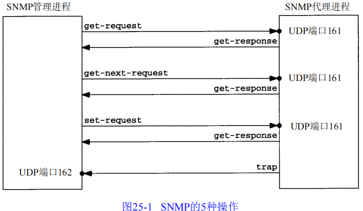

# SNMP

SNMP（Simple Network Manager Protocol）简单网络管理协议。

## 1. 两种进程

**基于TCP/IP的网络管理**分为两个部分：

- 网络管理站（**管理进程**，manager）：查看所有被管设备的状态（连接是否掉线、各种连接上的流量）
- 被管的网络单元（被管设备，涉及**代理进程**）：路由器、交换机、打印机、X终端、终端服务器等（设备共同点就是都运行着TCP/IP协议）

### 1.1 两种通信方式

管理进程和代理进程之间的通信方式：

- 管理进程向代理进程发出请求，询问一个具体的参数值（例如，你产生了多少个ICMP端口不可达差错）、也可以按要求改变代理进程的参数值（例如，把默认的IP TTL改为64）
- 代理进程主动向管理进程报告发生了哪些重要事件（例如，一个连接口掉线了）

## 2. 三个组成部分

**基于TCP/IP的网络管理**分为三个组成部分：

- MIB（管理信息库）：包含**所有代理进程**的所有**可被查询和修改**的**参数**
- SMI（Structure of Management Information 管理信息结构）：包含MIB中公用的结构和表达符号
- SNMP：管理进程与代理进程之间的通信协议

## 3. 协议

### 3.1 五种报文

**管理进程发出的报文：**

- **get-request报文**：从代理进程**【获取】**一个或多个参数值
- **get-next-request报文**：从代理进程**【获取】**一个或多个参数的**下一个参数值**

- **set-request报文**：**【设置】**代理进程的一个或多个参数值

**代理进程发出的报文：**

- **get-response报文**：代理进程**【返回】**一个或多个参数值，是前三个报文的响应报文
- **trap报文**：代理进程主动发出的报文，通知管理进程发生了某些事件

### 3.2 报文格式

SNMP报文由两部分组成：报文头和报文体（也被称为PDU，协议数据单元）

- **报文头**

  - **版本号**：通过SNMP的版本号减1获得（0表示SNMP v1）
  - **共同体**：管理进程与代理进程之间的口令（明文格式），默认值为public
  - **PDU类型**：如 `GetRequest`、`GetNextRequest`、`SetRequest`、`GetResponse`、`Trap` 等

  

- **报文体**

  - **请求标识**：标识 SNMP 报文的请求，由管理进程设置，然后由代理进程在get-response中返回
  - **差错状态**：在请求中，该字段通常设置为 0。在响应中，指示是否发生错误以及错误类型（如 `noError`、`tooBig`、`noSuchName` 等）。`由代理进程设置`
  - **差错索引**：表示当有差错发生了，指出差错发生在哪个参数。

### 3.3 数据类型

- INTEGER：整型
- OCTER STRING：**【0或多个】**8比特字节，每个字节值0-255，不以NULL结尾。
- NULL：代表变量没有值
- IpAddress：4字节长度的OCTER STRING，以网络序表示的IP地址
- Counter：非负整数（0 - 2^32 -1）
- TimeTicks：时间计数器，以0.01s为单位递增
- SEQUENCE：类似C语言中的“structure”。包含一个或多个元素，每个元素又是另一个ASN.1类型

###  3.4 OID对象标识

> 它也是一种数据类型，用于指明一种“授权”命名的对象（由权威机构分配和管理的）。

对象标识是一个整数序列，以[`.`]分隔。例如，所有的MIB变量是从1.3.6.1.2.1这个标识开始的。

## 4. MIB

管理信息库，含有**所有代理进程包含的**、并且**能够被管理进程进行查询和设置**的信息集合/

