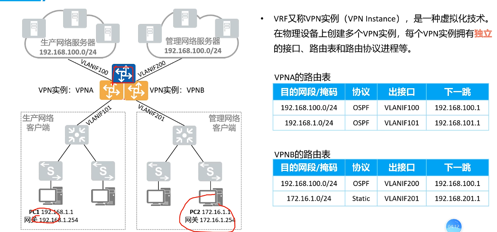

# VRF

通过虚拟路由转发技术，可在三层转发设备上创建多张路由表，以实现数据或业务的隔离，常用于MPLS VPN、防火墙等一些需要实现隔离的应用场景。


> VLAN是用于二层隔离，给数据包打上标签
>
> VRF是三层隔离（路由隔离），通过打上RD标签，来查找路由表


VRF又称VPN实例（VPN instance），是一种虚拟化技术。在物理设备上创建多个VPN实例，每个VPN实例拥有**独立的接口、路由表和路由协议进程**等。




VRF是对物理设备的一个逻辑划分，每个逻辑单元都被成为一个VPN实例，实例之间在路由层面是隔离的。

VRF实现过程如下：

1. 创建实例，并将三层接口（可以是路由器的物理接口或子接口，也可以是VLANIF接口）绑定到实例
2. 配置与实例绑定的路由协议或静态路由（可选）
3. 基于与实例绑定的接口与路由协议等建立实例路由表并基于实例路由表转发数据，实现实例间的隔离。


## 命令

- 创建VRF实例

  ```cmd
  ip vrf [vrf-name]
  ```

- 配置VRF的路由目标（通常是VRF的RD）

  ```cmd
  rd [route-distinguisher] # 路由辨识符
  ```

- 将接口分配给vrf

  ```cmd
  interface [interface-name]
    ip vrf forwarding [vrf-name]
  ```

- 配置VRF的路由策略

  ```cmd
  ip vrf [vrf-name] route-target [both | import | export] [route-target]
  ```

```cmd
# 创建名为vrf1的VRF实例
ip vrf vrf1
# 配置VRF1的RD为100:1
rd 100:1
# 将FastEthernet 0/1分配给VRF1
interface FastEthernet0/1
  ip vrf forwarding vrf1
# 配置VRF1的路由目标，导入和导出，这样通过这个接口进入的流量都会在VRF上下文中路由。
ip vrf vrf1 route-target export 100:1
ip vrf vrf1 route-target import 100:1
```


```cmd
do show running interface f0/1
show ip int brief
show ip protocols vrf cw

R2(config)#int f0/1
R2(config)#default int f0/1		# 清空该接口的配置
R2(config)#int f0/1.1           # DOT1Q trunk
R2(config-subif)#encapsulation dot1Q 10 # 在路由器上将物理接口分为多个子接口，并为每个子接口配置不同的 VLAN。
R2(config-subif)#ip vrf forwarding cw
R2(config-subif)#ip address 172.20.12.2 255.255.255.0

R2(config)#router rip
R2(config_rip)#address-family ipv4 vrf cw
R2(config_rip_if)#network 192.168.1.0
```


### 补充

#### RD

**RD** 指的是 **路由辨识符（Route Distinguisher）**。它是一个用于区分不同 VRF 实例的标签，尤其是在 MPLS VPN 环境下，以实现虚拟网络的隔离。


##### RD组成部分

RD 由两部分组成：一个 2 字节的 ASN（自治系统号） 或 IP 地址 和一个 4 字节的编号。例如：

**ASN 格式**: `100:1` 表示 ASN `100` 和一个标识符 `1`。

**IP 格式**: `192.168.0.1:1` 表示 IP 地址 `192.168.0.1` 和一个标识符 `1`。


##### **RD和 RT的区别**

- **RD**（Route Distinguisher）: 只是用于区分同一 IP 地址在不同 VRF 中，确保每个前缀在 MPLS 网络中都是唯一的。
- **RT**（Route Target）: 决定 VPN 路由的传输范围。RT 指定哪些 VRF 可以接收或导出某个 VPN 路由，用于控制路由的导入和导出。


##### **作用**

**1. 区分重叠的 IP 地址**:

- 在 MPLS VPN 中，不同的客户可能会使用相同的 IP 地址空间（例如，`192.168.1.0/24`），因为每个客户的网络都是独立的。

- 为了让这些重叠的地址在服务提供商的核心网络中共存，需要一种机制来区别这些相同的地址。RD 就是用于这个目的的。

- 通过给每个 VRF 分配一个唯一的 RD，可以将来自不同客户的同一 IP 地址区别开。例如：

  - `10.1.1.0/24` 在客户 A 和客户 B 的网络中都存在。

  - 为了区分，RD 会给客户 A 和 B 分别分配不同的 RD，比如：

    - `RD: 100:1` for Customer A
    - `RD: 200:1` for Customer B

  - 最终，MPLS 会把这两者区分为：

    - `100:1:10.1.1.0/24`
    - `200:1:10.1.1.0/24`

    

**2. 作为 VPN 路由的前缀**:

- RD 不会改变路由本身，它只是附加到前缀上以生成一个“唯一的”路由条目。对于网络设备来说，这个生成的新前缀可以被看作是一个全局唯一的地址。
- 例如，当一个网络设备查看 `100:1:10.1.1.0/24` 和 `200:1:10.1.1.0/24` 时，它会认为这是两个完全不同的路由条目。


#### MPLS

**MPLS** 是 **多协议标签交换（Multi-Protocol Label Switching）** 。它是一种数据传输技术，用于加速和管理不同网络之间的数据流量。MPLS 通过在网络数据包之间使用标签（Label）来实现高效的转发和流量管理。

- MPLS 通过在数据包前增加一个标签，并基于标签而非ip地址进行转发数据，而不需要每一跳都进行路由查找，减少了延迟。

  > 在传统的 IP 网络中，路由器会根据每个数据包的 IP 地址，逐跳地查找路由表来决定下一跳路由。这种方式效率较低，因为每个节点都需要处理 IP 地址查找。

- 当数据包进入 MPLS 网络时，称为**入口节点**的路由器会分配一个标签。这个标签会附加到数据包头部。
- 中间的**转发节点**只需根据标签进行数据转发，而不需要查看数据包的详细内容。
- **出口节点**会移除标签，将数据包恢复为普通的 IP 包，然后转发到目的地。


##### LSP

- **LSP（标签交换协议）** 是一个预定义的路径，用于将数据包从入口节点传递到出口节点。

- 入口节点会在数据包进入 MPLS 网络时选择适合的 LSP，并为数据包打上相应的标签。

- LSP 可以是单向的（从源到目标），也可以通过配置实现双向传输

