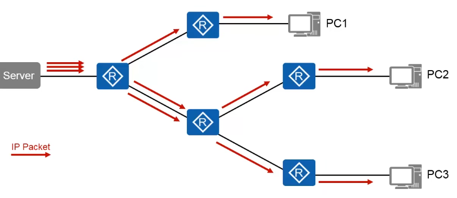
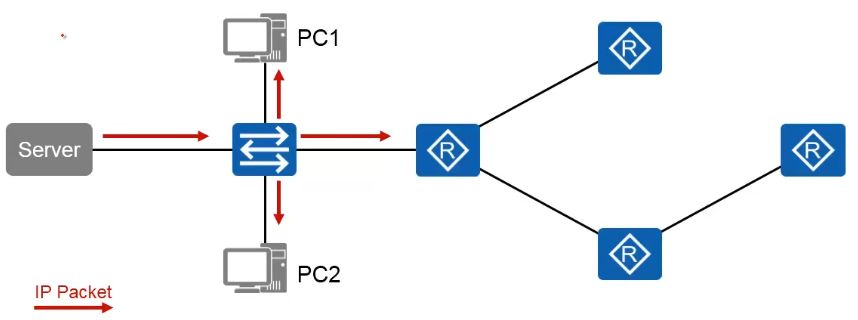
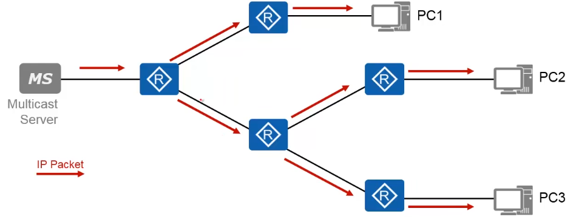
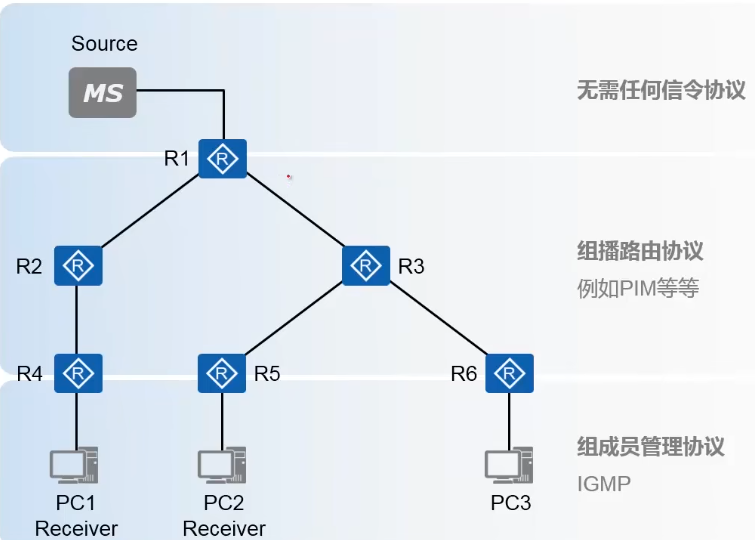
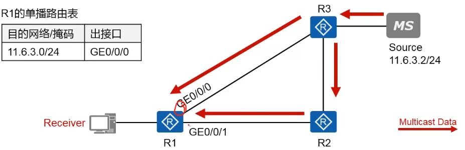
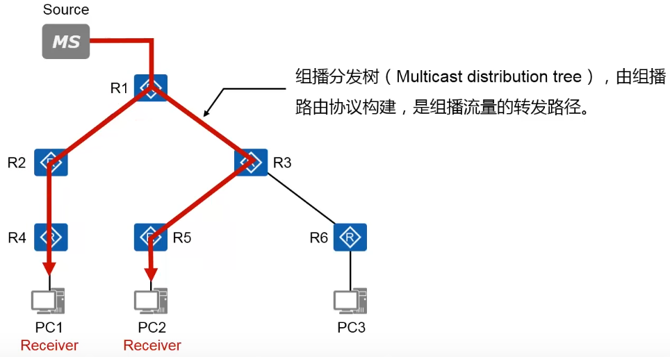
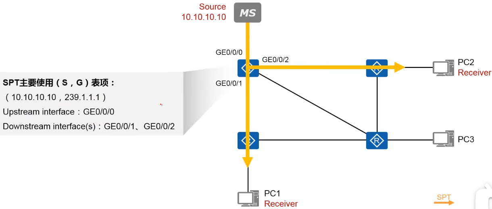
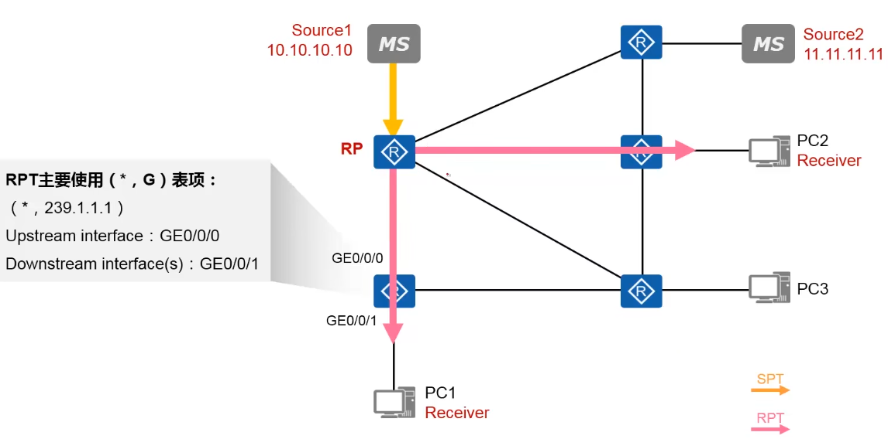
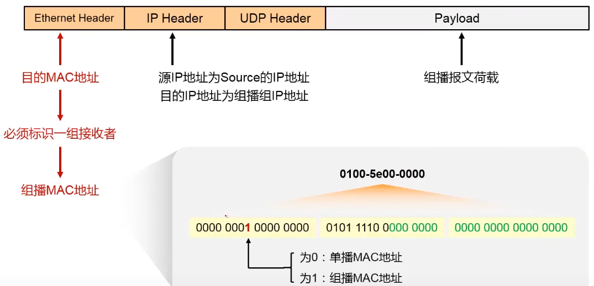
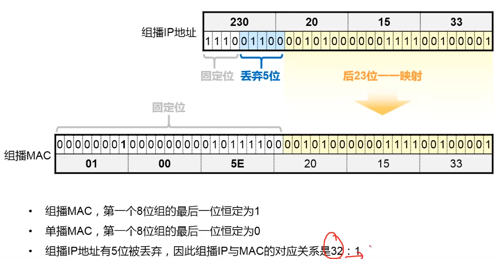

# 单播

- 对于单播通信，每个数据包都有**明确的目的IP地址**
- 对于同一份数据，如果有多个接收者，服务端需要发送与接收者数量相同个数的数据包
- 缺点是当接收者比较多时，由于Server会拷贝和发送多份相同的数据包，会造成网络拥塞，链路带宽也会造成一定浪费，影响网络性能

# 广播

- 广播数据包被限制在广播域中
- 一旦有设备发送广播数据包，则广播域中的所有设备都会收到这个数据包，并且不得不消耗资源去处理，广播数据包将消耗网络的带宽以及设备资源
- 在IPv6中，广播报文的传输方式被取消

# 组播

- 组播适合“一对多”的场景，只有加入到特定组播组的成员，才会收到组播数据。当存在多个组播组成员时，源无需发送多个数据拷贝，仅需发送一份即可， 组播网络设备（运行组播路由协议的网络设备）会根据实际需要转发或拷贝组播数据
- 数据流只发送给加入该组播组的接收者（组成员），而不需要该数据的设备不会收到该组播流量
- 相同的组播报文，在一段链路上仅存在一份数据，大大提高了网络资源的利用率

## 优缺点

### 优点

- 降低网络流量、减轻硬件负荷，提高效率
- 减少冗余流量、节约网络带宽、降低网络负载，提升网络性能
- 使得多点应用称为可能（分布式应用）

### 缺点

- 组播是基于UDP的，采用尽力而为的传输方式
- 没有拥塞避免传输机制
- 可能出现报文重复的现象
- 可能出现报文失序的现象

## 应用

- 多媒体直播（CCTV）
- 适用于多接收者期望收取相同流量的场景
- 适用于接收者地址（或位置）未知的场景
- 培训、联合作业场合的通信

## 组播服务模型

> 1. 组播源向特定组播组发送组播数据，并不关心组播成员的存在
> 2. 组播路由器把数据拷贝并转发给需要该数据或存在组播接收者的网络分支
> 3. 主机加入自己感兴趣的组播组，以便接收所在组播组的数据

- 组播源（Source）：组播流量的发送者，例如多媒体服务器。`无需运行任何组播组协议，只需发送组播数据`
- 组播接收者（PC1、PC2）：组播组成员，期望收到特定组播组流量的设备，例如运行多媒体直播客户端软件的PC
- 组播组：使用一个组播IP地址标识的群组。`例如224.1.1.1是一个IPv4的组播地址`。组播源向该组播地址发送组播数据，需要该组播数据的设备需要通过这个地址加入组播组
- 组播路由器：支持组播、运行组播协议的网络设备。
  - 第一跳路由器（R1）：直连Source的组播路由器。该路由器负责将Source发送出来的组播报文转发到组播网络中
  - 最后一跳路由器（R4、R5、R6）：直连Group Member的组播路由器。该路由器负责将组播流量转发给接收者，也负责管理及维护直连网段中的组播组的成员关系

### RPF机制

Reverse Path Forwarding 反向路径转发，用于解决组播数据转发的环路问题

- 路由器在转发组播报文时，不仅关心报文的目的IP地址，还需关心报文的源IP地址

> 路由器会根据路由表来进行检查，例如，有一个数据包从组播源发出（源IP：11.6.3.2，目的IP：224.0.0.9），接口G0/0/1接口为RPF接口，会根据路由表进行检查其源IP对应的网段出接口是否是当前接收的接口，若存在，则转发组播数据包；而G0/0/1收到该数据包则丢弃

- PRF机制确保组播数据能从正确的接口（RPF接口）接收，只有通过RPF检查的组播数据包才会被路由器沿着组播树进行转发，如果数据包被错误的接口收到，将会丢弃该报文。

### 组播分发树

由组播路由协议构建，是组播流量的转发路径

#### 分类

##### SPT

最短路径树或源树

- 它是以**组播源为根节点**的组播分发树
- 源树的分支形成了通过网络到达接收者所在分支的分布树
- SPT同时适用于PIM-DM网络和PIM-SM网络

##### RPT（Rendezvous Point Tree）共享树

- 与最短路径树不同的是，共享树使用RP（Rendezvous Point）作为汇聚点
- 多个组播组可以共用一个RP，期望收到组播流量的路由器通过组播协议在自己与RP之间建立一条RPT的分支，组播流量先从源发送到RP，然后再由RP将组播数据转发下来，组播流量顺着RPT最终到达各个接收者所在的终端网络
- RPT适用于PIM-SM网络和双向PIM网络

##### 

## 组播Mac地址

