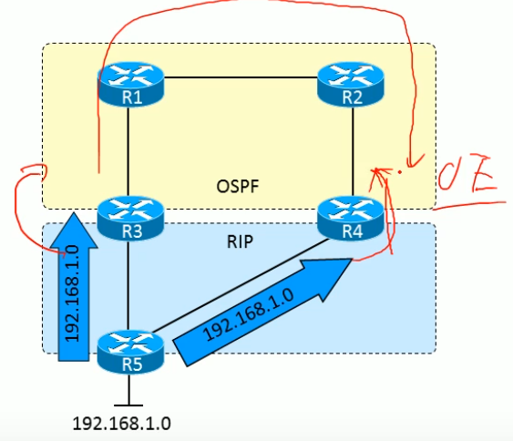

对于每个收到的数据包，必须从链路层传递到IP层的信息是：

(1) IP 数据包[5.2.2]，

(2) 链路层帧的部分数据的长度（即不包括链路层帧）[5.2.2]，

(3) 接收IP数据包的物理接口标识 [5.2.3]，以及 

(4) 根据数据包中的目的MAC地址分类为链路层单播、广播或组播 [4.3.2]、[5.3.4]。

(5) 源MAC地址。 


数据包到达路由器后的一系列操作：

- 路由器会检查数据帧目标地址字段中的**数据链路标识**。如果它包含了路由器接口标识符或广播标识符，那么路由器会从帧中剥离出数据包并传递给网络层。
- 在网络层，数据包会检查数据包的目标地址
  - 如果目标地址是路由器的接口ip地址或是所有主机的广播地址，那么需要进一步检查数据包的协议字段，再把被封装的数据发送给适当的内部进程
  - 否则，如果是其他目标地址（可能是其他网络的主机地址），都需要进行路由选择。


路由器两大功能：

- 路由（控制层面）

  路由器控制层面的工作，决定数据包从来源端到目的端所经过的路由路径（源host到目的host的最佳路径）

  收集网络拓扑信息，并动态形成路由表。

  

- 转发（数据层面）

​	路由器数据层面的工作，将路由器输入端的数据包移送至适当的路由器输出端（在路由器内部进行）

​	根据转发表（FIB）转发IP数据包


其他功能：

- 隔离子网
- 隔离广播域
- 使得子网间速率适配
- 指定访问规则


两种路径：

- 控制路径
  - 处理目的地址是本路由器的高层协议报文（路由协议报文），完成路由信息的交互，保证数据以最优路径传输。
- 数据路径
  - 处理目的地址不是本地路由器，则是需要转发的数据报文。


# 路由协议

**分为两类：**

- 外部网关协议EGP（External Gateway Protocol）
- 内部网关协议IGP（Interior Gateway Protocol）

> 根据EGP在区域网络之间（或ISP之间）之间**进行路由选择**。     `使用BGP边界网关协议。`
>
> 根据IGP在区域网络内部（或ISP内部）**进行主机识别**。  `使用RIP、RIP2、OSPF等协议。`
>
> 类似：根据IP地址中的网络部分进行路由选择，根据主机部分在链路内部进行主机识别。

> ISP（互联网服务提供商）


## 基础概念

### 1. 度量

度量是指派给路由的一种变量。当有多条路径到达相同目标网络时，路由器需要一种机制来计算最优路径。

> RIP选择路由器跳数最少的路径为最优路径;
>
> EIGRP基于路径沿路最小带宽和总时延选择最优路径。

#### 1.跳数

**跳数度量**记录路由器跳数。

> 不能作为选择最优路径的最优方法。因为带宽对如何有效地使流量通过网络影响很大。

#### 2.带宽

**带宽度量**将会选择<font color='red'>高带宽路径</font>，而不是低带宽路径。`带宽本身可能不是一个很好的度量`

#### 3.负载

负载度量反应了流量占用沿途链路带宽的数量。`最优路径应该是负载最低的路径`

> 注：争对跳数和带宽，路径上的负载会发生变化，因而度量也会跟着变化。
>
> 如果度量变化过于频繁，路由波动（对路由器的CPU、数据链路的带宽和全网稳定性产生影响）——最优路径频繁变化可能就发生了。

#### 4.时延

时延是度量数据包经过一条路径所花费的时间。`选择最低时延的路径最为最优路径`

> 需考虑链路时延，路由器处理时延和队列时延等因素。

#### 5.可靠性

用来测量链路在某种情况下发生故障的可能性，可靠性可以是变化的或固定的。

> - 可变可靠性度量的例子：链路发生故障的次数或特定时间间隔内收到错误的次数。
>
> - 固定可靠性度量：基于管理员确定的一条链路的已知量。

#### 6.代价

由管理员设置的代价度量可以反应更优或更差路由。


### 2.收敛

> 动态路由选择协议一系列过程：
>
> 1. 路由器向其他路由器通告本地的直连网络，接收并处理来自其他路由器的同类信息
> 2. 传递从其他路由器接收到的信息
> 3. 需定义已确定的最优路径的度量

对于路由选择协议来说，标准是<font color='red'>网络上所有路由器的路由表中的可达性信息必须一致</font>。


**收敛：**使得所有路由表都到达一致状态的过程。

**收敛时间：**全网实现信息共享以及所有路由器计算最优路径所花费的时间总和。


### 3.负载均衡

将流量分配到相同目标网络的多条路径上。


## 路由算法

两种：距离矢量、链路状态算法。

### 1.距离矢量协议

路由是以矢量（距离，方向）的方式被通告出去的。`距离是根据度量定义的，方向是根据下一跳路由器定义的。`

#### 通用属性

##### 1.定期更新

每经过特定时间周期就要发送更新信息。这个时间周期从10s(AppleTalk的RTMP)到 90s(Cisco的IGRP)。

如果更新信息发送过于频繁可能会引起拥塞;但如果更新信息发送不频繁,收敛时间可能长的不能被接收。

##### 2.邻居

在路由器上下文中**,邻居**通常意味着**共享相同数据链路的路由器**或**某种更高层的逻辑邻接关系**。

距离矢量路由选择协议向邻接路由器发送更新信息，并依靠邻居再向它的邻居传递更新信息。`逐跳更新方式`

##### 3.广播更新

向广播地址发送 (在IP网络中，广播地址是255.255.255.255)更新信息。使用相同路由选择协议的邻居路由器将会收到广播数据包并且采取相应的动作。不关心路由更新信息的主机和其他设备仅仅丢弃该数据包。

##### 4.全路由选择表更新

大多数距离矢量路由选择协议广播它的整个路由表，来告诉邻居它所知道的—切。

邻居在收到这些更新信息之后,它们会收集自己需要的信息,而丢弃其他信息。


#### 局限性和改进方式


##### 1.路由失效计时器

> 如图4.3，网络已经收敛，当部分网络拓扑发生变化时，它怎样处理重新收敛问题？
>
> （1）假如网络10.1.5.0发生故障了，在下一个更新周期，路由器D会将这个网络标记为不可达并且发生消息。

> （2）如果网络10.1.5.0没有故障，而是路由器D发生了故障？
>
> 这时路由器A、B和C的路由表仍保存着关于网络10.1.5.0的信息，虽然信息不再有用，但却没有路由器通知他们。它们将不知不觉地向一个不可达网络转发数据包。

解决方案：为路由表中的<font color='red'>每个表项</font>设置<font color='red'>路由失效计时器</font>。

[方案]：当路由器C首次知道网络10.1.5.0并将其输入到路由表中时，**路由器C需为该路由设置计时器**，每隔一定时间间隔路由器C都会收到路由器D的更新信息，路由器C在丢弃有关10.1.5.0的信息同时复位该路由的计时器。

如果路由器D发生故障，路由器C将不能收到关于10.1.5.0的更新信息。这时计时器会超时，路由器C将该路由标记为不可达，并在下一个更新周期时传递信息。

> 路由超时的周期范围3~6个更新周期。路由器在丢失单个更新信息之后将不会使路由无效的，因为数据包的损坏、丢失或者某种网络延时都会造成这种事件的发生。但是，如果路由失效周期太长，网络收敛速度将会过慢


##### 2.水平分割

> 每台路由器在每个更新周期都要向每个邻居发送它的整个路由表。
>
> 比如，图4.3中路由器A知道的每个距离大于0跳的网络都是从网络B中学习的。路由器A将从路由器B学习得的路由信息再广播给路由器B，会造成资源浪费。

逆向路由：**路由的指向**与**数据包流动方向**相反的路由。


<font color='red'>水平分割：</font>在两台路由器之间阻止逆向路由的技术      `阻止路由环路的发生`

> 好处：不造成资源浪费；不会把从路由器学习到的可达信息再返回给这台路由器。


【案例】

> 假设网络10.1.5.0发生故障，路由器D检测到故障，将该网络标记为不可达并在下一个更新周期通知路由器C。而在路由器D的更新计时器触发更新之前，假设路由器C的更新信息到达了路由器D，声明路由器C可以到达网络10.1.5.0，距离为1跳。`但路由器D不知道路由器C通告下一条最优路径并不合理，因而路由器D将跳数+1，并在路由表中记录：路由器C的接口（10.1.4.1）可以到达网络10.1.5.0，距离2跳`。
>
> 此时，10.1.5.3的数据包到达路由器C，路由器C查询路由表并将数据转发给路由器D。路由器D查询路由表又将数据包转发给路由C，路由器C再转回给路由器D，一直无穷尽进行下去，因而导致路由环路的产生。

【解决方案】

<font color='red'>**执行水平分割可以阻止路由环路的发生。**</font>有两类：简单水平分隔法、毒性逆转水平分割法。

######  1. 简单水平分割法

采用**抑制信息**的方式，从`某个接口发送的更新消息`<font color='red'>不能包含</font>从`该接口收到的更新消息所包含的网络`。 

> 比如，图4.3，路由器C向路由器D发送了关于网络10.1.1.0、10.1.2.0和10.1.3.0的更新信息，未包含10.1.4.0和10.1.5.0的网络。因为他们是从路由器D获取的。同样地，发送给路由器B的更新信息包括了网络10.1.4.0和10.1.5.0，不包括10.1.1.0、10.1.2.0和10.1.3.0


###### 2. 毒性逆转水平分割法

改进的一种方式，更安全、更健壮。

当更新信息被发送出某个接口时，信息中将指定从该接口收到的更新信息中获取的网络是不可达的。

> 例如，路由器C向路由器D通告了网络10.1.4.0和10.1.5.0，但这些网络都<font color='red'>被主动标记为不可达</font>。通过设置度量为无穷大（远），标记网络为不可达。


> 假设，路由器B收到错误信息使其相信通过路由器C可以到达子网10.1.1.0，若采用简单水平分割法是无法纠正这错误的，而通过路由器C的毒性逆转更新信息可以立刻制止这种潜在的环路。

缺陷：路由更新数据包更大了，可能会加剧链路的拥塞问题。


##### 3.计数到无穷大

水平分割法切断了邻居路由器之间的环路，但是它不能隔断网络中的环路。

> 减轻计数到无穷大影响的方法是定义无穷大。大多数距离矢量协议定义无穷大为16跳 。在图4.6中 ,随着更新消息在路由器中转圈，到10.1.5.0的跳数最终将增加到 16。那时网络10.1.5.0将被认为不可达。

缺点：收敛速度非常慢


##### 4.触发更新

又称快速更新。如果一个度量变好或变坏，那么路由器将立刻发送更新信息，而不是等更新计时器超时。

这样遇到故障，重新收敛的速度将会比每台路由器必须等待更新周期的方式快，而且可以大大减少计数到无穷大所引发的问题。

> 定期更新和触发更新可能会同时发生，因而路由器可能会在收到来自触发更新的正确信息之后又收到来自未收敛路由器的错误信息。
>
> 这种情况，表明当网络正在进行重新收敛时，还会发生混乱和路由错误。但触发更新将有助于更快消除这些问题。


对触发更新进一步的改进是更新信息中仅包括实际触发该事件的网络,而不是包括整个路由表。

触发更新技术减少了处理时间和对网络带宽的影响。


##### 5.抑制计时器

为了降低接受错误路由选择信息的可能性，抑制计时器引了某种程度的怀疑量。

【介绍】

如果到一个目标的距离增加 (例如，跳数由2增加到4)，那么路由器将为该路由设置抑制计时器。直到计时器超时,路由器才可以接受有关此路由的更新信息。


错误路由选择信息进入路由表的可能性被减小了,但是重新收敛的时间也被耗费了。

如挂起时间太短，不起作用；如果太长，正常路由则会受到不利的影响。


##### 6.异步更新

路由器将不会同时广播更新信息，如果发生这种情况，更新数据包会发生碰撞。但是当几台路由器共享一个广播网络时可能会发生这种情况。因为在路由器中，更新处理所带来的系统时延将导致更新计时器趋于同步。当几台路由器的计时器同步后，碰撞随之发生，这 又进一步影响到系统时延，最终共享广播网络的所有路由器都可能变得同步起来。


【方式】

- 每台路由器的更新计时器独立于路由选择进程，因而而不会受到路由器处理负载的影响
- 在每个更新周期中加入一个小的随机时间或定时抖动作为偏移。


### 2.链路状态协议

也成为最短路径优先协议或分布式数据库协议，围绕着Dijkstra的最短路径算法设计的。

- OSPF
- IS-IS

路由器在了解**网络整体连接状态**的基础上生成路由表。每个路由器需要保持同样的信息


【步骤】

1. 每台路由器与它的邻居之间建立联系，`邻接关系`
2. 每台路由器向每个邻居发送`链路状态通告LSA`的数据单元。`对每台路由器链路都会生成一个LSA，用于标识这条链路、链路状态、路由器接口到链路的代价度量值以及链路所连接的所有邻居`。每个邻居在收到通告之后将依次向他的邻居转发（泛洪）这些通告。
3. 每台路由器要在数据库中保存一份它所收到的LSA备份。如果所有工作正常，所有路由器的数据库应该相同。
4. 完整的拓扑数据库，也叫链路状态库。Dijkstra算法使用它对网络图进行<font color='red'>计算得出每台路由器的最短路径</font>。接着链路状态协议对链路状态数据库进行查询找到每台路由器所连接的子网，并将这些信息输入到路由表中。


#### 1.邻居

建立链路状态环境：邻居发现。这里使用Hello协议`（定义了一个Hello数据包的格式和交换数据包并处理数据包信息的过程。）`


## 路由策略

### 路由重发布

路由重分发是指连接到不同路由域（自治系统）的边界路由器在他们之间交互和通告路由选择信息的能力。

- 从一个协议到另一种协议
- 同一种协议的多个实例

> 注意：
>
> - 重分发总是向外的，执行重分发的路由器**不会修改其路由表**
> - 路由必须**要位于路由表**中才能被重分发


动态路由协议之间、直连接口、静态路由


重分布需要考虑的因素

- 路由回馈
- 路由信息不兼容（度量值信息不一致）
- 收敛时间不一致（不同路由协议的收敛速度不同）

如何选择最佳路由：

- 管理距离
- 度量值


**路由回馈**


#### 管理距离


#### 种子度量值

种子度量值：路由器通告与其接口直连的链路时，使用的**初始度量值**

> **种子度量值**或**默认度量值**是**在重分发配置期间定义的**，并在**自治系统内部正常递增**，除了**OSPF E2路由**。

```
命令default-metric或redistribute中使用metric来指定种子度量值
```


```cmd
router ospf 1
	# 若不加subnets，只会重分发主类网络路由，否则，所有子网都会重分发（ospf是无类路由协议）
	redistribute rip<源路由协议> subnets 

router rip
	redistribute ospf metric 1  # 不加metric，视为无穷大，重分发失败
```


**重发布直连**

- 不使用network来直接宣告路由，因为其下可能会接着多个PC，发出的路由没意义；同时，ospf域能学习到1.0路由
  - 

- 将核心交换机下的所有**直连接口**，动态注入到ospf域中，使用重发布直连接口只需要一条命令，而不需要通过network一条条设置

  

```cmd 
# 直连的物理接口必须是UP、协议是UP
# 把所有直连接口（比如，有些接的是PC，该接口会被设置为被动接口，但是其他路由器需要学习该路由）都宣告进来（比如宣告进OSPF）
redistribute connected subnets metric 10 metric-type 1 # OSPF的E1或E2
```

- 学习**静态路由**

```cmd
redistribute static subnets
```


#### 单点重分布

##### 单向重分布


##### 双向重分布


#### 多点重分布


##### 多点单向重分布

潜在问题，导致R4重发布Rip路由时，发布失效



##### 多点双向重分布

产生的问题：

> 1.AD值大的路由协议向AD值小的路由协议发送路由时，会产生次优路径问题
>
> 2.产生路由环路的问题


```c
struct redistribute_cmd_struct
{
	uint32   redis_into_protocol;
	uint32   redis_into_process;
	uint32   proto_fg;  /*redis_from_protocol;*/
	uint32   process;   /*redis_from_process;*/
	uint16   vrf_id;
	uint8    flags;
	uint8    ospf_type_n;
	uint32   ospf_metric;
	uint32   ospf_tag;
	char     *route_map_name;
};
```

```c
int rc;
struct parameter param;
struct redistribute_cmd_struct *ptr;
ptr = (struct redistribute_cmd_struct *)u->struct_p[1];
ptr->proto_fg = protocol; /*redis_from_protocol*/

if (protocol != RTPROTO_DIRECT && protocol != RTPROTO_STATIC){
    param.type = ARG_UINT;
    param.min = 1;
    if (protocol == RTPROTO_BGP)
        param.max = 0xffffffff;
    else
        param.max = 65535;
    param.flag = ARG_MIN | ARG_MAX;
    rc = getparameter(argc + 1, argv - 1, u, &param);
    if(rc != 0) {
        return rc;
    }
    ptr->process = param.value.v_int; /*redis_from_process*/
}

/* redistribute protocol [process-id] */
if(argc == 1) {
    rc = cmdend(argc - 1, argv + 1, u);
    if(rc != 0) {
        return rc;
    }
    return call_cmd_sendmsg_redistribute(u);
} else {
    /* redistribute protocol [process-id] [route-map map-name] */
    u->struct_p[3] = RED_CMD_ROUTE_MAP_MASK;
    if((u->cmd_fg & FG_OSPF) || (u->cmd_fg & FG_OSPF_VRF))
        u->struct_p[3] |= (RED_CMD_METRIC_TYPE_MASK | RED_CMD_METRIC_MASK | RED_CMD_TAG_MASK);
    if((u->cmd_fg & INDEPEND_FG_PROTO) == FG_ISIS){ 
        BIT_SET(u->struct_p[4], RED_TO_ISIS); 
        u->struct_p[3] |= (RED_CMD_ISIS_LEVEL_MASK);
    } 
    return subcmd(redistribute_map_table, &(u->struct_p[3]), argc, argv, u);
}
```

```c
static int call_cmd_sendmsg_redistribute(struct user *u)
{
	int rc = 0;
	struct redistribute_cmd_struct *ptr;

    ptr = (struct redistribute_cmd_struct *)u->struct_p[1];
    ptr->redis_into_process = (uint32) GetProcID(u);
    ptr->vrf_id = GetVrfID(u);

    /* modifyCmdFlag(u, (uint32)(FG_CFG_ST | FG_EIGRP), (uint32)(FG_ANY)); */
    switch(u->cmd_fg & INDEPEND_FG_PROTO){
        case FG_RIP:
        case FG_RIP_VRF:
            ptr->redis_into_protocol = RTPROTO_RIP;
            break;
        case FG_OSPF:
        case FG_OSPF_VRF:
            ptr->redis_into_protocol = RTPROTO_OSPF;
            break;
        case FG_BGP:
            ptr->redis_into_protocol = RTPROTO_BGP;
            break;
        case FG_EIGRP:
            ptr->redis_into_protocol = RTPROTO_BIGP;
            break;
        case FG_ISIS:
        {
            /*only level-1 to level-2 or  level-2 to level-1*/
            if(BIT_TEST(u->struct_p[4], RED_FROM_ISIS))
            {
                switch(u->struct_p[5]){ /*from_level*/
                    case ISTYPE_L1:
                        ptr->proto_fg /*redis_from_protocol*/ = RTPROTO_ISIS_L1;
                        switch(u->struct_p[6]){ /*into_level*/
                            case ISTYPE_L1:
                                ptr->redis_into_protocol = RTPROTO_ISIS_L1;
                                return cmd_sendmsg_redistribute(ptr, (TypeOfFunc(u) != NOPREF_FUNC) ? TRUE : FALSE);
                            case ISTYPE_L2:
                                ptr->redis_into_protocol = RTPROTO_ISIS_L2;
                                return cmd_sendmsg_redistribute(ptr, (TypeOfFunc(u) != NOPREF_FUNC) ? TRUE : FALSE);
                            case ISTYPE_L1L2:
                                ptr->redis_into_protocol = RTPROTO_ISIS_L1;
                                rc = cmd_sendmsg_redistribute(ptr, (TypeOfFunc(u) != NOPREF_FUNC) ? TRUE : FALSE);
                                if(rc != 0){
                                    return -1;
                                }

                                ptr->redis_into_protocol = RTPROTO_ISIS_L2;
                                return cmd_sendmsg_redistribute(ptr, (TypeOfFunc(u) != NOPREF_FUNC) ? TRUE : FALSE);
                        }
                        break;
                    case ISTYPE_L2:
                        ptr->proto_fg /*redis_from_protocol*/ = RTPROTO_ISIS_L2;		
                        switch(u->struct_p[6]){ /*into_level*/
                            case ISTYPE_L1:
                                ptr->redis_into_protocol = RTPROTO_ISIS_L1;
                                return cmd_sendmsg_redistribute(ptr, (TypeOfFunc(u) != NOPREF_FUNC) ? TRUE : FALSE);
                            case ISTYPE_L2:
                                ptr->redis_into_protocol = RTPROTO_ISIS_L2;
                                return cmd_sendmsg_redistribute(ptr, (TypeOfFunc(u) != NOPREF_FUNC) ? TRUE : FALSE);
                            case ISTYPE_L1L2:
                                ptr->redis_into_protocol = RTPROTO_ISIS_L1;
                                rc = cmd_sendmsg_redistribute(ptr, (TypeOfFunc(u) != NOPREF_FUNC) ? TRUE : FALSE);
                                if(rc != 0){
                                    return -1;
                                }

                                ptr->redis_into_protocol = RTPROTO_ISIS_L2;
                                return cmd_sendmsg_redistribute(ptr, (TypeOfFunc(u) != NOPREF_FUNC) ? TRUE : FALSE);
                        }
                        break;
                    case ISTYPE_L1L2:
                        ptr->proto_fg /*redis_from_protocol*/ = RTPROTO_ISIS_L1;
                        switch(u->struct_p[6]){ /*into_level*/
                            case ISTYPE_L1:
                                ptr->redis_into_protocol = RTPROTO_ISIS_L1;
                                rc = cmd_sendmsg_redistribute(ptr, (TypeOfFunc(u) != NOPREF_FUNC) ? TRUE : FALSE);
                                break;
                            case ISTYPE_L2:
                                ptr->redis_into_protocol = RTPROTO_ISIS_L2;
                                rc = cmd_sendmsg_redistribute(ptr, (TypeOfFunc(u) != NOPREF_FUNC) ? TRUE : FALSE);
                                break;
                            case ISTYPE_L1L2:
                                ptr->redis_into_protocol = RTPROTO_ISIS_L1;
                                rc = cmd_sendmsg_redistribute(ptr, (TypeOfFunc(u) != NOPREF_FUNC) ? TRUE : FALSE);
                                if(rc != 0){
                                    return -1;
                                }

                                ptr->redis_into_protocol = RTPROTO_ISIS_L2;
                                rc = cmd_sendmsg_redistribute(ptr, (TypeOfFunc(u) != NOPREF_FUNC) ? TRUE : FALSE);
                                break;
                        }								
                        if(rc != 0){
                            return -1;
                        }

                        ptr->proto_fg /*redis_from_protocol*/ = RTPROTO_ISIS_L2;
                        switch(u->struct_p[6]){ /*into_level*/
                            case ISTYPE_L1:
                                ptr->redis_into_protocol = RTPROTO_ISIS_L1;
                                return cmd_sendmsg_redistribute(ptr, (TypeOfFunc(u) != NOPREF_FUNC) ? TRUE : FALSE);
                            case ISTYPE_L2:
                                ptr->redis_into_protocol = RTPROTO_ISIS_L2;
                                return cmd_sendmsg_redistribute(ptr, (TypeOfFunc(u) != NOPREF_FUNC) ? TRUE : FALSE);
                            case ISTYPE_L1L2:
                                ptr->redis_into_protocol = RTPROTO_ISIS_L1;
                                rc = cmd_sendmsg_redistribute(ptr, (TypeOfFunc(u) != NOPREF_FUNC) ? TRUE : FALSE);
                                if(rc != 0){
                                    return -1;
                                }

                                ptr->redis_into_protocol = RTPROTO_ISIS_L2;
                                return cmd_sendmsg_redistribute(ptr, (TypeOfFunc(u) != NOPREF_FUNC) ? TRUE : FALSE);
                        }
                        break;
                }	

                return 0;
            }else{
                switch(u->struct_p[6]){ /*into_level*/
                    case ISTYPE_L1:
                        ptr->redis_into_protocol = RTPROTO_ISIS_L1;
                        return cmd_sendmsg_redistribute(ptr, (TypeOfFunc(u) != NOPREF_FUNC) ? TRUE : FALSE);
                    case ISTYPE_L2:
                        ptr->redis_into_protocol = RTPROTO_ISIS_L2;
                        return cmd_sendmsg_redistribute(ptr, (TypeOfFunc(u) != NOPREF_FUNC) ? TRUE : FALSE);
                    case ISTYPE_L1L2:
                        ptr->redis_into_protocol = RTPROTO_ISIS_L1;
                        rc = cmd_sendmsg_redistribute(ptr, (TypeOfFunc(u) != NOPREF_FUNC) ? TRUE : FALSE);
                        if(rc != 0){
                            return -1;
                        }
                        ptr->redis_into_protocol = RTPROTO_ISIS_L2;
                        return cmd_sendmsg_redistribute(ptr, (TypeOfFunc(u) != NOPREF_FUNC) ? TRUE : FALSE);
                }
            }		
            return 0;
        }				
        break;
        default:
            ptr->redis_into_protocol = RTPROTO_ANY;/*0*/
            break;
}

```

```c
int cmd_sendmsg_redistribute(struct redistribute_cmd_struct *ptr, int add)
{
	if((ptr->redis_into_protocol == ptr->proto_fg /*redis_from_protocol*/) 
		&& (ptr->redis_into_process == ptr->process /*redis_from_process*/)) {
		vty_output("%%Err, Can not redistribute from same process.\n");
		return -1;
	}
	
	rt_do_redis_proto(ptr, add);

	return 0;
}
```


### Passive-interface

- RIP/IGRP

  - 在指定接口接收路由更新，但不向外发送路由更新

- EIGRP

  - 在指定接口不向外发送Hello消息，而且通过这个接口不与其他路由器建立邻接关系，不发送其他EIGRP的数据流

- OSPF

  - 在指定接口不向外发送Hello消息，而且通过这个接口不与其他路由器建立邻接关系，不发送和接收路由消息。

    > 在有些IOS版本中，OSPF在被动接口上发送Hello和DBD分组，但不发送LSU。

```cmd
# 将某个接口配置为被动接口
passive-interface interface-type interface-num

# 将所有接口配置为被动接口，并手动激活特定接口
passive-interface default
no passive-interface int-type int-num
```

#### 示例


> 将核心交换机下面连着的交换机的三个接口设置为被动接口，因为它们不需要发送路由更新

```cmd
router ospf 1
	network 192.168.10.0 0.0.0.255 area 1
	network 192.168.20.0 0.0.0.255 area 1
	network 192.168.254.0 0.0.0.255 area 1
	passive-interface default
	no passive interface #上联接口（连CO_SW）
```


```cmd
# 配置RIP单播更新
# R1
router rip
	passive-interface int-type int-num
	neighbor 192.168.123.3   # 建立邻居关系

# R2
router rip
	passive-interface int-type int-num
	neighbor 192.168.123.1
```

> 注意：
>
> 对于EIGRP环境，需要实现单播更新，那么路由更新接口不能被Passive（与RIP不一样），直接使用neighbor命令指定邻居即可。
>
> 如果接口被设置为Passive，即使手动指定了neighbor，也是无法正常建立EIGRP邻居关系的。


### 控制管理距离

可根据对相同的路由设置不同的管理距离来设置浮动路由。


| 名称   | 规则       | 常用于   | 举例          | 备注                     |      |
| ------ | ---------- | -------- | ------------- | ------------------------ | ---- |
| 掩码   | 连续的1和0 | IP地址   | 255.255.255.0 | 1对应网络位，0对应主机位 |      |
| 反掩码 | 连续的0和1 | 路由协议 | 0.0.0.255     | 0必须匹配，1无需匹配     |      |
| 通配符 | 任意的0和1 | ACL      | 0.0.255.0     | 0必须匹配，1无需匹配     |      |

```
# OSPF
router ospf 1
	distance <AD值> <发送路由的源ip> <反掩码wildmask> acls                                         # 第一种通用写法
	distance ospf external <对所有外部路由修改为AD值> inter-area <区域间ad2> intra-area <区域内ad3>   # 第二种ospf写法
	
# EIGRP
router eigrp 100
	distance <AD值> <发送路由的源ip> <反掩码wildmask> acls                                 # 第一种通用写法
	distance eigrp <内部路由AD值internal-distance> <收到外部路由改为AD值external-distance>  # 第二种eigrp写法
```


> R2路由表需求实现（数据分流）：
>
> - O: 11.11.11.0
> - D: 1.1.1.0

```cmd
# R2配置
access-list 11 permit 11.11.11.0
access-list 1 permit 1.1.1.0

router eigrp
	distance 130 10.1.12.1 0.0.0.0 11  # 当R2收到eigrp的11.11.11.0的路由时，调大其AD值，使其选用OSPF的路由（AD越小，优先级越高）

router ospf
	distance 130 10.1.23.3 0.0.0.1 1
```

**可解决双点双向重分发问题**


### Router Map

**用途：**

- 重发布期间进行路由过滤或执行策略
- PBR（策略路由）
- NAT（网络地址转换）
- BGP

**特点：**

- Router-map中的语句相当于访问控制列表中的各行
- Router-map默认为permit，默认序列号10，序列号不会自动递增，需要自行指定
- 末尾隐含deny any(**不匹配**，与acl deny any丢弃不一样)
- 单条match语句包括多个条件时，使用or逻辑运算；多条match语句时，使用and逻辑运算


- 使用match命令匹配特定的分组或路由，set修改分组或路由属性

  | match命令匹配                             | 说明                                           |
  | ----------------------------------------- | ---------------------------------------------- |
  | **match ip address** acl_list/prefix_list | 匹配访问列表或前缀列表                         |
  | match length                              | 根据分组的第三层长度进行匹配                   |
  | match interface                           | 匹配下一跳为指定接口之一的路由                 |
  | match ip next-hop                         | 匹配下一跳路由器地址获得防伪列表之一允许的路由 |
  | match metric                              | 匹配具有指定度量值的路由                       |
  | match route-type                          | 匹配指定类型的路由                             |
  | **match community**                       | 匹配BGP共同体                                  |
  | **match tag**                             | 根据路由标记进行匹配                           |

  | set命令                 | 说明                              |
  | :---------------------- | --------------------------------- |
  | **set metric**          | 设置路由的度量值                  |
  | **set metric-type**     | 设置目标路由协议的度量值类型      |
  | set default interface   | 指定报文的默认出接口              |
  | **set interface**       | 指定报文的出接口                  |
  | set ip default next-hop | 指定默认转发的下一跳              |
  | **set ip next-hop**     | 指定转发的下一跳                  |
  | set next-hop            | 指定下一跳的地址，指定BGP的下一跳 |
  | set as-path             |                                   |
  | set community           |                                   |
  | set local-preference    |                                   |
  | set weight              |                                   |
  | set origin              |                                   |
  | set tag                 |                                   |

  > default关键字优先级低于明细路由


#### 用于重分发示例

```c
route-map test permit/deny(不匹配) 10
match x1     // 换行，是”且“，都要匹配
match x2,x3  
set y
    
route-map test permit/deny(不匹配) 20
match x2,x3  // ”或“匹配
set y
```


```cmd
# 使用Route-map为重分发的多条路由设置不同metric
router rip
	redistribute ospf 1 route-map test
```


#### 避免路由反馈示例


```cmd
access-list 1 permit 192.168.1.0

route-map OSPF_INTO_RIP deny 10
	match ip address 1
route-map OSPF_INTO_RIP deny 20

router rip
	redistribute ospf 10 route-map OSPF_INTO_RIP
router ospf 10
	redistribute rip subnets
```


### Distribute-list

分发列表Distribute-list 会根据下列因素过滤更新： **`针对路由信息`**

- 入站接口
- 出站接口
- 从另一种路由协议重分发

```cmd
router rip
	# out方向
	distribute-list <access-list-number|name> out <接口interface-name| 协议routing-process <routing process parameter>>
	# in方向
	distribute-list <access-list-number|name> | <route-map map-tag> in [interface-type interface-number]
```


#### 示例


```cmd
# R2
access-list 3 permit 192.168.1.0
access-list 3 permit 192.168.2.0

router rip
	# out方向
	distribute-list 3 out Fa 1/0
```


### Prefix-list


> 注意：对于access-list过滤路由信息，会匹配前缀172.16.32.0以及掩码255.255.255.0（如有），上面写法，只要匹配通过前缀，就会将匹配成功的路由丢弃，从而会将`172.16.32.0/24`丢弃。

**【使用ACL示例】**

采用最精简、最精确的**标准ACL**匹配下列路由

```
# 192.168.8.0/24     0001000
# 192.168.9.0/24 	 0001001
# 192.168.10.0/24	 0001010
# 192.168.11.0/24	 0001011  
					# 前5位相同必须严格匹配，后三位为1，通用匹配
access-list 1 
	permit 192.168.8.0 0.0.3.0
```

采用最精简、最精确的**扩展ACL**匹配下列路由

```cmd
access-list 100
	permit 192.168.8.0 0.0.3.0 255.255.255.0 0.0.0.0 # 前两个匹配路由前缀，后两个针对掩码，都是24位
```


#### 前缀列表

- 前缀列表的可控性比ACL高得多，支持增量修改，更为灵活
- 判断路由前缀与前缀列表中的前缀是否匹配
- 前缀列表包含序列号，从最小的开始匹配，默认序列为5，按5递增
- 如果前缀不与前缀列表中的任何条目匹配，将被拒绝

```cmd
ip prefix-list <list-name [seq number]> [permit/deny] network/length [ge ge-value] [le le-value]
```


> 输入条件：length < ge-value < le-value <= 32

##### 示例

> 1.匹配某条特定路由：192.168.1.0/24
>
> ​	`扩展ACL写法：access-list permit 192.168.1.0 0.0.0.0 255.255.255.0 0.0.0.0`

```cmd
ip prefix-list pxlist permit 192.168.1.0/24 
```

> 2.匹配默认路由

```cmd
ip prefix-list pxlist permit 0.0.0.0
```

> 3.匹配所有主机路由

```
ip prefix-list pxlist permit 0.0.0.0/0 ge 32
```

> 4.匹配以下路由
>
>   192.168.4.0/24      00000100
>
>   192.168.5.0/24      00000101
>
>   192.168.6.0/24      00000110
>
>   192.168.7.0/24      00000111

```cmd
ip prefix-list pxlist permit 192.168.4.0/22 ge 24 le 24
```

> 5.匹配所有路由

```
ip prefix-list pxlist permit 0.0.0.0/0 le 32
```


```cmd
ip prefix-list pxlist deny 172.16.32/21
ip prefix-list pxlist permit 0.0.0.0/0 le 32

# 也可用于distribute-list
route-map map1 permit 10
	match ip address prefix-list pxlist
```


## 路径控制

网络实现冗余，需要考虑一下问题

- 弹性：实现链路的主从切换，同时备用链路可用于负载均衡
- 可用性：从主链路切换到备用链路的时间
- 自适应：主链路拥塞时也可以使用冗余路径
- 性能：提升带宽的使用率


**路径控制工具**

- 妥善的编址方案：VLSM和CIDR                                      
- 重分发和路由协议的特征
- passive-interface
- distribute-list
- prefix-list
- AD的把控
- route-map
- 路由标记
- offset-list
- Cisco IOS IP SLAs
- PBR
- ......


### offset-list

> 主备路径

用于在入站或出站时增大EIGRP或RIP获悉的路由度量值metric

```cmd
offset-list {access-list-number|name} {in/out} {offset} [interface-type interface-number]
```


```cmd
# Router D
access-list 1 permit 10.1.1.0
router rip
	offset-list 1 out 2 serial 0/0
```


### PBR策略路由

PBR（Policy-based routing）比传统路由能力更强、更灵活，它使得网络管理者不仅能根据目的地址，而且可根据协议类型、报文大小、应用或IP源地址来选择转发路径。

策略可以定义为通过多路由器的负载均衡或根据总流量在各线上进行报文转发的服务质量来定义策略路由。

策略路由主要对经过路由器的数据流进行**分流和过滤**以及感兴趣数据流匹配。


```cmd
access-list 1 permit 192.168.1.0 0.0.0.255
access-list 2 permit 192.168.2.0 0.0.0.255

route-map test permit 10
match ip address 1
set ip next-hop ISP1

route-map test permit 20
match ip address 2
set ip next-hop ISP2

int f0/0
	ip policy route-map test
```


**匹配数据包**

匹配数据包IP地址、前缀列表

```cmd
route-map rp-name
	match ip address {access-list-number|name}[...access-list-number|name]|prefix-list prefix-list-name [...prefix-list-name]
```

**匹配数据包大小**

```cmd
match length min max 
```


**设定分组的下一跳IP（直连网络）**

```cmd
set ip next-hop ip-address [...ip-address] # 备份
```

**设定分组的出接口**

```cmd
set interface type number [...type number]
```


**应用PBR**

- 对进入接口的数据流量生效，本地始发的数据流量无效

  ```
  ip policy route-map map-tag
  ```

- 针对本地始发的流量生效

  ```
  ip local policy route-map map-tag
  ```


> 当网络正常时，PC访问外网数据走ISP1
>
> 当ISP1宕机时（GW感知到），数据走ISP2；
>
> 当ISP1宕机时（GW无法感知到），数据仍然走ISP1；（Cisco实现方式，借助CDP感知，增加一条命令）

```cmd
access-list 1 permit any
route-map PBR permit 10
	match ip address 1
	set ip next-hop 10.1.1.2 10.2.2.2
	set ip next-hop verify-availability # 新增
```


### 实验


```
int bfd_proto_announce(uint32 src_ip, uint32 dst_ip, uint8 connected, uint32 proto, 
	uint32 process, uint32 nbr_state, int (*callback)(uint32 src_ip, uint32 dst_ip, uint32  connected, uint32 down));
	
	
ret = bfd_rip_announce(device_index, RTPROTO_RIP, state, rip_intf_bfd_callback);
int rip_intf_bfd_callback(uint32 device_index,uint32 up);
```


## 路由协议

### 类别分类

- 有类路由协议

  路由更新信息不包含子网掩码信息。如RIP

- 无类路由协议

|       路由协议名        | 下一层协议 |   方式   | 适用范围 | 循环检测 |
| :---------------------: | :--------: | :------: | :------: | :------: |
|           RIP           |    UDP     | 距离向量 |   域内   |  不支持  |
|          RIP2           |    UDP     | 距离向量 |   域内   |  不支持  |
|          OSPF           |     IP     | 链路状态 |   域内   |   支持   |
| EGP（指一种特定的协议） |     IP     | 距离向量 | 对外连接 |  不支持  |
|           BGP           |    TCP     | 路径向量 | 对外连接 |   支持   |


### RIP

基于**距离向量**的一种路由协议，广泛用于LAN。`距离的单位是跳数，指所经过的路由器的个数，范围1~15，当为16时，表示到目的网络不可达`

- 每30s从开启RIP协议的接口定期向全网广播自己的路由表信息，若其他路由器没收到信息，则断开连接。`超过6次断开`

- 将已知的路由信息经过下一跳后继续广播   `跳数+1`

> RIP希望尽可能少的通过路由器将数据包转发到目标IP地址。

```
三个要点：
1. 仅和相邻路由器交换信息
2. 交换路由表信息
3. 周期性交换（每隔30秒）
```


#### RIP计时器

##### 1. 路由更新计时器

RIP路由更新消息的**发送间隔**时间。可手动配置，默认30s。

##### 2. 路由失效计时器

非受信路由（suspect route）变为失效路由所经历的时间。

##### **3. 保持计时器**

决定路由器在刷新路由表信息之前，要等待的时间，默认180s。

##### 4. 路由清空计时器

器将路由从路由表中删除所等待的时间。该计时器值默认为240s。


#### 1.使用子网掩码时的RIP处理

> RIP不交换子网掩码信息，但可用于使用子网掩码的网络环境。

- 根据接口的IP地址分类，得出网络地址。并与路过路由器的包中的IP地址分类得到的网络地址进行比较，若相同，则以出接口的网络地址长度为准

- 若不同，则以IP地址的分类所确定的网络地址长度为准

  ```
  如：路由器出接口地址：192.168.1.33/27  C类地址
  	按照IP地址分类，它的网络地址为192.168.1.33/24。与它相符合的IP地址，其网络地址长度都是27位。
  	否则，则采用每个地址的分类所确定的网络地址长度。
  ```

##### 注意事项

1. 因IP地址分类而产生不同的网络地址时
2. 构造网络地址长度不同的网络环境时


#### 基本原理及实现

RIP协议的处理是通过UDP 520端口操作的。

RIP消息被封装在UDP的用户数据报协议中，源目端口字段值都是520。

> RIP的度量是基于“跳”数的


##### 两种消息类型

1. 请求消息

​	向邻居路由器发送一个更新。

2. 响应消息

​	用来传送路由更新。


**【步骤】：**

1. RIP会从每个启用RIP协议的接口，广播出带有请求消息的数据包。

2. 接着RIP程序会进入一个循环状态，不断监听来自其他路由器的RIP请求或响应消息，而收到请求的邻接路由器则会回送包含他们的路由表的响应消息。

3. 当发出请求的路由器收到响应消息时，它将开始处理附加在响应消息中的路由更新信息

   - 如果路由更新中的路由条目是新的，路由器则将新的路由连同`通告路由器的地址`（从更新包的源地址字段获取）一起加入到自己的路由表中。

   - 如果网络的RIP路由已在路由表中

     - 若新的路由拥有更小的跳数时更新原来存在的路由条目。

     - 若路由更新通告的跳数大于路由表已记录的跳数，并且更新来自于已记录条目的下一跳路由器，那么该路由器将在一个指定的抑制时间段内被标记为不可达。在抑制时间超过后，同一台邻居路由器仍然通告这个有较大跳数的路由，路由器则接收该路由新的度量值。

```
1. 路由器刚开始工作时，只知道自己到直连网络的距离为1
2. 每个路由器仅和相邻路由器周期性交换并更新路由表信息
3. 若干次交换和更新后，每个路由器都知道到达本自治系统内网络的最短距离和下一跳地址，称为收敛
```

**更新规则**

- 到达的目的网络相同

  - 相同下一跳，最新的路由消息，需更新
  - 不同下一跳，选距离最短的路由
  - 不同下一跳，距离相等，则负载均衡

- 若出现新的目的网络，则直接添加路由条目到路由表

  


##### RIP报文格式

每条消息包含一条命令、一个版本号和路由条目（最多25条）。每个路由条目包括地址族标识、路由可达IP地址和路由的跳数。

> 如果每台路由器必须发送大于25条路由的更新信息，那么必须产生多条RIP消息。
>
> RIP UDP数据报文的大小（不含IP包头部）最多：
>
> ​	消息头部（4字节）+每个路由条目（20字节）*25 + UDP头部（8字节） = 512字节


- 命令：1表示请求消息（**rip update request** 请求rip路由更新），2表示响应消息（**rip update response** 响应rip路由更新）。
- 版本号：值为1，表示（路由更新消息）是RIP-1消息。
- 地址族标识（AFI）：对于IP，该项为2。
- IP地址：路由的目的地址。`可以是主网络地址、子网地址或主机路由地址。`
- 度量：在RIP中指跳数，该字段的取值范围在1~16。

缺陷：消息格式中没有使用的比特空间远大于所使用的。

> 在一个RIP数据报中，从“地址家族标识符”字段到“度量值”字段可以重复出现 25 次，也就是说，RIP数据报的最大长度为 512 字节 


##### 运作方式

###### 1. 【发送】RIP路由更新时要遵守的规则

在【发送】路由更新时，①检查**待通告的目的网络或目的子网**与**发送 RIP 数据包的接口（的 IP 地址）**是否隶属同一主类网络。

- 若**是**，RIP 路由器则要**判断两者的子网掩码是否相同**。若是，RIP 路由器通告该网络；若否，做丢弃处理。

- 若**否**，RIP 路由器在通告时会**做自动聚合处理**。这就是说，RIP 路由器在其发送的路由更新消息中**只会包含主类网络信息**。试举一例，如图 2-3 所示，路由器 1 向路由器 2 发送 RIP 更新消息时，会自动将子网 137.99.88.0 聚合为 137.99.0.0。

  

> 路由器1连接了两个主类网络131.108.0.0/16和137.99.0.0/16。
>
> 主类网络 131.108.0.0划分为了两个子网：131.108.5.0/24 和 131.108.2.0/24，路由器 2 实际上只与后者直连。


###### 2. 【接收】RIP路由更新时要遵循的规则

> 路由接收方通过 RIP 收到路由更新时，路由更新消息中所包含的目的网络地址可以是**子网号（131.108.1.0）**、**主机地址（131.108.1.1）**、**主类网络号（131.108.0.0）**或**全 0**（表示默认路由）

【接收】路由更新消息时，RIP 路由器需确定路由更新中所包含的**子网地址**，与**接收接口**（所设 IP 地址）是否隶属于同一主类网络。

- 若**是**，路由器 2 会**用接收接口所设掩码作为相应 RIP 路由的掩码**。若 RIP 路由更新消息的主机部分设置了主机位，则路由器会用主机掩码（作为）相应路由的子网掩码。
- 若**否**，RIP 路由器会**①检查该主类网络所包含的任一子网路由是否在本机路由表中“现身”**，并会**②判断那些子网路由是否从其他接口而非接收 RIP 路由更新的接口收得**。请注意，在这种情况下，RIP 路由更新中所包含的目的网络一定会是主类网络。
  - 若隶属于该主类网络的任一子网路由在路由表中“现身”，路由器 2 会对其“视而不见”。
  - 若未在路由表中“现身”，路由器 2将使用**有类掩码**作为相应路由的子网掩码。
  - 若 RIP 路由更新从无编号接口（链路）收得，则子网信息必须包含于其内（必须将网络地址的子网部分置位）。此时，路由器 2 将使用主机掩码作为相应路由的子网掩码。若路由更新携带了子网广播地址（比如，131.108.5.127/25），或 D、E 类地址，RIP 路由器则必须对其“视而不见”。


=========================================================================================================

###### 3. 路由更新示例

路由器1与路由器2间的WLAN互连网段为131.108.0.0。路由器1的以太网接口的IP地址也隶属于131.108.0.0。路由器1还连接了另一个主类网络137.99.0.0。

**步骤：**

**【发送】**路由更新   路由器1 => 路由器2

1. 检查**网络131.108.5.0/24**与**【发送】**路由更新的**接口所处网络（131.108.2.0/24）**是否隶属于**同一个主类网络**
   - 是，则判断是否具有相同的子网掩码；是，则**通告网络131.108.5.0/24**

2. 检查**网络137.99.88.0/24**与**【发送】**路由更新的**接口所处网络（131.108.2.0/24）**是否隶属于**同一个主类网络**
   - 不是，则路由器1在主网边界对137.99.88.0/24执行路由汇总，同时，**通告路由137.99.0.0**


上述执行完后，路由器 1 会在其 RIP 路由更新中“纳入”目的网络号 131.108.5.0和 137.99.0.0，然后向路由器 2 通告。

> 执行**debug ip rip**命令，观察其输出。


**【接收】**路由更新

> 执行**debug ip rip**命令，显示 RIP 路由更新的接收原理。


1. 路由器2检查**收到的主网路由**与**【接收】**路由更新**接口所处网络（131.108.2.0/24）**是否**处于同一主类网络**
   - 否。再查询路由表，检查是否通过其他接口学得**该主类网络所含的任一子网路由**
     - 否，由于**137.99.0.0**属于B类网络，故路由器 2 用原生态掩码（16）作为其子网掩码。
2. 检查**收到的子网路由131.108.5.0**与**【接收】**路由更新**接口所处网络（131.108.2.0/24）**是否**处于同一主类网络**
   1. 是，路由器2用接收路由更新接口所设的掩码24，来作为路由 131.108.5.0 的子网掩码。

上述过程执行完毕之后，路由器 2 的路由表中会同时“进驻”主网和子网路由，可执行 **show** **ip route** 命令来加以验证（如例 2-3 所示）


### 

#### 对RIP-1改进

RIP-2对RIP-1的改进，支持 VLSM 和非连续网络，增强的功能：

- 支持路由标记
- 支持子网掩码
- 支持下一跳度量值
- 支持用组播发送协议数据包
- 支持认证


